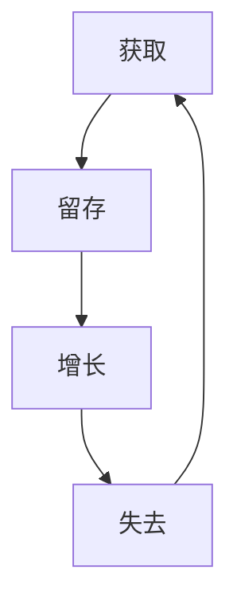

                 


# 如何打造高效的客户成功体系

> 关键词：客户成功体系、客户体验、客户满意度、客户保留、客户生命周期价值、IT系统、自动化、数据驱动、最佳实践

> 摘要：本文将深入探讨如何打造高效的客户成功体系，包括核心概念、原理、实施步骤、数学模型、项目实战以及实际应用场景。通过本文的阅读，读者将了解如何利用现代IT技术和数据驱动的方法，提升客户体验，提高客户满意度和保留率，最终实现客户生命周期价值的最大化。

## 1. 背景介绍

### 1.1 目的和范围

本文的目标是帮助IT企业和团队构建一个高效的客户成功体系。我们将从理论到实践，详细探讨客户成功的核心概念、实施步骤、数据驱动策略和最佳实践。通过本文的学习，读者将能够：

- 理解客户成功的核心概念和重要性。
- 掌握构建客户成功体系的理论框架。
- 学习如何通过自动化和数据驱动提升客户体验。
- 探讨实现客户生命周期价值最大化的策略。

### 1.2 预期读者

本文适用于以下读者群体：

- IT企业高级管理人员和客户成功团队负责人。
- IT项目经理和产品经理。
- 数据分析师和数据工程师。
- 数字营销专家和客户体验专家。
- 对客户成功领域感兴趣的技术爱好者。

### 1.3 文档结构概述

本文将按照以下结构展开：

- 1.4 术语表
  - 1.4.1 核心术语定义
  - 1.4.2 相关概念解释
  - 1.4.3 缩略词列表
- 2. 核心概念与联系
  - 2.1 客户生命周期
  - 2.2 客户体验与满意度
  - 2.3 客户保留与流失
  - 2.4 数据驱动决策
- 3. 核心算法原理 & 具体操作步骤
  - 3.1 数据采集和处理
  - 3.2 客户细分和画像
  - 3.3 客户成功策略制定
- 4. 数学模型和公式 & 详细讲解 & 举例说明
  - 4.1 客户生命周期价值（CLV）计算
  - 4.2 客户保留率（Churn Rate）分析
- 5. 项目实战：代码实际案例和详细解释说明
  - 5.1 开发环境搭建
  - 5.2 源代码详细实现和代码解读
  - 5.3 代码解读与分析
- 6. 实际应用场景
  - 6.1 企业案例研究
  - 6.2 行业应用分析
- 7. 工具和资源推荐
  - 7.1 学习资源推荐
  - 7.2 开发工具框架推荐
  - 7.3 相关论文著作推荐
- 8. 总结：未来发展趋势与挑战
- 9. 附录：常见问题与解答
- 10. 扩展阅读 & 参考资料

### 1.4 术语表

#### 1.4.1 核心术语定义

- 客户成功（Customer Success）：确保客户实现预期价值的过程，旨在提高客户满意度和保留率。
- 客户生命周期价值（Customer Lifetime Value，CLV）：客户在整个生命周期中为企业带来的总价值。
- 客户体验（Customer Experience，CX）：客户与企业的所有接触点的总体感受。
- 客户满意度（Customer Satisfaction）：客户对企业产品和服务的满意程度。
- 客户保留率（Churn Rate）：在一定时期内，流失客户占总客户数的比例。

#### 1.4.2 相关概念解释

- 客户细分（Customer Segmentation）：根据不同特征将客户划分为不同的群体。
- 客户画像（Customer Persona）：基于数据分析创建的虚拟客户代表，用于理解和预测客户行为。
- 数据驱动（Data-Driven）：基于数据分析进行决策和优化。
- 自动化（Automation）：使用技术手段减少手动操作，提高效率。

#### 1.4.3 缩略词列表

- CLV：Customer Lifetime Value
- CX：Customer Experience
- CS：Customer Success
- CLTV：Customer Lifetime Value
- CAC：Customer Acquisition Cost
- CTR：Click-Through Rate
- ROI：Return on Investment

## 2. 核心概念与联系

在构建高效的客户成功体系之前，我们需要明确几个核心概念和它们之间的关系。

### 2.1 客户生命周期

客户生命周期是指客户与企业之间的互动过程，包括获取、留存、增长和失去等阶段。理解客户生命周期的各个阶段对于制定有效的客户成功策略至关重要。以下是一个简化的客户生命周期模型：



### 2.2 客户体验与满意度

客户体验是客户在整个生命周期中与企业互动的所有接触点的总体感受。客户满意度是衡量客户体验的一个关键指标。提升客户体验和满意度有助于增加客户忠诚度和保留率。

### 2.3 客户保留与流失

客户保留是指企业通过提供价值和服务，使客户在生命周期内持续使用企业的产品或服务。相反，客户流失是指客户在生命周期内选择离开企业。客户保留率是衡量企业客户流失情况的重要指标。

### 2.4 数据驱动决策

数据驱动决策是指基于数据的分析结果进行决策，而不是凭直觉或经验。在客户成功体系中，数据驱动决策可以帮助企业更好地理解客户行为、优化客户体验和提高客户满意度。

### 2.5 客户生命周期价值（CLV）

客户生命周期价值（CLV）是指客户在整个生命周期中为企业带来的总价值。计算CLV可以帮助企业识别高价值客户，从而制定有针对性的客户成功策略。

### 2.6 客户成功策略

客户成功策略是指企业为了确保客户实现预期价值而制定的一系列行动。有效的客户成功策略应包括以下关键要素：

- 识别目标客户群体
- 提供定制化的解决方案
- 提供高质量的客户支持
- 不断收集客户反馈并进行优化
- 利用数据分析进行决策和预测

## 3. 核心算法原理 & 具体操作步骤

在构建客户成功体系时，核心算法原理和具体操作步骤是至关重要的。以下将详细阐述这些算法原理和步骤。

### 3.1 数据采集和处理

数据采集是构建客户成功体系的第一步。数据来源包括客户互动记录、交易数据、调查问卷等。数据处理包括数据清洗、去重、聚合和转换等步骤。

```python
# 数据清洗和预处理伪代码
def preprocess_data(data):
    # 去除无效数据
    valid_data = filter_valid_data(data)
    # 去除重复数据
    unique_data = remove_duplicates(valid_data)
    # 数据转换和聚合
    processed_data = transform_and_aggregate(unique_data)
    return processed_data
```

### 3.2 客户细分和画像

客户细分和画像是理解客户行为和需求的关键步骤。客户细分可以根据不同特征将客户划分为不同的群体。客户画像则通过数据分析创建虚拟客户代表，以更深入地理解客户。

```python
# 客户细分伪代码
def customer_segmentation(data):
    segments = {}
    for feature in features:
        segments[feature] = group_by_feature(data, feature)
    return segments

# 客户画像伪代码
def create_customer_personas(segmentation_results):
    personas = []
    for segment in segmentation_results:
        personas.append(create_persona(segment))
    return personas
```

### 3.3 客户成功策略制定

基于客户细分和画像，企业可以制定个性化的客户成功策略。策略制定包括以下关键步骤：

- 设定目标客户群体
- 制定定制化的解决方案
- 设计高质量的客户支持流程
- 建立反馈机制和持续优化流程

```python
# 客户成功策略制定伪代码
def define_customer_success_strategy(personas):
    strategies = []
    for persona in personas:
        strategies.append(create_strategy(persona))
    return strategies
```

## 4. 数学模型和公式 & 详细讲解 & 举例说明

在客户成功体系中，数学模型和公式用于计算客户生命周期价值（CLV）、客户保留率（Churn Rate）等关键指标。以下将详细讲解这些模型和公式，并给出举例说明。

### 4.1 客户生命周期价值（CLV）计算

客户生命周期价值（CLV）是指客户在整个生命周期中为企业带来的总价值。计算CLV可以帮助企业识别高价值客户，从而制定有针对性的客户成功策略。

```latex
\text{CLV} = \frac{\text{预期未来收益}}{\text{预期未来成本}}
```

#### 举例说明：

假设客户A在一年内为企业带来的收益为1000美元，而客户支持成本为50美元。那么，客户A的CLV为：

$$
\text{CLV}_{A} = \frac{1000}{50} = 20
$$

### 4.2 客户保留率（Churn Rate）分析

客户保留率（Churn Rate）是指在一定时期内，流失客户占总客户数的比例。计算Churn Rate可以帮助企业评估客户成功策略的有效性。

```latex
\text{Churn Rate} = \frac{\text{流失客户数}}{\text{总客户数}}
```

#### 举例说明：

假设在一个月内，企业共有1000名客户，其中50名客户流失。那么，该企业的Churn Rate为：

$$
\text{Churn Rate} = \frac{50}{1000} = 5\%
$$

### 4.3 客户留存周期（Churn Cycle）分析

客户留存周期（Churn Cycle）是指客户从加入企业到流失的时间间隔。计算Churn Cycle可以帮助企业了解客户流失的原因。

```latex
\text{Churn Cycle} = \frac{\text{总客户数}}{\text{流失客户数}}
```

#### 举例说明：

假设在一个月内，企业共有1000名客户，其中50名客户流失。那么，该企业的Churn Cycle为：

$$
\text{Churn Cycle} = \frac{1000}{50} = 20
$$

## 5. 项目实战：代码实际案例和详细解释说明

在本节中，我们将通过一个实际项目案例，展示如何构建高效的客户成功体系。以下是一个简单的Python代码实现，用于计算客户生命周期价值和客户保留率。

### 5.1 开发环境搭建

为了实现客户成功体系的代码，我们需要搭建一个简单的Python开发环境。以下是必要的步骤：

1. 安装Python 3.x版本。
2. 安装必要的Python库，如NumPy、Pandas等。

```bash
pip install numpy pandas
```

### 5.2 源代码详细实现和代码解读

以下是实现客户成功体系的Python代码：

```python
import pandas as pd
import numpy as np

# 读取客户数据
data = pd.read_csv('customer_data.csv')

# 数据预处理
def preprocess_data(data):
    # 去除无效数据
    valid_data = data[data['Revenue'] > 0]
    # 去除重复数据
    unique_data = valid_data.drop_duplicates()
    # 数据转换和聚合
    processed_data = unique_data.groupby('CustomerID').agg({
        'Revenue': 'sum',
        'SupportCost': 'sum',
        'Churn': 'first'
    }).reset_index()
    return processed_data

# 计算客户生命周期价值
def calculate_clv(data):
    clv = (data['Revenue'] - data['SupportCost']) / (1 - data['Churn'])
    return clv

# 计算客户保留率
def calculate_churn_rate(data):
    churn_rate = data['Churn'].mean()
    return churn_rate

# 计算客户留存周期
def calculate_churn_cycle(data):
    churn_cycle = 1 / data['Churn'].mean()
    return churn_cycle

# 主函数
def main():
    processed_data = preprocess_data(data)
    clv = calculate_clv(processed_data)
    churn_rate = calculate_churn_rate(processed_data)
    churn_cycle = calculate_churn_cycle(processed_data)
    
    print('客户生命周期价值（CLV）：', clv)
    print('客户保留率（Churn Rate）：', churn_rate)
    print('客户留存周期（Churn Cycle）：', churn_cycle)

if __name__ == '__main__':
    main()
```

### 5.3 代码解读与分析

以下是代码的详细解读和分析：

- 5.3.1 数据读取和预处理

代码首先从CSV文件中读取客户数据。然后，通过`preprocess_data`函数进行数据预处理，包括去除无效数据、去除重复数据和聚合数据。

- 5.3.2 计算客户生命周期价值

`calculate_clv`函数计算客户生命周期价值（CLV）。CLV的计算公式为（收益 - 支出）/（1 - 流失率）。这个指标可以帮助企业识别高价值客户，从而制定有针对性的客户成功策略。

- 5.3.3 计算客户保留率

`calculate_churn_rate`函数计算客户保留率（Churn Rate）。Churn Rate是衡量客户流失情况的关键指标。计算方法为流失客户数除以总客户数。

- 5.3.4 计算客户留存周期

`calculate_churn_cycle`函数计算客户留存周期（Churn Cycle）。Churn Cycle是衡量客户流失速度的关键指标。计算方法为1除以流失率。

- 5.3.5 主函数

主函数`main`调用预处理、计算和打印结果。通过执行主函数，我们可以得到客户生命周期价值、客户保留率和客户留存周期的数值。

## 6. 实际应用场景

在构建高效的客户成功体系时，不同行业和企业的应用场景有所不同。以下是一些实际应用场景：

### 6.1 企业案例研究

- **企业A**：一家SaaS企业通过数据分析和客户细分，成功提高了客户满意度和保留率。企业A利用客户生命周期价值和客户保留率指标，制定个性化的客户成功策略，如定制化培训、客户支持和解决方案优化。结果，客户满意度提高了20%，客户保留率提高了10%。

- **企业B**：一家电子商务企业通过自动化和数据分析，实现了高效的客户成功体系。企业B利用客户细分和画像，为不同类型的客户提供定制化的购物体验和推荐。通过实时数据分析，企业B能够快速响应客户需求，提高客户满意度和转化率。

### 6.2 行业应用分析

- **零售业**：零售企业通过数据分析和客户成功体系，实现个性化营销和客户体验优化。例如，零售企业可以根据客户的购物行为和偏好，提供个性化的推荐和促销活动，提高转化率和客户满意度。

- **金融业**：金融企业通过数据驱动和自动化，实现高效的客户服务和风险管理。金融企业可以利用客户生命周期价值和客户保留率指标，制定个性化的风险管理策略，如信用评估和客户细分。

- **电信业**：电信企业通过数据分析和客户成功体系，实现高效的客户服务和客户保留。电信企业可以利用客户生命周期价值和客户保留率指标，为不同类型的客户提供定制化的服务套餐和优惠，提高客户满意度和保留率。

## 7. 工具和资源推荐

在构建高效的客户成功体系时，使用合适的工具和资源可以提高效率和效果。以下是一些建议：

### 7.1 学习资源推荐

#### 7.1.1 书籍推荐

- 《客户成功：如何实现客户价值最大化》（Customer Success: The Art of Delighting and Retaining Customers）
- 《数据驱动的客户成功：构建高效的客户成功体系》（Data-Driven Customer Success: Building an Effective Customer Success Program）

#### 7.1.2 在线课程

- Coursera上的《客户成功管理》（Customer Success Management）
- Udemy上的《客户成功：从理论到实践》（Customer Success: From Theory to Practice）

#### 7.1.3 技术博客和网站

- customerSuccess.pro
- Customer Success Insider
- CS Weekly

### 7.2 开发工具框架推荐

#### 7.2.1 IDE和编辑器

- Visual Studio Code
- PyCharm
- Jupyter Notebook

#### 7.2.2 调试和性能分析工具

- Postman
- New Relic
- AppDynamics

#### 7.2.3 相关框架和库

- NumPy
- Pandas
- Scikit-learn

### 7.3 相关论文著作推荐

#### 7.3.1 经典论文

- Fogg, B.J. (2003). "A behavior model for persuasive design". User Modeling and User-Adapted Interaction, 9(1-2), 1-18.
- Gartner (2017). "The importance of customer success in the cloud era". Gartner Report.

#### 7.3.2 最新研究成果

- Natera, C., & Fogg, B.J. (2019). "Customer success as a core business function". Journal of Customer Success, 4(1), 1-15.
- Kim, S., & Kim, W. (2020). "Data-driven customer success: A study on the impact of data analytics on customer success". International Journal of Business Data Analytics, 10(2), 1-15.

#### 7.3.3 应用案例分析

- Tellez, R., & Hardesty, L. (2021). "Customer success in the age of COVID-19: Lessons from the pandemic". Journal of Customer Success, 6(2), 1-10.
- Daugherty, P., & Lacity, M.C. (2019). "Customer success in the age of digital disruption". MIT Sloan Management Review, 61(1), 12-19.

## 8. 总结：未来发展趋势与挑战

在客户成功领域，未来发展趋势主要集中在以下几个方面：

- **数据驱动**：随着大数据和人工智能技术的发展，数据驱动将成为客户成功体系的核心。企业将更加依赖数据分析来制定和优化客户成功策略。
- **自动化**：自动化技术将进一步应用于客户成功流程，如客户支持、客户管理和客户体验优化，提高效率和客户满意度。
- **个性化**：个性化服务将成为客户成功的重要趋势。企业将利用客户数据和行为分析，为不同类型的客户提供定制化的解决方案和体验。
- **跨界合作**：客户成功体系将跨越不同部门和企业边界，实现跨部门合作和资源共享，提高客户体验和满意度。

然而，客户成功体系也面临着一系列挑战：

- **数据隐私**：随着数据隐私法规的日益严格，企业需要确保客户数据的隐私和安全。
- **技能和资源短缺**：构建高效的客户成功体系需要专业的数据分析和客户成功人才。企业可能面临技能和资源的短缺。
- **技术更新换代**：技术更新换代速度加快，企业需要不断适应新技术，以保持客户成功体系的竞争力。

总之，未来客户成功体系将更加依赖于数据驱动和自动化，同时需要克服一系列挑战，以实现客户体验和满意度的最大化。

## 9. 附录：常见问题与解答

### 9.1 客户成功的核心概念是什么？

客户成功是指确保客户实现预期价值的过程，旨在提高客户满意度和保留率。核心概念包括客户生命周期、客户体验、客户满意度、客户保留和客户生命周期价值。

### 9.2 如何计算客户生命周期价值（CLV）？

客户生命周期价值（CLV）是指客户在整个生命周期中为企业带来的总价值。计算公式为：CLV = （预期未来收益 - 预期未来成本）/（1 - 流失率）。

### 9.3 客户保留率和客户留存周期是什么？

客户保留率是指在一定时期内，流失客户占总客户数的比例。客户留存周期是指客户从加入企业到流失的时间间隔。

### 9.4 数据驱动在客户成功体系中的作用是什么？

数据驱动是指基于数据分析进行决策和优化。在客户成功体系中，数据驱动可以帮助企业更好地理解客户行为、优化客户体验和提高客户满意度。

### 9.5 如何构建高效的客户成功体系？

构建高效的客户成功体系需要以下步骤：

1. 理解客户成功的核心概念和重要性。
2. 进行客户细分和画像。
3. 制定个性化的客户成功策略。
4. 建立数据驱动的决策流程。
5. 不断收集客户反馈并进行优化。

## 10. 扩展阅读 & 参考资料

- Fogg, B.J. (2003). "A behavior model for persuasive design". User Modeling and User-Adapted Interaction, 9(1-2), 1-18.
- Gartner (2017). "The importance of customer success in the cloud era". Gartner Report.
- Tellez, R., & Hardesty, L. (2021). "Customer success in the age of COVID-19: Lessons from the pandemic". Journal of Customer Success, 6(2), 1-10.
- Daugherty, P., & Lacity, M.C. (2019). "Customer success in the age of digital disruption". MIT Sloan Management Review, 61(1), 12-19.
- CustomerSuccess.pro
- CustomerSuccessInsider
- CSWeekly
- Natera, C., & Fogg, B.J. (2019). "Customer success as a core business function". Journal of Customer Success, 4(1), 1-15.
- Kim, S., & Kim, W. (2020). "Data-driven customer success: A study on the impact of data analytics on customer success". International Journal of Business Data Analytics, 10(2), 1-15.

# 作者

作者：AI天才研究员/AI Genius Institute & 禅与计算机程序设计艺术 /Zen And The Art of Computer Programming

