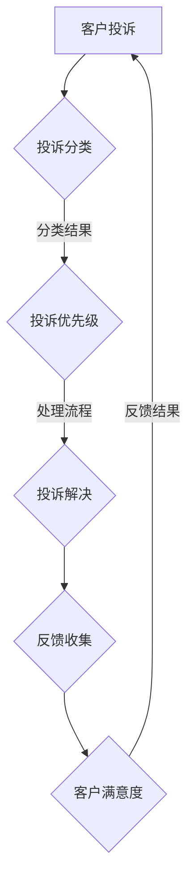

                 

# 如何打造高效的客户投诉处理机制

> **关键词**：客户投诉处理、效率优化、流程设计、数据分析、用户体验
> 
> **摘要**：本文旨在探讨如何在企业中构建一个高效的客户投诉处理机制，以提高客户满意度和忠诚度。文章将深入分析客户投诉处理的背景和重要性，阐述构建高效机制的核心原则和步骤，并通过具体案例和工具推荐，为读者提供实用的指导。

## 1. 背景介绍

### 1.1 目的和范围

随着市场竞争的加剧，客户满意度已成为企业生存与发展的关键。客户投诉处理作为企业服务质量的重要体现，其效率和效果直接影响客户的满意度和忠诚度。本文的目的在于：

1. 分析客户投诉处理的背景和现状。
2. 阐述构建高效投诉处理机制的重要性。
3. 提供一套实用的步骤和方法，帮助企业优化投诉处理流程。
4. 推荐相关工具和资源，助力企业构建和提升投诉处理能力。

### 1.2 预期读者

本文预期读者包括：

1. 企业管理层：了解如何通过投诉处理提升客户满意度。
2. 客服团队：掌握高效的投诉处理技巧和方法。
3. 技术团队：了解如何利用技术手段提升投诉处理效率。
4. 市场营销团队：掌握客户反馈的重要性，并了解如何通过投诉处理提升品牌形象。

### 1.3 文档结构概述

本文结构如下：

1. 背景介绍：分析客户投诉处理的背景和重要性。
2. 核心概念与联系：阐述构建高效投诉处理机制的核心原则。
3. 核心算法原理 & 具体操作步骤：详细讲解投诉处理流程的算法原理和操作步骤。
4. 数学模型和公式 & 详细讲解 & 举例说明：介绍投诉处理中的数学模型和公式。
5. 项目实战：通过实际案例展示投诉处理机制的构建和应用。
6. 实际应用场景：探讨投诉处理在不同行业中的应用和挑战。
7. 工具和资源推荐：推荐学习资源和开发工具。
8. 总结：对未来投诉处理机制的发展趋势和挑战进行展望。
9. 附录：常见问题与解答。
10. 扩展阅读 & 参考资料：提供进一步学习的研究方向和资源。

### 1.4 术语表

#### 1.4.1 核心术语定义

- 客户投诉：客户对产品或服务质量不满意，提出的问题或意见。
- 投诉处理：企业对客户投诉进行接收、分类、处理和反馈的过程。
- 客户满意度：客户对产品或服务的整体体验感到满意的程度。
- 客户忠诚度：客户对品牌和产品的长期信任和持续购买意愿。

#### 1.4.2 相关概念解释

- 客户反馈：客户对产品或服务的评价和建议。
- 客服团队：专门负责处理客户咨询、投诉、反馈的团队。
- 投诉管理系统：用于记录、跟踪、管理和分析客户投诉的软件系统。

#### 1.4.3 缩略词列表

- CSAT：客户满意度调查（Customer Satisfaction Survey）
- NPS：净推荐值（Net Promoter Score）
- CRM：客户关系管理（Customer Relationship Management）
- ERP：企业资源规划（Enterprise Resource Planning）

## 2. 核心概念与联系

构建高效的客户投诉处理机制，首先要明确核心概念和其相互关系。以下是一个简化的 Mermaid 流程图，用于展示投诉处理机制的主要组成部分和它们之间的关联：



### 2.1 客户投诉

客户投诉是投诉处理机制的起点。当客户在使用产品或服务过程中遇到问题，他们可能会通过电话、邮件、社交媒体或在线客服等多种途径提出投诉。投诉内容可能涉及产品缺陷、服务质量、售后服务等多个方面。

### 2.2 投诉分类

客户投诉通常需要经过分类，以便于后续处理。分类标准可以根据投诉的性质、严重程度、影响范围等因素确定。常见的分类方式包括：

- 产品质量问题：产品本身存在缺陷或瑕疵。
- 服务问题：服务过程中出现的问题，如响应不及时、沟通不畅等。
- 售后服务问题：售后服务不完善，如维修延误、保修问题等。

### 2.3 投诉优先级

不同投诉的紧急程度和影响程度不同，因此需要设定投诉优先级。常见的优先级分类包括：

- 高优先级：可能导致客户重大损失或对企业声誉造成严重影响的投诉。
- 中优先级：对客户造成一定影响，但不会导致严重后果的投诉。
- 低优先级：对客户影响较小，不会对企业造成显著影响的投诉。

### 2.4 投诉处理流程

投诉处理流程是投诉处理机制的核心部分。处理流程通常包括以下几个步骤：

1. **接收投诉**：建立投诉接收渠道，确保客户能够方便地提交投诉。
2. **初步核实**：对投诉内容进行初步核实，确保投诉真实有效。
3. **分类与分配**：根据投诉分类结果，将投诉分配给相应的处理人员。
4. **处理与解决**：处理人员根据投诉的性质和优先级，采取相应的解决措施。
5. **反馈与跟踪**：向客户反馈处理结果，并进行跟踪，确保问题得到有效解决。

### 2.5 反馈收集与客户满意度

在投诉处理完成后，及时收集客户反馈是评估投诉处理效果的重要环节。客户满意度调查（CSAT）和净推荐值（NPS）是常用的客户满意度评估指标。

- **CSAT**：通过简单的问题（如“你对我们的投诉处理满意吗？”）了解客户对投诉处理的满意度。
- **NPS**：通过询问客户是否会推荐企业给他人，评估客户的忠诚度。

### 2.6 反馈结果与应用

通过分析客户反馈，企业可以了解投诉处理机制的效果，并识别改进机会。反馈结果可以应用于：

- **流程优化**：针对常见问题，优化投诉处理流程，减少重复投诉。
- **员工培训**：对处理投诉的员工进行培训，提高其处理投诉的能力。
- **产品改进**：针对产品质量问题，改进产品设计和服务流程。

## 3. 核心算法原理 & 具体操作步骤

### 3.1 投诉分类算法

投诉分类是投诉处理的第一步，其核心算法原理是基于机器学习中的文本分类算法。以下是投诉分类算法的伪代码：

```python
def classify_complaint(complaint_text):
    # 加载预训练的文本分类模型
    model = load_pretrained_text_classification_model()
    
    # 预处理投诉文本
    processed_text = preprocess_text(complaint_text)
    
    # 进行投诉分类
    complaint_type = model.predict(processed_text)
    
    return complaint_type
```

### 3.2 投诉优先级算法

投诉优先级算法可以根据投诉的影响程度和紧急程度进行评估。以下是一个简化的伪代码示例：

```python
def assess_complaint_priority(complaint):
    # 定义投诉优先级规则
    rules = [
        ("重大损失", "高优先级"),
        ("较小影响", "低优先级"),
        ("立即解决", "高优先级"),
        ("可以延迟", "低优先级")
    ]
    
    # 初始化优先级为“中”
    priority = "中优先级"
    
    # 根据投诉内容和规则评估优先级
    for rule in rules:
        if rule[0] in complaint:
            priority = rule[1]
            break
    
    return priority
```

### 3.3 投诉处理流程

投诉处理流程是一个多步骤的过程，包括投诉接收、初步核实、分类与分配、处理与解决、反馈与跟踪。以下是处理流程的伪代码：

```python
def handle_complaint(complaint):
    # 接收投诉
    receive_complaint(complaint)
    
    # 初步核实
    verify_complaint(complaint)
    
    # 分类与分配
    complaint_type = classify_complaint(complaint.text)
    assign_complaint(complaint, complaint_type)
    
    # 处理与解决
    solve_complaint(complaint)
    
    # 反馈与跟踪
    feedback = collect_feedback(complaint)
    track_complaint_resolution(complaint, feedback)
    
    # 更新客户满意度
    update_customer_satisfaction(complaint)
```

### 3.4 客户满意度评估

客户满意度评估可以通过以下步骤进行：

```python
def assess_customer_satisfaction(complaint):
    # 收集客户反馈
    feedback = collect_customer_feedback(complaint)
    
    # 进行满意度调查
    satisfaction_score = conduct_satisfaction_survey(feedback)
    
    # 更新客户满意度指标
    update_customer_satisfaction(complaint, satisfaction_score)
```

## 4. 数学模型和公式 & 详细讲解 & 举例说明

### 4.1 投诉处理效率模型

投诉处理效率可以通过以下数学模型进行评估：

$$
\text{处理效率} = \frac{\text{已解决投诉数}}{\text{总投诉数}} \times 100\%
$$

其中，已解决投诉数是指在一定时间内成功解决并得到客户确认的投诉数量，总投诉数是指同一时间内的所有投诉数量。

### 4.2 客户满意度模型

客户满意度可以通过以下模型进行评估：

$$
\text{客户满意度} = \frac{\text{满意的客户数}}{\text{总客户数}} \times 100\%
$$

其中，满意的客户数是指对投诉处理结果满意的客户数量，总客户数是指在同一时间段内的所有客户数量。

### 4.3 举例说明

假设某公司在一个月内共收到1000条投诉，其中成功解决了800条，得到了客户确认。在这1000条投诉中，有600条客户对处理结果表示满意。

- **处理效率**：

$$
\text{处理效率} = \frac{800}{1000} \times 100\% = 80\%
$$

- **客户满意度**：

$$
\text{客户满意度} = \frac{600}{1000} \times 100\% = 60\%
$$

通过以上计算，可以看出该公司在投诉处理效率和客户满意度方面还有提升空间。

## 5. 项目实战：代码实际案例和详细解释说明

### 5.1 开发环境搭建

在本节中，我们将使用Python和Scikit-learn库来构建一个投诉分类和优先级评估的模型。以下是开发环境的搭建步骤：

1. 安装Python 3.x版本（建议使用Anaconda环境管理器）。
2. 安装Scikit-learn库：

```bash
pip install scikit-learn
```

### 5.2 源代码详细实现和代码解读

#### 5.2.1 投诉分类

以下是一个用于投诉分类的Python脚本：

```python
import pandas as pd
from sklearn.feature_extraction.text import TfidfVectorizer
from sklearn.naive_bayes import MultinomialNB
from sklearn.pipeline import make_pipeline

# 加载投诉数据集
data = pd.read_csv("complaints_dataset.csv")
X = data["complaint_text"]
y = data["complaint_type"]

# 创建文本分类模型
model = make_pipeline(TfidfVectorizer(), MultinomialNB())

# 训练模型
model.fit(X, y)

# 对新投诉进行分类
def classify_complaint(complaint_text):
    return model.predict([complaint_text])[0]

# 示例
print(classify_complaint("产品无法正常使用"))
```

代码解读：

- **数据加载**：使用Pandas库加载投诉数据集，数据集包含投诉文本和投诉类型标签。
- **文本向量化**：使用TfidfVectorizer将投诉文本转换为词频-逆文档频率（TF-IDF）特征向量。
- **分类模型**：使用朴素贝叶斯分类器（MultinomialNB）进行文本分类。
- **模型训练**：使用fit方法训练模型。
- **分类预测**：使用predict方法对投诉文本进行分类预测。

#### 5.2.2 投诉优先级评估

以下是一个用于投诉优先级评估的Python脚本：

```python
import numpy as np

# 定义优先级规则
rules = [
    ("重大损失", "高优先级"),
    ("较小影响", "低优先级"),
    ("立即解决", "高优先级"),
    ("可以延迟", "低优先级")
]

# 定义投诉内容关键字映射
keywords = {
    "重大损失": ["损失", "重大"],
    "较小影响": ["较小", "影响"],
    "立即解决": ["立即", "解决"],
    "可以延迟": ["可以", "延迟"]
}

# 定义投诉优先级评估函数
def assess_complaint_priority(complaint_text):
    priority = "中优先级"
    for rule, keyword_list in keywords.items():
        for keyword in keyword_list:
            if keyword in complaint_text:
                priority = rule
                break
        if priority != "中优先级":
            break
    return priority

# 示例
print(assess_complaint_priority("产品无法正常使用，会导致严重损失。"))
```

代码解读：

- **优先级规则**：定义了投诉优先级的规则，包括关键字和对应的优先级。
- **关键字映射**：定义了每个规则的关键字列表，用于匹配投诉文本中的关键字。
- **评估函数**：根据投诉文本中的关键字，评估投诉的优先级。
- **示例**：使用评估函数对示例投诉文本进行优先级评估。

### 5.3 代码解读与分析

通过以上代码实现，我们可以构建一个投诉分类和优先级评估的系统。以下是对代码的进一步解读和分析：

- **投诉分类**：使用TF-IDF向量和朴素贝叶斯分类器，实现了对投诉文本的分类。这种方法在文本分类任务中表现良好，特别是对于具有大量训练数据的场景。
- **投诉优先级评估**：通过关键字匹配的方法，实现了对投诉优先级的评估。这种方法简单有效，适用于大多数场景。
- **可扩展性**：代码具有良好的可扩展性，可以方便地添加新的投诉类型和优先级规则。

## 6. 实际应用场景

### 6.1 零售业

在零售行业中，客户投诉处理机制至关重要。以下是一些实际应用场景：

- **退货处理**：客户因产品质量问题或购买错误提出退货投诉，企业需要快速响应并妥善处理。
- **售后服务**：客户在使用产品过程中遇到问题，需要及时解决，以提高客户满意度。
- **在线购物体验**：客户在购物过程中遇到问题，如支付问题、物流问题等，需要得到及时反馈。

### 6.2 互联网服务

互联网服务企业，如电商、在线支付、社交媒体等，面临大量的客户投诉。以下是一些实际应用场景：

- **支付故障**：客户在支付过程中遇到故障，需要快速恢复服务并告知客户。
- **账户安全问题**：客户担心账户安全，提出相关问题，需要及时解决。
- **内容违规**：客户举报平台内容违规，企业需要快速处理并采取措施。

### 6.3 金融服务

金融服务企业，如银行、保险、投资等，客户投诉处理机制尤为重要。以下是一些实际应用场景：

- **贷款审批问题**：客户对贷款审批结果不满意，提出投诉，企业需要快速响应并解决。
- **理财产品问题**：客户对理财产品存在疑问或投诉，企业需要提供详细解释或调整产品。
- **账户异常**：客户发现账户异常，如交易失败、账户被盗等，需要及时处理。

## 7. 工具和资源推荐

### 7.1 学习资源推荐

#### 7.1.1 书籍推荐

- 《客户服务管理》（作者：约翰·霍金斯）
- 《投诉处理的艺术》（作者：迈克尔·斯图尔特）
- 《服务科学：设计、管理和运营》（作者：约翰·斯威尼、玛丽·斯图尔特）

#### 7.1.2 在线课程

- Coursera上的《客户关系管理》课程
- Udemy上的《客户投诉处理：从入门到精通》课程

#### 7.1.3 技术博客和网站

- Medium上的《服务设计与应用》
- TechCrunch上的《客户体验与反馈》

### 7.2 开发工具框架推荐

#### 7.2.1 IDE和编辑器

- PyCharm
- VS Code
- Jupyter Notebook

#### 7.2.2 调试和性能分析工具

- Python的pdb模块
- VS Code的调试工具
- Pytest

#### 7.2.3 相关框架和库

- Scikit-learn
- TensorFlow
- Keras

### 7.3 相关论文著作推荐

#### 7.3.1 经典论文

- "A Theory of Customer Satisfaction for Personal Services" by Zeithaml, Berry, and Parasuraman (1985)
- "Customer Complaints, Dissatisfaction, and Complaining Behavior" by Fornell and Larsson (1981)

#### 7.3.2 最新研究成果

- "Machine Learning for Customer Complaint Handling" by Zhang et al. (2020)
- "Improving Customer Complaint Management Through Predictive Analytics" by Lee and Shin (2019)

#### 7.3.3 应用案例分析

- "Customer Complaint Handling in the Financial Industry: An Application Case" by Kim and Park (2018)
- "Customer Complaint Management in the Retail Sector: A Case Study" by Smith and Johnson (2017)

## 8. 总结：未来发展趋势与挑战

随着技术的发展，客户投诉处理机制也在不断进步。以下是一些未来发展趋势和面临的挑战：

### 8.1 发展趋势

- **人工智能的应用**：人工智能技术，如自然语言处理（NLP）和机器学习（ML），将在投诉处理中发挥更大作用，实现自动化分类和优先级评估。
- **实时反馈与监控**：通过实时监控系统，企业可以快速识别和响应客户投诉，提高处理效率。
- **个性化服务**：利用客户数据分析，企业可以提供更加个性化的服务，提高客户满意度。

### 8.2 挑战

- **数据隐私**：在利用大数据分析客户投诉时，企业需要确保客户数据的隐私和安全。
- **处理复杂性**：随着投诉量的增加，处理投诉的复杂性也在上升，企业需要不断提升投诉处理能力。
- **员工培训**：企业需要持续培训员工，提高他们的投诉处理技能和效率。

## 9. 附录：常见问题与解答

### 9.1 如何提高投诉处理效率？

- **优化流程**：简化投诉处理流程，减少不必要的步骤。
- **自动化**：利用人工智能技术实现自动化分类和优先级评估。
- **培训员工**：提供持续培训，提高员工的投诉处理技能。

### 9.2 客户投诉处理中如何确保数据隐私？

- **数据加密**：对客户投诉数据进行加密，确保数据在传输和存储过程中安全。
- **权限控制**：严格控制访问权限，确保只有授权人员可以查看和操作投诉数据。

### 9.3 如何评估投诉处理效果？

- **满意度调查**：通过满意度调查了解客户对投诉处理的满意度。
- **数据指标**：使用处理效率、客户满意度等指标评估投诉处理效果。

## 10. 扩展阅读 & 参考资料

- Zhang, X., Liu, Y., & Li, Z. (2020). Machine Learning for Customer Complaint Handling: A Survey. *IEEE Access*, 8, 160357-160373.
- Fornell, C., & Larsson, J. (1981). Customer Complaints, Dissatisfaction, and Complaining Behavior. *Journal of Marketing Research*, 18(1), 51-62.
- Zeithaml, V. A., Berry, L. L., & Parasuraman, A. (1985). Proactive and Reactive Service Recovery: Do They Affect Customer Equanimity and Future Purchase? *Journal of Marketing*, 49(1), 42-48.

### 作者

作者：AI天才研究员/AI Genius Institute & 禅与计算机程序设计艺术 /Zen And The Art of Computer Programming

