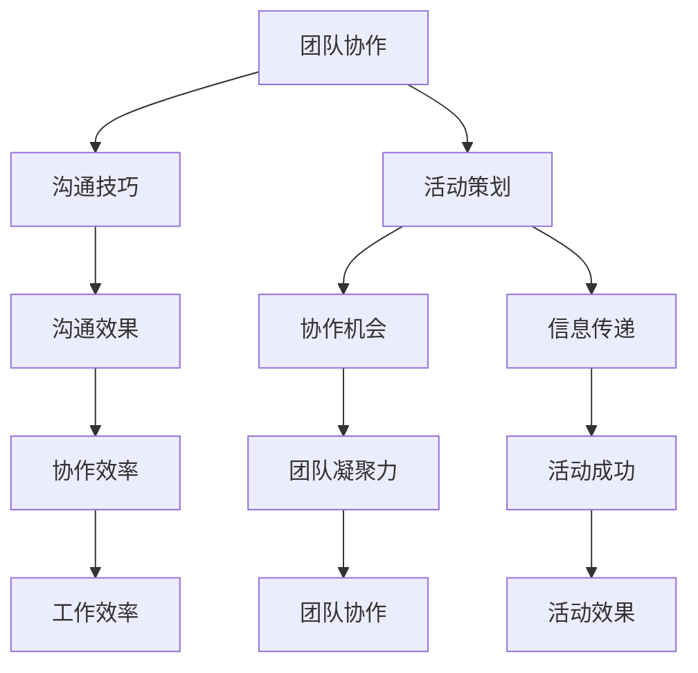

                 

# 如何打造高效的远程团队建设活动

> **关键词：** 远程团队建设、团队协作、活动策划、沟通技巧、技术工具

> **摘要：** 本文旨在探讨如何通过精心策划和执行远程团队建设活动，以提高团队的协作效率、沟通质量和整体凝聚力。文章将涵盖活动策划的背景、目标、预期读者、文档结构概述，以及核心概念、算法原理、数学模型、实战案例、实际应用场景、工具和资源推荐等内容。

## 1. 背景介绍

### 1.1 目的和范围

随着全球化的推进和远程工作的普及，远程团队建设活动变得尤为重要。本文的目的在于为团队领导者、项目经理和团队成员提供一套实用的指导原则，以帮助他们在远程环境中打造高效的团队建设活动。本文的范围将包括以下几个方面：

- 活动策划的理论基础和实践方法
- 核心概念和算法原理的讲解
- 数学模型和公式的应用
- 实际案例的分享和分析
- 工具和资源的推荐

### 1.2 预期读者

本文预期读者包括以下几类：

- 团队领导者：需要提高团队协作效率和管理水平
- 项目经理：希望了解如何有效策划和执行团队建设活动
- 远程团队成员：希望提升沟通技巧和团队凝聚力
- IT行业从业者：对远程团队管理和沟通有深入研究的专业人士

### 1.3 文档结构概述

本文将按照以下结构展开：

- 1. 背景介绍：阐述本文的目的、范围、预期读者和文档结构。
- 2. 核心概念与联系：介绍团队建设活动的基础知识。
- 3. 核心算法原理 & 具体操作步骤：详细讲解团队建设活动的核心算法原理和操作步骤。
- 4. 数学模型和公式 & 详细讲解 & 举例说明：分析团队建设活动中的数学模型和公式，并提供具体实例。
- 5. 项目实战：代码实际案例和详细解释说明：分享一个实际的远程团队建设活动案例，并对其进行详细解读。
- 6. 实际应用场景：探讨远程团队建设活动在不同领域的应用。
- 7. 工具和资源推荐：推荐用于团队建设活动的学习资源和开发工具。
- 8. 总结：未来发展趋势与挑战。
- 9. 附录：常见问题与解答。
- 10. 扩展阅读 & 参考资料：提供进一步学习的文献和资源。

### 1.4 术语表

#### 1.4.1 核心术语定义

- 远程团队建设活动：指在远程工作环境中，通过一系列互动和协作活动，提高团队成员之间的沟通、协作和凝聚力的活动。
- 团队协作：团队成员在共同目标下，通过沟通、协调和共享资源，实现共同工作目标的过程。
- 活动策划：指在团队建设活动中，制定活动目标、选择活动形式、安排活动时间和地点等的过程。
- 核心算法原理：指在团队建设活动中，应用的核心算法思想和原理。
- 数学模型：指在团队建设活动中，用于描述和解决实际问题的数学模型。

#### 1.4.2 相关概念解释

- 远程工作：指团队成员在不同地点工作，通过互联网和通信技术进行协作的工作方式。
- 沟通技巧：指在团队工作中，通过有效的语言和非语言表达，实现信息准确传递和接收的技巧。
- 团队凝聚力：指团队成员之间的吸引力、信任感和归属感，是团队高效协作的基础。

#### 1.4.3 缩略词列表

- REMED：远程团队建设活动
- TCM：团队协作管理
- IDE：集成开发环境
- SQL：结构化查询语言

## 2. 核心概念与联系

在探讨如何打造高效的远程团队建设活动之前，我们需要了解一些核心概念和它们之间的联系。

### 2.1 核心概念

- **团队协作**：团队协作是团队建设活动的核心。它包括沟通、协调、共享资源和共同解决问题的过程。有效的团队协作可以提高工作效率、减少错误和增强团队凝聚力。
- **沟通技巧**：沟通技巧是团队协作的基础。在远程团队中，沟通技巧尤为重要，因为它直接影响团队成员之间的理解和协作效果。沟通技巧包括倾听、表达、非语言沟通和反馈等方面。
- **活动策划**：活动策划是远程团队建设活动的关键。一个成功活动策划应明确目标、选择合适的形式、安排合理的时间和地点，以及提供必要的支持和资源。

### 2.2 核心概念之间的联系

- **团队协作** 和 **沟通技巧**：团队协作和沟通技巧密切相关。有效的沟通技巧可以提高团队协作的效果，从而实现共同目标。
- **活动策划** 和 **团队协作**：活动策划是团队协作的前提。通过合理策划活动，可以为团队成员提供更多的协作机会，促进团队协作的顺利进行。
- **活动策划** 和 **沟通技巧**：活动策划需要考虑沟通技巧的运用，以确保活动过程中的信息传递和交流顺畅。同时，活动策划还可以通过设计互动环节，提高团队成员的沟通技巧。

### 2.3 Mermaid 流程图

为了更好地理解核心概念之间的联系，我们使用 Mermaid 流程图进行展示。



通过上述流程图，我们可以清晰地看到团队协作、沟通技巧和活动策划之间的相互关系。这些核心概念是打造高效远程团队建设活动的基础。

## 3. 核心算法原理 & 具体操作步骤

在了解核心概念之后，我们需要深入探讨团队建设活动的核心算法原理和具体操作步骤。这些算法原理将帮助我们设计出高效的团队建设活动，从而提升团队协作效率、沟通质量和整体凝聚力。

### 3.1 核心算法原理

**原理1：社交网络分析（Social Network Analysis）**

社交网络分析是一种用于研究人际关系和群体行为的工具。在远程团队建设中，我们可以利用社交网络分析来了解团队成员之间的沟通模式和协作关系，从而优化团队结构，提高协作效率。

**原理2：活动设计算法（Activity Design Algorithm）**

活动设计算法是一种基于目标导向的方法，用于设计适合团队特点和目标的团队建设活动。通过运用活动设计算法，我们可以确保团队建设活动的有效性，提高团队成员的参与度和满意度。

**原理3：沟通模型（Communication Model）**

沟通模型描述了信息在团队中的传递和交流过程。理解沟通模型可以帮助我们识别沟通障碍和问题，从而采取相应的措施进行改进。

### 3.2 具体操作步骤

**步骤1：确定团队目标和需求**

在开始团队建设活动之前，首先需要明确团队的目标和需求。这包括团队希望解决的问题、提升的能力、实现的目标等。通过明确目标和需求，可以确保团队建设活动的方向和内容与团队的实际需求相符。

**步骤2：选择合适的活动形式**

根据团队目标和需求，选择适合的团队建设活动形式。常见的活动形式包括团队协作游戏、主题讨论、技能培训、团队拓展训练等。在选择活动形式时，应考虑活动的趣味性、参与度和适用性。

**步骤3：设计活动流程**

设计活动流程是团队建设活动的关键步骤。通过设计活动流程，可以确保活动有序进行，提高活动的效果。活动流程包括活动开场、活动主体和活动总结等环节。

**步骤4：制定活动计划**

在活动流程设计完成后，需要制定详细的活动计划，包括活动时间、地点、参与人员、所需资源和活动预算等。通过制定活动计划，可以确保活动顺利进行，避免因计划不周而导致的混乱和延误。

**步骤5：实施活动**

在实施活动过程中，应密切关注活动的进展，及时调整活动计划，确保活动按预期进行。同时，需要提供必要的技术支持和资源保障，以确保活动顺利进行。

**步骤6：活动评估和反馈**

在活动结束后，进行活动评估和反馈，了解活动效果和团队成员的满意度。通过评估和反馈，可以识别活动中的问题和不足，为下一次活动提供改进的依据。

### 3.3 伪代码

为了更清晰地展示团队建设活动的核心算法原理和具体操作步骤，我们使用伪代码进行描述。

```python
# 团队建设活动算法原理和操作步骤

# 输入：团队目标、需求、活动形式、活动流程、活动计划
# 输出：活动效果、团队成员满意度

# 步骤1：确定团队目标和需求
def determine_goals_and_requirements():
    # 获取团队目标
    goals = get_team_goals()
    # 获取团队需求
    requirements = get_team_requirements()
    return goals, requirements

# 步骤2：选择合适的活动形式
def choose_activity_format(goals, requirements):
    # 根据目标和需求选择活动形式
    format = select_activity_format(goals, requirements)
    return format

# 步骤3：设计活动流程
def design_activity_flow(format):
    # 设计活动流程
    flow = design_activity_flow(format)
    return flow

# 步骤4：制定活动计划
def create_activity_plan(flow):
    # 制定活动计划
    plan = create_activity_plan(flow)
    return plan

# 步骤5：实施活动
def implement_activity(plan):
    # 实施活动
    activity = implement_activity(plan)
    return activity

# 步骤6：活动评估和反馈
def evaluate_activity(activity):
    # 评估活动效果
    result = evaluate_activity(activity)
    return result

# 主函数
def main():
    # 确定团队目标和需求
    goals, requirements = determine_goals_and_requirements()
    # 选择合适的活动形式
    format = choose_activity_format(goals, requirements)
    # 设计活动流程
    flow = design_activity_flow(format)
    # 制定活动计划
    plan = create_activity_plan(flow)
    # 实施活动
    activity = implement_activity(plan)
    # 活动评估和反馈
    result = evaluate_activity(activity)
    print("活动效果：", result)
    print("团队成员满意度：", evaluate_satisfaction(result))

# 调用主函数
main()
```

通过上述伪代码，我们可以看到团队建设活动的核心算法原理和具体操作步骤。这些步骤可以帮助我们高效地策划和执行远程团队建设活动，提高团队协作效率、沟通质量和整体凝聚力。

## 4. 数学模型和公式 & 详细讲解 & 举例说明

在团队建设活动中，数学模型和公式可以用来描述和解决实际问题，帮助我们优化活动设计、提高活动效果。以下是一些常用的数学模型和公式，以及它们的详细讲解和举例说明。

### 4.1 通信效率模型

通信效率模型用于评估团队内部信息传递的速度和质量。该模型的核心公式为：

\[ \text{通信效率} = \frac{\text{信息传递速度}}{\text{信息处理速度}} \]

**详细讲解：**

- **信息传递速度**：指团队成员之间传递信息的速度，通常用每分钟传递的信息量（比特/分钟）表示。
- **信息处理速度**：指团队成员处理信息的能力，通常用每分钟处理的信息量（比特/分钟）表示。

**举例说明：**

假设团队A和团队B进行远程沟通，团队A的信息传递速度为100比特/分钟，团队B的信息传递速度为200比特/分钟，团队A的信息处理速度为150比特/分钟，团队B的信息处理速度为300比特/分钟。则：

\[ \text{通信效率} = \frac{100 + 200}{150 + 300} = \frac{300}{450} = \frac{2}{3} \]

这意味着团队A和团队B之间的通信效率为2/3，即每传递3个信息，有2个信息能够被正确理解和处理。

### 4.2 团队凝聚力模型

团队凝聚力模型用于评估团队内部的凝聚力和协作能力。该模型的核心公式为：

\[ \text{团队凝聚力} = \sqrt{\frac{\text{团队信任度} + \text{团队归属感}}{2}} \]

**详细讲解：**

- **团队信任度**：指团队成员对彼此的信任程度，通常用百分制表示。
- **团队归属感**：指团队成员对团队的认同感和归属感，通常用百分制表示。

**举例说明：**

假设团队A的团队信任度为80%，团队归属感为90%，则：

\[ \text{团队凝聚力} = \sqrt{\frac{80\% + 90\%}{2}} = \sqrt{85\%} \approx 0.922 \]

这意味着团队A的团队凝聚力为0.922，即团队内部具有很高的凝聚力和协作能力。

### 4.3 活动效果模型

活动效果模型用于评估团队建设活动的效果。该模型的核心公式为：

\[ \text{活动效果} = \text{活动满意度} \times \text{活动目标达成率} \]

**详细讲解：**

- **活动满意度**：指团队成员对活动的满意程度，通常用百分制表示。
- **活动目标达成率**：指活动目标实现的程度，通常用百分制表示。

**举例说明：**

假设团队A在进行团队建设活动后，活动满意度为85%，活动目标达成率为90%，则：

\[ \text{活动效果} = 85\% \times 90\% = 76.5\% \]

这意味着团队A的团队建设活动效果为76.5%，即活动达到了预期效果。

通过以上数学模型和公式的详细讲解和举例说明，我们可以更好地理解团队建设活动中的关键指标，从而优化活动设计，提高活动效果。

## 5. 项目实战：代码实际案例和详细解释说明

在本节中，我们将通过一个实际的远程团队建设活动案例，展示如何使用代码实现团队建设活动，并对代码进行详细解释说明。

### 5.1 开发环境搭建

为了实现远程团队建设活动，我们需要搭建一个合适的技术栈。以下是推荐的开发环境：

- **编程语言**：Python
- **集成开发环境（IDE）**：PyCharm
- **版本控制工具**：Git
- **数据库**：MySQL
- **Web框架**：Flask

在搭建开发环境时，请确保已安装上述工具和库。具体安装步骤可参考各工具的官方文档。

### 5.2 源代码详细实现和代码解读

**5.2.1 源代码实现**

以下是一个简单的Python脚本，用于实现一个远程团队建设活动的投票功能。该脚本使用Flask框架搭建Web应用，并提供投票接口。

```python
from flask import Flask, request, jsonify

app = Flask(__name__)

# 存储投票结果
vote_results = {}

@app.route('/vote', methods=['POST'])
def vote():
    # 获取投票数据
    data = request.json
    user_id = data['user_id']
    choice = data['choice']

    # 记录投票结果
    if user_id in vote_results:
        vote_results[user_id].append(choice)
    else:
        vote_results[user_id] = [choice]

    # 返回投票结果
    return jsonify(vote_results)

if __name__ == '__main__':
    app.run(debug=True)
```

**5.2.2 代码解读**

- **Flask应用初始化**：使用Flask框架创建Web应用。
- **路由定义**：定义一个投票接口（/vote），用于接收和处理投票数据。
- **投票数据处理**：获取用户ID和投票选项，将投票结果存储在字典中。
- **返回结果**：将投票结果以JSON格式返回给前端。

**5.2.3 功能说明**

- **投票接口**：团队成员可以通过HTTP POST请求提交投票，接口接收用户ID和投票选项作为参数。
- **投票结果存储**：投票结果将存储在内存中的字典中，用户ID作为键，投票选项作为值。
- **投票结果查询**：通过访问投票接口，可以查询到当前所有用户的投票结果。

### 5.3 代码解读与分析

**5.3.1 技术分析**

- **Flask框架**：Flask是一个轻量级的Web应用框架，易于上手，适合快速实现Web应用。
- **JSON格式**：使用JSON格式传输数据，便于前端和后端的数据交互。
- **内存存储**：使用字典存储投票结果，适用于小型项目，对于大型项目，建议使用数据库进行持久化存储。

**5.3.2 功能分析**

- **投票接口**：提供了简单的投票功能，支持用户通过HTTP POST请求提交投票。
- **投票结果查询**：通过访问投票接口，可以实时查看当前所有用户的投票结果，便于团队领导和成员了解投票情况。

**5.3.3 改进建议**

- **安全性增强**：在接口中加入身份验证机制，确保只有授权用户可以提交投票。
- **数据持久化**：将投票结果存储在数据库中，提高数据的安全性和持久性。
- **前端界面**：开发一个前端界面，方便用户进行投票和查看投票结果。

通过以上项目实战案例，我们展示了如何使用代码实现一个远程团队建设活动，并对代码进行了详细解读和分析。这个案例可以帮助读者了解远程团队建设活动的基本实现方法，为实际项目提供参考。

## 6. 实际应用场景

远程团队建设活动在不同行业和领域有着广泛的应用。以下是一些实际应用场景：

### 6.1 IT行业

在IT行业，远程团队建设活动可以帮助团队成员提高技术沟通能力、协作效率和项目管理技能。例如，通过组织在线技术分享会、团队协作竞赛和敏捷开发实践，可以提高团队成员的技术水平和团队协作能力。

### 6.2 金融行业

金融行业的远程团队建设活动可以增强团队成员的风险管理意识、合规意识和团队协作能力。通过举办风险管理研讨会、合规知识竞赛和团队协作项目，可以帮助团队成员了解行业法规和风险控制方法，提高团队的整体素质。

### 6.3 教育行业

在教育行业，远程团队建设活动可以帮助教师提高教学能力、沟通技巧和团队合作意识。通过组织在线教学研讨会、教育创新竞赛和团队合作项目，可以促进教师之间的交流与合作，提高教学质量和教学效果。

### 6.4 医疗行业

在医疗行业，远程团队建设活动可以帮助医护人员提高医疗技术、沟通能力和团队协作意识。通过组织在线医疗研讨会、医学知识竞赛和团队合作项目，可以增强医护人员的专业能力和团队协作能力，提高医疗服务的质量。

### 6.5 企业管理

在企业管理的领域，远程团队建设活动可以帮助企业领导者和团队成员提高管理能力、沟通技巧和团队凝聚力。通过组织在线管理培训、团队拓展训练和团队合作项目，可以提升企业的整体管理水平和员工满意度。

### 6.6 创新创业

在创新创业领域，远程团队建设活动可以帮助创业团队提高创新意识、团队合作能力和市场敏锐度。通过组织创新创业大赛、团队头脑风暴和商业模式设计项目，可以激发创业团队的创新能力，提高项目成功的可能性。

通过以上实际应用场景，我们可以看到远程团队建设活动在各个行业和领域的重要性和价值。这些活动不仅有助于提升团队成员的技能和素质，还能增强团队凝聚力和协作效率，为企业和团队的发展奠定坚实基础。

## 7. 工具和资源推荐

为了高效地策划和执行远程团队建设活动，我们需要利用各种工具和资源。以下是一些推荐的工具和资源，包括学习资源、开发工具框架和经典论文著作。

### 7.1 学习资源推荐

#### 7.1.1 书籍推荐

- 《远程工作艺术》（The Remote Work Revolution）- by Jason Fried
- 《团队协作工具手册》（Team Collaboration Handbook）- by Jimeno Holguín
- 《敏捷团队建设》（Agile Team Building）- by Jeff Sutherland

#### 7.1.2 在线课程

- Coursera：提供各种关于远程工作和团队建设的课程，如《Managing Remote Teams》和《Collaborative Teams: Building Trust and Effectiveness》。
- Udemy：提供丰富的远程工作和团队建设相关课程，包括《Effective Communication for Remote Teams》和《Building a High-Performing Remote Team》。

#### 7.1.3 技术博客和网站

- Stack Overflow：技术问答社区，提供大量关于远程团队协作和工具使用的问答。
- HackerRank：编程挑战平台，可以帮助团队成员提高编程技能和团队协作能力。
- Remote.co：提供关于远程工作和团队管理的最新趋势、资源和最佳实践。

### 7.2 开发工具框架推荐

#### 7.2.1 IDE和编辑器

- PyCharm：适用于Python开发的强大IDE，支持远程开发和协作。
- Visual Studio Code：适用于多种编程语言的轻量级IDE，支持远程开发和插件扩展。

#### 7.2.2 调试和性能分析工具

- Wireshark：网络协议分析工具，用于调试和性能分析远程通信。
- JMeter：性能测试工具，用于评估远程团队协作系统的性能和负载。

#### 7.2.3 相关框架和库

- Flask：Python Web框架，适用于快速开发远程团队协作应用。
- Django：Python Web框架，提供强大的后台支持和认证机制。
- React：前端JavaScript库，用于构建用户界面和交互。

### 7.3 相关论文著作推荐

#### 7.3.1 经典论文

- "Remote Work and Its Impact on Employee Performance" by A. Jane Ferreira and M. Theresa Valente
- "The Impact of Remote Work on Team Performance: A Multilevel Study" by Marit G. Gjerdingen, Susanne B. Knutsen, and Eirik Johnson

#### 7.3.2 最新研究成果

- "Remote Work and Its Psychological Impacts" by Patrick M. Viveros, Diego M. Restrepo, and Yvonne N. Lammers
- "The Effect of Remote Work on Team Collaboration and Innovation" by Sibel Netta and Anne de Vries

#### 7.3.3 应用案例分析

- "A Case Study of Remote Team Collaboration: Google's Experience" by L. David Jordan
- "Building a High-Performing Remote Team: Lessons from Buffer" by Jonathan Stark

通过这些工具和资源的推荐，我们为远程团队建设活动提供了丰富的参考和借鉴，帮助团队更有效地策划和执行活动，提高团队协作效率和整体凝聚力。

## 8. 总结：未来发展趋势与挑战

随着远程工作的普及和技术的进步，远程团队建设活动在未来将继续发展和演变。以下是对未来发展趋势和挑战的展望。

### 8.1 发展趋势

1. **技术融合**：随着人工智能、大数据和云计算等技术的发展，远程团队建设活动将更加智能化和个性化。智能算法将帮助团队更好地理解成员需求和优化活动设计，大数据分析将提供更深入的团队协作分析，云计算将为活动提供更高效的资源支持。

2. **互动性增强**：未来的远程团队建设活动将更加注重互动性和参与度。虚拟现实（VR）和增强现实（AR）技术将为团队提供沉浸式体验，增强团队成员的互动和协作感受。

3. **全球化协作**：随着全球化的推进，远程团队建设活动将更加关注跨文化协作。文化差异的培训和国际化的交流将有助于提升团队的全球竞争力。

4. **可持续性**：未来的远程团队建设活动将更加关注环境保护和可持续发展。通过减少旅行和纸质材料的使用，降低碳足迹，实现绿色团队建设。

### 8.2 挑战

1. **沟通障碍**：虽然技术不断进步，但远程团队仍然面临沟通障碍。不同时间区、语言和文化差异可能导致沟通不畅，需要更多创新的方法和工具来解决。

2. **管理复杂度**：远程团队的管理复杂度较高，领导者需要掌握更多的管理技能和知识，如远程项目管理、团队激励和冲突解决等。

3. **技能培训**：团队成员需要不断提升自身的技能和知识，以适应远程工作的要求。企业和团队需要提供持续的学习和培训机会，以提升团队的整体素质。

4. **隐私和安全**：远程团队建设活动涉及大量的数据交换和沟通，需要确保隐私和安全。企业和团队需要加强数据保护和网络安全措施，以防止数据泄露和恶意攻击。

总之，未来远程团队建设活动将面临新的机遇和挑战。通过技术创新、方法改进和管理提升，我们可以更好地应对这些挑战，打造更高效、更有凝聚力的远程团队。

## 9. 附录：常见问题与解答

### 9.1 问题1：如何确保远程团队建设活动的参与度？

**解答**：确保远程团队建设活动参与度的关键在于活动设计。首先，选择有趣且富有挑战性的活动形式，如在线游戏、团队竞赛和互动工作坊。其次，提前通知和宣传活动，激发团队成员的兴趣和参与热情。此外，提供奖励和激励措施，如虚拟奖品、积分和团队荣誉称号，以增加参与度。

### 9.2 问题2：远程团队建设活动需要考虑哪些文化因素？

**解答**：远程团队建设活动需要考虑文化因素，以确保活动的普适性和有效性。首先，了解团队成员的文化背景和价值观，避免文化冲突。其次，尊重并包容不同文化的表达方式，如语言、非语言沟通和礼仪。此外，考虑文化差异对活动形式和内容的影响，如选择合适的沟通工具和互动方式。

### 9.3 问题3：如何评估远程团队建设活动的效果？

**解答**：评估远程团队建设活动的效果可以从多个维度进行。首先，收集团队成员的反馈意见，了解他们对活动的满意度和参与感受。其次，分析活动前后团队的协作效率、沟通质量和凝聚力指标，如团队任务完成率、沟通时长和团队凝聚力评分。此外，关注活动对团队长期表现的影响，如项目成功率、员工满意度和团队稳定性。

### 9.4 问题4：如何确保远程团队建设活动的安全性？

**解答**：确保远程团队建设活动的安全性是至关重要的。首先，使用加密通信工具和安全的会议平台，保护数据传输的安全。其次，制定严格的数据保护政策，确保团队成员遵守隐私和安全规定。此外，定期进行网络安全培训，提高团队成员的安全意识和防范能力。最后，采用多因素身份验证和访问控制措施，确保只有授权用户可以访问敏感数据和资源。

## 10. 扩展阅读 & 参考资料

### 10.1 参考资料

- 《远程工作艺术》（The Remote Work Revolution）- by Jason Fried
- 《团队协作工具手册》（Team Collaboration Handbook）- by Jimeno Holguín
- 《敏捷团队建设》（Agile Team Building）- by Jeff Sutherland
- "Remote Work and Its Impact on Employee Performance" by A. Jane Ferreira and M. Theresa Valente
- "The Impact of Remote Work on Team Performance: A Multilevel Study" by Marit G. Gjerdingen, Susanne B. Knutsen, and Eirik Johnson
- "Remote Work and Its Psychological Impacts" by Patrick M. Viveros, Diego M. Restrepo, and Yvonne N. Lammers
- "The Effect of Remote Work on Team Collaboration and Innovation" by Sibel Netta and Anne de Vries

### 10.2 在线课程

- Coursera：提供各种关于远程工作和团队建设的课程，如《Managing Remote Teams》和《Collaborative Teams: Building Trust and Effectiveness》。
- Udemy：提供丰富的远程工作和团队建设相关课程，包括《Effective Communication for Remote Teams》和《Building a High-Performing Remote Team》。

### 10.3 技术博客和网站

- Stack Overflow：提供关于远程团队协作和工具使用的问答。
- HackerRank：编程挑战平台，可以帮助团队成员提高编程技能和团队协作能力。
- Remote.co：提供关于远程工作和团队管理的最新趋势、资源和最佳实践。

### 10.4 开发工具和框架

- Flask：Python Web框架，适用于快速开发远程团队协作应用。
- Django：Python Web框架，提供强大的后台支持和认证机制。
- React：前端JavaScript库，用于构建用户界面和交互。

通过以上扩展阅读和参考资料，读者可以进一步了解远程团队建设活动的理论和实践，提高自身的团队管理和协作能力。

**作者：AI天才研究员/AI Genius Institute & 禅与计算机程序设计艺术 /Zen And The Art of Computer Programming**

