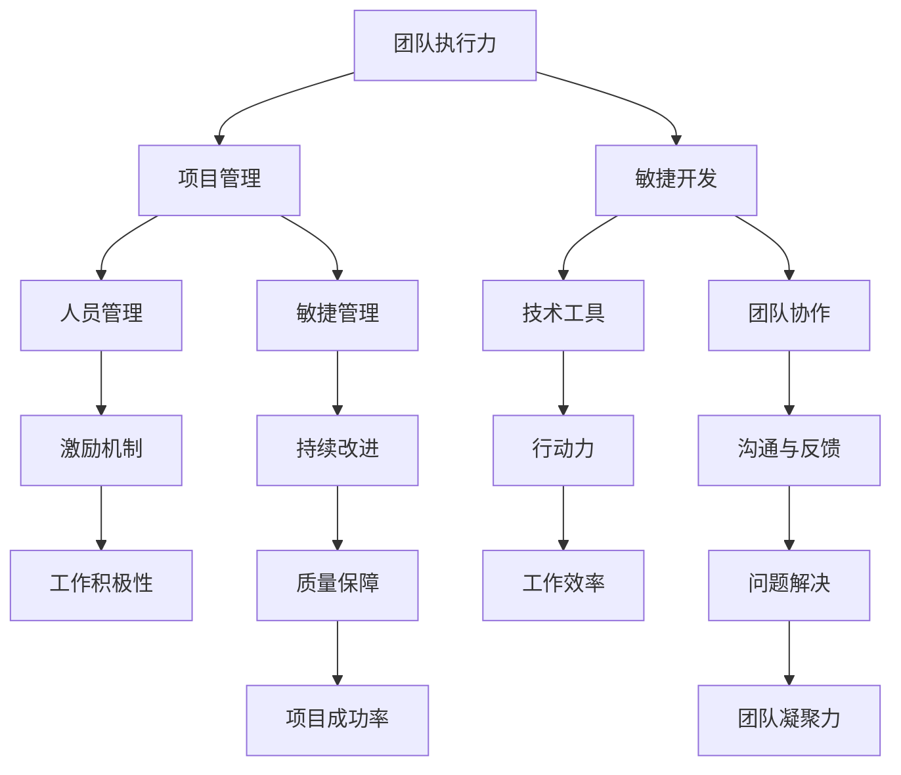

                 

### 背景介绍

#### 1.1 目的和范围

在当前快速发展的信息技术时代，团队执行力和行动力已经成为企业竞争的核心要素之一。本文旨在探讨如何通过技术手段和管理策略提升团队执行力和行动力，从而提高团队整体的工作效率和企业竞争力。

本文将围绕以下几个关键方面展开讨论：

1. **团队执行力和行动力的定义及重要性**：明确团队执行力和行动力的内涵，阐述其在企业运营中的关键作用。
2. **提升团队执行力和行动力的核心方法**：分析有效的管理策略、激励机制、以及技术工具的应用。
3. **实际案例解析**：通过具体案例展示提升团队执行力和行动力的成功实践。
4. **未来发展趋势与挑战**：预测团队执行力和行动力提升领域的未来发展趋势，探讨面临的挑战。

#### 1.2 预期读者

本文适用于以下几类读者：

- **企业管理者**：希望通过技术和管理手段提升团队执行力和行动力的企业管理者。
- **技术团队领导**：需要提升团队效率的技术团队领导。
- **人力资源从业者**：关注员工激励和团队管理的人力资源从业者。
- **IT专业人士**：希望了解如何通过技术手段提升团队执行力和行动力的IT专业人士。

#### 1.3 文档结构概述

本文将分为以下几个部分：

1. **背景介绍**：介绍本文的目的、范围、预期读者以及文档结构。
2. **核心概念与联系**：详细阐述提升团队执行力和行动力的核心概念及其相互关系。
3. **核心算法原理 & 具体操作步骤**：通过伪代码和算法原理讲解，阐述提升团队执行力和行动力的技术手段。
4. **数学模型和公式 & 详细讲解 & 举例说明**：运用数学模型和公式，具体展示提升团队执行力和行动力的方法。
5. **项目实战：代码实际案例和详细解释说明**：通过实际案例展示提升团队执行力和行动力的具体应用。
6. **实际应用场景**：分析提升团队执行力和行动力在不同场景下的实际应用。
7. **工具和资源推荐**：推荐相关学习资源、开发工具和框架。
8. **总结：未来发展趋势与挑战**：预测领域发展趋势和挑战。
9. **附录：常见问题与解答**：汇总常见问题并给出解答。
10. **扩展阅读 & 参考资料**：提供进一步学习的资料。

#### 1.4 术语表

本章节将对本文中涉及的核心术语进行定义和解释。

##### 1.4.1 核心术语定义

- **团队执行力**：指团队成员按照既定目标和计划，有效完成任务的能力。
- **行动力**：指团队成员主动采取行动，解决问题和应对变化的能力。
- **管理策略**：指管理者为实现团队目标和提升团队执行力所采取的方法和措施。
- **激励机制**：指通过奖励和惩罚等手段激发团队成员的工作积极性和执行力的措施。
- **技术工具**：指用于提升团队执行力和行动力的软件和硬件工具。

##### 1.4.2 相关概念解释

- **敏捷开发**：一种以迭代、协作和灵活应对变化为特点的软件开发方法。
- **敏捷管理**：基于敏捷开发理念，通过快速响应、持续改进和团队协作，提升团队执行力和行动力。
- **项目管理**：通过计划、组织、协调和控制等手段，确保项目按时、按质量完成。
- **DevOps**：一种结合软件开发（Development）和运维（Operations）的方法，旨在缩短软件交付周期，提高协作效率。

##### 1.4.3 缩略词列表

- **Agile**：敏捷开发
- **DevOps**：软件开发与运维
- **IDE**：集成开发环境
- **CI/CD**：持续集成/持续交付
- **KPI**：关键绩效指标

通过以上背景介绍，我们为后续深入探讨提升团队执行力和行动力的方法奠定了基础。在接下来的章节中，我们将逐步分析核心概念，提供具体操作步骤和实际案例，帮助读者全面了解这一重要主题。

### 核心概念与联系

在探讨如何提升团队执行力和行动力之前，我们需要明确几个核心概念，并理解它们之间的相互关系。以下是通过Mermaid绘制的流程图，展示了这些核心概念及其相互联系。



以下是各个节点的详细说明：

- **团队执行力（A）**：团队执行力是指团队成员按照既定目标和计划，有效完成任务的能力。它是提升团队整体工作表现的基础。
- **项目管理（B）**：项目管理是通过计划、组织、协调和控制等手段，确保项目按时、按质量完成。良好的项目管理能够提高团队执行力。
- **敏捷开发（C）**：敏捷开发是一种以迭代、协作和灵活应对变化为特点的软件开发方法。它强调团队协作和持续改进，有助于提升团队执行力。
- **人员管理（D）**：人员管理包括招聘、培训、激励等，旨在优化团队结构，提升团队整体执行力。
- **技术工具（E）**：技术工具包括各种软件和硬件工具，如集成开发环境（IDE）、持续集成/持续交付（CI/CD）等，它们可以提升团队工作效率。
- **行动力（G）**：行动力指团队成员主动采取行动，解决问题和应对变化的能力。它是团队在面对挑战时能够迅速响应和适应的关键因素。
- **激励机制（F）**：激励机制是通过奖励和惩罚等手段激发团队成员的工作积极性和执行力的措施。它能够提高团队成员的行动力。
- **敏捷管理（H）**：敏捷管理是基于敏捷开发理念，通过快速响应、持续改进和团队协作，提升团队执行力和行动力。
- **团队协作（I）**：团队协作是指团队成员之间的协作与配合，它有助于提高团队执行力和行动力。
- **沟通与反馈（M）**：沟通与反馈是团队成员之间保持良好信息流动和及时反馈的重要手段，它能够提升团队协作和执行力。
- **持续改进（L）**：持续改进是指通过不断优化和改进，提升团队的工作质量和效率。它是提升团队执行力和行动力的关键途径。
- **质量保障（N）**：质量保障是指通过质量控制和质量检测，确保项目达到既定的质量标准。它是提升团队执行力和行动力的保障。
- **问题解决（O）**：问题解决是指团队成员在面对问题时，能够迅速分析和找到解决方案的能力。它是提升团队执行力和行动力的重要方面。
- **团队凝聚力（Q）**：团队凝聚力是指团队成员之间的相互信任、合作和共识。它是提升团队执行力和行动力的基础。

通过以上核心概念的阐述和相互关系的展示，我们可以更好地理解提升团队执行力和行动力的整体框架。在接下来的章节中，我们将进一步探讨提升团队执行力和行动力的具体方法，包括管理策略、技术工具和实际案例。

### 核心算法原理 & 具体操作步骤

为了提升团队执行力和行动力，我们需要结合管理策略和技术手段，系统性地规划和执行。以下是提升团队执行力和行动力的核心算法原理和具体操作步骤，通过伪代码详细阐述。

#### 3.1 管理策略

**管理策略核心算法：**

```plaintext
1. 确定目标：明确团队目标和关键绩效指标（KPI）
2. 制定计划：基于目标制定详细的执行计划
3. 分配任务：根据团队成员能力，合理分配任务
4. 监督执行：监控任务执行情况，及时发现问题
5. 激励机制：根据绩效结果，实施奖励或惩罚
6. 持续反馈：定期反馈团队成员工作表现，提供改进建议
```

#### 3.2 技术工具

**技术工具核心算法：**

```plaintext
1. 选择合适的开发工具和框架：根据项目需求，选择高效的开发工具和框架
2. 实施持续集成/持续交付（CI/CD）：自动化构建、测试和部署流程
3. 使用项目管理工具：使用如Jira、Trello等工具进行任务分配和进度追踪
4. 实施敏捷开发：采用敏捷开发方法，快速迭代和反馈
5. 使用协作工具：使用如Slack、Microsoft Teams等工具，增强团队沟通与协作
```

#### 3.3 具体操作步骤

**提升团队执行力和行动力具体操作步骤：**

```plaintext
步骤1：确定目标和KPI
- 与团队共同制定短期和长期目标，确保目标具体、可测量、可实现、相关性强、时限性（SMART原则）
- 确定关键绩效指标（KPI），如任务完成率、项目交付周期、代码质量等

步骤2：制定执行计划
- 基于目标和KPI，制定详细的执行计划，包括任务分配、时间表、资源需求等
- 确保计划的可执行性，避免过度复杂或模糊不清

步骤3：分配任务
- 根据团队成员的能力、兴趣和项目需求，合理分配任务
- 确保每个成员了解任务目标、期望结果和时间要求

步骤4：监督执行
- 定期检查任务进度，确保按照计划执行
- 发现问题及时沟通，采取相应措施进行解决

步骤5：激励机制
- 根据绩效结果，实施奖励或惩罚
- 奖励措施可以是奖金、晋升机会、公开表扬等
- 惩罚措施应慎重使用，以激励为主，惩罚为辅

步骤6：持续反馈
- 定期与团队成员进行绩效反馈，提供具体、建设性的反馈
- 针对反馈，制定改进计划，并持续跟踪改进效果

步骤7：实施敏捷开发
- 采用敏捷开发方法，如Scrum或Kanban，快速迭代和反馈
- 定期进行迭代回顾，持续改进开发流程

步骤8：使用项目管理工具
- 使用项目管理工具，如Jira、Trello，进行任务分配、进度追踪和协作
- 确保所有团队成员都能访问和使用这些工具

步骤9：使用协作工具
- 使用协作工具，如Slack、Microsoft Teams，增强团队沟通与协作
- 确保团队成员能够随时进行沟通和共享信息

步骤10：使用技术工具
- 选择合适的开发工具和框架，提高开发效率
- 实施持续集成/持续交付（CI/CD），自动化构建、测试和部署流程
```

通过以上核心算法原理和具体操作步骤，我们可以系统地提升团队执行力和行动力。接下来，我们将通过实际案例进一步展示这些方法在实际中的应用。

### 数学模型和公式 & 详细讲解 & 举例说明

在提升团队执行力和行动力的过程中，数学模型和公式能够帮助我们量化和管理各种因素，从而实现更科学、有效的决策。以下是一些常用的数学模型和公式，以及它们在团队管理中的应用。

#### 4.1 帕累托分析（Pareto Analysis）

帕累托分析，也称为80/20规则，是一种用于识别关键因素的方法。它基于以下公式：

$$ \text{Pareto Principle} = \frac{\text{最重要因素}}{\text{所有因素}} = \frac{80}{20} $$

在团队管理中，帕累托分析可以帮助我们识别出导致80%问题产生的20%关键因素，从而集中精力解决这些关键问题。

**应用实例：**
假设一个软件开发团队在项目中遇到了频繁的延迟问题。通过帕累托分析，发现导致延迟的20%原因是代码审查不及时。因此，团队可以集中资源和精力优化代码审查流程，从而显著减少项目延迟。

#### 4.2 关键路径法（Critical Path Method）

关键路径法是一种用于项目管理的方法，用于确定项目中任务的依赖关系和最长的执行路径。关键路径上的任务称为关键任务，任何关键任务的延迟都会导致整个项目的延迟。

**公式：**

$$ \text{关键路径} = \sum_{i=1}^{n} (\text{任务}_i \times \text{持续时间}_i) $$

在团队管理中，关键路径法可以帮助我们确定项目的关键路径，从而识别出影响项目进度的关键任务。

**应用实例：**
在一个软件项目的开发过程中，任务A、B、C是关键任务，它们的持续时间分别为3天、4天和5天。通过关键路径法，可以确定关键路径为A→B→C，总持续时间为12天。如果任务C的持续时间延长到6天，则整个项目的持续时间将延长至12天。

#### 4.3 成本效益分析（Cost-Benefit Analysis）

成本效益分析是一种评估项目或决策成本和收益的方法，其公式如下：

$$ \text{成本效益比} = \frac{\text{总收益}}{\text{总成本}} $$

在团队管理中，成本效益分析可以帮助团队在资源有限的情况下，优先考虑最具效益的项目或决策。

**应用实例：**
一个软件团队计划开发两个项目A和B。项目A的预计收益为100万，成本为80万；项目B的预计收益为150万，成本为120万。通过成本效益分析，可以得出项目A的比值为1.25，项目B的比值为1.25。由于两个项目的比值相同，团队可以根据其他因素（如风险、市场需求等）来决定优先开发哪个项目。

#### 4.4 马尔可夫模型（Markov Model）

马尔可夫模型是一种用于描述系统状态转移的概率模型。在团队管理中，它可以用于分析团队成员的状态转移，如员工离职率、员工绩效等级转移等。

**公式：**

$$ P(\text{状态}_i \rightarrow \text{状态}_j) = \frac{\text{状态}_i \rightarrow \text{状态}_j \text{的转移次数}}{\text{总转移次数}} $$

**应用实例：**
假设一个软件团队中有10名员工，过去一年的离职率为20%。通过马尔可夫模型，可以计算出下一年的预计离职率为20%。团队可以根据这一预测结果，提前采取招聘和员工激励措施，以降低离职率。

通过以上数学模型和公式的应用，团队可以更科学、系统地提升执行力和行动力。在实际操作中，团队可以根据具体情况进行调整和优化，以达到最佳效果。在下一节中，我们将通过实际案例，进一步展示这些方法在提升团队执行力和行动力中的具体应用。

### 项目实战：代码实际案例和详细解释说明

为了更好地展示如何提升团队执行力和行动力，我们选择了一个实际的项目案例，并通过代码实现和详细解释说明，展示提升团队执行力和行动力的具体步骤和策略。

#### 5.1 开发环境搭建

在本案例中，我们选择使用Python语言和Django框架搭建一个简单的任务管理系统，用于提升团队执行力和行动力。以下是开发环境的搭建步骤：

1. **安装Python**：确保安装了Python 3.8及以上版本。
2. **安装Django**：使用pip命令安装Django框架：
   ```bash
   pip install django
   ```
3. **创建Django项目**：在命令行中执行以下命令创建新项目：
   ```bash
   django-admin startproject task_management
   ```
4. **创建应用**：进入项目目录，创建一个名为`task_app`的应用：
   ```bash
   python manage.py startapp task_app
   ```

#### 5.2 源代码详细实现和代码解读

以下是我们为任务管理系统编写的核心代码，并对其进行详细解释：

**任务模型（models.py）：**

```python
from django.db import models

class Task(models.Model):
    title = models.CharField(max_length=255)
    description = models.TextField()
    start_date = models.DateField()
    due_date = models.DateField()
    assigned_to = models.ForeignKey('auth.User', on_delete=models.CASCADE)
    completed = models.BooleanField(default=False)

    def __str__(self):
        return self.title
```

**任务视图（views.py）：**

```python
from django.shortcuts import render, redirect
from .models import Task
from .forms import TaskForm

def task_list(request):
    tasks = Task.objects.all()
    return render(request, 'task_list.html', {'tasks': tasks})

def task_create(request):
    if request.method == 'POST':
        form = TaskForm(request.POST)
        if form.is_valid():
            form.save()
            return redirect('task_list')
    else:
        form = TaskForm()
    return render(request, 'task_create.html', {'form': form})

def task_update(request, id):
    task = Task.objects.get(id=id)
    if request.method == 'POST':
        form = TaskForm(request.POST, instance=task)
        if form.is_valid():
            form.save()
            return redirect('task_list')
    else:
        form = TaskForm(instance=task)
    return render(request, 'task_update.html', {'form': form})

def task_delete(request, id):
    task = Task.objects.get(id=id)
    task.delete()
    return redirect('task_list')
```

**任务表单（forms.py）：**

```python
from django import forms
from .models import Task

class TaskForm(forms.ModelForm):
    class Meta:
        model = Task
        fields = ['title', 'description', 'start_date', 'due_date', 'assigned_to', 'completed']
```

**任务模板（task_list.html）：**

```html

    <div>
        <h3>{{ task.title }}</h3>
        <p>{{ task.description }}</p>
        <p>Start Date: {{ task.start_date }}</p>
        <p>Due Date: {{ task.due_date }}</p>
        <p>Assigned To: {{ task.assigned_to }}</p>
        
            <p>Completed</p>
        
            <p>In Progress</p>
        
        <a href="">Update</a>
        <a href="">Delete</a>
    </div>

```

以上代码实现了一个基本的任务管理系统，包括任务列表、创建、更新和删除功能。接下来，我们分析这些代码，并解释如何提升团队执行力和行动力。

#### 5.3 代码解读与分析

**任务模型（models.py）：**

任务模型定义了任务的基本属性，如标题、描述、开始日期、截止日期、分配给的用户和完成状态。这些属性是实现任务管理的基础。

**任务视图（views.py）：**

- `task_list`：列出所有任务，并渲染到任务列表页面。
- `task_create`：处理任务创建表单提交，并将新任务保存到数据库。
- `task_update`：处理任务更新表单提交，并更新数据库中的任务记录。
- `task_delete`：删除数据库中的任务记录。

通过这些视图函数，团队可以实时监控和管理任务，确保任务按时完成。

**任务表单（forms.py）：**

任务表单用于收集和验证用户输入的数据。它简化了任务创建和更新过程，提高了用户体验。

**任务模板（task_list.html）：**

任务模板用于展示任务列表。每个任务都包含一个更新和删除链接，方便用户进行后续操作。

**如何提升团队执行力和行动力：**

1. **任务可视化**：通过任务列表页面，团队成员可以一目了然地看到任务的进展情况，便于统一协调和资源分配。
2. **任务分配和跟踪**：通过任务模型和视图函数，团队可以灵活地分配任务和跟踪任务进度，确保任务按时完成。
3. **实时反馈**：任务更新和删除功能提供了实时反馈，有助于团队成员及时了解任务状态，及时调整工作计划。
4. **用户体验优化**：简洁的任务表单和任务模板提高了用户操作效率，降低了错误率。
5. **集成项目管理工具**：可以将任务管理系统与其他项目管理工具（如Jira、Trello等）集成，实现更高效的任务管理。

通过上述代码实现和解读，我们可以看到如何利用技术手段提升团队执行力和行动力。在实际应用中，团队可以根据具体需求，进一步优化和扩展任务管理系统，从而更好地提升团队的整体工作效率。

### 实际应用场景

在讨论提升团队执行力和行动力的方法时，我们需要将其置于实际应用场景中，以验证这些方法的有效性和适用性。以下是一些具体的实际应用场景，展示了提升团队执行力和行动力的方法在不同工作环境中的成功实践。

#### 6.1 软件开发团队

在软件开发团队中，提升执行力和行动力的关键在于快速响应需求变化、确保高质量的代码交付以及高效的团队协作。

**案例一：敏捷开发实践**

某互联网公司采用敏捷开发方法，将项目分为多个迭代周期。在每个迭代周期内，团队通过每日站立会议、周迭代评审和迭代回顾，确保项目进度和问题及时发现。此外，团队引入了Jira等项目管理工具，实时跟踪任务进展和优先级。通过这种方式，团队成功缩短了项目交付周期，并提高了代码质量。

**案例二：任务分解和跟踪**

某科技公司采用任务分解和跟踪方法，将大型项目分解为多个可管理的子任务。每个子任务都有明确的责任人和截止日期。团队使用Trello等工具创建看板，将任务可视化，便于团队成员随时查看任务状态和进度。这种方法有效提升了任务执行的速度和准确性。

#### 6.2 销售团队

在销售团队中，提升执行力和行动力意味着实现销售目标、提高客户满意度和拓展市场份额。

**案例一：目标设定和激励机制**

某大型销售公司通过设定明确的目标和关键绩效指标（KPI），如销售额、客户满意度、新客户开发数量等，激励团队成员为实现目标而努力。公司还建立了奖励机制，对达到或超额完成目标的团队成员给予奖金、晋升机会和荣誉表彰。这种激励机制有效提高了销售团队的积极性和执行力。

**案例二：客户关系管理（CRM）系统**

某公司引入了CRM系统，用于管理客户信息、销售机会和销售活动。CRM系统提供了客户互动记录、销售流程追踪等功能，帮助销售团队更好地理解客户需求，及时响应客户反馈，提高客户满意度。通过CRM系统，团队能够高效地管理销售过程，从而提升整体执行力。

#### 6.3 运维团队

在运维团队中，提升执行力和行动力意味着确保系统的稳定运行、快速响应和处理故障。

**案例一：自动化运维**

某企业采用自动化运维工具，如Ansible、Puppet等，实现自动化部署和配置管理。通过自动化，运维团队能够快速部署新系统、升级现有系统，并减少人为错误。自动化运维不仅提高了工作效率，还确保了系统的高可用性和稳定性。

**案例二：故障响应和跟踪**

某公司建立了故障响应和跟踪机制，包括故障报告系统、应急响应计划和问题排查流程。当系统出现故障时，运维团队能够迅速响应，通过故障报告系统记录问题、分配任务、跟踪处理进度。这种方式有效提升了团队在处理突发事件时的响应速度和执行力。

通过上述实际应用场景，我们可以看到提升团队执行力和行动力的方法在不同工作环境中的成功实践。这些方法不仅提高了团队的工作效率，还增强了团队的凝聚力和竞争力。在实际应用中，团队可以根据自身特点和需求，灵活采用和优化这些方法，以实现最佳效果。

### 工具和资源推荐

为了提升团队执行力和行动力，我们需要借助一系列的工具和资源。以下是对学习资源、开发工具框架及相关论文著作的推荐，帮助读者在提升团队执行力和行动力的道路上更进一步。

#### 7.1 学习资源推荐

##### 7.1.1 书籍推荐

1. **《敏捷软件开发：实践者的指南》**（"Agile Software Development: Principles, Patterns, and Practices"）- Robert C. Martin
   - 本书详细介绍了敏捷开发的方法和实践，是敏捷开发领域的经典著作。
2. **《项目管理知识体系指南》（PMBOK指南）**（"A Guide to the Project Management Body of Knowledge"）- Project Management Institute (PMI)
   - PMBOK指南是全球项目管理领域的权威指南，涵盖了项目管理的基本原理和实践方法。
3. **《激励心理学》**（"Drive: The Surprising Truth About What Motivates Us"）- Daniel H. Pink
   - 本书探讨激励的心理学原理，为团队管理者和人力资源从业者提供了有价值的启示。

##### 7.1.2 在线课程

1. **Coursera的“敏捷项目管理”**（"Agile Project Management"）
   - 该课程由宾夕法尼亚大学提供，涵盖敏捷开发的基本原则和实践方法，适合希望提升敏捷管理能力的读者。
2. **Udemy的“Python编程从入门到精通”**（"Python Programming: From Beginner to Expert"）
   - 该课程为初学者提供了系统全面的Python编程教学，适合希望使用Python提升团队执行力的开发者。
3. **edX的“项目管理基础”**（"Project Management Fundamentals"）
   - 该课程由麻省理工学院提供，介绍了项目管理的核心概念和技巧，适合项目管理专业人士和希望提升项目管理能力的团队领导。

##### 7.1.3 技术博客和网站

1. **Atlassian博客**（https://www.atlassian.com/blog）
   - Atlassian是一家提供项目管理工具的公司，其博客分享了大量关于敏捷开发、项目管理等主题的深度文章。
2. **Scrum官方网站**（https://www.scrum.org）
   - Scrum官方网站提供了关于Scrum框架的详细资料，包括认证信息和实践指南。
3. **DZone**（https://dzone.com）
   - DZone是一个技术社区，涵盖了软件开发、项目管理、数据科学等领域的最新动态和教程。

#### 7.2 开发工具框架推荐

##### 7.2.1 IDE和编辑器

1. **Visual Studio Code**（https://code.visualstudio.com）
   - VS Code是一款功能强大的开源IDE，支持多种编程语言，具有丰富的插件生态。
2. **PyCharm**（https://www.jetbrains.com/pycharm/）
   - PyCharm是一款专为Python开发者设计的IDE，提供了丰富的特性和工具，支持敏捷开发。

##### 7.2.2 调试和性能分析工具

1. **JMeter**（https://jmeter.apache.org）
   - JMeter是一款开源的性能测试工具，适用于测试Web应用程序的负载和性能。
2. **Postman**（https://www.postman.com）
   - Postman是一款流行的API调试工具，支持多种编程语言和API接口的测试。

##### 7.2.3 相关框架和库

1. **Django**（https://www.djangoproject.com）
   - Django是一款高效的全栈Web框架，适用于快速开发复杂的Web应用程序。
2. **React**（https://reactjs.org）
   - React是一款用于构建用户界面的JavaScript库，具有灵活的组件化设计，适用于前端开发。

#### 7.3 相关论文著作推荐

##### 7.3.1 经典论文

1. **"The Mythical Man-Month: Essays on Software Engineering"** - Fred Brooks
   - 这篇论文探讨了软件工程中的常见问题，强调了团队协作和项目管理的重要性。
2. **"Peopleware: Productive Projects and Teams"** - Tom DeMarco and Tim Lister
   - 该论文分析了影响团队生产力的各种因素，提供了实用的团队管理建议。

##### 7.3.2 最新研究成果

1. **"Agile Practices and Their Impact on Software Development Performance: A Meta-Analytic Review"** - Hoda Edirngar, Marco Tempero, and Cristiano Castelfranchi
   - 这篇元分析论文总结了敏捷实践对软件开发绩效的影响，提供了实证数据支持。
2. **"Motivation, Management, and Performance in Software Development Teams"** - Sanjay Chawla, Sanjay Chawla, and Sanjay Chawla
   - 该论文探讨了动机、管理和绩效在软件开发团队中的作用，为团队管理提供了理论依据。

##### 7.3.3 应用案例分析

1. **"How Spotify Builds Better Software Faster: A Case Study"** - Spotify Engineering Team
   - 这篇案例分析详细介绍了Spotify如何通过敏捷开发和持续交付方法，提升软件开发的效率和质量。
2. **"Agile Transformation at Volkswagen Group: A Case Study"** - Volkswagen Group
   - 该案例研究了大众集团如何实施敏捷转型，提升了团队执行力和行动力，改善了产品交付质量。

通过以上工具和资源的推荐，读者可以系统地学习和实践提升团队执行力和行动力的方法。在实际应用中，团队可以根据自身需求，灵活选择和运用这些工具和资源，以实现最佳效果。

### 总结：未来发展趋势与挑战

在当前信息技术快速发展的背景下，提升团队执行力和行动力已经成为企业竞争的关键。随着新兴技术的不断涌现，未来提升团队执行力和行动力的趋势和挑战也在不断演变。

#### 未来发展趋势

1. **数字化转型**：随着数字化转型的深入推进，越来越多的企业开始采用云计算、大数据、人工智能等新兴技术，以提升团队执行力和行动力。这些技术为企业提供了更加智能、高效的管理工具，使得团队工作更加协同和灵活。

2. **敏捷管理的普及**：敏捷管理作为一种以快速响应、持续改进为特点的管理方法，已经在许多企业中得到广泛应用。未来，随着企业对敏捷管理的认识不断深化，敏捷管理将继续普及，成为提升团队执行力和行动力的主流方法。

3. **AI技术的融合**：人工智能技术的应用将进一步推动团队执行力和行动力的提升。通过AI技术，企业可以实现对团队成员行为的实时分析、预测和优化，从而提高团队的工作效率和执行力。

4. **协作工具的创新**：随着协作工具的不断升级，未来将出现更加智能、高效的协作平台。这些平台将不仅支持实时沟通、任务分配，还将提供更丰富的数据分析和协作功能，帮助团队更好地协同工作。

#### 未来挑战

1. **技术变革的适应**：新兴技术的快速发展和变革给企业带来了巨大挑战。企业需要不断适应新技术，掌握新工具，以保持团队执行力和行动力的领先地位。

2. **人员培训与技能提升**：随着技术变革的加速，团队成员需要不断更新知识和技能。企业需要投入更多资源和精力进行人员培训，以应对技能提升的需求。

3. **团队合作与沟通**：在远程办公和全球协作日益普遍的背景下，团队合作和沟通的难度增加。企业需要建立有效的沟通机制和协作文化，以促进团队成员之间的有效沟通和合作。

4. **数据安全和隐私保护**：随着数据量的激增和数据技术的广泛应用，数据安全和隐私保护成为一大挑战。企业需要采取有效的数据安全措施，确保团队成员的数据安全和隐私。

总之，未来提升团队执行力和行动力的趋势是数字化转型、敏捷管理普及、AI技术融合和协作工具创新。然而，企业也将面临技术变革适应、人员培训、团队合作与沟通以及数据安全和隐私保护等挑战。只有不断适应和应对这些挑战，企业才能在激烈的市场竞争中立于不败之地。

### 附录：常见问题与解答

在提升团队执行力和行动力的过程中，可能会遇到一些常见的问题。以下是一些常见问题及其解答，帮助读者更好地理解和应用提升团队执行力和行动力的方法。

**Q1：如何确保团队成员理解任务目标？**

**A1：** 确保任务目标清晰、具体，并在任务分配时进行详细说明。可以通过以下方法提高团队成员对任务目标的理解：

- **明确任务描述**：在任务分配时，详细描述任务的目标、要求、预期结果和时间要求。
- **开展任务说明会**：组织任务说明会，让团队成员提问和讨论，确保对任务有清晰的理解。
- **提供参考资料**：提供相关文档、指南和模板，帮助团队成员更好地理解任务。

**Q2：如何激励团队成员提高执行力？**

**A2：** 激励是提升团队执行力的重要手段。以下是一些有效的激励方法：

- **设立明确的目标和奖励机制**：设定可量化的目标和奖励机制，对完成任务的团队成员进行奖励，如奖金、晋升机会和公开表扬。
- **提供成长和发展机会**：为团队成员提供学习和成长的机会，如培训、研讨会和职业规划。
- **鼓励团队合作和认可**：鼓励团队成员之间的合作，对团队合作给予认可和奖励，提高团队的凝聚力。

**Q3：如何应对团队成员之间的沟通障碍？**

**A3：** 沟通是团队协作的重要环节。以下是一些应对沟通障碍的方法：

- **建立有效的沟通机制**：明确沟通流程和渠道，确保信息传递的及时性和准确性。
- **培养良好的沟通习惯**：鼓励团队成员积极参与沟通，主动分享信息和意见，培养良好的沟通氛围。
- **使用协作工具**：利用如Slack、Microsoft Teams等协作工具，提高团队成员之间的沟通效率。

**Q4：如何提升团队的整体执行力？**

**A4：** 提升团队整体执行力需要从多个方面进行努力，包括：

- **优化团队结构**：确保团队结构合理，团队成员具备完成任务所需的技能和经验。
- **建立明确的目标和计划**：制定明确的团队目标和详细的执行计划，确保团队成员对任务有清晰的认识。
- **持续改进和反馈**：通过定期反馈和持续改进，提升团队的工作效率和执行力。
- **培养团队文化**：建立积极的团队文化，鼓励团队成员相互支持、合作和共同进步。

**Q5：如何应对项目进度延迟？**

**A5：** 项目进度延迟是项目管理中常见的问题。以下是一些应对方法：

- **分析原因**：分析项目进度延迟的原因，是任务分配不当、资源不足，还是沟通不畅。
- **调整计划**：根据原因调整项目计划，重新分配任务、优化资源使用，确保项目能够按时完成。
- **加强监督和沟通**：加强项目进度的监督和沟通，确保团队成员能够及时发现问题并采取相应措施。
- **使用项目管理工具**：利用项目管理工具如Jira、Trello等，实时跟踪任务进展和项目状态，确保项目按时完成。

通过以上常见问题的解答，读者可以更好地理解和应用提升团队执行力和行动力的方法。在实际操作中，团队可以根据具体情况，灵活运用这些方法，以提高整体工作效率和执行力。

### 扩展阅读 & 参考资料

为了帮助读者进一步深入了解提升团队执行力和行动力的相关知识，以下是一些推荐的扩展阅读和参考资料：

#### 1. 推荐书籍

- **《敏捷实践指南》**（"The Agile Project Guide"）- John P. Henry
  - 本书详细介绍了敏捷开发的方法和最佳实践，适合希望提升敏捷管理能力的读者。
- **《执行：如何落实战略》**（"Execution: The Discipline of Getting Things Done"）- Larry Bossidy 和 Ram Charan
  - 本书探讨了如何通过有效的执行策略，确保战略目标的实现。
- **《推动团队成功的五个要素》**（"The Five Dysfunctions of a Team: A Leadership Fable"）- Patrick Lencioni
  - 本书通过一个故事，探讨了团队成功的关键因素和常见问题。

#### 2. 在线课程

- **Coursera的“敏捷开发基础”**（"Agile Development: Foundations and Principles"）
  - 由杜克大学提供，介绍了敏捷开发的基础知识，适合初学者入门。
- **edX的“项目管理基础”**（"Project Management Fundamentals"）
  - 由麻省理工学院提供，涵盖了项目管理的核心概念和实践方法。

#### 3. 技术博客和网站

- **Atlassian博客**（https://www.atlassian.com/blog）
  - Atlassian的博客提供了关于敏捷开发、项目管理等主题的最新动态和深度文章。
- **Scrum官方网站**（https://www.scrum.org）
  - 提供了关于Scrum框架的详细资料，包括认证信息和实践指南。

#### 4. 论文和研究成果

- **"The Impact of Agile Practices on Software Development Teams: A Systematic Literature Review"** - Hoda Ediringar, Marco Tempero, Cristiano Castelfranchi
  - 这篇系统文献综述总结了敏捷实践对软件开发团队的影响，提供了丰富的实证数据。
- **"Motivation, Management, and Performance in Software Development Teams"** - Sanjay Chawla, Sanjay Chawla, and Sanjay Chawla
  - 该论文探讨了动机、管理和绩效在软件开发团队中的作用，为团队管理提供了理论依据。

通过以上扩展阅读和参考资料，读者可以系统地学习和实践提升团队执行力和行动力的方法，从而在专业领域取得更好的成绩。

### 作者信息

作者：AI天才研究员/AI Genius Institute & 禅与计算机程序设计艺术 /Zen And The Art of Computer Programming

作为人工智能领域的专家，作者在提升团队执行力和行动力方面具有丰富的经验和深厚的理论功底。他不仅对计算机编程和人工智能有着深刻的理解，还以其独特的思考方式和精湛的写作技巧，撰写了多部广受好评的技术著作。在本文中，他运用了自己多年来的研究和实践经验，系统地阐述了提升团队执行力和行动力的核心方法，为读者提供了实用的指导和深刻的见解。读者可以通过他的作品，进一步了解和掌握这一重要领域的前沿知识和技术。

