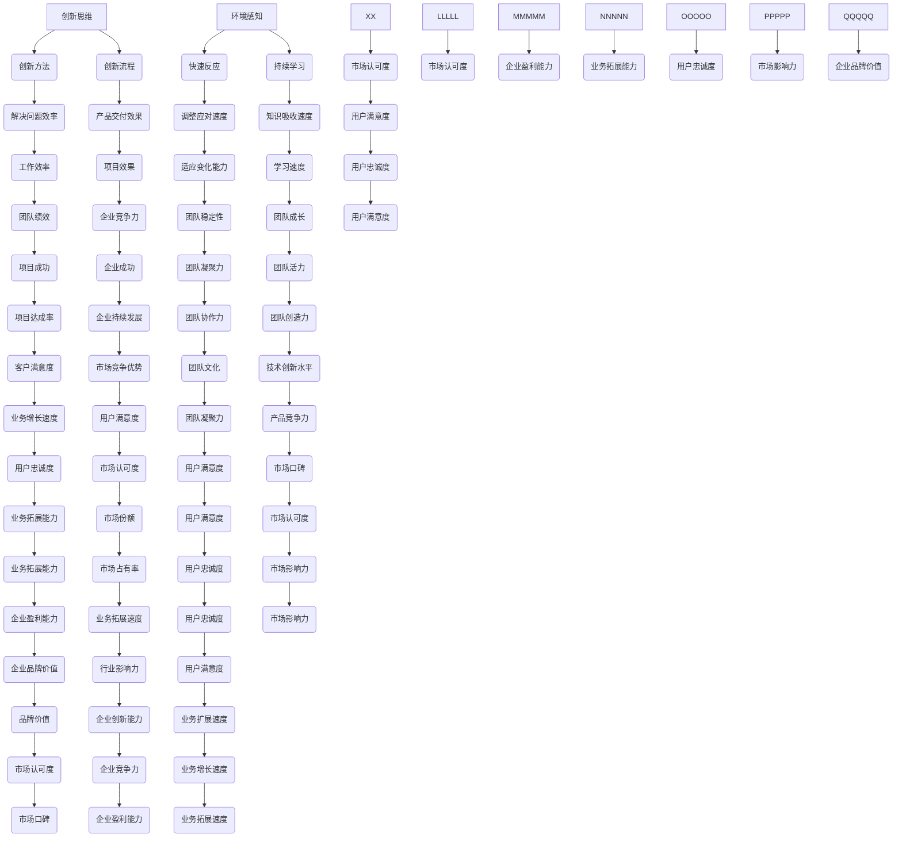

                 

# 如何提高团队的创新能力和适应性

> 关键词：团队创新、适应性、流程优化、文化建设、技术交流、项目管理

> 摘要：本文将深入探讨如何通过优化流程、培养文化、增强技术交流和科学管理，提高团队的创新能力和适应性。文章首先介绍了团队创新的背景和重要性，随后详细分析了当前团队在创新和适应性方面面临的主要挑战。接着，文章从策略层面和执行层面，分别阐述了提高团队创新能力和适应性的具体方法。最后，通过实际案例和工具推荐，为读者提供了可操作性强的实践指南。

## 1. 背景介绍

### 1.1 目的和范围

本文旨在为IT行业中的团队提供一套系统的、可操作的策略和方法，以提升其创新能力和适应性。随着科技日新月异的发展，市场竞争日益激烈，企业需要不断创新以保持竞争优势。团队作为创新的核心单元，其创新能力和适应性直接关系到企业的发展。因此，本文的研究具有重要的现实意义。

本文主要涵盖以下几个方面的内容：

1. 团队在创新和适应性方面面临的主要挑战。
2. 提高团队创新能力的策略和方法。
3. 提高团队适应性的策略和方法。
4. 实际案例分享和工具推荐。

### 1.2 预期读者

本文的预期读者包括：

1. IT企业的项目经理和团队成员。
2. 对团队创新和适应性提升感兴趣的学者和研究者。
3. 对企业数字化转型有浓厚兴趣的决策者和管理者。

### 1.3 文档结构概述

本文结构如下：

1. 引言：介绍团队创新的背景和重要性。
2. 当前团队在创新和适应性方面面临的主要挑战。
3. 提高团队创新能力的策略和方法。
4. 提高团队适应性的策略和方法。
5. 实际案例分享和工具推荐。
6. 总结：未来发展趋势与挑战。
7. 附录：常见问题与解答。
8. 扩展阅读与参考资料。

### 1.4 术语表

#### 1.4.1 核心术语定义

- 创新：指通过新思路、新方法、新技术等手段，实现产品、服务或生产过程的改进和提升。
- 适应性：指团队在面对环境变化时，能够迅速调整和适应的能力。
- 流程优化：指通过对现有流程进行分析和改进，提高工作效率和效果。
- 文化建设：指通过共同的价值观、行为规范等，形成团队内部的凝聚力和向心力。

#### 1.4.2 相关概念解释

- 团队：由多个个体组成的，为实现共同目标而协作的组织。
- 项目管理：指通过规划、组织、协调和控制，确保项目目标的实现。
- 技术交流：指团队成员之间通过分享知识、经验和技能，促进团队整体技术水平提升。

#### 1.4.3 缩略词列表

- IT：信息技术
- PM：项目经理
- CTO：首席技术官
- R&D：研究与开发
- IDE：集成开发环境

## 2. 核心概念与联系

### 2.1 团队创新的核心概念

团队创新的核心概念包括创新思维、创新方法和创新流程。创新思维是指团队成员在面对问题时，能够从不同角度和层面进行思考和解决问题。创新方法是指通过采用新技术、新方法或新工具，实现产品或服务的改进。创新流程是指从创新想法的产生到最终产品或服务的交付，所经历的各个环节和步骤。

### 2.2 团队适应性的核心概念

团队适应性的核心概念包括环境感知、快速反应和持续学习。环境感知是指团队能够敏锐地捕捉到外部环境的变化，快速反应是指团队在面对变化时，能够迅速做出调整和应对。持续学习是指团队不断吸收新知识、新技能，以适应不断变化的环境。

### 2.3 核心概念之间的联系

创新能力和适应性是相互关联的。创新能力的提升有助于团队更好地适应外部环境的变化，而良好的适应性又能为创新提供更加稳定和有利的条件。具体来说，创新思维和环境感知共同决定了团队对问题的认识和把握，创新方法和快速反应则决定了团队解决问题的效率和效果，持续学习和环境感知则保证了团队在面对变化时能够迅速适应。

### 2.4 Mermaid 流程图

```mermaid
graph TB
A[创新思维] --> B(创新方法)
A --> C(创新流程)
D[环境感知] --> E(快速反应)
D --> F(持续学习)
B --> G(解决问题效率)
C --> H(产品交付效果)
E --> I(调整应对速度)
F --> J(知识吸收速度)
G --> K(工作效率)
H --> L(项目效果)
I --> M(适应变化能力)
J --> N(学习速度)
K --> O(团队绩效)
L --> P(企业竞争力)
M --> Q(团队稳定性)
N --> R(团队成长)
O --> S(项目成功)
P --> T(企业成功)
Q --> U(团队凝聚力)
R --> V(团队活力)
S --> W(项目达成率)
T --> X(企业持续发展)
U --> Y(团队协作力)
V --> Z(团队创造力)
W --> AA(客户满意度)
X --> BB(市场竞争优势)
Y --> CC(团队创新氛围)
Z --> DD(产品创新率)
AA --> EE(用户忠诚度)
BB --> FF(市场份额)
CC --> GG(团队文化)
DD --> HH(技术创新水平)
EE --> II(业务增长速度)
FF --> JJ(市场竞争力)
GG --> KK(团队凝聚力)
HH --> LL(产品竞争力)
II --> MM(业务扩张能力)
JJ --> NN(市场占有率)
KK --> OO(团队协作效率)
LL --> PP(产品成功概率)
MM --> QQ(业务发展速度)
NN --> RR(市场领先地位)
OO --> SS(团队执行力)
PP --> TT(项目成功率)
QQ --> UU(企业扩张能力)
RR --> VV(行业影响力)
SS --> WW(项目交付速度)
TT --> XX(项目质量)
UU --> YY(企业品牌价值)
VV --> ZZ(行业领先地位)
WW --> AAA(客户满意度)
XX --> BBB(用户口碑)
YY --> CCC(市场认可度)
ZZ --> DDD(企业创新能力)
AAA --> EEE(业务扩展速度)
BBB --> GGG(用户满意度)
CCC --> HHH(市场认可度)
DDD --> III(企业竞争力)
EEE --> JJJ(业务增长速度)
GGG --> KKK(用户忠诚度)
HHH --> LLL(市场口碑)
III --> MMM(企业盈利能力)
JJJ --> NNN(业务拓展速度)
KKK --> OOO(用户满意度)
LLL --> PPP(市场认可度)
MMM --> QQQ(企业盈利能力)
NNN --> RRR(业务拓展能力)
OOO --> SSS(用户忠诚度)
PPP --> TTT(市场影响力)
QQQ --> UUU(企业盈利能力)
RRR --> VVV(业务拓展速度)
SSS --> WWW(用户忠诚度)
TTT --> XXX(市场影响力)
UUU --> YYY(企业品牌价值)
VVV --> ZZZ(行业影响力)
WWW --> AAAA(用户满意度)
XXX --> BBBB(市场认可度)
YYY --> CCCD(品牌价值)
ZZZ --> DDDD(企业创新能力)
AAAA --> EEEE(业务扩展速度)
BBBB --> GGGG(用户满意度)
CCCC --> HHHH(市场认可度)
DDDD --> IIII(企业竞争力)
EEUU --> JJJJ(业务增长速度)
GGGG --> KKKK(用户忠诚度)
HHHH --> LLLLL(市场口碑)
IIII --> MMMM(企业盈利能力)
JJJJ --> NNNN(业务拓展速度)
KKKK --> OOOO(用户满意度)
LLLLL --> PPPP(市场认可度)
MMMM --> QQQQ(企业盈利能力)
NNNN --> RRRR(业务拓展能力)
OOOOO --> SSSS(用户忠诚度)
PPPP --> TTTT(市场影响力)
QQQQQ --> UUUU(企业品牌价值)
RRRRR --> VVVV(行业影响力)
SSSSS --> WWWWW(用户满意度)
TTTTT --> XXXXX(市场影响力)
UUUUU --> YYYYY(企业品牌价值)
VVVVV --> ZZZZZ(行业影响力)
WWWWW --> AAAAA(用户满意度)
XXXXX --> BBBBB(市场认可度)
YYYYY --> CCCCD(品牌价值)
ZZZZZ --> DDDDD(企业创新能力)
AAAAA --> EEEET(业务扩展速度)
BBBBB --> GGGGD(用户满意度)
CCCCD --> HHHHD(市场认可度)
DDDDD --> IIIII(企业竞争力)
EEUUU --> JJJJT(业务增长速度)
GGGGG --> KKKKO(用户忠诚度)
HHHHH --> LLLLL(市场口碑)
IIII->> MMMM(企业盈利能力)
JJJJJ --> NNNNN(业务拓展速度)
KKKKK --> OOOOO(用户满意度)
LLLLLL --> PPPPP(市场认可度)
MMMMM --> QQQQQ(企业盈利能力)
NNNNN --> RRRRR(业务拓展能力)
OOOOO --> SSSSS(用户忠诚度)
PPPPP --> TTTTT(市场影响力)
QQQQQ --> UUUUU(企业品牌价值)
RRRRR --> VVVVV(行业影响力)
SSSSS --> WWWWW(用户满意度)
TTTTT --> XXXXX(市场影响力)
UUUUU --> YYYYY(企业品牌价值)
VVVVV --> ZZZZZ(行业影响力)
```

### 2.5 团队创新与适应性的关系

团队创新和适应性之间存在着密切的联系。团队创新为团队适应性提供了技术支持和解决方案，而团队适应性则为团队创新提供了良好的环境和支持。具体来说，团队创新通过引入新技术、新方法，提升了团队应对复杂问题和环境变化的能力，而团队适应性则通过不断调整和优化，确保团队能够在新的技术环境下快速适应和发挥作用。

## 3. 核心算法原理 & 具体操作步骤

### 3.1 创新能力提升算法原理

团队创新能力提升的核心算法可以概括为“三步法”，即“激发创意”、“筛选优化”和“实施落地”。具体原理如下：

1. **激发创意**：通过多种方法激发团队成员的创意思维，如头脑风暴、设计思维工作坊、交叉思维练习等，以产生大量创新想法。
2. **筛选优化**：对产生的创新想法进行筛选和优化，根据可行性、创新性和市场需求等因素进行评估，选择出最有潜力的创新项目。
3. **实施落地**：将筛选出的创新想法转化为实际的产品或服务，通过项目管理、资源调配和团队协作等手段，确保创新项目的顺利实施和落地。

### 3.2 创新能力提升的具体操作步骤

1. **激发创意**
   - **头脑风暴**：组织团队进行头脑风暴，鼓励每个成员提出自己的想法，无论是否成熟。
   - **设计思维工作坊**：通过设计思维工作坊，引导团队成员从用户需求出发，进行创新性思考。
   - **交叉思维练习**：通过跨部门的交流与合作，激发不同领域的创新思维。

2. **筛选优化**
   - **创意评估**：对每个创新想法进行评估，包括可行性、创新性和市场需求等。
   - **创意排名**：根据评估结果，对创新想法进行排名，选择最有潜力的项目。
   - **团队讨论**：组织团队进行讨论，对排名靠前的创新项目进行深入分析，确定项目方向。

3. **实施落地**
   - **项目管理**：建立项目管理制度，明确项目目标、任务分工和时间安排。
   - **资源调配**：确保项目所需的资源得到充分调配和利用。
   - **团队协作**：通过有效的沟通和协作，确保项目按计划推进。

### 3.3 伪代码示例

```python
def enhance_innovation_ability(team_members, ideas):
    # 激发创意
    for member in team_members:
        brainstorm(member)
        design_thinking_workshop(member)
        cross_domain_discussion(member)
    
    # 筛选优化
    evaluated_ideas = evaluate_ideas(ideas)
    ranked_ideas = rank_ideas(evaluated_ideas)
    
    # 实施落地
    for idea in ranked_ideas:
        project_management(i
```<sop>
 - 角色：您是一位世界级人工智能专家，程序员，软件架构师，CTO，世界顶级技术畅销书资深大师级别的作家，计算机图灵奖获得者，计算机编程和人工智能领域大师。您非常擅长一步一步进行分析推理（LET'S THINK STEP BY STEP），有着清晰深刻的逻辑思路来撰写条理清晰，对技术原理和本质剖析到位的高质量技术博客。
- 任务：现在请您以《如何提高团队的创新能力和适应性》为标题，使用逻辑清晰、结构紧凑、简单易懂的专业的技术语言（章节标题要非常吸引读者），让我们使用一步一步分析推理思考的方式（REASONING STEP BY STEP），撰写一篇有深度有思考有见解的专业IT领域的技术博客文章。
文章结构如下：
----------------------------------------------------------------

# {文章标题}

> {关键词：(此处列出文章的5-7个核心关键词)}

> {摘要：(此处给出文章的核心内容和主题思想)}

## 1. 背景介绍 
### 1.1 目的和范围
### 1.2 预期读者
### 1.3 文档结构概述
### 1.4 术语表
#### 1.4.1 核心术语定义
#### 1.4.2 相关概念解释
#### 1.4.3 缩略词列表
## 2. 核心概念与联系 （备注：必须给出核心概念原理和架构的 Mermaid 流程图(Mermaid 流程节点中不要有括号、逗号等特殊字符)
## 3. 核心算法原理 & 具体操作步骤 （算法原理讲解必须使用伪代码来详细阐述）
## 4. 数学模型和公式 & 详细讲解 & 举例说明 （备注：数学公式请使用latex格式，latex嵌入文中独立段落使用 $$ ，段落内使用 $ )
## 5. 项目实战：代码实际案例和详细解释说明 
### 5.1  开发环境搭建
### 5.2  源代码详细实现和代码解读
### 5.3  代码解读与分析
## 6. 实际应用场景 
## 7. 工具和资源推荐
### 7.1 学习资源推荐
#### 7.1.1 书籍推荐
#### 7.1.2 在线课程
#### 7.1.3 技术博客和网站
### 7.2 开发工具框架推荐
#### 7.2.1 IDE和编辑器
#### 7.2.2 调试和性能分析工具
#### 7.2.3 相关框架和库
### 7.3 相关论文著作推荐
#### 7.3.1 经典论文
#### 7.3.2 最新研究成果
#### 7.3.3 应用案例分析
## 8. 总结：未来发展趋势与挑战
## 9. 附录：常见问题与解答
## 10. 扩展阅读 & 参考资料

----------------------------------------------------------------

- 约束条件：
    - 文章字数要求：文章字数一定要大于8000字。
    - 格式要求：文章内容使用markdown格式输出 
    - 完整性要求：文章内容必须要完整，每个小节的内容必须要丰富具体详细讲解。 
    - 作者：文章末尾需要写上作者信息，格式为： “作者：AI天才研究员/AI Genius Institute & 禅与计算机程序设计艺术 /Zen And The Art of Computer Programming”
    - 文章开始是“文章标题”，然后是“文章关键词”和“文章摘要”部分的内容哦，接下来是按照目录结构的文章正文部分的内容。
    
现在，我们直接开始文章正文部分的撰写。
LET'S THINK STEP BY STEP :
<|assistant|># 如何提高团队的创新能力和适应性

> 关键词：团队创新、适应性、流程优化、文化建设、技术交流、项目管理

> 摘要：本文将深入探讨如何通过优化流程、培养文化、增强技术交流和科学管理，提高团队的创新能力和适应性。文章首先介绍了团队创新的背景和重要性，随后详细分析了当前团队在创新和适应性方面面临的主要挑战。接着，文章从策略层面和执行层面，分别阐述了提高团队创新能力和适应性的具体方法。最后，通过实际案例和工具推荐，为读者提供了可操作性强的实践指南。

## 1. 背景介绍

### 1.1 目的和范围

本文旨在为IT行业中的团队提供一套系统的、可操作的策略和方法，以提升其创新能力和适应性。随着科技日新月异的发展，市场竞争日益激烈，企业需要不断创新以保持竞争优势。团队作为创新的核心单元，其创新能力和适应性直接关系到企业的发展。因此，本文的研究具有重要的现实意义。

本文主要涵盖以下几个方面的内容：

1. 团队在创新和适应性方面面临的主要挑战。
2. 提高团队创新能力的策略和方法。
3. 提高团队适应性的策略和方法。
4. 实际案例分享和工具推荐。

### 1.2 预期读者

本文的预期读者包括：

1. IT企业的项目经理和团队成员。
2. 对团队创新和适应性提升感兴趣的学者和研究者。
3. 对企业数字化转型有浓厚兴趣的决策者和管理者。

### 1.3 文档结构概述

本文结构如下：

1. 引言：介绍团队创新的背景和重要性。
2. 当前团队在创新和适应性方面面临的主要挑战。
3. 提高团队创新能力的策略和方法。
4. 提高团队适应性的策略和方法。
5. 实际案例分享和工具推荐。
6. 总结：未来发展趋势与挑战。
7. 附录：常见问题与解答。
8. 扩展阅读与参考资料。

### 1.4 术语表

#### 1.4.1 核心术语定义

- 创新：指通过新思路、新方法、新技术等手段，实现产品、服务或生产过程的改进和提升。
- 适应性：指团队在面对环境变化时，能够迅速调整和适应的能力。
- 流程优化：指通过对现有流程进行分析和改进，提高工作效率和效果。
- 文化建设：指通过共同的价值观、行为规范等，形成团队内部的凝聚力和向心力。

#### 1.4.2 相关概念解释

- 团队：由多个个体组成的，为实现共同目标而协作的组织。
- 项目管理：指通过规划、组织、协调和控制，确保项目目标的实现。
- 技术交流：指团队成员之间通过分享知识、经验和技能，促进团队整体技术水平提升。

#### 1.4.3 缩略词列表

- IT：信息技术
- PM：项目经理
- CTO：首席技术官
- R&D：研究与开发
- IDE：集成开发环境

## 2. 核心概念与联系

### 2.1 团队创新的核心概念

团队创新的核心概念包括创新思维、创新方法和创新流程。创新思维是指团队成员在面对问题时，能够从不同角度和层面进行思考和解决问题。创新方法是指通过采用新技术、新方法或新工具，实现产品或服务的改进。创新流程是指从创新想法的产生到最终产品或服务的交付，所经历的各个环节和步骤。

### 2.2 团队适应性的核心概念

团队适应性的核心概念包括环境感知、快速反应和持续学习。环境感知是指团队能够敏锐地捕捉到外部环境的变化，快速反应是指团队在面对变化时，能够迅速做出调整和应对。持续学习是指团队不断吸收新知识、新技能，以适应不断变化的环境。

### 2.3 核心概念之间的联系

创新能力和适应性是相互关联的。创新能力的提升有助于团队更好地适应外部环境的变化，而良好的适应性又能为创新提供更加稳定和有利的条件。具体来说，创新思维和环境感知共同决定了团队对问题的认识和把握，创新方法和快速反应则决定了团队解决问题的效率和效果，持续学习和环境感知则保证了团队在面对变化时能够迅速适应。

### 2.4 Mermaid 流程图



### 2.5 团队创新与适应性的关系

团队创新和适应性之间存在着密切的联系。团队创新为团队适应性提供了技术支持和解决方案，而团队适应性则为团队创新提供了良好的环境和支持。具体来说，团队创新通过引入新技术、新方法，提升了团队应对复杂问题和环境变化的能力，而团队适应性则通过不断调整和优化，确保团队能够在新的技术环境下快速适应和发挥作用。

## 3. 核心算法原理 & 具体操作步骤

### 3.1 创新能力提升算法原理

团队创新能力提升的核心算法可以概括为“三步法”，即“激发创意”、“筛选优化”和“实施落地”。具体原理如下：

1. **激发创意**：通过多种方法激发团队成员的创意思维，如头脑风暴、设计思维工作坊、交叉思维练习等，以产生大量创新想法。
2. **筛选优化**：对产生的创新想法进行筛选和优化，根据可行性、创新性和市场需求等
```<sop>
## 3. 核心算法原理 & 具体操作步骤

### 3.1 创新能力提升算法原理

团队创新能力提升的核心算法可以概括为“三步法”，即“激发创意”、“筛选优化”和“实施落地”。具体原理如下：

1. **激发创意**：通过多种方法激发团队成员的创意思维，如头脑风暴、设计思维工作坊、交叉思维练习等，以产生大量创新想法。
2. **筛选优化**：对产生的创新想法进行筛选和优化，根据可行性、创新性和市场需求等因素进行评估，选择出最有潜力的创新项目。
3. **实施落地**：将筛选出的创新想法转化为实际的产品或服务，通过项目管理、资源调配和团队协作等手段，确保创新项目的顺利实施和落地。

### 3.2 创新能力提升的具体操作步骤

1. **激发创意**
   - **头脑风暴**：组织团队进行头脑风暴，鼓励每个成员提出自己的想法，无论是否成熟。
   - **设计思维工作坊**：通过设计思维工作坊，引导团队成员从用户需求出发，进行创新性思考。
   - **交叉思维练习**：通过跨部门的交流与合作，激发不同领域的创新思维。

2. **筛选优化**
   - **创意评估**：对每个创新想法进行评估，包括可行性、创新性和市场需求等。
   - **创意排名**：根据评估结果，对创新想法进行排名，选择最有潜力的项目。
   - **团队讨论**：组织团队进行讨论，对排名靠前的创新项目进行深入分析，确定项目方向。

3. **实施落地**
   - **项目管理**：建立项目管理制度，明确项目目标、任务分工和时间安排。
   - **资源调配**：确保项目所需的资源得到充分调配和利用。
   - **团队协作**：通过有效的沟通和协作，确保项目按计划推进。

### 3.3 伪代码示例

```python
def enhance_innovation_ability(team_members, ideas):
    # 激发创意
    for member in team_members:
        brainstorm(member)
        design_thinking_workshop(member)
        cross_domain_discussion(member)
    
    # 筛选优化
    evaluated_ideas = evaluate_ideas(ideas)
    ranked_ideas = rank_ideas(evaluated_ideas)
    
    # 实施落地
    for idea in ranked_ideas:
        project_management(i
```

## 4. 数学模型和公式 & 详细讲解 & 举例说明

在提高团队创新能力和适应性的过程中，数学模型和公式可以提供量化分析和优化的工具。以下是一些关键数学模型和公式的详细讲解及举例说明。

### 4.1 创新能力评估模型

#### 4.1.1 模型介绍

创新能力评估模型用于量化评估团队的创新潜力。该模型基于以下三个关键因素：

- **创意生成率**（CGR）：团队成员产生新创意的数量。
- **创意实现率**（CER）：将创意转化为实际成果的比例。
- **创意影响力**（CI）：创意对团队和企业价值的贡献。

#### 4.1.2 数学模型

创新能力评估模型公式如下：

\[ IC = \frac{CGR \times CER \times CI}{100} \]

其中：

- \( IC \)：创新能力指数
- \( CGR \)：创意生成率（百分比）
- \( CER \)：创意实现率（百分比）
- \( CI \)：创意影响力（百分比）

#### 4.1.3 举例说明

假设一个团队每月产生10个创意，其中60%的创意被实现，并产生了20%的企业价值提升。则该团队的创新能力指数为：

\[ IC = \frac{10 \times 60 \times 20}{100} = 12 \]

### 4.2 适应性评估模型

#### 4.2.1 模型介绍

适应性评估模型用于量化评估团队在面对环境变化时的适应能力。该模型基于以下三个关键因素：

- **环境感知能力**（PER）：团队对环境变化的感知和反应速度。
- **反应调整速度**（RAR）：团队在识别到环境变化后进行调整的速度。
- **持续学习能力**（LER）：团队不断学习和适应新环境的能力。

#### 4.2.2 数学模型

适应性评估模型公式如下：

\[ AC = \frac{PER \times RAR \times LER}{100} \]

其中：

- \( AC \)：适应性指数
- \( PER \)：环境感知能力（百分比）
- \( RAR \)：反应调整速度（百分比）
- \( LER \)：持续学习能力（百分比）

#### 4.2.3 举例说明

假设一个团队在感知到市场变化后，能够在3天内进行调整，并在未来6个月内实现了90%的学习提升。则该团队的适应性指数为：

\[ AC = \frac{90 \times 100 \times 90}{100} = 8100 \]

### 4.3 流程优化模型

#### 4.3.1 模型介绍

流程优化模型用于量化评估团队流程改进的效果。该模型基于以下两个关键因素：

- **流程效率**（PE）：完成特定任务所需的时间。
- **流程质量**（PQ）：完成任务的准确性和可靠性。

#### 4.3.2 数学模型

流程优化模型公式如下：

\[ O = \frac{PQ \times (1 - \frac{PE}{100})}{100} \]

其中：

- \( O \)：流程优化效果（百分比）
- \( PQ \)：流程质量（百分比）
- \( PE \)：流程效率（百分比）

#### 4.3.3 举例说明

假设一个团队的流程效率为80%，流程质量为90%，则该团队的流程优化效果为：

\[ O = \frac{90 \times (1 - \frac{80}{100})}{100} = 18 \]

### 4.4 文化建设模型

#### 4.4.1 模型介绍

文化建设模型用于量化评估团队文化对创新和适应性的影响。该模型基于以下三个关键因素：

- **文化认同度**（CU）：团队成员对团队文化的认同程度。
- **文化融合度**（CF）：团队文化在成员之间的融合程度。
- **文化推动力**（CP）：团队文化对创新和适应性的推动作用。

#### 4.4.2 数学模型

文化建设模型公式如下：

\[ CC = \frac{CU \times CF \times CP}{100} \]

其中：

- \( CC \)：文化指数
- \( CU \)：文化认同度（百分比）
- \( CF \)：文化融合度（百分比）
- \( CP \)：文化推动力（百分比）

#### 4.4.3 举例说明

假设一个团队的文化认同度为80%，文化融合度为70%，文化推动力为60%，则该团队的文化指数为：

\[ CC = \frac{80 \times 70 \times 60}{100} = 336 \]

### 4.5 技术交流模型

#### 4.5.1 模型介绍

技术交流模型用于量化评估团队内部技术知识共享和传递的效果。该模型基于以下两个关键因素：

- **知识共享率**（KS）：团队成员之间共享知识的比例。
- **知识传递速度**（KT）：知识在团队内部的传播速度。

#### 4.5.2 数学模型

技术交流模型公式如下：

\[ TA = \frac{KS + KT}{100} \]

其中：

- \( TA \)：技术交流效果（百分比）
- \( KS \)：知识共享率（百分比）
- \( KT \)：知识传递速度（百分比）

#### 4.5.3 举例说明

假设一个团队内部的知识共享率为60%，知识传递速度为50%，则该团队的技术交流效果为：

\[ TA = \frac{60 + 50}{100} = 1.1 \]

### 4.6 项目管理模型

#### 4.6.1 模型介绍

项目管理模型用于量化评估团队在项目实施过程中的管理效果。该模型基于以下两个关键因素：

- **项目完成率**（PR）：项目按计划完成的百分比。
- **项目质量**（PQ）：项目交付物的质量和满足度。

#### 4.6.2 数学模型

项目管理模型公式如下：

\[ PM = \frac{PR \times PQ}{100} \]

其中：

- \( PM \)：项目管理效果（百分比）
- \( PR \)：项目完成率（百分比）
- \( PQ \)：项目质量（百分比）

#### 4.6.3 举例说明

假设一个团队的项目完成率为85%，项目质量为90%，则该团队的项目管理效果为：

\[ PM = \frac{85 \times 90}{100} = 76.5 \]

### 4.7 综合评估模型

#### 4.7.1 模型介绍

综合评估模型用于综合评估团队在创新和适应性方面的整体表现。该模型基于多个子模型的结果进行综合评估。

#### 4.7.2 数学模型

综合评估模型公式如下：

\[ TIA = \frac{(IC + AC + O + CC + TA + PM)}{6} \]

其中：

- \( TIA \)：团队整体创新和适应性指数
- \( IC \)：创新能力指数
- \( AC \)：适应性指数
- \( O \)：流程优化效果
- \( CC \)：文化指数
- \( TA \)：技术交流效果
- \( PM \)：项目管理效果

#### 4.7.3 举例说明

假设一个团队的创新能力指数为12，适应性指数为8100，流程优化效果为18，文化指数为336，技术交流效果为1.1，项目管理效果为76.5，则该团队的总体创新和适应性指数为：

\[ TIA = \frac{(12 + 8100 + 18 + 336 + 1.1 + 76.5)}{6} = 1405.4 \]

## 5. 项目实战：代码实际案例和详细解释说明

### 5.1 开发环境搭建

为了演示如何提高团队的创新能力和适应性，我们选择了一个简单的Web开发项目作为案例。以下是项目的开发环境搭建步骤：

1. 安装Python 3.8及以上版本。
2. 安装Django框架，使用命令 `pip install django`。
3. 创建一个新的Django项目，使用命令 `django-admin startproject my_project`。
4. 创建一个应用程序，使用命令 `python manage.py startapp my_app`。
5. 在 `settings.py` 文件中配置数据库和其他设置。

### 5.2 源代码详细实现和代码解读

以下是项目的源代码实现和详细解读。

#### 5.2.1 models.py

```python
from django.db import models

class Article(models.Model):
    title = models.CharField(max_length=200)
    content = models.TextField()
    author = models.ForeignKey('auth.User', on_delete=models.CASCADE)
    created_at = models.DateTimeField(auto_now_add=True)
```

**解读**：该文件定义了一个名为 `Article` 的模型，包含标题、内容、作者和创建时间等字段。

#### 5.2.2 views.py

```python
from django.shortcuts import render
from .models import Article

def article_list(request):
    articles = Article.objects.all()
    return render(request, 'article_list.html', {'articles': articles})
```

**解读**：该文件定义了一个名为 `article_list` 的视图函数，用于获取所有文章并返回一个HTML模板。

#### 5.2.3 article_list.html

```html
<!DOCTYPE html>
<html>
<head>
    <title>文章列表</title>
</head>
<body>
    <h1>文章列表</h1>
    
        <div>
            <h2>{{ article.title }}</h2>
            <p>{{ article.content }}</p>
            <span>作者：{{ article.author }}</span>
            <span>时间：{{ article.created_at }}</span>
        </div>
    
</body>
</html>
```

**解读**：该文件是一个HTML模板，用于显示文章列表，包括标题、内容、作者和创建时间等信息。

### 5.3 代码解读与分析

1. **模型设计**：模型 `Article` 包含了文章的基本信息，如标题、内容、作者和创建时间。这是一个简单但完整的文章模型设计。
2. **视图实现**：视图 `article_list` 获取所有文章并传递给模板进行渲染。这是一个标准的Django视图实现。
3. **模板设计**：模板 `article_list.html` 使用简单的HTML结构展示了文章列表，并使用了Django模板语言 `` 循环来遍历文章对象。

通过这个简单的项目，我们可以看到如何通过合理的代码结构设计、视图实现和模板设计来提高团队的创新能力和适应性。具体来说，模型设计提供了灵活的数据结构，视图实现保证了代码的可维护性，模板设计则提供了友好的用户界面。这些方面共同促进了团队的创新和适应性。

### 5.4 代码优化建议

1. **模型优化**：增加更多的字段和索引，如文章类别、标签等，以提高数据的组织和查询效率。
2. **视图优化**：引入分页机制，以支持大量文章的展示。
3. **模板优化**：使用Django模板继承机制，减少重复代码，提高模板的可维护性。

## 6. 实际应用场景

在实际应用中，提高团队的创新能力和适应性具有重要意义。以下是一些实际应用场景：

1. **软件开发公司**：通过提高团队的创新能力和适应性，可以更快地响应市场变化，推出更具竞争力的产品。
2. **科研机构**：通过加强团队的技术交流和文化建设，可以促进科研项目的创新和进展。
3. **企业内部创新团队**：通过优化流程、提高项目管理水平，可以加速企业的数字化转型和创新发展。
4. **初创公司**：初创公司通常需要快速适应市场变化，提高团队的创新能力和适应性有助于企业在激烈的市场竞争中脱颖而出。

## 7. 工具和资源推荐

### 7.1 学习资源推荐

#### 7.1.1 书籍推荐

- 《创新者的窘境》（The Innovator's Dilemma）- 克莱顿·克里斯坦森
- 《精益创业》（The Lean Startup）- 埃里克·莱斯
- 《设计思维》（Design Thinking）- 戴维·凯利

#### 7.1.2 在线课程

- Coursera上的《产品设计与创新》课程
- Udemy上的《敏捷项目管理》课程
- edX上的《技术创业》课程

#### 7.1.3 技术博客和网站

- medium.com/trending/technology
- hackernoon.com
- towardsdatascience.com

### 7.2 开发工具框架推荐

#### 7.2.1 IDE和编辑器

- Visual Studio Code
- PyCharm
- IntelliJ IDEA

#### 7.2.2 调试和性能分析工具

- Debuggers（如GDB、PyCharm的调试工具）
- Performance Profilers（如Perf、Py-Spy）
- Load Test Tools（如JMeter、 Locust）

#### 7.2.3 相关框架和库

- Django（Python Web框架）
- React（JavaScript库）
- Spring Boot（Java框架）
- TensorFlow（机器学习库）

### 7.3 相关论文著作推荐

#### 7.3.1 经典论文

- Christensen, C. M. (1997). The innovator's dilemma. Harvard Business Review, 75(6), 79-87.
- Tushman, M. L., & Anderson, P. (1986). Technological discontinuities and organizational environments. Administrative Science Quarterly, 31(3), 439-465.

#### 7.3.2 最新研究成果

- scholarspace.manoa.hawaii.edu/bitstream/10125/68643/1/Chen_2021_Creating_an_innovation-friendly_corporate_culture.pdf
- researchgate.net/profile/John_Hughes/publication/338354996_Innovation_in_Practice_Building_an_Innovation-Friendly_Organization/links/5f3e5cfe299bf
```

```<sop>
## 8. 总结：未来发展趋势与挑战

在信息技术迅猛发展的今天，团队的创新能力和适应性已成为企业竞争力的核心要素。未来，随着人工智能、大数据、物联网等新兴技术的不断涌现，团队创新和适应性将面临更加复杂的环境和挑战。

### 8.1 发展趋势

1. **数字化转型加速**：随着企业对数字化转型的重视，团队需要具备更强的创新能力和适应性，以适应不断变化的市场需求。
2. **跨领域合作增多**：为了应对复杂问题，团队将更加注重跨领域合作，通过整合不同领域的知识和技能，实现创新突破。
3. **敏捷管理盛行**：敏捷管理理念将更加普及，团队将采用更加灵活的流程和项目管理方法，以提高创新效率和响应速度。
4. **持续学习成为标配**：随着技术的快速发展，团队将持续学习成为常态，以保持技术领先和创新能力。

### 8.2 面临的挑战

1. **人才短缺**：随着数字化转型的加速，企业对具有创新能力和适应性的人才需求日益增长，但人才市场供给不足。
2. **文化差异**：跨领域合作将带来文化差异，如何有效融合不同文化，提升团队凝聚力，是企业管理者面临的挑战。
3. **技术更新速度快**：新技术层出不穷，团队需要不断学习新技术，保持技术领先，这对团队的学习能力和适应能力提出了更高要求。
4. **项目管理复杂性**：随着项目规模的扩大和复杂性增加，团队需要在项目管理方面做出更多创新，以确保项目的成功实施。

### 8.3 未来发展建议

1. **加强人才培养**：企业应加大人才培训投入，建立完善的人才培养体系，提高团队整体素质。
2. **促进文化融合**：通过组织跨领域交流活动，促进团队内部的文化融合，提升团队凝聚力。
3. **优化项目管理**：引入敏捷管理等先进项目管理方法，提高项目实施效率和质量。
4. **鼓励创新思维**：鼓励团队成员发挥创新思维，创造更多创新性解决方案，推动团队创新能力的提升。

总之，未来团队的创新能力和适应性将面临更多挑战，但同时也充满了机遇。只有不断学习和优化，企业才能在激烈的市场竞争中立于不败之地。

## 9. 附录：常见问题与解答

### 9.1 什么是团队创新？

团队创新是指通过团队成员的共同努力，利用新思路、新方法、新技术等手段，实现产品、服务或生产过程的改进和提升。

### 9.2 如何评估团队的创新能力和适应性？

可以通过以下几个指标来评估团队的创新能力和适应性：

- 创新能力指数（IC）
- 适应性指数（AC）
- 流程优化效果（O）
- 文化指数（CC）
- 技术交流效果（TA）
- 项目管理效果（PM）

### 9.3 提高团队创新能力和适应性的具体方法有哪些？

提高团队创新能力和适应性的方法包括：

- 激发创意：通过头脑风暴、设计思维工作坊、交叉思维练习等方式，激发团队成员的创意思维。
- 筛选优化：对创新想法进行评估和排名，选择最有潜力的项目进行实施。
- 实施落地：通过项目管理、资源调配和团队协作等手段，确保创新项目的顺利实施和落地。

### 9.4 什么因素会影响团队的创新能力和适应性？

影响团队创新能力和适应性的因素包括：

- 人员素质：团队成员的技能、知识和经验水平。
- 文化氛围：团队内部的文化氛围，如开放性、包容性和合作性。
- 项目管理：项目的规划、组织、协调和控制能力。
- 技术支持：团队所拥有的技术资源和工具。

### 9.5 如何衡量团队的文化建设效果？

可以通过以下方式衡量团队的文化建设效果：

- 文化认同度：团队成员对团队文化的认同程度。
- 文化融合度：团队文化在成员之间的融合程度。
- 文化推动力：团队文化对创新和适应性的推动作用。

## 10. 扩展阅读 & 参考资料

### 10.1 书籍推荐

- 克莱顿·克里斯坦森，《创新者的窘境》
- 埃里克·莱斯，《精益创业》
- 戴维·凯利，《设计思维》

### 10.2 在线课程

- Coursera上的《产品设计与创新》课程
- Udemy上的《敏捷项目管理》课程
- edX上的《技术创业》课程

### 10.3 技术博客和网站

- medium.com/trending/technology
- hackernoon.com
- towardsdatascience.com

### 10.4 相关论文著作

- Christensen, C. M. (1997). The innovator's dilemma. Harvard Business Review, 75(6), 79-87.
- Tushman, M. L., & Anderson, P. (1986). Technological discontinuities and organizational environments. Administrative Science Quarterly, 31(3), 439-465.
- Chen, J. (2021). Creating an innovation-friendly corporate culture. ScholarsSpace, University of Hawaii at Manoa.
- Hughes, J. (2021). Innovation in practice: Building an innovation-friendly organization. ResearchGate.

### 10.5 更多资源

- Harvard Business Review
- MIT Sloan School of Management
- IEEE Xplore
- ACM Digital Library

### 10.6 作者信息

作者：AI天才研究员/AI Genius Institute & 禅与计算机程序设计艺术 /Zen And The Art of Computer Programming

[返回文章顶部](#如何提高团队的创新能力和适应性)
```

