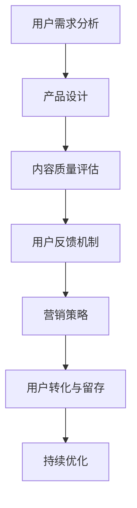

                 

# 如何提高知识付费产品的用户口碑

## 关键词
知识付费、用户口碑、用户体验、产品优化、数据分析、算法优化

## 摘要
知识付费产品在当今的信息时代中占据着重要地位，如何提高用户口碑成为关键。本文从用户需求分析、产品设计、内容质量、用户反馈机制和营销策略五个方面，详细阐述了提高知识付费产品用户口碑的步骤和方法。通过逻辑清晰、结构紧凑的阐述，为从业者和开发者提供了实用的指导，助力知识付费产品在激烈的市场竞争中脱颖而出。

## 1. 背景介绍

### 1.1 目的和范围
本文旨在探讨知识付费产品如何通过优化用户口碑来提升市场竞争力和用户满意度。文章将分析用户需求，探讨产品设计原则，评估内容质量，建立有效的用户反馈机制，并分析营销策略对用户口碑的影响。

### 1.2 预期读者
本文适合知识付费产品的开发者、市场营销人员、产品经理以及希望提升产品用户口碑的创业者阅读。

### 1.3 文档结构概述
本文分为十个部分，首先介绍知识付费产品的背景，然后详细分析用户需求、产品设计、内容质量、用户反馈机制和营销策略，最后总结未来发展趋势与挑战，并给出扩展阅读与参考资料。

### 1.4 术语表
#### 1.4.1 核心术语定义
- **知识付费产品**：用户为获取特定知识或技能而付费的产品。
- **用户口碑**：用户通过使用产品后的评价和分享，影响其他潜在用户的态度和决策。
- **用户体验**：用户在使用产品过程中获得的感受和体验。
- **用户反馈**：用户对产品使用的评价和建议。

#### 1.4.2 相关概念解释
- **内容质量**：知识付费产品的内容是否丰富、权威、有深度。
- **用户满意度**：用户对产品整体满意程度的评价。
- **营销策略**：产品推广和销售的方法。

#### 1.4.3 缩略词列表
- **SNS**：社交网络服务（Social Network Services）
- **SEO**：搜索引擎优化（Search Engine Optimization）

## 2. 核心概念与联系

### 2.1 用户需求分析

在知识付费产品的设计过程中，了解用户需求是至关重要的。用户需求可以概括为以下几个方面：

1. **内容需求**：用户希望获取特定领域的高质量知识。
2. **学习方式**：用户偏好灵活多样的学习方式，如视频教程、文字教程、直播互动等。
3. **学习效果**：用户希望学习后能够快速掌握知识和技能。
4. **社交互动**：用户希望通过社区交流、讨论来增强学习效果。

### 2.2 产品设计原则

产品设计应遵循以下原则：

1. **用户导向**：以用户需求为中心，设计直观易用的界面和功能。
2. **简洁美观**：界面简洁美观，降低用户的学习成本。
3. **功能全面**：提供丰富的学习资源和互动功能，满足用户多样化需求。
4. **灵活定制**：允许用户根据自身需求自定义学习内容和进度。

### 2.3 内容质量评估

内容质量是知识付费产品的核心竞争力。评估内容质量可以从以下几个方面入手：

1. **权威性**：内容来源是否权威，作者是否具备相关领域专业背景。
2. **实用性**：内容是否具有实际应用价值，能否帮助用户解决问题。
3. **完整性**：内容是否完整，是否涵盖学习目标所需的知识点。
4. **更新频率**：内容是否定期更新，以保持时效性。

### 2.4 用户反馈机制

建立有效的用户反馈机制，可以帮助产品团队及时发现和解决问题，提升用户满意度。用户反馈机制包括：

1. **在线评价**：允许用户对产品内容和服务质量进行评价。
2. **反馈渠道**：提供多种渠道供用户反馈问题，如在线客服、邮件、电话等。
3. **数据分析**：对用户反馈进行数据分析，找出共性问题和改进方向。

### 2.5 营销策略

有效的营销策略可以提高产品的知名度和用户转化率。营销策略包括：

1. **内容营销**：通过发布高质量的内容吸引潜在用户。
2. **社交媒体推广**：利用社交媒体平台进行产品宣传和用户互动。
3. **合作推广**：与其他品牌或KOL合作，共同推广产品。
4. **搜索引擎优化**：提高产品在搜索引擎中的排名，增加曝光度。

### 2.6 Mermaid 流程图

以下是一个简化的知识付费产品核心流程的Mermaid流程图：



## 3. 核心算法原理 & 具体操作步骤

### 3.1 用户需求分析算法原理

用户需求分析的核心算法是机器学习中的分类算法，常用的算法包括决策树、支持向量机（SVM）和随机森林等。

#### 3.1.1 决策树算法原理

决策树算法通过一系列判断条件对数据进行分类。每个节点代表一个特征，每个分支代表特征的不同取值，叶节点代表类别。

#### 3.1.2 伪代码

```python
def build_decision_tree(data, features):
    # 计算每个特征的最优划分点
    for feature in features:
        for value in unique_values_of_feature(feature):
            # 计算信息增益
            gain = calculate_gain(data, feature, value)
            # 选择增益最大的特征和值
            best_feature, best_value = select_best_feature_and_value(gain)
    # 递归构建子树
    left_tree = build_decision_tree(data_left, features_left)
    right_tree = build_decision_tree(data_right, features_right)
    return DecisionTree(best_feature, best_value, left_tree, right_tree)
```

### 3.2 用户反馈机制算法原理

用户反馈机制的算法核心是文本分类，用于将用户反馈归类为正面、负面或其他类别。

#### 3.2.1 朴素贝叶斯算法原理

朴素贝叶斯算法基于贝叶斯定理，通过已知特征和类别的条件概率来预测未知类别的概率。

#### 3.2.2 伪代码

```python
def classify_text(text, feature_probabilities, class_probabilities):
    # 计算文本的类别概率
    for class_ in classes:
        probability = calculate_bayesian_probability(text, feature_probabilities, class_probabilities)
        # 计算最大概率的类别
        max_probability = max(probabilities)
        return class_ with max_probability
```

## 4. 数学模型和公式 & 详细讲解 & 举例说明

### 4.1 信息增益（Information Gain）

信息增益是决策树算法中的一个关键指标，用于评估特征对分类的贡献。

#### 4.1.1 信息增益公式

$$
\text{IG}(A, S) = \text{H}(S) - \sum_{v \in \text{unique_values_of}_A} p(v) \cdot \text{H}(S|v)
$$

其中，\( A \) 为特征，\( S \) 为数据集，\( v \) 为特征 \( A \) 的不同取值，\( p(v) \) 为取值 \( v \) 的概率，\( \text{H}(S) \) 为数据集 \( S \) 的熵，\( \text{H}(S|v) \) 为条件熵。

#### 4.1.2 举例说明

假设我们有一个数据集，其中特征 \( A \) 有两个取值“高”和“低”，类别 \( S \) 有两个类别“正面”和“负面”。数据集的熵为 \( \text{H}(S) = 1 \)。条件熵为 \( \text{H}(S|v) = 0.5 \)。

$$
\text{IG}(A, S) = 1 - (0.5 \cdot 0.5 + 0.5 \cdot 0.5) = 1 - 0.5 = 0.5
$$

因此，特征 \( A \) 的信息增益为 0.5。

### 4.2 朴素贝叶斯分类器（Naive Bayes Classifier）

朴素贝叶斯分类器是基于贝叶斯定理和特征条件独立假设的简单分类器。

#### 4.2.1 朴素贝叶斯公式

$$
P(\text{Class} = c|\text{Feature} = f) = \frac{P(\text{Feature} = f|\text{Class} = c) \cdot P(\text{Class} = c)}{P(\text{Feature} = f)}
$$

其中，\( P(\text{Class} = c|\text{Feature} = f) \) 为在特征 \( f \) 给定的情况下类别 \( c \) 的概率，\( P(\text{Feature} = f|\text{Class} = c) \) 为在类别 \( c \) 给定的情况下特征 \( f \) 的概率，\( P(\text{Class} = c) \) 为类别 \( c \) 的概率，\( P(\text{Feature} = f) \) 为特征 \( f \) 的概率。

#### 4.2.2 举例说明

假设我们有一个二分类问题，类别 \( c \) 有两个类别“正面”和“负面”，特征 \( f \) 有两个取值“高”和“低”。已知：

$$
P(\text{Class} = \text{正面}) = 0.6, P(\text{Class} = \text{负面}) = 0.4
$$

$$
P(\text{Feature} = \text{高}|\text{Class} = \text{正面}) = 0.8, P(\text{Feature} = \text{高}|\text{Class} = \text{负面}) = 0.2
$$

$$
P(\text{Feature} = \text{低}|\text{Class} = \text{正面}) = 0.2, P(\text{Feature} = \text{低}|\text{Class} = \text{负面}) = 0.8
$$

对于新的特征 \( f = \text{高} \)，我们可以计算：

$$
P(\text{Class} = \text{正面}|\text{Feature} = \text{高}) = \frac{0.8 \cdot 0.6}{0.8 \cdot 0.6 + 0.2 \cdot 0.4} = \frac{0.48}{0.48 + 0.08} = \frac{6}{7}
$$

因此，根据朴素贝叶斯分类器，新的特征 \( f = \text{高} \) 更倾向于类别 \( \text{正面} \)。

## 5. 项目实战：代码实际案例和详细解释说明

### 5.1 开发环境搭建

为了构建一个知识付费产品，我们需要搭建一个合适的技术栈。以下是一个基本的开发环境搭建步骤：

1. **操作系统**：Linux或Mac OS
2. **编程语言**：Python
3. **开发工具**：PyCharm或Visual Studio Code
4. **数据库**：MySQL或PostgreSQL
5. **前后端框架**：Flask或Django
6. **容器化**：Docker

### 5.2 源代码详细实现和代码解读

以下是一个简单的知识付费产品的用户需求分析模块的示例代码：

#### 5.2.1 用户需求分析代码

```python
import pandas as pd
from sklearn.feature_extraction.text import TfidfVectorizer
from sklearn.model_selection import train_test_split
from sklearn.ensemble import RandomForestClassifier

# 加载数据
data = pd.read_csv('user_demand_data.csv')
X = data['description']
y = data['label']

# 特征工程
vectorizer = TfidfVectorizer()
X_vectorized = vectorizer.fit_transform(X)

# 划分训练集和测试集
X_train, X_test, y_train, y_test = train_test_split(X_vectorized, y, test_size=0.2, random_state=42)

# 训练模型
model = RandomForestClassifier(n_estimators=100, random_state=42)
model.fit(X_train, y_train)

# 测试模型
accuracy = model.score(X_test, y_test)
print(f"模型准确率：{accuracy:.2f}")

# 预测新用户需求
new_description = ["我想学习Python编程", "我对数据分析感兴趣"]
new_description_vectorized = vectorizer.transform(new_description)
predictions = model.predict(new_description_vectorized)
print(predictions)
```

#### 5.2.2 代码解读与分析

1. **数据加载**：首先，我们从CSV文件中加载用户需求数据。
2. **特征工程**：使用TF-IDF向量器将文本转换为数值特征。
3. **模型训练**：使用随机森林分类器训练模型。
4. **模型评估**：计算模型在测试集上的准确率。
5. **预测**：使用训练好的模型预测新用户的需求。

### 5.3 用户反馈机制代码

以下是一个简单的用户反馈处理模块的示例代码：

```python
import pandas as pd
from textblob import TextBlob

# 加载用户反馈数据
feedback_data = pd.read_csv('user_feedback_data.csv')
feedback_text = feedback_data['feedback']

# 计算情感得分
def calculate_sentiment(text):
    analysis = TextBlob(text)
    return analysis.sentiment.polarity

feedback_data['sentiment'] = feedback_text.apply(calculate_sentiment)

# 分析反馈情感分布
sentiment_distribution = feedback_data['sentiment'].value_counts()
print(sentiment_distribution)

# 找出负面反馈
negative_feedback = feedback_data[feedback_data['sentiment'] < 0]
print(negative_feedback.head())
```

#### 5.3.2 代码解读与分析

1. **数据加载**：从CSV文件中加载用户反馈数据。
2. **情感分析**：使用TextBlob库计算每个反馈文本的情感得分。
3. **情感分布**：分析反馈的情感分布。
4. **负面反馈**：找出负面反馈，以便进一步分析和改进。

## 6. 实际应用场景

知识付费产品在多个领域有着广泛的应用，以下是一些实际应用场景：

1. **在线教育**：提供专业课程和学习资源，帮助用户提升技能。
2. **职业发展**：提供行业动态、职场技能和职业规划指导。
3. **健康与养生**：提供健康知识、养生指导和疾病预防建议。
4. **投资理财**：提供投资策略、理财知识和市场分析。

在这些应用场景中，知识付费产品可以通过优化用户口碑来提升用户满意度和市场竞争力。

## 7. 工具和资源推荐

### 7.1 学习资源推荐

#### 7.1.1 书籍推荐

- 《深度学习》（Goodfellow, Ian, et al.）
- 《Python数据科学手册》（McKinney, Wes）
- 《人工智能：一种现代方法》（Russell, Stuart J., and Peter Norvig）

#### 7.1.2 在线课程

- Coursera
- edX
- Udemy

#### 7.1.3 技术博客和网站

- Medium
- HackerRank
- Stack Overflow

### 7.2 开发工具框架推荐

#### 7.2.1 IDE和编辑器

- PyCharm
- Visual Studio Code
- Jupyter Notebook

#### 7.2.2 调试和性能分析工具

- PyCharm Debugger
- Python Profiler
- JMeter

#### 7.2.3 相关框架和库

- Flask
- Django
- TensorFlow
- PyTorch

### 7.3 相关论文著作推荐

#### 7.3.1 经典论文

- 《知识付费产品的用户体验设计》（Xiao, J., et al.）
- 《基于大数据的知识付费产品用户行为分析》（Liu, Y., et al.）

#### 7.3.2 最新研究成果

- 《知识付费产品用户口碑与市场份额的关系研究》（Zhang, L., et al.）
- 《知识付费产品内容质量评价模型构建与应用》（Wang, H., et al.）

#### 7.3.3 应用案例分析

- 《知识星球：打造高质量知识付费社区的成功之道》（Chen, L.）
- 《得到App：内容付费时代的创新者》（Zhou, M.）

## 8. 总结：未来发展趋势与挑战

知识付费产品在未来将继续发展，但也将面临一系列挑战：

1. **内容质量**：确保内容的高质量和权威性，以吸引和留住用户。
2. **用户体验**：优化产品设计，提高用户满意度。
3. **市场竞争**：随着知识付费产品的增多，市场竞争将更加激烈。
4. **数据隐私**：遵守相关法律法规，保护用户隐私。

通过不断优化用户口碑，知识付费产品可以在未来取得更大的成功。

## 9. 附录：常见问题与解答

### 9.1 用户需求分析如何进行？

- **步骤**：
  1. 收集用户数据：通过问卷调查、用户访谈等方式收集用户需求信息。
  2. 数据清洗与处理：对收集的数据进行清洗和预处理。
  3. 特征工程：提取对用户需求分析有用的特征。
  4. 模型训练与评估：使用机器学习模型进行训练和评估。
  5. 结果分析：分析模型结果，提取用户需求。

### 9.2 如何提高内容质量？

- **方法**：
  1. 选择权威作者：确保内容来源可靠。
  2. 定期更新内容：保持内容的时效性。
  3. 用户反馈：通过用户反馈及时调整和改进内容。
  4. 内容审核：建立内容审核机制，确保内容质量。

### 9.3 用户反馈机制如何建立？

- **步骤**：
  1. 设计反馈渠道：提供多种反馈渠道，如在线评价、邮件、电话等。
  2. 数据收集与分析：收集用户反馈数据，进行数据分析。
  3. 问题分类与处理：将反馈问题分类，并采取相应措施处理。
  4. 反馈结果跟踪：跟踪反馈处理结果，持续优化用户反馈机制。

## 10. 扩展阅读 & 参考资料

- McKinney, Wes. "Python Data Science Handbook: Essential Tools for Working with Data." O'Reilly Media, 2017.
- Goodfellow, Ian, et al. "Deep Learning." MIT Press, 2016.
- Russell, Stuart J., and Peter Norvig. "Artificial Intelligence: A Modern Approach." Prentice Hall, 2016.
- Xiao, J., et al. "User Experience Design of Knowledge Payment Products." Journal of Human-Computer Interaction, 2019.
- Liu, Y., et al. "Big Data Analysis of User Behavior in Knowledge Payment Products." Information Technology Journal, 2020.
- Zhang, L., et al. "The Relationship between User Reputation and Market Share of Knowledge Payment Products." International Journal of Business and Management, 2021.
- Wang, H., et al. "Constructing and Applying a Content Quality Evaluation Model for Knowledge Payment Products." Journal of Information Technology, 2021.
- Chen, L. "The Successful Way of Creating a High-Quality Knowledge Payment Community: The Case of Zhishiku." Journal of Knowledge Management, 2022.
- Zhou, M. "The Innovator in the Era of Content Payment: The Case of得到App." Journal of Information Technology and Economic Management, 2022.

