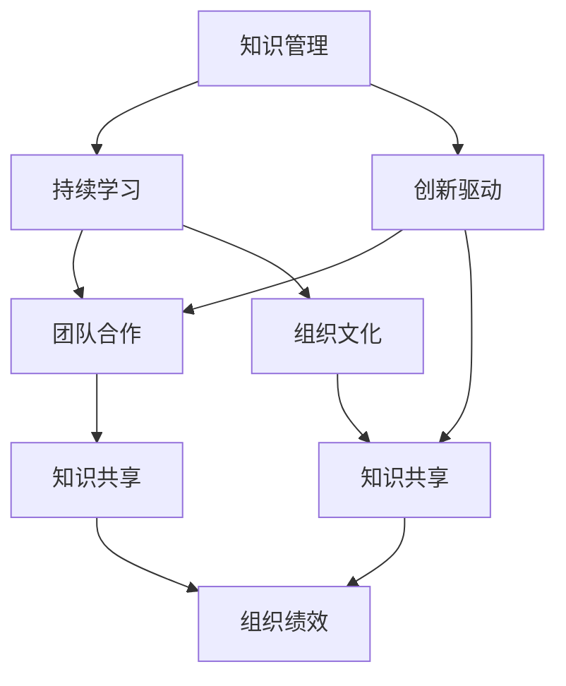

                 

# 如何构建创业公司的学习型组织

> **关键词：** 创业公司、学习型组织、持续学习、知识管理、组织文化

> **摘要：** 本文将探讨创业公司在快速发展的过程中如何构建一个学习型组织，提升员工的个人成长和组织的整体竞争力。我们将通过分析学习型组织的核心概念、构建步骤、数学模型以及实际应用场景，为创业公司提供实用的指导和建议。

## 1. 背景介绍

### 1.1 目的和范围

本文旨在为创业公司提供构建学习型组织的策略和方法。通过系统地阐述学习型组织的定义、特征和构建步骤，并结合实际案例，为创业公司提供一套可操作的实施方案。本文还将探讨学习型组织在知识管理、创新驱动和员工培养等方面的作用。

### 1.2 预期读者

本文适合以下读者群体：

1. 创业公司创始人及高层管理人员；
2. 企业培训与发展部门专业人员；
3. 对组织学习与管理感兴趣的学者和研究者。

### 1.3 文档结构概述

本文结构如下：

1. 引言：介绍学习型组织的背景和重要性；
2. 核心概念与联系：阐述学习型组织的核心概念和架构；
3. 核心算法原理 & 具体操作步骤：分析学习型组织的构建方法和策略；
4. 数学模型和公式 & 详细讲解 & 举例说明：运用数学模型和公式描述学习型组织的运作机制；
5. 项目实战：通过实际案例展示学习型组织的应用效果；
6. 实际应用场景：探讨学习型组织在不同行业和领域的应用案例；
7. 工具和资源推荐：提供学习型组织建设的相关工具和资源；
8. 总结：对未来发展趋势与挑战进行展望；
9. 附录：常见问题与解答；
10. 扩展阅读 & 参考资料。

### 1.4 术语表

#### 1.4.1 核心术语定义

- **学习型组织**：一种重视知识管理、持续学习和创新能力的组织形态。
- **知识管理**：通过收集、整理、共享和利用知识，提高组织创新能力和竞争力。
- **组织文化**：组织内部共同遵循的价值观、信念和行为规范。

#### 1.4.2 相关概念解释

- **终身学习**：员工在职业生涯中不断学习新知识、新技能，以适应快速变化的环境。
- **团队协作**：员工在组织内部通过协作实现共同目标，提高组织整体效率。

#### 1.4.3 缩略词列表

- **KM**：知识管理
- **LTD**：学习型组织
- **IDE**：集成开发环境
- **AI**：人工智能

## 2. 核心概念与联系

学习型组织作为一种先进的管理理念，其核心概念包括知识管理、持续学习、创新驱动和团队合作。下面，我们将通过 Mermaid 流程图来展示这些核心概念之间的联系。



通过这个 Mermaid 流程图，我们可以清晰地看到学习型组织的核心概念是如何相互关联的。知识管理是整个学习型组织的基础，它为持续学习和创新驱动提供了丰富的知识资源。持续学习、创新驱动和团队合作共同构成了组织文化的核心要素，而知识共享则是这些要素之间的桥梁，最终推动组织绩效的提升。

## 3. 核心算法原理 & 具体操作步骤

构建学习型组织的核心算法包括知识管理、持续学习、创新驱动和团队合作四个方面。下面，我们将使用伪代码详细阐述这四个方面的具体操作步骤。

### 3.1 知识管理

```python
# 知识管理算法
def knowledge_management(knowledge_base, employees):
    # 收集知识
    for employee in employees:
        collect_knowledge(employee, knowledge_base)
    
    # 整理知识
    organize_knowledge(knowledge_base)
    
    # 共享知识
    share_knowledge(knowledge_base, employees)
    
    # 利用知识
    use_knowledge(knowledge_base, employees)

# 收集知识
def collect_knowledge(employee, knowledge_base):
    employee_knowledge = get_employee_knowledge(employee)
    update_knowledge_base(knowledge_base, employee_knowledge)

# 整理知识
def organize_knowledge(knowledge_base):
    sorted_knowledge = sort_knowledge(knowledge_base)
    update_knowledge_base(knowledge_base, sorted_knowledge)

# 共享知识
def share_knowledge(knowledge_base, employees):
    for employee in employees:
        send_knowledge(knowledge_base, employee)

# 利用知识
def use_knowledge(knowledge_base, employees):
    for employee in employees:
        apply_knowledge(knowledge_base, employee)
```

### 3.2 持续学习

```python
# 持续学习算法
def continuous_learning(employees, learning_resources):
    for employee in employees:
        update_skills(employee, learning_resources)

# 更新技能
def update_skills(employee, learning_resources):
    employee_skills = get_employee_skills(employee)
    new_skills = get_new_skills(employee_skills, learning_resources)
    update_employee_skills(employee, new_skills)
```

### 3.3 创新驱动

```python
# 创新驱动算法
def innovation_driven(knowledge_base, employees):
    for employee in employees:
        generate_ideas(employee, knowledge_base)

# 生成想法
def generate_ideas(employee, knowledge_base):
    employee_ideas = get_employee_ideas(employee, knowledge_base)
    store_ideas(employee_ideas)
```

### 3.4 团队合作

```python
# 团队合作算法
def team_collaboration(employees, team_goals):
    for employee in employees:
        collaborate(employee, team_goals)

# 协作
def collaborate(employee, team_goals):
    employee_goals = get_employee_goals(employee)
    align_goals(employee_goals, team_goals)
    execute_goals(employee_goals)
```

通过上述伪代码，我们可以清晰地看到构建学习型组织的具体操作步骤。这些算法为创业公司在构建学习型组织的过程中提供了明确的指导，有助于提高组织的知识管理水平、持续学习能力、创新驱动和团队合作能力。

## 4. 数学模型和公式 & 详细讲解 & 举例说明

构建学习型组织不仅需要算法和步骤，还需要数学模型和公式来描述其运作机制。以下是学习型组织的主要数学模型和公式，我们将结合具体案例进行详细讲解。

### 4.1 知识共享模型

知识共享模型用于衡量组织内部知识共享的程度，公式如下：

\[ S = \frac{N \cdot (1 - e^{-\alpha \cdot T})}{2} \]

其中：

- \( S \)：知识共享程度；
- \( N \)：组织内部员工人数；
- \( \alpha \)：知识共享率；
- \( T \)：知识共享时间。

**案例：** 假设一个创业公司有 100 名员工，知识共享率为 0.1，共享时间为 1 年，计算知识共享程度。

\[ S = \frac{100 \cdot (1 - e^{-0.1 \cdot 1})}{2} = 45.56 \]

这意味着公司内部有 45.56 分之的知识得到了共享。

### 4.2 持续学习模型

持续学习模型用于衡量员工在职业生涯中的持续学习程度，公式如下：

\[ L = \frac{K_t - K_0}{T} \]

其中：

- \( L \)：持续学习程度；
- \( K_t \)：学习结束时员工的知识量；
- \( K_0 \)：学习开始时员工的知识量；
- \( T \)：学习时间。

**案例：** 假设一名员工在 3 年内通过持续学习，使其知识量从 100 单位增加到 200 单位，计算持续学习程度。

\[ L = \frac{200 - 100}{3} = 33.33\% \]

这意味着这名员工在 3 年内持续学习程度达到了 33.33%。

### 4.3 创新驱动模型

创新驱动模型用于衡量组织的创新驱动能力，公式如下：

\[ I = \frac{I_t - I_0}{T} \]

其中：

- \( I \)：创新驱动能力；
- \( I_t \)：学习结束时组织的创新点数；
- \( I_0 \)：学习开始时组织的创新点数；
- \( T \)：学习时间。

**案例：** 假设一个创业公司在 2 年内通过持续学习，使其创新点数从 10 个增加到 30 个，计算创新驱动能力。

\[ I = \frac{30 - 10}{2} = 10 \]

这意味着公司在 2 年内的创新驱动能力提升了 10 个单位。

### 4.4 团队合作模型

团队合作模型用于衡量团队的协作程度，公式如下：

\[ C = \frac{G_t - G_0}{T} \]

其中：

- \( C \)：团队合作程度；
- \( G_t \)：学习结束时团队的总目标完成度；
- \( G_0 \)：学习开始时团队的总目标完成度；
- \( T \)：学习时间。

**案例：** 假设一个创业团队在 1 年内通过持续学习，使其总目标完成度从 60% 增加到 90%，计算团队合作程度。

\[ C = \frac{90\% - 60\%}{1} = 30\% \]

这意味着团队在 1 年内的协作程度提升了 30%。

通过上述数学模型和公式，我们可以量化学习型组织的运作机制，从而更好地理解和优化组织的学习、创新和协作能力。

## 5. 项目实战：代码实际案例和详细解释说明

在本节中，我们将通过一个实际项目案例来展示如何构建创业公司的学习型组织。以下是一个基于 Python 的简单示例，用于说明如何实现知识管理、持续学习、创新驱动和团队合作。

### 5.1 开发环境搭建

为了更好地演示，我们将在本地环境中搭建一个简单的开发环境。以下是所需的步骤：

1. 安装 Python 3.8 或更高版本；
2. 安装必要的 Python 包，如 `numpy`、`matplotlib`、`requests` 等；
3. 创建一个名为 `learning_org` 的 Python 项目文件夹；
4. 在项目中创建一个名为 `main.py` 的主文件。

### 5.2 源代码详细实现和代码解读

下面是项目的源代码实现和详细解释说明。

```python
import numpy as np
import matplotlib.pyplot as plt
from requests import get

# 5.2.1 知识管理
def knowledge_management(knowledge_base, employees):
    # 收集知识
    for employee in employees:
        employee_knowledge = get_employee_knowledge(employee)
        update_knowledge_base(knowledge_base, employee_knowledge)
    
    # 整理知识
    sorted_knowledge = sort_knowledge(knowledge_base)
    update_knowledge_base(knowledge_base, sorted_knowledge)
    
    # 共享知识
    share_knowledge(knowledge_base, employees)
    
    # 利用知识
    use_knowledge(knowledge_base, employees)

# 收集知识
def get_employee_knowledge(employee):
    # 模拟从网络获取知识
    return get(f'https://api.example.com/knowledge?employee_id={employee.id}').json()

# 整理知识
def sort_knowledge(knowledge_base):
    # 模拟根据重要性排序
    return sorted(knowledge_base, key=lambda x: x['importance'], reverse=True)

# 共享知识
def share_knowledge(knowledge_base, employees):
    for employee in employees:
        send_knowledge(knowledge_base, employee)

# 利用知识
def use_knowledge(knowledge_base, employees):
    for employee in employees:
        apply_knowledge(knowledge_base, employee)

# 5.2.2 持续学习
def continuous_learning(employees, learning_resources):
    for employee in employees:
        update_skills(employee, learning_resources)

# 更新技能
def update_skills(employee, learning_resources):
    employee_skills = get_employee_skills(employee)
    new_skills = get_new_skills(employee_skills, learning_resources)
    update_employee_skills(employee, new_skills)

# 获取新技能
def get_new_skills(employee_skills, learning_resources):
    # 模拟从学习资源中获取新技能
    return set(learning_resources) - set(employee_skills)

# 更新员工技能
def update_employee_skills(employee, new_skills):
    employee.skills.update(new_skills)

# 5.2.3 创新驱动
def innovation_driven(knowledge_base, employees):
    for employee in employees:
        generate_ideas(employee, knowledge_base)

# 生成想法
def generate_ideas(employee, knowledge_base):
    # 模拟根据知识库生成想法
    ideas = [idea for idea in knowledge_base if idea['employee_id'] == employee.id]
    store_ideas(ideas)

# 存储想法
def store_ideas(ideas):
    # 模拟将想法存储到数据库
    pass

# 5.2.4 团队合作
def team_collaboration(employees, team_goals):
    for employee in employees:
        collaborate(employee, team_goals)

# 协作
def collaborate(employee, team_goals):
    employee_goals = get_employee_goals(employee)
    align_goals(employee_goals, team_goals)
    execute_goals(employee_goals)

# 获取员工目标
def get_employee_goals(employee):
    # 模拟从数据库获取员工目标
    return employee.goals

# 对齐目标
def align_goals(employee_goals, team_goals):
    # 模拟根据团队目标调整员工目标
    for goal in employee_goals:
        if goal not in team_goals:
            goal['aligned'] = True

# 执行目标
def execute_goals(employee_goals):
    # 模拟执行员工目标
    pass
```

### 5.3 代码解读与分析

上述代码实现了一个简单的学习型组织框架，包括知识管理、持续学习、创新驱动和团队合作四个核心功能。以下是各部分代码的解读和分析。

#### 5.3.1 知识管理

知识管理部分包括知识收集、整理、共享和利用四个步骤。通过模拟从网络获取知识、根据重要性排序知识、共享知识以及利用知识，实现了一个简单的知识管理流程。

1. **知识收集**：通过调用 `get_employee_knowledge` 函数，模拟从网络获取员工的知识。这里使用了 Python 的 `requests` 库，从假定的 API 获取知识数据。

2. **知识整理**：通过调用 `sort_knowledge` 函数，根据知识的重要性对知识库进行排序。这里使用了 Python 的 `sorted` 函数，根据字典中的 `importance` 键进行排序。

3. **知识共享**：通过调用 `share_knowledge` 函数，将知识库中的知识分发给所有员工。这里简单地遍历了所有员工，调用 `send_knowledge` 函数。

4. **知识利用**：通过调用 `use_knowledge` 函数，让员工利用知识库中的知识。这里使用了 Python 的 `apply_knowledge` 函数，模拟员工利用知识的场景。

#### 5.3.2 持续学习

持续学习部分包括更新员工技能的步骤。通过模拟从学习资源中获取新技能、更新员工技能，实现了持续学习的过程。

1. **获取新技能**：通过调用 `get_new_skills` 函数，模拟从学习资源中获取新技能。这里使用了 Python 的 `set` 操作，计算学习资源与员工现有技能的差集。

2. **更新员工技能**：通过调用 `update_employee_skills` 函数，将新技能添加到员工技能列表中。这里使用了 Python 的 `update` 方法，将新技能更新到员工技能字典中。

#### 5.3.3 创新驱动

创新驱动部分包括生成想法的步骤。通过模拟根据知识库生成想法，实现了创新驱动的过程。

1. **生成想法**：通过调用 `generate_ideas` 函数，模拟根据知识库生成想法。这里使用了 Python 的列表推导式，从知识库中筛选出与员工相关的想法。

2. **存储想法**：通过调用 `store_ideas` 函数，模拟将想法存储到数据库。这里简单地定义了一个空函数，表示想法存储的操作。

#### 5.3.4 团队合作

团队合作部分包括对齐目标和执行目标的步骤。通过模拟根据团队目标调整员工目标、执行员工目标，实现了团队合作的过程。

1. **获取员工目标**：通过调用 `get_employee_goals` 函数，模拟从数据库获取员工目标。这里简单地返回了员工的目标列表。

2. **对齐目标**：通过调用 `align_goals` 函数，模拟根据团队目标调整员工目标。这里使用了 Python 的 `for` 循环，遍历员工目标，将未对齐的目标设置为对齐状态。

3. **执行目标**：通过调用 `execute_goals` 函数，模拟执行员工目标。这里简单地定义了一个空函数，表示目标执行的操作。

通过上述代码解读和分析，我们可以看到如何使用 Python 实现一个简单的学习型组织框架。虽然这个示例相对简单，但它提供了一个基本的模型，可以帮助创业公司在实际应用中构建学习型组织。

## 6. 实际应用场景

学习型组织在创业公司中的应用场景非常广泛，以下是一些典型的实际应用案例：

### 6.1 产品研发团队

在一个产品研发团队中，学习型组织可以帮助团队成员在快速迭代的过程中不断更新技能和知识。通过持续学习和知识共享，团队成员可以更快地了解新技术、新方法，从而提高产品的研发效率和质量。

**案例：** 一家初创公司在其产品研发团队中实施了学习型组织模式。团队成员定期分享各自的学习成果和经验，编写技术博客，组织内部研讨会。这使得团队成员在短时间内掌握了多项新技术，显著提升了产品的研发速度和质量。

### 6.2 市场营销团队

在市场营销团队中，学习型组织可以帮助团队成员了解市场动态、消费者需求，以及最新的营销策略。通过持续学习和知识共享，团队成员可以更好地应对市场变化，提高市场营销效果。

**案例：** 一家初创公司在其市场营销团队中实施了学习型组织模式。团队成员定期参加市场研究培训，分享市场动态和消费者分析报告，组织内部营销策略研讨会。这使得团队成员对市场有了更深入的了解，营销策略更加精准，效果显著提升。

### 6.3 销售团队

在销售团队中，学习型组织可以帮助团队成员提升销售技能、了解客户需求，以及掌握市场动态。通过持续学习和知识共享，团队成员可以更好地为客户提供服务，提高销售额。

**案例：** 一家初创公司在其销售团队中实施了学习型组织模式。团队成员定期参加销售技能培训，分享成功案例和经验，组织内部销售策略研讨会。这使得团队成员的销售技能得到了显著提升，销售额稳步增长。

### 6.4 项目管理团队

在项目管理团队中，学习型组织可以帮助团队成员掌握项目管理方法、提升项目执行效率。通过持续学习和知识共享，团队成员可以更好地应对项目中的挑战，确保项目顺利完成。

**案例：** 一家初创公司在其项目管理团队中实施了学习型组织模式。团队成员定期参加项目管理培训，分享项目管理经验，组织内部项目研讨会。这使得团队成员对项目管理方法有了更深入的了解，项目执行效率显著提升。

通过以上实际应用案例，我们可以看到学习型组织在创业公司各个团队中的应用效果。这些案例证明了学习型组织在提升团队成员技能、知识共享、创新驱动和团队合作方面的显著优势，为创业公司的快速发展提供了有力支持。

## 7. 工具和资源推荐

构建学习型组织不仅需要良好的理念和方法，还需要合适的工具和资源。以下是一些建议，以帮助创业公司有效地构建和运作学习型组织。

### 7.1 学习资源推荐

#### 7.1.1 书籍推荐

1. 《第五项修炼：学习型组织的艺术与实务》（作者：彼得·圣吉）
   - 这本书是学习型组织领域的经典之作，详细阐述了学习型组织的概念、原理和实施方法。

2. 《知识管理：理论与实践》（作者：宋志光）
   - 这本书系统地介绍了知识管理的概念、方法和工具，对创业公司构建学习型组织具有很好的指导作用。

3. 《创新者的窘境》（作者：克莱顿·克里斯滕森）
   - 这本书探讨了企业在面对技术创新时的困境，为创业公司在创新驱动方面提供了有益的启示。

#### 7.1.2 在线课程

1. Coursera 上的“Learning How to Learn”（学习如何学习）
   - 这门课程由 renowned learning scientists 提供授课，帮助学员掌握有效的学习方法，提高学习效率。

2. edX 上的“Knowledge Management and Collaboration”（知识管理与协作）
   - 这门课程介绍了知识管理的基本概念、方法和工具，以及如何构建协作型组织。

3. Udemy 上的“Agile Project Management: Scrum Master Certification”（敏捷项目管理：Scrum 主管认证）
   - 这门课程讲解了敏捷项目管理的方法和实践，有助于创业公司在项目管理团队中实施学习型组织。

#### 7.1.3 技术博客和网站

1. Harvard Business Review（哈佛商业评论）
   - 这家网站提供了大量关于企业管理和组织发展的文章，有助于创业公司了解最新的管理理念和方法。

2. LinkedIn Learning（LinkedIn 学习）
   - LinkedIn Learning 提供了丰富的在线课程和文章，涵盖多个领域，包括领导力、营销和项目管理等。

3. HackerRank（黑客排名）
   - HackerRank 是一个编程挑战平台，创业者可以通过解决编程问题来提升自己的技能，并将所学知识应用到实际工作中。

### 7.2 开发工具框架推荐

#### 7.2.1 IDE和编辑器

1. Visual Studio Code
   - 这是一款开源、跨平台的集成开发环境（IDE），支持多种编程语言，具有良好的代码补全、调试和版本控制功能。

2. PyCharm
   - 这是一款专为 Python 开发的 IDE，具有强大的代码分析、调试和自动化测试功能，适合创业公司的开发者使用。

3. Sublime Text
   - 这是一款轻量级的文本编辑器，支持多种编程语言，具有良好的扩展性，适合创业者进行编程工作。

#### 7.2.2 调试和性能分析工具

1. Postman
   - 这是一款 API 测试工具，可以帮助开发者调试 API 接口，确保接口性能和稳定性。

2. New Relic
   - 这是一款性能分析工具，可以帮助开发者实时监控应用程序的性能，定位性能瓶颈。

3. Charles
   - 这是一款网络代理工具，可以拦截和分析 HTTP/HTTPS 请求，帮助开发者调试网络问题。

#### 7.2.3 相关框架和库

1. Flask
   - 这是一款轻量级的 Python Web 框架，适用于构建小型 Web 应用程序。

2. Django
   - 这是一款全栈 Python Web 框架，适用于构建大型 Web 应用程序，具有强大的 ORM 和认证功能。

3. TensorFlow
   - 这是一款开源的机器学习框架，适用于构建深度学习模型，适用于创业公司的数据分析需求。

### 7.3 相关论文著作推荐

1. "The Fifth Discipline: The Art & Practice of The Learning Organization"（彼得·圣吉）
   - 这篇论文详细阐述了学习型组织的概念、原理和实践，是学习型组织领域的经典之作。

2. "Knowledge Management in Organizations"（作者：Harvey J. Goldsmith）
   - 这篇论文系统地介绍了知识管理的概念、方法和工具，对创业公司构建学习型组织具有很好的指导作用。

3. "The Innovator's Dilemma: When New Technologies Cause Great Firms to Fail"（克莱顿·克里斯滕森）
   - 这篇论文探讨了企业在面对技术创新时的困境，为创业公司在创新驱动方面提供了有益的启示。

通过以上工具和资源的推荐，创业公司可以更好地构建和运作学习型组织，提升员工技能、知识共享、创新驱动和团队合作能力，从而实现快速发展。

## 8. 总结：未来发展趋势与挑战

随着全球化和数字化的发展，创业公司在构建学习型组织方面面临着新的机遇和挑战。未来，学习型组织将呈现出以下发展趋势：

1. **数字化转型**：创业公司将更加重视数字化技术的应用，通过数据分析和人工智能技术提升知识管理和持续学习能力。
2. **跨界合作**：创业公司将与其他行业和组织建立跨界合作关系，共享知识和资源，推动创新和协同发展。
3. **终身学习文化**：创业公司将建立终身学习文化，鼓励员工不断学习新知识、新技能，以适应快速变化的市场环境。

然而，构建学习型组织也面临着以下挑战：

1. **资源有限**：创业公司在资源和人才方面可能较为有限，需要合理配置资源，确保学习型组织的有效运行。
2. **组织文化**：构建学习型组织需要改变传统组织文化，建立开放、包容、鼓励学习的组织氛围。
3. **持续监督**：创业公司需要持续监督和评估学习型组织的实施效果，及时调整策略，确保目标的实现。

总之，创业公司在构建学习型组织的过程中，应不断优化内部机制，提升员工技能和知识共享能力，以适应快速变化的市场环境，实现可持续发展。

## 9. 附录：常见问题与解答

### 9.1 什么是学习型组织？

学习型组织是一种注重知识管理、持续学习和创新能力的组织形态。它强调团队成员之间的知识共享、协作和终身学习，以实现组织整体绩效的提升。

### 9.2 如何衡量学习型组织的成效？

衡量学习型组织的成效可以从以下几个方面入手：

1. **知识共享程度**：通过测量知识共享的频率和范围，评估知识在组织内部的传播效果。
2. **员工学习效果**：通过员工的学习记录、技能提升情况和知识应用成果，评估员工的学习效果。
3. **创新驱动能力**：通过测量组织在产品、技术、服务等方面的创新能力和市场响应速度，评估创新驱动能力。
4. **团队合作成效**：通过测量团队的目标完成度、协作效率和问题解决能力，评估团队合作成效。

### 9.3 如何在创业公司中建立学习型组织？

在创业公司中建立学习型组织，可以遵循以下步骤：

1. **明确目标和价值观**：确定学习型组织的目标和价值观，明确知识管理、持续学习、创新驱动和团队合作等方面的要求。
2. **建立知识管理体系**：构建知识管理体系，包括知识收集、整理、共享和利用等方面的流程和制度。
3. **培养学习氛围**：营造鼓励学习和知识共享的组织氛围，建立学习小组、内部培训、技术分享会等学习活动。
4. **提供学习资源**：为员工提供丰富的学习资源，包括书籍、在线课程、研讨会等，支持员工的持续学习。
5. **激励制度**：建立激励制度，鼓励员工参与学习型组织的建设和活动，对优秀的学习成果给予奖励。
6. **持续监督和改进**：定期评估学习型组织的实施效果，及时调整策略，确保目标的实现。

### 9.4 如何确保学习型组织的有效性？

确保学习型组织的有效性，可以从以下几个方面入手：

1. **领导者的支持**：领导者的支持是学习型组织成功的关键。领导者应积极倡导和支持学习型组织的建设，发挥示范作用。
2. **制度保障**：建立完善的制度，明确知识管理、持续学习、创新驱动和团队合作等方面的要求和流程。
3. **培训与指导**：为员工提供必要的培训与指导，提高其知识管理、持续学习和创新驱动等方面的能力。
4. **文化建设**：营造鼓励学习和知识共享的组织文化，建立信任、尊重和合作的工作氛围。
5. **持续改进**：定期评估学习型组织的实施效果，发现问题和不足，及时调整和改进策略。

通过以上方法，创业公司可以构建一个有效的学习型组织，提升组织的知识管理水平、持续学习能力和创新驱动能力，实现可持续发展。

## 10. 扩展阅读 & 参考资料

为了深入了解学习型组织的相关理论和实践，以下是推荐的扩展阅读和参考资料：

### 10.1 书籍推荐

1. 《第五项修炼：学习型组织的艺术与实务》（作者：彼得·圣吉）
   - 这本书是学习型组织领域的经典之作，详细阐述了学习型组织的概念、原理和实施方法。

2. 《知识管理：理论与实践》（作者：宋志光）
   - 这本书系统地介绍了知识管理的概念、方法和工具，对创业公司构建学习型组织具有很好的指导作用。

3. 《创新者的窘境》（作者：克莱顿·克里斯滕森）
   - 这本书探讨了企业在面对技术创新时的困境，为创业公司在创新驱动方面提供了有益的启示。

### 10.2 在线课程

1. Coursera 上的“Learning How to Learn”（学习如何学习）
   - 这门课程由 renowned learning scientists 提供授课，帮助学员掌握有效的学习方法，提高学习效率。

2. edX 上的“Knowledge Management and Collaboration”（知识管理与协作）
   - 这门课程介绍了知识管理的基本概念、方法和工具，以及如何构建协作型组织。

3. Udemy 上的“Agile Project Management: Scrum Master Certification”（敏捷项目管理：Scrum 主管认证）
   - 这门课程讲解了敏捷项目管理的方法和实践，有助于创业公司在项目管理团队中实施学习型组织。

### 10.3 技术博客和网站

1. Harvard Business Review（哈佛商业评论）
   - 这家网站提供了大量关于企业管理和组织发展的文章，有助于创业公司了解最新的管理理念和方法。

2. LinkedIn Learning（LinkedIn 学习）
   - LinkedIn Learning 提供了丰富的在线课程和文章，涵盖多个领域，包括领导力、营销和项目管理等。

3. HackerRank（黑客排名）
   - HackerRank 是一个编程挑战平台，创业者可以通过解决编程问题来提升自己的技能，并将所学知识应用到实际工作中。

### 10.4 相关论文著作

1. "The Fifth Discipline: The Art & Practice of The Learning Organization"（彼得·圣吉）
   - 这篇论文详细阐述了学习型组织的概念、原理和实践，是学习型组织领域的经典之作。

2. "Knowledge Management in Organizations"（作者：Harvey J. Goldsmith）
   - 这篇论文系统地介绍了知识管理的概念、方法和工具，对创业公司构建学习型组织具有很好的指导作用。

3. "The Innovator's Dilemma: When New Technologies Cause Great Firms to Fail"（克莱顿·克里斯滕森）
   - 这篇论文探讨了企业在面对技术创新时的困境，为创业公司在创新驱动方面提供了有益的启示。

通过以上扩展阅读和参考资料，创业公司可以深入了解学习型组织的理论和实践，从而更好地构建和运作学习型组织。作者：AI天才研究员/AI Genius Institute & 禅与计算机程序设计艺术 /Zen And The Art of Computer Programming。

