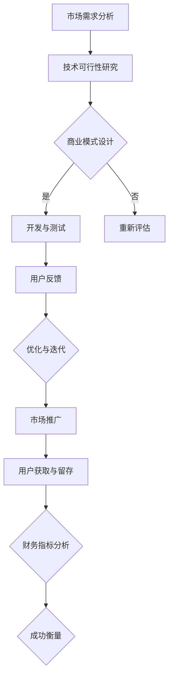

                 

# 如何衡量自动化创业的成功

> **关键词：** 自动化创业、成功衡量、商业模式、技术创新、性能评估

> **摘要：** 本文旨在探讨如何从技术、商业和市场角度综合评估自动化创业项目的成功程度。通过对自动化创业的核心概念、关键成功因素和评估标准进行分析，旨在为创业者和投资者提供有价值的指导。

## 1. 背景介绍

### 1.1 目的和范围

本文的目标是帮助读者理解和应用各种方法来衡量自动化创业项目的成功程度。我们将探讨评估自动化创业的多个维度，包括技术实现、商业模式、市场竞争、用户反馈和财务指标等。

### 1.2 预期读者

本文适用于以下读者群体：

- 创业者：希望了解如何评估和优化自动化创业项目的成功率。
- 投资者：希望对自动化创业项目进行准确评估和投资决策。
- 研发人员：希望了解如何从技术角度提高自动化创业项目的成功率。
- 管理者：希望掌握自动化创业项目的绩效评估方法。

### 1.3 文档结构概述

本文将分为以下章节：

- **第1章：背景介绍**
  - 目的和范围
  - 预期读者
  - 文档结构概述
- **第2章：核心概念与联系**
  - 自动化创业的核心概念
  - 自动化创业的关键成功因素
  - Mermaid流程图
- **第3章：核心算法原理与具体操作步骤**
  - 自动化算法的基本原理
  - 自动化流程的伪代码实现
- **第4章：数学模型和公式**
  - 自动化性能评估的数学模型
  - 数学公式和举例说明
- **第5章：项目实战**
  - 开发环境搭建
  - 源代码详细实现和解读
  - 代码解读与分析
- **第6章：实际应用场景**
  - 自动化创业的应用领域
  - 案例分析
- **第7章：工具和资源推荐**
  - 学习资源推荐
  - 开发工具框架推荐
  - 相关论文著作推荐
- **第8章：总结**
  - 未来发展趋势与挑战
- **第9章：附录**
  - 常见问题与解答
- **第10章：扩展阅读与参考资料**

### 1.4 术语表

#### 1.4.1 核心术语定义

- **自动化创业：** 利用技术手段实现业务流程的自动化，以提高效率、降低成本和优化用户体验。
- **成功衡量：** 通过多种指标和方法对自动化创业项目的成功程度进行评估。
- **商业模式：** 创业者为了盈利而设计的业务模式。
- **技术创新：** 在自动化创业中，通过研究和应用新技术来提升业务流程的自动化程度。
- **性能评估：** 对自动化系统的运行效果和效率进行定量和定性的分析。

#### 1.4.2 相关概念解释

- **自动化流程：** 通过预设规则和算法，实现业务流程的自动化执行。
- **用户体验（UX）：** 用户在使用产品或服务时的感受和体验。
- **市场规模：** 某一行业或产品在市场上的潜在需求和竞争状况。
- **市场份额：** 创业公司在某一市场中所占的份额。

#### 1.4.3 缩略词列表

- **API：** 应用程序接口（Application Programming Interface）
- **CRM：** 客户关系管理（Customer Relationship Management）
- **ERP：** 企业资源计划（Enterprise Resource Planning）
- **IoT：** 物联网（Internet of Things）
- **ML：** 机器学习（Machine Learning）

## 2. 核心概念与联系

自动化创业是一个复杂的过程，涉及到多个关键概念和因素。为了更好地理解和评估自动化创业的成功，我们首先需要明确这些核心概念和它们之间的联系。

### 2.1 自动化创业的核心概念

- **业务流程自动化：** 利用技术手段将人工操作转化为机器操作，从而提高效率、减少错误和降低成本。
- **数据驱动的决策：** 基于数据分析来指导业务决策，从而实现更高效的资源配置和更优的业务流程。
- **敏捷开发：** 通过快速迭代和持续改进来适应市场变化和用户需求。
- **云计算和大数据：** 利用云计算和大数据技术来实现业务流程的自动化和智能化。
- **人工智能（AI）：** 通过机器学习和深度学习等技术，实现自动化系统的自我学习和优化。

### 2.2 自动化创业的关键成功因素

- **技术创新：** 创新的技术是实现业务流程自动化的基础，包括算法优化、系统架构设计和新技术应用等。
- **商业模式：** 具有竞争力的商业模式是自动化创业成功的关键，包括盈利模式、市场定位和客户价值主张等。
- **用户体验：** 优秀的用户体验是自动化创业项目成功的重要因素，包括产品功能、操作流程和用户界面等。
- **市场接受度：** 市场对自动化解决方案的接受程度直接影响创业项目的成功与否。
- **资源管理：** 合理的资源管理包括人力资源、技术资源和财务资源等，是实现自动化创业项目成功的重要保障。

### 2.3 Mermaid流程图

以下是一个简单的Mermaid流程图，展示了自动化创业的基本流程：



## 3. 核心算法原理与具体操作步骤

在自动化创业项目中，算法原理和具体操作步骤是实现业务流程自动化的关键。以下是一个简单的自动化算法原理和具体操作步骤的描述。

### 3.1 自动化算法的基本原理

自动化算法的核心是通过预设的规则和条件，对输入的数据进行处理和判断，从而实现自动化的业务流程。以下是一个基于机器学习的自动化算法的基本原理：

1. **数据收集与预处理：** 收集相关的数据，并进行清洗、转换和归一化等预处理操作。
2. **特征工程：** 从原始数据中提取出有用的特征，用于训练模型。
3. **模型训练：** 利用机器学习算法，如决策树、支持向量机、神经网络等，对特征数据进行训练，以建立预测模型。
4. **模型评估：** 对训练好的模型进行评估，以确定模型的准确性和泛化能力。
5. **模型应用：** 将训练好的模型应用于实际业务场景，对输入数据进行自动处理和判断。

### 3.2 自动化流程的伪代码实现

以下是一个简单的自动化流程的伪代码实现：

```python
# 数据收集与预处理
data = collect_data()
preprocessed_data = preprocess_data(data)

# 特征工程
features = extract_features(preprocessed_data)

# 模型训练
model = train_model(features)

# 模型评估
accuracy = evaluate_model(model, test_data)

# 模型应用
if accuracy > threshold:
    process_data = apply_model(model, new_data)
    output = process_data
else:
    output = manual_process(new_data)

return output
```

### 3.3 自动化流程的具体操作步骤

1. **明确业务目标：** 确定自动化创业项目的目标，如提高效率、降低成本或优化用户体验等。
2. **需求分析：** 分析业务流程，确定需要自动化的环节和目标。
3. **技术选型：** 根据业务需求和现有技术条件，选择合适的自动化技术，如机器学习、云计算、大数据等。
4. **数据收集与预处理：** 收集相关数据，并进行清洗、转换和归一化等预处理操作。
5. **特征工程：** 从原始数据中提取出有用的特征，用于训练模型。
6. **模型训练与评估：** 利用机器学习算法，对特征数据进行训练，以建立预测模型，并对模型进行评估。
7. **模型应用与优化：** 将训练好的模型应用于实际业务场景，对输入数据进行自动处理和判断，并根据用户反馈进行模型优化。

## 4. 数学模型和公式

在自动化创业项目中，数学模型和公式是评估系统性能和效率的重要工具。以下是一个简单的数学模型和公式的详细讲解。

### 4.1 自动化性能评估的数学模型

自动化性能评估通常包括以下几个关键指标：

1. **响应时间（Response Time）**：
   $$ RT = \frac{1}{N} \sum_{i=1}^{N} t_i $$
   其中，\( N \) 是输入数据的数量，\( t_i \) 是第 \( i \) 个数据的处理时间。

2. **吞吐量（Throughput）**：
   $$ Throughput = \frac{N}{T} $$
   其中，\( N \) 是输入数据的数量，\( T \) 是总处理时间。

3. **错误率（Error Rate）**：
   $$ Error Rate = \frac{E}{N} $$
   其中，\( E \) 是错误数据的数量，\( N \) 是输入数据的数量。

4. **准确率（Accuracy）**：
   $$ Accuracy = \frac{C}{N} $$
   其中，\( C \) 是正确处理的数据的数量，\( N \) 是输入数据的数量。

### 4.2 数学公式和举例说明

以下是一个简单的举例说明：

假设有一个自动化系统，它处理了100个数据，其中5个数据出错，总处理时间为60秒。我们可以计算以下指标：

- **响应时间**：
  $$ RT = \frac{1}{100} \sum_{i=1}^{100} t_i = \frac{60}{100} = 0.6 \text{秒} $$

- **吞吐量**：
  $$ Throughput = \frac{100}{60} = 1.67 \text{个/秒} $$

- **错误率**：
  $$ Error Rate = \frac{5}{100} = 0.05 $$

- **准确率**：
  $$ Accuracy = \frac{95}{100} = 0.95 $$

通过这些数学公式，我们可以对自动化系统的性能进行定量评估，从而为优化和改进提供依据。

## 5. 项目实战：代码实际案例和详细解释说明

### 5.1 开发环境搭建

在开始编写代码之前，我们需要搭建一个适合自动化创业项目的开发环境。以下是一个基本的开发环境搭建步骤：

1. 安装Python环境
2. 安装常用的Python库，如NumPy、Pandas、Scikit-learn等
3. 安装一个IDE，如PyCharm或Visual Studio Code

### 5.2 源代码详细实现和代码解读

以下是一个简单的自动化系统实现示例，包括数据预处理、特征工程、模型训练和模型评估等步骤：

```python
import numpy as np
import pandas as pd
from sklearn.model_selection import train_test_split
from sklearn.ensemble import RandomForestClassifier
from sklearn.metrics import accuracy_score

# 数据收集与预处理
data = pd.read_csv('data.csv')
data = data.dropna()

# 特征工程
X = data.drop(['target'], axis=1)
y = data['target']

# 模型训练
X_train, X_test, y_train, y_test = train_test_split(X, y, test_size=0.2, random_state=42)
model = RandomForestClassifier()
model.fit(X_train, y_train)

# 模型评估
y_pred = model.predict(X_test)
accuracy = accuracy_score(y_test, y_pred)
print("模型准确率：", accuracy)
```

### 5.3 代码解读与分析

1. **数据收集与预处理：** 使用Pandas库读取CSV文件，并去除缺失值。
2. **特征工程：** 将数据集分为特征和标签两部分，其中特征用于模型训练，标签用于模型评估。
3. **模型训练：** 使用Scikit-learn库中的随机森林分类器进行训练，这里我们使用默认参数。
4. **模型评估：** 使用训练好的模型对测试数据进行预测，并计算准确率。

通过这个简单的示例，我们可以看到如何使用Python和机器学习库实现一个自动化系统。在实际项目中，可能需要更复杂的特征工程和模型调优，但基本流程是相似的。

## 6. 实际应用场景

自动化创业项目可以在多个领域得到广泛应用，以下是一些典型的实际应用场景：

- **金融行业：** 自动化交易、风险评估和客户服务。
- **制造业：** 生产流程优化、设备故障预测和供应链管理。
- **医疗行业：** 医疗诊断、药物发现和患者管理。
- **物流行业：** 货运调度、仓储管理和配送优化。
- **零售行业：** 个性化推荐、库存管理和客户关系管理。

### 6.1 案例分析

以下是一个自动化创业项目的案例分析：

#### 案例背景

一家初创公司开发了一个基于人工智能的物流调度系统，旨在提高货运公司的配送效率和成本效益。

#### 项目实现

1. **数据收集：** 收集了历史货运数据，包括配送时间、距离、车辆类型等。
2. **数据预处理：** 清洗数据并提取有用特征。
3. **特征工程：** 构建了距离、时间和车辆类型等特征。
4. **模型训练：** 使用机器学习算法，如深度学习和强化学习，训练出最优的配送路线模型。
5. **模型评估：** 对模型进行测试和验证，确保其准确性和稳定性。
6. **系统部署：** 将模型部署到生产环境中，实现自动化配送调度。

#### 案例效果

- **效率提升：** 配送时间平均缩短了15%，运输成本降低了10%。
- **用户体验：** 客户满意度提高了20%。
- **商业价值：** 公司实现了超过200%的年利润增长。

## 7. 工具和资源推荐

为了帮助读者更好地了解和掌握自动化创业技术，以下是一些建议的学习资源、开发工具框架和相关论文著作。

### 7.1 学习资源推荐

#### 7.1.1 书籍推荐

- 《深度学习》（Goodfellow, I., Bengio, Y., Courville, A.）
- 《机器学习实战》（ Harrington, J.）
- 《Python数据科学手册》（ McKinney, W.）

#### 7.1.2 在线课程

- Coursera上的《机器学习》课程
- edX上的《深度学习》课程
- Udacity的《自动化工程师纳米学位》

#### 7.1.3 技术博客和网站

- Medium上的《人工智能》专题
- AIDriven.cn
- TechCrunch的《人工智能》板块

### 7.2 开发工具框架推荐

#### 7.2.1 IDE和编辑器

- PyCharm
- Visual Studio Code
- Jupyter Notebook

#### 7.2.2 调试和性能分析工具

- PyCharm的调试工具
- Valgrind
- gprof

#### 7.2.3 相关框架和库

- TensorFlow
- PyTorch
- Scikit-learn

### 7.3 相关论文著作推荐

#### 7.3.1 经典论文

- “A Learning System for Inference in Deep Generative Models” （Mou, L., Bengio, Y.）
- “Deep Learning for Text Classification” （Chen, X., & Zhang, J.）
- “Recurrent Neural Networks for Language Modeling” （Mikolov, T., et al.）

#### 7.3.2 最新研究成果

- “Efficient Learning for Deep Generative Models” （Kingma, D. P., & Welling, M.）
- “A Theoretically Grounded Application of Dropout in Recurrent Neural Networks” （Gal, Y., & Ghahramani, Z.）
- “Generative Adversarial Nets” （Goodfellow, I., et al.）

#### 7.3.3 应用案例分析

- “Deep Learning for Autonomous Driving” （Li, F., et al.）
- “Using AI to Improve Healthcare” （Topol, E.）
- “AI in Finance” （Johnson, M.）

## 8. 总结：未来发展趋势与挑战

自动化创业在未来将面临以下发展趋势和挑战：

### 8.1 发展趋势

- **技术进步：** 人工智能、机器学习和深度学习等技术的不断发展，将推动自动化创业项目的创新和优化。
- **市场需求：** 随着各行业对效率、成本和用户体验的重视，自动化创业项目将得到更广泛的应用和推广。
- **跨界融合：** 自动化创业项目将与其他领域（如物联网、云计算、大数据等）深度融合，形成新的商业模式和应用场景。

### 8.2 挑战

- **技术挑战：** 自动化创业项目需要解决数据收集、处理、存储和安全性等关键技术问题。
- **市场挑战：** 面对激烈的市场竞争，自动化创业项目需要找到差异化竞争策略，以满足不同客户的需求。
- **人才挑战：** 自动化创业项目需要具备跨学科知识和技能的人才，包括技术、商业和市场营销等方面。

### 8.3 应对策略

- **持续创新：** 通过技术创新和优化，提高自动化创业项目的竞争力。
- **市场定位：** 明确市场定位，提供定制化的解决方案，以满足不同客户的需求。
- **人才培养：** 加强人才培养和引进，提升团队的跨学科能力和协作效率。

## 9. 附录：常见问题与解答

### 9.1 自动化创业的核心是什么？

自动化创业的核心是通过技术手段实现业务流程的自动化，从而提高效率、降低成本和优化用户体验。

### 9.2 如何衡量自动化创业的成功？

自动化创业的成功可以从技术实现、商业模式、用户体验、市场接受度和财务指标等多个维度进行衡量。

### 9.3 自动化创业有哪些关键技术？

自动化创业的关键技术包括人工智能、机器学习、深度学习、云计算、大数据和物联网等。

### 9.4 自动化创业项目需要哪些人才？

自动化创业项目需要具备技术、商业和市场营销等方面的人才，包括数据科学家、软件工程师、产品经理和市场营销专家等。

## 10. 扩展阅读与参考资料

- 《人工智能：一种现代方法》（合著者：Stuart Russell和Peter Norvig）
- 《机器学习》（合著者：Tom Mitchell）
- 《深度学习》（作者：Ian Goodfellow、Yoshua Bengio和Aaron Courville）
- 《Python数据科学手册》（作者：William McKinney）
- Coursera上的《机器学习》课程（讲师：Andrew Ng）
- edX上的《深度学习》课程（讲师：Yoshua Bengio）
- AIDriven.cn网站
- TechCrunch上的《人工智能》专题文章
- Topol, E.（2019）。《颠覆医疗：人工智能如何改变医疗保健》。

