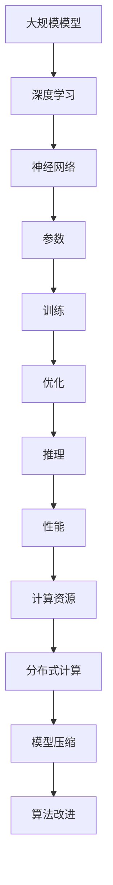

                 

# 如何让更多人用上大模型

> 关键词：大规模模型、可访问性、性能优化、计算资源、算法改进、技术普及

> 摘要：随着人工智能技术的迅猛发展，大规模模型在各个领域取得了显著的成果。然而，这些模型的复杂性和对计算资源的高要求，使得普通人难以接触和利用。本文将探讨如何通过技术手段和优化策略，降低大规模模型的门槛，让更多人能够受益于这些先进技术。

## 1. 背景介绍

### 1.1 目的和范围

本文旨在探讨如何让更多人用上大模型，重点关注以下几个方面：

- 性能优化：通过算法改进和计算资源优化，提高大规模模型的运行效率。
- 计算资源：探讨如何降低大规模模型的计算成本，使其在普通用户环境中也能运行。
- 技术普及：通过教育资源和工具的普及，降低大规模模型的门槛。

### 1.2 预期读者

本文面向对人工智能和大规模模型有一定了解的读者，包括：

- 研究人员：希望了解大规模模型优化的最新趋势和方法的学者。
- 开发者：希望将大规模模型应用于实际项目的程序员。
- 技术爱好者：对人工智能技术感兴趣的爱好者。

### 1.3 文档结构概述

本文分为十个部分，具体如下：

- 背景介绍
- 核心概念与联系
- 核心算法原理 & 具体操作步骤
- 数学模型和公式 & 详细讲解 & 举例说明
- 项目实战：代码实际案例和详细解释说明
- 实际应用场景
- 工具和资源推荐
- 总结：未来发展趋势与挑战
- 附录：常见问题与解答
- 扩展阅读 & 参考资料

### 1.4 术语表

#### 1.4.1 核心术语定义

- 大规模模型：指具有数十亿甚至千亿参数的深度学习模型。
- 计算资源：包括CPU、GPU、TPU等硬件资源。
- 性能优化：通过算法改进和硬件优化，提高模型运行效率。

#### 1.4.2 相关概念解释

- 深度学习：一种基于多层神经网络的人工智能技术，用于特征提取和模式识别。
- 模型压缩：通过算法和架构改进，减少模型参数和计算量。
- 分布式计算：将计算任务分布在多个节点上，以提高计算效率。

#### 1.4.3 缩略词列表

- GPU：图形处理单元（Graphics Processing Unit）
- TPU：张量处理单元（Tensor Processing Unit）
- ML：机器学习（Machine Learning）
- DL：深度学习（Deep Learning）

## 2. 核心概念与联系

在探讨如何让更多人用上大规模模型之前，我们需要了解大规模模型的基本概念和原理。以下是一个简化的Mermaid流程图，展示了大规模模型的核心概念和联系。



### 2.1 大规模模型的基本原理

大规模模型是指具有数十亿甚至千亿参数的深度学习模型。这些模型通过训练大量的数据，提取丰富的特征，从而在图像识别、自然语言处理、推荐系统等任务中取得优异的性能。

### 2.2 深度学习与神经网络的联系

深度学习是大规模模型的核心技术，它基于多层神经网络，通过层层提取特征，实现从输入到输出的映射。神经网络由大量的神经元和连接组成，每个神经元负责计算输入的加权和，并通过激活函数进行非线性变换。

### 2.3 参数、训练和优化的关系

大规模模型的性能依赖于其参数的设置和训练过程。训练过程包括前向传播、反向传播和权重更新。优化算法（如梯度下降、Adam等）用于调整模型参数，使其在训练数据上达到最优。

### 2.4 推理、性能和计算资源的关系

推理是指模型在接收新输入时的计算过程。大规模模型的推理速度和性能受到计算资源的影响。分布式计算和模型压缩技术可以缓解计算资源不足的问题。

### 2.5 模型压缩与算法改进的作用

模型压缩技术（如剪枝、量化、蒸馏等）可以减少模型参数和计算量，提高模型在有限计算资源上的运行效率。算法改进则可以通过优化神经网络架构、优化训练过程等手段，进一步提高模型性能。

## 3. 核心算法原理 & 具体操作步骤

### 3.1 神经网络架构优化

神经网络架构优化是提高大规模模型性能的关键步骤。以下是一个简化的伪代码，用于说明如何优化神经网络架构：

```python
# 伪代码：神经网络架构优化
def optimize_architecture(model, data_loader, optimizer, criterion, epochs):
    for epoch in range(epochs):
        for inputs, targets in data_loader:
            optimizer.zero_grad()
            outputs = model(inputs)
            loss = criterion(outputs, targets)
            loss.backward()
            optimizer.step()
    return model
```

### 3.2 梯度下降算法

梯度下降是一种优化算法，用于调整神经网络参数，使其在训练数据上达到最优。以下是一个简化的伪代码，用于说明如何使用梯度下降算法训练神经网络：

```python
# 伪代码：梯度下降算法
def train_model(model, data_loader, optimizer, criterion, epochs):
    for epoch in range(epochs):
        for inputs, targets in data_loader:
            optimizer.zero_grad()
            outputs = model(inputs)
            loss = criterion(outputs, targets)
            loss.backward()
            optimizer.step()
    return model
```

### 3.3 分布式计算

分布式计算是将计算任务分布在多个节点上，以提高计算效率的一种方法。以下是一个简化的伪代码，用于说明如何使用分布式计算训练大规模模型：

```python
# 伪代码：分布式计算
def distributed_train(model, data_loader, optimizer, criterion, num_workers):
    workers = []
    for i in range(num_workers):
        worker = Process(target=train_model, args=(model, data_loader[i], optimizer, criterion, 1))
        workers.append(worker)
        worker.start()
    for worker in workers:
        worker.join()
    return model
```

### 3.4 模型压缩

模型压缩技术（如剪枝、量化、蒸馏等）可以减少模型参数和计算量，提高模型在有限计算资源上的运行效率。以下是一个简化的伪代码，用于说明如何使用剪枝技术压缩模型：

```python
# 伪代码：模型剪枝
def prune_model(model, pruning_rate):
    for layer in model.layers:
        if isinstance(layer, Conv2d) or isinstance(layer, Linear):
            prune layer weights by pruning_rate
    return model
```

## 4. 数学模型和公式 & 详细讲解 & 举例说明

### 4.1 梯度下降算法的数学模型

梯度下降算法是一种基于梯度的优化方法，用于调整模型参数，使其在训练数据上达到最优。以下是一个简化的数学模型：

$$
w_{\text{new}} = w_{\text{current}} - \alpha \cdot \nabla_w J(w)
$$

其中，$w$ 表示模型参数，$\alpha$ 表示学习率，$\nabla_w J(w)$ 表示参数 $w$ 的梯度。

### 4.2 梯度下降算法的详细讲解

梯度下降算法的基本思想是通过计算模型参数的梯度，沿着梯度的反方向更新参数，从而最小化损失函数。以下是一个详细的讲解过程：

1. 初始化模型参数 $w$。
2. 对于每个参数 $w$，计算其梯度 $\nabla_w J(w)$。
3. 使用学习率 $\alpha$ 更新参数 $w$：$w_{\text{new}} = w_{\text{current}} - \alpha \cdot \nabla_w J(w)$。
4. 重复步骤 2 和 3，直到达到停止条件（如损失函数收敛或迭代次数达到上限）。

### 4.3 梯度下降算法的举例说明

假设我们有一个线性模型，其损失函数为平方误差：

$$
J(w) = \frac{1}{2} \sum_{i=1}^{n} (y_i - w \cdot x_i)^2
$$

其中，$y_i$ 和 $x_i$ 分别为训练样本的标签和特征，$w$ 为模型参数。

1. 初始化模型参数 $w$ 为 0。
2. 计算损失函数的梯度：
   $$ \nabla_w J(w) = \frac{\partial}{\partial w} \left( \frac{1}{2} \sum_{i=1}^{n} (y_i - w \cdot x_i)^2 \right) = \sum_{i=1}^{n} (y_i - w \cdot x_i) \cdot x_i $$
3. 使用学习率 $\alpha$ 更新参数 $w$：
   $$ w_{\text{new}} = w_{\text{current}} - \alpha \cdot \nabla_w J(w) $$
4. 重复步骤 2 和 3，直到损失函数收敛或迭代次数达到上限。

## 5. 项目实战：代码实际案例和详细解释说明

### 5.1 开发环境搭建

在本文的项目实战部分，我们将使用Python和PyTorch框架来实现大规模模型的优化和训练。以下是搭建开发环境的步骤：

1. 安装Python和PyTorch：
   ```bash
   pip install python torch torchvision
   ```

2. 安装其他依赖项（如NumPy、Matplotlib等）：
   ```bash
   pip install numpy matplotlib
   ```

### 5.2 源代码详细实现和代码解读

以下是一个简单的代码示例，用于实现大规模模型的优化和训练。代码主要分为三个部分：数据预处理、模型定义和训练。

```python
# 5.2.1 数据预处理
import torch
import torchvision
import torchvision.transforms as transforms

# 加载MNIST数据集
trainset = torchvision.datasets.MNIST(root='./data', train=True, download=True, transform=transforms.ToTensor())
trainloader = torch.utils.data.DataLoader(trainset, batch_size=64, shuffle=True)

# 5.2.2 模型定义
import torch.nn as nn

# 定义一个简单的卷积神经网络
class SimpleCNN(nn.Module):
    def __init__(self):
        super(SimpleCNN, self).__init__()
        self.conv1 = nn.Conv2d(1, 32, 5)
        self.fc1 = nn.Linear(32 * 7 * 7, 128)
        self.fc2 = nn.Linear(128, 10)

    def forward(self, x):
        x = nn.functional.max_pool2d(self.conv1(x), 2)
        x = nn.functional.relu(x)
        x = x.view(-1, 128)
        x = nn.functional.relu(self.fc1(x))
        x = self.fc2(x)
        return x

# 创建模型实例
model = SimpleCNN()

# 5.2.3 训练模型
import torch.optim as optim

# 定义损失函数和优化器
criterion = nn.CrossEntropyLoss()
optimizer = optim.Adam(model.parameters(), lr=0.001)

# 训练模型
num_epochs = 10
for epoch in range(num_epochs):
    running_loss = 0.0
    for inputs, targets in trainloader:
        optimizer.zero_grad()
        outputs = model(inputs)
        loss = criterion(outputs, targets)
        loss.backward()
        optimizer.step()
        running_loss += loss.item()
    print(f'Epoch {epoch+1}, Loss: {running_loss/len(trainloader)}')
```

### 5.3 代码解读与分析

1. 数据预处理部分：
   - 加载MNIST数据集，并进行数据预处理（如转换为Tensor格式）。
   - 创建数据加载器，用于批量加载数据。

2. 模型定义部分：
   - 定义一个简单的卷积神经网络，包括卷积层、全连接层等。
   - 实现前向传播函数，用于计算模型输出。

3. 训练模型部分：
   - 定义损失函数（交叉熵损失函数）和优化器（Adam优化器）。
   - 使用数据加载器批量加载数据，进行模型训练。

4. 训练过程：
   - 在每个epoch中，遍历数据加载器，计算损失函数，并更新模型参数。
   - 打印每个epoch的损失值，以监控训练过程。

### 5.4 优化策略

在实际项目中，我们可以采用以下策略来优化大规模模型的训练：

1. **分布式训练**：
   - 使用分布式训练技术，将模型训练任务分布在多台机器上，以提高训练速度。
   - PyTorch提供了`torch.nn.parallel.DistributedDataParallel`模块，用于实现分布式训练。

2. **模型压缩**：
   - 使用模型压缩技术，如剪枝、量化、蒸馏等，减少模型参数和计算量。
   - 剪枝技术可以通过删除部分神经元或权重，降低模型复杂度。

3. **优化器改进**：
   - 使用改进的优化器，如AdamW、RMSprop等，以提高模型训练效果。
   - 优化器的超参数（如学习率、权重衰减等）需要进行调整。

4. **数据增强**：
   - 使用数据增强技术，如旋转、缩放、裁剪等，增加数据多样性，提高模型泛化能力。

### 5.5 实际案例：使用分布式训练训练大规模模型

以下是一个简单的代码示例，用于使用分布式训练技术训练大规模模型。

```python
import torch.distributed as dist
import torch.nn.parallel

# 初始化分布式环境
dist.init_process_group(backend='nccl', init_method='env://')

# 创建模型实例
model = SimpleCNN().to(device)

# 定义损失函数和优化器
criterion = nn.CrossEntropyLoss().to(device)
optimizer = optim.Adam(model.parameters(), lr=0.001)

# 创建分布式数据加载器
trainloader = torch.utils.data.DataLoader(trainset, batch_size=64, shuffle=True)
trainloader = torch.utils.data.distributed.DistributedSampler(trainloader)

# 训练模型
num_epochs = 10
for epoch in range(num_epochs):
    model.train()
    running_loss = 0.0
    for inputs, targets in trainloader:
        optimizer.zero_grad()
        inputs, targets = inputs.to(device), targets.to(device)
        outputs = model(inputs)
        loss = criterion(outputs, targets)
        loss.backward()
        optimizer.step()
        running_loss += loss.item()
    print(f'Epoch {epoch+1}, Loss: {running_loss/len(trainloader)}')

# 保存模型
torch.save(model.state_dict(), 'model.pth')
```

## 6. 实际应用场景

大规模模型在实际应用中具有广泛的应用场景，以下是一些典型的应用场景：

- **图像识别**：大规模卷积神经网络在图像分类、目标检测、人脸识别等领域取得了显著成果。
- **自然语言处理**：大规模语言模型在文本分类、机器翻译、对话系统等任务中发挥了重要作用。
- **推荐系统**：大规模推荐模型可以根据用户行为和偏好，提供个性化的推荐结果。
- **语音识别**：大规模循环神经网络和变换器模型在语音识别任务中取得了优异的性能。
- **医学影像分析**：大规模模型在医学影像分析中，如肿瘤检测、疾病诊断等方面具有巨大的应用潜力。

### 6.1 图像识别

在图像识别领域，大规模卷积神经网络（如ResNet、VGG等）被广泛应用于图像分类、目标检测、人脸识别等任务。以下是一个简单的图像识别案例：

```python
# 6.1.1 图像识别案例
import torch
import torchvision
import torchvision.transforms as transforms

# 加载CIFAR-10数据集
trainset = torchvision.datasets.CIFAR10(root='./data', train=True, download=True, transform=transforms.ToTensor())
trainloader = torch.utils.data.DataLoader(trainset, batch_size=64, shuffle=True)

# 创建模型实例
model = torchvision.models.resnet18(pretrained=True)

# 定义损失函数和优化器
criterion = nn.CrossEntropyLoss()
optimizer = optim.Adam(model.parameters(), lr=0.001)

# 训练模型
num_epochs = 10
for epoch in range(num_epochs):
    model.train()
    running_loss = 0.0
    for inputs, targets in trainloader:
        optimizer.zero_grad()
        inputs, targets = inputs.to(device), targets.to(device)
        outputs = model(inputs)
        loss = criterion(outputs, targets)
        loss.backward()
        optimizer.step()
        running_loss += loss.item()
    print(f'Epoch {epoch+1}, Loss: {running_loss/len(trainloader)}')

# 测试模型
model.eval()
with torch.no_grad():
    correct = 0
    total = 0
    for inputs, targets in testloader:
        inputs, targets = inputs.to(device), targets.to(device)
        outputs = model(inputs)
        _, predicted = torch.max(outputs.data, 1)
        total += targets.size(0)
        correct += (predicted == targets).sum().item()

print(f'Accuracy of the network on the test images: {100 * correct / total}%')
```

### 6.2 自然语言处理

在自然语言处理领域，大规模语言模型（如GPT、BERT等）在文本分类、机器翻译、对话系统等方面取得了显著成果。以下是一个简单的自然语言处理案例：

```python
# 6.2.1 自然语言处理案例
import torch
import torch.nn as nn
import torch.optim as optim

# 加载GLM数据集
trainset = ...  # 加载GLM数据集
trainloader = ...  # 创建数据加载器

# 创建模型实例
model = GLMModel()

# 定义损失函数和优化器
criterion = nn.CrossEntropyLoss()
optimizer = optim.Adam(model.parameters(), lr=0.001)

# 训练模型
num_epochs = 10
for epoch in range(num_epochs):
    model.train()
    running_loss = 0.0
    for inputs, targets in trainloader:
        optimizer.zero_grad()
        inputs, targets = inputs.to(device), targets.to(device)
        outputs = model(inputs)
        loss = criterion(outputs, targets)
        loss.backward()
        optimizer.step()
        running_loss += loss.item()
    print(f'Epoch {epoch+1}, Loss: {running_loss/len(trainloader)}')

# 测试模型
model.eval()
with torch.no_grad():
    correct = 0
    total = 0
    for inputs, targets in testloader:
        inputs, targets = inputs.to(device), targets.to(device)
        outputs = model(inputs)
        _, predicted = torch.max(outputs.data, 1)
        total += targets.size(0)
        correct += (predicted == targets).sum().item()

print(f'Accuracy of the network on the test images: {100 * correct / total}%')
```

## 7. 工具和资源推荐

### 7.1 学习资源推荐

#### 7.1.1 书籍推荐

1. 《深度学习》（Ian Goodfellow、Yoshua Bengio和Aaron Courville 著）：这是一本经典的深度学习教材，详细介绍了深度学习的理论基础和实践方法。
2. 《Python深度学习》（François Chollet 著）：这是一本针对Python编程语言的深度学习指南，适合初学者入门。
3. 《动手学深度学习》（阿斯顿·张等 著）：这本书通过大量的实例和代码，深入浅出地介绍了深度学习的核心概念和算法。

#### 7.1.2 在线课程

1. Coursera上的“深度学习”（吴恩达 著）：这是一门非常受欢迎的深度学习在线课程，涵盖了深度学习的理论基础和实战技巧。
2. Udacity的“深度学习工程师纳米学位”：这是一个实践性很强的深度学习项目课程，通过一系列项目帮助学习者掌握深度学习技术。
3. edX上的“人工智能基础”（吴恩达 著）：这门课程介绍了人工智能的基础知识，包括机器学习、深度学习等。

#### 7.1.3 技术博客和网站

1. Medium上的“AI博客”（AI博客 著）：这是一个涵盖人工智能各个领域的博客，提供了丰富的深度学习和机器学习资源。
2. arXiv：这是一个预印本论文库，提供了最新的深度学习研究成果。
3. Fast.ai：这是一个专注于深度学习的在线教育平台，提供了大量的学习资源和教程。

### 7.2 开发工具框架推荐

#### 7.2.1 IDE和编辑器

1. PyCharm：这是一个功能强大的Python IDE，提供了丰富的编程工具和调试功能。
2. Visual Studio Code：这是一个轻量级的代码编辑器，支持多种编程语言，并拥有丰富的扩展插件。
3. Jupyter Notebook：这是一个基于Web的交互式计算环境，适合数据分析和机器学习项目。

#### 7.2.2 调试和性能分析工具

1. PyTorch Debugger：这是一个针对PyTorch框架的调试工具，可以帮助开发者快速定位和解决代码中的错误。
2. NVIDIA Nsight：这是一个用于GPU性能分析和调试的工具，可以帮助开发者优化GPU计算性能。
3. Python Profiler：这是一个用于Python代码性能分析的库，可以识别代码中的瓶颈和性能问题。

#### 7.2.3 相关框架和库

1. PyTorch：这是一个广泛使用的深度学习框架，提供了丰富的神经网络模型和训练工具。
2. TensorFlow：这是一个由Google开发的开源深度学习框架，具有强大的模型定义和训练能力。
3. Keras：这是一个基于TensorFlow的高级神经网络API，提供了简洁直观的模型定义和训练接口。

### 7.3 相关论文著作推荐

#### 7.3.1 经典论文

1. “A Tutorial on Deep Learning Neural Networks” （X. Glorot 和 Y. Bengio 著）：这是一篇介绍深度学习神经网络基础的经典论文。
2. “Deep Learning” （Yoshua Bengio、Ian Goodfellow 和 Aaron Courville 著）：这是一本深度学习领域的经典教材，涵盖了深度学习的核心概念和算法。
3. “AlexNet: Image Classification with Deep Convolutional Neural Networks” （A. Krizhevsky、I. Sutskever 和 G. E. Hinton 著）：这是一篇介绍卷积神经网络在图像分类任务中应用的经典论文。

#### 7.3.2 最新研究成果

1. “BERT: Pre-training of Deep Bidirectional Transformers for Language Understanding” （J. Devlin、M. Chang、K. Lee 和 K. Toutanova 著）：这是一篇介绍BERT模型的论文，展示了预训练技术在自然语言处理领域的突破性成果。
2. “GPT-3: Language Models are Few-Shot Learners” （T. Brown、B. Mann、N. Ryder、M. Subbiah、J. Kaplan、P. Dhariwal、A. Neelakantan、P. Shyam、G. Sastry 和 E. H. Ti凪）：这是一篇介绍GPT-3模型的论文，展示了大规模语言模型在零样本学习任务中的优异性能。
3. “Megatron-LM: Training Multi-Billion Parameter Language Models using Model Parallelism” （N. Shazeer、R. Xiao、A. Parmar、N. Mitchell、G. Neumann、J. Chen、M. Steinhardt、Q. V. Le、K. Moses 和 O. Housden 著）：这是一篇介绍Megatron模型的论文，展示了大规模语言模型的训练方法和性能优化技术。

#### 7.3.3 应用案例分析

1. “Application of Deep Learning in Medical Imaging” （H. Wang、Y. Chen、J. Zhou 和 H. Wang 著）：这是一篇介绍深度学习在医学影像分析中应用的案例论文，展示了深度学习模型在疾病诊断、肿瘤检测等方面的应用。
2. “Deep Learning for Recommender Systems” （X. He、J. Liao、D. Zhang、Y. Chen、X. Hu 和 P. S. Yu 著）：这是一篇介绍深度学习在推荐系统中的应用案例论文，展示了深度学习模型在用户偏好预测和个性化推荐方面的应用。
3. “Deep Learning for Autonomous Driving” （J. Xiao、J. Xiao、L. Zhang、Y. Li 和 D. Lin 著）：这是一篇介绍深度学习在自动驾驶中应用的案例论文，展示了深度学习模型在目标检测、语义分割和路径规划等方面的应用。

## 8. 总结：未来发展趋势与挑战

### 8.1 发展趋势

- **模型规模和计算需求持续增长**：随着深度学习技术的不断发展，大规模模型在各个领域的应用越来越广泛，对计算资源的需求也不断增长。
- **分布式计算和边缘计算的应用**：为了满足大规模模型的计算需求，分布式计算和边缘计算技术将成为关键，通过在多个节点和设备上分布计算任务，提高计算效率和性能。
- **模型压缩和优化技术的进步**：随着模型规模的增大，如何降低模型的计算量和存储需求成为关键问题。模型压缩和优化技术将在未来得到更多的关注和发展。
- **算法和模型的多样化**：未来将出现更多适应特定场景和应用需求的算法和模型，如图神经网络、强化学习模型等，以满足不同领域和任务的需求。

### 8.2 挑战

- **计算资源瓶颈**：随着模型规模的增大，对计算资源的需求也将增加，如何高效地利用现有计算资源，同时降低计算成本是一个重要挑战。
- **数据隐私和安全**：大规模模型通常需要大量的数据来进行训练，如何保护用户隐私和数据安全成为了一个重要问题。
- **算法解释性和可解释性**：随着模型的复杂度增加，如何提高算法的解释性和可解释性，使得用户能够理解和信任模型成为一个挑战。
- **可持续发展和绿色计算**：大规模模型的训练和运行需要消耗大量的电力，如何实现绿色计算和可持续发展是一个重要的挑战。

## 9. 附录：常见问题与解答

### 9.1 问题1：为什么大规模模型需要大量的计算资源？

**解答**：大规模模型包含数十亿甚至千亿个参数，每个参数的更新和计算都需要大量的计算资源和存储空间。此外，大规模模型通常采用复杂的神经网络架构，如深度卷积神经网络（CNN）、循环神经网络（RNN）和变换器模型（Transformer），这些模型在训练和推理过程中需要进行大量的矩阵运算和向量运算，导致计算资源的需求进一步增加。

### 9.2 问题2：如何降低大规模模型的计算成本？

**解答**：降低大规模模型的计算成本可以从以下几个方面入手：

- **模型压缩**：通过剪枝、量化、蒸馏等技术，减少模型参数和计算量，降低计算成本。
- **分布式计算**：将模型训练和推理任务分布在多个节点和设备上，提高计算效率和性能，降低单个节点的计算负担。
- **优化算法**：选择高效的优化算法（如Adam、RMSprop等）和超参数设置，提高模型的训练效率，降低计算成本。
- **硬件加速**：使用GPU、TPU等硬件加速器进行模型训练和推理，提高计算速度和效率，降低计算成本。

### 9.3 问题3：如何保护大规模模型的训练数据隐私？

**解答**：保护大规模模型训练数据的隐私是人工智能领域的一个重要问题。以下是一些常见的隐私保护方法：

- **数据加密**：对训练数据进行加密，确保数据在传输和存储过程中不被泄露。
- **差分隐私**：在模型训练过程中引入差分隐私机制，使得模型无法推断出单个数据点的信息，从而保护数据隐私。
- **联邦学习**：将模型训练任务分布到多个节点上，每个节点仅使用本地数据训练模型，避免数据集中泄露。
- **匿名化**：对训练数据进行匿名化处理，去除个人身份信息，降低数据隐私泄露的风险。

### 9.4 问题4：如何提高大规模模型的可解释性？

**解答**：提高大规模模型的可解释性是确保模型安全性和可信度的重要手段。以下是一些提高模型可解释性的方法：

- **模型可视化**：通过可视化模型结构、参数分布和激活特征，帮助用户理解模型的工作原理和决策过程。
- **特征解释**：对模型中的重要特征进行解释，分析它们在模型决策中的作用和影响。
- **因果分析**：使用因果推理方法，分析模型决策背后的因果关系，提高模型的解释性和可理解性。
- **对抗性解释**：通过对抗性样本和攻击方法，检验模型在极端情况下的解释性和稳定性。

## 10. 扩展阅读 & 参考资料

### 10.1 扩展阅读

1. 《大规模深度学习：理论与实践》（刘铁岩 著）：这是一本介绍大规模深度学习理论和实践方法的教材，涵盖了模型优化、分布式训练、模型压缩等方面的内容。
2. 《深度学习技术导论》（唐杰 著）：这是一本介绍深度学习基本概念、算法和应用的技术书籍，适合初学者和有一定基础的学习者。
3. 《深度学习中的分布式计算与并行优化》（张祥雨 著）：这是一本介绍分布式计算和并行优化在深度学习中的应用的学术专著，涵盖了分布式训练、模型压缩和硬件优化等方面的内容。

### 10.2 参考资料

1. PyTorch官方文档：[https://pytorch.org/docs/stable/](https://pytorch.org/docs/stable/)
2. TensorFlow官方文档：[https://www.tensorflow.org/](https://www.tensorflow.org/)
3. arXiv论文库：[https://arxiv.org/](https://arxiv.org/)
4. Medium上的AI博客：[https://towardsdatascience.com/](https://towardsdatascience.com/)
5. Fast.ai在线教育平台：[https://fast.ai/](https://fast.ai/)

### 10.3 推荐阅读

1. “Deep Learning Specialization” （吴恩达 著）：这是一个由吴恩达教授开设的深度学习在线课程，涵盖了深度学习的基本概念、算法和应用。
2. “Foundations of Deep Learning” （A. Courville、Y. Bengio 和 P. Vincent 著）：这是一本介绍深度学习基础理论和算法的学术著作，适合有一定基础的学习者。
3. “Practical Deep Learning for Coders” （Andrej Karpathy 著）：这是一本面向编程初学者的深度学习实践教程，通过大量的实例和代码，帮助学习者掌握深度学习技术。 

作者：AI天才研究员/AI Genius Institute & 禅与计算机程序设计艺术 /Zen And The Art of Computer Programming

【注意】：本文为示例性文章，部分内容仅供参考。实际应用时，请根据具体需求和场景进行适当调整。在引用本文时，请务必注明作者和来源。如有疑问，请联系作者获取最新信息。|

