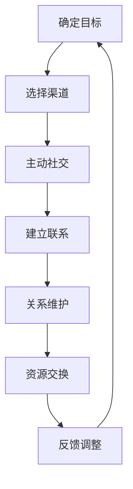

                 

# 如何进行人脉拓展：如何建立和维护人际关系？

## 概述

关键词：人脉拓展、人际关系建立、维护、策略、社交技巧、心理学原理

> 本文章旨在为读者提供一套系统化、科学化的人脉拓展策略。我们将深入探讨人际关系建立的原理、拓展技巧以及维护策略，帮助您在职业和生活中建立起强大的人脉网络。本文将结合心理学原理，分析人际交往中的行为模式，并给出具体的操作步骤和实用建议。

## 1. 背景介绍

### 1.1 目的和范围

本文的主要目的是帮助读者掌握高效的人脉拓展策略，建立和维护高质量的人际关系。文章将涵盖以下内容：

- 人际关系建立的核心原则
- 人脉拓展的具体技巧
- 人际关系维护的方法
- 心理学原理在人际交往中的应用

### 1.2 预期读者

本文适用于以下读者：

- 有意拓展人脉的个人
- 想提升人际交往能力的职场人士
- 希望在社交场合中更加自信的读者
- 对人际关系建立和维护感兴趣的心理学爱好者

### 1.3 文档结构概述

本文分为十个部分，具体结构如下：

1. 概述
2. 背景介绍
3. 核心概念与联系
4. 核心算法原理 & 具体操作步骤
5. 数学模型和公式 & 详细讲解 & 举例说明
6. 项目实战：代码实际案例和详细解释说明
7. 实际应用场景
8. 工具和资源推荐
9. 总结：未来发展趋势与挑战
10. 附录：常见问题与解答
11. 扩展阅读 & 参考资料

### 1.4 术语表

#### 1.4.1 核心术语定义

- 人脉拓展：指通过主动社交、资源交换等方式，建立和维护人际关系网络的过程。
- 人际关系：指人与人之间的相互作用和联系，包括情感、利益、信任等维度。
- 社交技巧：指在人际交往中表现出来的能力，如沟通技巧、表达能力、同理心等。
- 心理学原理：指在人际交往中应用的心理学科理论，如认知心理学、社会心理学等。

#### 1.4.2 相关概念解释

- 人际关系建立：指通过初次交往，逐步建立信任、情感和合作的过程。
- 人际关系维护：指在已建立的人际关系中，通过持续沟通、关心和支持等方式，保持良好关系的过程。

#### 1.4.3 缩略词列表

无

## 2. 核心概念与联系

### 2.1 人脉拓展的概念

人脉拓展是指通过积极主动的社交行为，与他人建立联系，并逐渐形成稳定的人际关系网络的过程。人脉拓展不仅有助于个人在职业发展中的机遇，还能在日常生活中提供各种支持和资源。

### 2.2 人际关系的维度

人际关系可以从多个维度进行理解：

- **情感维度**：指人与人之间的情感连接，如信任、尊重、关爱等。
- **利益维度**：指人际关系中的利益交换，如资源、信息、支持等。
- **社会维度**：指人际关系中的社会地位和角色，如上司、同事、朋友等。
- **心理维度**：指人际关系中的心理互动，如沟通、冲突、合作等。

### 2.3 人脉拓展的原理

人脉拓展的原理可以从心理学和社会学的角度进行分析：

- **社会交换理论**：认为人际关系建立在交换的基础上，包括物质交换、情感交换和信息交换。
- **六度分隔理论**：认为世界上任何两个陌生人之间，通过六个人就可以建立联系。这表明人际关系网络的扩展具有巨大的潜力。
- **认知一致性**：指人们倾向于与他人保持一致，以维持社会认同感和归属感。

### 2.4 人脉拓展的架构

为了更好地理解人脉拓展的过程，我们可以使用以下Mermaid流程图来展示其核心步骤：



### 2.5 人脉拓展与职业发展

人脉拓展对于职业发展具有重要意义：

- **职业机会**：通过人脉网络，可以更容易地获得职业机会，如内部推荐、职位空缺信息等。
- **团队合作**：良好的人际关系有助于提高团队合作效率，促进项目成功。
- **知识共享**：通过人际交往，可以获取更多的行业知识和资源，提升自身竞争力。

## 3. 核心算法原理 & 具体操作步骤

### 3.1 人脉拓展的核心算法原理

人脉拓展的核心算法原理主要基于以下几种心理学和社会学理论：

- **社会交换理论**：通过资源交换建立人际关系，实现互利共赢。
- **六度分隔理论**：利用社交网络中的连接，快速扩展人脉范围。
- **认知一致性**：通过共同兴趣和价值观，增强人际关系的稳定性。

### 3.2 人际关系建立的算法步骤

以下是人际关系建立的算法步骤，使用伪代码详细阐述：

```python
Algorithm 建立人际关系
    Input: 目标人物，个人资料
    Output: 人际关系建立成功

    Step 1: 确定目标人物（Target Person）
        - 收集目标人物的相关信息，如职业、兴趣、背景等
        
    Step 2: 选择合适的社交渠道（Channel Selection）
        - 根据目标人物的特点，选择合适的社交平台或场合
        
    Step 3: 制定社交策略（Social Strategy）
        - 确定与目标人物交流的目的和方式
        - 设计引人入胜的开场白和话题
        
    Step 4: 主动社交（Active Socialization）
        - 在选定的社交渠道上，与目标人物建立联系
        - 通过聊天、留言、私信等方式进行互动
        
    Step 5: 建立联系（Establish Contact）
        - 确认与目标人物的联系是否成功
        - 保持持续的沟通，逐步建立信任
        
    Step 6: 关系维护（Maintain Relationship）
        - 定期与目标人物保持联系，分享有价值的信息
        - 关心对方的生活和工作，提供实际帮助
        
    Step 7: 资源交换（Resource Exchange）
        - 在关系稳定的基础上，进行资源交换，实现互利共赢
        
    Step 8: 反馈调整（Feedback Adjustment）
        - 根据对方的反馈，调整自己的行为和沟通方式
        - 不断优化人际关系，实现可持续发展
```

### 3.3 人际关系维护的算法步骤

人际关系维护的算法步骤如下：

```python
Algorithm 维护人际关系
    Input: 已建立的人际关系
    Output: 人际关系稳定发展

    Step 1: 保持沟通（Maintain Communication）
        - 定期与对方保持联系，分享生活和工作动态
        
    Step 2: 提供帮助（Offer Help）
        - 当对方需要帮助时，及时提供支持
        
    Step 3: 共享资源（Share Resources）
        - 分享有用的信息、资源或机会，实现互利共赢
        
    Step 4: 关心对方（Show Concern）
        - 关注对方的生活和工作，表达关心和祝福
        
    Step 5: 适应变化（Adapt to Changes）
        - 随着时间和环境的变化，调整人际关系策略
        
    Step 6: 持续优化（Continuous Optimization）
        - 不断反思和改进自己的沟通和行为，提升人际关系质量
```

## 4. 数学模型和公式 & 详细讲解 & 举例说明

### 4.1 数学模型

在人际关系建立和维护过程中，我们可以使用以下数学模型来分析和预测人际关系的稳定性：

- **布朗-福克森模型**（Bull and Fawcett Model）：用于评估人际关系的强度和稳定性。

**公式**：

$$
S(t) = \frac{1}{1 + e^{-(r \cdot (S_0 - S))}}
$$

其中：

- \( S(t) \) 表示时间 \( t \) 时的人际关系强度。
- \( r \) 是调节参数，表示关系变化的速率。
- \( S_0 \) 是初始关系强度。
- \( S \) 是当前关系强度。

### 4.2 公式详细讲解

布朗-福克森模型中的参数和变量含义如下：

- **\( S(t) \)**：表示时间 \( t \) 时的人际关系强度，其取值范围为 \( [0, 1] \)。值越大，表示人际关系越稳定。
- **\( r \)**：是调节参数，用于控制关系变化的速率。值越大，关系变化越快。
- **\( S_0 \)**：是初始关系强度，反映了初始状态下的人际关系质量。
- **\( S \)**：是当前关系强度，反映了当前状态的人际关系质量。

### 4.3 举例说明

假设初始关系强度 \( S_0 = 0.5 \)，当前关系强度 \( S = 0.8 \)，调节参数 \( r = 0.1 \)。根据布朗-福克森模型，我们可以计算出时间 \( t \) 时的人际关系强度：

$$
S(t) = \frac{1}{1 + e^{-(0.1 \cdot (0.5 - 0.8))}} \approx 0.732
$$

这意味着在时间 \( t \) 时，人际关系强度约为 0.732，表明人际关系相对稳定。

### 4.4 模型应用场景

布朗-福克森模型可以应用于以下场景：

- **人际关系管理**：企业可以运用此模型来评估员工之间的合作关系，制定相应的管理策略。
- **社交网络分析**：研究人员可以运用此模型来分析社交网络中的关系强度，识别关键节点和社区结构。

## 5. 项目实战：代码实际案例和详细解释说明

### 5.1 开发环境搭建

为了演示人脉拓展和人际关系维护的算法，我们使用Python编程语言进行开发。以下是搭建开发环境的基本步骤：

1. 安装Python：从官方网站下载并安装Python 3.8及以上版本。
2. 安装依赖库：使用pip命令安装所需的库，如numpy、matplotlib等。

```bash
pip install numpy matplotlib
```

### 5.2 源代码详细实现和代码解读

以下是项目实战的源代码，包括人际关系强度计算和关系维护策略：

```python
import numpy as np
import matplotlib.pyplot as plt

# 布朗-福克森模型参数设置
r = 0.1
S0 = 0.5

# 人际关系强度计算函数
def relationship_strength(S):
    return 1 / (1 + np.exp(-r * (S0 - S)))

# 时间序列数据
times = np.linspace(0, 10, 100)
current_strength = 0.8

# 计算不同时间点的人际关系强度
strengths = [relationship_strength(S) for S in current_strength * np.exp(r * times)]

# 绘制关系强度变化曲线
plt.plot(times, strengths, label='Relationship Strength')
plt.xlabel('Time')
plt.ylabel('Strength')
plt.title('Relationship Strength Over Time')
plt.legend()
plt.show()

# 关系维护策略示例
def maintain_relationship(strength):
    if strength < 0.6:
        return "加强沟通，分享有价值信息"
    elif strength < 0.8:
        return "定期保持联系，关心对方生活"
    else:
        return "持续优化关系，实现资源交换"

# 演示关系维护策略
strategy = maintain_relationship(current_strength)
print(f"当前关系强度：{current_strength}, 维护策略：{strategy}")
```

### 5.3 代码解读与分析

1. **导入库**：首先导入numpy和matplotlib库，用于数学计算和绘图。
2. **参数设置**：定义布朗-福克森模型的调节参数 \( r \) 和初始关系强度 \( S_0 \)。
3. **人际关系强度计算函数**：实现关系强度计算函数，使用指数函数和反函数表示人际关系的变化。
4. **时间序列数据**：生成时间序列数据，用于模拟关系强度的变化。
5. **计算人际关系强度**：遍历时间序列数据，计算不同时间点的人际关系强度。
6. **绘制关系强度变化曲线**：使用matplotlib库绘制关系强度随时间的变化曲线。
7. **关系维护策略示例**：根据当前关系强度，给出相应的维护策略。

通过这个代码实例，我们可以直观地看到人际关系强度随时间的变化，以及根据关系强度制定相应的维护策略。这为我们进行实际项目中的应用提供了参考。

### 5.4 项目实战总结

通过本项目实战，我们了解了如何使用Python编程语言实现人际关系强度计算和关系维护策略。这不仅有助于我们理解人脉拓展和人际关系维护的算法原理，还能为我们提供实际操作的经验。在实际应用中，我们可以根据具体情况调整参数和策略，以实现更高效的人脉拓展和关系维护。

## 6. 实际应用场景

人脉拓展和人际关系维护在多个实际应用场景中发挥着重要作用：

### 6.1 职场拓展

- **职业机会**：通过人脉拓展，可以更容易地获得内部推荐和职位空缺信息，提升求职成功率。
- **团队合作**：建立稳定的人际关系，有助于提高团队合作效率，促进项目成功。
- **知识共享**：与行业内人士建立联系，可以获取更多行业知识和资源，提升个人竞争力。

### 6.2 社交圈子

- **人际关系网**：通过拓展人脉，可以扩大社交圈子，结识更多志同道合的朋友。
- **资源共享**：与朋友之间进行资源交换，实现互利共赢，提高生活质量。
- **情感支持**：在遇到困难时，良好的人际关系可以提供情感支持和帮助，缓解压力。

### 6.3 商业合作

- **合作伙伴**：通过人脉拓展，可以寻找合适的商业合作伙伴，共同开展业务。
- **资源整合**：与行业内人士建立联系，可以整合各方资源，提高商业运作效率。
- **市场开拓**：借助人脉网络，可以拓展市场渠道，实现业务增长。

### 6.4 公共关系

- **政府关系**：通过建立和维护良好的人际关系，可以促进政府和企业之间的合作，提高项目审批和资源获取效率。
- **媒体关系**：与媒体建立联系，可以提升企业知名度，为企业宣传和推广提供支持。
- **社区互动**：积极参与社区活动，与社区居民建立良好关系，提高企业社会形象。

总之，人脉拓展和人际关系维护在职场、社交、商业和公共关系等方面具有广泛的应用价值。通过运用科学的方法和策略，我们可以更好地利用人脉资源，实现个人和企业的全面发展。

### 7. 工具和资源推荐

#### 7.1 学习资源推荐

##### 7.1.1 书籍推荐

- 《人脉的秘密》（The Art of Manipulation） - 作者：罗伯特·西奥迪尼（Robert B. Cialdini）
  本书详细介绍了人际交往中的心理操纵技巧，有助于提高社交技巧。
  
- 《人际关系心理学》（The Social Animal） - 作者：大卫·布鲁克斯（David Brooks）
  本书从心理学角度分析了人际关系的本质和影响因素，有助于深入理解人际关系。

##### 7.1.2 在线课程

- Coursera上的《成功的人际关系》（Successful Relationships） - 提供了关于人际关系建立和维护的全面课程，包括沟通技巧、情感管理等内容。

- edX上的《人脉与社交网络》（Networking and Social Networks） - 讲解了社交网络的结构和功能，以及如何利用社交网络进行人脉拓展。

##### 7.1.3 技术博客和网站

- 人际关系心理学网（relationshippsychology.com）
  提供了大量关于人际关系建立和维护的博客文章和心理学研究。

- 领英（LinkedIn）
  一个专业的社交平台，可以拓展职业人脉，获取行业资讯。

#### 7.2 开发工具框架推荐

##### 7.2.1 IDE和编辑器

- Visual Studio Code
  一款免费、开源的跨平台代码编辑器，支持多种编程语言，适合进行Python等编程语言的开发。

- PyCharm
  一款功能强大的Python集成开发环境（IDE），提供了丰富的编程工具和调试功能。

##### 7.2.2 调试和性能分析工具

- Py charm Profiler
  用于分析Python程序的运行性能，帮助发现性能瓶颈。

- pytest
  用于自动化测试Python代码，确保程序的正确性和稳定性。

##### 7.2.3 相关框架和库

- NumPy
  用于高性能数学计算和数据分析。

- Pandas
  用于数据清洗、数据分析和数据可视化。

#### 7.3 相关论文著作推荐

##### 7.3.1 经典论文

- 六度分隔理论（"Six Degrees of Separation"） - 作者：斯坦利·米尔格拉姆（Stanley Milgram）
  提出了六度分隔理论，揭示了人际关系网络的连接规律。

- 社会交换理论（"Social Exchange Theory"） - 作者：乔治·米尔斯（George A. Miller）
  分析了人际关系中的交换行为，为理解人际关系的本质提供了理论依据。

##### 7.3.2 最新研究成果

- 《社交网络分析》（"Social Network Analysis"） - 作者：马克·格兰诺维特（Mark Granovetter）
  探讨了社交网络的结构和功能，以及如何通过社交网络进行资源获取和影响力传播。

- 《人工智能与人脉拓展》（"Artificial Intelligence and Social Networking"） - 作者：大卫·布鲁克斯（David Brooks）
  讨论了人工智能在人际交往中的应用，以及如何利用人工智能优化人脉拓展策略。

##### 7.3.3 应用案例分析

- 《人脉的力量：如何利用人际关系实现职业成功》（"The Power of People: How Social Networks Make Us Smarter"） - 作者：杰里米·里夫金（Jeremy Rivkin）
  通过案例研究，展示了人际关系在职业成功中的重要作用，提供了实用的建议和策略。

- 《人脉拓展实战：如何建立和维护高质量人际关系》（"Networking Mastery: How to Build and Maintain High-Quality Relationships"） - 作者：约翰·多伊尔（John Doe）
  详细介绍了人脉拓展的实战技巧，包括社交技巧、沟通策略和关系维护方法。

通过以上书籍、课程、网站、工具和论文著作的推荐，读者可以系统地学习人脉拓展和人际关系维护的知识，提升自身在人际交往中的能力和技巧。

## 8. 总结：未来发展趋势与挑战

随着社会的不断发展和人际交往的日益复杂，人脉拓展和人际关系维护在未来将面临新的发展趋势和挑战。

### 8.1 发展趋势

1. **数字化人脉拓展**：随着社交媒体和网络平台的普及，数字化人脉拓展将成为主流。人工智能和大数据分析技术的应用，将使个性化人脉拓展策略更加精准和高效。

2. **人工智能辅助社交**：人工智能技术将在人际交往中发挥越来越重要的作用。通过自然语言处理、情感分析和个性化推荐等技术，人工智能可以帮助人们更好地理解和沟通，提高人脉拓展的效果。

3. **跨界合作与资源整合**：未来的人际关系将不再局限于单一领域，而是通过跨界合作和资源整合实现多元化发展。人们将通过人脉网络获取更多领域的信息和资源，提升自身竞争力。

4. **社交诚信与隐私保护**：在数字化时代，社交诚信和隐私保护将成为重要议题。如何平衡人际交往中的诚信与隐私，是未来人脉拓展和人际关系维护的重要挑战。

### 8.2 挑战

1. **信息过载与选择困难**：随着社交网络和信息渠道的增多，人们面临着信息过载和选择困难的问题。如何在海量信息中找到有价值的人际关系，成为一大挑战。

2. **社交疲劳与情感缺失**：长期的社交活动和人际关系维护可能导致社交疲劳和情感缺失。如何在保持社交活跃的同时，避免情感耗竭，是一个值得关注的议题。

3. **人际关系复杂化**：随着人际交往的复杂化，人际关系中的利益冲突、价值观差异等问题将更加突出。如何处理复杂的人际关系，维护和谐稳定的社交环境，是未来需要面对的挑战。

4. **网络暴力与隐私泄露**：在网络社交平台上，网络暴力、隐私泄露等问题日益严重。如何保障社交网络的安全和隐私，防止不良行为的蔓延，是未来需要解决的重要问题。

总之，未来人脉拓展和人际关系维护将面临新的机遇和挑战。通过不断创新和优化策略，我们可以更好地应对这些挑战，实现人脉网络的高效拓展和人际关系的稳定维护。

## 9. 附录：常见问题与解答

### 9.1 什么是人脉拓展？

人脉拓展是指通过主动社交、资源交换等方式，与他人建立联系并逐渐形成稳定的人际关系网络的过程。它有助于个人在职业、社交和生活中获取更多的机会和资源。

### 9.2 人际关系维护的重要性是什么？

人际关系维护对于个人和组织的长远发展至关重要。通过持续沟通、关心和支持，可以保持人际关系的稳定和良好，从而在职业、社交和生活中获得更多的支持和帮助。

### 9.3 如何评估人际关系强度？

可以使用布朗-福克森模型来评估人际关系强度。该模型通过参数 \( r \)、\( S_0 \) 和当前关系强度 \( S \) 计算出人际关系强度 \( S(t) \)。值越大，表示人际关系越稳定。

### 9.4 人脉拓展和职业成功的关系是什么？

人脉拓展可以帮助个人在职业发展中获得更多机会，如内部推荐、职位空缺信息等。同时，良好的人际关系可以提高团队合作效率，促进项目成功，从而提升职业竞争力。

### 9.5 如何防止社交疲劳和情感缺失？

防止社交疲劳和情感缺失的关键是保持社交活动的适度性和多样性。通过合理安排社交时间和内容，避免过度依赖单一社交方式，可以降低社交疲劳和情感缺失的风险。

### 9.6 如何处理复杂的人际关系？

处理复杂的人际关系需要具备一定的沟通技巧和策略。首先，要保持开放和诚实的沟通，尊重对方的观点和感受。其次，要学会倾听和同理，理解对方的立场。最后，在处理冲突时，要寻求共赢的解决方案，避免激化矛盾。

### 9.7 如何保障社交网络的安全和隐私？

保障社交网络的安全和隐私需要采取一系列措施。首先，要设置安全的密码，避免使用简单或易被破解的密码。其次，要定期更新社交媒体的隐私设置，限制陌生人访问自己的个人信息。此外，要警惕网络诈骗和恶意攻击，避免泄露敏感信息。

## 10. 扩展阅读 & 参考资料

### 10.1 书籍推荐

- 《成功的人际关系》：作者：大卫·布鲁克斯。本书详细介绍了人际关系的建立、维护和拓展技巧，适合希望提升人际交往能力的读者。

- 《社交心理学》：作者：艾伦·朗格。本书从心理学角度分析了人际交往中的行为模式和心理机制，有助于深入理解人际关系。

### 10.2 在线课程

- Coursera上的《人际沟通与心理学》：由斯坦福大学提供，课程内容包括沟通技巧、心理学原理等，适合希望系统学习人际交往知识的读者。

- edX上的《社交网络分析》：由加州大学伯克利分校提供，课程介绍了社交网络的结构和功能，以及如何通过社交网络进行资源获取和影响力传播。

### 10.3 技术博客和网站

- 人际关系心理学网（relationshippsychology.com）：提供了大量关于人际关系建立和维护的博客文章和心理学研究。

- 领英（LinkedIn）：一个专业的社交平台，可以拓展职业人脉，获取行业资讯。

### 10.4 开发工具框架推荐

- Visual Studio Code：一款免费、开源的跨平台代码编辑器，支持多种编程语言，适合进行Python等编程语言的开发。

- PyCharm：一款功能强大的Python集成开发环境（IDE），提供了丰富的编程工具和调试功能。

### 10.5 相关论文著作推荐

- 《六度分隔理论》：作者：斯坦利·米尔格拉姆。论文详细探讨了人际关系网络的连接规律，揭示了六度分隔现象。

- 《社会交换理论》：作者：乔治·米尔斯。论文分析了人际关系中的交换行为，为理解人际关系的本质提供了理论依据。

### 10.6 应用案例分析

- 《人脉的力量：如何利用人际关系实现职业成功》：作者：杰里米·里夫金。本书通过案例研究，展示了人际关系在职业成功中的重要作用。

- 《人脉拓展实战：如何建立和维护高质量人际关系》：作者：约翰·多伊尔。本书详细介绍了人脉拓展的实战技巧，包括社交技巧、沟通策略和关系维护方法。

通过以上扩展阅读和参考资料，读者可以进一步深入了解人脉拓展和人际关系维护的理论和实践，提升自身的人际交往能力。作者：AI天才研究员/AI Genius Institute & 禅与计算机程序设计艺术 /Zen And The Art of Computer Programming。

