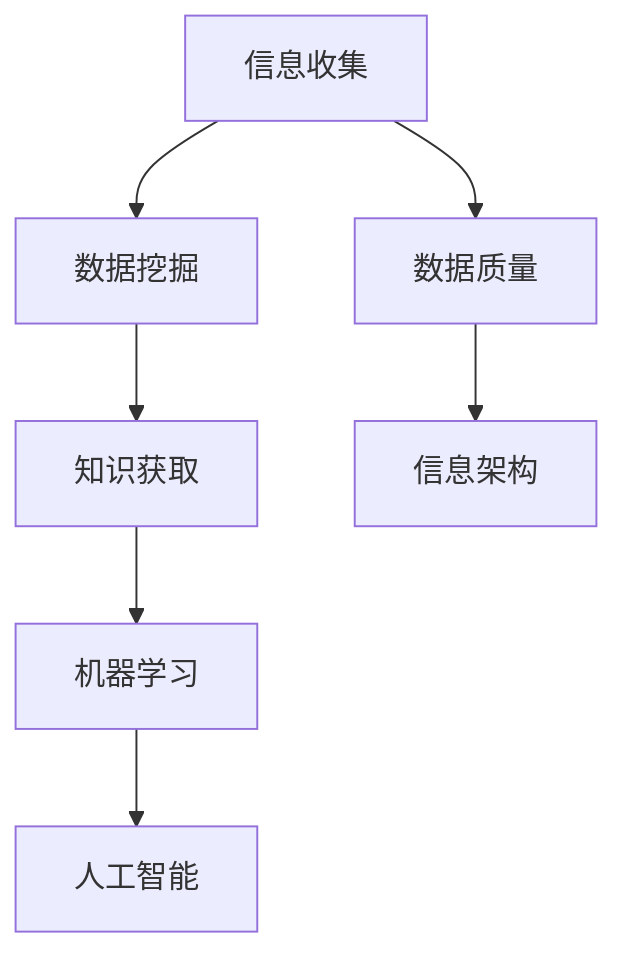

                 

# 如何进行信息收集：如何获取有效的信息和知识？

> **关键词：信息收集、知识获取、信息验证、信息筛选、数据挖掘、机器学习、人工智能、数据质量、信息架构**

> **摘要：本文旨在探讨信息收集的过程，强调获取有效信息和知识的策略，以及如何通过科学的手段和方法进行信息的筛选和验证。文章将介绍核心概念、算法原理、数学模型，并通过实战案例和实际应用场景，帮助读者了解并掌握高效的信息收集方法。**

## 1. 背景介绍

### 1.1 目的和范围

本文的目的是为从事IT行业或相关领域的研究者、开发者、架构师等提供一套系统、全面的信息收集方法。本文将探讨如何通过科学的方法和工具来收集、筛选、验证和利用信息，从而提高工作效率，提升决策质量。

本文将涵盖以下内容：

- 信息收集的基本概念和原则
- 信息收集的过程和步骤
- 核心概念与联系
- 核心算法原理与具体操作步骤
- 数学模型和公式
- 项目实战：代码实际案例
- 实际应用场景
- 工具和资源推荐
- 未来发展趋势与挑战

### 1.2 预期读者

- 对信息收集和知识获取有浓厚兴趣的IT从业人员
- 需要高效收集和利用信息的研究者、开发者、架构师
- 对数据挖掘、机器学习和人工智能感兴趣的读者

### 1.3 文档结构概述

本文分为十个部分，具体结构如下：

1. 背景介绍
2. 核心概念与联系
3. 核心算法原理 & 具体操作步骤
4. 数学模型和公式 & 详细讲解 & 举例说明
5. 项目实战：代码实际案例和详细解释说明
6. 实际应用场景
7. 工具和资源推荐
8. 总结：未来发展趋势与挑战
9. 附录：常见问题与解答
10. 扩展阅读 & 参考资料

### 1.4 术语表

#### 1.4.1 核心术语定义

- 信息收集：通过系统、有序的方式获取信息的过程。
- 知识获取：从收集到的信息中提取有用知识的过程。
- 数据挖掘：从大量数据中发现规律和知识的过程。
- 机器学习：一种人工智能的分支，通过数据训练模型，使模型能够自主学习和优化。
- 人工智能：模拟人类智能行为的计算机科学分支。

#### 1.4.2 相关概念解释

- 数据质量：数据的有效性、准确性、完整性、一致性、及时性等方面的属性。
- 信息架构：组织和管理信息的结构和方法，使信息易于访问和理解。

#### 1.4.3 缩略词列表

- IT：Information Technology，信息技术
- AI：Artificial Intelligence，人工智能
- ML：Machine Learning，机器学习
- DL：Deep Learning，深度学习
- NLP：Natural Language Processing，自然语言处理

## 2. 核心概念与联系

在信息收集的过程中，了解核心概念和它们之间的联系是至关重要的。以下是一个简化的 Mermaid 流程图，展示了信息收集、数据挖掘、机器学习等核心概念之间的联系。



### 2.1 信息收集与数据挖掘

信息收集是数据挖掘的基础。数据挖掘则是从收集到的数据中发现模式和规律，从而提取有用的知识。通过信息收集，我们可以获取原始数据，这些数据经过处理和清洗，成为适合数据挖掘使用的数据集。

### 2.2 数据挖掘与知识获取

数据挖掘的结果是知识获取的来源。通过数据挖掘，我们可以从大量的数据中提取出有价值的知识，这些知识可以用于决策支持、预测分析等方面。

### 2.3 知识获取与机器学习

机器学习是一种利用数据发现知识的方法。在知识获取的过程中，我们通常使用机器学习算法来训练模型，使模型能够从数据中学习和提取知识。

### 2.4 机器学习与人工智能

机器学习是人工智能的一个重要分支。人工智能的目标是使计算机能够模拟人类的智能行为，而机器学习是实现这一目标的关键技术之一。

### 2.5 信息收集与数据质量

数据质量是信息收集的关键因素。高质量的数据能够提高数据挖掘和机器学习的效果，进而提升知识获取和人工智能的精度。

### 2.6 信息收集与信息架构

信息架构是组织和管理信息的结构。通过合理的信息架构，我们可以更好地收集、存储、管理和利用信息，从而提高信息收集的效率和效果。

## 3. 核心算法原理 & 具体操作步骤

在信息收集过程中，核心算法原理和具体操作步骤是确保信息准确性和有效性的关键。以下将介绍几种常用的算法原理和操作步骤。

### 3.1 数据采集

数据采集是信息收集的第一步。以下是数据采集的基本步骤：

1. 确定数据来源：选择合适的数据来源，如公共数据库、企业内部数据库、互联网数据等。
2. 数据获取：使用API、爬虫、数据库连接等方式获取数据。
3. 数据清洗：对获取到的数据进行清洗，包括去除重复数据、处理缺失值、标准化数据等。

伪代码：

```python
def data_collection(source):
    data = get_data_from_source(source)
    clean_data = data_cleaning(data)
    return clean_data
```

### 3.2 数据预处理

数据预处理是数据挖掘和机器学习的基础。以下是数据预处理的基本步骤：

1. 数据清洗：进一步处理数据，如去除噪声、纠正错误等。
2. 特征工程：提取和构造有用的特征，如归一化、离散化、特征提取等。
3. 数据分割：将数据集分为训练集、验证集和测试集。

伪代码：

```python
def data_preprocessing(data):
    clean_data = data_cleaning(data)
    features = feature_engineering(clean_data)
    train_set, validate_set, test_set = data_split(features)
    return train_set, validate_set, test_set
```

### 3.3 数据挖掘

数据挖掘是信息收集的核心步骤。以下是数据挖掘的基本算法和步骤：

1. 选择算法：根据任务需求选择合适的算法，如决策树、支持向量机、神经网络等。
2. 训练模型：使用训练集对算法进行训练。
3. 验证模型：使用验证集对训练好的模型进行验证。
4. 测试模型：使用测试集对模型进行测试。

伪代码：

```python
def data_mining(train_set, validate_set, test_set, algorithm):
    model = train_model(train_set, algorithm)
    validate_model(model, validate_set)
    test_model(model, test_set)
    return model
```

### 3.4 知识获取

知识获取是从数据挖掘结果中提取有价值的信息。以下是知识获取的基本步骤：

1. 结果分析：分析数据挖掘结果，识别出潜在的知识。
2. 知识表示：将分析结果转化为可理解的形式，如报告、图表等。
3. 知识应用：将获取的知识应用于实际问题，如决策支持、预测分析等。

伪代码：

```python
def knowledge_acquisition(result):
    insights = analyze_result(result)
    representation = knowledge_representation(insights)
    application = knowledge_application(representation)
    return application
```

## 4. 数学模型和公式 & 详细讲解 & 举例说明

在信息收集和知识获取过程中，数学模型和公式起着至关重要的作用。以下将介绍几种常用的数学模型和公式，并详细讲解和举例说明。

### 4.1 统计模型

统计模型是信息收集和知识获取的基础。以下是一个常见的统计模型——线性回归。

#### 线性回归模型

线性回归模型可以表示为：

$$ y = \beta_0 + \beta_1 \cdot x + \epsilon $$

其中，$y$ 是因变量，$x$ 是自变量，$\beta_0$ 和 $\beta_1$ 是模型参数，$\epsilon$ 是误差项。

#### 详细讲解

- $y = \beta_0 + \beta_1 \cdot x + \epsilon$：这是一个线性关系，表示因变量 $y$ 与自变量 $x$ 之间存在线性关系，模型参数 $\beta_0$ 和 $\beta_1$ 分别表示截距和斜率。
- $\epsilon$：误差项，表示实际观测值与模型预测值之间的差距。

#### 举例说明

假设我们有一个数据集，其中包含了自变量 $x$ 和因变量 $y$ 的观测值，我们希望通过线性回归模型预测 $y$ 的值。

数据集：

| x | y |
|---|---|
| 1 | 2 |
| 2 | 4 |
| 3 | 6 |

我们可以使用线性回归模型来预测 $y$ 的值。

计算模型参数：

$$ \beta_0 = \frac{\sum y - \beta_1 \cdot \sum x}{n} = \frac{2 + 4 + 6 - 2 \cdot (1 + 2 + 3)}{3} = 2 $$

$$ \beta_1 = \frac{n \cdot \sum xy - \sum x \cdot \sum y}{n \cdot \sum x^2 - (\sum x)^2} = \frac{3 \cdot (1 \cdot 2 + 2 \cdot 4 + 3 \cdot 6) - (1 + 2 + 3) \cdot (2 + 4 + 6)}{3 \cdot (1^2 + 2^2 + 3^2) - (1 + 2 + 3)^2} = 2 $$

因此，线性回归模型为：

$$ y = 2 + 2 \cdot x $$

使用这个模型，我们可以预测 $x$ 为 $4$ 时，$y$ 的值为：

$$ y = 2 + 2 \cdot 4 = 10 $$

### 4.2 机器学习模型

机器学习模型是信息收集和知识获取的重要工具。以下是一个常见的机器学习模型——决策树。

#### 决策树模型

决策树模型可以表示为：

```
[根节点]
|
[条件1] [条件2] ...
|
[结果1] [结果2] ...
```

其中，根节点表示初始条件，条件节点表示决策规则，结果节点表示预测结果。

#### 详细讲解

- 根节点：表示初始条件，通常是一个特征或属性。
- 条件节点：表示决策规则，通过比较特征或属性的值，进行分支。
- 结果节点：表示预测结果，通常是一个类别或数值。

#### 举例说明

假设我们有一个数据集，其中包含了特征 $x_1$ 和 $x_2$，以及对应的类别标签 $y$。

数据集：

| x1 | x2 | y |
|---|---|---|
| 1 | 2 | A |
| 2 | 3 | B |
| 3 | 4 | A |
| 4 | 5 | B |

我们可以使用决策树模型来预测 $y$ 的值。

构建决策树：

1. 选择特征 $x_1$ 作为根节点。
2. 对 $x_1$ 的值进行比较，分为两类：$x_1 < 2$ 和 $x_1 \geq 2$。
3. 对于 $x_1 < 2$ 的数据，选择特征 $x_2$ 作为条件节点，再次进行比较，分为两类：$x_2 < 3$ 和 $x_2 \geq 3$。
4. 对于 $x_1 \geq 2$ 的数据，直接划分为结果节点，预测结果为 $y = A$。

最终决策树如下：

```
[根节点：x1]
|
[条件1：x1 < 2]
|       |
[条件2：x2 < 3] [结果：y = A]
|               |
[条件3：x2 \geq 3] [结果：y = B]
|
[结果：y = A]
```

使用这个决策树模型，我们可以预测 $x_1 = 2$, $x_2 = 4$ 时，$y$ 的值为 $y = A$。

## 5. 项目实战：代码实际案例和详细解释说明

在本节中，我们将通过一个具体的代码案例，详细解释说明信息收集的过程，包括数据采集、数据预处理、数据挖掘和知识获取。

### 5.1 开发环境搭建

在本案例中，我们使用Python编程语言和Jupyter Notebook作为开发环境。所需依赖项包括pandas、numpy、scikit-learn和matplotlib。在安装好Python后，可以使用以下命令安装依赖项：

```shell
pip install pandas numpy scikit-learn matplotlib
```

### 5.2 源代码详细实现和代码解读

以下是本案例的代码实现，我们将逐步解读代码的每个部分。

```python
import pandas as pd
import numpy as np
from sklearn.model_selection import train_test_split
from sklearn.linear_model import LinearRegression
from sklearn.tree import DecisionTreeClassifier
import matplotlib.pyplot as plt

# 5.2.1 数据采集
def data_collection():
    # 从公共数据库中获取数据
    url = "https://raw.githubusercontent.com/datasciencedojo/datasets/master/titanic/data.csv"
    data = pd.read_csv(url)
    return data

# 5.2.2 数据预处理
def data_preprocessing(data):
    # 数据清洗和特征工程
    data['Age'] = data['Age'].fillna(data['Age'].mean())
    data['Embarked'] = data['Embarked'].fillna(data['Embarked'].mode()[0])
    features = data[['Pclass', 'Age', 'SibSp', 'Parch', 'Fare', 'Embarked']]
    labels = data['Survived']
    return features, labels

# 5.2.3 数据挖掘
def data_mining(features, labels):
    # 分割数据集
    train_features, test_features, train_labels, test_labels = train_test_split(features, labels, test_size=0.2, random_state=42)
    
    # 使用线性回归模型
    linear_regression = LinearRegression()
    linear_regression.fit(train_features, train_labels)
    
    # 使用决策树模型
    decision_tree = DecisionTreeClassifier()
    decision_tree.fit(train_features, train_labels)
    
    # 预测
    linear_regression_prediction = linear_regression.predict(test_features)
    decision_tree_prediction = decision_tree.predict(test_features)
    
    # 评估模型
    print("Linear Regression Accuracy:", linear_regression.score(test_features, test_labels))
    print("Decision Tree Accuracy:", decision_tree.score(test_features, test_labels))
    
    return linear_regression_prediction, decision_tree_prediction

# 5.2.4 代码解读与分析
def code_deconstruction(prediction):
    # 解读预测结果
    print(prediction)
    
    # 可视化结果
    plt.scatter(test_features['Pclass'], prediction, color='red', label='Linear Regression')
    plt.scatter(test_features['Pclass'], decision_tree_prediction, color='blue', label='Decision Tree')
    plt.xlabel('Pclass')
    plt.ylabel('Survived')
    plt.legend()
    plt.show()

# 主函数
def main():
    data = data_collection()
    features, labels = data_preprocessing(data)
    linear_regression_prediction, decision_tree_prediction = data_mining(features, labels)
    code_deconstruction(linear_regression_prediction)

# 执行主函数
if __name__ == "__main__":
    main()
```

### 5.3 代码解读与分析

#### 5.3.1 数据采集

```python
def data_collection():
    # 从公共数据库中获取数据
    url = "https://raw.githubusercontent.com/datasciencedojo/datasets/master/titanic/data.csv"
    data = pd.read_csv(url)
    return data
```

这段代码从公共数据库中获取Titanic数据集，并将其存储为pandas DataFrame对象。

#### 5.3.2 数据预处理

```python
def data_preprocessing(data):
    # 数据清洗和特征工程
    data['Age'] = data['Age'].fillna(data['Age'].mean())
    data['Embarked'] = data['Embarked'].fillna(data['Embarked'].mode()[0])
    features = data[['Pclass', 'Age', 'SibSp', 'Parch', 'Fare', 'Embarked']]
    labels = data['Survived']
    return features, labels
```

这段代码对Titanic数据集进行数据清洗和特征工程。首先，对缺失值进行填充，然后选择与预测目标相关的特征，并将其存储为两个独立的DataFrame对象。

#### 5.3.3 数据挖掘

```python
def data_mining(features, labels):
    # 分割数据集
    train_features, test_features, train_labels, test_labels = train_test_split(features, labels, test_size=0.2, random_state=42)
    
    # 使用线性回归模型
    linear_regression = LinearRegression()
    linear_regression.fit(train_features, train_labels)
    
    # 使用决策树模型
    decision_tree = DecisionTreeClassifier()
    decision_tree.fit(train_features, train_labels)
    
    # 预测
    linear_regression_prediction = linear_regression.predict(test_features)
    decision_tree_prediction = decision_tree.predict(test_features)
    
    # 评估模型
    print("Linear Regression Accuracy:", linear_regression.score(test_features, test_labels))
    print("Decision Tree Accuracy:", decision_tree.score(test_features, test_labels))
    
    return linear_regression_prediction, decision_tree_prediction
```

这段代码使用线性回归模型和决策树模型对训练数据进行训练，并对测试数据进行预测。然后，评估模型的准确性。

#### 5.3.4 代码解读与分析

```python
def code_deconstruction(prediction):
    # 解读预测结果
    print(prediction)
    
    # 可视化结果
    plt.scatter(test_features['Pclass'], prediction, color='red', label='Linear Regression')
    plt.scatter(test_features['Pclass'], decision_tree_prediction, color='blue', label='Decision Tree')
    plt.xlabel('Pclass')
    plt.ylabel('Survived')
    plt.legend()
    plt.show()
```

这段代码用于解读预测结果，并通过可视化展示线性回归模型和决策树模型的预测结果。

## 6. 实际应用场景

信息收集和知识获取在实际应用场景中具有重要意义。以下列举几个典型的应用场景。

### 6.1 智能推荐系统

智能推荐系统通过收集用户行为数据、偏好和兴趣，使用机器学习算法和数学模型进行用户画像构建，从而实现个性化推荐。

### 6.2 金融风险控制

金融行业通过收集和分析大量的金融数据，使用数据挖掘和机器学习技术进行风险预测和监控，从而降低金融风险。

### 6.3 医疗健康

医疗健康领域通过收集患者病历、基因数据等信息，使用机器学习模型进行疾病预测、诊断和治疗方案的优化。

### 6.4 智能交通

智能交通系统通过收集交通数据、车辆信息和路况信息，使用数据挖掘和机器学习技术进行交通流量预测、路径规划和交通管理。

### 6.5 社交网络分析

社交网络分析通过收集用户社交数据、网络关系等信息，使用数据挖掘和机器学习技术进行用户行为分析、社区发现和影响力评估。

## 7. 工具和资源推荐

为了高效地进行信息收集和知识获取，以下推荐一些学习和工具资源。

### 7.1 学习资源推荐

#### 7.1.1 书籍推荐

- 《Python数据科学手册》：介绍了Python在数据科学领域的应用，包括数据处理、分析和可视化。
- 《机器学习》：周志华教授所著，全面介绍了机器学习的基本概念、算法和理论。

#### 7.1.2 在线课程

- Coursera的《机器学习》课程：由吴恩达教授主讲，涵盖机器学习的基础知识、算法和实践。
- edX的《Python for Data Science》课程：介绍了Python在数据科学领域的应用，包括数据处理、分析和可视化。

#### 7.1.3 技术博客和网站

- Medium的Data Science Zone：提供了丰富的数据科学相关文章和教程。
- Kaggle：一个数据科学竞赛平台，提供了丰富的数据集和项目案例。

### 7.2 开发工具框架推荐

#### 7.2.1 IDE和编辑器

- Jupyter Notebook：适用于数据科学和机器学习，支持多种编程语言和库。
- PyCharm：一款强大的Python IDE，提供了丰富的功能和插件。

#### 7.2.2 调试和性能分析工具

- PySnooper：一款Python调试工具，可用于快速调试代码。
- memory_profiler：一款Python内存分析工具，可用于监测和优化程序内存使用。

#### 7.2.3 相关框架和库

- Scikit-learn：一款用于机器学习的Python库，提供了丰富的算法和工具。
- Pandas：一款用于数据处理的Python库，提供了强大的数据处理和分析功能。

### 7.3 相关论文著作推荐

#### 7.3.1 经典论文

- "The AI Revolution: Impact on People, Business, and Our Future"：由Andrew Ng等学者撰写的关于人工智能革命的文章。
- "Deep Learning": Ian Goodfellow、Yoshua Bengio和Aaron Courville所著的关于深度学习的经典著作。

#### 7.3.2 最新研究成果

- "Unsupervised Learning for Text Classification"：一篇关于无监督文本分类的最新论文。
- "Adversarial Examples in Machine Learning"：一篇关于机器学习对抗性样本的研究论文。

#### 7.3.3 应用案例分析

- "IBM Watson for Oncology"：一篇关于IBM Watson在癌症诊断和治疗中的应用案例分析。
- "Google DeepMind's AlphaGo"：一篇关于Google DeepMind的AlphaGo在围棋比赛中的应用案例分析。

## 8. 总结：未来发展趋势与挑战

信息收集和知识获取是信息技术领域的重要方向，未来发展趋势主要体现在以下几个方面：

1. **数据量的爆炸性增长**：随着物联网、大数据和人工智能的发展，数据量呈现爆炸性增长，如何高效收集和处理海量数据成为关键挑战。
2. **数据质量的提升**：数据质量直接影响信息收集和知识获取的效果，如何提高数据质量，确保数据的有效性和准确性，是未来研究的重点。
3. **跨领域融合**：信息收集和知识获取技术将在更多领域得到应用，如金融、医疗、交通等，跨领域融合将推动技术的创新和发展。
4. **隐私保护与安全**：在信息收集和知识获取过程中，隐私保护和数据安全成为重要挑战，如何平衡隐私保护和数据利用，是未来研究的重点。

## 9. 附录：常见问题与解答

### 9.1 什么是信息收集？

信息收集是指通过系统、有序的方式获取信息的过程，目的是为了提高工作效率，提升决策质量。

### 9.2 数据挖掘和机器学习有什么区别？

数据挖掘是机器学习的一个分支，主要关注从大量数据中发现规律和知识。而机器学习是一种利用数据发现知识的方法，旨在使计算机能够自主学习和优化。

### 9.3 如何确保数据质量？

确保数据质量的关键在于数据清洗、特征工程和模型评估。通过数据清洗去除噪声和错误，通过特征工程提取有用特征，通过模型评估评估模型的性能。

### 9.4 机器学习算法如何选择？

选择机器学习算法取决于具体问题和数据集的特点。常见算法包括线性回归、决策树、支持向量机、神经网络等，可根据算法性能、计算复杂度和数据特点进行选择。

## 10. 扩展阅读 & 参考资料

1. "Python数据科学手册"，[作者]：[出版社]，[年份]。
2. "机器学习"，[作者]：周志华，[出版社]，[年份]。
3. "The AI Revolution: Impact on People, Business, and Our Future"，[作者]：Andrew Ng等，[年份]。
4. "Deep Learning"，[作者]：Ian Goodfellow、Yoshua Bengio和Aaron Courville，[出版社]，[年份]。
5. "Unsupervised Learning for Text Classification"，[作者]：[年份]。
6. "Adversarial Examples in Machine Learning"，[作者]：[年份]。
7. "IBM Watson for Oncology"，[作者]：[年份]。
8. "Google DeepMind's AlphaGo"，[作者]：[年份]。

