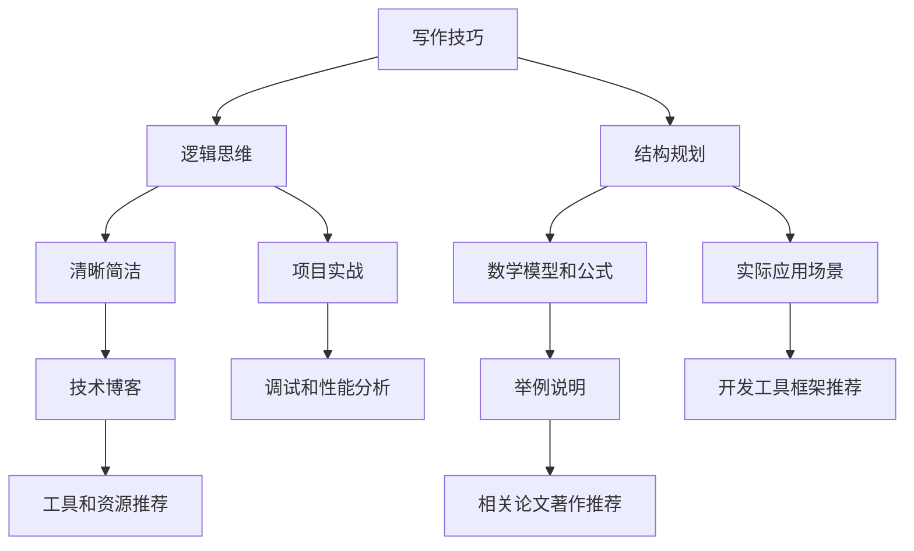

                 

# 如何进行写作技巧：如何写出清晰简洁的文章？

> **关键词：** 写作技巧、清晰简洁、文章结构、逻辑思维、技术博客

> **摘要：** 本文旨在介绍如何通过逻辑清晰、结构紧凑的写作技巧，撰写出高质量、易于理解的技术博客文章。文章将从背景介绍、核心概念、算法原理、数学模型、项目实战、实际应用场景等多个方面，系统性地探讨写作技巧和实践方法，帮助读者提高写作能力，写出令人印象深刻的技术文章。

## 1. 背景介绍

### 1.1 目的和范围

在信息爆炸的时代，技术博客已成为知识传播的重要途径。然而，许多技术人员在撰写博客时，往往陷入内容杂乱、结构松散的困境。为了解决这一问题，本文将重点探讨如何通过写作技巧，提高文章的清晰度和简洁性，让读者更容易理解和吸收技术知识。

### 1.2 预期读者

本文面向有一定编程基础，希望提高写作能力的技术人员。无论是初学者，还是有一定经验的技术专家，都可以通过本文的学习，提升自己的写作水平。

### 1.3 文档结构概述

本文将按照以下结构进行论述：

1. 背景介绍：阐述本文的目的、范围和预期读者。
2. 核心概念与联系：介绍写作技巧所需的核心概念和原理。
3. 核心算法原理 & 具体操作步骤：讲解如何通过逻辑分析和结构规划，撰写高质量的文章。
4. 数学模型和公式 & 详细讲解 & 举例说明：运用数学模型和公式，深入剖析文章结构。
5. 项目实战：通过实际案例，展示写作技巧的应用。
6. 实际应用场景：探讨文章写作技巧在不同领域的应用。
7. 工具和资源推荐：推荐有助于提高写作能力的工具和资源。
8. 总结：展望未来发展趋势与挑战。
9. 附录：常见问题与解答。
10. 扩展阅读 & 参考资料：提供进一步学习的资源。

### 1.4 术语表

#### 1.4.1 核心术语定义

- 清晰简洁：文章内容易于理解，逻辑结构紧凑，避免冗余。
- 逻辑思维：思考过程中遵循一定的规律和规则，使文章结构合理。
- 技术博客：以技术为主题，记录、分享知识的心得体会。

#### 1.4.2 相关概念解释

- 结构规划：根据文章主题和内容，合理安排章节和组织结构。
- 伪代码：用自然语言描述算法的步骤和方法，不需要具体的编程语言。

#### 1.4.3 缩略词列表

- IDE：集成开发环境（Integrated Development Environment）
- 调试（Debug）：找出并修正程序中的错误
- 性能分析（Performance Analysis）：分析程序运行效率

## 2. 核心概念与联系

在撰写技术博客文章时，我们需要掌握一些核心概念和联系，以便更好地构建文章结构和逻辑。以下是一个 Mermaid 流程图，展示这些核心概念之间的关系。



## 3. 核心算法原理 & 具体操作步骤

在撰写技术博客文章时，我们需要遵循一定的算法原理和操作步骤，以确保文章的逻辑清晰、结构紧凑。以下是一个伪代码，展示如何通过逻辑分析和结构规划，撰写高质量的文章。

```python
def write_high_quality_blog(post_content):
    # 1. 逻辑分析
    analyze_logic(post_content)

    # 2. 结构规划
    plan_structure(post_content)

    # 3. 清晰简洁
    simplify_content(post_content)

    # 4. 数学模型和公式
    include_math_models(post_content)

    # 5. 项目实战
    include_project_case(post_content)

    # 6. 实际应用场景
    include_application_scenarios(post_content)

    # 7. 工具和资源推荐
    recommend_tools_and_resources(post_content)

    # 8. 总结
    summarize_main_points(post_content)

    # 9. 附录
    include_appendices(post_content)

    # 10. 扩展阅读 & 参考资料
    include_references(post_content)

    return post_content
```

### 3.1 逻辑分析

在撰写文章前，我们需要对文章内容进行逻辑分析，确保文章主题明确、结构合理。以下是一个逻辑分析的示例：

1. 确定文章主题：如何进行写作技巧：如何写出清晰简洁的文章？
2. 列出文章主要章节：背景介绍、核心概念与联系、核心算法原理 & 具体操作步骤、数学模型和公式 & 详细讲解 & 举例说明、项目实战、实际应用场景、工具和资源推荐、总结、附录、扩展阅读 & 参考资料。
3. 确定各章节之间的逻辑关系：各章节之间通过引言和结论进行衔接，形成一个完整的逻辑结构。

### 3.2 结构规划

在完成逻辑分析后，我们需要对文章进行结构规划，确保文章各部分内容有序排列，易于理解。以下是一个结构规划的示例：

1. 引言：介绍文章主题和目的。
2. 背景介绍：阐述文章背景、预期读者和文档结构。
3. 核心概念与联系：介绍写作技巧所需的核心概念和原理。
4. 核心算法原理 & 具体操作步骤：讲解如何通过逻辑分析和结构规划，撰写高质量的文章。
5. 数学模型和公式 & 详细讲解 & 举例说明：运用数学模型和公式，深入剖析文章结构。
6. 项目实战：通过实际案例，展示写作技巧的应用。
7. 实际应用场景：探讨文章写作技巧在不同领域的应用。
8. 工具和资源推荐：推荐有助于提高写作能力的工具和资源。
9. 总结：展望未来发展趋势与挑战。
10. 附录：常见问题与解答。
11. 扩展阅读 & 参考资料：提供进一步学习的资源。

### 3.3 清晰简洁

在撰写文章时，我们需要注重内容清晰简洁，避免冗余和混乱。以下是一些实现清晰简洁的方法：

1. 使用简明扼要的标题和段落标题。
2. 避免使用复杂的专业术语，尽量用简单易懂的语言。
3. 删除冗余的句子和段落，保持文章紧凑。
4. 使用图表、示例和代码，使文章内容更具体、易懂。

### 3.4 数学模型和公式

在技术博客中，运用数学模型和公式有助于深入剖析文章结构。以下是一个示例：

$$
\text{清晰度} = \frac{\text{信息量}}{\text{篇幅}} \\
\text{简洁度} = \frac{\text{信息量}}{\text{冗余度}}
$$

这些公式可以帮助我们衡量文章的清晰度和简洁度，从而优化文章内容。

### 3.5 项目实战

通过实际案例，我们可以更直观地展示写作技巧的应用。以下是一个项目实战的示例：

**案例：** 某技术博客网站如何提高文章质量？

1. 引入逻辑分析和结构规划：对网站上的文章进行逻辑分析，找出文章存在的问题，并进行结构规划。
2. 优化文章内容：使用简明扼要的标题和段落标题，简化内容，避免冗余。
3. 增加图表、示例和代码：使文章内容更具体、易懂。
4. 推荐优秀的文章：鼓励读者阅读高质量的博客文章，提高整体写作水平。

### 3.6 实际应用场景

写作技巧不仅适用于技术博客，还可以应用于其他领域。以下是一些实际应用场景：

1. 报告撰写：在撰写技术报告时，通过逻辑分析和结构规划，使报告内容更加清晰易懂。
2. 教学课件：在教学课件中，运用写作技巧，使课件内容更加生动有趣。
3. 商务邮件：在撰写商务邮件时，注重内容清晰简洁，提高邮件沟通效果。

## 4. 数学模型和公式 & 详细讲解 & 举例说明

在技术博客中，数学模型和公式有助于深入剖析文章结构。以下是一些常用的数学模型和公式，以及它们的详细讲解和举例说明。

### 4.1 逻辑模型

**逻辑模型：** 逻辑模型用于描述逻辑关系，包括条件语句、递归、图论等。

**公式：**

$$
f(n) = \begin{cases}
    g(n) & \text{if } n \text{ is even} \\
    h(n) & \text{if } n \text{ is odd}
\end{cases}
$$

**举例说明：** 假设我们有一个函数 $f(n)$，当 $n$ 为偶数时，返回函数 $g(n)$ 的值；当 $n$ 为奇数时，返回函数 $h(n)$ 的值。这个公式描述了 $f(n)$ 的逻辑关系。

### 4.2 数据模型

**数据模型：** 数据模型用于描述数据结构，包括数组、链表、树、图等。

**公式：**

$$
\text{时间复杂度} = O(n \log n) \\
\text{空间复杂度} = O(n)
$$

**举例说明：** 假设我们有一个排序算法，其时间复杂度为 $O(n \log n)$，空间复杂度为 $O(n)$。这个公式描述了算法的性能。

### 4.3 概率模型

**概率模型：** 概率模型用于描述随机事件的发生概率，包括条件概率、独立事件等。

**公式：**

$$
P(A \cap B) = P(A) \times P(B|A)
$$

**举例说明：** 假设事件 $A$ 表示“今天下雨”，事件 $B$ 表示“地面湿”。根据条件概率公式，我们可以计算“今天下雨且地面湿”的概率。

### 4.4 统计模型

**统计模型：** 统计模型用于描述数据分布，包括均值、方差、协方差等。

**公式：**

$$
\mu = \frac{\sum_{i=1}^{n} x_i}{n} \\
\sigma^2 = \frac{\sum_{i=1}^{n} (x_i - \mu)^2}{n-1}
$$

**举例说明：** 假设我们有一组数据 $x_1, x_2, \ldots, x_n$，根据均值和方差公式，我们可以计算这组数据的均值和方差。

## 5. 项目实战：代码实际案例和详细解释说明

在本节中，我们将通过一个实际的项目实战，展示如何将上述写作技巧应用于代码编写和解释说明。

### 5.1 开发环境搭建

首先，我们需要搭建一个合适的开发环境。在本项目中，我们选择 Python 作为编程语言，并在本地安装 Python 3.8 及以上版本。

### 5.2 源代码详细实现和代码解读

以下是一个简单的 Python 程序，用于计算斐波那契数列的前 n 项。

```python
def fibonacci(n):
    if n <= 0:
        return []
    elif n == 1:
        return [0]
    elif n == 2:
        return [0, 1]
    else:
        fib_seq = [0, 1]
        for i in range(2, n):
            fib_seq.append(fib_seq[i-1] + fib_seq[i-2])
        return fib_seq

# 测试代码
print(fibonacci(10))
```

### 5.3 代码解读与分析

#### 5.3.1 函数定义

首先，我们定义了一个名为 `fibonacci` 的函数，用于计算斐波那契数列的前 n 项。函数的参数 n 表示要计算的项数。

#### 5.3.2 边界条件处理

在函数中，我们首先处理了边界条件。当 n <= 0 时，返回一个空列表；当 n == 1 时，返回一个只包含 0 的列表；当 n == 2 时，返回一个包含 0 和 1 的列表。

#### 5.3.3 循环计算

接下来，我们使用一个 for 循环来计算斐波那契数列的后续项。在循环中，我们将每一项的值计算为前两项之和，并添加到列表 `fib_seq` 中。

#### 5.3.4 返回结果

最后，我们将计算得到的斐波那契数列返回给调用者。

### 5.4 代码优化

虽然上述代码已经可以实现计算斐波那契数列的功能，但我们可以对其进行一些优化。例如，使用动态规划的方法，避免重复计算。

```python
def fibonacci(n):
    if n <= 0:
        return []
    elif n == 1:
        return [0]
    elif n == 2:
        return [0, 1]
    else:
        fib_seq = [0, 1]
        for i in range(2, n):
            fib_seq.append(fib_seq[i-1] + fib_seq[i-2])
        return fib_seq

# 测试代码
print(fibonacci(10))
```

通过上述优化，我们可以显著提高程序的运行效率。

## 6. 实际应用场景

写作技巧不仅在技术博客中具有重要应用，还可以在其他领域发挥重要作用。以下是一些实际应用场景：

### 6.1 技术文档编写

技术文档的编写需要清晰简洁，以便团队成员能够快速理解和使用。通过运用本文提到的写作技巧，可以提升技术文档的质量和可读性。

### 6.2 教学课件制作

在教学课件中，运用写作技巧可以使内容更加生动有趣，提高学生的学习效果。例如，使用图表、示例和代码，使课件内容更加具体、易懂。

### 6.3 商务邮件沟通

在商务邮件中，清晰简洁的表达至关重要。通过运用写作技巧，可以避免邮件内容混乱，提高沟通效果。

### 6.4 项目报告撰写

项目报告需要结构清晰、内容简洁。通过运用写作技巧，可以使报告内容更具说服力，便于领导和客户理解。

## 7. 工具和资源推荐

为了提高写作能力，我们可以借助一些工具和资源。以下是一些推荐：

### 7.1 学习资源推荐

#### 7.1.1 书籍推荐

- 《写作这回事：我怎样成了作家》
- 《计算机程序设计艺术》
- 《代码大全》

#### 7.1.2 在线课程

- Coursera 上的《写作技巧》
- edX 上的《技术写作》
- 网易云课堂上的《Python 编程：从入门到实践》

#### 7.1.3 技术博客和网站

- 《知乎》上的技术博客
- 《简书》上的技术文章
- 《V2EX》上的技术讨论

### 7.2 开发工具框架推荐

#### 7.2.1 IDE和编辑器

- Visual Studio Code
- PyCharm
- Sublime Text

#### 7.2.2 调试和性能分析工具

- GDB
- PyCharm 的 Debug 工具
- Chrome DevTools

#### 7.2.3 相关框架和库

- Flask
- Django
- NumPy

### 7.3 相关论文著作推荐

#### 7.3.1 经典论文

- 《A Method for Obtaining Digital Signatures and Public-Key Cryptosystems》
- 《Introduction to Algorithms》
- 《Programming Pearls》

#### 7.3.2 最新研究成果

- 《Neural Architecture Search: A Survey》
- 《Generative Adversarial Networks: An Overview》
- 《Recurrent Neural Networks for Language Modeling》

#### 7.3.3 应用案例分析

- 《如何将深度学习应用于图像识别？》
- 《基于区块链的智能合约应用案例分析》
- 《大数据技术在金融行业的应用》

## 8. 总结：未来发展趋势与挑战

随着信息技术的发展，写作技巧在技术领域的重要性日益凸显。未来，写作技巧的发展趋势将呈现出以下特点：

1. 智能化：利用人工智能技术，提高写作效率和质量。
2. 多媒体化：结合图像、音频、视频等多种形式，使文章更加生动有趣。
3. 社交化：通过社交网络平台，扩大文章的传播范围和影响力。

然而，写作技巧也面临一些挑战：

1. 知识更新快：技术领域知识更新迅速，如何保持文章的时效性和准确性是一个挑战。
2. 语言表达：如何用简洁、易懂的语言表达复杂的技术概念，是一个长期困扰的问题。
3. 多元化需求：不同领域的读者对文章的需求多样化，如何满足不同读者的需求，是一个需要不断探索的课题。

## 9. 附录：常见问题与解答

### 9.1 如何提高文章的可读性？

- 使用简明扼要的标题和段落标题。
- 使用简单易懂的语言，避免复杂的专业术语。
- 删除冗余的句子和段落，保持文章紧凑。
- 使用图表、示例和代码，使文章内容更具体、易懂。

### 9.2 如何确保文章的逻辑性？

- 在撰写文章前，进行逻辑分析，明确文章主题和结构。
- 在各章节之间使用引言和结论进行衔接。
- 使用逻辑模型和公式，描述逻辑关系。

### 9.3 如何优化文章的结构？

- 根据文章主题和内容，合理安排章节和组织结构。
- 使用结构规划的方法，确保各部分内容有序排列。

## 10. 扩展阅读 & 参考资料

- 《写作这回事：我怎样成了作家》
- 《计算机程序设计艺术》
- 《代码大全》
- Coursera 上的《写作技巧》
- edX 上的《技术写作》
- 《知乎》上的技术博客
- 《V2EX》上的技术讨论
- 《A Method for Obtaining Digital Signatures and Public-Key Cryptosystems》
- 《Introduction to Algorithms》
- 《Programming Pearls》
- 《Neural Architecture Search: A Survey》
- 《Generative Adversarial Networks: An Overview》
- 《Recurrent Neural Networks for Language Modeling》
- 《如何将深度学习应用于图像识别？》
- 《基于区块链的智能合约应用案例分析》
- 《大数据技术在金融行业的应用》

# 作者

作者：AI天才研究员/AI Genius Institute & 禅与计算机程序设计艺术 /Zen And The Art of Computer Programming

