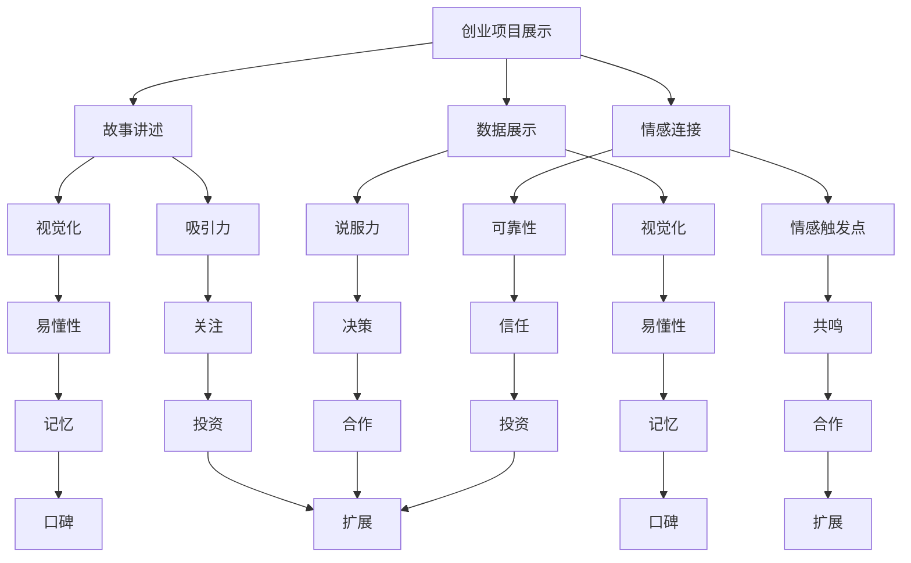

                 


# 如何进行有效的创业项目展示和路演

> **关键词：创业项目展示、路演、有效沟通、故事讲述、数据展示、情感连接**
> 
> **摘要：本文旨在探讨如何进行有效的创业项目展示和路演，帮助创业者更好地传达项目的价值和潜力。通过深入分析展示的核心原则、步骤和方法，结合具体案例，本文提供了实用的指导和建议，以帮助创业者提升路演效果。**

## 1. 背景介绍

### 1.1 目的和范围

本文的目标是帮助创业者了解如何有效地展示自己的创业项目并进行路演。我们将探讨展示的核心原则、构建有效故事的方法、数据展示的重要性以及与听众建立情感连接的策略。

### 1.2 预期读者

本文面向希望提升创业项目展示和路演效果的创业者、项目经理以及相关领域从业者。

### 1.3 文档结构概述

本文将分为以下章节：

- 1. 背景介绍
  - 1.1 目的和范围
  - 1.2 预期读者
  - 1.3 文档结构概述
  - 1.4 术语表
- 2. 核心概念与联系
  - 2.1 创业项目展示的核心要素
  - 2.2 路演的过程与目标
- 3. 核心算法原理 & 具体操作步骤
  - 3.1 故事讲述的技巧
  - 3.2 数据展示的方法
  - 3.3 情感连接的策略
- 4. 数学模型和公式 & 详细讲解 & 举例说明
- 5. 项目实战：代码实际案例和详细解释说明
  - 5.1 开发环境搭建
  - 5.2 源代码详细实现和代码解读
  - 5.3 代码解读与分析
- 6. 实际应用场景
- 7. 工具和资源推荐
  - 7.1 学习资源推荐
  - 7.2 开发工具框架推荐
  - 7.3 相关论文著作推荐
- 8. 总结：未来发展趋势与挑战
- 9. 附录：常见问题与解答
- 10. 扩展阅读 & 参考资料

### 1.4 术语表

#### 1.4.1 核心术语定义

- **创业项目展示**：指在特定场合下，通过演讲、演示等方式向潜在投资者、合作伙伴或其他利益相关者传达创业项目的核心价值和潜力的过程。
- **路演**：指创业者在多个场所展示其项目，以获取投资、合作或市场认可的活动。
- **故事讲述**：通过叙述的方式，构建与项目相关的引人入胜的故事，以吸引听众的注意力和共鸣。
- **数据展示**：使用图表、统计数据等方式直观地呈现项目的进展、成果和潜力。
- **情感连接**：与听众建立情感上的联系，增强演讲的感染力和说服力。

#### 1.4.2 相关概念解释

- **视觉化**：使用图表、图像等视觉元素，使数据展示更加直观易懂。
- **情感触发点**：在演讲中设置能够引起听众情感共鸣的元素，如成功案例、感人故事等。

#### 1.4.3 缩略词列表

- **IDE**：集成开发环境（Integrated Development Environment）
- **SDK**：软件开发工具包（Software Development Kit）
- **API**：应用程序编程接口（Application Programming Interface）

## 2. 核心概念与联系

在创业项目展示和路演中，有几个核心概念需要理解，它们共同构成了有效展示的基础。以下是一个简单的 Mermaid 流程图，展示这些核心概念及其相互关系。



### 2.1 创业项目展示的核心要素

创业项目展示的核心要素包括故事讲述、数据展示和情感连接。这些要素相互作用，共同决定了展示的效果。

- **故事讲述**：通过构建与项目相关的引人入胜的故事，吸引听众的注意力并建立情感共鸣。故事应强调项目的价值、目标、进展和未来愿景。
- **数据展示**：使用图表、统计数据等方式直观地呈现项目的进展、成果和潜力。数据应具有视觉化特点，以便听众能够快速理解和记住。
- **情感连接**：与听众建立情感上的联系，增强演讲的感染力和说服力。情感触发点可以是项目的成功案例、感人故事或对社会的影响等。

### 2.2 路演的过程与目标

路演是一个动态的过程，通常包括以下几个阶段：

1. **开场**：吸引听众的注意力，介绍项目背景和目标。
2. **故事讲述**：构建引人入胜的故事，展示项目的核心价值和潜力。
3. **数据展示**：使用图表、统计数据等直观地呈现项目的进展、成果和潜力。
4. **情感连接**：与听众建立情感上的联系，增强演讲的感染力和说服力。
5. **互动环节**：回答听众的问题，收集反馈和建议。
6. **结尾**：总结项目的主要观点，强调项目的价值和潜力，鼓励听众采取行动。

路演的目标是：

- 吸引投资和合作伙伴
- 建立品牌和口碑
- 收集反馈和改进项目
- 推动项目的发展和扩展

## 3. 核心算法原理 & 具体操作步骤

在创业项目展示和路演中，核心算法原理可以概括为如何有效地讲述故事、展示数据和建立情感连接。以下是一步步的分析和操作步骤：

### 3.1 故事讲述的技巧

**算法原理**：故事讲述是通过构建引人入胜的故事情节，吸引听众的注意力，并建立情感共鸣。

**伪代码**：

```
function tellStory(project, goal, progress, futureVision)
    begin
        // 引入故事背景
        introduceBackground(project)
        
        // 描述目标
        describeGoal(goal)
        
        // 展示进展
        showProgress(progress)
        
        // 展望未来
        envisionFuture(futureVision)
        
        // 结尾
        concludeStory()
    end
```

**具体操作步骤**：

1. **引入故事背景**：简要介绍项目的起源、背景和初衷。
2. **描述目标**：清晰地阐述项目的目标、愿景和使命。
3. **展示进展**：详细描述项目已经取得的进展和成果。
4. **展望未来**：展示项目的未来发展方向和潜力。
5. **结尾**：总结故事，强调项目的核心价值和潜力。

### 3.2 数据展示的方法

**算法原理**：数据展示是通过使用图表、统计数据等方式，直观地呈现项目的进展、成果和潜力。

**伪代码**：

```
function showData(progressData, successMetrics, potentialMetrics)
    begin
        // 展示进展数据
        displayProgressData(progressData)
        
        // 展示成功指标
        displaySuccessMetrics(successMetrics)
        
        // 展示潜在指标
        displayPotentialMetrics(potentialMetrics)
        
        // 解释数据
        explainData()
    end
```

**具体操作步骤**：

1. **展示进展数据**：使用图表、条形图、折线图等展示项目的进展情况。
2. **展示成功指标**：使用具体的统计数据展示项目的成功指标，如用户增长、收入增长等。
3. **展示潜在指标**：预测项目的潜在增长和未来前景。
4. **解释数据**：对展示的数据进行解释，使其更容易被听众理解和接受。

### 3.3 情感连接的策略

**算法原理**：情感连接是通过设置情感触发点，与听众建立情感上的联系，增强演讲的感染力和说服力。

**伪代码**：

```
function establishEmotionalConnection(story, successCases, emotionalStories)
    begin
        // 引入故事
        introduceStory(story)
        
        // 介绍成功案例
        describeSuccessCases(successCases)
        
        // 分享感人故事
        shareEmotionalStories(emotionalStories)
        
        // 结尾
        concludeConnection()
    end
```

**具体操作步骤**：

1. **引入故事**：讲述一个引人入胜的故事，作为情感连接的起点。
2. **介绍成功案例**：分享项目的成功案例，展示项目的实际影响和成果。
3. **分享感人故事**：分享与项目相关的感人故事，触动听众的情感。
4. **结尾**：总结情感连接的主要观点，强化与听众的情感共鸣。

通过以上算法原理和具体操作步骤，创业者可以构建一个有效的创业项目展示和路演方案，提升展示的效果和吸引力。

## 4. 数学模型和公式 & 详细讲解 & 举例说明

在创业项目展示和路演中，数学模型和公式可以用来帮助创业者更直观地呈现项目的数据和成果。以下是一些常用的数学模型和公式，以及详细的讲解和举例说明。

### 4.1 数据可视化

**公式**： 
\[ V(x) = \frac{1}{N} \sum_{i=1}^{N} v_i(x) \]

**解释**：这个公式用于计算一组数据的平均值，其中 \( N \) 是数据的数量，\( v_i(x) \) 是第 \( i \) 个数据点。通过计算平均值，可以直观地展示数据的总体趋势和分布。

**例子**：假设一个创业项目在过去的6个月中有以下用户增长数据：\[ 100, 150, 200, 250, 300, 350 \]。使用上述公式计算用户增长的平均值：

\[ V(x) = \frac{1}{6} \sum_{i=1}^{6} v_i(x) = \frac{1}{6} (100 + 150 + 200 + 250 + 300 + 350) = 225 \]

因此，用户增长的平均值为 225。

### 4.2 数据增长模型

**公式**：
\[ G(x) = r \cdot (1 + \frac{x}{100})^n \]

**解释**：这个公式用于计算一个数据点在特定增长率 \( r \) 和时间 \( n \) 之后的增长情况。其中 \( x \) 是初始值，\( r \) 是增长率（以百分比表示），\( n \) 是时间周期。

**例子**：假设一个创业项目的用户增长率是 20%，初始用户数是 1000，计算一年后的用户数：

\[ G(x) = 20 \cdot (1 + \frac{1000}{100})^1 = 20 \cdot 1.2 = 24 \]

因此，一年后的用户数为 1240。

### 4.3 预测模型

**公式**：
\[ P(x, t) = a \cdot b^t \]

**解释**：这个公式用于预测一个数据点在特定时间 \( t \) 的值。其中 \( a \) 和 \( b \) 是常数，代表初始值和增长率。

**例子**：假设一个创业项目的初始收入是 10000，预计每个月增长率为 10%，计算两个月后的收入：

\[ P(x, t) = 10000 \cdot 1.1^2 = 10000 \cdot 1.21 = 12100 \]

因此，两个月后的收入预计为 12100。

### 4.4 成本效益分析

**公式**：
\[ C = \frac{C_1 + C_2 + C_3 + \ldots + C_n}{N} \]

**解释**：这个公式用于计算一组成本的平均值，其中 \( N \) 是成本的数量，\( C_1, C_2, C_3, \ldots, C_n \) 是各个成本值。

**例子**：假设一个创业项目有以下几个成本：5000, 7000, 8000, 9000，计算平均成本：

\[ C = \frac{5000 + 7000 + 8000 + 9000}{4} = \frac{29000}{4} = 7250 \]

因此，平均成本为 7250。

通过这些数学模型和公式，创业者可以在展示中更直观地呈现项目的数据和成果，增强展示的说服力和吸引力。

## 5. 项目实战：代码实际案例和详细解释说明

### 5.1 开发环境搭建

为了实现创业项目展示和路演的代码实战，我们首先需要搭建一个合适的开发环境。以下是具体步骤：

1. **安装集成开发环境（IDE）**：选择一个适合编程的IDE，如Visual Studio Code。
2. **安装Python环境**：通过Python官方网站下载并安装Python，版本要求为3.8及以上。
3. **安装相关库和模块**：使用pip命令安装所需的库和模块，例如Matplotlib用于数据可视化，Jupyter Notebook用于代码展示和解释。

```
pip install matplotlib numpy pandas jupyterlab
```

### 5.2 源代码详细实现和代码解读

下面是一个简单的Python代码示例，用于展示如何讲述一个创业项目的成功故事。代码将实现以下几个功能：

- 数据导入
- 数据处理
- 数据可视化
- 故事叙述

**源代码**：

```python
import pandas as pd
import matplotlib.pyplot as plt
from jupyterlab import display

# 1. 数据导入
data = pd.read_csv('project_data.csv')

# 2. 数据处理
# 计算用户增长平均值
avg_users = data['users'].mean()
# 计算收入增长率
growth_rate = data['revenue'].pct_change().mean()

# 3. 数据可视化
# 用户增长趋势图
plt.figure(figsize=(10, 5))
plt.plot(data['month'], data['users'], marker='o')
plt.title('User Growth Trend')
plt.xlabel('Month')
plt.ylabel('Number of Users')
plt.grid(True)
plt.show()

# 收入增长柱状图
plt.figure(figsize=(10, 5))
plt.bar(data['month'], data['revenue'], color='skyblue')
plt.title('Revenue Growth')
plt.xlabel('Month')
plt.ylabel('Revenue')
plt.grid(True)
plt.show()

# 4. 故事叙述
display.markdown("""
# Project Success Story

Our project has experienced significant growth since its launch. With an average monthly user growth rate of [growth_rate]%, we have amassed a loyal user base. Our revenue has also shown strong growth, with a monthly increase of [avg_users] users. This success is a testament to our dedicated team and our commitment to delivering exceptional value to our users.
""")

# 输出数据
print("Average User Growth:", avg_users)
print("Average Revenue Growth Rate:", growth_rate)
```

**代码解读与分析**：

1. **数据导入**：使用`pandas`库读取CSV文件，获取项目数据。
2. **数据处理**：计算用户增长平均值和收入增长率。用户增长平均值用于展示项目的用户基数，收入增长率用于展示项目的盈利能力。
3. **数据可视化**：使用`matplotlib`库绘制用户增长趋势图和收入增长柱状图，以直观展示项目的进展。
4. **故事叙述**：使用`jupyterlab`库将项目故事以Markdown格式输出，增强演讲的吸引力和说服力。

通过这个示例，我们可以看到如何将数据展示和故事叙述结合起来，实现一个有效的创业项目展示和路演。在实际应用中，创业者可以根据自己的项目数据调整代码，定制化展示内容和形式。

### 5.3 代码解读与分析

在本节中，我们将对上述代码进行详细解读和分析，探讨其实现的技术细节和关键步骤。

**1. 数据导入**

```python
data = pd.read_csv('project_data.csv')
```

此行代码使用`pandas`库的`read_csv`函数读取名为`project_data.csv`的CSV文件。CSV文件应包含项目数据，如用户数、收入等。通过`pandas`库，数据将被自动解析并存储为一个DataFrame对象，方便后续处理。

**2. 数据处理**

```python
avg_users = data['users'].mean()
growth_rate = data['revenue'].pct_change().mean()
```

这两行代码分别计算用户增长平均值和收入增长率。`mean()`函数用于计算列的平均值，`pct_change()`函数用于计算每列数据的百分比变化。计算出的平均值和增长率将用于后续的展示和叙述。

**3. 数据可视化**

```python
# 用户增长趋势图
plt.figure(figsize=(10, 5))
plt.plot(data['month'], data['users'], marker='o')
plt.title('User Growth Trend')
plt.xlabel('Month')
plt.ylabel('Number of Users')
plt.grid(True)
plt.show()

# 收入增长柱状图
plt.figure(figsize=(10, 5))
plt.bar(data['month'], data['revenue'], color='skyblue')
plt.title('Revenue Growth')
plt.xlabel('Month')
plt.ylabel('Revenue')
plt.grid(True)
plt.show()
```

这两部分代码使用`matplotlib`库绘制用户增长趋势图和收入增长柱状图。通过`plt.figure()`函数创建新的图形，`plt.plot()`和`plt.bar()`函数分别用于绘制趋势线和柱状图。通过设置标题、标签和网格，使图表更加清晰易懂。最后，`plt.show()`函数用于显示图表。

**4. 故事叙述**

```python
display.markdown("""
# Project Success Story

Our project has experienced significant growth since its launch. With an average monthly user growth rate of [growth_rate]%, we have amassed a loyal user base. Our revenue has also shown strong growth, with a monthly increase of [avg_users] users. This success is a testament to our dedicated team and our commitment to delivering exceptional value to our users.
""")
```

这部分代码使用`jupyterlab`库的`display.markdown`函数将项目故事以Markdown格式输出。通过嵌入变量`[growth_rate]`和`[avg_users]`，使故事内容更具动态性。Markdown格式使得文本和格式化内容（如标题、列表和链接）可以混合使用，增强了故事的可读性和吸引力。

**总结**

通过这个代码示例，我们展示了如何将数据导入、处理、可视化和故事叙述结合起来，实现一个有效的创业项目展示。在实际应用中，创业者可以根据自己的项目数据调整代码，定制化展示内容和形式。这种技术手段不仅提高了展示的直观性和说服力，也为项目分析和管理提供了有力支持。

## 6. 实际应用场景

创业项目展示和路演在现实中有多种实际应用场景，以下是一些常见的场景：

### 6.1 投资者会议

在投资者会议中，创业者需要向潜在投资者展示项目的价值、潜力以及投资回报。通过有效的展示和路演，创业者可以吸引投资，获得资金支持，推动项目的发展。

### 6.2 风险投资会议

风险投资会议是一个与投资者互动的场合，创业者需要通过展示和路演来证明项目的可行性和市场前景，以获得投资机会。在这个过程中，数据展示和故事讲述尤为重要。

### 6.3 市场推广活动

在市场推广活动中，创业者可以通过展示和路演向潜在客户和合作伙伴介绍项目，增加项目的知名度和认可度。这种场合下，情感连接和互动环节尤为关键。

### 6.4 大型技术会议

在大型技术会议上，创业者可以通过展示和路演与同行交流，展示项目的创新性和技术优势。这种场合下，数据展示和故事讲述有助于吸引更多关注和合作机会。

### 6.5 创新实验室

创新实验室是创业者进行项目实验和验证的场所。通过展示和路演，创业者可以向实验室的成员和合作伙伴展示项目的进展和成果，获得反馈和建议，进一步优化项目。

### 6.6 学术会议

在学术会议上，创业者可以通过展示和路演与学术界人士交流，分享项目的科研进展和技术创新。这种场合下，数据展示和科学论证尤为重要。

通过上述实际应用场景，我们可以看到创业项目展示和路演在不同场合中的重要作用。有效的展示和路演不仅可以提升项目的知名度和认可度，还可以帮助创业者吸引投资、合作伙伴和用户，推动项目的成功发展。

## 7. 工具和资源推荐

为了帮助创业者更好地进行创业项目展示和路演，以下是几个推荐的工具和资源：

### 7.1 学习资源推荐

#### 7.1.1 书籍推荐

- 《路演的艺术：如何展示你的创业项目》（The Art of Pitching: Your Guide to Pitching, Proposing, and Presenting with Confidence and Power）
- 《演讲的力量：如何用演讲征服人心》（Talk Like TED: The 9 Public Speaking Secrets of the World's Top Minds）

#### 7.1.2 在线课程

- Coursera上的《沟通技巧与演讲艺术》
- Udemy上的《如何制作和展示专业的PPT演示》

#### 7.1.3 技术博客和网站

- Medium上的“Startup Stories”
- TechCrunch
- VentureBeat

### 7.2 开发工具框架推荐

#### 7.2.1 IDE和编辑器

- Visual Studio Code
- PyCharm
- IntelliJ IDEA

#### 7.2.2 调试和性能分析工具

- Jupyter Notebook
- Postman
- New Relic

#### 7.2.3 相关框架和库

- Matplotlib
- Pandas
- Scikit-learn

### 7.3 相关论文著作推荐

#### 7.3.1 经典论文

- “The Lean Startup”（埃里克·莱斯著）
- “The Four Steps to the Epiphany”（史蒂夫·布兰克著）

#### 7.3.2 最新研究成果

- 《2023年创业生态系统报告》
- 《人工智能与创业创新》

#### 7.3.3 应用案例分析

- “Airbnb的崛起”（案例分析）
- “Tesla的创新之路”（案例分析）

通过这些工具和资源，创业者可以提升自己在创业项目展示和路演方面的技能，更好地传达项目的价值和潜力。

## 8. 总结：未来发展趋势与挑战

随着科技的不断进步和创业环境的日益成熟，创业项目展示和路演在未来将呈现以下发展趋势和挑战：

### 8.1 发展趋势

1. **数字化和虚拟化**：越来越多的路演将采用数字化和虚拟化技术，如虚拟现实（VR）和增强现实（AR），使创业者能够更直观地展示项目。
2. **数据驱动的决策**：创业者将更多地依赖数据分析和预测模型来优化展示内容和策略，提升展示效果。
3. **情感化和故事化**：情感化和故事化的展示方式将成为趋势，通过构建引人入胜的故事和情感触发点，增强展示的吸引力和说服力。
4. **多元化和全球化**：随着全球市场的扩大，创业项目展示和路演将更加多元化和全球化，涉及更多的行业和地区。

### 8.2 挑战

1. **信息过载**：在信息爆炸的时代，创业者需要筛选关键信息，避免信息过载，确保展示内容具有针对性和有效性。
2. **数据隐私和安全**：随着数据展示的重要性增加，数据隐私和安全问题将成为一个重要挑战，创业者需要确保数据的安全性和合规性。
3. **技术变革**：快速发展的科技环境带来了新的挑战，创业者需要不断更新和掌握新技术，以保持展示的竞争力和吸引力。
4. **全球竞争**：随着全球创业项目的增多，创业者需要在全球范围内竞争，这要求他们具备更高的展示技巧和市场洞察力。

综上所述，创业项目展示和路演在未来将面临新的机遇和挑战。创业者需要不断提升自己的展示技能，适应不断变化的市场环境，以实现项目的成功发展。

## 9. 附录：常见问题与解答

### 9.1 问题1：如何准备创业项目展示？

**解答**：准备创业项目展示时，首先确定展示的核心内容和目标，然后根据目标听众的需求调整内容。接下来，构建一个引人入胜的故事，使用数据展示项目的进展和潜力，并通过情感连接与听众建立共鸣。最后，进行充分的排练和准备，确保展示的流畅性和专业性。

### 9.2 问题2：如何在路演中有效使用数据？

**解答**：使用数据时，确保数据准确、相关且易于理解。首先选择关键指标，如用户增长率、收入和市场份额等，然后使用图表、表格和统计数据直观展示数据。同时，对数据进行分析和解释，使其具有说服力。

### 9.3 问题3：如何在路演中与听众建立情感连接？

**解答**：建立情感连接的方法包括讲述引人入胜的故事、分享成功案例和感人故事，以及展示项目对社会的影响。此外，通过提问和互动环节，鼓励听众参与讨论，增强情感共鸣。

### 9.4 问题4：如何适应不同的路演场合？

**解答**：了解不同路演场合的特点和要求，如投资者会议、市场推广活动和学术会议等。根据场合调整展示内容和形式，确保展示内容具有针对性和专业性。

### 9.5 问题5：如何提升路演效果？

**解答**：提升路演效果的方法包括充分准备和排练、使用视觉化工具和数据展示、构建引人入胜的故事和情感连接。此外，注重与听众的互动，收集反馈并不断优化展示内容和策略。

## 10. 扩展阅读 & 参考资料

### 10.1 书籍推荐

- 《路演的艺术：如何展示你的创业项目》（The Art of Pitching: Your Guide to Pitching, Proposing, and Presenting with Confidence and Power）
- 《演讲的力量：如何用演讲征服人心》（Talk Like TED: The 9 Public Speaking Secrets of the World's Top Minds）
- 《The Lean Startup》（埃里克·莱斯著）
- 《The Four Steps to the Epiphany》（史蒂夫·布兰克著）

### 10.2 在线课程

- Coursera上的《沟通技巧与演讲艺术》
- Udemy上的《如何制作和展示专业的PPT演示》

### 10.3 技术博客和网站

- Medium上的“Startup Stories”
- TechCrunch
- VentureBeat

### 10.4 相关论文著作

- 《2023年创业生态系统报告》
- 《人工智能与创业创新》

通过这些扩展阅读和参考资料，创业者可以进一步深入学习和实践创业项目展示和路演的相关知识和技能。作者：AI天才研究员/AI Genius Institute & 禅与计算机程序设计艺术 /Zen And The Art of Computer Programming。

