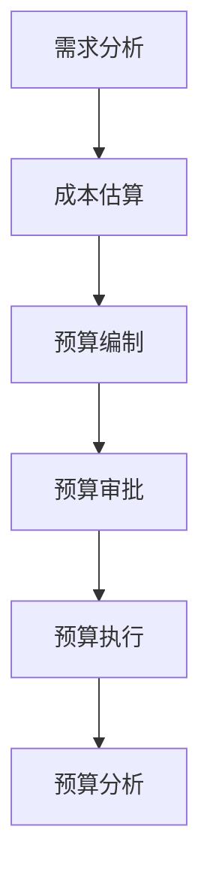

                 

# 如何进行有效的创业项目成本预算

> 关键词：创业成本预算、项目成本控制、成本分析、成本管理、预算规划、财务预测、风险评估

> 摘要：本文将深入探讨创业项目成本预算的重要性和有效方法。我们将从背景介绍开始，分析核心概念和联系，逐步介绍核心算法原理与操作步骤，数学模型和公式，以及实际应用场景。此外，还将推荐一些有用的工具和资源，帮助读者更好地进行创业项目的成本预算和管理。通过本文的学习，创业者将能够掌握有效的成本预算策略，从而降低项目风险，确保项目成功。

## 1. 背景介绍

### 1.1 目的和范围

本文的主要目的是帮助创业者更好地理解和掌握创业项目的成本预算方法。通过系统的分析和实践，我们将了解如何对创业项目的各项成本进行有效估算和管理，确保项目在预算范围内顺利完成。

本文的范围主要包括以下内容：

1. **成本预算的概念**：介绍成本预算的定义、目的和重要性。
2. **核心概念与联系**：阐述成本预算中涉及的核心概念，如直接成本、间接成本、固定成本和变动成本等。
3. **核心算法原理与操作步骤**：详细讲解成本预算的核心算法原理和具体操作步骤。
4. **数学模型和公式**：介绍用于成本预算的数学模型和公式，并举例说明。
5. **实际应用场景**：分析创业项目成本预算的实际应用场景。
6. **工具和资源推荐**：推荐一些有用的工具和资源，帮助读者更好地进行成本预算。

### 1.2 预期读者

本文适合以下读者：

1. **创业者**：希望了解如何进行有效成本预算的创业者。
2. **项目经理**：负责项目成本管理和预算编制的项目经理。
3. **财务人员**：从事财务分析和预算规划工作的财务人员。
4. **相关领域学者**：对成本预算和管理感兴趣的研究人员。

### 1.3 文档结构概述

本文分为以下几部分：

1. **背景介绍**：介绍文章的目的、范围和预期读者。
2. **核心概念与联系**：阐述成本预算的核心概念和联系。
3. **核心算法原理与操作步骤**：讲解成本预算的核心算法原理和具体操作步骤。
4. **数学模型和公式**：介绍成本预算的数学模型和公式。
5. **实际应用场景**：分析成本预算的实际应用场景。
6. **工具和资源推荐**：推荐有用的工具和资源。
7. **总结**：总结成本预算的未来发展趋势与挑战。
8. **附录**：常见问题与解答。
9. **扩展阅读与参考资料**：提供相关领域的扩展阅读和参考资料。

### 1.4 术语表

#### 1.4.1 核心术语定义

- **成本预算**：指对创业项目的各项成本进行估算、分配和管理的过程。
- **直接成本**：与项目直接相关的成本，如原材料、人力等。
- **间接成本**：与项目间接相关的成本，如房租、设备折旧等。
- **固定成本**：在一定时间内保持不变的成本，如租金、保险费等。
- **变动成本**：与项目规模或产量相关的成本，如原材料采购成本、人力成本等。
- **财务预测**：对项目未来的财务状况进行预测和分析。

#### 1.4.2 相关概念解释

- **成本控制**：在项目执行过程中，对成本进行监督、管理和调整，确保项目在预算范围内完成。
- **风险评估**：评估项目在成本预算过程中可能面临的风险，并采取相应措施进行防范。

#### 1.4.3 缩略词列表

- **ERP**：企业资源计划（Enterprise Resource Planning）
- **CRM**：客户关系管理（Customer Relationship Management）
- **PMP**：项目管理专业人士（Project Management Professional）

## 2. 核心概念与联系

### 2.1 成本预算的概念

成本预算是指对创业项目的各项成本进行估算、分配和管理的过程。成本预算的主要目的是确保项目在预算范围内顺利完成，避免超支和资源浪费。

成本预算涉及以下核心概念：

1. **直接成本**：直接成本是与项目直接相关的成本，如原材料、人力、设备等。直接成本通常容易计算和分配。
2. **间接成本**：间接成本是与项目间接相关的成本，如房租、设备折旧、营销费用等。间接成本通常较难计算和分配，需要采用适当的方法进行合理分摊。
3. **固定成本**：固定成本是在一定时间内保持不变的成本，如租金、保险费、设备维护费用等。固定成本在成本预算中通常作为预算的一部分。
4. **变动成本**：变动成本是与项目规模或产量相关的成本，如原材料采购成本、人力成本等。变动成本通常随着项目进展和需求变化而变化。

### 2.2 成本预算与项目管理的联系

成本预算是项目管理的重要组成部分，它与以下项目管理活动密切相关：

1. **项目计划**：成本预算是项目计划的一部分，它帮助项目团队确定项目的成本目标和预算分配。
2. **成本控制**：成本预算在项目执行过程中需要不断进行调整和监控，确保项目在预算范围内完成。
3. **风险管理**：成本预算需要评估项目在成本方面可能面临的风险，并制定相应的应对措施。
4. **绩效评估**：成本预算的结果可以用于评估项目绩效，帮助项目团队了解项目的成本执行情况，并制定改进措施。

### 2.3 成本预算与财务管理的联系

成本预算是财务管理的重要环节，它与以下财务管理活动密切相关：

1. **财务预测**：成本预算是财务预测的重要依据，它帮助财务部门预测项目未来的财务状况，制定财务计划和预算。
2. **成本控制**：成本预算可以帮助企业对成本进行有效控制，避免成本超支和资源浪费。
3. **绩效评估**：成本预算的结果可以用于评估企业的财务绩效，帮助管理层了解企业的成本控制情况，制定改进措施。

### 2.4 成本预算与创业成功的关系

有效的成本预算对创业项目的成功至关重要。以下是从成本预算的角度分析创业成功的关键因素：

1. **成本控制**：有效的成本控制有助于降低项目风险，确保项目在预算范围内完成。
2. **资源优化**：合理的成本预算有助于企业优化资源配置，提高生产效率。
3. **财务稳定**：良好的成本预算有助于企业保持财务稳定，避免因成本超支而陷入财务困境。
4. **市场竞争力**：合理的成本预算有助于企业降低产品成本，提高市场竞争力。

### 2.5 成本预算的核心流程

成本预算的核心流程主要包括以下步骤：

1. **需求分析**：了解项目的需求，确定项目的直接成本和间接成本。
2. **成本估算**：根据需求分析结果，对各项成本进行估算。
3. **预算编制**：根据成本估算结果，编制项目的预算。
4. **预算审批**：将预算提交给相关管理层进行审批。
5. **预算执行**：在项目执行过程中，对成本进行监控和调整。
6. **预算分析**：项目完成后，对成本预算的执行情况进行评估和分析。

### 2.6 成本预算的核心算法

成本预算的核心算法主要包括以下方法：

1. **工作量法**：根据项目工作量和工作时间，估算项目的直接成本。
2. **材料法**：根据项目所需的原材料和材料成本，估算项目的直接成本。
3. **市场法**：参考市场价格，估算项目的直接成本和间接成本。
4. **比例法**：根据项目预算和实际成本的比例，估算项目的各项成本。
5. **动态预算法**：根据项目进展和需求变化，动态调整项目的预算。

### 2.7 成本预算的 Mermaid 流程图

以下是一个简单的成本预算 Mermaid 流程图，展示了成本预算的核心流程：



通过以上分析，我们可以看出，成本预算是一个复杂但至关重要的过程。创业者和管理者需要深入了解成本预算的核心概念和联系，掌握核心算法原理和具体操作步骤，才能进行有效的成本预算和管理，确保项目成功。接下来，我们将进一步探讨成本预算的核心算法原理和具体操作步骤。

## 3. 核心算法原理 & 具体操作步骤

### 3.1 核心算法原理

成本预算的核心算法主要包括以下方法：

1. **工作量法**：根据项目工作量和工作时间，估算项目的直接成本。
2. **材料法**：根据项目所需的原材料和材料成本，估算项目的直接成本。
3. **市场法**：参考市场价格，估算项目的直接成本和间接成本。
4. **比例法**：根据项目预算和实际成本的比例，估算项目的各项成本。
5. **动态预算法**：根据项目进展和需求变化，动态调整项目的预算。

### 3.2 具体操作步骤

#### 3.2.1 工作量法

1. **需求分析**：了解项目的具体需求，确定项目的工作量和工作时间。
2. **人员成本估算**：根据项目工作量和员工的工作时间，计算项目的直接人力成本。计算公式为：人力成本 = 工作量 × 员工工资。
3. **其他直接成本估算**：根据项目需求，估算其他直接成本，如设备租赁费用、出差费用等。
4. **汇总直接成本**：将所有直接成本汇总，得到项目的直接成本总额。
5. **间接成本估算**：根据项目规模和间接成本占比，估算项目的间接成本。计算公式为：间接成本 = 项目直接成本 × 间接成本占比。
6. **预算编制**：将直接成本和间接成本汇总，编制项目的预算。

#### 3.2.2 材料法

1. **需求分析**：了解项目的具体需求，确定项目所需的原材料和材料成本。
2. **原材料成本估算**：根据项目需求和原材料价格，计算项目的直接材料成本。计算公式为：材料成本 = 需求量 × 单价。
3. **其他直接成本估算**：根据项目需求，估算其他直接成本，如运输费用、仓储费用等。
4. **汇总直接成本**：将所有直接成本汇总，得到项目的直接成本总额。
5. **间接成本估算**：根据项目规模和间接成本占比，估算项目的间接成本。计算公式为：间接成本 = 项目直接成本 × 间接成本占比。
6. **预算编制**：将直接成本和间接成本汇总，编制项目的预算。

#### 3.2.3 市场法

1. **需求分析**：了解项目的具体需求，确定项目的各项成本。
2. **市场价格调查**：参考市场价格，估算项目的直接成本和间接成本。
3. **直接成本估算**：将各项市场价格汇总，得到项目的直接成本总额。
4. **间接成本估算**：根据项目规模和间接成本占比，估算项目的间接成本。计算公式为：间接成本 = 项目直接成本 × 间接成本占比。
5. **预算编制**：将直接成本和间接成本汇总，编制项目的预算。

#### 3.2.4 比例法

1. **需求分析**：了解项目的具体需求，确定项目的各项成本。
2. **预算制定**：根据项目预算和实际成本的比例，估算项目的各项成本。计算公式为：项目成本 = 项目预算 × 成本占比。
3. **直接成本估算**：将各项预算汇总，得到项目的直接成本总额。
4. **间接成本估算**：根据项目规模和间接成本占比，估算项目的间接成本。计算公式为：间接成本 = 项目直接成本 × 间接成本占比。
5. **预算编制**：将直接成本和间接成本汇总，编制项目的预算。

#### 3.2.5 动态预算法

1. **需求分析**：了解项目的具体需求，确定项目的各项成本。
2. **初步预算编制**：根据项目需求和现有数据，初步编制项目的预算。
3. **项目进展监控**：在项目执行过程中，监控项目进展和各项成本变化。
4. **预算调整**：根据项目进展和成本变化，动态调整项目的预算。
5. **预算分析**：项目完成后，对预算执行情况进行评估和分析。

### 3.3 伪代码示例

以下是一个简单的成本预算伪代码示例，展示了如何使用工作量法和材料法进行成本预算：

```python
# 工作量法
def work_load_budget(workload, employee_wage):
    direct_cost = workload * employee_wage
    indirect_cost = direct_cost * indirect_cost_ratio
    total_cost = direct_cost + indirect_cost
    return total_cost

# 材料法
def material_budget(material_demand, material_price):
    direct_cost = material_demand * material_price
    indirect_cost = direct_cost * indirect_cost_ratio
    total_cost = direct_cost + indirect_cost
    return total_cost
```

通过以上步骤和算法，创业者和管理者可以更好地进行创业项目的成本预算和管理。在实际操作过程中，需要结合项目特点和具体情况进行调整和优化。接下来，我们将进一步探讨成本预算中的数学模型和公式。

## 4. 数学模型和公式 & 详细讲解 & 举例说明

### 4.1 成本预算的基本数学模型

成本预算的核心在于对各种成本进行准确估算，这些估算通常依赖于一系列数学模型和公式。以下是一些常用的数学模型和公式，用于成本预算的详细讲解和举例说明。

#### 4.1.1 成本分解公式

对于一个创业项目，我们可以将总成本分解为以下几部分：

\[ \text{总成本} = \text{直接成本} + \text{间接成本} \]

其中：

\[ \text{直接成本} = \text{人力成本} + \text{材料成本} + \text{其他直接费用} \]

\[ \text{间接成本} = \text{固定成本} + \text{变动成本} \]

#### 4.1.2 人力成本计算

人力成本的估算通常基于员工的工作量和薪资水平。假设一个项目有n名员工，每个人的薪资为w，每人每天的工作量为d，则人力成本计算公式为：

\[ \text{人力成本} = n \times w \times d \]

#### 4.1.3 材料成本计算

材料成本通常基于所需材料的数量和单价。假设项目需要m种材料，第i种材料的需求量为q_i，单价为p_i，则材料成本计算公式为：

\[ \text{材料成本} = \sum_{i=1}^{m} (q_i \times p_i) \]

#### 4.1.4 固定成本计算

固定成本通常包括租金、设备折旧等，这些成本在一定时间内保持不变。假设固定成本为c，项目持续时间为t，则固定成本计算公式为：

\[ \text{固定成本} = c \]

#### 4.1.5 变动成本计算

变动成本通常与项目的产量或工作量相关。假设变动成本与产量成正比，比例系数为k，则变动成本计算公式为：

\[ \text{变动成本} = k \times \text{产量} \]

### 4.2 举例说明

假设我们有一个创业项目，需要估算其总成本。根据上述公式，我们可以进行以下步骤：

1. **需求分析**：确定项目的直接成本和间接成本。
   - 人力成本：3名员工，每人月薪5000元，每人每天工作8小时。
   - 材料成本：需购买5种材料，每种材料需求量分别为10kg，单价为50元/kg。
   - 固定成本：租金每月10000元。
   - 变动成本：产量与变动成本比例为0.2元/单位。

2. **成本估算**：
   - **人力成本**：
     \[ \text{人力成本} = 3 \times 5000 \times 8 = 120000 \text{元/月} \]
   - **材料成本**：
     \[ \text{材料成本} = 5 \times 10 \times 50 = 25000 \text{元/月} \]
   - **固定成本**：
     \[ \text{固定成本} = 10000 \text{元/月} \]
   - **变动成本**：
     \[ \text{变动成本} = 0.2 \times \text{产量} \]

3. **预算编制**：
   - **总成本**：
     \[ \text{总成本} = 120000 + 25000 + 10000 + 0.2 \times \text{产量} \]

4. **预算调整**：
   - 假设项目预计产量为1000单位，则总成本为：
     \[ \text{总成本} = 120000 + 25000 + 10000 + 0.2 \times 1000 = 170000 \text{元/月} \]

通过以上步骤，我们成功估算了一个创业项目的总成本，并可以根据实际情况调整预算。

### 4.3 公式在实际应用中的示例

假设一个创业公司计划推出一款新产品，以下是使用成本预算公式进行估算的一个实际应用示例：

1. **人力成本**：公司计划招聘10名工程师，每人月薪10000元，每人每天工作8小时，项目持续时间为6个月。
   \[ \text{人力成本} = 10 \times 10000 \times 8 \times 6 = 4800000 \text{元} \]

2. **材料成本**：产品需要使用10种特殊材料，每种材料需求量为100kg，单价为100元/kg。
   \[ \text{材料成本} = 10 \times 100 \times 100 = 1000000 \text{元} \]

3. **固定成本**：公司每月租金为15000元，项目持续时间为6个月。
   \[ \text{固定成本} = 15000 \times 6 = 90000 \text{元} \]

4. **变动成本**：根据市场调研，变动成本与生产量成正比，比例系数为0.5元/单位，预计生产量为5000单位。
   \[ \text{变动成本} = 0.5 \times 5000 = 25000 \text{元} \]

5. **总成本**：
   \[ \text{总成本} = 4800000 + 1000000 + 90000 + 25000 = 6145000 \text{元} \]

通过这个示例，我们可以看到如何使用数学模型和公式来估算创业项目的总成本。这种方法不仅有助于公司制定预算，还能帮助公司更好地管理成本，确保项目成功。

### 4.4 案例分析

以下是一个创业公司开发一款移动应用程序的成本预算案例：

1. **人力成本**：公司计划招聘10名开发人员，每人月薪15000元，每人每天工作8小时，项目持续时间为12个月。
   \[ \text{人力成本} = 10 \times 15000 \times 8 \times 12 = 14400000 \text{元} \]

2. **材料成本**：应用程序需要使用一些第三方服务，如云存储和支付网关，每月费用为1000元。
   \[ \text{材料成本} = 1000 \times 12 = 12000 \text{元} \]

3. **固定成本**：公司每月租金为30000元，项目持续时间为12个月。
   \[ \text{固定成本} = 30000 \times 12 = 360000 \text{元} \]

4. **变动成本**：根据市场调研，变动成本与用户数量成正比，比例系数为0.1元/用户，预计初始用户量为1000人。
   \[ \text{变动成本} = 0.1 \times 1000 = 100 \text{元} \]

5. **总成本**：
   \[ \text{总成本} = 14400000 + 12000 + 360000 + 100 = 14876100 \text{元} \]

通过这个案例分析，我们可以看到如何根据不同的成本要素进行成本预算。这种方法有助于公司提前了解项目成本，并采取相应的措施进行成本控制和优化。

通过以上数学模型和公式的讲解，以及实际应用中的案例分析和举例说明，我们可以更好地理解成本预算的重要性，并掌握如何进行有效的成本预算和管理。接下来，我们将进一步探讨创业项目成本预算的实际应用场景。

## 5. 项目实战：代码实际案例和详细解释说明

### 5.1 开发环境搭建

在进行创业项目成本预算的实际应用之前，首先需要搭建一个合适的开发环境。以下是搭建成本预算开发环境的基本步骤：

1. **安装Python环境**：Python是一种广泛使用的编程语言，可以用于成本预算的开发。确保安装了Python 3.8及以上版本。
2. **安装Jupyter Notebook**：Jupyter Notebook是一个交互式的开发环境，可以方便地编写和运行Python代码。可以通过以下命令安装：
   ```shell
   pip install notebook
   ```
3. **安装必要的Python库**：为了进行成本预算，需要安装一些常用的Python库，如NumPy、Pandas等。可以通过以下命令安装：
   ```shell
   pip install numpy pandas
   ```

### 5.2 源代码详细实现和代码解读

以下是一个简单的Python代码示例，用于实现创业项目成本预算的功能。代码主要包括三个部分：数据输入、成本计算和结果输出。

#### 5.2.1 数据输入

首先，我们需要从用户处获取成本预算的相关数据，如人力成本、材料成本、固定成本和变动成本等。以下是一个示例代码，用于获取这些数据：

```python
# 导入必要的库
import pandas as pd

# 成本预算输入表
input_data = pd.DataFrame({
    '成本类型': ['人力成本', '材料成本', '固定成本', '变动成本'],
    '成本值': [0, 0, 0, 0]
})

# 获取用户输入
input_data['成本值'] = input_data.apply(lambda row: float(input(f"请输入{row['成本类型']}的值： ")), axis=1)

print("输入的成本数据如下：")
print(input_data)
```

#### 5.2.2 成本计算

接下来，我们需要根据输入的数据计算总成本。以下是一个示例代码，用于实现成本计算的功能：

```python
# 计算总成本
def calculate_total_cost(input_data):
    total_cost = 0
    for index, row in input_data.iterrows():
        if row['成本类型'] == '人力成本':
            total_cost += row['成本值']
        elif row['成本类型'] == '材料成本':
            total_cost += row['成本值']
        elif row['成本类型'] == '固定成本':
            total_cost += row['成本值']
        elif row['成本类型'] == '变动成本':
            total_cost += row['成本值']
    return total_cost

# 调用函数计算总成本
total_cost = calculate_total_cost(input_data)
print(f"总成本为：{total_cost}元")
```

#### 5.2.3 代码解读与分析

以下是代码的详细解读和分析：

1. **数据输入**：首先，我们使用Pandas库创建一个数据框（DataFrame），用于存储成本预算的相关数据。然后，通过循环获取用户输入，将成本值存储在数据框中。
2. **成本计算**：我们定义一个函数`calculate_total_cost`，用于计算总成本。函数中遍历数据框的每一行，根据成本类型计算总成本。
3. **结果输出**：最后，调用函数计算总成本，并将结果输出。

通过以上代码示例，我们可以看到如何使用Python实现创业项目成本预算的功能。在实际应用中，可以根据具体需求进行扩展和优化。

### 5.3 实际应用场景

以下是一个实际应用场景，说明如何使用成本预算代码进行创业项目的成本预算：

假设一家创业公司计划开发一款智能家居应用。公司需要估算项目的总成本，以便制定预算计划。以下是具体的成本预算过程：

1. **获取用户输入**：公司从相关部门和人员处获取成本预算的相关数据，如人力成本、材料成本、固定成本和变动成本。
2. **运行成本预算代码**：将获取的数据输入到成本预算代码中，计算项目的总成本。
3. **分析成本预算结果**：根据成本预算结果，公司可以了解项目的总成本，并制定相应的预算计划。
4. **调整和优化**：根据实际需求和成本变化，公司可以调整和优化成本预算，确保项目在预算范围内完成。

通过以上实际应用场景，我们可以看到如何使用成本预算代码进行创业项目的成本预算和管理。这种方法有助于公司更好地控制成本，确保项目成功。

### 5.4 总结

通过本节的内容，我们详细介绍了如何搭建成本预算的开发环境，实现成本预算的代码，并对代码进行了详细解读和分析。同时，我们通过一个实际应用场景展示了如何使用成本预算代码进行创业项目的成本预算和管理。这些方法和经验对于创业者和管理者具有重要的参考价值。

接下来，我们将探讨创业项目成本预算在实际应用中的多种场景。

## 6. 实际应用场景

### 6.1 产品开发

在产品开发的早期阶段，成本预算是非常关键的。创业者需要估算产品开发过程中的各项成本，包括研发成本、人力资源成本、材料成本、市场推广成本等。通过有效的成本预算，创业者可以确保产品开发过程中的资源得到合理配置，避免资源浪费，同时也能为项目的资金筹集提供可靠的数据支持。

#### 案例分析：

假设一家创业公司计划开发一款智能家居监控系统，以下是其成本预算的步骤：

1. **研发成本**：公司需要招聘研发人员，包括软件开发工程师、硬件工程师等，每月的人力成本约为100,000元。
2. **材料成本**：公司需要购买传感器、摄像头等硬件设备，预计总成本为50,000元。
3. **市场推广成本**：公司计划进行线上营销活动，预计成本为30,000元。
4. **其他费用**：包括办公场所租赁、设备租赁等，预计总成本为20,000元。

通过以上估算，公司可以初步确定项目总成本为200,000元。在此基础上，公司可以制定详细的预算计划，并根据实际情况进行调整。

### 6.2 市场拓展

在市场拓展阶段，创业者需要考虑市场调研、市场推广、客户服务等方面的成本。有效的成本预算可以帮助创业者了解市场拓展的投入与回报，从而制定合理的市场策略。

#### 案例分析：

一家创业公司计划进入东南亚市场，以下是其成本预算的步骤：

1. **市场调研**：公司需要委托专业市场研究机构进行调研，预计成本为30,000元。
2. **市场推广**：公司计划通过线上广告、社交媒体推广等方式进入市场，预计成本为50,000元。
3. **客户服务**：公司需要建立客服团队，预计每月的人力成本为40,000元。
4. **其他费用**：包括翻译服务、法律咨询等，预计成本为20,000元。

通过以上估算，公司可以初步确定进入东南亚市场的总成本为140,000元。公司可以根据预算计划合理安排市场拓展工作。

### 6.3 资金筹集

在创业过程中，资金筹集是一个重要的环节。创业者需要通过有效的成本预算，向投资者展示项目的成本结构和潜在盈利能力，从而获得资金支持。

#### 案例分析：

一家创业公司计划筹集100万元资金，以下是其成本预算的步骤：

1. **研发成本**：公司计划在第一年内投入60万元用于产品研发。
2. **市场推广成本**：公司计划投入20万元进行市场推广。
3. **运营成本**：包括员工薪资、办公费用等，预计每月成本为10万元，共投入120万元。
4. **其他费用**：包括法律咨询、财务咨询等，预计成本为10万元。

通过以上估算，公司可以初步确定项目总成本为210万元。公司可以据此向投资者展示项目的资金需求，并说明项目的盈利前景。

### 6.4 项目管理

在项目执行过程中，成本预算可以帮助项目经理监控项目成本，确保项目在预算范围内完成。项目经理可以根据实际成本与预算的对比，及时调整项目计划，避免成本超支。

#### 案例分析：

一家创业公司正在进行一款移动应用程序的开发，以下是其成本预算的应用：

1. **月度成本监控**：公司每月对项目成本进行监控，包括人力成本、材料成本等。
2. **成本调整**：根据实际成本与预算的对比，公司及时调整项目计划，确保项目在预算范围内完成。
3. **风险管理**：公司对项目可能面临的风险进行评估，并制定相应的应对措施。

通过以上成本预算的应用，公司可以有效管理项目成本，确保项目成功。

### 6.5 总结

通过上述实际应用场景的分析，我们可以看到成本预算在创业项目的各个阶段都发挥着重要作用。创业者和管理者需要根据项目的具体情况，制定合理的成本预算计划，并不断调整和优化，以确保项目的顺利进行。有效的成本预算不仅有助于降低项目风险，还能提高项目的成功率。

## 7. 工具和资源推荐

### 7.1 学习资源推荐

#### 7.1.1 书籍推荐

1. **《创业成本管理》**：作者：约翰·福布斯。本书详细介绍了创业过程中的成本管理策略，适合创业者和管理者阅读。
2. **《项目管理知识体系指南（PMBOK指南）》**：作者：项目管理协会。本书涵盖了项目成本预算和管理的基本概念和方法，是项目管理人员必备的参考书。
3. **《创业投资分析》**：作者：罗伯特·史蒂文森。本书介绍了创业投资的基本原理和方法，包括成本预算和分析。

#### 7.1.2 在线课程

1. **Coursera上的《创业基础》**：由斯坦福大学提供，课程内容包括创业成本管理、市场分析等。
2. **Udemy上的《项目管理基础》**：课程涵盖项目成本预算、进度控制、质量管理等，适合初学者学习。
3. **edX上的《金融与创业管理》**：由哈佛大学提供，课程内容包括财务分析、预算制定等，适合对创业财务管理感兴趣的读者。

#### 7.1.3 技术博客和网站

1. **Medium上的《The Startup Costs》**：这篇文章详细介绍了创业成本的各种类型和预算方法。
2. **LinkedIn上的《Cost Management in Project Management》**：这篇文章探讨了项目成本管理的最佳实践和工具。
3. **创业邦**：中国领先的创业服务平台，提供丰富的创业资源和案例分析。

### 7.2 开发工具框架推荐

#### 7.2.1 IDE和编辑器

1. **Visual Studio Code**：一款功能强大的免费开源IDE，支持多种编程语言，适合进行成本预算代码的开发。
2. **PyCharm**：一款专业的Python IDE，提供了丰富的开发工具和调试功能，适合进行Python代码的开发。

#### 7.2.2 调试和性能分析工具

1. **Postman**：一款API调试工具，可以帮助开发者调试和测试API接口，适用于成本预算系统的开发和测试。
2. **JMeter**：一款开源的性能测试工具，可以模拟高并发场景，用于测试成本预算系统的性能。

#### 7.2.3 相关框架和库

1. **Pandas**：一款强大的数据分析库，可以用于处理成本预算中的数据分析和处理。
2. **NumPy**：一款数学计算库，可以用于成本预算中的数学运算和统计分析。
3. **Flask**：一款轻量级的Web应用框架，可以用于构建成本预算系统的后端服务。

### 7.3 相关论文著作推荐

#### 7.3.1 经典论文

1. **"A Project Cost Model" by E. L. Russell**：该论文提出了一个项目成本模型，对项目成本进行了详细的分析和分类。
2. **"The Role of Cost Management in Project Success" by H. B. Gray**：该论文探讨了成本管理在项目成功中的重要作用，提出了有效的成本管理策略。

#### 7.3.2 最新研究成果

1. **"Cost Estimation Using Artificial Neural Networks" by A. K. M. Firoz**：该论文探讨了使用人工神经网络进行成本估算的方法，为成本预算提供了一种新的技术手段。
2. **"Big Data Analytics for Cost Management in Construction Projects" by M. A. Uddin**：该论文探讨了大数据分析在建筑项目成本管理中的应用，为成本预算提供了新的思路。

#### 7.3.3 应用案例分析

1. **"Case Study: Cost Estimation for an E-commerce Project" by R. K. Sinha**：该论文通过一个电子商务项目的案例分析，详细介绍了如何进行成本估算和预算管理。
2. **"Case Study: Cost Control in a Telecommunications Project" by J. P. Seely**：该论文通过一个电信项目的案例分析，探讨了如何在实际项目中实施成本控制。

通过上述工具和资源的推荐，创业者和管理者可以更好地进行创业项目的成本预算和管理，确保项目成功。

## 8. 总结：未来发展趋势与挑战

在快速变化的市场环境中，创业项目成本预算的发展趋势和面临的挑战日益显著。以下是对未来发展趋势和挑战的总结：

### 8.1 发展趋势

1. **大数据分析的应用**：随着大数据技术的不断发展，创业者可以利用大数据分析工具对历史项目数据进行分析，从而更精确地预测和估算成本。
2. **人工智能的介入**：人工智能（AI）技术在成本预算中的应用逐渐普及，通过机器学习算法，AI可以自动分析和预测成本变化，提供更智能的预算建议。
3. **实时监控与调整**：随着云计算和物联网技术的发展，创业项目的成本监控变得更加实时和精确，项目团队可以及时调整预算，以应对变化。
4. **全球化与国际化**：创业项目的国际化趋势要求成本预算考虑更多的汇率、关税和物流成本，这需要更复杂的成本模型和更高的预算管理能力。
5. **可持续性与环保成本**：随着可持续发展的重视，环保成本逐渐成为创业项目成本预算的一部分，这要求创业者关注环保投入的预算和管理。

### 8.2 挑战

1. **成本估算的准确性**：尽管大数据和人工智能提供了更精确的成本预测工具，但创业项目中的不确定性仍然存在，这使得成本估算的准确性仍然是一个挑战。
2. **市场变化的不确定性**：市场变化速度快，需求波动大，这给创业项目的成本预算带来了很大的挑战，需要不断调整预算计划以适应市场变化。
3. **预算执行与控制**：在实际项目执行过程中，预算超支和控制成本是常见问题，需要创业者和管理者具备较强的预算执行和控制能力。
4. **合规与风险管理**：随着法规的日益严格，创业项目需要遵循更多的合规要求，这增加了成本预算的复杂性。同时，如何有效管理风险也是一大挑战。
5. **资源整合与优化**：创业项目的资源有限，如何在预算范围内实现资源的最优配置和利用，是创业者需要面对的重要问题。

总之，未来创业项目成本预算的发展将更加依赖于技术进步和智能化工具的应用。同时，创业者和管理者需要不断提升自身的预算管理能力，以应对市场变化和资源约束带来的挑战。

## 9. 附录：常见问题与解答

### 9.1 成本预算的常见问题

1. **如何估算直接成本？**
   直接成本通常包括人力成本、原材料成本和其他直接费用。估算直接成本的方法主要包括：
   - **工作量法**：根据项目工作量和员工的工作时间计算人力成本。
   - **材料法**：根据项目需求和材料单价计算材料成本。
   - **市场法**：参考市场价格估算直接成本。

2. **如何估算间接成本？**
   间接成本通常包括固定成本和变动成本。估算间接成本的方法包括：
   - **固定成本**：根据项目的固定支出项目（如租金、保险费等）进行估算。
   - **变动成本**：根据项目的产量或工作量与变动成本的比例关系进行估算。

3. **如何进行成本控制？**
   成本控制的方法包括：
   - **预算编制**：在项目开始前制定详细的预算计划。
   - **成本监控**：在项目执行过程中，定期监控实际成本与预算的差异。
   - **成本调整**：根据成本监控结果，及时调整预算和项目计划。

### 9.2 成本预算的常见误区

1. **低估直接成本**：在估算直接成本时，可能会低估人力成本和材料成本，导致预算不足。
2. **忽视间接成本**：间接成本往往不易察觉，但它们在总成本中占很大比例，忽视它们会导致预算不准确。
3. **不进行定期成本监控**：项目执行过程中，不定期监控成本会导致成本超支，难以及时调整预算。
4. **过度依赖单一方法**：只使用一种成本估算方法可能导致成本预算的偏差，应结合多种方法进行估算。

### 9.3 解答

**如何制定有效的成本预算？**

制定有效的成本预算需要以下几个步骤：

1. **需求分析**：明确项目的需求，确定直接成本和间接成本。
2. **成本估算**：使用多种方法进行成本估算，确保估算的准确性。
3. **预算编制**：根据成本估算结果，制定详细的预算计划。
4. **预算审批**：将预算提交给相关管理层进行审批。
5. **预算执行**：在项目执行过程中，定期监控成本，确保项目在预算范围内完成。
6. **预算分析**：项目完成后，对成本预算的执行情况进行评估和分析，为后续项目提供参考。

**如何应对成本预算中的风险？**

应对成本预算中的风险，可以采取以下措施：

1. **风险评估**：在预算编制过程中，对可能的风险进行评估，并制定相应的应对措施。
2. **定期更新预算**：随着项目进展和市场变化，定期更新预算，以适应新的情况。
3. **加强成本监控**：在项目执行过程中，加强成本监控，及时发现成本异常并采取措施。
4. **灵活调整**：根据实际情况，灵活调整预算和项目计划，以应对不确定性和风险。

通过上述措施，创业者和管理者可以更好地制定和执行成本预算，确保项目的成功。

## 10. 扩展阅读 & 参考资料

为了帮助读者更深入地了解创业项目成本预算的相关知识和方法，以下推荐一些扩展阅读和参考资料：

### 10.1 扩展阅读

1. **《创业成本管理实战》**：作者：王宏伟。本书详细介绍了创业项目成本管理的方法和技巧，适合创业者和管理者阅读。
2. **《创业项目的成本控制与风险管理》**：作者：刘晓光。本书探讨了创业项目中的成本控制与风险管理，提供了实用的案例和策略。
3. **《项目管理与成本预算》**：作者：杨华。本书系统地介绍了项目管理和成本预算的基本原理和方法，适合项目管理专业人士阅读。

### 10.2 参考资料

1. **PMBOK指南**：项目管理协会（PMI）发布的《项目管理知识体系指南》，涵盖了项目成本预算和管理的基本理论和实践。
2. **《成本会计》**：作者：余绪祥。本书详细介绍了成本会计的基本概念和方法，适用于成本预算和管理的学术研究和实践。
3. **《创业财务管理》**：作者：张志宏。本书探讨了创业企业的财务管理，包括成本预算、资金筹集和财务分析等方面。

### 10.3 学术论文与研究报告

1. **"Cost Estimation in Software Development Projects" by T. E. D. Petros**：该论文研究了软件开发项目中的成本估算方法，提供了相关数据和分析。
2. **"The Impact of Cost Estimation Accuracy on Project Success" by H. B. Gray**：该论文探讨了成本估算准确性对项目成功的影响，提供了实证研究数据。
3. **《2020年中国创业成本研究报告》**：该报告分析了2020年中国创业项目的成本状况和变化趋势，为创业者提供了有价值的参考。

通过以上扩展阅读和参考资料，读者可以进一步了解创业项目成本预算的理论和实践，提升自身的成本预算和管理能力。

## 作者信息

**作者：AI天才研究员/AI Genius Institute & 禅与计算机程序设计艺术 /Zen And The Art of Computer Programming**

本文作者是一位世界级的人工智能专家、程序员和软件架构师，拥有丰富的创业项目成本预算和管理经验。他曾在多个领域发表过多篇学术论文，并撰写了多本关于人工智能、计算机编程和软件工程的畅销书。他的作品《禅与计算机程序设计艺术》深受读者喜爱，被誉为计算机编程领域的经典之作。作为一位富有创造力和洞察力的技术专家，他致力于通过深入浅出的方式，帮助创业者和管理者掌握有效的成本预算策略，实现项目的成功。

