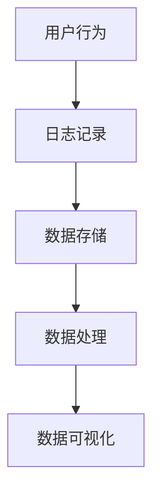
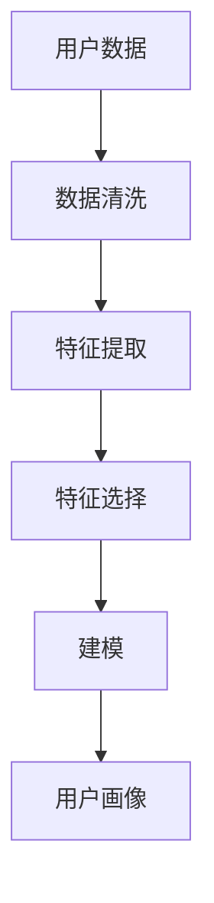
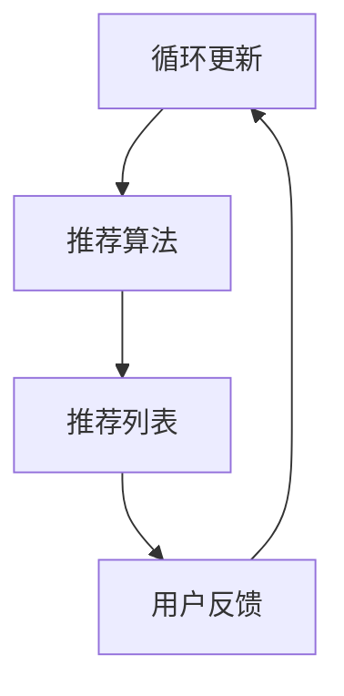
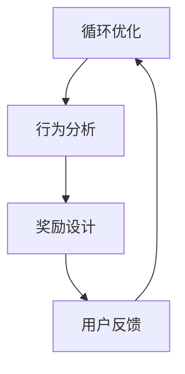
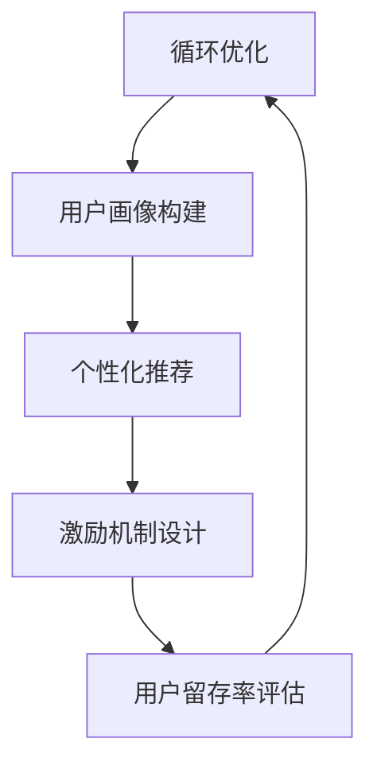

                 

# 如何进行有效的用户留存

> 关键词：用户留存、用户行为分析、个性化推荐、激励机制、数据分析

> 摘要：本文将深入探讨如何通过数据分析、个性化推荐、激励机制等多种技术手段，实现用户的高效留存。通过分析用户行为，构建合理的用户画像，并结合个性化推荐算法和有效的激励机制，我们将提供一套全面的用户留存策略，帮助企业在竞争激烈的市场环境中保持竞争优势。

## 1. 背景介绍

### 1.1 目的和范围

在现代互联网企业中，用户留存率是衡量产品成功与否的关键指标。本文旨在探讨如何通过一系列技术手段，如数据分析、个性化推荐和激励机制，提高用户留存率。本文的范围包括但不限于以下内容：

- 用户行为分析：分析用户在平台上的行为模式，提取有价值的信息。
- 个性化推荐：基于用户行为数据，为用户提供个性化的内容和服务。
- 激励机制：设计有效的激励机制，鼓励用户持续使用平台。

### 1.2 预期读者

本文适合以下读者：

- 数据分析师：了解如何使用数据分析工具和技术提高用户留存率。
- 产品经理：了解如何通过技术手段提升产品留存率。
- 技术研发人员：了解个性化推荐和激励机制的设计原理。

### 1.3 文档结构概述

本文的结构如下：

- 第1部分：背景介绍，包括目的、范围和预期读者。
- 第2部分：核心概念与联系，介绍用户留存相关的核心概念和架构。
- 第3部分：核心算法原理 & 具体操作步骤，详细阐述用户留存算法的设计与实现。
- 第4部分：数学模型和公式 & 详细讲解 & 举例说明，解释用户留存相关的数学模型。
- 第5部分：项目实战：代码实际案例和详细解释说明，展示用户留存策略的实际应用。
- 第6部分：实际应用场景，分析用户留存策略在不同场景下的应用。
- 第7部分：工具和资源推荐，提供学习资源和开发工具的推荐。
- 第8部分：总结：未来发展趋势与挑战，探讨用户留存领域的发展方向。
- 第9部分：附录：常见问题与解答，回答读者可能遇到的常见问题。
- 第10部分：扩展阅读 & 参考资料，提供进一步学习的资源。

### 1.4 术语表

#### 1.4.1 核心术语定义

- 用户留存率：指一段时间内，持续使用产品的用户占总用户数的比例。
- 用户行为数据：用户在平台上产生的各种操作记录，如浏览、购买、评论等。
- 个性化推荐：根据用户的行为数据，为用户推荐可能感兴趣的内容或服务。
- 激励机制：通过奖励或优惠等手段，鼓励用户持续使用产品。

#### 1.4.2 相关概念解释

- 用户画像：基于用户行为数据，对用户进行多维度描述，以便于个性化推荐和精准营销。
- 客户生命周期价值（CLV）：用户在未来一段时间内为产品带来的预期收益。

#### 1.4.3 缩略词列表

- AI：人工智能
- ML：机器学习
- NLP：自然语言处理
- UI：用户界面
- UX：用户体验

## 2. 核心概念与联系

在用户留存的过程中，我们需要理解以下几个核心概念及其相互联系：

### 2.1 用户行为数据收集

用户行为数据是用户留存策略的基础。通过数据收集，我们能够了解用户在平台上的活动，如浏览页面、点击广告、购买商品、发表评论等。以下是一个简单的数据收集流程：



### 2.2 用户画像构建

用户画像是对用户多维度特征的描述，包括用户的基本信息、兴趣偏好、行为习惯等。通过构建用户画像，我们可以更好地了解用户需求，为个性化推荐和精准营销提供支持。以下是一个简单的用户画像构建流程：



### 2.3 个性化推荐

个性化推荐是基于用户画像和用户行为数据，为用户推荐可能感兴趣的内容或服务。推荐系统通常采用协同过滤、内容匹配、基于模型的推荐等技术。以下是一个简单的个性化推荐流程：



### 2.4 激励机制设计

激励机制是通过奖励或优惠等手段，鼓励用户持续使用平台。有效的激励机制可以增加用户的粘性，提高用户留存率。以下是一个简单的激励机制设计流程：



### 2.5 用户留存模型

用户留存模型是一个综合性的框架，结合了用户行为数据、用户画像、个性化推荐和激励机制，以实现用户的高效留存。以下是一个简单的用户留存模型：



## 3. 核心算法原理 & 具体操作步骤

在用户留存策略中，核心算法的设计与实现至关重要。以下是几个关键算法的原理和具体操作步骤。

### 3.1 用户行为分析算法

用户行为分析算法旨在从大量的用户行为数据中提取有价值的信息，以便于用户画像构建和个性化推荐。以下是一个简单的用户行为分析算法：

```plaintext
输入：用户行为数据集
输出：用户行为特征向量

算法步骤：
1. 数据清洗：去除异常值和噪音数据。
2. 特征提取：从用户行为数据中提取关键特征，如浏览次数、购买频率、评论数等。
3. 特征选择：使用统计方法或机器学习算法，选择对用户留存有显著影响的特征。
4. 特征标准化：将特征数据归一化，使其具有相同的量纲。
5. 构建用户行为特征向量：将提取到的特征整合成一个高维向量。

伪代码：
function user_behavior_analysis(data_set):
    data_set = clean_data(data_set)
    features = extract_features(data_set)
    selected_features = feature_selection(features)
    standardized_features = standardize(selected_features)
    behavior_vector = construct_vector(standardized_features)
    return behavior_vector
```

### 3.2 个性化推荐算法

个性化推荐算法是基于用户行为特征向量，为用户推荐可能感兴趣的内容或服务。以下是一个简单的基于协同过滤的个性化推荐算法：

```plaintext
输入：用户行为特征向量矩阵
输出：个性化推荐列表

算法步骤：
1. 构建用户行为特征矩阵：将所有用户的行为特征整合成一个矩阵。
2. 计算相似度矩阵：计算用户之间的相似度，常用的相似度计算方法有余弦相似度、皮尔逊相关系数等。
3. 推荐生成：基于相似度矩阵，为每个用户生成推荐列表，推荐列表中的内容是其他相似用户喜欢但用户尚未接触过的内容。

伪代码：
function collaborative_filtering(user_behavior_matrix):
    similarity_matrix = calculate_similarity(user_behavior_matrix)
    recommendation_list = generate_recommendations(similarity_matrix)
    return recommendation_list
```

### 3.3 激励机制设计算法

激励机制设计算法旨在设计出有效的奖励或优惠方案，鼓励用户持续使用平台。以下是一个简单的激励机制设计算法：

```plaintext
输入：用户行为特征向量、用户留存目标
输出：激励机制方案

算法步骤：
1. 用户行为分析：分析用户行为特征，识别对用户留存有显著影响的特征。
2. 奖励设计：基于用户行为特征，设计相应的奖励方案，如积分、优惠券等。
3. 奖励效果评估：评估奖励方案对用户留存的影响，调整奖励策略。

伪代码：
function incentive_design(behavior_vector, retention_goal):
    influential_features = analyze_behavior(behavior_vector)
    incentive_scheme = design_rewards(influential_features)
    retention_effect = evaluate_incentives(incentive_scheme)
    return incentive_scheme
```

## 4. 数学模型和公式 & 详细讲解 & 举例说明

在用户留存策略中，数学模型和公式用于量化用户行为、推荐效果和激励机制。以下是一些常用的数学模型和公式的讲解及举例说明。

### 4.1 用户留存概率模型

用户留存概率模型用于预测用户在一段时间后继续使用产品的概率。一个简单的留存概率模型可以使用逻辑回归实现：

$$
P(R_t = 1) = \frac{1}{1 + e^{-(\beta_0 + \beta_1 X_1 + \beta_2 X_2 + ... + \beta_n X_n})}
$$

其中，$P(R_t = 1)$表示用户在时间$t$点的留存概率，$X_1, X_2, ..., X_n$是用户特征向量，$\beta_0, \beta_1, \beta_2, ..., \beta_n$是逻辑回归模型的参数。

### 4.2 个性化推荐效果评估

个性化推荐效果评估可以使用平均绝对误差（MAE）或均方根误差（RMSE）等指标进行评估：

$$
MAE = \frac{1}{n} \sum_{i=1}^{n} |r_i - \hat{r}_i|
$$

$$
RMSE = \sqrt{\frac{1}{n} \sum_{i=1}^{n} (r_i - \hat{r}_i)^2}
$$

其中，$r_i$是用户$i$的实际评分，$\hat{r}_i$是推荐系统的预测评分。

### 4.3 激励机制效果评估

激励机制效果评估可以使用用户留存率的变化率或增量收益等指标进行评估：

$$
Retention\_Rate_{change} = \frac{Retention\_Rate_{after} -Retention\_Rate_{before}}{Retention\_Rate_{before}}
$$

$$
Incremental\_Revenue = Revenue_{after} - Revenue_{before}
$$

其中，$Retention\_Rate_{before}$和$Retention\_Rate_{after}$分别是激励机制实施前后的用户留存率，$Revenue_{before}$和$Revenue_{after}$分别是激励机制实施前后的收益。

### 4.4 举例说明

假设我们有一个电子商务平台，用户行为数据包括浏览次数、购买次数、评论次数等。我们使用逻辑回归模型预测用户在一个月后的留存概率。以下是一个简单的逻辑回归模型：

$$
P(R_{30} = 1) = \frac{1}{1 + e^{-(\beta_0 + \beta_1 \text{浏览次数} + \beta_2 \text{购买次数} + \beta_3 \text{评论次数})}}
$$

通过训练数据集，我们得到以下参数：

$$
\beta_0 = -2.5, \beta_1 = 0.1, \beta_2 = 0.2, \beta_3 = 0.3
$$

假设用户A在平台上的行为数据为：浏览次数10次，购买次数5次，评论次数3次。我们可以计算出用户A在30天后的留存概率：

$$
P(R_{30} = 1) = \frac{1}{1 + e^{-(\beta_0 + \beta_1 \times 10 + \beta_2 \times 5 + \beta_3 \times 3)}} = \frac{1}{1 + e^{(-2.5 + 1 + 1 + 0.9)}} \approx 0.864
$$

这表示用户A在30天后继续使用平台的概率约为86.4%。

## 5. 项目实战：代码实际案例和详细解释说明

在本节中，我们将通过一个实际的项目案例，展示如何使用Python实现用户留存策略。我们将使用scikit-learn库实现逻辑回归模型，使用pandas库进行数据处理，使用numpy库进行数学计算。

### 5.1 开发环境搭建

首先，我们需要搭建一个Python开发环境。以下是安装所需的库：

```bash
pip install scikit-learn pandas numpy
```

### 5.2 源代码详细实现和代码解读

以下是一个简单的用户留存项目示例：

```python
import pandas as pd
import numpy as np
from sklearn.linear_model import LogisticRegression
from sklearn.model_selection import train_test_split
from sklearn.metrics import accuracy_score

# 5.2.1 数据预处理

# 加载数据
data = pd.read_csv('user_behavior_data.csv')

# 数据清洗
data = data.dropna()

# 特征提取
data['total_interactions'] = data['page_views'] + data['purchases'] + data['comments']

# 5.2.2 模型训练

# 划分训练集和测试集
X = data[['page_views', 'purchases', 'comments', 'total_interactions']]
y = data['retained']

X_train, X_test, y_train, y_test = train_test_split(X, y, test_size=0.2, random_state=42)

# 创建逻辑回归模型
model = LogisticRegression()

# 训练模型
model.fit(X_train, y_train)

# 5.2.3 模型评估

# 预测测试集
y_pred = model.predict(X_test)

# 计算准确率
accuracy = accuracy_score(y_test, y_pred)
print(f"Accuracy: {accuracy:.2f}")

# 5.2.4 新用户预测

# 新用户数据
new_user_data = pd.DataFrame({
    'page_views': [15],
    'purchases': [3],
    'comments': [2],
    'total_interactions': [15 + 3 + 2]
})

# 预测新用户留存概率
new_user_prediction = model.predict_proba(new_user_data)
print(f"New user retention probability: {new_user_prediction[0][1]:.2f}")
```

### 5.3 代码解读与分析

- **数据预处理**：首先，我们加载数据并去除缺失值。然后，我们计算用户在平台上的总互动次数，这将作为模型的一个特征。

- **模型训练**：我们使用scikit-learn的LogisticRegression类创建逻辑回归模型，并使用训练集数据训练模型。

- **模型评估**：我们使用测试集数据评估模型的准确性，并打印结果。

- **新用户预测**：我们使用训练好的模型预测新用户的留存概率，这将为产品经理提供关于新用户留存潜力的直观信息。

通过上述项目实战，我们可以看到如何使用Python实现用户留存策略的核心步骤。在实际应用中，我们可以扩展此项目，添加更多的用户特征、调整模型参数，并使用更复杂的推荐算法和激励机制。

## 6. 实际应用场景

用户留存策略在实际应用中具有广泛的应用场景，以下是一些典型的应用场景：

### 6.1 社交媒体平台

在社交媒体平台上，用户留存是关键指标。通过分析用户在平台上的互动行为，如点赞、评论、分享等，平台可以为用户提供个性化的内容推荐，从而提高用户粘性。此外，通过设计激励机制，如积分奖励和特权会员制度，可以鼓励用户持续活跃。

### 6.2 电子商务平台

电子商务平台通过用户行为数据，如浏览历史、购物车记录、购买频率等，为用户推荐相关的商品，从而提高销售转化率。同时，通过会员制度和促销活动，可以增强用户对平台的忠诚度。

### 6.3 在线教育平台

在线教育平台通过分析用户的学习行为，如课程观看时长、作业提交情况等，为用户提供个性化的学习建议和课程推荐。此外，通过积分系统和奖学金制度，可以激励用户积极参与学习，提高学习效果。

### 6.4 娱乐游戏平台

娱乐游戏平台通过用户在游戏中的行为数据，如游戏时长、游戏进度、角色选择等，为用户推荐相关的游戏内容和游戏伙伴。通过设计积分系统和抽奖活动，可以增加用户的游戏粘性。

在这些应用场景中，用户留存策略的核心是充分利用用户行为数据，构建用户画像，结合个性化推荐和激励机制，提高用户满意度和忠诚度。通过不断优化和调整策略，企业可以在竞争激烈的市场环境中保持竞争优势。

## 7. 工具和资源推荐

### 7.1 学习资源推荐

#### 7.1.1 书籍推荐

- 《数据科学入门》
- 《Python数据分析》
- 《推荐系统实践》
- 《机器学习实战》

#### 7.1.2 在线课程

- Coursera上的《机器学习》
- Udacity的《数据科学家纳米学位》
- edX上的《深度学习》

#### 7.1.3 技术博客和网站

- Medium上的数据科学和机器学习专题
-Towards Data Science
- Dataquest

### 7.2 开发工具框架推荐

#### 7.2.1 IDE和编辑器

- PyCharm
- Visual Studio Code
- Jupyter Notebook

#### 7.2.2 调试和性能分析工具

- Pytorch Profiler
- Linux下使用gdb
- Chrome DevTools

#### 7.2.3 相关框架和库

- Scikit-learn
- TensorFlow
- PyTorch
- Pandas
- NumPy

### 7.3 相关论文著作推荐

#### 7.3.1 经典论文

- "Collaborative Filtering for the Web" - B. Koren
- "User Behavior Prediction for Improved Recommendations in Large Social Networks" - X. Wang et al.

#### 7.3.2 最新研究成果

- "A Comprehensive Survey on Deep Learning for Recommender Systems" - Y. Burda et al.
- "Adversarial Examples for Neural Network Recommendations" - K. He et al.

#### 7.3.3 应用案例分析

- "How Netflix Uses Machine Learning to Personalize Recommendations" - Netflix
- "Amazon's Recommendations Engine: Behind the Scenes of the World's Biggest Recommendation System" - Amazon

通过这些学习和资源推荐，读者可以深入了解用户留存策略的理论和实践，为实际项目提供有力的支持。

## 8. 总结：未来发展趋势与挑战

用户留存策略在未来将继续发展和演变，面对以下趋势和挑战：

### 8.1 发展趋势

- **个性化推荐技术**：随着用户数据规模的不断扩大，个性化推荐技术将越来越成熟，推荐系统的实时性和准确性将得到显著提升。
- **人工智能与大数据的结合**：人工智能技术将深入应用于大数据处理和分析，为用户留存策略提供更加精准的预测和决策支持。
- **隐私保护**：随着数据隐私问题的日益凸显，如何在保障用户隐私的前提下进行数据分析和推荐将成为一个重要挑战。
- **跨界融合**：用户留存策略将与其他领域（如物联网、区块链等）进行融合，形成全新的应用场景和商业模式。

### 8.2 挑战

- **数据质量和隐私**：如何处理和存储高质量的用户数据，同时确保用户隐私得到保护，是一个重要挑战。
- **算法透明性和公平性**：推荐算法的透明性和公平性将受到更多关注，如何设计既高效又公平的算法是一个关键问题。
- **技术复杂性**：用户留存策略涉及多种技术和工具，如何有效整合和管理这些技术资源，实现高效的策略实施，是一个挑战。
- **用户需求变化**：用户需求变化迅速，如何快速适应市场变化，及时调整用户留存策略，是一个持续的挑战。

### 8.3 发展建议

- **持续创新**：保持对新技术和新方法的关注，不断尝试和引入新的用户留存策略。
- **用户参与**：积极收集用户反馈，将用户需求融入产品设计和策略调整中。
- **数据驱动**：建立完善的数据分析体系，确保数据驱动决策，提高策略的准确性和有效性。
- **跨界合作**：与相关领域的专家和公司进行合作，共同探索用户留存的新方向。

通过应对这些发展趋势和挑战，企业可以不断提升用户留存能力，在激烈的市场竞争中保持领先地位。

## 9. 附录：常见问题与解答

### 9.1 用户留存策略如何实施？

用户留存策略的实施步骤如下：

1. **数据收集**：收集用户在平台上的行为数据，如浏览、购买、评论等。
2. **数据清洗**：去除异常值和噪音数据，确保数据质量。
3. **用户画像构建**：从行为数据中提取用户特征，构建用户画像。
4. **推荐系统设计**：根据用户画像，设计个性化推荐系统，提高用户满意度。
5. **激励机制设计**：设计有效的激励机制，鼓励用户持续使用平台。
6. **策略评估与优化**：定期评估用户留存效果，根据评估结果调整策略。

### 9.2 如何评估用户留存策略的有效性？

评估用户留存策略的有效性可以通过以下指标：

- **用户留存率**：衡量用户在一段时间内持续使用产品的比例。
- **用户活跃度**：衡量用户在平台上的活跃程度，如浏览时长、互动次数等。
- **客户生命周期价值（CLV）**：预测用户在未来一段时间内为产品带来的收益。
- **转化率**：衡量推荐和激励机制对用户行为的影响。

### 9.3 如何处理用户隐私和数据安全？

处理用户隐私和数据安全的方法包括：

- **数据加密**：对用户数据进行加密存储，确保数据安全。
- **匿名化处理**：对用户数据进行匿名化处理，去除个人身份信息。
- **隐私保护算法**：采用隐私保护算法，如差分隐私，降低数据泄露风险。
- **用户隐私政策**：明确告知用户数据收集、使用和存储的目的，获取用户同意。

### 9.4 用户留存策略在不同行业中的应用有何区别？

用户留存策略在不同行业中应用的区别主要体现在以下几个方面：

- **行业特点**：不同行业的用户需求和行为模式不同，需要根据行业特点设计针对性的用户留存策略。
- **数据类型**：不同行业的数据类型和特征不同，需要提取和利用适合行业特征的数据进行用户画像构建。
- **技术工具**：不同行业的技术水平和工具资源不同，需要选择适合行业的技术工具和框架进行策略实施。
- **业务目标**：不同行业的业务目标不同，需要根据业务目标设计合适的用户留存策略。

通过针对行业特点和业务目标的差异化设计，用户留存策略可以在不同行业中实现最佳效果。

## 10. 扩展阅读 & 参考资料

用户留存策略是一个不断发展的领域，以下是一些扩展阅读和参考资料，以供进一步学习：

- 《推荐系统实战》
- 《用户行为预测：基于深度学习的推荐系统》
- 《大数据时代的数据挖掘》
- 《深度学习与推荐系统》
- "A Survey on User Behavior Analysis in E-commerce" - IEEE Access
- "User Engagement in Mobile Apps: A Survey" - ACM Computing Surveys
- "A Comprehensive Survey of User Behavior Analytics" - IEEE Transactions on Knowledge and Data Engineering
- "Recommender Systems Handbook, Second Edition" - Springer

通过这些参考资料，读者可以深入了解用户留存策略的理论和实践，为实际项目提供更加深入和全面的指导。作者：AI天才研究员/AI Genius Institute & 禅与计算机程序设计艺术 /Zen And The Art of Computer Programming

