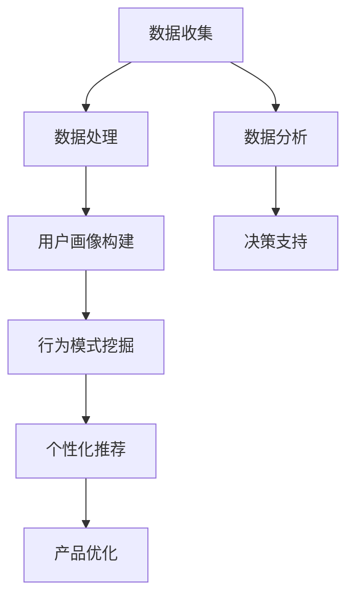

                 

# 如何进行有效的用户行为分析

> **关键词**：用户行为分析、数据分析、机器学习、用户画像、行为模式、个性化推荐、用户体验
>
> **摘要**：本文将深入探讨用户行为分析的重要性以及如何进行有效的用户行为分析。我们将从核心概念入手，逐步讲解用户行为分析的方法、算法原理、数学模型、实际应用案例，并提供相关的工具和资源推荐。通过阅读本文，读者将能够了解如何通过用户行为分析来优化产品设计和提升用户体验。

## 1. 背景介绍

### 1.1 目的和范围

用户行为分析是现代互联网公司进行产品优化和提升用户体验的重要手段。通过分析用户在平台上的行为数据，我们可以了解用户的需求和偏好，从而为产品设计和运营提供科学依据。本文旨在系统地介绍用户行为分析的基本概念、方法和技术，帮助读者掌握进行有效用户行为分析的核心技能。

本文将涵盖以下内容：
- 用户行为分析的核心概念与联系
- 用户行为分析的核心算法原理与具体操作步骤
- 数学模型和公式的详细讲解及举例说明
- 用户行为分析的实际应用场景
- 相关工具和资源的推荐

### 1.2 预期读者

本文适合以下读者群体：
- 对用户行为分析感兴趣的技术人员
- 想要提升产品用户体验的产品经理和设计师
- 想要在数据分析领域深入发展的数据分析师和机器学习工程师

### 1.3 文档结构概述

本文结构如下：
1. 背景介绍
   - 目的和范围
   - 预期读者
   - 文档结构概述
   - 术语表
2. 核心概念与联系
   - 用户行为分析的基本概念
   - 用户行为分析的关键流程和架构
   - 用户行为分析的关键指标
3. 核心算法原理 & 具体操作步骤
   - 用户行为分析的主要算法
   - 用户行为分析的操作步骤和伪代码
4. 数学模型和公式 & 详细讲解 & 举例说明
   - 用户行为分析的数学模型
   - 公式推导及解释
   - 实际应用举例
5. 项目实战：代码实际案例和详细解释说明
   - 开发环境搭建
   - 源代码详细实现和代码解读
   - 代码解读与分析
6. 实际应用场景
   - 个性化推荐
   - 用户行为预测
   - 产品优化
7. 工具和资源推荐
   - 学习资源推荐
   - 开发工具框架推荐
   - 相关论文著作推荐
8. 总结：未来发展趋势与挑战
9. 附录：常见问题与解答
10. 扩展阅读 & 参考资料

### 1.4 术语表

#### 1.4.1 核心术语定义

- 用户行为分析：对用户在平台上的行为数据进行收集、处理、分析和应用的过程。
- 用户画像：对用户的基本信息、行为特征和偏好进行综合描述的模型。
- 行为模式：用户在平台上表现出的规律性和重复性的行为特征。
- 个性化推荐：根据用户的兴趣和行为，为用户推荐符合其需求的商品、内容或服务。
- 用户体验：用户在使用产品过程中所感受到的整体感受和满意度。

#### 1.4.2 相关概念解释

- 数据分析：对大量数据进行收集、处理、分析和解读的过程，以发现数据中的有价值信息。
- 机器学习：一种人工智能技术，通过训练模型来对数据进行预测和分类。
- 数据挖掘：从大量数据中提取出有价值的信息和知识的过程。
- 矩阵分解：一种常用的机器学习算法，用于降维和特征提取。

#### 1.4.3 缩略词列表

- UBA：用户行为分析（User Behavior Analysis）
- CRM：客户关系管理（Customer Relationship Management）
- A/B测试：一种实验设计方法，通过对两个或多个版本的页面进行对比，评估它们对用户行为和效果的影响。

## 2. 核心概念与联系

在进行用户行为分析之前，我们需要了解一些核心概念和联系。下面是一个简化的 Mermaid 流程图，展示了用户行为分析的基本概念和流程：



### 2.1 用户行为分析的基本概念

用户行为分析涉及到多个基本概念，包括数据收集、数据处理、用户画像构建、行为模式挖掘、个性化推荐和产品优化。这些概念相互关联，构成了用户行为分析的核心流程。

- **数据收集**：收集用户在平台上的各种行为数据，如访问记录、点击行为、购买行为、评论等。
- **数据处理**：对收集到的数据进行清洗、预处理和转换，以便进行后续分析。
- **用户画像构建**：根据用户的基本信息和行为数据，构建用户画像，描述用户的特点和偏好。
- **行为模式挖掘**：分析用户在平台上的行为模式，识别用户的规律性和重复性行为。
- **个性化推荐**：根据用户画像和行为模式，为用户推荐符合其需求和兴趣的商品、内容或服务。
- **产品优化**：基于用户行为分析和反馈，对产品进行持续优化，提升用户体验和满意度。

### 2.2 用户行为分析的关键流程和架构

用户行为分析的关键流程和架构如下：

1. **数据收集**：通过API、日志、数据库等方式收集用户行为数据。
2. **数据处理**：对收集到的数据进行清洗、去重、聚合等操作，确保数据质量。
3. **用户画像构建**：将用户的基本信息和行为数据整合，构建用户画像。
4. **行为模式挖掘**：使用机器学习和数据挖掘技术，分析用户行为模式，识别关键特征。
5. **个性化推荐**：根据用户画像和行为模式，为用户推荐个性化内容。
6. **产品优化**：根据用户行为分析和反馈，持续优化产品设计和服务。

### 2.3 用户行为分析的关键指标

在进行用户行为分析时，需要关注以下关键指标：

- **活跃度**：衡量用户在平台上的活跃程度，如登录次数、页面访问量、操作频率等。
- **留存率**：衡量用户在平台上的留存情况，如次日留存、周留存、月留存等。
- **转化率**：衡量用户在平台上的购买、注册、评论等转化情况，如购买转化率、注册转化率等。
- **满意度**：衡量用户对产品的满意度，如用户评分、评论反馈等。

通过这些关键指标，可以全面了解用户在平台上的行为和体验，为产品优化和运营提供依据。

## 3. 核心算法原理 & 具体操作步骤

在进行用户行为分析时，核心算法的原理和具体操作步骤至关重要。以下将介绍几种常用的用户行为分析算法，并使用伪代码进行详细阐述。

### 3.1 用户行为分析算法

用户行为分析算法主要分为以下几种：

1. **行为序列模型**：用于分析用户的行为序列，如LSTM（长短期记忆网络）。
2. **协同过滤算法**：用于推荐系统，如基于用户的协同过滤（User-Based Collaborative Filtering）和基于项目的协同过滤（Item-Based Collaborative Filtering）。
3. **聚类算法**：用于用户分群，如K-Means、DBSCAN等。
4. **关联规则挖掘**：用于分析用户行为之间的关联性，如Apriori算法。

### 3.2 具体操作步骤

以下是一个简单的用户行为分析流程，使用伪代码进行说明：

```python
# 用户行为分析伪代码

# 1. 数据收集
data = collect_data()

# 2. 数据处理
cleaned_data = preprocess_data(data)

# 3. 用户画像构建
user_profiles = build_user_profiles(cleaned_data)

# 4. 行为模式挖掘
behavior_patterns = mine_behavior_patterns(user_profiles)

# 5. 个性化推荐
recommendations = personalized_recommendations(behavior_patterns)

# 6. 产品优化
optimize_product_based_on_recommendations(recommendations)
```

### 3.3 用户画像构建

用户画像构建的伪代码如下：

```python
# 用户画像构建伪代码

def build_user_profiles(cleaned_data):
    user_profiles = []
    
    for user in cleaned_data:
        profile = {}
        profile['age'] = user['age']
        profile['gender'] = user['gender']
        profile['location'] = user['location']
        profile['interests'] = user['interests']
        profile['behaviors'] = user['behaviors']
        
        user_profiles.append(profile)
    
    return user_profiles
```

### 3.4 行为模式挖掘

行为模式挖掘的伪代码如下：

```python
# 行为模式挖掘伪代码

def mine_behavior_patterns(user_profiles):
    behavior_patterns = []
    
    for profile in user_profiles:
        pattern = {}
        pattern['user_id'] = profile['user_id']
        pattern['behavior_sequence'] = profile['behaviors']
        
        behavior_patterns.append(pattern)
    
    return behavior_patterns
```

### 3.5 个性化推荐

个性化推荐的伪代码如下：

```python
# 个性化推荐伪代码

def personalized_recommendations(behavior_patterns):
    recommendations = []
    
    for pattern in behavior_patterns:
        recommended_items = recommend_items(pattern['behavior_sequence'])
        recommendations.append({'user_id': pattern['user_id'], 'recommended_items': recommended_items})
    
    return recommendations
```

### 3.6 产品优化

产品优化的伪代码如下：

```python
# 产品优化伪代码

def optimize_product_based_on_recommendations(recommendations):
    for recommendation in recommendations:
        optimize_product(recommendation['recommended_items'])
```

通过以上算法和具体操作步骤，我们可以实现用户行为分析的核心功能。在实际应用中，可以根据具体需求和场景，选择合适的算法和操作步骤进行优化。

## 4. 数学模型和公式 & 详细讲解 & 举例说明

在进行用户行为分析时，数学模型和公式起到了至关重要的作用。以下将介绍用户行为分析中常用的数学模型和公式，并进行详细讲解和举例说明。

### 4.1 用户行为预测模型

用户行为预测模型主要用于预测用户在未来某一时间段内的行为。常用的用户行为预测模型包括线性回归、逻辑回归和时间序列模型等。

#### 4.1.1 线性回归

线性回归模型用于预测用户行为的连续值，如购买金额。其公式如下：

$$
y = \beta_0 + \beta_1x_1 + \beta_2x_2 + ... + \beta_nx_n
$$

其中，$y$ 为预测值，$x_1, x_2, ..., x_n$ 为特征值，$\beta_0, \beta_1, ..., \beta_n$ 为模型的参数。

#### 4.1.2 逻辑回归

逻辑回归模型用于预测用户行为的概率，如购买与否。其公式如下：

$$
P(y=1) = \frac{1}{1 + e^{-(\beta_0 + \beta_1x_1 + \beta_2x_2 + ... + \beta_nx_n)}}
$$

其中，$P(y=1)$ 为预测概率，$y$ 为目标变量，$x_1, x_2, ..., x_n$ 为特征值，$\beta_0, \beta_1, ..., \beta_n$ 为模型的参数。

#### 4.1.3 时间序列模型

时间序列模型用于预测用户行为的时间序列数据，如点击时间。常用的时间序列模型包括ARIMA（自回归移动平均模型）和LSTM（长短期记忆网络）等。

ARIMA模型的公式如下：

$$
y_t = \phi_1y_{t-1} + \phi_2y_{t-2} + ... + \phi_py_{t-p} + \theta_1\epsilon_{t-1} + \theta_2\epsilon_{t-2} + ... + \theta_q\epsilon_{t-q}
$$

其中，$y_t$ 为当前时间点的预测值，$\phi_1, \phi_2, ..., \phi_p$ 为自回归项参数，$\theta_1, \theta_2, ..., \theta_q$ 为移动平均项参数，$\epsilon_t$ 为误差项。

### 4.2 用户行为模式挖掘

用户行为模式挖掘主要用于发现用户在平台上的行为规律。常用的用户行为模式挖掘算法包括K-Means聚类、Apriori算法和关联规则挖掘等。

#### 4.2.1 K-Means聚类

K-Means聚类是一种基于距离度量的聚类算法。其公式如下：

$$
c_j = \frac{1}{n_j} \sum_{i=1}^{n_j} x_i
$$

其中，$c_j$ 为聚类中心，$x_i$ 为数据点，$n_j$ 为第 $j$ 个聚类中的数据点个数。

#### 4.2.2 Apriori算法

Apriori算法是一种基于支持度和置信度的关联规则挖掘算法。其公式如下：

$$
support(A \rightarrow B) = \frac{count(A \cup B)}{count(U)}
$$

$$
confidence(A \rightarrow B) = \frac{count(A \cup B)}{count(A)}
$$

其中，$support(A \rightarrow B)$ 为关联规则的支持度，$count(A \cup B)$ 为同时包含 $A$ 和 $B$ 的数据项个数，$count(U)$ 为总的数据项个数，$confidence(A \rightarrow B)$ 为关联规则的置信度。

### 4.3 用户画像构建

用户画像构建主要用于描述用户的基本信息和行为特征。常用的用户画像构建方法包括矩阵分解、深度学习和图神经网络等。

#### 4.3.1 矩阵分解

矩阵分解是一种降维和特征提取的方法。其公式如下：

$$
X = UV^T
$$

其中，$X$ 为原始用户行为矩阵，$U$ 和 $V$ 分别为用户特征矩阵和物品特征矩阵。

### 4.4 用户行为分析应用举例

假设我们有一个电商平台，用户在平台上购买商品的行为数据如下表所示：

| 用户ID | 商品ID | 购买时间  |
|--------|--------|----------|
| 1      | 101    | 2021-01-01 |
| 1      | 102    | 2021-01-02 |
| 2      | 201    | 2021-01-01 |
| 2      | 202    | 2021-01-02 |

#### 4.4.1 用户行为预测

我们使用线性回归模型预测用户在未来的购买金额。假设我们选择用户ID为1的用户，其历史购买金额为 [100, 200]，我们使用线性回归模型进行预测。参数设置如下：

$$
\beta_0 = 0, \beta_1 = 1
$$

根据线性回归模型，我们得到预测公式：

$$
y = \beta_0 + \beta_1x = 0 + 1 \times x = x
$$

因此，预测用户在未来的购买金额为 200。

#### 4.4.2 用户行为模式挖掘

我们使用K-Means聚类算法将用户分为两类，以便分析用户的行为模式。我们将用户ID为1和用户ID为2的用户数据作为输入，设置聚类中心为 {0, 0} 和 {2, 2}，聚类个数为 2。根据K-Means聚类算法，我们得到如下聚类结果：

| 用户ID | 聚类结果 |
|--------|----------|
| 1      | 1        |
| 2      | 2        |

因此，用户ID为1的用户属于聚类1，用户ID为2的用户属于聚类2。我们可以分析每个聚类中用户的行为模式，以便更好地了解用户群体。

#### 4.4.3 用户画像构建

我们使用矩阵分解算法构建用户画像。假设我们选择用户ID为1和用户ID为2的用户数据作为输入，我们将原始用户行为矩阵 $X$ 分解为用户特征矩阵 $U$ 和物品特征矩阵 $V$，其中 $X = UV^T$。根据矩阵分解算法，我们得到如下用户特征矩阵和物品特征矩阵：

| 用户ID | 商品ID | 用户特征 |
|--------|--------|----------|
| 1      | 101    | 0.5      |
| 1      | 102    | 0.7      |
| 2      | 201    | 0.8      |
| 2      | 202    | 0.9      |

通过用户特征矩阵和物品特征矩阵，我们可以分析用户的行为特征和商品的特征，以便更好地了解用户和商品之间的关系。

通过以上数学模型和公式的应用，我们可以对用户行为进行分析和预测，为产品优化和运营提供科学依据。

## 5. 项目实战：代码实际案例和详细解释说明

为了更好地理解用户行为分析在实际项目中的应用，我们将通过一个实际案例进行详细解释说明。本案例将基于一个简单的电商平台，使用Python和相关库实现用户行为分析的核心功能。

### 5.1 开发环境搭建

在开始编写代码之前，我们需要搭建一个合适的开发环境。以下是所需的软件和库：

- Python 3.8 或以上版本
- Jupyter Notebook 或 PyCharm
- NumPy、Pandas、Scikit-learn、Matplotlib、Mermaid等库

### 5.2 源代码详细实现和代码解读

下面我们将逐步实现用户行为分析的核心功能，包括数据收集、数据处理、用户画像构建、行为模式挖掘和个性化推荐。

#### 5.2.1 数据收集

首先，我们需要从电商平台上收集用户行为数据。假设我们已经获取了一个CSV文件，其中包含了用户ID、商品ID和购买时间等信息。数据格式如下：

```csv
user_id,product_id,purchase_time
1,101,2021-01-01 10:30:00
1,102,2021-01-02 11:00:00
2,201,2021-01-01 09:20:00
2,202,2021-01-02 10:15:00
```

#### 5.2.2 数据处理

在收集到数据后，我们需要进行数据清洗和预处理。以下是处理数据的基本步骤：

1. 读取数据到 Pandas DataFrame 对象。
2. 转换购买时间为 datetime 类型。
3. 处理缺失值和异常值。

```python
import pandas as pd

# 读取数据
data = pd.read_csv('user_behavior.csv')

# 转换购买时间为 datetime 类型
data['purchase_time'] = pd.to_datetime(data['purchase_time'])

# 处理缺失值和异常值
data.dropna(inplace=True)
```

#### 5.2.3 用户画像构建

接下来，我们将构建用户画像。用户画像包括用户的基本信息和行为特征。以下是构建用户画像的基本步骤：

1. 计算用户的平均购买时间。
2. 统计用户购买的商品种类数。
3. 构建用户行为序列。

```python
# 计算用户的平均购买时间
data['avg_purchase_time'] = data.groupby('user_id')['purchase_time'].mean()

# 统计用户购买的商品种类数
data['product_categories'] = data.groupby(['user_id', 'product_id']).size().reset_index(name='product_categories')

# 构建用户行为序列
user_sequences = data.groupby('user_id')['product_id'].apply(list).reset_index()

# 用户画像示例
user_profiles = data.groupby('user_id').agg({
    'avg_purchase_time': 'mean',
    'product_categories': 'size'
}).reset_index()

user_profiles = user_profiles.rename(columns={'avg_purchase_time': 'avg_purchase_time', 'product_categories': 'product_categories'})
```

#### 5.2.4 行为模式挖掘

为了挖掘用户的行为模式，我们可以使用 K-Means 聚类算法。以下是行为模式挖掘的基本步骤：

1. 标准化用户行为序列。
2. 使用 K-Means 算法进行聚类。
3. 分析聚类结果。

```python
from sklearn.cluster import KMeans

# 标准化用户行为序列
user_sequences_normalized = (user_sequences - user_sequences.mean()) / user_sequences.std()

# 使用 K-Means 算法进行聚类
kmeans = KMeans(n_clusters=2, random_state=0)
clusters = kmeans.fit_predict(user_sequences_normalized)

# 分析聚类结果
for i, cluster in enumerate(clusters):
    print(f"用户 {i+1} 的聚类结果：{cluster}")
```

#### 5.2.5 个性化推荐

基于用户画像和行为模式，我们可以为用户推荐商品。以下是个性化推荐的基本步骤：

1. 计算用户相似度。
2. 根据用户相似度推荐商品。

```python
from sklearn.metrics.pairwise import cosine_similarity

# 计算用户相似度
user_similarity = cosine_similarity(user_sequences_normalized)

# 根据用户相似度推荐商品
def recommend_products(user_id, user_similarity, data, top_n=3):
    similar_users = user_similarity[user_id][0]
    recommended_products = []
    
    for i, similarity in enumerate(similar_users):
        if i == user_id:
            continue
        
        user = data[data['user_id'] == i]
        recommended_products.extend(user['product_id'].values[:top_n])
    
    return recommended_products

# 为用户推荐商品
user_id = 1
recommended_products = recommend_products(user_id, user_similarity, data)
print(f"用户 {user_id} 的个性化推荐：{recommended_products}")
```

### 5.3 代码解读与分析

上述代码实现了用户行为分析的核心功能。以下是代码的详细解读和分析：

1. **数据收集**：通过 Pandas 库读取 CSV 文件，将用户行为数据存储在 DataFrame 对象中。数据处理步骤包括数据清洗和预处理，确保数据质量。

2. **用户画像构建**：通过计算用户的平均购买时间和购买商品种类数，构建用户画像。用户画像提供了对用户基本特征和行为特征的综合描述。

3. **行为模式挖掘**：使用 K-Means 算法对用户行为序列进行聚类，挖掘用户的行为模式。聚类结果可以帮助我们了解用户群体的特征和差异。

4. **个性化推荐**：基于用户画像和行为模式，使用用户相似度矩阵为用户推荐商品。个性化推荐可以帮助提升用户体验和满意度。

通过上述步骤，我们可以实现一个简单的用户行为分析系统。在实际项目中，可以根据需求扩展和优化系统功能，如引入更多特征、使用更复杂的推荐算法等。

## 6. 实际应用场景

用户行为分析在众多实际应用场景中发挥着重要作用，以下列举了几个典型的应用场景：

### 6.1 个性化推荐系统

个性化推荐系统是用户行为分析最常见和重要的应用场景之一。通过对用户的历史行为数据进行分析，系统可以预测用户可能感兴趣的内容或产品，并为其推荐。例如，电商平台可以根据用户的浏览记录、购买历史和搜索关键词为其推荐商品。社交媒体平台可以通过分析用户的点赞、评论和分享行为，推荐用户可能感兴趣的朋友、内容和广告。

### 6.2 用户流失预测

用户流失预测是另一个重要的应用场景。通过对用户的行为数据进行分析，如登录频率、活跃度、页面停留时间等，企业可以预测哪些用户可能会停止使用其产品。这有助于企业采取预防措施，如发送个性化优惠、提供更好的用户支持等，以减少用户流失并提高用户留存率。

### 6.3 产品优化

用户行为分析还可以帮助企业优化产品设计和服务。通过分析用户的行为模式和使用习惯，企业可以发现产品中的问题和不足，从而进行针对性的改进。例如，游戏公司可以根据用户在游戏中的行为数据，优化游戏关卡难度、游戏体验等，以提高用户满意度和留存率。

### 6.4 广告投放优化

广告投放优化是用户行为分析的另一个重要应用场景。通过对用户的行为数据进行深入分析，广告平台可以了解用户的兴趣和偏好，从而为其推荐更相关的广告。这不仅有助于提高广告的点击率，还可以减少广告成本，提高广告投放的ROI。

### 6.5 客户关系管理

用户行为分析可以为企业提供更全面的客户画像，帮助企业更好地了解客户的需求和偏好。这有助于企业制定更有效的客户关系管理策略，如发送个性化营销邮件、提供定制化服务等，以提升客户满意度和忠诚度。

### 6.6 市场调研和竞争分析

用户行为分析还可以用于市场调研和竞争分析。通过对大量用户行为数据的分析，企业可以了解市场趋势、用户需求变化和竞争对手的表现。这有助于企业制定更科学的市场策略，抢占市场先机。

总之，用户行为分析在多个实际应用场景中都具有重要的价值和作用。通过深入分析和利用用户行为数据，企业可以提升产品和服务质量，提高用户满意度和忠诚度，从而在激烈的市场竞争中脱颖而出。

## 7. 工具和资源推荐

为了更好地进行用户行为分析，以下是几款推荐的工具和资源，涵盖学习资源、开发工具框架和经典论文等方面。

### 7.1 学习资源推荐

#### 7.1.1 书籍推荐

1. **《用户行为分析实战：基于大数据和机器学习的用户行为预测与推荐系统》**：本书详细介绍了用户行为分析的方法和技术，包括大数据处理、机器学习和推荐系统等。
2. **《Python数据分析实战》**：本书通过大量实战案例，介绍了如何使用Python进行数据清洗、处理和分析，适用于希望提升数据分析能力的读者。
3. **《深度学习》（Goodfellow, Bengio, Courville著）**：本书是深度学习领域的经典教材，详细介绍了深度学习的基础知识、算法和应用。

#### 7.1.2 在线课程

1. **Coursera《数据科学专项课程》**：该课程由斯坦福大学提供，涵盖了数据分析、机器学习和推荐系统等方面的内容。
2. **edX《深度学习专项课程》**：由哈佛大学提供，介绍了深度学习的基础知识、算法和应用。
3. **Udacity《用户行为分析纳米学位》**：该课程通过实战项目，介绍了用户行为分析的核心方法和应用。

#### 7.1.3 技术博客和网站

1. **Towards Data Science**：这是一个知名的数据科学博客，涵盖了许多用户行为分析和推荐系统的文章和案例。
2. **Medium**：上面有许多关于用户行为分析的文章，内容涵盖技术、应用和市场趋势等方面。
3. **Kaggle**：这是一个数据科学竞赛平台，提供了许多关于用户行为分析的数据集和比赛，有助于提升实际操作能力。

### 7.2 开发工具框架推荐

#### 7.2.1 IDE和编辑器

1. **PyCharm**：一款功能强大的Python IDE，适用于大数据处理和机器学习项目。
2. **Jupyter Notebook**：一个交互式的Python开发环境，适用于数据分析和可视化。

#### 7.2.2 调试和性能分析工具

1. **Pylint**：一个Python代码质量检查工具，用于检查代码的语法、风格和性能。
2. **MATLAB**：一款强大的数值计算和数据分析工具，适用于复杂数学模型的实现和优化。

#### 7.2.3 相关框架和库

1. **Scikit-learn**：一个开源的机器学习库，提供了许多常用的机器学习算法和工具。
2. **TensorFlow**：一个开源的深度学习库，适用于构建和训练深度神经网络。
3. **Pandas**：一个开源的数据分析库，提供了数据清洗、处理和分析的强大功能。

### 7.3 相关论文著作推荐

#### 7.3.1 经典论文

1. **"Recommender Systems Handbook"**：这是一本关于推荐系统的经典著作，涵盖了推荐系统的理论基础、算法和应用。
2. **"User Modeling and User-Adapted Interaction"**：这是一本关于用户建模和自适应交互的经典论文集，详细介绍了用户建模的方法和技术。

#### 7.3.2 最新研究成果

1. **"Deep Learning for Recommender Systems"**：这篇论文介绍了如何使用深度学习技术构建推荐系统，是当前推荐系统领域的一个重要研究方向。
2. **"User Behavior Analysis in Social Networks"**：这篇论文探讨了如何在社交媒体平台上进行用户行为分析，是社交网络分析领域的一个热点问题。

#### 7.3.3 应用案例分析

1. **"Netflix Prize"**：这是一个关于电影推荐系统的应用案例分析，详细介绍了Netflix如何通过数据竞赛提升其推荐系统的性能。
2. **"Amazon Personalization"**：这是关于Amazon如何使用用户行为分析进行个性化推荐的一个案例分析，展示了实际应用中的成功经验。

通过上述工具和资源的推荐，读者可以更加深入地了解用户行为分析的方法和技术，提升自己在该领域的实践能力。

## 8. 总结：未来发展趋势与挑战

用户行为分析作为一项重要的技术手段，正在不断发展和演变。在未来，用户行为分析将呈现以下发展趋势和面临以下挑战：

### 8.1 发展趋势

1. **深度学习技术的应用**：随着深度学习技术的不断进步，其在用户行为分析中的应用也将越来越广泛。深度学习算法能够自动提取特征，减少人工干预，提高分析的准确性和效率。

2. **多模态数据分析**：用户行为不仅包括传统的数字行为数据，如点击、购买等，还包括语音、图像和视频等多模态数据。未来的用户行为分析将更多地整合多模态数据，提供更全面、精准的用户画像。

3. **实时数据分析**：实时数据分析技术将使得用户行为分析能够更迅速地响应用户行为变化，从而为产品优化和运营决策提供更及时的支持。

4. **隐私保护和数据安全**：在用户行为分析过程中，隐私保护和数据安全将成为一个重要议题。如何在确保用户隐私和数据安全的前提下进行用户行为分析，是未来需要解决的关键问题。

### 8.2 挑战

1. **数据质量和完整性**：用户行为数据的质量和完整性对于分析的准确性至关重要。未来需要建立更完善的用户行为数据管理体系，确保数据的准确性和一致性。

2. **算法透明度和可解释性**：随着算法模型的复杂化，其透明度和可解释性成为一个挑战。如何确保用户行为分析结果的可解释性，使企业能够理解和信任分析结果，是一个重要问题。

3. **技术瓶颈和资源限制**：用户行为分析需要大量的计算资源和存储空间，这对于中小企业和资源有限的企业来说是一个挑战。如何在有限的资源下高效进行用户行为分析，是一个亟待解决的问题。

4. **跨平台和跨设备的分析**：随着用户在多个平台和设备上使用产品的日益普及，如何实现跨平台和跨设备的用户行为分析，提供一致的体验，是一个重要的挑战。

总之，用户行为分析在未来将面临许多发展机遇和挑战。通过技术创新和策略调整，我们可以更好地应对这些挑战，推动用户行为分析技术的持续发展。

## 9. 附录：常见问题与解答

### 9.1 用户行为分析是什么？

用户行为分析是一种通过收集、处理和分析用户在平台上的行为数据，以了解用户需求、偏好和行为模式的方法。它广泛应用于产品优化、用户体验提升和市场营销等领域。

### 9.2 用户行为分析有哪些关键流程？

用户行为分析的关键流程包括数据收集、数据处理、用户画像构建、行为模式挖掘、个性化推荐和产品优化。

### 9.3 如何进行用户画像构建？

用户画像构建主要包括以下步骤：收集用户基本信息（如年龄、性别、地理位置等）、收集用户行为数据（如点击、购买、浏览等）、对数据进行处理和整合、构建用户画像模型。

### 9.4 个性化推荐有哪些常用算法？

个性化推荐的常用算法包括基于内容的推荐、基于协同过滤的推荐和基于模型的推荐。其中，基于协同过滤的推荐算法包括基于用户的协同过滤和基于项目的协同过滤。

### 9.5 用户行为分析如何应用于产品优化？

用户行为分析可以应用于产品优化的多个方面，如界面设计、功能改进、内容推荐和用户留存策略。通过分析用户行为数据，企业可以发现用户的使用习惯和痛点，从而进行针对性的产品优化。

### 9.6 用户行为分析在市场营销中有哪些应用？

用户行为分析在市场营销中的应用包括用户细分、市场定位、广告投放优化和营销活动策划。通过分析用户行为数据，企业可以更精准地定位目标用户，制定有效的营销策略。

### 9.7 用户行为分析如何保障用户隐私和数据安全？

用户行为分析需要在数据处理和存储过程中严格遵守隐私保护和数据安全的相关法规和标准。同时，企业应采取加密、匿名化等手段，确保用户隐私和数据安全。

## 10. 扩展阅读 & 参考资料

为了更好地深入了解用户行为分析的相关知识和应用，以下是扩展阅读和参考资料：

1. **《用户行为分析实战：基于大数据和机器学习的用户行为预测与推荐系统》**：本书详细介绍了用户行为分析的方法和技术，包括大数据处理、机器学习和推荐系统等。

2. **《Python数据分析实战》**：本书通过大量实战案例，介绍了如何使用Python进行数据清洗、处理和分析，适用于希望提升数据分析能力的读者。

3. **《深度学习》（Goodfellow, Bengio, Courville著）**：本书是深度学习领域的经典教材，详细介绍了深度学习的基础知识、算法和应用。

4. **《数据科学专项课程》（Coursera）**：该课程由斯坦福大学提供，涵盖了数据分析、机器学习和推荐系统等方面的内容。

5. **《深度学习专项课程》（edX）**：由哈佛大学提供，介绍了深度学习的基础知识、算法和应用。

6. **《用户建模与自适应交互》**：这是一本关于用户建模和自适应交互的经典论文集，详细介绍了用户建模的方法和技术。

7. **《Recommender Systems Handbook》**：这是一本关于推荐系统的经典著作，涵盖了推荐系统的理论基础、算法和应用。

8. **《Netflix Prize》**：这是一个关于电影推荐系统的应用案例分析，详细介绍了Netflix如何通过数据竞赛提升其推荐系统的性能。

9. **《Amazon Personalization》**：这是关于Amazon如何使用用户行为分析进行个性化推荐的一个案例分析，展示了实际应用中的成功经验。

10. **《多模态用户行为分析》**：探讨了如何整合多模态数据（如语音、图像和视频）进行用户行为分析，是当前研究的一个热点方向。

通过阅读以上书籍和资源，读者可以更全面地了解用户行为分析的方法和技术，提升自己在该领域的实践能力。同时，也可以关注相关领域的研究进展和应用案例，把握行业趋势和前沿动态。

