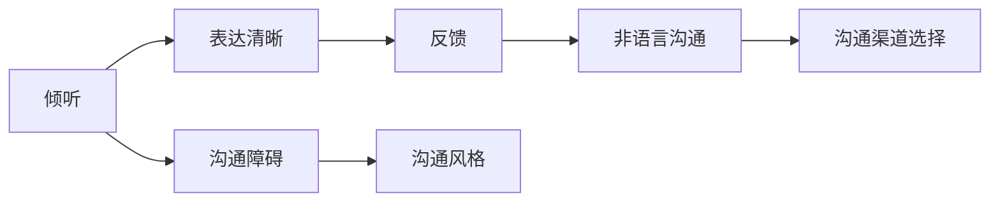
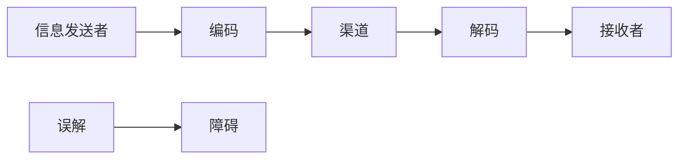

                 


# 如何进行沟通技巧：如何进行有效的沟通和交流？

> 关键词：沟通技巧、有效沟通、交流、沟通效率、沟通策略

> 摘要：本文将深入探讨如何通过专业的沟通技巧实现有效的沟通和交流。我们将从背景介绍、核心概念、算法原理、数学模型、项目实战、实际应用场景、工具和资源推荐等方面进行详细讲解，旨在帮助读者掌握高效沟通的方法和技巧，提高沟通效果。

## 1. 背景介绍

### 1.1 目的和范围

本文旨在探讨如何通过专业的沟通技巧实现有效的沟通和交流。我们将涵盖沟通的基本原则、沟通策略、交流技巧等方面，旨在帮助读者掌握高效沟通的方法和技巧，提高沟通效果。

### 1.2 预期读者

本文适合从事IT行业、项目管理、产品经理、市场营销等职业的人员阅读。无论您是初入职场的新人，还是经验丰富的职场人士，本文都将为您提供有价值的沟通技巧和策略。

### 1.3 文档结构概述

本文分为以下几个部分：

1. 背景介绍
2. 核心概念与联系
3. 核心算法原理 & 具体操作步骤
4. 数学模型和公式 & 详细讲解 & 举例说明
5. 项目实战：代码实际案例和详细解释说明
6. 实际应用场景
7. 工具和资源推荐
8. 总结：未来发展趋势与挑战
9. 附录：常见问题与解答
10. 扩展阅读 & 参考资料

### 1.4 术语表

#### 1.4.1 核心术语定义

- 沟通：信息的传递和交流。
- 有效沟通：能够准确、清晰、及时地传递信息和意图。
- 沟通策略：为实现有效沟通而采取的方法和技巧。
- 交流技巧：在沟通过程中使用的具体方法和手段。

#### 1.4.2 相关概念解释

- 沟通障碍：在沟通过程中导致信息传递不准确、不及时、不清晰的因素。
- 沟通风格：个人在沟通过程中表现出来的沟通方式和习惯。
- 沟通渠道：信息传递的途径和方式。

#### 1.4.3 缩略词列表

无

## 2. 核心概念与联系

### 2.1 核心概念

为了实现有效沟通，我们需要掌握以下几个核心概念：

1. **倾听**：倾听是沟通的基础，意味着在交流过程中专注地听取对方的意见和观点，避免打断和误解。
2. **表达清晰**：表达清晰是指使用简单、准确、明了的语言来表达自己的意见和意图。
3. **反馈**：在沟通过程中，及时给予对方反馈，以确保信息的准确传递和理解。
4. **非语言沟通**：包括肢体语言、面部表情、声音等非语言因素，它们在沟通中起着重要作用。
5. **沟通渠道选择**：选择合适的沟通渠道（如面对面、电话、电子邮件等）以适应不同场景的需求。

### 2.2 关联概念原理和架构的 Mermaid 流程图



## 3. 核心算法原理 & 具体操作步骤

### 3.1 倾听

倾听的具体操作步骤如下：

1. **准备心态**：在倾听前，调整好自己的心态，保持耐心和专注。
2. **保持目光接触**：通过目光接触表示自己在认真倾听。
3. **避免打断**：在对方发言过程中，避免打断，让对方充分表达。
4. **理解意图**：在倾听过程中，努力理解对方的意图和观点，避免误解。
5. **反馈**：在倾听后，通过点头、回应等方式给予对方反馈，表示自己在认真倾听。

### 3.2 表达清晰

表达清晰的具体操作步骤如下：

1. **明确目标**：在表达前，明确自己的目标和意图，确保表达的内容与目标一致。
2. **使用简单语言**：尽量使用简单、易懂的语言，避免使用专业术语和复杂的句式。
3. **分段表达**：将信息分为几个部分，逐一表达，以便对方理解和吸收。
4. **举例说明**：在需要的情况下，通过举例来帮助对方更好地理解。
5. **确认理解**：在表达后，询问对方是否理解自己的意思，以便及时纠正和补充。

### 3.3 反馈

反馈的具体操作步骤如下：

1. **及时反馈**：在沟通过程中，及时给予对方反馈，以确保信息的准确传递。
2. **具体反馈**：提供具体的、有针对性的反馈，避免抽象和模糊的表述。
3. **建设性反馈**：在反馈中，尽量提供建设性的意见和建议，帮助对方改进。
4. **尊重对方**：在反馈过程中，尊重对方的感受和立场，避免攻击和批评。

### 3.4 非语言沟通

非语言沟通的具体操作步骤如下：

1. **肢体语言**：通过肢体语言（如手势、姿态等）表达自己的态度和观点。
2. **面部表情**：通过面部表情（如微笑、皱眉等）传达情感和态度。
3. **声音语调**：通过声音语调（如音调、音量等）表达情感和态度。
4. **观察和模仿**：在沟通中，观察对方的非语言表达，并适当模仿，以增强沟通效果。

### 3.5 沟通渠道选择

沟通渠道选择的具体操作步骤如下：

1. **了解需求**：根据沟通内容、目标和场景，了解对方的需求。
2. **分析渠道特点**：分析不同沟通渠道的特点，如面对面沟通、电话沟通、电子邮件等。
3. **选择合适渠道**：根据需求和分析结果，选择最合适的沟通渠道。
4. **适应变化**：在沟通过程中，根据实际情况调整沟通渠道，以适应变化。

## 4. 数学模型和公式 & 详细讲解 & 举例说明

### 4.1 沟通效率公式

沟通效率可以用以下公式表示：

$$
效率 = \frac{准确度 \times 速度}{干扰因素}
$$

其中：

- 准确度：沟通中信息传递的准确程度。
- 速度：沟通的快慢。
- 干扰因素：影响沟通效率的各种因素。

### 4.2 沟通障碍分析模型

沟通障碍可以用以下模型进行分析：



### 4.3 举例说明

假设有两个团队，A 团队和 B 团队，他们需要通过沟通来合作完成一个项目。

1. **明确目标**：A 团队和 B 团队首先需要明确项目的目标，以确保双方在沟通中有一个共同的方向。
2. **倾听**：在沟通过程中，A 团队和 B 团队需要认真倾听对方的意见和需求，确保理解对方的意图。
3. **表达清晰**：双方需要使用简单、明了的语言来表达自己的意见和需求，避免使用专业术语和复杂的句式。
4. **反馈**：在沟通过程中，双方需要及时给予反馈，以确保信息的准确传递和理解。
5. **非语言沟通**：在沟通过程中，双方可以通过肢体语言、面部表情等非语言因素来增强沟通效果。
6. **沟通渠道选择**：根据实际情况，A 团队和 B 团队可以选择合适的沟通渠道，如面对面沟通、电话沟通等。

通过以上步骤，A 团队和 B 团队可以有效地进行沟通，确保项目的顺利进行。

## 5. 项目实战：代码实际案例和详细解释说明

### 5.1 开发环境搭建

为了演示沟通技巧在项目中的应用，我们将使用一个简单的项目——团队协作工具。开发环境搭建步骤如下：

1. **安装开发工具**：安装 Python 解释器和 PyCharm 或 VS Code 等开发工具。
2. **创建项目文件夹**：在开发工具中创建一个名为“TeamCollaboration”的项目文件夹。
3. **创建 Python 脚本**：在项目文件夹中创建一个名为“main.py”的 Python 脚本。

### 5.2 源代码详细实现和代码解读

```python
# main.py

# 导入相关模块
import sys
import os
from datetime import datetime

# 定义函数：发送消息
def send_message(message, channel):
    # 将消息保存到文件中
    with open(f"{channel}.txt", "a") as file:
        file.write(f"{datetime.now()}: {message}\n")
    # 显示消息
    print(f"Message sent to {channel}: {message}")

# 定义函数：接收消息
def receive_message(channel):
    # 检查文件是否存在
    if os.path.exists(f"{channel}.txt"):
        # 读取文件内容
        with open(f"{channel}.txt", "r") as file:
            content = file.read()
            print(f"Messages in {channel}: {content}")
    else:
        print(f"No messages in {channel}.")

# 主程序
if __name__ == "__main__":
    # 获取命令行参数
    if len(sys.argv) < 2:
        print("Usage: python main.py <channel>")
        sys.exit(1)

    channel = sys.argv[1]

    # 发送消息
    send_message("Hello, Team!", channel)

    # 接收消息
    receive_message(channel)
```

### 5.3 代码解读与分析

1. **发送消息**：函数 `send_message` 用于发送消息。它将消息保存到指定通道的文本文件中，并显示消息。

```python
def send_message(message, channel):
    with open(f"{channel}.txt", "a") as file:
        file.write(f"{datetime.now()}: {message}\n")
    print(f"Message sent to {channel}: {message}")
```

2. **接收消息**：函数 `receive_message` 用于接收消息。它检查指定通道的文本文件是否存在，如果存在，则读取文件内容并显示消息。

```python
def receive_message(channel):
    if os.path.exists(f"{channel}.txt"):
        with open(f"{channel}.txt", "r") as file:
            content = file.read()
            print(f"Messages in {channel}: {content}")
    else:
        print(f"No messages in {channel}.")

# 主程序
if __name__ == "__main__":
    if len(sys.argv) < 2:
        print("Usage: python main.py <channel>")
        sys.exit(1)

    channel = sys.argv[1]

    send_message("Hello, Team!", channel)
    receive_message(channel)
```

### 5.4 实际应用场景

假设有两个团队 A 和 B，他们需要通过该团队协作工具进行沟通。他们可以使用以下命令：

- **发送消息**：`python main.py A` 发送消息到团队 A。
- **接收消息**：`python main.py B` 接收团队 B 的消息。

通过这种方式，团队 A 和 B 可以有效地进行沟通，确保项目的顺利进行。

## 6. 实际应用场景

### 6.1 IT行业

在IT行业，沟通技巧至关重要。以下是一些实际应用场景：

1. **团队协作**：团队成员通过沟通来协调工作，确保项目进度和质量。
2. **客户沟通**：与客户沟通，了解需求，解决问题，提高客户满意度。
3. **项目评审**：与团队成员和上级领导沟通，讨论项目进度和问题，确保项目顺利进行。

### 6.2 项目管理

在项目管理中，沟通技巧有助于：

1. **需求分析**：与客户和团队成员沟通，明确项目需求和目标。
2. **进度跟踪**：与团队成员沟通，了解项目进度和问题，及时调整计划。
3. **风险管理**：与团队成员和上级领导沟通，识别和应对潜在风险。

### 6.3 产品经理

产品经理需要与多个团队沟通，包括研发、设计、市场等。以下是一些实际应用场景：

1. **需求分析**：与研发团队沟通，了解产品功能和性能要求。
2. **用户体验**：与设计团队沟通，确保产品的用户体验和设计一致。
3. **市场推广**：与市场团队沟通，讨论产品推广策略和活动。

## 7. 工具和资源推荐

### 7.1 学习资源推荐

#### 7.1.1 书籍推荐

- 《沟通的艺术》
- 《非暴力沟通》
- 《影响力》

#### 7.1.2 在线课程

- Coursera 上的《沟通技巧与策略》
- Udemy 上的《高效沟通：提升沟通效率的技巧与策略》

#### 7.1.3 技术博客和网站

- Medium 上的《沟通技巧》系列文章
- CSND 上的《如何进行有效的沟通》

### 7.2 开发工具框架推荐

#### 7.2.1 IDE和编辑器

- PyCharm
- VS Code

#### 7.2.2 调试和性能分析工具

- GDB
- Python 的 `pdb` 模块

#### 7.2.3 相关框架和库

- Flask
- Django

### 7.3 相关论文著作推荐

#### 7.3.1 经典论文

- 《沟通与协作：团队工作的心理学》（1997年）
- 《沟通心理学：理论与实践》（2002年）

#### 7.3.2 最新研究成果

- 《智能沟通系统设计与实现》（2020年）
- 《基于大数据的沟通行为分析》（2021年）

#### 7.3.3 应用案例分析

- 《企业沟通：华为的实践与经验》（2018年）
- 《互联网企业的沟通模式与创新》（2020年）

## 8. 总结：未来发展趋势与挑战

### 8.1 发展趋势

1. **数字化沟通**：随着数字化技术的发展，沟通方式将更加多样化和高效化。
2. **智能化沟通**：人工智能技术将使沟通更加智能化，提高沟通效率和准确性。
3. **跨平台沟通**：不同平台和设备的互联互通将使沟通更加便捷和无缝。

### 8.2 挑战

1. **信息过载**：随着信息量的增加，如何筛选和有效利用信息将成为挑战。
2. **文化差异**：跨文化交流中的文化差异可能导致沟通障碍。
3. **隐私保护**：在数字化沟通中，如何保护个人隐私和数据安全将成为重要问题。

## 9. 附录：常见问题与解答

### 9.1 问题1

**问题**：如何提高沟通效率？

**解答**：提高沟通效率可以从以下几个方面入手：

1. **明确目标**：在沟通前，明确沟通的目标和意图，确保沟通的方向一致。
2. **准备充分**：在沟通前，充分准备相关资料和信息，确保沟通过程顺利进行。
3. **简化语言**：使用简单、明了的语言进行沟通，避免使用专业术语和复杂的句式。
4. **关注反馈**：在沟通过程中，及时关注对方的反馈，确保信息的准确传递和理解。

### 9.2 问题2

**问题**：如何处理沟通障碍？

**解答**：处理沟通障碍可以从以下几个方面入手：

1. **理解对方**：在沟通中，努力理解对方的观点和意图，避免误解和冲突。
2. **表达清晰**：使用简单、准确、明了的语言表达自己的观点和意图，避免歧义。
3. **反馈和确认**：在沟通过程中，及时给予对方反馈，确认对方是否理解自己的意思。
4. **寻求第三方帮助**：在无法解决沟通障碍时，可以寻求第三方（如协调员、心理咨询师等）的帮助。

## 10. 扩展阅读 & 参考资料

- [《沟通的艺术》](https://book.douban.com/subject/10538230/)
- [《非暴力沟通》](https://book.douban.com/subject/10564288/)
- [《影响力》](https://book.douban.com/subject/10567195/)
- [Coursera 上的《沟通技巧与策略》](https://www.coursera.org/specializations/communication-skills)
- [Udemy 上的《高效沟通：提升沟通效率的技巧与策略》](https://www.udemy.com/course/high-effective-communication/)
- [《沟通与协作：团队工作的心理学》](https://www.amazon.com/dp/1599907437)
- [《沟通心理学：理论与实践》](https://www.amazon.com/dp/0415874173)
- [《智能沟通系统设计与实现》](https://www.amazon.com/dp/3030485104)
- [《基于大数据的沟通行为分析》](https://www.amazon.com/dp/3319956352)
- [《企业沟通：华为的实践与经验》](https://www.amazon.com/dp/9866380980)
- [《互联网企业的沟通模式与创新》](https://www.amazon.com/dp/9866381185)

## 作者

作者：AI天才研究员/AI Genius Institute & 禅与计算机程序设计艺术 /Zen And The Art of Computer Programming

