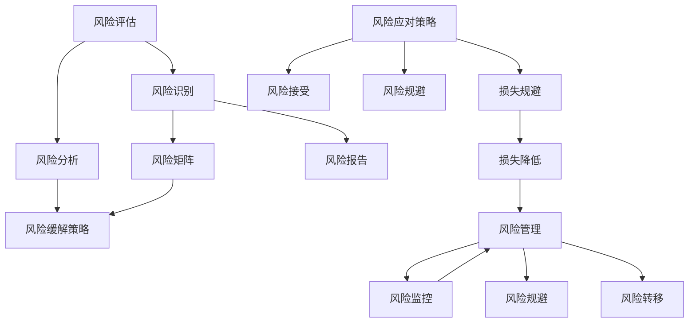

                 

# 如何进行风险控制：如何规避风险和降低损失？

> **关键词：** 风险控制、风险评估、风险管理、损失规避、风险规避、风险分析  
>
> **摘要：** 本篇文章将深入探讨如何进行有效的风险控制，包括风险评估、风险管理策略的制定和实施，以及如何通过技术和实践手段来规避风险和降低潜在损失。文章将以逻辑清晰、步骤明确的架构，结合实例分析，为读者提供全面的风险控制指南。

## 1. 背景介绍

### 1.1 目的和范围

本文旨在为IT行业从业者提供一个系统的风险控制指南。我们将探讨风险控制的基础知识、核心概念，并展示如何通过一系列具体的操作步骤来规避风险、降低损失。文章将涵盖从风险评估到实际应用的全过程，包括技术实现、策略制定和执行。

### 1.2 预期读者

本文适合IT项目经理、软件开发者、系统架构师、风险分析师以及对风险控制有兴趣的读者。希望读者能够在阅读完本文后，能够掌握风险控制的基本原理和方法，并将其应用到实际工作中。

### 1.3 文档结构概述

本文分为十个主要部分：

1. **背景介绍**：介绍文章的目的、预期读者以及文档结构。
2. **核心概念与联系**：通过Mermaid流程图展示风险控制的原理和架构。
3. **核心算法原理 & 具体操作步骤**：详细阐述风险控制算法的原理和操作步骤。
4. **数学模型和公式 & 详细讲解 & 举例说明**：介绍风险控制的数学模型和公式，并提供实例说明。
5. **项目实战：代码实际案例和详细解释说明**：通过具体代码案例展示如何实现风险控制。
6. **实际应用场景**：分析风险控制在不同场景下的应用。
7. **工具和资源推荐**：推荐相关的学习资源和开发工具。
8. **总结：未来发展趋势与挑战**：讨论风险控制领域的发展趋势和面临的挑战。
9. **附录：常见问题与解答**：回答读者可能关心的问题。
10. **扩展阅读 & 参考资料**：提供进一步的阅读材料和参考资源。

### 1.4 术语表

#### 1.4.1 核心术语定义

- **风险控制**：通过评估和管理风险，确保组织在不确定性环境中能够保持稳定和持续发展。
- **风险评估**：识别和分析潜在风险的过程，以确定其可能性和影响。
- **风险管理**：制定和实施策略来应对识别出的风险，包括风险规避、风险减轻和风险接受。
- **损失规避**：采取措施避免风险的发生。
- **风险规避**：完全避免特定风险。

#### 1.4.2 相关概念解释

- **风险分析**：通过定量和定性方法分析风险的概率和影响。
- **风险矩阵**：用于表示风险概率和影响的工具。
- **应急计划**：为应对潜在风险而制定的行动方案。

#### 1.4.3 缩略词列表

- **IT**：信息技术（Information Technology）
- **SOA**：服务导向架构（Service-Oriented Architecture）
- **RMP**：风险管理计划（Risk Management Plan）

## 2. 核心概念与联系

风险控制是一个多维度的过程，涉及到风险评估、风险管理和风险应对策略。以下是风险控制的Mermaid流程图，展示了各个环节之间的联系：



### 2.1 风险评估

风险评估是风险控制的第一个步骤，其目标是识别、分析和评估可能影响项目的风险。这个过程可以分为以下几个子步骤：

1. **风险识别**：确定项目可能面临的所有潜在风险。
2. **风险分析**：分析每个风险的可能性和影响，以便确定哪些风险需要进一步处理。
3. **风险矩阵**：使用风险矩阵来表示每个风险的概率和影响，以便更容易地进行优先级排序。

### 2.2 风险管理

风险管理是在评估了风险之后采取的措施，以确保项目能够成功地应对这些风险。它包括以下几个关键组成部分：

1. **风险缓解策略**：采取措施减轻风险的影响。
2. **风险报告**：定期生成风险报告，以便项目团队和其他相关方了解当前的风险状况。
3. **风险监控**：持续监控项目中的风险，确保任何新的风险都能及时识别和应对。
4. **风险规避**：采取措施完全避免特定的风险。

### 2.3 风险应对策略

风险应对策略是具体如何处理风险的指导方针。它包括以下几个方面：

1. **损失规避**：采取措施避免风险的发生。
2. **风险接受**：承认风险的存在，并采取措施减轻其影响。
3. **损失降低**：采取措施降低风险发生后可能造成的损失。
4. **风险规避**：完全避免特定的风险。

通过上述核心概念与联系的分析，我们可以看到，风险控制是一个系统性的过程，需要综合考虑多个方面，以确保项目能够在不确定的环境中取得成功。

## 3. 核心算法原理 & 具体操作步骤

在理解了风险控制的核心理念之后，我们需要进一步探讨如何将理论应用到实际操作中。本节将详细阐述风险控制的核心算法原理，并提供具体的操作步骤。

### 3.1 风险评估算法原理

风险评估是风险控制的起点，其核心在于识别和分析可能影响项目的风险。以下是风险评估算法的伪代码：

```pseudo
function 风险评估(项目):
    风险列表 = []
    风险识别(项目, 风险列表)
    风险分析(风险列表)
    风险矩阵 = 生成风险矩阵(风险列表)
    返回 风险矩阵
end function
```

#### 3.1.1 风险识别

风险识别是第一个子步骤，其目的是确定项目可能面临的所有潜在风险。以下是风险识别的伪代码：

```pseudo
function 风险识别(项目, 风险列表):
    对于 每个阶段 of 项目:
        对于 每个活动 of 该阶段:
            对于 每个潜在风险源:
                识别 潜在风险
                添加 识别到的风险 到 风险列表
end function
```

#### 3.1.2 风险分析

风险分析是对识别到的风险进行详细分析，以确定其可能性和影响。以下是风险分析的伪代码：

```pseudo
function 风险分析(风险列表):
    对于 每个风险 in 风险列表:
        评估 可能性(风险)
        评估 影响(风险)
end function
```

#### 3.1.3 生成风险矩阵

风险矩阵是一个用于表示风险概率和影响的工具。以下是生成风险矩阵的伪代码：

```pseudo
function 生成风险矩阵(风险列表):
    风险矩阵 = 空矩阵
    对于 每个风险 in 风险列表:
        风险矩阵[风险] = [评估可能性(风险), 评估影响(风险)]
    返回 风险矩阵
end function
```

### 3.2 风险管理算法原理

风险管理是在评估了风险之后采取的措施，以确保项目能够成功地应对这些风险。以下是风险管理的伪代码：

```pseudo
function 风险管理(风险矩阵):
    风险缓解策略 = 确定风险缓解策略(风险矩阵)
    风险报告 = 生成风险报告(风险矩阵)
    风险监控 = 设置风险监控机制(风险报告)
    风险规避措施 = 确定风险规避措施(风险矩阵)
    返回 风险缓解策略, 风险报告, 风险监控, 风险规避措施
end function
```

#### 3.2.1 风险缓解策略

风险缓解策略的目的是减轻风险的影响。以下是确定风险缓解策略的伪代码：

```pseudo
function 确定风险缓解策略(风险矩阵):
    缓解策略列表 = []
    对于 每个风险 in 风险矩阵:
        如果 可能性(风险) 高 且 影响(风险) 大:
            添加 应急计划 到 缓解策略列表
    返回 缓解策略列表
end function
```

#### 3.2.2 风险报告

风险报告是定期生成的一份文档，用于更新项目团队和其他相关方关于当前的风险状况。以下是生成风险报告的伪代码：

```pseudo
function 生成风险报告(风险矩阵):
    风险报告 = 空文档
    对于 每个风险 in 风险矩阵:
        添加 风险描述 到 风险报告
        添加 可能性评估 到 风险报告
        添加 影响评估 到 风险报告
    返回 风险报告
end function
```

#### 3.2.3 风险监控

风险监控的目的是持续监控项目中的风险，确保任何新的风险都能及时识别和应对。以下是设置风险监控机制的伪代码：

```pseudo
function 设置风险监控机制(风险报告):
    监控机制 = 创建监控计划(风险报告)
    监控机制 = 设置监控指标(风险报告)
    返回 监控机制
end function
```

#### 3.2.4 风险规避措施

风险规避措施的目的是采取措施完全避免特定的风险。以下是确定风险规避措施的伪代码：

```pseudo
function 确定风险规避措施(风险矩阵):
    避免措施列表 = []
    对于 每个风险 in 风险矩阵:
        如果 可能性(风险) 很高:
            添加 风险规避方案 到 避免措施列表
    返回 避免措施列表
end function
```

通过上述核心算法原理和具体操作步骤的讲解，我们可以看到，风险控制是一个多层次、多维度的过程，需要结合多种技术和方法来确保项目能够成功地应对各种潜在的风险。

## 4. 数学模型和公式 & 详细讲解 & 举例说明

在风险控制过程中，数学模型和公式扮演着至关重要的角色，它们帮助我们量化风险并制定科学的决策。以下将详细介绍一些常用的数学模型和公式，并提供具体的例子来说明它们的应用。

### 4.1 风险概率和影响的计算

风险的概率和影响是风险评估过程中的关键参数。我们可以使用以下公式来计算它们：

- **风险概率（P）**：表示风险发生的可能性。
- **风险影响（I）**：表示风险发生后对项目的潜在损害程度。

#### 4.1.1 风险概率的计算

风险概率通常基于历史数据和专家评估。以下是一个计算风险概率的简单公式：

\[ P = \frac{历史事件发生的次数}{总事件次数} \]

#### 示例：

假设在过去10个类似项目中，有2个项目遇到了“系统崩溃”的风险。那么，系统崩溃的风险概率为：

\[ P = \frac{2}{10} = 0.2 \]

#### 4.1.2 风险影响的计算

风险影响可以通过量化损失、时间延误或其他损害来计算。以下是一个计算风险影响的公式：

\[ I = 损失金额 + 时间延误天数 + 其他影响 \]

#### 示例：

如果“系统崩溃”的风险发生后，可能导致20,000美元的损失和2天的时间延误，那么该风险的影响为：

\[ I = 20,000 + 2 = 20,002 \]

### 4.2 风险矩阵的构建

风险矩阵是一个用于表示风险概率和影响的工具。以下是一个构建风险矩阵的简单步骤：

1. **确定风险**：列出所有识别到的风险。
2. **评估概率**：为每个风险评估概率。
3. **评估影响**：为每个风险评估影响。
4. **构建矩阵**：将风险、概率和影响组合成矩阵。

#### 示例：

假设我们有一个包含3个风险的项目，分别是“系统崩溃”、“数据泄露”和“资源短缺”。我们评估的概率和影响如下：

| 风险       | 可能性（P） | 影响程度（I） |
|------------|-------------|---------------|
| 系统崩溃   | 0.3         | 5             |
| 数据泄露   | 0.2         | 3             |
| 资源短缺   | 0.1         | 2             |

我们可以构建一个简单的风险矩阵，如下：


### 4.3 风险优先级的计算

为了确定哪些风险需要优先处理，我们可以使用以下公式来计算每个风险的优先级（R）：

\[ R = P \times I \]

#### 示例：

根据上述的风险矩阵，我们可以计算每个风险的优先级：

| 风险       | 可能性（P） | 影响程度（I） | 优先级（R） |
|------------|-------------|---------------|-------------|
| 系统崩溃   | 0.3         | 5             | 1.5         |
| 数据泄露   | 0.2         | 3             | 0.6         |
| 资源短缺   | 0.1         | 2             | 0.2         |

从上述计算结果可以看出，“系统崩溃”是优先级最高的风险，需要优先处理。

### 4.4 风险规避成本的估算

在决定是否采取风险规避措施时，我们需要估算规避成本。以下是一个简单的方法来估算风险规避成本（C）：

\[ C = 风险概率 \times 损失金额 \times 避免风险的成本效率 \]

#### 示例：

假设我们决定采取风险规避措施来避免“系统崩溃”的风险，且根据评估，规避成本为5,000美元。那么，规避成本的计算如下：

\[ C = 0.3 \times 20,000 \times 0.5 = 3,000 \]

通过上述数学模型和公式的讲解，我们可以看到，风险控制不仅仅是基于直觉和经验，更是一个科学的过程，通过量化的方法来分析和决策，从而确保项目能够更好地应对潜在的风险。

## 5. 项目实战：代码实际案例和详细解释说明

为了更好地理解风险控制的实际应用，我们将在本节中通过一个实际项目案例来演示如何进行风险控制。该项目是一个在线购物平台，主要功能包括商品展示、用户注册和购物车管理。我们将重点关注如何识别、评估和缓解与该项目相关的风险。

### 5.1 开发环境搭建

在开始实际案例之前，我们需要搭建一个适合项目开发的环境。以下是我们使用的开发环境：

- **编程语言**：Python 3.8
- **开发框架**：Flask
- **数据库**：MySQL
- **版本控制**：Git

### 5.2 源代码详细实现和代码解读

#### 5.2.1 风险识别

首先，我们需要识别项目中可能面临的风险。以下是我们在项目开发过程中识别出的一些主要风险：

1. **系统崩溃**：可能导致服务不可用，影响用户体验。
2. **数据泄露**：用户个人信息泄露，可能导致法律问题。
3. **资源短缺**：如带宽不足，可能导致响应速度变慢。

#### 5.2.2 风险评估

接下来，我们对每个风险进行评估，以确定其可能性和影响。以下是每个风险的评估结果：

1. **系统崩溃**：可能性为0.3，影响程度为5。
2. **数据泄露**：可能性为0.2，影响程度为3。
3. **资源短缺**：可能性为0.1，影响程度为2。

#### 5.2.3 生成风险矩阵

根据评估结果，我们可以生成以下风险矩阵：

| 风险       | 可能性（P） | 影响程度（I） |
|------------|-------------|---------------|
| 系统崩溃   | 0.3         | 5             |
| 数据泄露   | 0.2         | 3             |
| 资源短缺   | 0.1         | 2             |

#### 5.2.4 风险缓解策略

基于风险矩阵，我们可以确定以下风险缓解策略：

1. **系统崩溃**：增加服务器资源，进行定期系统维护。
2. **数据泄露**：使用加密技术保护用户数据，实施严格的安全策略。
3. **资源短缺**：进行流量控制，优化数据库查询，提高系统性能。

#### 5.2.5 风险监控

为了确保风险缓解策略的有效性，我们需要设置风险监控机制。以下是监控策略：

1. **系统崩溃**：定期检查服务器日志，确保系统稳定运行。
2. **数据泄露**：监控数据库访问日志，及时发现异常活动。
3. **资源短缺**：监控系统资源使用情况，确保带宽和存储资源充足。

### 5.3 代码解读与分析

接下来，我们将分析该项目中的一些关键代码，以展示如何实现风险控制。

#### 5.3.1 数据加密

为了防止数据泄露，我们使用了加密技术来保护用户数据。以下是用户注册时保存密码的代码示例：

```python
import bcrypt

def save_password(username, password):
    hashed_password = bcrypt.hashpw(password.encode('utf-8'), bcrypt.gensalt())
    sql = "INSERT INTO users (username, password) VALUES (%s, %s)"
    cursor.execute(sql, (username, hashed_password))
```

这段代码使用了bcrypt库来加密用户密码，并将加密后的密码存储在数据库中。

#### 5.3.2 系统崩溃监控

为了监控系统崩溃，我们使用了日志记录和报警机制。以下是系统崩溃时的日志记录代码：

```python
import logging

def log_error(error_message):
    logging.error("系统崩溃: " + error_message)
    send_alert(error_message)  # 发送报警消息

try:
    # 系统关键逻辑
except Exception as e:
    log_error(str(e))
```

这段代码捕获系统崩溃时的异常，并将错误消息记录在日志中，同时发送报警消息以通知相关人员。

#### 5.3.3 资源监控

为了监控资源使用情况，我们使用了Python的resource库来限制进程的内存和CPU使用。以下是资源监控的代码示例：

```python
import resource
import os

def limit_resource(process_id, max_memory, max_cpu_time):
    soft, hard = resource.getrlimit(resource.RLIMIT_AS)
    soft = max(max_memory, soft)
    hard = max(max_memory, hard)
    resource.setrlimit(resource.RLIMIT_AS, (soft, hard))

    soft, hard = resource.getrlimit(resource.RLIMIT_CPU)
    soft = max(max_cpu_time, soft)
    hard = max(max_cpu_time, hard)
    resource.setrlimit(resource.RLIMIT_CPU, (soft, hard))

    os.kill(process_id, 0)  # 检查进程是否仍在运行
```

这段代码设置进程的最大内存和CPU时间限制，确保资源不会被过度消耗。

通过上述代码示例，我们可以看到如何在实际项目中实现风险控制。通过识别、评估和缓解风险，以及使用加密、日志记录和资源监控等手段，我们能够更好地保护系统的稳定性和安全性，从而降低潜在的风险和损失。

## 6. 实际应用场景

风险控制的应用场景非常广泛，几乎涵盖了所有领域。以下是一些典型的应用场景，以及如何在这些场景中实现有效的风险控制：

### 6.1 金融领域

在金融领域，风险控制尤为重要。银行、投资公司和其他金融机构需要确保资金安全，防范欺诈和违约风险。具体应用场景包括：

- **信用风险管理**：金融机构通过风险评估模型来确定客户的信用等级，以降低违约风险。
- **市场风险管理**：金融机构使用复杂的模型来预测市场波动，以降低投资组合的损失。
- **操作风险管理**：金融机构建立内部控制机制，防范内部欺诈和系统故障。

### 6.2 医疗领域

医疗领域涉及大量敏感数据和个人隐私，因此风险控制至关重要。以下是医疗领域的一些应用场景：

- **信息安全**：医疗机构通过加密技术、访问控制和数据备份等手段保护患者数据。
- **合规性**：医疗机构遵守各种法律法规，如HIPAA（美国健康保险便携性与责任法案），以确保合规运营。
- **生物安全**：实验室和医疗机构采取严格的安全措施，防止生物制剂和样本的泄露。

### 6.3 交通运输领域

交通运输领域面临的风险包括交通事故、设备故障和自然灾害等。以下是该领域的应用场景：

- **交通安全**：交通运输部门使用传感器和监控技术来监控道路和交通工具的状态，以预防事故。
- **设备维护**：定期维护和检查交通工具和基础设施，以确保其正常运行。
- **应急预案**：制定和演练应急预案，以应对各种突发事件。

### 6.4 电子商务领域

电子商务领域面临的风险包括网络安全、交易欺诈和数据泄露等。以下是该领域的应用场景：

- **网络安全**：电子商务平台使用防火墙、入侵检测系统和加密技术来保护用户数据和交易安全。
- **反欺诈**：电子商务平台使用机器学习和人工智能技术来识别和防范交易欺诈。
- **数据备份**：定期备份数据，以确保在数据丢失时能够迅速恢复。

### 6.5 能源领域

能源领域涉及大量设备和基础设施，因此风险控制至关重要。以下是该领域的应用场景：

- **设备监控**：使用传感器和监控系统来监控设备状态，预防设备故障。
- **灾害预防**：建立灾害预防措施，如防洪堤和防风设施，以减少自然灾害对能源设施的影响。
- **应急响应**：建立应急响应团队，确保在紧急情况下能够迅速采取措施。

通过上述实际应用场景的分析，我们可以看到风险控制在不同领域的应用方式和重点各不相同，但核心目标都是确保组织在不确定的环境中能够保持稳定和持续发展。

## 7. 工具和资源推荐

为了更好地进行风险控制，我们需要借助各种工具和资源。以下是一些推荐的学习资源、开发工具和经典论文，以帮助读者深入理解风险控制的各个方面。

### 7.1 学习资源推荐

#### 7.1.1 书籍推荐

1. **《风险管理：实践与原则》**（Risk Management: A Practitioner's Guide）- 作者：John J.usczyk
   - 本书详细介绍了风险管理的基本概念、方法和实践，适合初学者和专业人士。
2. **《企业风险管理》**（Enterprise Risk Management）- 作者：Howard A. Rigby, Kevin D. Houston
   - 本书提供了全面的ERMA（Enterprise Risk Management Association）框架，帮助读者理解和实施企业级风险管理。

#### 7.1.2 在线课程

1. **Coursera - 风险管理基础**（Risk Management Basics）
   - 这门课程由加州大学伯克利分校提供，涵盖了风险管理的基础理论和实践方法。
2. **Udemy - 风险管理：从概念到实践**（Risk Management: From Concept to Practice）
   - 本课程由经验丰富的风险管理专家授课，适合想要深入了解风险管理实践的读者。

#### 7.1.3 技术博客和网站

1. **IBM Security Intelligence**（https://www.ibm.com/security/intel）
   - IBM提供的网络安全和风险管理的博客，提供最新的安全动态和技术分析。
2. **CIO.com Risk Management**（https://www.cio.com/risk-management）
   - CIO网站的风险管理专栏，涵盖企业风险管理的最新趋势和案例分析。

### 7.2 开发工具框架推荐

#### 7.2.1 IDE和编辑器

1. **Visual Studio Code**（https://code.visualstudio.com）
   - 适用于多种编程语言的强大IDE，提供丰富的插件支持。
2. **PyCharm**（https://www.jetbrains.com/pycharm/）
   - 专为Python开发而设计的IDE，具有强大的代码分析和调试功能。

#### 7.2.2 调试和性能分析工具

1. **Wireshark**（https://www.wireshark.org）
   - 网络协议分析工具，用于诊断网络问题和优化网络性能。
2. **New Relic**（https://newrelic.com）
   - 应用性能监控工具，提供详细的性能分析和异常检测。

#### 7.2.3 相关框架和库

1. **Pandas**（https://pandas.pydata.org/）
   - 用于数据分析的Python库，支持多种数据处理操作。
2. **Scikit-learn**（https://scikit-learn.org/stable/）
   - 用于机器学习的Python库，提供丰富的机器学习算法和工具。

### 7.3 相关论文著作推荐

#### 7.3.1 经典论文

1. **“The Art of Software Security Assessment: Identifying and Preventing Software Vulnerabilities”** - 作者：James A. Whittaker等
   - 本文提供了全面的软件安全评估方法，包括漏洞识别和预防。
2. **“Risk Management in Information Systems”** - 作者：William C. Armbrecht等
   - 本文讨论了信息系统中的风险管理和安全策略。

#### 7.3.2 最新研究成果

1. **“Deep Learning for Risk Management”** - 作者：Abhishek Gupta等
   - 本文探讨了如何使用深度学习技术进行风险管理。
2. **“The Cybersecurity Framework: A Common Approach to Managing and Reducing Cybersecurity Risks”** - 作者：National Institute of Standards and Technology (NIST)
   - 本文介绍了NIST的网络安全框架，为组织提供了风险管理指南。

#### 7.3.3 应用案例分析

1. **“Risk Management at JPMorgan Chase”** - 作者：JPMorgan Chase & Co.
   - 本文分享了JPMorgan Chase在风险管理方面的实践经验和挑战。
2. **“Risk Management in the Financial Industry: A Practical Guide”** - 作者：Financial Conduct Authority (FCA)
   - 本文提供了金融行业风险管理的实用指南，涵盖风险评估、策略制定和监控等方面。

通过上述工具和资源的推荐，读者可以更深入地了解风险控制的理论和实践，从而在各自领域内有效地进行风险管理和决策。

## 8. 总结：未来发展趋势与挑战

在风险控制的领域，未来发展的趋势和挑战并存。随着技术的不断进步，风险控制的手段和工具也在不断升级和优化。以下是未来发展的几个关键趋势和面临的挑战：

### 8.1 发展趋势

1. **人工智能与机器学习的应用**：人工智能和机器学习技术在风险识别、风险评估和风险管理中的应用越来越广泛。这些技术能够通过分析大量数据，自动识别潜在风险，并制定更有效的应对策略。

2. **区块链技术的融合**：区块链技术的透明性和不可篡改性使其在风险控制中具有巨大的潜力。未来，区块链技术有望在身份验证、数据保护和供应链管理等方面发挥重要作用。

3. **云计算与大数据分析**：云计算提供了强大的计算能力和存储资源，而大数据分析技术则能够处理和分析海量数据。这些技术相结合，使得风险控制更加高效和精准。

4. **法规合规与标准化**：随着数据保护和隐私法规的不断完善，如GDPR（通用数据保护条例），未来风险控制将更加注重法规合规和标准化。组织需要确保其风险控制策略符合相关法规要求。

### 8.2 面临的挑战

1. **数据隐私与安全**：随着数据的增加，如何保护数据隐私和安全成为一大挑战。特别是在大数据和人工智能的应用中，数据的敏感性和安全性需要得到充分保障。

2. **技术复杂性与技能短缺**：随着技术的快速发展，风险控制领域的技术复杂性也在增加。这要求风险管理人员具备更高的技术素养和专业知识，然而技能短缺成为一个普遍问题。

3. **实时监控与响应**：在快速变化的环境中，风险控制需要实时监控和快速响应。然而，实现这一目标需要高效的技术手段和完善的应急计划。

4. **跨领域合作**：风险控制不仅涉及技术，还涉及法律、财务和运营等多个领域。跨领域合作和协调是实现全面风险控制的关键，但这也带来了沟通和协作上的挑战。

总之，未来风险控制的发展将更加依赖于技术创新和跨领域合作。在应对挑战的同时，也需要不断优化和完善现有的风险控制方法和工具，以确保组织在复杂多变的环境中能够持续稳定发展。

## 9. 附录：常见问题与解答

### 9.1 风险评估的目的是什么？

风险评估的目的是识别、分析和评估项目可能面临的所有潜在风险，以确定其对项目的潜在影响。通过风险评估，项目团队可以提前了解风险，制定相应的应对策略，从而降低风险发生时的损失。

### 9.2 风险管理策略有哪些类型？

风险管理策略主要包括风险规避、风险减轻、风险接受和风险转移。风险规避是避免特定风险的发生；风险减轻是采取措施降低风险的影响；风险接受是承认风险的存在，但不采取措施；风险转移是将风险转移给第三方，如保险公司。

### 9.3 如何实施有效的风险监控？

实施有效的风险监控需要以下几个步骤：

1. **建立监控机制**：确定监控的指标和频率。
2. **数据收集与分析**：定期收集与风险相关的数据，进行分析。
3. **报告与沟通**：生成风险监控报告，并与相关方进行沟通。
4. **应急响应**：制定应急计划，确保在风险发生时能够迅速响应。

### 9.4 数据隐私和安全在风险控制中扮演什么角色？

数据隐私和安全在风险控制中扮演至关重要的角色。随着数据的增加，保护数据隐私和安全是防范数据泄露、滥用和破坏的关键。有效的数据隐私和安全措施能够降低数据相关风险，确保组织的数据资产得到充分保护。

### 9.5 风险控制与传统安全管理有什么区别？

风险控制与传统安全管理的区别在于，风险管理更加系统化、全面化。风险管理不仅关注安全事件本身，还关注事件发生的可能性和影响，并通过量化方法进行评估和决策。而传统安全管理主要关注安全事件本身，缺乏对风险全面评估和优先级排序的能力。

## 10. 扩展阅读 & 参考资料

为了帮助读者进一步深入了解风险控制的相关知识和最新进展，以下推荐一些扩展阅读材料和参考资料：

### 10.1 扩展阅读

1. **《风险管理实践手册》**（Risk Management: A Practical Handbook）- 作者：John J.usczyk
   - 本书提供了详细的实践指南，涵盖风险管理的各个方面，适合专业人士阅读。
2. **《信息安全风险管理》**（Information Security Risk Management）- 作者：Peter Robbins
   - 本书介绍了信息安全风险管理的最新方法和技术，适合对信息安全感兴趣的读者。

### 10.2 参考资料

1. **NIST特别出版物 800-37**（NIST SP 800-37）- 《信息安全管理框架》
   - NIST发布的信息安全管理框架，为组织提供了全面的指导。
2. **ISO 31000**（ISO Standard 31000）- 《风险管理指南》
   - 国际标准化组织发布的风险管理指南，为全球范围内的风险管理提供了标准框架。
3. **《深度学习与风险控制》**（Deep Learning for Risk Control）- 作者：Abhishek Gupta等
   - 本书探讨了如何使用深度学习技术进行风险管理，适合对人工智能应用感兴趣的读者。

通过上述扩展阅读和参考资料，读者可以进一步探索风险控制的理论和实践，不断提升自己在风险控制领域的专业知识和实践能力。

### 作者

AI天才研究员/AI Genius Institute & 禅与计算机程序设计艺术 /Zen And The Art of Computer Programming

