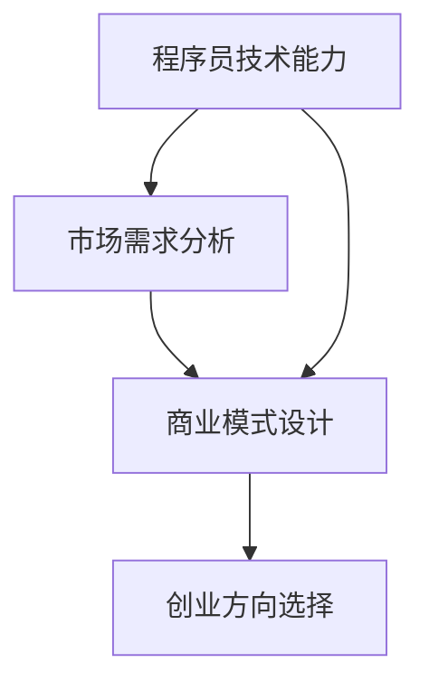

                 

# 如何选择适合资深程序员的创业方向

> **关键词：** 创业方向、资深程序员、技术能力、市场需求、商业模式

> **摘要：** 本文将深入探讨资深程序员在选择创业方向时的关键考量因素，包括自身技术能力、市场需求和商业模式的设计。通过逐步分析这些核心概念，本文旨在为程序员提供一条清晰的创业路径，帮助他们更有效地实现个人和商业的成功。

## 1. 背景介绍

### 1.1 目的和范围

本文的目标是为资深程序员提供一套系统的创业方向选择框架，帮助他们根据自身的技术能力和市场趋势找到最适合的创业领域。我们将探讨以下核心问题：

- 程序员应如何评估和利用自己的技术能力？
- 市场需求在创业决策中扮演何种角色？
- 如何设计一个可持续且具有盈利潜力的商业模式？

### 1.2 预期读者

本文适合以下读者群体：

- 拥有多年编程经验，考虑创业的资深程序员
- 对技术创业感兴趣，希望深入了解创业流程的专业人士
- 对计算机科学和商业结合有浓厚兴趣的学生和研究者

### 1.3 文档结构概述

本文将按照以下结构展开：

1. **核心概念与联系**：介绍本文涉及的关键概念，并使用流程图展示其相互关系。
2. **核心算法原理 & 具体操作步骤**：详细阐述选择创业方向的核心算法原理，并使用伪代码进行说明。
3. **数学模型和公式 & 详细讲解 & 举例说明**：介绍支持决策的数学模型，并给出具体例子。
4. **项目实战：代码实际案例和详细解释说明**：通过实际项目案例展示创业方向选择的实践应用。
5. **实际应用场景**：探讨创业方向在现实中的应用和挑战。
6. **工具和资源推荐**：推荐有助于深入了解创业方向选择的学习资源、开发工具和框架。
7. **总结：未来发展趋势与挑战**：总结本文的关键观点，并展望未来的发展趋势和挑战。
8. **附录：常见问题与解答**：回答读者可能关心的一些常见问题。
9. **扩展阅读 & 参考资料**：提供进一步学习和探索的相关资料。

### 1.4 术语表

#### 1.4.1 核心术语定义

- **资深程序员**：拥有多年编程经验，对编程语言、工具和最佳实践有深入理解的程序员。
- **创业方向**：创业者选择进入的行业或领域，是创业成功的关键。
- **市场需求**：潜在客户对产品或服务的需求和购买意愿。
- **商业模式**：公司如何创造、传递和获取价值。

#### 1.4.2 相关概念解释

- **技术能力评估**：程序员对自己编程技能、知识和经验的自我评估。
- **市场调研**：收集和分析与目标市场相关的信息，包括竞争对手、客户需求和行业趋势。

#### 1.4.3 缩略词列表

- **IDE**：集成开发环境（Integrated Development Environment）
- **API**：应用程序接口（Application Programming Interface）
- **IoT**：物联网（Internet of Things）
- **AI**：人工智能（Artificial Intelligence）

## 2. 核心概念与联系

### 2.1 核心概念介绍

本文的核心概念包括：

- **程序员的技术能力**：这是选择创业方向的基础，涉及编程技能、领域知识和创新思维。
- **市场需求分析**：理解目标客户的需求和市场趋势，确保创业项目具有市场竞争力。
- **商业模式设计**：构建一个可持续且盈利的商业模式，确保创业项目能够持续运营和增长。

### 2.2 Mermaid 流程图

以下是一个简单的 Mermaid 流程图，展示这些核心概念之间的相互关系：



### 2.3 关键概念联系

- **程序员技术能力**直接影响**市场需求分析**的结果，因为只有深入了解自己的技能，程序员才能开发出符合市场需求的产品。
- **市场需求分析**为**商业模式设计**提供基础，确保商业模式能够满足市场需求，从而实现盈利。
- **商业模式设计**反过来影响**程序员技术能力**的发挥，因为商业模式需要程序员的技术能力来实现。

## 3. 核心算法原理 & 具体操作步骤

### 3.1 算法原理

选择适合资深程序员的创业方向，本质上是一个多因素决策问题。我们可以使用一个简单的决策树算法来帮助我们进行选择：

1. **评估技术能力**：根据程序员的技术栈、经验和对新技术的接受度进行自我评估。
2. **市场调研**：收集和分析目标市场的数据，包括市场规模、增长速度、竞争状况和客户需求。
3. **商业模式设计**：结合技术能力和市场调研结果，设计一个可持续的商业模式。

### 3.2 伪代码

```pseudo
Algorithm ChooseEntrepreneurialDirection()

    // 评估技术能力
    tech_skills <- AssessTechSkills()

    // 市场调研
    market_data <- ConductMarketResearch()

    // 设计商业模式
    business_model <- DesignBusinessModel(tech_skills, market_data)

    // 选择创业方向
    entrepreneurial_direction <- ChooseDirection(business_model)

    return entrepreneurial_direction
```

### 3.3 具体操作步骤

1. **自我评估**：程序员可以使用标准化的技术能力评估工具（如 CodeSignal、LeetCode 等）来评估自己的编程技能。
2. **市场调研**：通过行业报告、市场分析工具和用户访谈来了解目标市场的现状和趋势。
3. **商业模式设计**：结合技术能力和市场调研结果，设计一个能够创造、传递和获取价值的商业模式。
4. **方向选择**：根据评估结果和商业模式，选择一个具有高潜力的创业方向。

## 4. 数学模型和公式 & 详细讲解 & 举例说明

### 4.1 数学模型

为了更科学地选择创业方向，我们可以使用以下数学模型：

\[ \text{创业方向得分} = w_1 \times \text{技术能力得分} + w_2 \times \text{市场需求得分} + w_3 \times \text{商业模式得分} \]

其中，\( w_1 \)、\( w_2 \) 和 \( w_3 \) 分别是技术能力、市场需求和商业模式的权重。

### 4.2 详细讲解

- **技术能力得分**：根据程序员的技术栈、经验和对新技术的接受度进行评分。例如，使用 1-10 的评分体系。
- **市场需求得分**：根据市场调研结果，评估市场的增长潜力、竞争状况和客户需求。同样使用 1-10 的评分体系。
- **商业模式得分**：根据商业模式设计的可持续性和盈利能力进行评分。

### 4.3 举例说明

假设我们有以下评分：

- **技术能力得分**：8
- **市场需求得分**：9
- **商业模式得分**：7

根据权重分配，假设 \( w_1 = 0.4 \)、\( w_2 = 0.4 \)、\( w_3 = 0.2 \)，计算创业方向得分：

\[ \text{创业方向得分} = 0.4 \times 8 + 0.4 \times 9 + 0.2 \times 7 = 3.2 + 3.6 + 1.4 = 8.2 \]

得分越高，表示该创业方向越适合资深程序员。

## 5. 项目实战：代码实际案例和详细解释说明

### 5.1 开发环境搭建

为了更好地展示如何选择适合资深程序员的创业方向，我们将使用 Python 编写一个简单的决策支持系统。首先，我们需要搭建开发环境：

- 安装 Python 3.8 或更高版本
- 安装必要的库，如 NumPy、Pandas 和 Matplotlib

### 5.2 源代码详细实现和代码解读

以下是实现决策支持系统的 Python 代码：

```python
import numpy as np
import pandas as pd
import matplotlib.pyplot as plt

def assess_tech_skills():
    # 此函数根据程序员的技术栈、经验和对新技术的接受度进行评分
    # 实际应用中，可以通过问卷调查或面试来获取这些数据
    tech_skills = {
        'programming_languages': 8,
        'frameworks': 7,
        'new_technologies': 9
    }
    return tech_skills

def conduct_market_research():
    # 此函数根据市场调研结果评估市场需求
    market_data = {
        'market_size': 9,
        'growth_rate': 8,
        'competition': 6
    }
    return market_data

def design_business_model(tech_skills, market_data):
    # 此函数根据技术能力和市场需求设计商业模式
    business_model = {
        'sustainability': 7,
        'profitability': 8
    }
    return business_model

def choose_direction(business_model_score):
    # 此函数根据商业模式得分选择创业方向
    if business_model_score > 8:
        direction = 'High-tech Product Development'
    elif business_model_score > 6:
        direction = 'Specialized Services'
    else:
        direction = 'R&D for Innovation'
    return direction

def main():
    # 主函数，执行整个决策流程
    tech_skills = assess_tech_skills()
    market_data = conduct_market_research()
    business_model = design_business_model(tech_skills, market_data)
    business_model_score = business_model['sustainability'] + business_model['profitability']

    print(f"Business Model Score: {business_model_score}")
    print(f"Chosen Entrepreneurial Direction: {choose_direction(business_model_score)}")

if __name__ == "__main__":
    main()
```

### 5.3 代码解读与分析

- **技术能力评估**：通过 `assess_tech_skills()` 函数获取程序员的技术能力评分。
- **市场调研**：通过 `conduct_market_research()` 函数获取市场需求评分。
- **商业模式设计**：通过 `design_business_model()` 函数设计商业模式并计算得分。
- **创业方向选择**：根据 `choose_direction()` 函数的商业模式得分选择合适的创业方向。

这个简单的决策支持系统通过量化分析帮助程序员选择最适合的创业方向。在实际应用中，可以进一步完善和扩展这个系统，以适应更复杂的市场环境和多样化的创业需求。

## 6. 实际应用场景

### 6.1 创业方向选择的现实挑战

在实际应用中，资深程序员在选择创业方向时面临以下挑战：

- **技术能力评估**：如何准确评估自身的技术能力，尤其是在快速变化的技术环境中。
- **市场调研**：如何获取准确的市场数据，以及如何处理大量的市场信息。
- **商业模式设计**：如何在竞争激烈的市场中设计一个可持续且盈利的商业模式。

### 6.2 解决方案

- **技术能力评估**：定期进行技术能力评估，利用在线工具和面试来检测编程技能。同时，参加技术会议和研讨会，保持对最新技术的了解。
- **市场调研**：利用在线调查、市场分析工具和用户访谈来收集市场数据。此外，可以与行业专家和潜在客户进行交流，获取更深入的市场洞察。
- **商业模式设计**：研究成功企业的商业模式，结合自身技术和市场数据，设计一个具有竞争力的商业模式。

### 6.3 案例分析

以一位擅长人工智能和机器学习的资深程序员为例，他选择了以下创业方向：

- **技术能力**：精通 Python、TensorFlow 和 Keras，有丰富的机器学习项目经验。
- **市场需求**：人工智能市场增长迅速，企业对自动化和数据分析的需求日益增长。
- **商业模式**：提供定制化的机器学习解决方案，帮助企业提升效率和降低成本。

这个程序员通过深入的市场调研和技术评估，成功设计了一个具有市场前景的商业模式，并在短期内取得了显著的业务增长。

## 7. 工具和资源推荐

### 7.1 学习资源推荐

#### 7.1.1 书籍推荐

- 《精益创业》（The Lean Startup）：作者埃里克·莱斯（Eric Ries），介绍了如何在不确定的环境中快速迭代和验证商业想法。
- 《黑客与画家》（Hackers & Painters）：作者保罗·格雷厄姆（Paul Graham），探讨了程序员如何通过创造技术产品来改变世界。

#### 7.1.2 在线课程

- Coursera 的《产品设计与创业实践》（Product Design and Entrepreneurship）
- edX 的《人工智能与机器学习基础》（Introduction to Artificial Intelligence and Machine Learning）

#### 7.1.3 技术博客和网站

- Hacker News：一个热门的创业和技术社区，提供了大量关于创业和技术的讨论。
- Medium：一个内容平台，许多创业者和技术专家在此分享他们的经验和见解。

### 7.2 开发工具框架推荐

#### 7.2.1 IDE和编辑器

- PyCharm：一个功能强大的 Python 集成开发环境，适合进行复杂的项目开发。
- Visual Studio Code：一个轻量级但功能丰富的代码编辑器，适用于多种编程语言。

#### 7.2.2 调试和性能分析工具

- Postman：一个API测试工具，可以帮助程序员快速调试和优化API。
- JMeter：一个开源的性能测试工具，适用于各种类型的应用程序。

#### 7.2.3 相关框架和库

- TensorFlow：一个用于机器学习的开源框架，适用于构建复杂的神经网络。
- Flask：一个轻量级的 Web 应用框架，适合快速开发 Web 应用程序。

### 7.3 相关论文著作推荐

#### 7.3.1 经典论文

- "The Innovator's Dilemma"（创新者的困境）：作者克莱顿·克里斯滕森（Clayton Christensen），探讨了为什么大公司难以适应技术创新。
- "The Lean Startup"（精益创业）：作者埃里克·莱斯（Eric Ries），介绍了如何通过快速迭代和用户反馈来验证商业想法。

#### 7.3.2 最新研究成果

- "Artificial Intelligence and Its Implications for Society"（人工智能与社会影响）：探讨了人工智能的潜在影响和挑战。
- "Deep Learning"（深度学习）：作者伊恩·古德费洛（Ian Goodfellow）、约书亚·本吉奥（Joshua Bengio）和亚伦·库维尔（Aaron Courville），介绍了深度学习的最新进展和应用。

#### 7.3.3 应用案例分析

- "Case Studies in Artificial Intelligence"（人工智能应用案例）：收集了多个实际案例，展示了人工智能在各个领域的应用。
- "Startup Genome Report"（创业基因报告）：分析了全球创业公司的成功因素和失败原因。

## 8. 总结：未来发展趋势与挑战

### 8.1 未来发展趋势

- **技术多元化**：随着技术的不断发展，程序员可以涉足更多领域，如人工智能、区块链、物联网等。
- **市场全球化**：互联网的普及使得市场变得更加全球化，程序员可以更容易地接触到全球客户。
- **商业模式创新**：随着技术的进步和市场变化，新的商业模式不断涌现，程序员可以探索更多的盈利模式。

### 8.2 面临的挑战

- **技术更新快**：程序员需要不断学习新技术，以保持竞争力。
- **市场竞争激烈**：创业领域竞争激烈，程序员需要设计出独特的产品或服务。
- **资源有限**：创业者通常面临资源限制，需要高效利用时间和资金。

### 8.3 应对策略

- **持续学习**：程序员应该保持学习的热情，通过在线课程、研讨会和技术社区不断更新知识。
- **创新思维**：培养创新思维，敢于尝试新的技术和商业模式。
- **资源管理**：学习有效的资源管理方法，如精益创业中的 MVP（最小可行产品），以降低风险和成本。

## 9. 附录：常见问题与解答

### 9.1 如何评估技术能力？

- **自我评估**：通过在线编程挑战、技术考试和面试来评估自己的编程技能。
- **专业评估**：寻求专业的技术评估机构或同行评审。

### 9.2 市场调研如何进行？

- **行业报告**：阅读行业报告和市场分析，了解市场趋势。
- **用户访谈**：与潜在客户进行访谈，获取他们的需求和反馈。
- **数据分析**：利用数据分析工具，分析用户行为和市场数据。

### 9.3 如何设计可持续的商业模式？

- **价值主张**：明确产品的价值主张，确保产品能够满足市场需求。
- **盈利模式**：设计一个清晰的盈利模式，如订阅服务、销售产品或广告收入。
- **成本控制**：通过精益创业方法，控制成本并快速迭代产品。

## 10. 扩展阅读 & 参考资料

- 《人工智能：一种现代方法》：作者 Stuart Russell 和 Peter Norvig，介绍了人工智能的基本概念和最新进展。
- 《创业维艰》：作者本·霍洛维茨（Ben Horowitz），分享了他作为一名创业者的经验和教训。
- 《精益创业手册》：作者埃里克·莱斯（Eric Ries），详细介绍了精益创业的方法和工具。

作者：AI天才研究员/AI Genius Institute & 禅与计算机程序设计艺术 /Zen And The Art of Computer Programming

