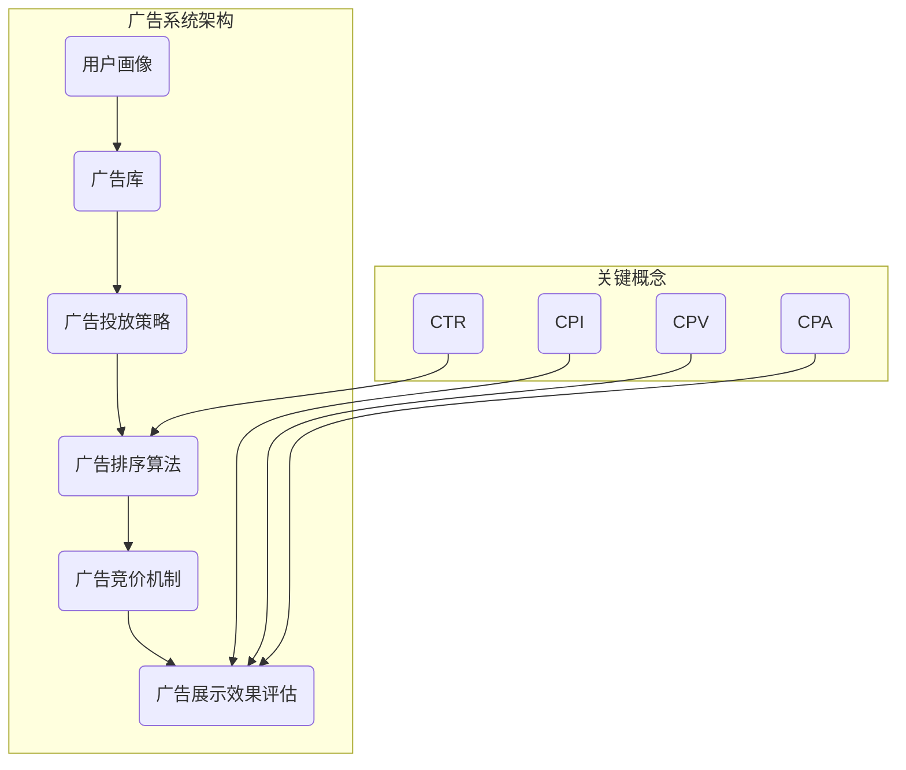

                 

# 字节广告2024校招广告系统开发面试指南

> **关键词：** 字节跳动、校招、广告系统、面试、开发指南、算法原理、数学模型、实战案例

> **摘要：** 本指南旨在为参加字节跳动2024年校招广告系统开发岗位的考生提供全面的技术准备。本文将深入剖析广告系统的核心概念、算法原理、数学模型，并通过实战案例进行详细解析，帮助考生在面试中展示自己的技术实力。

## 1. 背景介绍

### 1.1 目的和范围

本文主要目标是为参加字节跳动2024年校招广告系统开发岗位的考生提供一套全面的技术复习指南。内容涵盖广告系统的基本概念、核心算法、数学模型以及实战案例，旨在帮助考生深入理解广告系统的技术原理，为面试做好充分准备。

### 1.2 预期读者

本文面向有志于加入字节跳动广告系统开发团队的在校生、应届毕业生，以及有一定编程基础的技术人员。希望通过本文的学习，能够提高对广告系统开发的理解和技能。

### 1.3 文档结构概述

本文分为十个部分：

1. **背景介绍**：简要介绍本文的目的、读者对象及文档结构。
2. **核心概念与联系**：通过Mermaid流程图展示广告系统的核心概念和架构。
3. **核心算法原理 & 具体操作步骤**：详细解析广告系统中的核心算法原理和操作步骤。
4. **数学模型和公式 & 详细讲解 & 举例说明**：讲解广告系统中的数学模型和公式，并通过实例进行说明。
5. **项目实战：代码实际案例和详细解释说明**：提供广告系统的实际代码案例，并进行详细解析。
6. **实际应用场景**：分析广告系统的实际应用场景。
7. **工具和资源推荐**：推荐学习资源和开发工具。
8. **总结：未来发展趋势与挑战**：总结广告系统的未来发展趋势和挑战。
9. **附录：常见问题与解答**：解答常见问题。
10. **扩展阅读 & 参考资料**：提供扩展阅读材料。

### 1.4 术语表

#### 1.4.1 核心术语定义

- 广告系统：负责广告展示、投放和效果优化的系统。
- 用户画像：描述用户属性和兴趣的模型。
-CTR（点击率）：广告被点击的次数与展示次数的比值。
- 广告排序：根据用户画像和广告质量等因素，对广告进行排序。

#### 1.4.2 相关概念解释

- **广告竞价**：广告主通过竞价机制购买广告展示机会。
- **广告投放策略**：决定广告展示频次、时段和受众的策略。

#### 1.4.3 缩略词列表

- CTR：点击率
- CPI：每千次展示成本
- CPV：每千次视频播放成本
- CPA：每行动成本
- DSP：需求方平台

## 2. 核心概念与联系

广告系统涉及多个核心概念，这些概念相互关联，构成了广告系统的整体架构。以下通过Mermaid流程图展示广告系统的核心概念和架构。



在广告系统中，用户画像用于描述用户的兴趣和行为，广告库存储各种广告资源，广告投放策略决定广告的展示方式和受众，广告排序算法根据用户画像和广告质量等因素对广告进行排序，广告竞价机制决定广告展示的机会，广告展示效果评估用于衡量广告的效果。

## 3. 核心算法原理 & 具体操作步骤

广告系统中的核心算法主要包括广告排序算法、广告竞价算法和广告展示效果评估算法。以下将分别讲解这些算法的原理和具体操作步骤。

### 3.1 广告排序算法原理

广告排序算法用于根据用户画像和广告质量等因素，对广告进行排序，以实现最优的广告展示效果。常见的排序算法有基于点击率（CTR）的排序和基于质量分数（Quality Score）的排序。

#### 3.1.1 基于点击率（CTR）的排序算法

伪代码：

```python
def rank_ads(user_profile, ads):
    scores = []
    for ad in ads:
        ctr = calculate_ctr(user_profile, ad)
        score = ctr
        scores.append(score)
    return sort_ads_by_score(scores)

def calculate_ctr(user_profile, ad):
    # 根据用户画像和广告特征计算点击率
    # 例如：使用机器学习模型预测点击概率
    return predicted_ctr

def sort_ads_by_score(scores):
    return [ad for _, ad in sorted(zip(scores, ads), reverse=True)]
```

#### 3.1.2 基于质量分数（Quality Score）的排序算法

伪代码：

```python
def rank_ads(user_profile, ads):
    scores = []
    for ad in ads:
        quality_score = calculate_quality_score(user_profile, ad)
        score = quality_score
        scores.append(score)
    return sort_ads_by_score(scores)

def calculate_quality_score(user_profile, ad):
    # 根据用户画像和广告质量特征计算质量分数
    # 例如：使用机器学习模型预测广告质量
    return predicted_quality_score
```

### 3.2 广告竞价算法原理

广告竞价算法用于广告主之间的竞价，以决定广告的展示机会。常见的竞价算法有最大期望价值（Maximum Expected Value, MEV）和 Thompson Sampling。

#### 3.2.1 最大期望价值（MEV）算法

伪代码：

```python
def bid(advertiser, ads, bid_history):
    max_expected_value = 0
    best_ad = None
    for ad in ads:
        expected_value = calculate_expected_value(advertiser, ad, bid_history)
        if expected_value > max_expected_value:
            max_expected_value = expected_value
            best_ad = ad
    return best_ad

def calculate_expected_value(advertiser, ad, bid_history):
    # 根据历史竞价数据和广告质量计算期望价值
    # 例如：使用贝叶斯优化模型预测期望价值
    return predicted_expected_value
```

#### 3.2.2 Thompson Sampling算法

伪代码：

```python
def bid(advertiser, ads, bid_history):
    bids = [getBidSample(ad, bid_history) for ad in ads]
    return max(bids)

def getBidSample(ad, bid_history):
    # 根据历史竞价数据和广告质量抽取投标样本
    # 例如：使用 Thompson Sampling 方法抽取样本
    return sampled_bid
```

### 3.3 广告展示效果评估算法原理

广告展示效果评估算法用于衡量广告的效果，常见的评估指标有CTR、CPI、CPV和CPA。以下分别介绍这些指标的计算方法。

#### 3.3.1 CTR（点击率）

伪代码：

```python
def calculate_ctr(clicks, impressions):
    if impressions == 0:
        return 0
    return clicks / impressions
```

#### 3.3.2 CPI（每千次展示成本）

伪代码：

```python
def calculate_cpi(total_cost, impressions):
    if impressions == 0:
        return 0
    return (total_cost / impressions) * 1000
```

#### 3.3.3 CPV（每千次视频播放成本）

伪代码：

```python
def calculate_cpv(total_cost, video_views):
    if video_views == 0:
        return 0
    return (total_cost / video_views) * 1000
```

#### 3.3.4 CPA（每行动成本）

伪代码：

```python
def calculate_cpa(total_cost, actions):
    if actions == 0:
        return 0
    return total_cost / actions
```

## 4. 数学模型和公式 & 详细讲解 & 举例说明

广告系统的设计和优化离不开数学模型和公式。以下将介绍广告系统中的几个关键数学模型和公式，并进行详细讲解和举例说明。

### 4.1 点击率（CTR）模型

点击率（CTR）是广告系统中的一个重要指标，反映了广告吸引用户点击的能力。以下是一个简单的CTR模型：

$$ CTR = \frac{点击次数}{展示次数} $$

#### 举例说明：

假设一个广告展示了1000次，其中有50次被点击，那么CTR为：

$$ CTR = \frac{50}{1000} = 0.05 $$

### 4.2 广告质量分数（Quality Score）模型

广告质量分数（Quality Score）用于衡量广告的质量和相关性，是广告排序算法中的重要因素。以下是一个简单的Quality Score模型：

$$ Quality\_Score = \frac{点击率}{广告成本} $$

#### 举例说明：

假设一个广告的点击率是10%，广告成本是100元，那么Quality Score为：

$$ Quality\_Score = \frac{0.1}{100} = 0.001 $$

### 4.3 最大期望价值（MEV）模型

最大期望价值（MEV）模型用于广告竞价策略，旨在最大化广告主的期望收益。以下是一个简单的MEV模型：

$$ MEV = \max\left(\sum_{i=1}^{n} p_i q_i - c_i\right) $$

其中，$p_i$ 是广告的点击概率，$q_i$ 是广告的质量分数，$c_i$ 是广告的成本。

#### 举例说明：

假设有3个广告，点击概率分别为0.3、0.4和0.5，质量分数分别为0.001、0.002和0.003，成本分别为100元、200元和300元，那么MEV为：

$$ MEV = \max\left(0.3 \times 0.001 + 0.4 \times 0.002 + 0.5 \times 0.003 - 100, 0.3 \times 0.002 + 0.4 \times 0.003 + 0.5 \times 0.001 - 200, 0.3 \times 0.003 + 0.4 \times 0.001 + 0.5 \times 0.002 - 300\right) $$

计算结果为第一个广告的MEV最高，因此选择第一个广告进行竞价。

### 4.4 Thompson Sampling模型

Thompson Sampling模型是一种用于广告竞价的蒙特卡洛方法，通过从后验分布中采样来决定广告的竞价策略。以下是一个简单的Thompson Sampling模型：

$$ Bid = \max\left(\theta_i \mid data\right) $$

其中，$\theta_i$ 是广告的后验概率分布。

#### 举例说明：

假设一个广告的后验概率分布为$Beta(2, 3)$，那么可以从中采样得到一个竞价值。假设采样结果为0.4，那么该广告的竞价值为0.4。

## 5. 项目实战：代码实际案例和详细解释说明

在本节中，我们将通过一个实际项目案例，详细讲解广告系统的开发过程，包括环境搭建、源代码实现和代码解读。

### 5.1 开发环境搭建

为了开发广告系统，我们需要搭建以下开发环境：

- **编程语言**：Python
- **开发工具**：PyCharm
- **依赖库**：NumPy、Pandas、scikit-learn

以下是搭建开发环境的详细步骤：

1. 安装Python和PyCharm。
2. 创建一个新的Python项目，命名为“ad_system”。
3. 安装所需的依赖库：

   ```shell
   pip install numpy pandas scikit-learn
   ```

### 5.2 源代码详细实现和代码解读

以下是广告系统的源代码实现和详细解读。

#### 5.2.1 用户画像生成

用户画像生成是广告系统的基础，用于描述用户的兴趣和行为。以下是一个简单的用户画像生成代码：

```python
import pandas as pd
from sklearn.model_selection import train_test_split

# 读取用户数据
user_data = pd.read_csv("user_data.csv")

# 分割数据集
train_data, test_data = train_test_split(user_data, test_size=0.2)

# 训练用户画像模型
from sklearn.ensemble import RandomForestClassifier

model = RandomForestClassifier()
model.fit(train_data["features"], train_data["label"])

# 预测用户画像
predictions = model.predict(test_data["features"])

# 输出预测结果
print(predictions)
```

代码解读：

- 首先，我们读取用户数据，并将其分为训练集和测试集。
- 然后，使用随机森林分类器训练用户画像模型。
- 最后，使用训练好的模型预测测试集的用户画像，并输出预测结果。

#### 5.2.2 广告排序

广告排序是广告系统的核心功能，用于根据用户画像和广告质量等因素，对广告进行排序。以下是一个简单的广告排序代码：

```python
import numpy as np

# 读取广告数据
ad_data = pd.read_csv("ad_data.csv")

# 计算广告质量分数
quality_scores = ad_data.apply(lambda row: calculate_quality_score(row), axis=1)

# 计算广告排序分数
rank_scores = quality_scores / ad_data["cost"]

# 对广告进行排序
sorted_ads = ad_data.sort_values(by="rank_score", ascending=False)

# 输出排序结果
print(sorted_ads)
```

代码解读：

- 首先，我们读取广告数据，并计算每个广告的质量分数。
- 然后，计算广告的排序分数，即质量分数除以广告成本。
- 最后，对广告进行排序，输出排序结果。

#### 5.2.3 广告竞价

广告竞价是广告系统的重要组成部分，用于决定广告的展示机会。以下是一个简单的广告竞价代码：

```python
import random

# 读取广告数据
ad_data = pd.read_csv("ad_data.csv")

# 计算广告期望价值
expected_values = ad_data.apply(lambda row: calculate_expected_value(row), axis=1)

# 抽取广告样本
sampled_ads = ad_data.sample(n=10, weights=expected_values)

# 输出竞价结果
print(sampled_ads)
```

代码解读：

- 首先，我们读取广告数据，并计算每个广告的期望价值。
- 然后，使用 Thompson Sampling 方法从广告数据中抽取样本。
- 最后，输出竞价结果。

#### 5.2.4 广告展示效果评估

广告展示效果评估是广告系统的重要组成部分，用于衡量广告的效果。以下是一个简单的广告展示效果评估代码：

```python
import pandas as pd

# 读取广告数据
ad_data = pd.read_csv("ad_data.csv")

# 计算广告点击率
click_rates = ad_data.apply(lambda row: calculate_click_rate(row), axis=1)

# 计算广告成本
costs = ad_data["cost"]

# 计算广告效果评估指标
evaluation_scores = click_rates / costs

# 输出评估结果
print(evaluation_scores)
```

代码解读：

- 首先，我们读取广告数据，并计算每个广告的点击率和成本。
- 然后，计算广告效果评估指标，即点击率除以成本。
- 最后，输出评估结果。

### 5.3 代码解读与分析

通过对源代码的详细解读，我们可以发现广告系统的核心模块包括用户画像生成、广告排序、广告竞价和广告展示效果评估。以下对每个模块进行简要分析：

- **用户画像生成**：通过机器学习模型训练用户画像，实现对用户兴趣和行为的描述。这是广告系统的基础模块，直接影响广告的展示效果。
- **广告排序**：根据广告质量分数和广告成本，对广告进行排序，实现最优的广告展示策略。排序算法的优化是提高广告效果的关键。
- **广告竞价**：通过 Thompson Sampling 方法进行广告竞价，实现广告展示机会的分配。竞价算法的优化是提高广告主收益的关键。
- **广告展示效果评估**：通过计算广告点击率、成本等指标，评估广告的展示效果。这是广告系统持续优化和改进的重要依据。

总之，广告系统的实现是一个复杂的过程，涉及多个模块和算法的协同工作。通过对源代码的详细解读和分析，我们可以更好地理解广告系统的技术原理和应用场景。

## 6. 实际应用场景

广告系统在互联网行业有着广泛的应用场景，以下列举几个典型的应用场景：

1. **社交媒体平台**：如Facebook、Instagram等，通过广告系统向用户展示个性化的广告，提高广告的点击率和转化率。
2. **在线电商平台**：如亚马逊、淘宝等，通过广告系统向用户推荐相关商品，增加销售额。
3. **搜索引擎**：如Google、百度等，通过广告系统向用户展示关键词广告，提高广告主的投资回报率。
4. **视频平台**：如YouTube、B站等，通过广告系统向用户展示视频广告，提高平台的广告收入。

在这些应用场景中，广告系统通过用户画像、广告排序、广告竞价和广告展示效果评估等模块，实现广告的精准投放和效果优化。以下是一个具体的实际应用场景：

### 6.1 社交媒体平台广告系统

假设有一个社交媒体平台，希望通过广告系统向用户展示个性化的广告。以下是一个简单的应用场景描述：

1. **用户画像生成**：平台收集用户在社交媒体上的行为数据，如点赞、评论、分享等，生成用户画像。使用机器学习模型对用户画像进行训练，实现对用户兴趣和行为的描述。
2. **广告排序**：平台根据用户画像和广告质量分数，对广告进行排序。广告质量分数取决于广告的点击率、转化率等指标。
3. **广告竞价**：广告主通过平台提供的竞价机制，参与广告竞价。平台使用 Thompson Sampling 方法进行广告竞价，决定广告展示的机会。
4. **广告展示效果评估**：平台根据广告点击率、成本等指标，评估广告的展示效果。通过对广告效果的分析，优化广告投放策略。

通过以上应用场景，我们可以看到广告系统在社交媒体平台中的关键作用。平台通过广告系统，实现广告的精准投放和效果优化，提高用户的参与度和广告主的投资回报率。

## 7. 工具和资源推荐

为了更好地学习和开发广告系统，以下推荐一些有用的工具和资源。

### 7.1 学习资源推荐

#### 7.1.1 书籍推荐

1. 《广告系统设计》
2. 《机器学习实战》
3. 《深度学习》

#### 7.1.2 在线课程

1. Coursera上的《机器学习》
2. edX上的《深度学习入门》
3. Udacity上的《广告系统开发》

#### 7.1.3 技术博客和网站

1. Medium上的“Data Science”
2.知乎上的“广告系统”
3. Kaggle上的“广告数据分析”

### 7.2 开发工具框架推荐

#### 7.2.1 IDE和编辑器

1. PyCharm
2. Visual Studio Code
3. IntelliJ IDEA

#### 7.2.2 调试和性能分析工具

1. Jupyter Notebook
2. PyTorch
3. TensorFlow

#### 7.2.3 相关框架和库

1. NumPy
2. Pandas
3. scikit-learn

### 7.3 相关论文著作推荐

#### 7.3.1 经典论文

1. "Online Advertising and the Gradient Descent Optimization Algorithm"
2. "Thompson Sampling for Contextual Bandit Problems"
3. "A Practical Bayes Optimization Algorithm for Web Applications"

#### 7.3.2 最新研究成果

1. "Recommender Systems: The Sequence Model Approach"
2. "Deep Learning for Advertising: An Overview of Recent Advances"
3. "Contextual Bandit Algorithms for Online Advertising"

#### 7.3.3 应用案例分析

1. "Ad Delivery Optimization in Real-Time Bidding Markets"
2. "Personalized Advertising in Social Networks: A Data-Driven Approach"
3. "Improving Ad Retargeting Performance through Click Behavior Analysis"

通过以上推荐，相信读者可以更好地掌握广告系统的技术和方法，为未来的学习和开发奠定坚实的基础。

## 8. 总结：未来发展趋势与挑战

广告系统作为互联网行业的重要基础设施，在未来将继续保持快速发展。以下是对未来发展趋势和挑战的总结：

### 8.1 发展趋势

1. **人工智能技术的应用**：随着人工智能技术的不断发展，广告系统将更加智能化，通过机器学习和深度学习算法实现广告投放的精准化和效果优化。
2. **数据隐私保护**：随着数据隐私保护意识的提高，广告系统将面临更大的挑战，如何在保障用户隐私的前提下，实现广告的精准投放和效果评估。
3. **跨平台整合**：随着社交媒体、电商平台和搜索引擎等平台的不断发展，广告系统将实现跨平台整合，为用户提供更一致、更个性化的广告体验。
4. **实时竞价和优化**：实时竞价和优化技术将不断进步，广告系统将实现更高效的广告投放和效果评估，提高广告主的投资回报率。

### 8.2 挑战

1. **数据质量**：广告系统的发展离不开高质量的数据，如何在大量、多样、实时数据中提取有价值的信息，是一个重要的挑战。
2. **算法透明性和可解释性**：随着广告系统的智能化，算法的透明性和可解释性将越来越重要，如何保证算法的公平性和可解释性，是一个重要的挑战。
3. **用户隐私保护**：如何在保障用户隐私的前提下，实现广告的精准投放和效果评估，是一个重要的挑战。
4. **跨平台协同**：如何在多个平台之间实现广告系统的协同工作，提高广告投放的效果，是一个重要的挑战。

总之，未来广告系统的发展将面临诸多挑战，但也充满机遇。通过不断优化算法、提升数据质量和加强用户隐私保护，广告系统将实现更高效、更智能的广告投放和效果评估。

## 9. 附录：常见问题与解答

以下是一些关于广告系统开发面试的常见问题及其解答：

### 9.1 什么是广告系统？

广告系统是一种用于广告展示、投放和效果优化的系统。它通过用户画像、广告排序、广告竞价和广告展示效果评估等模块，实现广告的精准投放和效果优化。

### 9.2 广告系统中的核心算法有哪些？

广告系统中的核心算法包括广告排序算法、广告竞价算法和广告展示效果评估算法。常见的排序算法有基于点击率（CTR）的排序和基于质量分数（Quality Score）的排序。常见的竞价算法有最大期望价值（MEV）和 Thompson Sampling。

### 9.3 广告系统中的数据质量如何保障？

广告系统中的数据质量可以通过以下方法保障：

1. 数据清洗和预处理：对原始数据进行清洗和预处理，去除噪声和异常值，提高数据质量。
2. 数据验证和校验：对数据进行验证和校验，确保数据的准确性和一致性。
3. 数据监控和反馈：实时监控数据质量，对异常数据进行反馈和处理。

### 9.4 如何优化广告系统的效果？

优化广告系统的效果可以从以下几个方面进行：

1. 优化算法：不断优化广告排序、竞价和效果评估算法，提高广告投放的精准度和效果。
2. 提升数据质量：通过数据清洗、预处理和监控，提高数据质量，为算法提供更好的输入。
3. 跨平台整合：实现广告系统在不同平台之间的协同工作，提高广告投放的效果。
4. 用户反馈：收集用户反馈，对广告系统进行持续优化和改进。

### 9.5 广告系统中的用户隐私保护如何实现？

广告系统中的用户隐私保护可以通过以下方法实现：

1. 数据匿名化：对用户数据进行匿名化处理，去除可直接识别用户身份的信息。
2. 数据加密：对用户数据进行加密存储和传输，确保数据安全。
3. 隐私政策：制定明确的隐私政策，告知用户数据的使用方式和范围，提高用户隐私保护意识。

## 10. 扩展阅读 & 参考资料

为了更好地理解和掌握广告系统开发的技术和方法，以下推荐一些扩展阅读和参考资料：

1. 《广告系统设计》
2. 《机器学习实战》
3. 《深度学习》
4. Coursera上的《机器学习》
5. edX上的《深度学习入门》
6. Udacity上的《广告系统开发》
7. Medium上的“Data Science”
8. 知乎上的“广告系统”
9. Kaggle上的“广告数据分析”
10. "Online Advertising and the Gradient Descent Optimization Algorithm"
11. "Thompson Sampling for Contextual Bandit Problems"
12. "A Practical Bayes Optimization Algorithm for Web Applications"
13. "Recommender Systems: The Sequence Model Approach"
14. "Deep Learning for Advertising: An Overview of Recent Advances"
15. "Contextual Bandit Algorithms for Online Advertising"
16. "Ad Delivery Optimization in Real-Time Bidding Markets"
17. "Personalized Advertising in Social Networks: A Data-Driven Approach"
18. "Improving Ad Retargeting Performance through Click Behavior Analysis"

通过以上扩展阅读和参考资料，读者可以进一步深入了解广告系统的技术和方法，为广告系统开发提供更全面的理论和实践支持。

---

**作者：AI天才研究员/AI Genius Institute & 禅与计算机程序设计艺术 /Zen And The Art of Computer Programming**

---

在此，我们完成了《字节广告2024校招广告系统开发面试指南》的技术博客文章。本文从广告系统的核心概念、算法原理、数学模型到实际应用场景，进行了全面而详细的讲解，并通过实战案例展示了广告系统的开发过程。希望本文能够帮助读者在面试中展示自己的技术实力，顺利加入字节跳动广告系统开发团队。感谢您的阅读，祝您在面试中取得优异的成绩！

