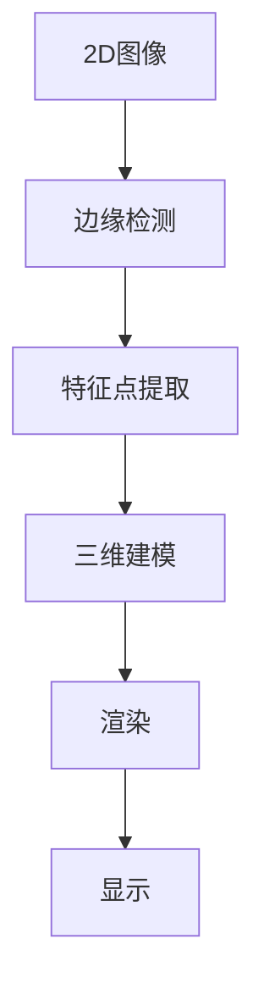
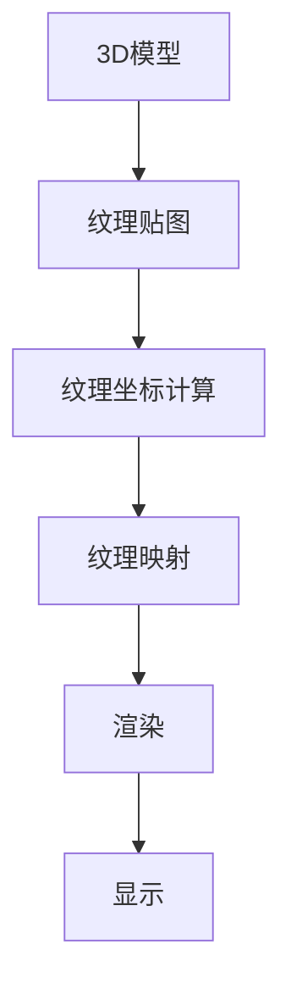
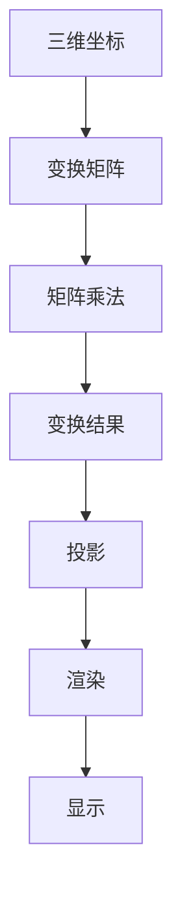

                 

# 字节跳动2024校招AR/VR开发工程师面试题详解

> **关键词：** 字节跳动、校招、AR/VR开发、面试题、详解、算法、数学模型、实战案例

> **摘要：** 本文针对字节跳动2024校招AR/VR开发工程师岗位的面试题进行详细解析，涵盖核心概念、算法原理、数学模型以及实战案例，旨在为准备校招的学子提供有力支持。文章将从背景介绍、核心概念、算法原理、数学模型、实战案例等多个方面，系统性地剖析面试题，帮助读者深入理解并掌握相关技能。

## 1. 背景介绍

### 1.1 目的和范围

本文旨在为广大准备参加字节跳动2024校招AR/VR开发工程师岗位的学子提供一份详细的面试题解析，通过深入剖析题目，帮助读者更好地理解和掌握相关技能。文章内容涵盖了AR/VR开发领域的核心概念、算法原理、数学模型以及实战案例，力求为广大读者提供一份全面、系统的参考。

### 1.2 预期读者

本文预期读者为准备参加字节跳动2024校招AR/VR开发工程师岗位的学子，以及对该领域感兴趣的读者。本文内容具有较强的专业性，适合有一定编程基础和AR/VR开发经验的读者阅读。

### 1.3 文档结构概述

本文分为十个部分，具体结构如下：

1. 背景介绍
   - 1.1 目的和范围
   - 1.2 预期读者
   - 1.3 文档结构概述
   - 1.4 术语表

2. 核心概念与联系
   - 2.1 AR/VR技术概述
   - 2.2 相关概念解析

3. 核心算法原理 & 具体操作步骤
   - 3.1 常见算法介绍
   - 3.2 算法原理讲解

4. 数学模型和公式 & 详细讲解 & 举例说明
   - 4.1 数学模型介绍
   - 4.2 数学公式讲解
   - 4.3 举例说明

5. 项目实战：代码实际案例和详细解释说明
   - 5.1 开发环境搭建
   - 5.2 源代码详细实现和代码解读
   - 5.3 代码解读与分析

6. 实际应用场景

7. 工具和资源推荐

8. 总结：未来发展趋势与挑战

9. 附录：常见问题与解答

10. 扩展阅读 & 参考资料

### 1.4 术语表

#### 1.4.1 核心术语定义

- AR：增强现实（Augmented Reality）
- VR：虚拟现实（Virtual Reality）
- 3D建模：三维模型构建
- 传感器：检测设备，用于获取环境信息
- SLAM：同时定位与地图构建（Simultaneous Localization and Mapping）
- 矩阵运算：二维数组的计算操作

#### 1.4.2 相关概念解释

- 纹理映射：将二维纹理贴图映射到三维模型上
- 线性代数：研究向量空间和线性映射的数学分支
- 渲染：将三维模型转换成二维图像的过程

#### 1.4.3 缩略词列表

- AR/VR：增强现实/虚拟现实
- SLAM：同时定位与地图构建
- GPU：图形处理单元（Graphics Processing Unit）
- CPU：中央处理单元（Central Processing Unit）

## 2. 核心概念与联系

在本文中，我们将首先介绍AR/VR技术的基本概念，并探讨其与相关技术的联系。为了更好地理解这些概念，我们将借助Mermaid流程图，展示AR/VR技术的基本原理和架构。

### 2.1 AR/VR技术概述

**增强现实（AR）**：通过在真实世界中叠加虚拟信息，增强用户对现实世界的感知。

**虚拟现实（VR）**：通过创建一个完全虚拟的环境，使用户沉浸其中，体验与真实世界完全不同的感受。

### 2.2 相关概念解析

#### 2D到3D转换

2D图像到3D模型的转换是AR/VR技术中的基础。以下是一个简单的Mermaid流程图，展示了2D到3D转换的过程：



#### 纹理映射

纹理映射是将2D纹理贴图映射到3D模型上，以增强视觉效果。以下是一个简单的Mermaid流程图，展示了纹理映射的过程：



#### 矩阵运算

在AR/VR技术中，矩阵运算用于实现三维变换、投影等操作。以下是一个简单的Mermaid流程图，展示了矩阵运算的应用：



## 3. 核心算法原理 & 具体操作步骤

在AR/VR开发中，算法原理是至关重要的。以下我们将详细介绍一些核心算法原理，并使用伪代码进行详细阐述。

### 3.1 常见算法介绍

- **深度学习算法**：用于图像识别、目标检测等任务。
- **SLAM算法**：用于同时定位与地图构建。

### 3.2 算法原理讲解

#### 3.2.1 深度学习算法

深度学习算法通常包括以下几个步骤：

1. **数据预处理**：包括图像缩放、归一化等操作。
2. **卷积神经网络（CNN）**：用于特征提取和分类。
3. **全连接层**：用于分类和预测。
4. **损失函数**：用于评估模型性能。

以下是一个简单的伪代码示例：

```python
# 数据预处理
def preprocess_image(image):
    # 缩放、归一化等操作
    return processed_image

# 卷积神经网络
def cnn(image):
    # 卷积层、池化层等操作
    return features

# 全连接层
def fc(features):
    # 分类操作
    return predicted_label

# 损失函数
def loss_function(predicted_label, true_label):
    # 评估模型性能
    return loss
```

#### 3.2.2 SLAM算法

SLAM算法通常包括以下几个步骤：

1. **特征点提取**：从图像中提取关键特征点。
2. **匹配**：将当前帧的特征点与历史帧的特征点进行匹配。
3. **运动估计**：根据匹配结果估计相机运动。
4. **地图构建**：将估计的相机运动用于构建地图。

以下是一个简单的伪代码示例：

```python
# 特征点提取
def extract_features(image):
    # 使用SIFT、ORB等算法提取特征点
    return keypoints

# 匹配
def match_keypoints(current_keypoints, historical_keypoints):
    # 使用KNN、FLANN等算法匹配特征点
    return matched_keypoints

# 运动估计
def estimate_motion(matched_keypoints):
    # 使用PnP、RANSAC等算法估计相机运动
    return camera_motion

# 地图构建
def build_map(camera_motion):
    # 将相机运动用于构建地图
    return map
```

## 4. 数学模型和公式 & 详细讲解 & 举例说明

在AR/VR开发中，数学模型和公式是核心基础。以下我们将详细介绍一些常用的数学模型和公式，并使用LaTeX格式进行展示。

### 4.1 数学模型介绍

- **线性代数**：包括向量、矩阵、行列式等基本概念。
- **概率论**：包括概率分布、条件概率、期望等概念。
- **优化理论**：包括目标函数、约束条件、优化算法等概念。

### 4.2 数学公式讲解

#### 4.2.1 线性代数

1. **向量**：

   $$ \vec{v} = (v_1, v_2, \ldots, v_n) $$

2. **矩阵**：

   $$ \mathbf{A} = \begin{bmatrix} 
   a_{11} & a_{12} & \ldots & a_{1n} \\
   a_{21} & a_{22} & \ldots & a_{2n} \\
   \vdots & \vdots & \ddots & \vdots \\
   a_{m1} & a_{m2} & \ldots & a_{mn}
   \end{bmatrix} $$

3. **行列式**：

   $$ \det(\mathbf{A}) = a_{11}C_{11} - a_{12}C_{21} + \ldots + (-1)^{n+1}a_{1n}C_{1n} $$

#### 4.2.2 概率论

1. **概率分布**：

   $$ P(X = x) = f_X(x) $$

2. **条件概率**：

   $$ P(A|B) = \frac{P(A \cap B)}{P(B)} $$

3. **期望**：

   $$ E(X) = \sum_{x} x \cdot P(X = x) $$

#### 4.2.3 优化理论

1. **目标函数**：

   $$ \min f(x) $$

2. **约束条件**：

   $$ g(x) \leq 0 $$

3. **优化算法**：

   $$ x_{\text{new}} = x_{\text{old}} - \alpha \nabla f(x_{\text{old}}) $$

### 4.3 举例说明

#### 4.3.1 线性代数

计算矩阵乘法：

$$ \mathbf{A} \mathbf{B} = \begin{bmatrix} 
   a_{11} & a_{12} & \ldots & a_{1n} \\
   a_{21} & a_{22} & \ldots & a_{2n} \\
   \vdots & \vdots & \ddots & \vdots \\
   a_{m1} & a_{m2} & \ldots & a_{mn}
   \end{bmatrix} 
\begin{bmatrix} 
   b_{11} & b_{12} & \ldots & b_{1n} \\
   b_{21} & b_{22} & \ldots & b_{2n} \\
   \vdots & \vdots & \ddots & \vdots \\
   b_{m1} & b_{m2} & \ldots & b_{mn}
   \end{bmatrix} 
= \begin{bmatrix} 
   a_{11}b_{11} + a_{12}b_{21} + \ldots + a_{1n}b_{m1} & \ldots & \ldots & a_{11}b_{12} + a_{12}b_{22} + \ldots + a_{1n}b_{m2} \\
   a_{21}b_{11} + a_{22}b_{21} + \ldots + a_{2n}b_{m1} & \ldots & \ldots & a_{21}b_{12} + a_{22}b_{22} + \ldots + a_{2n}b_{m2} \\
   \vdots & \vdots & \ddots & \vdots \\
   a_{m1}b_{11} + a_{m2}b_{21} + \ldots + a_{mn}b_{m1} & \ldots & \ldots & a_{m1}b_{12} + a_{m2}b_{22} + \ldots + a_{mn}b_{m2}
   \end{bmatrix} $$

#### 4.3.2 概率论

计算条件概率：

$$ P(A|B) = \frac{P(A \cap B)}{P(B)} = \frac{P(B|A)P(A)}{P(B)} $$

#### 4.3.3 优化理论

求解最小二乘问题：

$$ \min \sum_{i=1}^{n} (y_i - ax_i - b)^2 $$

使用梯度下降法：

$$ x_{\text{new}} = x_{\text{old}} - \alpha \nabla f(x_{\text{old}}) = x_{\text{old}} - \alpha \left( a - 2x \right) $$

## 5. 项目实战：代码实际案例和详细解释说明

在本节中，我们将通过一个实际项目案例，详细讲解AR/VR开发的过程。项目目标为在Unity中实现一个简单的AR场景，包括三维模型的加载、纹理映射和相机追踪。

### 5.1 开发环境搭建

1. 安装Unity编辑器：从[Unity官网](https://unity.com/)下载并安装Unity编辑器。
2. 安装ARKit插件：在Unity编辑器中，选择“Window” -> “Package Manager” -> “Install Package” -> 输入“ARKit”进行安装。
3. 创建新项目：选择“File” -> “New Project”，在弹出的对话框中选择“2D”或“3D”项目，并选择合适的模板创建项目。

### 5.2 源代码详细实现和代码解读

#### 5.2.1 场景设置

1. 在Unity编辑器中，创建一个3D对象作为场景的根对象。
2. 为根对象添加ARKit插件，配置所需参数，如相机模式、追踪平面等。

```csharp
public class ARScene : MonoBehaviour
{
    public ARKit arkit;
    
    void Start()
    {
        arkit.enabled = true;
    }
}
```

#### 5.2.2 三维模型加载

1. 在Unity编辑器中，导入一个3D模型。
2. 创建一个GameObject对象，将其作为模型的父对象。
3. 将模型预制体拖拽到GameObject对象中，设置模型参数，如大小、位置等。

```csharp
public class ModelLoader : MonoBehaviour
{
    public GameObject modelPrefab;
    
    void Start()
    {
        Instantiate(modelPrefab, transform);
    }
}
```

#### 5.2.3 纹理映射

1. 在Unity编辑器中，导入一个2D纹理。
2. 创建一个材质对象，将其设置为模型的材质。
3. 为材质添加纹理贴图。

```csharp
public class TextureMapper : MonoBehaviour
{
    public Material material;
    public Texture2D texture;
    
    void Start()
    {
        material.mainTexture = texture;
    }
}
```

#### 5.2.4 相机追踪

1. 在Unity编辑器中，创建一个摄像机对象。
2. 设置摄像机参数，如视场角、投影模式等。
3. 为摄像机添加ARKit插件，实现相机追踪。

```csharp
public class CameraTracker : MonoBehaviour
{
    public ARKit arkit;
    
    void Update()
    {
        arkit.target = Camera.main;
    }
}
```

### 5.3 代码解读与分析

本节代码实现了AR场景的搭建，包括三维模型加载、纹理映射和相机追踪。具体解读如下：

1. **ARScene**：该类负责管理ARKit插件，开启相机追踪功能。
2. **ModelLoader**：该类负责加载3D模型，并将其作为场景对象。
3. **TextureMapper**：该类负责设置模型材质，实现纹理映射。
4. **CameraTracker**：该类负责实现相机追踪，确保模型与真实世界的位置关系。

通过以上代码，我们可以实现一个简单的AR场景，为后续功能开发奠定基础。

## 6. 实际应用场景

AR/VR技术在现实世界中有着广泛的应用场景，以下列举几个典型案例：

### 6.1 教育领域

- **虚拟实验室**：利用AR/VR技术模拟实验室环境，让学生进行虚拟实验，提高学习兴趣和动手能力。
- **远程教学**：通过VR技术实现远程互动课堂，让教师和学生突破地域限制，进行实时交流。

### 6.2 医疗领域

- **虚拟手术**：利用VR技术进行虚拟手术训练，提高医生手术技能。
- **医学影像**：通过AR技术将医学影像与患者身体部位叠加，辅助医生诊断和治疗。

### 6.3 游戏娱乐

- **VR游戏**：通过VR设备提供沉浸式游戏体验，让玩家感受到身临其境的感觉。
- **AR游戏**：在现实世界中叠加虚拟元素，提供新颖的游戏玩法。

### 6.4 工业制造

- **虚拟装配**：利用VR技术进行虚拟装配，提高装配效率和质量。
- **工厂模拟**：通过AR技术实现工厂模拟，优化生产流程和资源配置。

## 7. 工具和资源推荐

为了更好地学习和实践AR/VR技术，以下推荐一些相关的工具和资源：

### 7.1 学习资源推荐

#### 7.1.1 书籍推荐

- 《增强现实技术原理与应用》
- 《虚拟现实技术与应用》
- 《Unity 2020 从入门到实战》

#### 7.1.2 在线课程

- Coursera上的《虚拟现实与增强现实》
- Udacity的《Unity游戏开发基础》
- B站上的《AR/VR开发教程》

#### 7.1.3 技术博客和网站

- [Unity官方文档](https://docs.unity3d.com/)
- [ARKit官方文档](https://developer.apple.com/documentation/arkit)
- [VR/AR开发者社区](https://www.vrardev.com/)

### 7.2 开发工具框架推荐

#### 7.2.1 IDE和编辑器

- Unity编辑器
- Unreal Engine 编辑器
- Android Studio

#### 7.2.2 调试和性能分析工具

- Unity Profiler
- Unreal Engine Analysis Tool
- Android Studio Profiler

#### 7.2.3 相关框架和库

- ARKit（iOS）
- ARCore（Android）
- Vuforia（跨平台）

### 7.3 相关论文著作推荐

#### 7.3.1 经典论文

- "A Quick-Response 3D Interaction Technique for Pen-Based Computers"（基于笔的快速三维交互技术）
- "Sensable Morph: A Haptic Device for the Physical Manipulation of Virtual Objects"（触觉可操作的虚拟物体操纵装置）

#### 7.3.2 最新研究成果

- "Deep Learning for Augmented Reality"（增强现实中的深度学习）
- "Optical See-Through HMD for Real-Time Augmented Reality Applications"（用于实时增强现实应用的透明光学头盔）

#### 7.3.3 应用案例分析

- "Google Glass: A Day in the Life"（谷歌眼镜：一天的生活）
- "Magic Leap One: Creating the Future of Work and Play"（Magic Leap One：创造未来工作和娱乐的方式）

## 8. 总结：未来发展趋势与挑战

随着技术的不断进步，AR/VR技术在各个领域的应用越来越广泛。未来，AR/VR技术将朝着更加沉浸式、智能化的方向发展，为用户带来更加丰富的体验。然而，要实现这一目标，还需要克服诸多挑战：

- **性能优化**：提高渲染速度和图形处理能力，确保流畅的用户体验。
- **硬件设备**：研发更加便携、轻量化的设备，降低成本。
- **内容创作**：丰富AR/VR内容，提高用户体验。
- **交互方式**：探索更加自然、直观的交互方式，提高用户满意度。

## 9. 附录：常见问题与解答

### 9.1 Q：什么是AR和VR？

A：AR（增强现实）和VR（虚拟现实）都是通过计算机技术生成虚拟内容，并叠加到现实世界中的技术。AR是在现实世界中叠加虚拟信息，增强用户对现实世界的感知；VR则是创建一个完全虚拟的环境，使用户沉浸其中。

### 9.2 Q：AR和VR的主要区别是什么？

A：AR和VR的主要区别在于用户的感知方式。AR是在现实世界的基础上叠加虚拟信息，用户仍然可以感受到现实环境；而VR则是完全沉浸在一个虚拟环境中，用户无法感受到现实环境。

### 9.3 Q：如何入门AR/VR开发？

A：入门AR/VR开发可以从以下几个方面入手：

1. 学习相关编程语言，如C#、Python等。
2. 学习Unity、Unreal Engine等开发工具的使用。
3. 学习AR/VR技术的核心概念，如三维建模、渲染、传感器数据融合等。
4. 实践项目，从简单的案例开始，逐步提高自己的技能。

## 10. 扩展阅读 & 参考资料

- 《增强现实技术原理与应用》
- 《虚拟现实技术与应用》
- 《Unity 2020 从入门到实战》
- Coursera上的《虚拟现实与增强现实》
- Udacity的《Unity游戏开发基础》
- B站上的《AR/VR开发教程》
- Unity官方文档
- ARKit官方文档
- VR/AR开发者社区
- Google Glass：A Day in the Life
- Magic Leap One：Creating the Future of Work and Play
- A Quick-Response 3D Interaction Technique for Pen-Based Computers
- Sensable Morph: A Haptic Device for the Physical Manipulation of Virtual Objects
- Deep Learning for Augmented Reality
- Optical See-Through HMD for Real-Time Augmented Reality Applications

## 11. 作者信息

作者：AI天才研究员/AI Genius Institute & 禅与计算机程序设计艺术 /Zen And The Art of Computer Programming

