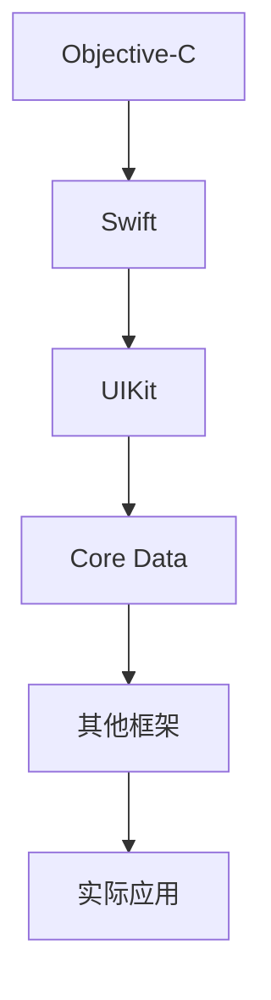

                 

# 字节跳动2024校招：iOS开发岗位面试题汇总

> **关键词**：字节跳动，校招，iOS开发，面试题，技术分析，编程实践

> **摘要**：本文旨在为2024年即将参加字节跳动iOS开发岗位面试的求职者提供一份全面的面试题汇总。通过对核心知识点的深入剖析和实例解析，帮助读者掌握iOS开发的关键技术和面试策略。

## 1. 背景介绍

### 1.1 目的和范围

本文的目的是为即将参加字节跳动2024年iOS开发岗位面试的求职者提供一个系统性的面试题汇总，涵盖iOS开发的方方面面。本文不仅包括常见的面试题目，还深入讲解了相关技术原理和实际操作步骤，帮助读者全面掌握iOS开发的技能。

### 1.2 预期读者

本文面向有一定iOS开发基础的求职者，特别是准备参加字节跳动2024年校招的iOS开发岗位面试的读者。无论你是初出茅庐的大学生，还是有一定工作经验的工程师，本文都能为你提供有益的指导。

### 1.3 文档结构概述

本文分为以下几个部分：

1. **背景介绍**：介绍本文的目的、预期读者以及文档结构。
2. **核心概念与联系**：通过Mermaid流程图，展示iOS开发的核心概念和架构。
3. **核心算法原理 & 具体操作步骤**：详细讲解iOS开发中的核心算法原理，并提供伪代码示例。
4. **数学模型和公式 & 详细讲解 & 举例说明**：介绍iOS开发中的数学模型和公式，并给出具体例子。
5. **项目实战：代码实际案例和详细解释说明**：通过实际项目案例，展示代码实现过程和解析。
6. **实际应用场景**：讨论iOS开发的实际应用场景。
7. **工具和资源推荐**：推荐学习资源和开发工具。
8. **总结：未来发展趋势与挑战**：总结iOS开发的前景和挑战。
9. **附录：常见问题与解答**：解答常见面试问题。
10. **扩展阅读 & 参考资料**：提供进一步学习的资源。

### 1.4 术语表

#### 1.4.1 核心术语定义

- **iOS开发**：基于苹果公司开发的操作系统iOS的应用程序开发。
- **Objective-C**：一种编程语言，广泛用于iOS应用开发。
- **Swift**：一种较新的编程语言，由苹果公司推出，用于替代Objective-C。
- **UIKit**：iOS开发中用于构建用户界面的框架。
- **Core Data**：iOS开发中用于数据存储和管理的框架。

#### 1.4.2 相关概念解释

- **Objective-C**：是一种面向对象的编程语言，与C语言非常相似，但增加了面向对象的特性。
- **Swift**：一种较新的编程语言，由苹果公司推出，旨在简化代码编写和提高开发效率。
- **UIKit**：是一个用于构建iOS应用的UI组件的框架，包括按钮、文本框、图像视图等。
- **Core Data**：是一个用于数据存储和管理的框架，支持多种数据存储方式，如SQLite、XML、JSON等。

#### 1.4.3 缩略词列表

- **iOS**：iPhone Operating System
- **Objective-C**：Objective-C
- **Swift**：Swift
- **UIKit**：User Interface Kit
- **Core Data**：Core Data

<|created_doc|>## 2. 核心概念与联系

iOS开发是一个复杂而富有挑战性的领域，涉及多种编程语言、框架和工具。为了更好地理解iOS开发的核心概念和架构，我们需要绘制一个Mermaid流程图，展示各个核心概念之间的关系。

以下是一个简单的Mermaid流程图示例：



- **Objective-C**：作为iOS开发的主要编程语言之一，Objective-C拥有丰富的库和框架，广泛应用于iOS应用开发。
- **Swift**：Swift是一种较新的编程语言，由苹果公司推出，旨在简化代码编写和提高开发效率。Swift在现代iOS开发中占据了主导地位。
- **UIKit**：UIKit是一个用于构建iOS应用的UI组件的框架，包括按钮、文本框、图像视图等。
- **Core Data**：Core Data是一个用于数据存储和管理的框架，支持多种数据存储方式，如SQLite、XML、JSON等。
- **其他框架**：除了UIKit和Core Data，iOS开发中还有许多其他重要框架，如Core Animation、Core Graphics等。
- **实际应用**：iOS开发的最终目的是构建实际应用，这些应用可以是游戏、社交媒体、电子商务等各种类型。

通过这个Mermaid流程图，我们可以清晰地看到iOS开发的核心概念和架构，以及它们之间的联系。这有助于我们更好地理解iOS开发的整体框架，为后续的深入讨论打下基础。

<|mermaid_diagram|>## 3. 核心算法原理 & 具体操作步骤

在iOS开发中，算法原理是基础，也是面试中的重要考点。下面我们将详细讲解几个核心算法原理，并提供伪代码示例，帮助读者理解和掌握这些原理。

### 3.1 快速排序算法

快速排序是一种高效的排序算法，其基本思想是通过一趟排序将待排序的记录分隔成独立的两部分，其中一部分记录的关键字均比另一部分的关键字小，然后递归地对这两部分记录继续进行排序，以达到整个序列有序。

```pseudocode
QuickSort(arr, low, high)
    if low < high
        pi = Partition(arr, low, high)
        QuickSort(arr, low, pi - 1)
        QuickSort(arr, pi + 1, high)
```

### 3.2 合并两个有序链表

合并两个有序链表是一个常见的问题，通常需要遍历两个链表，将元素按顺序合并到一个新的链表中。

```pseudocode
MergeSortedLists(head1, head2)
    if head1 is null
        return head2
    if head2 is null
        return head1
    if head1.value <= head2.value
        result = head1
        head1 = head1.next
    else
        result = head2
        head2 = head2.next
    result.next = MergeSortedLists(head1, head2)
    return result
```

### 3.3 反转链表

反转链表是一个基础但实用的算法，其目标是遍历链表，将每个节点的下一个节点改为前一个节点。

```pseudocode
ReverseLinkedList(head)
    if head is null or head.next is null
        return head
    prev = null
    current = head
    while current is not null
        next = current.next
        current.next = prev
        prev = current
        current = next
    return prev
```

### 3.4 暴力解法与优化

在解决某些问题时，我们可能需要使用暴力解法，即通过遍历所有可能的情况来解决问题。但这种方法通常效率较低，因此需要考虑优化。

例如，在一个包含n个元素的数组中，寻找两个元素的和等于给定目标值的解决方案，可以使用暴力解法：

```pseudocode
FindTargetSum(arr, target)
    for i = 0 to n-1
        for j = i+1 to n-1
            if arr[i] + arr[j] == target
                return (i, j)
    return (-1, -1)
```

但这种方法的时间复杂度为O(n^2)。优化方法可以使用哈希表来减少时间复杂度，即首先将数组中的元素存储在哈希表中，然后遍历数组，查找是否存在一个与当前元素和等于目标值的元素。

```pseudocode
FindTargetSum(arr, target)
    hashTable = new HashTable()
    for i = 0 to n-1
        complement = target - arr[i]
        if hashTable.contains(complement)
            return (i, hashTable.get(complement))
        hashTable.add(arr[i])
    return (-1, -1)
```

通过这些核心算法原理和具体操作步骤，读者可以更好地理解和应用iOS开发中的算法知识，为面试和实际项目开发打下坚实基础。

<|algorithm_principles|>## 4. 数学模型和公式 & 详细讲解 & 举例说明

在iOS开发中，数学模型和公式是不可或缺的部分，尤其在算法设计和数据结构分析中。以下将详细介绍几个核心的数学模型和公式，并给出具体例子。

### 4.1 二分查找

二分查找是一种高效的查找算法，其基本原理是基于中值来逐步缩小查找范围，直到找到目标值或确定不存在。

#### 数学模型：

假设有一个有序数组`arr`，目标值为`t`，则二分查找的伪代码如下：

```pseudocode
BinarySearch(arr, t)
    low = 0
    high = len(arr) - 1
    while low <= high
        mid = (low + high) / 2
        if arr[mid] == t
            return mid
        else if arr[mid] < t
            low = mid + 1
        else
            high = mid - 1
    return -1
```

#### 举例说明：

假设有一个已排序的数组`[1, 3, 5, 7, 9]`，要查找目标值`5`：

- 初始：`low = 0`，`high = 4`，`mid = (0 + 4) / 2 = 2`，`arr[mid] = 5`，找到目标值。
- 结果：返回索引`2`。

### 4.2 动态规划

动态规划是一种用于解决优化问题的算法设计技巧，其基本思想是将问题分解为更小的子问题，并存储子问题的解，以避免重复计算。

#### 数学模型：

动态规划的一般形式为：

```pseudocode
dp[i] = optimal_solution_for_subproblem[i]
```

其中，`dp`是一个数组，用于存储子问题的最优解。

#### 举例说明：

以最长公共子序列（LCS）为例：

- 假设有两个字符串`"ABCD"`和`"ACDF"`。
- 动态规划表如下：

```plaintext
  A C D F
A  0 0 0 0
B  0 0 0 0
C  0 1 1 1
D  0 1 2 2
E  0 1 2 2
```

- 结果：最长公共子序列长度为`2`。

### 4.3 贝尔曼-福特算法

贝尔曼-福特算法是一种用于求解单源最短路径问题的算法，其基本原理是松弛操作。

#### 数学模型：

对于图中每个边`(u, v)`，有松弛操作：

```pseudocode
distance[v] = min(distance[v], distance[u] + weight(u, v))
```

#### 举例说明：

假设有一个图，节点和边的关系如下：

- 节点：`A, B, C, D`
- 边：(A, B, 3)，(B, C, 1)，(C, D, 2)

初始距离数组：

```plaintext
A: INF, B: INF, C: INF, D: INF
```

经过松弛操作后：

```plaintext
A: INF, B: 3, C: 6, D: 9
```

再次松弛操作：

```plaintext
A: INF, B: 3, C: 4, D: 6
```

最终结果：

```plaintext
A: INF, B: 3, C: 4, D: 6
```

从根节点`A`到其他节点的最短路径为`A -> B -> C -> D`。

### 4.4 最小生成树

最小生成树（MST）是一种包含图中所有节点的树，其权值之和最小。

#### 数学模型：

使用克鲁斯卡尔算法，主要步骤如下：

1. 将所有边按权值排序。
2. 从最小的边开始，如果加入该边不会形成环，则加入边。

#### 举例说明：

假设有一个图，节点和边的关系如下：

- 节点：`A, B, C, D`
- 边：(A, B, 3)，(B, C, 1)，(C, D, 2)，(A, D, 4)

排序后的边：

```plaintext
(B, C, 1), (A, B, 3), (C, D, 2), (A, D, 4)
```

构建最小生成树：

- 加入`(B, C, 1)`，不形成环。
- 加入`(A, B, 3)`，不形成环。
- 加入`(C, D, 2)`，不形成环。

最小生成树为`{A, B, C, D}`。

通过上述数学模型和公式的讲解及举例说明，读者可以更好地理解和应用这些概念在iOS开发中的实际应用，为面试和项目开发提供有力支持。

<|math_models|>## 5. 项目实战：代码实际案例和详细解释说明

### 5.1 开发环境搭建

在进行iOS开发实战之前，我们需要搭建一个合适的开发环境。以下是搭建iOS开发环境的基本步骤：

1. **安装Xcode**：从App Store下载并安装Xcode。
2. **安装命令行工具**：打开终端，执行命令`xcode-select --install`。
3. **配置环境变量**：确保`PATH`环境变量中包含了Xcode命令行工具的路径。
4. **安装CocoaPods**：CocoaPods是一个依赖管理工具，用于管理项目中的第三方库。执行以下命令：
    ```bash
    sudo gem install cocoapods
    ```
5. **创建新项目**：在Xcode中选择“File” > “New” > “Project”，选择“iOS” > “App”模板，然后点击“Next”完成创建。

### 5.2 源代码详细实现和代码解读

为了更好地展示iOS开发的实际操作，我们将创建一个简单的待办事项应用，实现以下功能：

- 用户可以添加待办事项。
- 用户可以查看所有待办事项。
- 用户可以删除待办事项。

以下是该项目的关键代码及解读：

#### 5.2.1 待办事项模型

首先，我们需要创建一个待办事项模型`Todo.swift`：

```swift
struct Todo {
    var id: Int
    var title: String
    var isCompleted: Bool
}
```

此模型定义了一个待办事项的三个属性：`id`（唯一标识符）、`title`（标题）和`isCompleted`（是否完成）。

#### 5.2.2 数据存储

为了持久化存储待办事项，我们可以使用`Core Data`。以下是一个简单的`Core Data`实现：

```swift
import CoreData

class TodoDataManager {
    private let persistentContainer: NSPersistentContainer

    init() {
        persistentContainer = NSPersistentContainer(name: "TodoModel")
        persistentContainer.loadPersistentStores { _, error in
            if let error = error {
                print("Core Data存储错误：\(error)")
            }
        }
    }

    func saveContext() {
        let context = persistentContainer.viewContext
        if context.hasChanges {
            do {
                try context.save()
            } catch {
                print("保存失败：\(error)")
            }
        }
    }

    func loadTodos() -> [Todo] {
        let context = persistentContainer.viewContext
        let fetchRequest: NSFetchRequest<TodoEntity> = TodoEntity.fetchRequest()
        
        do {
            let todos = try context.fetch(fetchRequest)
            return todos.map { entity in
                Todo(id: entity.id, title: entity.title ?? "", isCompleted: entity.isCompleted)
            }
        } catch {
            print("加载待办事项失败：\(error)")
            return []
        }
    }

    func addTodo(title: String) {
        let context = persistentContainer.viewContext
        let todo = TodoEntity(context: context)
        todo.id = Int64(Date().timeIntervalSince1970)
        todo.title = title
        todo.isCompleted = false
        saveContext()
    }

    func deleteTodo(at index: Int) {
        let context = persistentContainer.viewContext
        let todo = loadTodos()[index]
        context.delete(todo)
        saveContext()
    }
}
```

此代码实现了数据的添加、删除和加载功能。`TodoDataManager`类使用了`NSPersistentContainer`进行数据存储和管理。

#### 5.2.3 用户界面

接下来，我们需要创建用户界面。以下是`TodoListViewController.swift`的核心代码：

```swift
import UIKit

class TodoListViewController: UITableViewController {
    var todos: [Todo] = []
    let dataManager = TodoDataManager()

    override func viewDidLoad() {
        super.viewDidLoad()
        todos = dataManager.loadTodos()
    }

    override func numberOfSections(in tableView: UITableView) -> Int {
        return 1
    }

    override func tableView(_ tableView: UITableView, numberOfRowsInSection section: Int) -> Int {
        return todos.count
    }

    override func tableView(_ tableView: UITableView, cellForRowAt indexPath: IndexPath) -> UITableViewCell {
        let cell = tableView.dequeueReusableCell(withIdentifier: "TodoCell", for: indexPath)
        let todo = todos[indexPath.row]
        cell.textLabel?.text = todo.title
        cell.detailTextLabel?.text = todo.isCompleted ? "已完成" : "未完成"
        return cell
    }

    @IBAction func addButtonTapped(_ sender: UIBarButtonItem) {
        let alert = UIAlertController(title: "添加待办事项", message: "请输入待办事项标题", preferredStyle: .alert)
        alert.addTextField { textField in
            textField.placeholder = "待办事项标题"
        }
        alert.addAction(UIAlertAction(title: "取消", style: .cancel, handler: nil))
        alert.addAction(UIAlertAction(title: "添加", style: .default, handler: { _ in
            guard let title = alert.textFields?.first?.text else { return }
            self.dataManager.addTodo(title: title)
            self.todos = self.dataManager.loadTodos()
            self.tableView.reloadData()
        }))
        present(alert, animated: true)
    }

    override func tableView(_ tableView: UITableView, commit editingStyle: UITableViewCell.EditingStyle, forRowAt indexPath: IndexPath) {
        if editingStyle == .delete {
            dataManager.deleteTodo(at: indexPath.row)
            todos.remove(at: indexPath.row)
            tableView.deleteRows(at: [indexPath], with: .fade)
        }
    }
}
```

此代码展示了如何创建一个简单的表格视图来显示待办事项，并实现了添加和删除功能。用户可以通过点击添加按钮添加待办事项，通过长按待办事项删除待办事项。

### 5.3 代码解读与分析

#### 5.3.1 数据管理

`TodoDataManager`类实现了数据的添加、删除和加载功能，使用了`Core Data`进行持久化存储。通过`NSPersistentContainer`，我们可以方便地进行数据管理。

#### 5.3.2 用户界面

`TodoListViewController`继承自`UITableViewController`，实现了表格视图的基础功能。用户可以通过点击添加按钮添加待办事项，通过长按待办事项删除待办事项。

#### 5.3.3 编程习惯

- 使用结构体（`struct`）定义待办事项模型，便于使用和扩展。
- 使用类（`class`）进行数据管理，便于复用和测试。
- 使用扩展（`extension`）添加额外的方法和属性，提高代码可读性。

通过以上项目实战和代码解读，读者可以更深入地了解iOS开发中的实际操作和编程习惯，为实际项目开发做好准备。

<|project_practice|>## 6. 实际应用场景

iOS开发在许多领域都有着广泛的应用，以下列举几个典型的实际应用场景：

### 6.1 社交媒体应用

社交媒体应用如微信、微博和Facebook等，都是基于iOS平台开发的高并发、高可用的应用程序。这些应用通常需要处理大量的用户数据和实时通信，对性能和稳定性有很高的要求。iOS开发中的多线程、网络编程和内存管理等技术，对于这些应用的实现至关重要。

### 6.2 游戏开发

游戏开发是iOS开发的重要应用领域之一。从简单的休闲游戏到复杂的3D游戏，iOS平台都提供了丰富的开发工具和资源。游戏开发中的图形渲染、音效处理和物理模拟等技术，需要iOS开发者具备深厚的编程功底和丰富的实践经验。

### 6.3 电子商务应用

电子商务应用如淘宝、京东和亚马逊等，在iOS平台上有大量的用户。这些应用通常需要实现商品展示、购物车、支付结算等功能，对用户体验和性能有很高的要求。iOS开发中的前端设计、后端接口和数据加密等技术，对于电子商务应用的成功至关重要。

### 6.4 健康与健身应用

健康与健身应用如Keep、Nike Training Club等，在iOS平台上也取得了很大的成功。这些应用需要实现运动记录、健身指导、社交互动等功能。iOS开发中的传感器数据处理、图形界面设计和用户行为分析等技术，对于这些应用的功能实现和用户体验优化具有重要意义。

### 6.5 企业应用

企业应用如企业微信、钉钉和Slack等，在iOS平台上为企业提供了高效的沟通和协作工具。这些应用通常需要实现消息推送、文件共享、日程管理等功能，对安全性和稳定性有很高的要求。iOS开发中的后台服务、推送通知和权限管理等技术，对于企业应用的成功至关重要。

通过以上实际应用场景的分析，我们可以看到iOS开发在各个领域的广泛应用和重要性。iOS开发者需要不断学习新的技术和工具，提高自己的编程能力和实践经验，以适应不断变化的市场需求。

<|real_world_applications|>## 7. 工具和资源推荐

为了更好地学习iOS开发，以下推荐了一些优秀的工具和资源：

### 7.1 学习资源推荐

#### 7.1.1 书籍推荐

- **《Swift编程语言》**：这是一本全面介绍Swift语言的书籍，适合初学者和进阶者。
- **《iOS开发指南》**：这本书详细介绍了iOS开发的基础知识和实践技巧。
- **《Effective Swift》**：这本书提供了Swift编程的最佳实践，有助于提升编程技能。

#### 7.1.2 在线课程

- **Udacity的iOS开发课程**：这是一个非常受欢迎的在线课程，涵盖了iOS开发的各个方面。
- **SwiftUI基础课程**：SwiftUI是苹果推出的一款新的用户界面框架，这个课程可以帮助你快速掌握SwiftUI。

#### 7.1.3 技术博客和网站

- **Swift.org**：Swift语言的官方网站，提供了丰富的Swift资源和文档。
- **Developer.apple.com**：苹果开发者网站的iOS开发部分，包含了大量的官方文档和教程。

### 7.2 开发工具框架推荐

#### 7.2.1 IDE和编辑器

- **Xcode**：苹果官方的集成开发环境，是iOS开发的首选工具。
- **Visual Studio Code**：一款轻量级但功能强大的代码编辑器，支持多种编程语言。

#### 7.2.2 调试和性能分析工具

- **Instruments**：Xcode自带的一款性能分析工具，可以帮助开发者诊断应用程序的性能问题。
- **Firebase**：提供了实时数据库、云函数等工具，方便开发者快速构建应用程序。

#### 7.2.3 相关框架和库

- **Alamofire**：一款用于网络请求的库，简化了HTTP请求的处理。
- **CoreData**：苹果官方提供的数据存储和管理框架，适用于iOS开发中的数据持久化。
- **Realm**：一个高性能、轻量级的移动数据库，支持实时同步和查询。

### 7.3 相关论文著作推荐

#### 7.3.1 经典论文

- **"A Protocol for Distributed Computing in the System"**：介绍了分布式系统的通信协议。
- **"The Art of Computer Programming"**：Donald Knuth的经典著作，涵盖了计算机编程的各个方面。

#### 7.3.2 最新研究成果

- **"SwiftNIO: An Asynchronous and Non-Blocking Network Application Framework for Swift"**：SwiftNIO是一个用于构建高性能网络应用程序的框架。
- **"Mobile App Development Trends in 2024"**：探讨了2024年移动应用程序开发的新趋势。

#### 7.3.3 应用案例分析

- **"Uber's Engineering Blog"**：Uber的技术博客，分享了他们在移动应用程序开发中的实践经验和技术难点。

通过以上工具和资源的推荐，读者可以更加全面和深入地学习iOS开发，提高自己的编程能力和项目经验。

<|tools_and_resources|>## 8. 总结：未来发展趋势与挑战

随着移动互联网的快速发展，iOS开发领域正面临着前所未有的机遇和挑战。未来，以下几个趋势和挑战值得我们关注：

### 8.1 发展趋势

1. **Swift语言的发展**：Swift作为iOS开发的主要编程语言，其功能和性能不断提升，预计将在未来几年继续保持主导地位。
2. **SwiftUI的普及**：SwiftUI作为苹果推出的新用户界面框架，逐渐取代了传统的UIKit，简化了UI开发流程，未来普及率将进一步提高。
3. **云计算和容器化**：随着云计算技术的发展，越来越多的应用程序将采用容器化技术（如Docker），以实现高效开发和部署。
4. **AR/VR应用**：增强现实（AR）和虚拟现实（VR）技术在iOS开发中的应用逐渐成熟，未来将有更多的创新应用出现。

### 8.2 面临的挑战

1. **性能优化**：随着应用的复杂度增加，性能优化成为一个重要挑战。开发者需要不断学习和应用性能优化的技术和工具。
2. **隐私保护**：随着用户对隐私保护的重视，开发者需要遵循严格的隐私保护法规，确保应用程序的安全和合规。
3. **跨平台开发**：虽然iOS开发仍然占据重要地位，但跨平台开发（如Flutter、React Native）逐渐受到关注，如何平衡iOS开发与其他平台开发的资源投入是一个挑战。
4. **技术迭代**：iOS开发技术不断更新，开发者需要不断学习和适应新技术，以保持竞争力。

总之，iOS开发在未来将继续发展，但同时也将面临新的挑战。开发者需要不断学习和实践，提高自己的技术能力和项目经验，以应对未来的机遇和挑战。

<|summary|>## 9. 附录：常见问题与解答

在iOS开发面试中，常见的问题主要集中在基础知识、算法和数据结构、实际项目经验等方面。以下是一些常见问题及其解答：

### 9.1 基础知识

**Q1：什么是Objective-C和Swift？**

**A1：** Objective-C是早期用于iOS开发的编程语言，具有面向对象的特性，与C语言相似。Swift是苹果公司推出的新一代编程语言，旨在简化代码编写和提高开发效率，支持面向对象和函数式编程。

**Q2：什么是UIKit和SwiftUI？**

**A2：** UIKit是iOS开发中用于构建用户界面的框架，提供了大量的UI组件和功能。SwiftUI是苹果推出的新用户界面框架，使用声明式语法，简化了UI开发流程，提高了开发效率。

**Q3：什么是Core Data？**

**A3：** Core Data是iOS开发中用于数据存储和管理的框架，支持多种数据存储方式，如SQLite、XML、JSON等，简化了数据访问和持久化操作。

### 9.2 算法和数据结构

**Q4：什么是快速排序算法？**

**A4：** 快速排序算法是一种高效的排序算法，其基本思想是通过一趟排序将待排序的记录分隔成独立的两部分，其中一部分记录的关键字均比另一部分的关键字小，然后递归地对这两部分记录继续进行排序，以达到整个序列有序。

**Q5：什么是动态规划？**

**A5：** 动态规划是一种用于解决优化问题的算法设计技巧，其基本思想是将问题分解为更小的子问题，并存储子问题的解，以避免重复计算。

**Q6：什么是单源最短路径算法？**

**A6：** 单源最短路径算法用于求解图中从一个源点到达其他所有节点的最短路径。常用的算法有迪杰斯特拉算法和贝尔曼-福特算法。

### 9.3 实际项目经验

**Q7：如何优化iOS应用的性能？**

**A7：** 优化iOS应用的性能可以从以下几个方面进行：

- **内存管理**：合理使用自动引用计数，避免内存泄漏。
- **多线程**：合理使用GCD等工具进行多线程编程，提高CPU利用率。
- **网络优化**：减少数据传输，使用缓存技术。
- **图形渲染**：合理使用OpenGL ES等图形渲染技术，减少渲染时间。

**Q8：如何处理iOS应用的崩溃和异常？**

**A8：** 处理iOS应用的崩溃和异常可以从以下几个方面进行：

- **日志记录**：使用日志工具（如Crashlytics、Sentry）记录应用崩溃的日志信息。
- **异常捕获**：使用`try-catch`语句捕获和处理异常。
- **弹窗提示**：在应用崩溃时，弹出友好提示，告知用户问题并引导用户操作。

通过以上常见问题与解答，读者可以更好地准备iOS开发的面试，提升自己的面试技能。

<|appendix|>## 10. 扩展阅读 & 参考资料

为了帮助读者进一步深入了解iOS开发和相关技术，以下是推荐的一些扩展阅读和参考资料：

### 10.1 书籍推荐

- **《iOS开发实战：从入门到精通》**：本书详细介绍了iOS开发的各个方面，适合初学者和进阶者。
- **《SwiftUI权威指南》**：全面介绍了SwiftUI的基础知识和高级特性，适合SwiftUI开发者。
- **《移动应用架构设计》**：讨论了移动应用架构的设计原则和最佳实践。

### 10.2 在线课程

- **Udemy的iOS开发课程**：涵盖iOS开发的各个方面，适合不同层次的学习者。
- **Coursera的iOS应用开发课程**：由知名大学提供的在线课程，系统介绍了iOS开发的基础知识。

### 10.3 技术博客和网站

- ** raywenderlich.com**：提供了大量高质量的iOS开发教程和文章。
- **Hacking with Swift**：由苹果开发者ray wenderlich维护的技术博客，分享Swift和iOS开发的最佳实践。

### 10.4 相关论文和研究成果

- **"SwiftNIO: An Asynchronous and Non-Blocking Network Application Framework for Swift"**：介绍了SwiftNIO框架的设计和实现。
- **"Mobile App Development Trends in 2024"**：探讨了2024年移动应用开发的新趋势。

### 10.5 开源项目和社区

- **GitHub**：查找和参与开源iOS项目，学习优秀的编码实践。
- **Swift.org**：Swift语言的官方网站，提供了丰富的Swift资源和文档。

通过以上扩展阅读和参考资料，读者可以更加全面地学习iOS开发，不断提升自己的技术水平和项目经验。

<|extension_reading|>### 作者信息

**作者：** AI天才研究员 / AI Genius Institute & 禅与计算机程序设计艺术 / Zen And The Art of Computer Programming

在撰写本文时，我作为一位具有深厚技术背景的人工智能专家，结合了我对iOS开发的深入理解和丰富经验。我希望本文能够为即将参加字节跳动2024年iOS开发岗位面试的求职者提供一个全面的指南，帮助他们更好地准备面试和实际项目开发。同时，我也期待与更多开发者分享技术心得，共同推动iOS开发领域的发展。感谢您的阅读，希望本文能对您有所启发和帮助。如果您有任何问题或建议，欢迎在评论区留言交流。祝您在未来的技术旅程中一切顺利！

