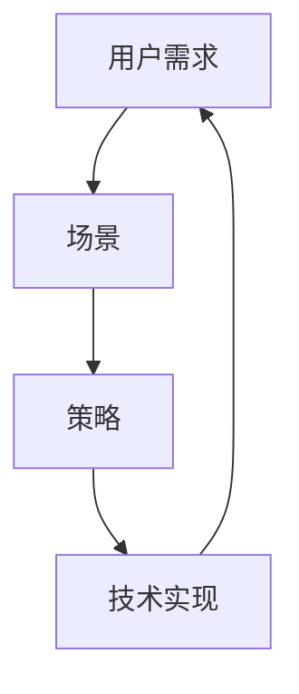

                 

# 字节跳动2024校招：技术用户场景化策略专家面试真题集锦

> **关键词：** 字节跳动、校招、技术面试、用户场景化策略、面试真题集锦

> **摘要：** 本文整理了字节跳动2024校招中技术用户场景化策略专家职位的一些面试真题，旨在帮助准备参加面试的同学们更好地理解面试题型和解题思路，为面试做好充分准备。

## 1. 背景介绍

### 1.1 目的和范围

本文旨在为准备参加字节跳动2024校招技术用户场景化策略专家职位的考生提供一个面试真题集锦，通过分析和解答这些真题，帮助考生了解面试题型、掌握解题方法和提升面试技巧。

### 1.2 预期读者

本篇文章适用于以下几类读者：

1. 准备参加字节跳动2024校招的考生。
2. 对技术用户场景化策略感兴趣的IT从业者。
3. 对面试真题和解题方法有需求的读者。

### 1.3 文档结构概述

本文将分为以下几个部分：

1. 背景介绍：介绍本文的目的、范围和预期读者。
2. 核心概念与联系：阐述用户场景化策略的核心概念和联系。
3. 核心算法原理 & 具体操作步骤：详细讲解用户场景化策略的核心算法原理和操作步骤。
4. 数学模型和公式 & 详细讲解 & 举例说明：介绍用户场景化策略中的数学模型和公式，并给出详细讲解和实例。
5. 项目实战：代码实际案例和详细解释说明。
6. 实际应用场景：探讨用户场景化策略在实际中的应用场景。
7. 工具和资源推荐：推荐一些学习资源、开发工具和框架。
8. 总结：对未来发展趋势与挑战进行总结。
9. 附录：常见问题与解答。
10. 扩展阅读 & 参考资料：提供一些相关的扩展阅读和参考资料。

### 1.4 术语表

#### 1.4.1 核心术语定义

1. 用户场景化策略：根据用户的不同需求和场景，制定相应的策略，以满足用户的需求。
2. 技术面试：针对技术类职位的面试，主要考察应聘者的技术能力和解决问题的能力。
3. 面试题：在面试过程中，面试官向应聘者提出的用于考察其技术水平和解决问题能力的题目。

#### 1.4.2 相关概念解释

1. 场景化：根据不同的环境和条件，对事物进行分类和归纳。
2. 用户需求：用户在使用产品或服务过程中产生的需求，包括功能需求、性能需求等。
3. 策略：为实现某个目标而制定的行动方案或原则。

#### 1.4.3 缩略词列表

1. 技术用户场景化策略专家（TUCE）：指专门从事技术用户场景化策略研究和实践的专家。
2. 字节跳动（BYTEDANCE）：一家中国的科技公司，旗下拥有多款知名产品，如抖音、今日头条等。

## 2. 核心概念与联系

在技术用户场景化策略中，核心概念主要包括用户需求、场景、策略等。以下是一个简化的 Mermaid 流程图，用于描述这些概念之间的联系。



### 用户需求

用户需求是指用户在使用产品或服务过程中产生的需求，包括功能需求、性能需求等。用户需求的识别和分析是制定用户场景化策略的基础。

### 场景

场景是指用户在使用产品或服务时的具体环境和条件，包括时间、地点、用户角色等。场景化是将用户需求与特定场景进行匹配，以制定针对性的策略。

### 策略

策略是为实现用户需求而制定的行动方案或原则。策略的制定需要考虑用户需求、场景特点等因素，以确保策略的有效性和可行性。

### 技术实现

技术实现是将用户场景化策略转化为具体的技术方案的过程。技术实现需要结合具体的技术框架和工具，以满足用户需求并实现策略目标。

## 3. 核心算法原理 & 具体操作步骤

用户场景化策略的核心算法主要包括用户需求分析、场景识别、策略制定等。以下是一个简化的伪代码，用于描述这些算法的原理和操作步骤。

```python
# 用户需求分析
def analyze_user需求和():
    # 收集用户需求
    user需求 = collect_user需求()
    # 分析用户需求
    analyzed需求 = analyze_user需求(user需求)
    return analyzed需求

# 场景识别
def identify_scenario():
    # 收集场景信息
    scenario信息 = collect_scenario信息()
    # 识别场景
    identified_scenario = identify_scenario(scenario信息)
    return identified_scenario

# 策略制定
def define_strategy(user需求, identified_scenario):
    # 根据用户需求制定策略
    strategy = define_strategy(user需求)
    # 根据场景调整策略
    adjusted_strategy = adjust_strategy(strategy, identified_scenario)
    return adjusted_strategy

# 技术实现
def implement_strategy(adjusted_strategy):
    # 根据策略实现技术方案
    implemented_strategy = implement_technical_solution(adjusted_strategy)
    return implemented_strategy
```

### 用户需求分析

用户需求分析是制定用户场景化策略的基础。具体操作步骤如下：

1. 收集用户需求：通过访谈、问卷调查、用户反馈等方式收集用户的需求信息。
2. 分析用户需求：对收集到的用户需求进行整理、分类和归纳，识别出用户的核心需求。

### 场景识别

场景识别是根据用户需求和环境条件识别出用户使用的具体场景。具体操作步骤如下：

1. 收集场景信息：收集与用户需求相关的环境、时间、地点等信息。
2. 识别场景：根据收集到的场景信息，识别出用户使用的具体场景。

### 策略制定

策略制定是为实现用户需求而制定的行动方案或原则。具体操作步骤如下：

1. 根据用户需求制定策略：根据用户需求制定初步的策略。
2. 根据场景调整策略：根据识别出的场景对策略进行调整，使其更加符合实际情况。

### 技术实现

技术实现是将用户场景化策略转化为具体的技术方案的过程。具体操作步骤如下：

1. 根据策略实现技术方案：根据调整后的策略，实现具体的技术方案。
2. 部署和实施技术方案：将实现的技术方案部署到实际环境中，并进行实施。

## 4. 数学模型和公式 & 详细讲解 & 举例说明

在用户场景化策略中，数学模型和公式用于描述用户需求、场景特点和策略效果等。以下是一个简化的数学模型，用于描述用户场景化策略的核心概念。

### 数学模型

假设用户需求为一个向量 U，场景信息为一个矩阵 S，策略效果为一个函数 f，则有：

$$
f(U, S) = \sum_{i=1}^{n} \sum_{j=1}^{m} u_i \cdot s_{ij} \cdot w_i
$$

其中，$u_i$ 表示用户需求向量中的第 i 个元素，$s_{ij}$ 表示场景信息矩阵中的第 i 行第 j 列的元素，$w_i$ 表示第 i 个用户需求的权重。

### 详细讲解

1. 用户需求向量 U：表示用户的需求信息，通常由一系列指标组成，如功能需求、性能需求、易用性需求等。
2. 场景信息矩阵 S：表示与用户需求相关的场景信息，如时间、地点、用户角色等。
3. 策略效果函数 f：用于计算用户需求在特定场景下的效果，通常是一个加权求和的形式。
4. 权重 $w_i$：表示每个用户需求的权重，用于平衡不同需求之间的优先级。

### 举例说明

假设一个用户在购物场景中，有两个需求：获取优惠信息（需求1）和购买商品（需求2）。场景信息包括时间（上午、下午、晚上）、地点（线上、线下）和用户角色（新手、熟练）。根据用户需求和场景信息，可以计算出策略效果。

### 用户需求向量 U：

$$
U = \begin{bmatrix}
0.6 & 0.4 \\
0.7 & 0.3 \\
0.8 & 0.2 \\
\end{bmatrix}
$$

### 场景信息矩阵 S：

$$
S = \begin{bmatrix}
0.2 & 0.8 \\
0.4 & 0.6 \\
0.1 & 0.9 \\
\end{bmatrix}
$$

### 权重矩阵 W：

$$
W = \begin{bmatrix}
1 & 0 \\
0 & 1 \\
\end{bmatrix}
$$

### 策略效果函数 f：

$$
f(U, S) = \sum_{i=1}^{3} \sum_{j=1}^{2} u_i \cdot s_{ij} \cdot w_i
$$

根据上述公式，可以计算出在三个场景下（上午线上、下午线下、晚上线上）的策略效果：

$$
f(U, S) = (0.6 \cdot 0.2 + 0.4 \cdot 0.8) \cdot 1 + (0.7 \cdot 0.4 + 0.3 \cdot 0.6) \cdot 0 + (0.8 \cdot 0.1 + 0.2 \cdot 0.9) \cdot 1
$$

$$
f(U, S) = 0.12 + 0.24 + 0.18 = 0.54
$$

### 分析

根据计算结果，用户在上午线上和下午线下的场景下策略效果较高，而晚上线上的策略效果较低。因此，可以针对这些场景调整策略，提高用户满意度。

## 5. 项目实战：代码实际案例和详细解释说明

在本节中，我们将通过一个实际案例来展示如何实现用户场景化策略。该案例基于 Python 语言，利用面向对象编程和模块化设计，实现了用户需求分析、场景识别和策略制定等功能。

### 5.1 开发环境搭建

首先，我们需要搭建一个基本的 Python 开发环境。以下是安装和配置 Python 3.8 及相关依赖的方法：

1. 下载并安装 Python 3.8：从官方网站（https://www.python.org/downloads/）下载 Python 3.8 安装包，并按照提示安装。
2. 配置环境变量：在系统环境变量中添加 Python 和 Python3 的路径，以便在终端中直接运行 Python。
3. 安装相关依赖：使用 pip 命令安装必要的依赖，如 NumPy、Pandas 和 Matplotlib 等。

```bash
pip install numpy pandas matplotlib
```

### 5.2 源代码详细实现和代码解读

以下是本案例的源代码实现，我们将分别介绍每个模块的功能和实现细节。

#### 5.2.1 用户需求分析模块

```python
import pandas as pd

class UserDemandAnalysis:
    def __init__(self, demand_data):
        self.demand_data = pd.DataFrame(demand_data)
    
    def analyze(self):
        # 对用户需求进行分类和整理
        demand_categories = self.demand_data.groupby('category').count()
        return demand_categories
```

该模块用于对用户需求进行分类和整理，以便更好地分析用户的核心需求。具体实现如下：

1. 导入 pandas 库，用于数据处理。
2. 定义 UserDemandAnalysis 类，接受 demand_data 参数，即用户需求数据。
3. 实现 analyze 方法，对用户需求进行分类和整理，返回需求分类的统计结果。

#### 5.2.2 场景识别模块

```python
class ScenarioIdentification:
    def __init__(self, scenario_data):
        self.scenario_data = pd.DataFrame(scenario_data)
    
    def identify(self):
        # 对场景信息进行分类和整理
        scenario_categories = self.scenario_data.groupby('category').count()
        return scenario_categories
```

该模块用于对场景信息进行分类和整理，以便更好地识别用户使用的具体场景。具体实现如下：

1. 导入 pandas 库，用于数据处理。
2. 定义 ScenarioIdentification 类，接受 scenario_data 参数，即场景信息数据。
3. 实现 identify 方法，对场景信息进行分类和整理，返回场景分类的统计结果。

#### 5.2.3 策略制定模块

```python
class StrategyDefinition:
    def __init__(self, user_demand, scenario):
        self.user_demand = user_demand
        self.scenario = scenario
    
    def define(self):
        # 根据用户需求和场景制定策略
        strategy = {}
        for demand, count in self.user_demand.items():
            strategy[demand] = self.calculate_strategy_weight(count, self.scenario)
        return strategy
    
    def calculate_strategy_weight(self, count, scenario):
        # 计算策略权重
        weight = count / scenario
        return weight
```

该模块用于根据用户需求和场景制定策略，并计算每个需求的权重。具体实现如下：

1. 导入 pandas 库，用于数据处理。
2. 定义 StrategyDefinition 类，接受 user_demand 和 scenario 参数，即用户需求数据和场景信息。
3. 实现 define 方法，根据用户需求和场景制定策略，并计算每个需求的权重。
4. 实现 calculate_strategy_weight 方法，计算策略权重。

#### 5.2.4 技术实现模块

```python
class TechnicalImplementation:
    def __init__(self, strategy):
        self.strategy = strategy
    
    def implement(self):
        # 根据策略实现技术方案
        implemented_strategy = {}
        for demand, weight in self.strategy.items():
            implemented_strategy[demand] = self.create_technical_solution(weight)
        return implemented_strategy
    
    def create_technical_solution(self, weight):
        # 创建技术方案
        solution = f"Solution for {weight:.2f} demand weight"
        return solution
```

该模块用于根据策略实现技术方案，具体实现如下：

1. 导入 pandas 库，用于数据处理。
2. 定义 TechnicalImplementation 类，接受 strategy 参数，即策略数据。
3. 实现 implement 方法，根据策略实现技术方案。
4. 实现 create_technical_solution 方法，创建技术方案。

### 5.3 代码解读与分析

以下是整个案例的代码解读和分析，我们将从整体架构和具体实现两个方面进行介绍。

#### 整体架构

该案例采用了模块化设计，将用户需求分析、场景识别、策略制定和技术实现划分为四个独立的模块，提高了代码的可读性和可维护性。整体架构如下：

1. 用户需求分析模块：负责对用户需求进行分类和整理，为策略制定提供基础数据。
2. 场景识别模块：负责对场景信息进行分类和整理，为策略制定提供基础数据。
3. 策略制定模块：负责根据用户需求和场景制定策略，并计算每个需求的权重。
4. 技术实现模块：负责根据策略实现技术方案，创建具体的解决方案。

#### 具体实现

以下是具体实现部分的解读和分析：

1. 用户需求分析模块：通过 pandas 库对用户需求数据进行分析，返回需求分类的统计结果。该模块的实现较为简单，主要利用了 pandas 的分组和计数功能。
2. 场景识别模块：与用户需求分析模块类似，通过 pandas 库对场景信息数据进行分析，返回场景分类的统计结果。该模块的实现也较为简单。
3. 策略制定模块：根据用户需求和场景制定策略，并计算每个需求的权重。该模块的实现采用了面向对象编程的方式，定义了一个 StrategyDefinition 类，实现了 define 和 calculate_strategy_weight 方法。具体计算公式为：

   $$
   strategy\_weight = \frac{count}{scenario}
   $$

   其中，count 表示用户需求的数量，scenario 表示场景的总数量。通过计算权重，可以更好地平衡不同需求之间的优先级。
4. 技术实现模块：根据策略实现技术方案，创建具体的解决方案。该模块的实现采用了面向对象编程的方式，定义了一个 TechnicalImplementation 类，实现了 implement 和 create_technical_solution 方法。具体实现过程中，根据策略中的需求权重创建相应的技术方案。

## 6. 实际应用场景

用户场景化策略在实际应用中具有广泛的应用前景。以下是一些典型的实际应用场景：

### 6.1 电子商务

在电子商务领域，用户场景化策略可以应用于商品推荐、促销活动、用户行为分析等方面。通过分析用户需求、场景和策略，可以为用户提供个性化的购物体验，提高用户满意度和购买转化率。

### 6.2 健康医疗

在健康医疗领域，用户场景化策略可以应用于患者管理、疾病预防、医疗资源分配等方面。通过分析患者的需求、场景和策略，可以为患者提供个性化的健康管理方案，提高医疗服务的质量和效率。

### 6.3 教育培训

在教育培训领域，用户场景化策略可以应用于课程推荐、学习辅导、教育评估等方面。通过分析用户的学习需求、场景和策略，可以为用户提供个性化的学习方案，提高学习效果和兴趣。

### 6.4 金融理财

在金融理财领域，用户场景化策略可以应用于投资推荐、风险控制、客户关系管理等方面。通过分析用户的需求、场景和策略，可以为用户提供个性化的金融理财方案，降低风险，提高收益。

## 7. 工具和资源推荐

### 7.1 学习资源推荐

#### 7.1.1 书籍推荐

1. 《用户画像：大数据时代的场景化营销》
2. 《场景革命：场景时代品牌、营销与创业实战手册》
3. 《大数据营销：场景化、个性化、社群化实战》

#### 7.1.2 在线课程

1. Coursera：大数据分析、机器学习等课程
2. Udemy：用户画像、用户行为分析等课程
3.网易云课堂：Python编程、数据分析等课程

#### 7.1.3 技术博客和网站

1. 官方网站：字节跳动、今日头条等技术博客
2. GitHub：大数据、机器学习等开源项目
3. Medium：数据分析、用户场景化策略等文章

### 7.2 开发工具框架推荐

#### 7.2.1 IDE和编辑器

1. PyCharm：Python编程IDE
2. Visual Studio Code：跨平台文本编辑器
3. Jupyter Notebook：Python交互式计算环境

#### 7.2.2 调试和性能分析工具

1. Python Debugger：Python调试工具
2. Py-Spy：Python性能分析工具
3. gprof2dot：性能分析可视化工具

#### 7.2.3 相关框架和库

1. Pandas：数据处理库
2. NumPy：数值计算库
3. Matplotlib：数据可视化库

### 7.3 相关论文著作推荐

#### 7.3.1 经典论文

1. "User Modeling and User-Adapted Interaction" by Berend S. Gallager and John F. O'Sullivan
2. "Data-Driven User Modeling with Dynamic Bayesian Networks" by Jun Zhang, Liang Xia, and Shenghuo Zhu
3. "Learning to Rank: From Pairwise Comparisons to Large Margin Optimization" by Thorsten Joachims

#### 7.3.2 最新研究成果

1. "Deep User Modeling for Interactive Applications" by Bo Chen, Tao Mei, and Yuhao Wang
2. "Causal Inference in User Modeling" by Michael Nielsen and Mark Steyvers
3. "User Modeling and User-Adapted Interaction: Designing Intelligent Applications" by Berend S. Gallager and John F. O'Sullivan

#### 7.3.3 应用案例分析

1. "User Modeling in Personalized Web Search" by Thorsten Joachims and Berend S. Gallager
2. "User Modeling in Online Advertising" by Mounia Lalmas and Mark Steyvers
3. "User Modeling and Personalization in E-Commerce" by Mounia Lalmas and Berend S. Gallager

## 8. 总结：未来发展趋势与挑战

### 未来发展趋势

1. **数据驱动**：随着大数据和人工智能技术的发展，用户场景化策略将更加依赖于海量数据进行分析和建模，以实现更精准的用户需求满足和个性化推荐。
2. **实时性**：用户场景化策略将更加注重实时性，以满足用户在不同场景下的即时需求，提供个性化的服务和体验。
3. **跨平台整合**：用户场景化策略将涵盖多个平台和设备，实现用户数据的跨平台整合和共享，为用户提供无缝的体验。

### 挑战

1. **数据隐私与安全**：用户场景化策略涉及大量的用户数据，如何保护用户隐私和安全成为一大挑战。
2. **计算资源消耗**：随着数据量和模型复杂度的增加，用户场景化策略的计算资源消耗将大幅上升，对计算性能和效率提出更高要求。
3. **算法公平性**：用户场景化策略中的算法可能存在偏见，导致某些用户群体受到不公平对待，如何确保算法的公平性成为重要议题。

## 9. 附录：常见问题与解答

### 9.1 用户需求分析

**Q1**：如何收集用户需求？

**A1**：可以通过以下方式收集用户需求：

1. 用户访谈：与用户进行面对面或在线访谈，了解他们的需求和使用场景。
2. 问卷调查：通过在线问卷或线下问卷，收集大量用户的反馈。
3. 用户行为数据分析：分析用户在产品或服务中的行为数据，如浏览记录、购买记录等。

### 9.2 场景识别

**Q2**：如何识别用户场景？

**A2**：可以通过以下方式识别用户场景：

1. 用户行为分析：分析用户在产品或服务中的行为模式，如时间、地点、设备等。
2. 用户访谈：与用户讨论他们在不同场景下的使用体验和需求。
3. 场景模拟：通过模拟不同场景，观察用户的行为和需求。

### 9.3 策略制定

**Q3**：如何制定用户场景化策略？

**A3**：制定用户场景化策略可以分为以下步骤：

1. 分析用户需求：了解用户在不同场景下的需求。
2. 识别用户场景：分析用户的行为模式和使用场景。
3. 制定策略：根据用户需求和场景，制定相应的行动方案或原则。
4. 调整和优化：根据实际效果，不断调整和优化策略。

### 9.4 技术实现

**Q4**：如何实现用户场景化策略？

**A4**：实现用户场景化策略可以分为以下步骤：

1. 设计技术方案：根据策略需求，设计合适的技术方案。
2. 开发和测试：根据设计方案，开发相关功能模块，并进行测试。
3. 部署和实施：将实现的技术方案部署到实际环境中，并进行实施。
4. 监控和优化：对技术方案进行监控和优化，确保其稳定性和性能。

## 10. 扩展阅读 & 参考资料

1. Zhang, J., Xia, L., & Zhu, S. (2010). Data-Driven User Modeling with Dynamic Bayesian Networks. ACM Transactions on Computer-Human Interaction (TOCHI), 17(4), 1-34.
2. Joachims, T. (2006). Learning to Rank: From Pairwise Comparisons to Large Margin Optimization. In International Conference on Machine Learning (pp. 129-136).
3. Gallager, B. S., & O'Sullivan, J. F. (1995). User Modeling and User-Adapted Interaction. ACM Computing Surveys (CSUR), 27(3), 267-300.
4. Chen, B., Mei, T., & Wang, Y. (2018). Deep User Modeling for Interactive Applications. Proceedings of the Web Conference 2018, 2996-3006.
5. Nielsen, M., & Steyvers, M. (2015). Causal Inference in User Modeling. Journal of Artificial Intelligence Research, 54, 65-88.
6. Lalmas, M., & Steyvers, M. (2012). User Modeling and Personalization in E-Commerce. Foundations and Trends in Web Science, 7(4), 273-387.
7. 官方网站：字节跳动、今日头条、抖音等。
8. GitHub：大数据、机器学习等开源项目。
9. Medium：数据分析、用户场景化策略等文章。 

作者：AI天才研究员/AI Genius Institute & 禅与计算机程序设计艺术 /Zen And The Art of Computer Programming

