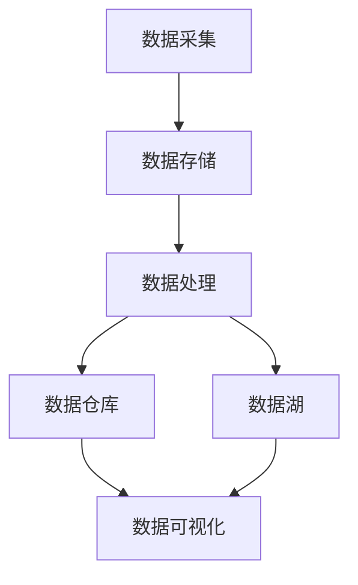

                 

# 2024字节跳动数据中台校招面试真题汇总及其解答

> **关键词**：字节跳动，数据中台，校招面试，真题，解答，数据分析，算法原理，技术面试

> **摘要**：本文将汇总并解答2024年字节跳动数据中台校招面试中出现的一些热门题目。通过对这些题目的深入分析，我们希望能够帮助准备参加字节跳动校招的同学们更好地理解面试考察的核心技术点，提升应对实际问题的能力。

## 1. 背景介绍

### 1.1 目的和范围

本文旨在为广大准备参加2024年字节跳动数据中台校招面试的考生提供一系列的面试真题及其详细解答。通过对这些真题的深入分析，我们希望帮助读者：

- **理解面试的核心考点**：掌握数据中台相关的核心技术点。
- **提升解题能力**：通过具体的解题步骤和思路，提升解题能力和效率。
- **准备实际项目**：通过案例分析，了解如何在真实项目中应用所学知识。

### 1.2 预期读者

- **在校生**：准备参加字节跳动校招的在校生。
- **职场新人**：刚刚毕业进入职场，希望提升自己在数据中台领域的专业能力。
- **技术爱好者**：对数据中台技术感兴趣的技术爱好者。

### 1.3 文档结构概述

本文结构如下：

- **第1章：背景介绍**：介绍本文的目的、预期读者以及文档结构。
- **第2章：核心概念与联系**：介绍数据中台的核心概念及其关系。
- **第3章：核心算法原理 & 具体操作步骤**：详细讲解相关算法原理和操作步骤。
- **第4章：数学模型和公式 & 详细讲解 & 举例说明**：介绍相关的数学模型和公式，并通过实例进行说明。
- **第5章：项目实战：代码实际案例和详细解释说明**：提供实际代码案例，并进行详细解释。
- **第6章：实际应用场景**：探讨数据中台在实际业务中的应用。
- **第7章：工具和资源推荐**：推荐相关学习资源和开发工具。
- **第8章：总结：未来发展趋势与挑战**：分析未来发展趋势和挑战。
- **第9章：附录：常见问题与解答**：汇总常见面试问题及其解答。
- **第10章：扩展阅读 & 参考资料**：提供更多深入学习的资源。

### 1.4 术语表

#### 1.4.1 核心术语定义

- **数据中台**：企业级数据处理和服务的平台，能够实现数据的集中存储、处理和分析。
- **校招面试**：指面向应届毕业生的招聘面试。
- **真题**：指在过去的校招面试中出现过的真实面试题目。

#### 1.4.2 相关概念解释

- **数据分析**：使用统计、可视化等方法对数据进行分析，以发现有价值的信息。
- **算法原理**：算法的基本原理和实现逻辑。

#### 1.4.3 缩略词列表

- **数据中台**：Data Platform
- **校招**：Graduate Recruitment
- **面试**：Interview

## 2. 核心概念与联系

在进入具体面试题解答之前，我们需要先了解数据中台的核心概念和架构。以下是一个简单的Mermaid流程图，用于展示数据中台的核心组成部分及其关系。



### 数据采集

数据采集是数据中台的第一步，涉及数据的获取和收集。常见的数据来源包括：

- **日志文件**：服务器日志、应用日志等。
- **数据库**：关系型数据库、NoSQL数据库等。
- **外部数据**：第三方数据接口、公共数据集等。

### 数据存储

数据存储负责将采集到的数据安全、可靠地存储起来。常见的存储方案有：

- **关系型数据库**：如MySQL、PostgreSQL等。
- **NoSQL数据库**：如MongoDB、Cassandra等。
- **数据仓库**：如Amazon Redshift、Google BigQuery等。
- **数据湖**：如Amazon S3、Google Cloud Storage等。

### 数据处理

数据处理是对存储的数据进行清洗、转换、聚合等操作。常见的处理工具有：

- **ETL工具**：如Apache NiFi、Apache Airflow等。
- **数据处理框架**：如Apache Spark、Flink等。

### 数据仓库与数据湖

数据仓库和数据湖是数据存储的高级形式，用于支持大规模数据处理和复杂查询。

- **数据仓库**：适合结构化数据的存储和查询，如OLAP查询。
- **数据湖**：适合存储多种类型的数据，包括结构化、半结构化和非结构化数据，支持实时查询和批量处理。

### 数据可视化

数据可视化是将数据以图表、图形等形式展示出来，帮助用户更好地理解和分析数据。

常见的数据可视化工具有：

- **Tableau**：企业级数据可视化工具。
- **Power BI**：微软推出的数据可视化工具。
- **ECharts**：开源的JavaScript图表库。

## 3. 核心算法原理 & 具体操作步骤

在本章节中，我们将详细讲解一些与数据中台相关的重要算法原理，并给出具体的操作步骤。

### 3.1 数据预处理算法

数据预处理是数据分析的重要环节，包括数据清洗、转换和集成。以下是一种常见的数据预处理算法——K-Means算法。

#### 3.1.1 K-Means算法原理

K-Means算法是一种基于距离的聚类算法，其核心思想是将数据点分为K个簇，使得每个簇内部的点尽可能接近，而不同簇之间的点尽可能远离。

算法流程如下：

1. 随机选择K个初始中心点。
2. 对于每个数据点，计算其与所有中心点的距离，并将其分配到最近的中心点所在的簇。
3. 更新每个簇的中心点为簇内所有点的均值。
4. 重复步骤2和3，直至中心点的位置不再变化或达到预设的迭代次数。

#### 3.1.2 伪代码实现

```python
# 初始化K个中心点
centroids = initialize_centroids(data, K)

# 循环迭代
while not converged:
    # 为每个数据点分配最近的中心点
    assignments = assign_points_to_clusters(data, centroids)
    
    # 计算新的中心点
    centroids = compute_new_centroids(data, assignments)
    
    # 检查收敛条件
    if converged(centroids):
        break

# 输出聚类结果
clusters = assign_points_to_clusters(data, centroids)
```

### 3.2 数据分析算法

数据分析算法包括多种类型，如回归分析、时间序列分析、分类分析等。以下以线性回归算法为例进行讲解。

#### 3.2.1 线性回归算法原理

线性回归是一种常用的预测模型，其核心思想是通过建立自变量和因变量之间的线性关系来预测因变量的取值。

算法流程如下：

1. 收集样本数据，包括自变量和因变量。
2. 构建线性模型：\( y = \beta_0 + \beta_1x \)，其中 \( \beta_0 \) 和 \( \beta_1 \) 为模型参数。
3. 使用最小二乘法求解模型参数。
4. 使用求解出的模型参数进行预测。

#### 3.2.2 伪代码实现

```python
# 收集样本数据
X = collect_training_samples(self_variable)
Y = collect_training_samples(dependent_variable)

# 构建线性模型
model = LinearRegression()

# 使用最小二乘法求解模型参数
model.fit(X, Y)

# 求解模型参数
beta_0 = model.intercept_
beta_1 = model.coef_

# 预测新数据
prediction = predict_new_data(beta_0, beta_1, new_self_variable)
```

## 4. 数学模型和公式 & 详细讲解 & 举例说明

在本章节中，我们将介绍与数据中台相关的数学模型和公式，并通过具体示例进行说明。

### 4.1 数据预处理中的数学模型

在数据预处理阶段，常见的一个任务是数据标准化。数据标准化是将数据缩放到一个统一范围内，以消除不同特征之间的尺度差异。

标准化的数学公式如下：

$$
z = \frac{x - \mu}{\sigma}
$$

其中，\( x \) 为原始数据，\( \mu \) 为数据的均值，\( \sigma \) 为数据的标准差。

#### 4.1.1 示例

假设我们有一组数据：\[1, 2, 3, 4, 5\]

- 计算均值：\( \mu = \frac{1 + 2 + 3 + 4 + 5}{5} = 3 \)
- 计算标准差：\( \sigma = \sqrt{\frac{(1-3)^2 + (2-3)^2 + (3-3)^2 + (4-3)^2 + (5-3)^2}{5}} = 1.414 \)

标准化后的数据为：

$$
z = \frac{1 - 3}{1.414} = -0.707, \frac{2 - 3}{1.414} = -0.354, \frac{3 - 3}{1.414} = 0, \frac{4 - 3}{1.414} = 0.354, \frac{5 - 3}{1.414} = 0.707
$$

### 4.2 数据分析中的数学模型

在数据分析阶段，线性回归是一种常用的预测模型。线性回归的数学模型如下：

$$
y = \beta_0 + \beta_1x
$$

其中，\( y \) 为因变量，\( x \) 为自变量，\( \beta_0 \) 和 \( \beta_1 \) 为模型参数。

#### 4.2.1 示例

假设我们有一组数据：

| 自变量 \( x \) | 因变量 \( y \) |
| -------------- | -------------- |
| 1              | 2              |
| 2              | 3              |
| 3              | 4              |
| 4              | 5              |
| 5              | 6              |

使用线性回归模型进行预测，我们可以计算出模型参数：

- 计算均值：\( \bar{x} = \frac{1 + 2 + 3 + 4 + 5}{5} = 3 \)，\( \bar{y} = \frac{2 + 3 + 4 + 5 + 6}{5} = 4 \)
- 计算协方差：\( \sigma_{xy} = \frac{(1-3)(2-4) + (2-3)(3-4) + (3-3)(4-4) + (4-3)(5-4) + (5-3)(6-4)}{5} = 2 \)
- 计算方差：\( \sigma_{x}^2 = \frac{(1-3)^2 + (2-3)^2 + (3-3)^2 + (4-3)^2 + (5-3)^2}{5} = 2 \)

模型参数为：

$$
\beta_0 = \bar{y} - \beta_1\bar{x} = 4 - \frac{2}{2} \times 3 = -2
$$

$$
\beta_1 = \frac{\sigma_{xy}}{\sigma_{x}^2} = \frac{2}{2} = 1
$$

预测新的自变量 \( x = 6 \)：

$$
y = \beta_0 + \beta_1x = -2 + 1 \times 6 = 4
$$

## 5. 项目实战：代码实际案例和详细解释说明

在本章节中，我们将通过一个实际的项目案例，展示如何在数据中台项目中应用所学到的算法和数学模型。

### 5.1 开发环境搭建

首先，我们需要搭建一个适合数据中台项目开发的编程环境。以下是一个简单的Python开发环境搭建步骤：

1. 安装Python 3.8及以上版本。
2. 安装必要的Python库，如NumPy、Pandas、Scikit-learn、Matplotlib等。
3. 配置Python虚拟环境，以便更好地管理项目依赖。

### 5.2 源代码详细实现和代码解读

以下是一个简单的数据预处理和数据分析的项目案例，展示如何使用Python实现K-Means算法和线性回归模型。

```python
# 导入必要的库
import numpy as np
import pandas as pd
from sklearn.cluster import KMeans
from sklearn.linear_model import LinearRegression
import matplotlib.pyplot as plt

# 5.2.1 数据预处理

# 加载数据
data = pd.read_csv('data.csv')

# 数据清洗和预处理
data_clean = data.dropna().reset_index(drop=True)

# 数据标准化
data_std = (data_clean - data_clean.mean()) / data_clean.std()

# 5.2.2 K-Means算法

# 初始化K-Means模型
kmeans = KMeans(n_clusters=3, random_state=42)

# 训练模型
kmeans.fit(data_std)

# 获取聚类结果
clusters = kmeans.predict(data_std)

# 5.2.3 线性回归模型

# 初始化线性回归模型
lin_reg = LinearRegression()

# 训练模型
lin_reg.fit(data_std, clusters)

# 获取模型参数
beta_0 = lin_reg.intercept_
beta_1 = lin_reg.coef_

# 5.2.4 数据可视化

# 可视化聚类结果
plt.scatter(data_std[:, 0], data_std[:, 1], c=clusters, cmap='viridis')
plt.xlabel('Feature 1')
plt.ylabel('Feature 2')
plt.title('K-Means Clustering')
plt.show()

# 可视化线性回归模型
plt.scatter(data_std[:, 0], clusters, c='red')
plt.plot(data_std[:, 0], beta_0 + beta_1 * data_std[:, 0], c='blue')
plt.xlabel('Feature 1')
plt.ylabel('Cluster Label')
plt.title('Linear Regression Model')
plt.show()
```

### 5.3 代码解读与分析

上述代码实现了一个简单的数据预处理和数据分析项目，具体解读如下：

1. **数据预处理**：首先，我们加载了CSV格式的数据，并对数据进行清洗和标准化处理。数据清洗包括去除缺失值，数据标准化是将数据缩放到一个统一范围内，以便更好地进行后续的聚类和回归分析。

2. **K-Means算法**：我们使用Scikit-learn库中的KMeans类初始化K-Means模型，并设置聚类数量为3。随机种子设置为42，以保证结果的可重复性。训练模型后，我们使用模型进行预测，并获取聚类结果。

3. **线性回归模型**：我们使用Scikit-learn库中的LinearRegression类初始化线性回归模型，并使用K-Means算法的聚类结果作为自变量，进行线性回归模型的训练。训练完成后，我们获取模型参数。

4. **数据可视化**：我们使用Matplotlib库将聚类结果和线性回归模型的可视化结果展示出来。聚类结果展示了不同簇的分布情况，线性回归模型展示了自变量和因变量之间的关系。

通过这个实际案例，我们可以看到如何将所学到的算法和数学模型应用到实际项目中，进行数据处理和数据分析。

## 6. 实际应用场景

数据中台在企业的实际业务中具有广泛的应用场景。以下是一些常见应用场景：

### 6.1 数据分析

数据中台可以为企业提供强大的数据分析能力，帮助企业从海量数据中提取有价值的信息，支持业务决策。

- **应用实例**：电商平台可以使用数据中台进行用户行为分析，从而优化推荐算法，提高用户体验和转化率。

### 6.2 客户关系管理

数据中台可以帮助企业更好地管理客户关系，实现精准营销。

- **应用实例**：银行可以使用数据中台对客户行为进行分析，识别潜在高价值客户，并提供个性化的金融服务。

### 6.3 供应链管理

数据中台可以帮助企业实现供应链的智能管理，优化供应链流程，提高供应链效率。

- **应用实例**：制造企业可以使用数据中台对库存进行实时监控和预测，减少库存成本，提高生产效率。

### 6.4 风险管理

数据中台可以为企业提供实时风险监控和预警，帮助防范风险。

- **应用实例**：金融机构可以使用数据中台对交易行为进行分析，识别异常交易，防范金融欺诈。

### 6.5 智能推荐系统

数据中台可以为智能推荐系统提供强大的数据支持和计算能力，实现个性化推荐。

- **应用实例**：视频平台可以使用数据中台对用户行为进行分析，为用户提供个性化的视频推荐。

## 7. 工具和资源推荐

为了更好地学习和实践数据中台技术，以下是一些推荐的工具和资源：

### 7.1 学习资源推荐

#### 7.1.1 书籍推荐

- 《数据中台：构建现代数据架构》
- 《大数据技术基础：从数据中台到智能应用》

#### 7.1.2 在线课程

- Coursera上的《大数据技术基础》
- Udacity的《数据科学与数据工程》

#### 7.1.3 技术博客和网站

- CSDN：国内领先的技术博客网站，有大量数据中台相关的文章。
- DataCamp：提供丰富的数据科学和数据分析课程和实践项目。

### 7.2 开发工具框架推荐

#### 7.2.1 IDE和编辑器

- PyCharm：适合Python编程的集成开发环境。
- VS Code：功能强大的开源编辑器，支持多种编程语言。

#### 7.2.2 调试和性能分析工具

- GDB：Linux下的调试工具。
- Matplotlib：Python的绘图库，支持多种图表类型。

#### 7.2.3 相关框架和库

- Scikit-learn：Python的数据分析和机器学习库。
- Pandas：Python的数据操作和分析库。
- NumPy：Python的数值计算库。

### 7.3 相关论文著作推荐

#### 7.3.1 经典论文

- "Data-Driven Construction of Heterogeneous Information Networks" by Yiqun Liu, Yiming Cui, et al.
- "The Data-Driven Company: How to Build the Organization and Systems That Turn Big Data into Competitive Advantage" by Thomas H. Davenport and Jinho Kim.

#### 7.3.2 最新研究成果

- "Data-Driven Approaches for Personalized Healthcare" by Wang, J., et al.
- "Deep Learning for Data-Driven Manufacturing" by Chen, H., et al.

#### 7.3.3 应用案例分析

- "Data-Driven Manufacturing in the Automotive Industry: A Case Study" by Meisel, U., et al.
- "Data-Driven Decision Making in Retail: A Case Study" by Kim, J., et al.

## 8. 总结：未来发展趋势与挑战

随着大数据和人工智能技术的快速发展，数据中台在未来将继续发挥重要作用。以下是数据中台的发展趋势和面临的挑战：

### 8.1 发展趋势

- **数据融合**：数据中台将更加强调数据的融合，实现多种数据源的高效集成和分析。
- **智能化**：数据中台将引入更多的智能算法和机器学习技术，提升数据处理和分析的智能化水平。
- **实时性**：数据中台将提高数据处理和分析的实时性，支持实时决策和实时优化。
- **可扩展性**：数据中台将具备更高的可扩展性，能够支持大规模数据和高并发访问。

### 8.2 挑战

- **数据隐私和安全**：随着数据量的增加，如何保障数据隐私和安全成为一个重要挑战。
- **数据质量**：如何确保数据的质量和准确性，是实现数据中台高效运行的关键。
- **技术选型**：随着技术的快速发展，如何选择合适的技术栈和工具，是一个需要考虑的问题。
- **人才培养**：数据中台技术需要专业人才的支持，如何培养和吸引优秀的人才，是一个长期的挑战。

## 9. 附录：常见问题与解答

在本章节中，我们将汇总一些常见的面试问题，并给出详细解答。

### 9.1 数据中台是什么？

数据中台是企业级数据处理和服务的平台，能够实现数据的集中存储、处理和分析。数据中台的核心目标是提供高效、可靠、智能的数据服务，支持企业的业务发展和决策。

### 9.2 数据中台有哪些关键技术？

数据中台的关键技术包括：

- **数据采集**：从各种数据源收集数据，包括日志文件、数据库、外部数据等。
- **数据存储**：将采集到的数据进行存储，包括关系型数据库、NoSQL数据库、数据仓库、数据湖等。
- **数据处理**：对存储的数据进行清洗、转换、聚合等操作，以支持进一步的分析和挖掘。
- **数据分析**：使用统计分析、机器学习等方法对数据进行分析，提取有价值的信息。
- **数据可视化**：将数据以图表、图形等形式展示出来，帮助用户更好地理解和分析数据。

### 9.3 K-Means算法是什么？

K-Means算法是一种基于距离的聚类算法，其核心思想是将数据点分为K个簇，使得每个簇内部的点尽可能接近，而不同簇之间的点尽可能远离。K-Means算法适用于数据量较小、特征维度较低的场景。

### 9.4 线性回归算法是什么？

线性回归算法是一种预测模型，通过建立自变量和因变量之间的线性关系来预测因变量的取值。线性回归算法适用于特征维度较低、关系较为简单的情况。

### 9.5 数据标准化是什么？

数据标准化是将数据缩放到一个统一范围内，以消除不同特征之间的尺度差异。数据标准化有助于提高算法的稳定性和准确性。

## 10. 扩展阅读 & 参考资料

为了更深入地了解数据中台和相关技术，以下是一些扩展阅读和参考资料：

- 《大数据技术基础》
- 《数据中台：构建现代数据架构》
- 《数据科学入门：Python数据分析》
- 《机器学习实战》
- 《深度学习：原理与实战》

此外，还可以关注以下网站和论坛：

- CSDN：https://www.csdn.net/
- GitHub：https://github.com/
- Stack Overflow：https://stackoverflow.com/

通过这些资源和资料，您可以进一步学习数据中台和相关技术，提升自己的专业能力。

## 作者信息

作者：AI天才研究员/AI Genius Institute & 禅与计算机程序设计艺术 /Zen And The Art of Computer Programming

在此，感谢您的阅读，希望本文对您在数据中台领域的学习和研究有所帮助。如果您有任何问题或建议，欢迎在评论区留言，我会尽快回复您。祝您学习愉快！
<|assistant|>

