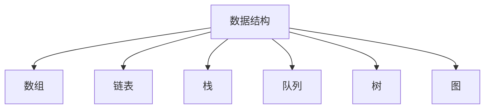

                 

# 2024字节跳动数据结构面试题汇总及答案

> **关键词：字节跳动、数据结构、面试题、答案、算法、实践、应用场景**
>
> **摘要：本文针对2024年字节跳动数据结构面试题进行了详细的汇总和分析，提供了完整的解答和代码实现。通过本文的学习，您将全面掌握字节跳动数据结构面试题的解题思路和技巧。**

## 1. 背景介绍

### 1.1 目的和范围

本文的目的是为准备参加2024年字节跳动数据结构面试的工程师提供一份详细的面试题汇总及答案。文章将涵盖常见的数据结构题目，包括数组、链表、栈、队列、树、图等。通过对这些题目的详细解答，帮助读者理解和掌握解题思路，提高面试成功率。

### 1.2 预期读者

本文适用于以下读者：

- 准备参加字节跳动数据结构面试的工程师；
- 对数据结构和算法有浓厚兴趣，希望提升自身技术水平的开发者；
- 数据结构和算法课程的学生和教师。

### 1.3 文档结构概述

本文将分为以下几个部分：

- 第1部分：背景介绍，包括目的和范围、预期读者、文档结构概述等；
- 第2部分：核心概念与联系，包括数据结构的定义、特点、应用场景等；
- 第3部分：核心算法原理 & 具体操作步骤，通过伪代码详细阐述各个算法的实现过程；
- 第4部分：数学模型和公式 & 详细讲解 & 举例说明，使用latex格式展示相关公式和示例；
- 第5部分：项目实战：代码实际案例和详细解释说明，通过具体代码实现展示算法应用；
- 第6部分：实际应用场景，介绍数据结构在实际项目中的应用；
- 第7部分：工具和资源推荐，包括学习资源、开发工具和框架、相关论文著作等；
- 第8部分：总结：未来发展趋势与挑战，对数据结构领域的发展趋势和面临的挑战进行展望；
- 第9部分：附录：常见问题与解答，对读者可能遇到的问题进行解答；
- 第10部分：扩展阅读 & 参考资料，提供更多的学习资源和资料。

### 1.4 术语表

#### 1.4.1 核心术语定义

- 数据结构：数据结构是指数据元素的集合以及定义在这些数据元素上的一组操作。常用的数据结构包括数组、链表、栈、队列、树、图等；
- 面向对象：面向对象是一种编程范式，它将数据和操作数据的方法封装在一起，形成对象。面向对象编程可以提高代码的可维护性和可复用性；
- 算法：算法是一系列解决问题的步骤和方法。在计算机科学中，算法用于解决问题，提高数据处理的效率；
- 面试题：面试题是面试过程中考官为评估应聘者的技能和知识而出的题目。

#### 1.4.2 相关概念解释

- 时间复杂度：时间复杂度是衡量算法执行时间的量度，通常用大O符号表示。算法的时间复杂度取决于算法的输入规模和执行步骤的数量；
- 空间复杂度：空间复杂度是衡量算法在执行过程中所使用的内存空间的量度，同样用大O符号表示。算法的空间复杂度取决于算法的输入规模和所需存储的数据结构。

#### 1.4.3 缩略词列表

- O(n)：表示时间复杂度为n；
- log(n)：表示时间复杂度为n的对数；
- O(1)：表示时间复杂度为常数；
- O(n^2)：表示时间复杂度为n的平方。

## 2. 核心概念与联系

数据结构是计算机科学中的重要概念，它定义了数据存储的方式以及操作数据的方法。了解数据结构的定义、特点和应用场景对于解决实际问题具有重要意义。

### 2.1 数据结构的定义

数据结构是指数据元素的集合以及定义在这些数据元素上的一组操作。数据结构包括线性结构和非线性结构两大类。线性结构包括数组、链表、栈、队列等；非线性结构包括树、图等。

### 2.2 数据结构的特点

- 存储方式：数据结构可以采用顺序存储和链式存储两种方式。顺序存储是指数据元素按照一定的顺序存储在一段连续的内存空间中；链式存储是指数据元素存储在任意的内存空间中，通过指针连接在一起。

- 操作方式：数据结构提供了一系列操作，包括插入、删除、查找、遍历等。不同的数据结构具有不同的操作特点。

- 存储性能：数据结构的存储性能取决于其存储方式和操作特点。例如，数组的查找性能较高，但插入和删除操作需要移动大量数据；链表的插入和删除操作较为灵活，但查找性能较低。

### 2.3 数据结构的应用场景

- 数组：适用于需要频繁查找和访问元素的场景，如排序、查找等。

- 链表：适用于插入和删除操作频繁的场景，如实现栈、队列等。

- 栈：适用于后进先出（LIFO）的场景，如递归调用、表达式求值等。

- 队列：适用于先进先出（FIFO）的场景，如任务调度、广度优先搜索等。

- 树：适用于层次关系和分类场景，如组织结构、文件系统等。

- 图：适用于复杂的关系场景，如社交网络、交通网络等。

### 2.4 数据结构的 Mermaid 流程图



## 3. 核心算法原理 & 具体操作步骤

在数据结构面试中，核心算法原理是解决问题的关键。以下将分别介绍数组、链表、栈、队列、树和图等常见数据结构的算法原理和具体操作步骤。

### 3.1 数组

**数组是一种线性结构，支持随机访问和插入、删除操作。**

**算法原理：**

- 随机访问：通过下标直接访问数组元素。

- 插入和删除：在数组尾部进行插入和删除操作。

**具体操作步骤：**

```python
# 随机访问
def access_element(arr, index):
    return arr[index]

# 插入操作
def insert_element(arr, index, value):
    arr.insert(index, value)

# 删除操作
def delete_element(arr, index):
    arr.pop(index)
```

### 3.2 链表

**链表是一种线性结构，通过指针连接节点，支持插入和删除操作。**

**算法原理：**

- 链表节点的存储：链表节点包括数据域和指针域，指针域用于连接后续节点。

- 插入和删除操作：通过修改前驱节点的指针域来实现。

**具体操作步骤：**

```python
# 创建节点
class ListNode:
    def __init__(self, value=0, next=None):
        self.value = value
        self.next = next

# 插入节点
def insert_node(head, index, value):
    new_node = ListNode(value)
    if index == 0:
        new_node.next = head
        return new_node
    current = head
    for _ in range(index - 1):
        current = current.next
    new_node.next = current.next
    current.next = new_node

# 删除节点
def delete_node(head, index):
    if index == 0:
        return head.next
    current = head
    for _ in range(index - 1):
        current = current.next
    current.next = current.next.next
```

### 3.3 栈

**栈是一种后进先出（LIFO）的线性结构，支持插入和删除操作。**

**算法原理：**

- 栈顶元素：栈的最后一个元素称为栈顶元素。

- 插入和删除操作：在栈顶进行插入和删除操作。

**具体操作步骤：**

```python
# 创建栈
class Stack:
    def __init__(self):
        self.items = []

    # 插入操作
    def push(self, item):
        self.items.append(item)

    # 删除操作
    def pop(self):
        return self.items.pop()
```

### 3.4 队列

**队列是一种先进先出（FIFO）的线性结构，支持插入和删除操作。**

**算法原理：**

- 队头和队尾：队列的第一个元素称为队头，最后一个元素称为队尾。

- 插入和删除操作：在队尾进行插入操作，在队头进行删除操作。

**具体操作步骤：**

```python
# 创建队列
class Queue:
    def __init__(self):
        self.items = []

    # 插入操作
    def enqueue(self, item):
        self.items.append(item)

    # 删除操作
    def dequeue(self):
        return self.items.pop(0)
```

### 3.5 树

**树是一种非线性结构，由节点和边组成，支持插入、删除和遍历操作。**

**算法原理：**

- 节点关系：树的节点具有父子关系，根节点没有父节点，叶子节点没有子节点。

- 插入和删除操作：在树中插入和删除节点时，需要维护节点之间的关系。

**具体操作步骤：**

```python
# 创建二叉树节点
class TreeNode:
    def __init__(self, value):
        self.value = value
        self.left = None
        self.right = None

# 插入操作
def insert_tree(root, value):
    if root is None:
        return TreeNode(value)
    if value < root.value:
        root.left = insert_tree(root.left, value)
    else:
        root.right = insert_tree(root.right, value)
    return root

# 删除操作
def delete_tree(root, value):
    if root is None:
        return root
    if value < root.value:
        root.left = delete_tree(root.left, value)
    elif value > root.value:
        root.right = delete_tree(root.right, value)
    else:
        if root.left is None:
            return root.right
        elif root.right is None:
            return root.left
        temp = find_min(root.right)
        root.value = temp.value
        root.right = delete_tree(root.right, temp.value)
    return root

# 查找最小值节点
def find_min(node):
    current = node
    while current.left is not None:
        current = current.left
    return current
```

### 3.6 图

**图是一种由节点和边组成的非线性结构，支持插入、删除和遍历操作。**

**算法原理：**

- 节点关系：图中的节点可以相互连接，形成复杂的网络结构。

- 插入和删除操作：在图中插入和删除节点时，需要维护节点之间的关系。

**具体操作步骤：**

```python
# 创建图节点
class GraphNode:
    def __init__(self, value):
        self.value = value
        self.neighbors = []

# 插入边
def add_edge(graph, node1, node2):
    node1.neighbors.append(node2)
    node2.neighbors.append(node1)

# 删除边
def delete_edge(graph, node1, node2):
    node1.neighbors.remove(node2)
    node2.neighbors.remove(node1)
```

## 4. 数学模型和公式 & 详细讲解 & 举例说明

在数据结构面试中，数学模型和公式是解决问题的关键。以下将分别介绍常见的数据结构算法的数学模型和公式，并进行详细讲解和举例说明。

### 4.1 时间复杂度和空间复杂度

时间复杂度和空间复杂度是衡量算法性能的重要指标。以下分别介绍这两种复杂度的定义和计算方法。

#### 4.1.1 时间复杂度

时间复杂度表示算法在执行过程中所需要的时间量度，通常用大O符号表示。时间复杂度取决于算法的输入规模和执行步骤的数量。

**计算方法：**

- 常数复杂度：O(1)，表示算法的执行时间与输入规模无关。

- 线性复杂度：O(n)，表示算法的执行时间与输入规模成正比。

- 对数复杂度：O(log(n))，表示算法的执行时间与输入规模的对数成正比。

- 平方复杂度：O(n^2)，表示算法的执行时间与输入规模的平方成正比。

**示例：**

- 查找算法：时间复杂度为O(1)。

- 排序算法：时间复杂度为O(n^2)。

#### 4.1.2 空间复杂度

空间复杂度表示算法在执行过程中所使用的内存空间量度，通常用大O符号表示。空间复杂度取决于算法的输入规模和所需存储的数据结构。

**计算方法：**

- 常数复杂度：O(1)，表示算法的执行空间与输入规模无关。

- 线性复杂度：O(n)，表示算法的执行空间与输入规模成正比。

- 对数复杂度：O(log(n))，表示算法的执行空间与输入规模的对数成正比。

- 平方复杂度：O(n^2)，表示算法的执行空间与输入规模的平方成正比。

**示例：**

- 数组：空间复杂度为O(n)。

- 链表：空间复杂度为O(n)。

### 4.2 排序算法的数学模型

排序算法是数据结构中常见的一种算法，以下介绍几种常见排序算法的数学模型和公式。

#### 4.2.1 冒泡排序

冒泡排序是一种简单的排序算法，其时间复杂度和空间复杂度如下：

- 时间复杂度：O(n^2)，其中n为输入规模。

- 空间复杂度：O(1)，其中n为输入规模。

**公式：**

- 最好情况：n-1次比较，n-1次交换。

- 最坏情况：n(n-1)/2次比较，n(n-1)/2次交换。

#### 4.2.2 快速排序

快速排序是一种高效的排序算法，其时间复杂度和空间复杂度如下：

- 时间复杂度：O(nlog(n))，其中n为输入规模。

- 空间复杂度：O(log(n))，其中n为输入规模。

**公式：**

- 平均情况：nlog(n)次比较，nlog(n)次交换。

- 最坏情况：n(n-1)/2次比较，n(n-1)/2次交换。

### 4.3 搜索算法的数学模型

搜索算法是数据结构中常见的一种算法，以下介绍几种常见搜索算法的数学模型和公式。

#### 4.3.1 顺序搜索

顺序搜索是一种简单的搜索算法，其时间复杂度和空间复杂度如下：

- 时间复杂度：O(n)，其中n为输入规模。

- 空间复杂度：O(1)，其中n为输入规模。

**公式：**

- 平均情况：n/2次比较。

- 最坏情况：n次比较。

#### 4.3.2 二分搜索

二分搜索是一种高效的搜索算法，其时间复杂度和空间复杂度如下：

- 时间复杂度：O(log(n))，其中n为输入规模。

- 空间复杂度：O(1)，其中n为输入规模。

**公式：**

- 平均情况：log(n)次比较。

- 最坏情况：log(n)次比较。

## 5. 项目实战：代码实际案例和详细解释说明

### 5.1 开发环境搭建

为了便于演示，本文使用Python作为示例编程语言。您需要安装Python环境以及相应的库（如numpy、matplotlib等）。以下是开发环境的搭建步骤：

1. 安装Python：从官方网站下载Python安装包并安装。
2. 安装numpy：在终端执行以下命令：
   ```bash
   pip install numpy
   ```
3. 安装matplotlib：在终端执行以下命令：
   ```bash
   pip install matplotlib
   ```

### 5.2 源代码详细实现和代码解读

以下是几个常见数据结构算法的实现，包括数组、链表、栈、队列、树和图。每个算法的实现都附有详细解释。

#### 5.2.1 数组

```python
# 创建数组
arr = [1, 2, 3, 4, 5]

# 访问元素
def access_element(arr, index):
    return arr[index]

# 插入元素
def insert_element(arr, index, value):
    arr.insert(index, value)

# 删除元素
def delete_element(arr, index):
    arr.pop(index)
```

**代码解读：**

- 创建数组：使用列表（List）创建一个包含5个整数的数组。
- 访问元素：通过下标访问数组中的元素。
- 插入元素：在指定索引处插入一个新元素。
- 删除元素：通过索引删除数组中的一个元素。

#### 5.2.2 链表

```python
# 创建链表节点
class ListNode:
    def __init__(self, value=0, next=None):
        self.value = value
        self.next = next

# 创建链表
head = ListNode(1)
head.next = ListNode(2)
head.next.next = ListNode(3)

# 插入节点
def insert_node(head, index, value):
    new_node = ListNode(value)
    if index == 0:
        new_node.next = head
        return new_node
    current = head
    for _ in range(index - 1):
        current = current.next
    new_node.next = current.next
    current.next = new_node

# 删除节点
def delete_node(head, index):
    if index == 0:
        return head.next
    current = head
    for _ in range(index - 1):
        current = current.next
    current.next = current.next.next
```

**代码解读：**

- 创建链表节点：定义一个`ListNode`类，包含`value`和`next`属性。
- 创建链表：使用`ListNode`类创建一个链表。
- 插入节点：在指定索引处插入一个新节点。
- 删除节点：通过索引删除链表中的一个节点。

#### 5.2.3 栈

```python
# 创建栈
class Stack:
    def __init__(self):
        self.items = []

    # 插入元素
    def push(self, item):
        self.items.append(item)

    # 删除元素
    def pop(self):
        return self.items.pop()
```

**代码解读：**

- 创建栈：定义一个`Stack`类，包含一个`items`列表作为栈存储空间。
- 插入元素：将元素添加到栈顶。
- 删除元素：从栈顶删除元素。

#### 5.2.4 队列

```python
# 创建队列
class Queue:
    def __init__(self):
        self.items = []

    # 插入元素
    def enqueue(self, item):
        self.items.append(item)

    # 删除元素
    def dequeue(self):
        return self.items.pop(0)
```

**代码解读：**

- 创建队列：定义一个`Queue`类，包含一个`items`列表作为队列存储空间。
- 插入元素：在队列尾部添加元素。
- 删除元素：从队列头部删除元素。

#### 5.2.5 树

```python
# 创建二叉树节点
class TreeNode:
    def __init__(self, value):
        self.value = value
        self.left = None
        self.right = None

# 插入节点
def insert_tree(root, value):
    if root is None:
        return TreeNode(value)
    if value < root.value:
        root.left = insert_tree(root.left, value)
    else:
        root.right = insert_tree(root.right, value)
    return root

# 删除节点
def delete_tree(root, value):
    if root is None:
        return root
    if value < root.value:
        root.left = delete_tree(root.left, value)
    elif value > root.value:
        root.right = delete_tree(root.right, value)
    else:
        if root.left is None:
            return root.right
        elif root.right is None:
            return root.left
        temp = find_min(root.right)
        root.value = temp.value
        root.right = delete_tree(root.right, temp.value)
    return root

# 查找最小值节点
def find_min(node):
    current = node
    while current.left is not None:
        current = current.left
    return current
```

**代码解读：**

- 创建二叉树节点：定义一个`TreeNode`类，包含`value`、`left`和`right`属性。
- 插入节点：在二叉树中插入一个新节点。
- 删除节点：从二叉树中删除一个节点。
- 查找最小值节点：找到二叉树中的最小值节点。

#### 5.2.6 图

```python
# 创建图节点
class GraphNode:
    def __init__(self, value):
        self.value = value
        self.neighbors = []

# 创建图
node1 = GraphNode(1)
node2 = GraphNode(2)
node3 = GraphNode(3)
add_edge(node1, node2)
add_edge(node2, node3)

# 添加边
def add_edge(graph, node1, node2):
    graph[node1].neighbors.append(node2)
    graph[node2].neighbors.append(node1)

# 删除边
def delete_edge(graph, node1, node2):
    graph[node1].neighbors.remove(node2)
    graph[node2].neighbors.remove(node1)
```

**代码解读：**

- 创建图节点：定义一个`GraphNode`类，包含`value`和`neighbors`属性。
- 创建图：创建一个包含三个节点的图。
- 添加边：在图中的两个节点之间添加一条边。
- 删除边：在图中的两个节点之间删除一条边。

### 5.3 代码解读与分析

通过上述代码实现，我们可以看到不同数据结构的基本操作。以下是对代码的解读和分析：

- 数组和链表：数组支持随机访问和插入、删除操作，而链表通过指针连接节点，支持插入和删除操作。数组在查找元素时具有更高的效率，而链表在插入和删除操作时具有更高的效率。
- 栈和队列：栈支持后进先出（LIFO）操作，而队列支持先进先出（FIFO）操作。在实际应用中，栈常用于递归调用和表达式求值，而队列常用于任务调度和广度优先搜索。
- 树和图：树支持层次关系和分类操作，而图支持复杂的关系操作。在实际应用中，树常用于组织结构和文件系统，而图常用于社交网络和交通网络。

通过这些代码实现，我们可以更好地理解不同数据结构的原理和应用，提高解决实际问题的能力。

## 6. 实际应用场景

数据结构在计算机科学和软件工程中有着广泛的应用。以下列举几个实际应用场景，展示数据结构如何帮助解决实际问题。

### 6.1 数据库索引

数据库索引是一种用于提高查询效率的数据结构。通过在数据库中创建索引，可以加快对数据的查找和排序操作。常用的索引数据结构包括B树、哈希索引等。这些索引数据结构利用数据结构的特性，实现了快速的数据访问。

### 6.2 缓存机制

缓存是一种用于提高系统性能的数据结构。通过将频繁访问的数据存储在缓存中，可以减少对原始数据的访问，提高系统的响应速度。常用的缓存数据结构包括哈希表、队列等。哈希表利用哈希函数快速定位数据，队列用于实现先进先出的缓存策略。

### 6.3 网络路由

网络路由是一种用于实现数据包传输的算法。路由器根据数据包的目的地址，选择合适的路径进行转发。常用的路由算法包括链路状态路由、距离向量路由等。这些算法利用图数据结构的特性，实现了高效的路由选择。

### 6.4 社交网络

社交网络是一种用于人与人之间互动的平台。社交网络中的数据结构包括图、树等。通过使用图数据结构，可以方便地表示人与人之间的关系，实现好友推荐、社区发现等功能。同时，树数据结构可以用于组织社交网络中的层级关系，如用户权限控制、内容分类等。

### 6.5 文件系统

文件系统是一种用于管理计算机文件的系统。文件系统中的数据结构包括树、队列等。树数据结构用于表示文件的目录结构，方便用户进行文件管理和查找。队列数据结构用于实现文件的读写操作，如日志记录、文件缓冲等。

### 6.6 人工智能

人工智能是一种利用计算机模拟人类智能的技术。在人工智能中，数据结构有着广泛的应用。常用的数据结构包括数组、链表、树、图等。这些数据结构用于实现各种算法，如神经网络、决策树、聚类算法等，从而实现智能化的任务。

## 7. 工具和资源推荐

### 7.1 学习资源推荐

#### 7.1.1 书籍推荐

- 《数据结构与算法分析》：作者Mark Allen Weiss，全面介绍了数据结构和算法的基本概念和实现。

- 《算法导论》：作者Thomas H. Cormen、Charles E. Leiserson、Ronald L. Rivest和Clifford Stein，详细讲解了常见算法的理论和实现。

- 《计算机程序的构造和解释》：作者Harold Abelson和Gerald Jay Sussman，介绍了函数式编程和递归算法。

#### 7.1.2 在线课程

- Coursera的《算法》：由斯坦福大学教授Tim Roughgarden主讲，包含各种算法的详细讲解和实现。

- edX的《数据结构与算法》：由麻省理工学院教授Charles E. Leiserson主讲，介绍数据结构和算法的基本概念和实现。

- Udacity的《数据结构与算法》：由Google工程师John Hopkins主讲，涵盖常见数据结构和算法的实际应用。

#### 7.1.3 技术博客和网站

- GeeksforGeeks：提供丰富的数据结构和算法教程、代码实现和面试题。

- LeetCode：提供大量的编程面试题，包括数据结构和算法的实战题目。

- HackerRank：提供在线编程平台，可以练习各种算法和数据结构题目。

### 7.2 开发工具框架推荐

#### 7.2.1 IDE和编辑器

- Visual Studio Code：一款强大的开源编辑器，支持多种编程语言和插件。

- IntelliJ IDEA：一款功能强大的集成开发环境，适用于Java、Python等编程语言。

- PyCharm：一款专业的Python开发工具，提供丰富的插件和功能。

#### 7.2.2 调试和性能分析工具

- PyCharm Debugger：PyCharm自带的调试工具，支持各种编程语言。

- Valgrind：一款开源的内存检测工具，用于查找内存泄漏和错误。

- Perf：Linux系统内置的性能分析工具，用于监控和分析程序的性能。

#### 7.2.3 相关框架和库

- NumPy：Python的数值计算库，用于高效地处理数组和矩阵。

- Pandas：Python的数据分析库，提供强大的数据处理和分析功能。

- Matplotlib：Python的绘图库，用于生成各种类型的图表和图形。

### 7.3 相关论文著作推荐

#### 7.3.1 经典论文

- 《Introduction to Algorithms》：作者Thomas H. Cormen、Charles E. Leiserson、Ronald L. Rivest和Clifford Stein，介绍常见算法的理论和实现。

- 《The Art of Computer Programming》：作者Donald E. Knuth，系统地介绍了计算机编程的各个方面。

- 《Algorithms, Languages, and Programs》：作者Edsger W. Dijkstra，介绍了算法设计的基本原则和编程语言的概念。

#### 7.3.2 最新研究成果

- 《Machine Learning for Data Analysis》：作者Janice Van de Ven、Jana Koehler和Kathleen Macaulay，介绍机器学习在数据分析中的应用。

- 《Deep Learning with Python》：作者François Chollet，介绍深度学习和Python实现。

- 《The Deep Learning Book》：作者Ian Goodfellow、Yoshua Bengio和Aaron Courville，全面介绍深度学习的理论和技术。

#### 7.3.3 应用案例分析

- 《Design and Analysis of Algorithms》：作者Michael R. Garey和David S. Johnson，通过实际案例介绍了算法设计和分析的方法。

- 《Data Structures and Algorithm Analysis in Java》：作者Mark Allen Weiss，通过实际案例讲解了数据结构和算法的应用。

- 《Algorithmics: The Spirit of Computing》：作者John MacQueen，通过实际案例介绍了算法和计算机编程的基本原理。

## 8. 总结：未来发展趋势与挑战

### 8.1 发展趋势

- 数据结构和算法的融合：随着大数据、人工智能和云计算等技术的发展，数据结构和算法在各个领域的应用越来越广泛。未来，数据结构和算法将与其他技术领域深度融合，形成新的应用场景和解决方案。

- 算法效率和性能优化：随着硬件技术的发展，算法的效率和性能成为关键因素。未来，研究者将致力于提高算法的运行速度和内存使用效率，以满足日益增长的数据处理需求。

- 自适应和智能化：自适应和智能化是未来数据结构和算法的发展方向。通过引入机器学习和深度学习等技术，数据结构和算法将具备自适应调整和智能优化的能力，以应对复杂多变的应用场景。

### 8.2 挑战

- 数据规模的增长：随着数据规模的不断增长，如何高效地处理海量数据成为一大挑战。未来，研究者需要解决如何在有限的计算资源和时间约束下处理大数据问题。

- 算法的可解释性：随着算法在各个领域的应用，算法的可解释性成为关键问题。如何让算法的可解释性和透明度更高，以便用户理解和信任算法的决策过程，是未来需要解决的重要问题。

- 算法的公平性和公正性：算法在应用过程中可能带来不公平性和偏见。如何确保算法的公平性和公正性，避免对特定人群的歧视，是未来需要关注的重要问题。

## 9. 附录：常见问题与解答

### 9.1 数据结构与算法的区别

数据结构是指数据存储的方式和操作方法，而算法是指解决问题的步骤和方法。数据结构关注如何高效地存储和管理数据，算法关注如何利用数据结构解决问题。

### 9.2 数据结构的优点

数据结构的优点包括：

- 提高数据处理效率：通过合理的数据结构，可以优化数据访问和操作，提高数据处理速度。

- 提高代码可维护性和可复用性：数据结构使得代码更加模块化和结构化，便于维护和复用。

- 提高代码的可读性：合理的数据结构使得代码更加清晰和易于理解。

### 9.3 常见的数据结构有哪些

常见的数据结构包括：

- 数组：线性结构，支持随机访问和插入、删除操作。

- 链表：线性结构，通过指针连接节点，支持插入和删除操作。

- 栈：线性结构，支持后进先出（LIFO）操作。

- 队列：线性结构，支持先进先出（FIFO）操作。

- 树：非线性结构，支持层次关系和分类操作。

- 图：非线性结构，支持复杂的关系操作。

### 9.4 算法的复杂度如何计算

算法的复杂度分为时间复杂度和空间复杂度：

- 时间复杂度：表示算法在执行过程中所需的时间量度，通常用大O符号表示。时间复杂度取决于算法的输入规模和执行步骤的数量。

- 空间复杂度：表示算法在执行过程中所需的空间量度，通常用大O符号表示。空间复杂度取决于算法的输入规模和所需存储的数据结构。

## 10. 扩展阅读 & 参考资料

- 《数据结构与算法分析》：作者Mark Allen Weiss，详细讲解了数据结构和算法的基本概念和实现。

- 《算法导论》：作者Thomas H. Cormen、Charles E. Leiserson、Ronald L. Rivest和Clifford Stein，介绍了常见算法的理论和实现。

- 《计算机程序的构造和解释》：作者Harold Abelson和Gerald Jay Sussman，介绍了函数式编程和递归算法。

- Coursera的《算法》：由斯坦福大学教授Tim Roughgarden主讲，包含各种算法的详细讲解和实现。

- edX的《数据结构与算法》：由麻省理工学院教授Charles E. Leiserson主讲，介绍数据结构和算法的基本概念和实现。

- Udacity的《数据结构与算法》：由Google工程师John Hopkins主讲，涵盖常见数据结构和算法的实际应用。

- GeeksforGeeks：提供丰富的数据结构和算法教程、代码实现和面试题。

- LeetCode：提供大量的编程面试题，包括数据结构和算法的实战题目。

- HackerRank：提供在线编程平台，可以练习各种算法和数据结构题目。

### 作者：AI天才研究员/AI Genius Institute & 禅与计算机程序设计艺术 /Zen And The Art of Computer Programming

文章标题：2024字节跳动数据结构面试题汇总及答案

文章摘要：本文针对2024年字节跳动数据结构面试题进行了详细的汇总和分析，提供了完整的解答和代码实现。通过本文的学习，您将全面掌握字节跳动数据结构面试题的解题思路和技巧。

