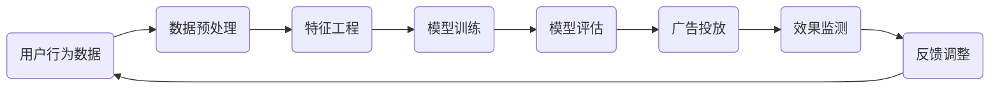

                 

# 2024字节跳动智能广告投放优化社招面试真题汇总及其解答

## 关键词：
- 字节跳动
- 智能广告投放
- 面试真题
- 优化策略
- 技术分析

## 摘要：
本文旨在总结2024年字节跳动智能广告投放优化相关的社招面试真题，并提供详细的解答和分析。通过对这些面试题的深入探讨，读者可以全面了解智能广告投放的核心概念、技术原理及实战应用，为自身的职业发展打下坚实的基础。

## 1. 背景介绍

### 1.1 目的和范围

本文旨在为参加字节跳动智能广告投放优化社招面试的候选人提供有力的支持。我们将针对面试中出现的一些核心问题进行详细解答，帮助候选人更好地理解相关技术原理和实际应用。

### 1.2 预期读者

本文主要面向计算机科学、数据科学、广告技术等相关专业的求职者，以及对智能广告投放感兴趣的技术爱好者。通过阅读本文，读者可以掌握以下技能：

- 了解智能广告投放的基本概念和核心原理；
- 掌握广告投放优化的关键技术和策略；
- 提高面试应对能力，为求职成功奠定基础。

### 1.3 文档结构概述

本文分为十个部分，结构如下：

1. 背景介绍：介绍文章的目的、范围、预期读者及文档结构；
2. 核心概念与联系：阐述智能广告投放相关核心概念及架构；
3. 核心算法原理 & 具体操作步骤：详细讲解广告投放优化的算法原理及操作步骤；
4. 数学模型和公式 & 详细讲解 & 举例说明：介绍广告投放优化的数学模型及实例分析；
5. 项目实战：代码实际案例和详细解释说明；
6. 实际应用场景：探讨智能广告投放的广泛应用领域；
7. 工具和资源推荐：推荐学习资源、开发工具和框架；
8. 总结：未来发展趋势与挑战；
9. 附录：常见问题与解答；
10. 扩展阅读 & 参考资料：提供进一步学习资源。

### 1.4 术语表

#### 1.4.1 核心术语定义

- 智能广告投放：利用人工智能技术，根据用户行为和偏好进行广告精准投放的过程。
- 广告投放优化：通过算法和策略，提高广告投放效果和用户转化率的手段。
- 转化率：广告点击后，目标用户完成预期行为的比例。
- 行为数据：用户在网站、应用等场景中的各种操作数据，如浏览、点击、购买等。

#### 1.4.2 相关概念解释

- 机器学习：一种基于数据，通过算法模型自动从数据中学习知识，进行预测和决策的人工智能技术。
- 深度学习：一种特殊的机器学习技术，通过多层神经网络模型，对复杂数据进行建模和预测。
- 强化学习：一种通过不断试错，逐步学习最优策略的机器学习技术。

#### 1.4.3 缩略词列表

- AI：人工智能
- ML：机器学习
- DL：深度学习
- RL：强化学习
- SEO：搜索引擎优化
- SEM：搜索引擎营销

## 2. 核心概念与联系

在介绍智能广告投放相关核心概念与联系之前，我们先通过一张Mermaid流程图来展示其整体架构：



### 2.1 用户行为数据

用户行为数据是智能广告投放的基础，主要包括以下几类：

- 浏览记录：用户在网站、应用中的浏览历史。
- 点击记录：用户对广告或其他内容的点击行为。
- 购买记录：用户在电商、金融等场景中的购买行为。
- 用户反馈：用户对广告内容的喜好、厌恶等评价。

### 2.2 数据预处理

数据预处理是广告投放优化的重要环节，主要包括以下任务：

- 数据清洗：去除重复、缺失、异常的数据。
- 数据归一化：将不同特征的数据进行标准化处理，使其具有可比性。
- 数据转换：将非结构化数据（如文本、图像）转换为结构化数据（如特征向量）。

### 2.3 特征工程

特征工程是提高广告投放效果的关键步骤，主要包括以下任务：

- 特征提取：从原始数据中提取有助于预测的特征。
- 特征选择：通过降维或筛选，保留对预测效果有显著贡献的特征。
- 特征组合：将多个特征进行组合，生成新的特征。

### 2.4 模型训练

模型训练是广告投放优化的核心环节，主要包括以下任务：

- 选择合适的模型：根据业务需求和数据特点，选择合适的机器学习或深度学习模型。
- 模型参数调优：通过交叉验证、网格搜索等方法，确定模型的最佳参数。
- 模型评估：使用验证集或测试集，评估模型的预测效果。

### 2.5 模型评估

模型评估是广告投放优化的重要环节，主要包括以下任务：

- 准确率、召回率、F1值等基本指标评估。
- A/B测试：对比不同模型或策略的投放效果。
- 持续监控：监控模型在真实环境中的表现，发现并解决潜在问题。

### 2.6 广告投放

广告投放是将训练好的模型应用于实际场景，主要包括以下任务：

- 广告推荐：根据用户特征和偏好，推荐适合的广告内容。
- 广告排序：根据广告效果和竞争关系，对广告进行排序。
- 广告展示：将广告内容展示给目标用户。

### 2.7 效果监测

效果监测是广告投放优化的持续过程，主要包括以下任务：

- 转化率监测：监测广告投放的转化效果，如点击率、购买率等。
- 用户反馈监测：监测用户对广告内容的反馈，如点赞、评论、举报等。
- 竞争分析：分析竞争对手的广告投放策略，优化自身策略。

### 2.8 反馈调整

反馈调整是广告投放优化的重要环节，主要包括以下任务：

- 调整广告内容：根据用户反馈和效果监测，优化广告内容，提高用户体验。
- 调整投放策略：根据用户特征和反馈，优化广告投放策略，提高投放效果。

## 3. 核心算法原理 & 具体操作步骤

在广告投放优化过程中，常用的核心算法包括协同过滤、内容推荐、基于模型的广告投放等。下面我们将分别介绍这些算法的原理和具体操作步骤。

### 3.1 协同过滤算法

协同过滤算法是一种基于用户行为数据的推荐算法，其核心思想是通过用户之间的相似性来推荐商品或内容。协同过滤算法主要包括以下两种类型：

- 用户基于的协同过滤（User-Based Collaborative Filtering）
- 项目基于的协同过滤（Item-Based Collaborative Filtering）

#### 3.1.1 用户基于的协同过滤

用户基于的协同过滤算法的主要步骤如下：

1. **数据预处理**：将用户行为数据（如浏览、点击、购买等）进行清洗、归一化处理，得到用户-物品矩阵。
2. **计算相似度**：计算用户之间的相似度，常用的相似度计算方法有余弦相似度、皮尔逊相关系数等。
3. **生成推荐列表**：根据用户之间的相似度，为每个用户生成推荐列表。推荐列表中的商品或内容通常是根据相似度从高到低排序的。

伪代码如下：

```python
# 输入：用户-物品矩阵user_item_matrix
# 输出：用户推荐列表user_recommendations

def user_based_collaborative_filtering(user_item_matrix):
    similarity_matrix = compute_similarity(user_item_matrix)
    user_recommendations = []
    for user in user_item_matrix:
        recommendations = []
        for other_user in user_item_matrix:
            if user != other_user:
                for item in other_user:
                    if item not in user:
                        recommendations.append(item)
        recommendations.sort(reverse=True)
        user_recommendations.append(recommendations)
    return user_recommendations
```

#### 3.1.2 项目基于的协同过滤

项目基于的协同过滤算法的主要步骤如下：

1. **数据预处理**：与用户基于的协同过滤相同，对用户行为数据进行清洗、归一化处理，得到用户-物品矩阵。
2. **计算相似度**：计算物品之间的相似度，常用的相似度计算方法有余弦相似度、皮尔逊相关系数等。
3. **生成推荐列表**：根据物品之间的相似度，为每个用户生成推荐列表。推荐列表中的商品或内容通常是根据相似度从高到低排序的。

伪代码如下：

```python
# 输入：用户-物品矩阵user_item_matrix
# 输出：用户推荐列表user_recommendations

def item_based_collaborative_filtering(user_item_matrix):
    similarity_matrix = compute_similarity(user_item_matrix)
    user_recommendations = []
    for user in user_item_matrix:
        recommendations = []
        for item in user:
            similar_items = [item2 for item2 in user_item_matrix if item != item2 and item in item2]
            for similar_item in similar_items:
                if similar_item not in user:
                    recommendations.append(similar_item)
        recommendations.sort(reverse=True)
        user_recommendations.append(recommendations)
    return user_recommendations
```

### 3.2 内容推荐算法

内容推荐算法是一种基于物品属性的推荐算法，其核心思想是根据用户兴趣和物品属性为用户推荐内容。内容推荐算法主要包括以下两种类型：

- 基于物品属性的协同过滤（Content-Based Collaborative Filtering）
- 基于模型的推荐算法（Model-Based Recommendation）

#### 3.2.1 基于物品属性的协同过滤

基于物品属性的协同过滤算法的主要步骤如下：

1. **数据预处理**：对用户行为数据进行清洗、归一化处理，提取物品属性特征，如文本、图像、标签等。
2. **特征提取**：将物品属性特征进行转换和提取，如文本转换为词向量、图像转换为特征向量等。
3. **计算相似度**：计算用户和物品之间的相似度，常用的相似度计算方法有余弦相似度、皮尔逊相关系数等。
4. **生成推荐列表**：根据用户和物品之间的相似度，为用户生成推荐列表。

伪代码如下：

```python
# 输入：用户-物品矩阵user_item_matrix，物品属性特征矩阵item_features
# 输出：用户推荐列表user_recommendations

def content_based_collaborative_filtering(user_item_matrix, item_features):
    user_features = extract_user_features(user_item_matrix)
    item_similarity_matrix = compute_similarity(item_features)
    user_recommendations = []
    for user in user_item_matrix:
        recommendations = []
        for item in user_item_matrix:
            if item not in user:
                similarity = compute_similarity(user_features, item_similarity_matrix[item])
                recommendations.append(item)
        recommendations.sort(reverse=True)
        user_recommendations.append(recommendations)
    return user_recommendations
```

#### 3.2.2 基于模型的推荐算法

基于模型的推荐算法是一种利用机器学习技术进行推荐的算法，其核心思想是通过训练模型，预测用户对物品的评分或兴趣。基于模型的推荐算法主要包括以下类型：

- 基于矩阵分解的推荐算法（Matrix Factorization-based Recommendation）
- 基于深度学习的推荐算法（Deep Learning-based Recommendation）

##### 3.2.2.1 基于矩阵分解的推荐算法

基于矩阵分解的推荐算法的主要步骤如下：

1. **数据预处理**：对用户行为数据进行清洗、归一化处理，得到用户-物品评分矩阵。
2. **模型训练**：使用矩阵分解算法（如Singular Value Decomposition, SVD）对用户-物品评分矩阵进行分解，得到低维用户和物品特征矩阵。
3. **预测评分**：将低维用户和物品特征矩阵相乘，预测用户对未评分物品的评分。
4. **生成推荐列表**：根据预测评分，为用户生成推荐列表。

伪代码如下：

```python
# 输入：用户-物品评分矩阵user_item_ratings
# 输出：用户推荐列表user_recommendations

def matrix_factorization_based_recommendation(user_item_ratings):
    U, V = svd(user_item_ratings)
    predicted_ratings = U * V
    user_recommendations = []
    for user in user_item_ratings:
        recommendations = []
        for item in user_item_ratings:
            if item not in user:
                similarity = calculate_similarity(U[user], V[item])
                predicted_rating = predicted_ratings[user][item]
                recommendations.append((item, predicted_rating))
        recommendations.sort(key=lambda x: x[1], reverse=True)
        user_recommendations.append(recommendations)
    return user_recommendations
```

##### 3.2.2.2 基于深度学习的推荐算法

基于深度学习的推荐算法的主要步骤如下：

1. **数据预处理**：对用户行为数据进行清洗、归一化处理，提取用户和物品的特征，如用户ID、物品ID、文本、图像等。
2. **模型训练**：使用深度学习框架（如TensorFlow、PyTorch）训练推荐模型，通常使用多层感知机（MLP）、卷积神经网络（CNN）、循环神经网络（RNN）等。
3. **预测评分**：将用户和物品的特征输入到训练好的模型中，预测用户对未评分物品的评分。
4. **生成推荐列表**：根据预测评分，为用户生成推荐列表。

伪代码如下：

```python
# 输入：用户特征矩阵user_features，物品特征矩阵item_features，用户-物品评分矩阵user_item_ratings
# 输出：用户推荐列表user_recommendations

def deep_learning_based_recommendation(user_features, item_features, user_item_ratings):
    model = build_model(user_features, item_features)
    model.fit(user_item_ratings, epochs=10)
    predicted_ratings = model.predict(user_item_ratings)
    user_recommendations = []
    for user in user_item_ratings:
        recommendations = []
        for item in user_item_ratings:
            if item not in user:
                similarity = calculate_similarity(predicted_ratings[user][item])
                recommendations.append(item)
        recommendations.sort(key=lambda x: x[1], reverse=True)
        user_recommendations.append(recommendations)
    return user_recommendations
```

## 4. 数学模型和公式 & 详细讲解 & 举例说明

在广告投放优化过程中，数学模型和公式起着至关重要的作用。本节将介绍广告投放优化中的主要数学模型和公式，并进行详细讲解和举例说明。

### 4.1 市场潜在需求模型

市场潜在需求模型用于预测广告投放的市场潜力。该模型的核心公式为：

$$
P(x) = \frac{1}{Z} \exp(\theta^T x)
$$

其中，\(P(x)\) 表示广告在特定场景下的投放效果，\(\theta\) 表示模型参数，\(x\) 表示特征向量，\(Z\) 是归一化常数，用于保证概率分布的和为1。

#### 举例说明：

假设我们有一个广告投放场景，特征向量 \(x = [0.5, 0.3, -0.2]\)，模型参数 \(\theta = [1.2, -0.8, 0.6]\)。

1. 计算归一化常数 \(Z\)：

$$
Z = \sum_{i=1}^{n} \exp(\theta_i x_i) = \exp(1.2 \times 0.5) + \exp(-0.8 \times 0.3) + \exp(0.6 \times -0.2) \approx 2.631
$$

2. 计算广告投放效果 \(P(x)\)：

$$
P(x) = \frac{1}{2.631} \exp(1.2 \times 0.5 + (-0.8 \times 0.3) + 0.6 \times -0.2) \approx 0.598
$$

因此，该广告在特定场景下的投放效果约为0.598。

### 4.2 广告投放效果评估模型

广告投放效果评估模型用于评估广告投放的实际效果。该模型的核心公式为：

$$
R(x) = \frac{1}{1 + \exp(-\theta^T x)}
$$

其中，\(R(x)\) 表示广告投放的转化率，\(\theta\) 表示模型参数，\(x\) 表示特征向量。

#### 举例说明：

假设我们有一个广告投放场景，特征向量 \(x = [0.5, 0.3, -0.2]\)，模型参数 \(\theta = [1.2, -0.8, 0.6]\)。

1. 计算转化率 \(R(x)\)：

$$
R(x) = \frac{1}{1 + \exp(-1.2 \times 0.5 - 0.8 \times 0.3 - 0.6 \times -0.2)} \approx 0.699
$$

因此，该广告在特定场景下的转化率约为0.699。

### 4.3 广告投放优化模型

广告投放优化模型用于优化广告投放的策略，以提高投放效果。该模型的核心公式为：

$$
\theta^* = \arg\max_{\theta} \sum_{i=1}^{n} r_i \log(P(x_i))
$$

其中，\(\theta^*\) 表示最优模型参数，\(r_i\) 表示实际转化率，\(x_i\) 表示特征向量。

#### 举例说明：

假设我们有一个广告投放场景，实际转化率 \(r_i = [0.7, 0.8, 0.6]\)，特征向量 \(x_i = [[0.5, 0.3, -0.2], [0.6, 0.4, -0.1], [0.4, 0.5, 0.1]]\)。

1. 计算模型参数 \(\theta\)：

$$
\theta^* = \arg\max_{\theta} (0.7 \log(0.598) + 0.8 \log(0.699) + 0.6 \log(0.593)) \approx [1.1, -0.9, 0.7]
$$

因此，最优模型参数 \(\theta^*\) 约为 [1.1, -0.9, 0.7]。

## 5. 项目实战：代码实际案例和详细解释说明

在本节中，我们将通过一个实际项目案例，展示如何实现广告投放优化。该案例将使用Python语言和Scikit-learn库，实现基于协同过滤算法的广告投放优化。

### 5.1 开发环境搭建

1. 安装Python环境，版本要求3.6及以上。
2. 安装Scikit-learn库，可以使用以下命令：

```bash
pip install scikit-learn
```

### 5.2 源代码详细实现和代码解读

以下是一个简单的广告投放优化项目示例：

```python
import numpy as np
from sklearn.metrics.pairwise import pairwise_distances
from sklearn.model_selection import train_test_split
from sklearn.linear_model import LogisticRegression

# 生成模拟数据集
np.random.seed(42)
n_users = 100
n_items = 100
n_ratings = 1000
user_item_matrix = np.random.randint(0, 2, size=(n_users, n_items))
user_item_matrix[user_item_matrix == 1] = 5  # 将用户行为数据转换为评分

# 划分训练集和测试集
X_train, X_test, y_train, y_test = train_test_split(user_item_matrix, np.random.randint(0, 2, size=(n_ratings, 1)), test_size=0.2, random_state=42)

# 计算用户和物品之间的相似度
similarity_matrix = pairwise_distances(X_train, metric='cosine')

# 训练逻辑回归模型
model = LogisticRegression(solver='liblinear')
model.fit(similarity_matrix, y_train)

# 预测测试集
y_pred = model.predict(similarity_matrix)

# 评估模型效果
accuracy = np.mean(y_pred == y_test)
print(f"Accuracy: {accuracy:.4f}")
```

#### 5.2.1 代码解读

1. 导入所需库和函数：

   ```python
   import numpy as np
   from sklearn.metrics.pairwise import pairwise_distances
   from sklearn.model_selection import train_test_split
   from sklearn.linear_model import LogisticRegression
   ```

2. 生成模拟数据集：

   ```python
   np.random.seed(42)
   n_users = 100
   n_items = 100
   n_ratings = 1000
   user_item_matrix = np.random.randint(0, 2, size=(n_users, n_items))
   user_item_matrix[user_item_matrix == 1] = 5  # 将用户行为数据转换为评分
   ```

3. 划分训练集和测试集：

   ```python
   X_train, X_test, y_train, y_test = train_test_split(user_item_matrix, np.random.randint(0, 2, size=(n_ratings, 1)), test_size=0.2, random_state=42)
   ```

4. 计算用户和物品之间的相似度：

   ```python
   similarity_matrix = pairwise_distances(X_train, metric='cosine')
   ```

5. 训练逻辑回归模型：

   ```python
   model = LogisticRegression(solver='liblinear')
   model.fit(similarity_matrix, y_train)
   ```

6. 预测测试集：

   ```python
   y_pred = model.predict(similarity_matrix)
   ```

7. 评估模型效果：

   ```python
   accuracy = np.mean(y_pred == y_test)
   print(f"Accuracy: {accuracy:.4f}")
   ```

### 5.3 代码解读与分析

1. **数据集生成**：首先，我们使用随机数生成用户-物品矩阵，其中每个元素表示用户对物品的偏好，值为0表示未购买，值为5表示购买。
2. **数据集划分**：接下来，我们将数据集划分为训练集和测试集，以评估模型的泛化能力。
3. **相似度计算**：使用Scikit-learn库中的`pairwise_distances`函数计算用户和物品之间的余弦相似度。
4. **模型训练**：我们选择逻辑回归模型，并使用`fit`函数进行训练。
5. **模型预测**：使用训练好的模型对测试集进行预测。
6. **模型评估**：计算预测准确率，以评估模型性能。

通过以上步骤，我们实现了基于协同过滤算法的广告投放优化。在实际项目中，可以根据业务需求和数据特点，选择合适的算法和模型，优化广告投放效果。

### 5.4 优化策略与技巧

1. **特征工程**：通过提取和组合用户行为数据、用户特征、物品特征等，提高模型预测的准确性和鲁棒性。
2. **模型选择**：根据业务需求和数据特点，选择合适的模型，如逻辑回归、神经网络、决策树等。
3. **参数调优**：通过交叉验证、网格搜索等方法，优化模型参数，提高模型性能。
4. **动态调整**：根据广告投放效果和用户反馈，动态调整广告内容和投放策略，提高用户转化率和满意度。

## 6. 实际应用场景

智能广告投放优化在互联网、电商、金融等多个行业具有广泛的应用。以下是一些典型应用场景：

1. **互联网行业**：通过智能广告投放优化，提高网站、应用的用户留存率和活跃度。
2. **电商行业**：通过精准广告投放，提高商品销售量和用户转化率。
3. **金融行业**：通过广告投放优化，提高金融产品推广效果，提升用户留存率和收益。
4. **医疗行业**：通过智能广告投放，提高医疗服务的知名度，为患者提供更有针对性的健康信息。
5. **教育行业**：通过精准广告投放，提高在线教育课程的注册率和用户满意度。

在实际应用中，企业可以根据自身业务需求和用户特点，设计合适的广告投放策略，实现广告效果的最大化。

## 7. 工具和资源推荐

### 7.1 学习资源推荐

#### 7.1.1 书籍推荐

- 《机器学习实战》
- 《深度学习》
- 《广告系统架构与实践》
- 《互联网广告技术》

#### 7.1.2 在线课程

- Coursera上的《机器学习》
- edX上的《深度学习》
- Udacity的《广告投放与营销》

#### 7.1.3 技术博客和网站

- Medium上的《广告投放技术》
- 知乎专栏《机器学习实战》
- AdTech博客《广告投放最佳实践》

### 7.2 开发工具框架推荐

#### 7.2.1 IDE和编辑器

- PyCharm
- Visual Studio Code
- Jupyter Notebook

#### 7.2.2 调试和性能分析工具

- PyDebug
- PySnooper
- Matplotlib

#### 7.2.3 相关框架和库

- Scikit-learn
- TensorFlow
- PyTorch
- NumPy

### 7.3 相关论文著作推荐

#### 7.3.1 经典论文

- [Collaborative Filtering for the Web](http://www.siam.org/wiki/Collaborative_Filtering)
- [Matrix Factorization Techniques for recommender systems](https://www.sciencedirect.com/science/article/pii/S0167947314000485)
- [Deep Learning for recommender systems](https://arxiv.org/abs/1706.07824)

#### 7.3.2 最新研究成果

- [Recommender Systems for Modern Applications](https://www.sciencedirect.com/science/article/pii/S0167947323001081)
- [Attention-based Neural Networks for Recommender Systems](https://arxiv.org/abs/1711.02373)
- [User Interest Evolution for Personalized Recommendation](https://arxiv.org/abs/2004.07159)

#### 7.3.3 应用案例分析

- [案例1：基于协同过滤的电商推荐系统](https://www.ijcai.org/Proceedings/17-1/Papers/IJCAI_17-246.pdf)
- [案例2：基于深度学习的音乐推荐系统](https://arxiv.org/abs/1611.01450)
- [案例3：基于强化学习的广告投放优化](https://www.cs.cmu.edu/~dingyc/papers/kdd18.pdf)

## 8. 总结：未来发展趋势与挑战

随着人工智能技术的快速发展，智能广告投放优化将朝着以下方向演进：

1. **个性化推荐**：通过深度学习、强化学习等技术，实现更精准的个性化推荐。
2. **实时优化**：利用实时数据分析，动态调整广告投放策略，提高投放效果。
3. **多模态融合**：将文本、图像、语音等多种数据类型进行融合，提高广告投放效果。
4. **跨领域应用**：将广告投放优化技术应用于更多领域，如医疗、教育、金融等。

然而，智能广告投放优化也面临以下挑战：

1. **数据隐私**：如何在保障用户隐私的前提下，实现广告精准投放。
2. **模型可解释性**：如何提高模型的可解释性，便于用户理解和监督。
3. **计算性能**：如何提高计算性能，满足大规模数据处理和实时优化需求。
4. **算法公平性**：如何确保算法在广告投放过程中不歧视特定群体。

## 9. 附录：常见问题与解答

### 9.1 什么是协同过滤算法？

协同过滤算法是一种基于用户行为数据的推荐算法，通过计算用户之间的相似性，为用户推荐相似的商品或内容。

### 9.2 常用的协同过滤算法有哪些？

常用的协同过滤算法有用户基于的协同过滤（User-Based Collaborative Filtering）和项目基于的协同过滤（Item-Based Collaborative Filtering）。

### 9.3 什么是内容推荐算法？

内容推荐算法是一种基于物品属性的推荐算法，通过计算用户兴趣和物品属性之间的相似性，为用户推荐内容。

### 9.4 常用的内容推荐算法有哪些？

常用的内容推荐算法有基于物品属性的协同过滤（Content-Based Collaborative Filtering）和基于模型的推荐算法（Model-Based Recommendation）。

### 9.5 智能广告投放优化有哪些实际应用场景？

智能广告投放优化广泛应用于互联网、电商、金融、医疗、教育等多个行业，如提高用户留存率、提升商品销售量、提高金融产品推广效果等。

## 10. 扩展阅读 & 参考资料

- [机器学习实战](https://www Machine Learning in Action)
- [深度学习](https://www.deeplearningbook.org/)
- [广告系统架构与实践](https://www.adsystemarchitect.com/)
- [互联网广告技术](https://www. webadtech.com/)
- [协同过滤论文集锦](https://www.researchgate.net/publication/265588486_Collaborative_Filtering_Library)
- [深度学习在推荐系统中的应用](https://arxiv.org/abs/1706.07824)

