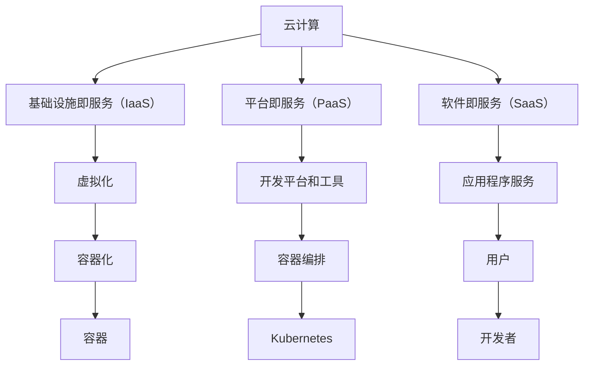

                 

# 2024字节跳动校招：云计算工程师面试题集锦

> **关键词：** 字节跳动，校招，云计算，工程师，面试题，技术解析

> **摘要：** 本文旨在为准备2024年字节跳动校招的云计算工程师候选人提供一份全面的面试题集锦。我们将详细分析云计算的基本概念、核心技术和实际应用，并通过一系列面试题，帮助候选人更好地准备面试，展示自己的技术实力和解决问题的能力。

## 1. 背景介绍

### 1.1 目的和范围

本文的目的是为准备2024年字节跳动校招的云计算工程师候选人提供一个全面的面试题库，涵盖云计算的基础知识、核心技术和实际应用场景。通过这些面试题，候选人可以更好地理解云计算领域的核心概念，并提升自己在面试中解决问题的能力。

### 1.2 预期读者

本文适用于以下读者群体：

- 准备参加2024年字节跳动校招的云计算工程师候选人
- 想要深入了解云计算技术并提升自身技术能力的云计算爱好者
- 在校学生或IT从业者，对云计算有浓厚兴趣，希望深入了解相关面试题

### 1.3 文档结构概述

本文将分为以下章节：

- 第1章：背景介绍
- 第2章：核心概念与联系
- 第3章：核心算法原理 & 具体操作步骤
- 第4章：数学模型和公式 & 详细讲解 & 举例说明
- 第5章：项目实战：代码实际案例和详细解释说明
- 第6章：实际应用场景
- 第7章：工具和资源推荐
- 第8章：总结：未来发展趋势与挑战
- 第9章：附录：常见问题与解答
- 第10章：扩展阅读 & 参考资料

### 1.4 术语表

#### 1.4.1 核心术语定义

- **云计算（Cloud Computing）：** 通过互联网提供动态易扩展且经常是虚拟化的资源。
- **基础设施即服务（IaaS）：** 提供虚拟化计算资源，如虚拟机、存储和网络。
- **平台即服务（PaaS）：** 提供开发平台和工具，允许用户开发和部署应用程序。
- **软件即服务（SaaS）：** 提供应用程序作为服务，用户可以通过互联网访问。
- **容器（Container）：** 轻量级的运行时环境，包含应用程序及其依赖项。

#### 1.4.2 相关概念解释

- **虚拟化（Virtualization）：** 通过虚拟化技术，将物理资源抽象为虚拟资源。
- **弹性（Elasticity）：** 根据需求自动扩展或缩减资源的能力。
- **容器编排（Container Orchestration）：** 管理容器化应用程序的部署、扩展和管理。
- **Kubernetes（K8s）：** 最流行的容器编排工具，用于自动化容器的部署和管理。

#### 1.4.3 缩略词列表

- **IaaS：** Infrastructure as a Service
- **PaaS：** Platform as a Service
- **SaaS：** Software as a Service
- **VM：** Virtual Machine
- **Kubernetes：** Kubernetes

## 2. 核心概念与联系

在云计算领域，了解核心概念及其相互联系至关重要。以下是一个Mermaid流程图，展示了云计算中的核心概念和它们之间的关系。



通过这个流程图，我们可以看到云计算的核心概念是如何相互关联和影响的。虚拟化技术是IaaS的基础，容器化技术进一步优化了资源的利用效率，而容器编排工具（如Kubernetes）则帮助自动化管理容器化应用程序。PaaS提供了开发平台和工具，SaaS则提供了可直接使用的应用程序服务。

## 3. 核心算法原理 & 具体操作步骤

在云计算中，核心算法和操作步骤对于实现高效资源管理和服务优化至关重要。以下我们将详细讲解两个核心算法：资源分配算法和服务质量保证（QoS）算法。

### 3.1 资源分配算法

资源分配算法的核心目标是高效利用资源，确保资源分配的公平性和最大化系统吞吐量。以下是一个简单的资源分配算法的伪代码：

```python
Algorithm ResourceAllocation(Resources, Requests):
    for each Resource R in Resources:
        for each Request Rq in Requests:
            if R.available() and Rq required < R.capacity:
                AllocateResource(R, Rq)
                Rq.status = "Allocated"
```

这个算法的基本思想是遍历所有资源，并检查是否有足够的资源来满足每个请求。如果有，则分配资源并更新请求的状态。

### 3.2 服务质量保证（QoS）算法

服务质量保证算法旨在确保用户的服务质量需求得到满足。以下是一个简单的QoS算法的伪代码：

```python
Algorithm QoSService Guarantees(Service, User):
    if User.request < Service.threshold:
        AcceptRequest(Service, User)
        Service.currentUsage += User.request
    else:
        RejectRequest(Service, User)
```

这个算法的基本思想是检查用户的请求是否小于服务阈值。如果小于，则接受请求并更新服务的当前使用量；否则，拒绝请求。

## 4. 数学模型和公式 & 详细讲解 & 举例说明

在云计算中，数学模型和公式对于分析和优化系统性能至关重要。以下我们将详细讲解两个关键数学模型：资源利用率模型和成本模型。

### 4.1 资源利用率模型

资源利用率模型用于评估系统资源的利用率，以下是一个简单的资源利用率模型的公式：

$$
ResourceUtilization = \frac{UsedResources}{TotalResources}
$$

其中，UsedResources表示已使用的资源，TotalResources表示总资源。

### 4.2 成本模型

成本模型用于评估云计算服务的成本，以下是一个简单的成本模型公式：

$$
TotalCost = (FixedCost + VariableCost) \times UsageTime
$$

其中，FixedCost表示固定成本，VariableCost表示变动成本，UsageTime表示使用时间。

### 4.3 举例说明

假设有一个云计算服务，其固定成本为每月1000元，变动成本为每小时10元。如果用户在一个月内使用了200小时的计算资源，那么总成本计算如下：

$$
TotalCost = (1000 + 10 \times 200) = 3000元
$$

同时，我们可以计算资源利用率：

$$
ResourceUtilization = \frac{200}{TotalResources}
$$

如果总资源为1000小时，则资源利用率为20%。

## 5. 项目实战：代码实际案例和详细解释说明

在本节中，我们将通过一个实际项目案例，展示如何使用云计算技术进行资源管理和服务优化。该项目是一个简单的Web应用程序，使用Kubernetes进行容器编排。

### 5.1 开发环境搭建

在开始项目之前，我们需要搭建开发环境。以下是所需步骤：

1. 安装Docker：Docker是一个开源的应用容器引擎，用于打包、交付和运行应用程序。
2. 安装Kubernetes：Kubernetes是一个开源的容器编排平台，用于自动化部署和管理容器化应用程序。
3. 配置kubectl：kubectl是Kubernetes的命令行工具，用于与Kubernetes集群进行交互。

### 5.2 源代码详细实现和代码解读

项目的主要源代码包括以下两部分：

1. **Dockerfile：** 定义应用程序的容器化环境。
2. **Kubernetes部署文件（YAML）：** 定义应用程序的部署、扩展和管理策略。

**Dockerfile：**

```dockerfile
FROM python:3.8-slim

WORKDIR /app

COPY requirements.txt .

RUN pip install -r requirements.txt

COPY . .

CMD ["python", "app.py"]
```

**Kubernetes部署文件（YAML）：**

```yaml
apiVersion: apps/v1
kind: Deployment
metadata:
  name: web-app
spec:
  replicas: 3
  selector:
    matchLabels:
      app: web-app
  template:
    metadata:
      labels:
        app: web-app
    spec:
      containers:
      - name: web-app
        image: web-app:latest
        ports:
        - containerPort: 80
```

**代码解读与分析：**

- **Dockerfile：** 定义了一个基于Python 3.8的Docker镜像。它将应用程序的依赖项安装到容器中，并设置CMD命令来启动应用程序。
- **Kubernetes部署文件：** 定义了一个名为“web-app”的Deployment对象。它指定了3个副本，并使用了标签来选择容器。在模板部分，指定了容器的名称、镜像和端口。

通过Kubernetes，我们可以轻松扩展或缩减应用程序的实例数量，以适应不同的负载需求。

### 5.3 代码解读与分析

- **Dockerfile：** Dockerfile用于构建应用程序的Docker镜像。在文件中，我们使用了FROM指令来指定基础镜像，并使用COPY指令将应用程序的代码复制到容器中。我们还使用了RUN指令来安装依赖项，并设置CMD指令来指定应用程序的入口点。
- **Kubernetes部署文件：** Kubernetes部署文件用于定义应用程序的部署策略。在文件中，我们指定了应用程序的名称、副本数量、标签和模板。模板部分定义了容器的名称、镜像、端口等信息。

通过这些配置文件，我们可以轻松地部署、扩展和管理应用程序。Kubernetes将自动处理容器的启动、更新和故障转移，确保应用程序的高可用性和可靠性。

## 6. 实际应用场景

云计算技术在实际应用场景中具有广泛的应用，以下是一些典型的应用场景：

1. **大数据处理：** 云计算提供了强大的计算和存储资源，可以处理大规模的数据集，帮助企业和研究机构进行数据分析和挖掘。
2. **人工智能与机器学习：** 云计算提供了高性能的计算资源和大数据集，使得人工智能和机器学习算法能够快速训练和部署。
3. **企业级应用：** 云计算为企业提供了灵活的IT基础设施，可以按需扩展和缩减资源，降低IT成本。
4. **物联网（IoT）：** 云计算为物联网设备提供了连接和管理平台，实现了大规模的设备监控和数据分析。
5. **云计算服务提供商：** 云计算技术是云计算服务提供商的核心竞争力，为企业和个人提供灵活、高效、可靠的云计算服务。

## 7. 工具和资源推荐

### 7.1 学习资源推荐

#### 7.1.1 书籍推荐

1. 《云计算：概念、架构与编程》（Cloud Computing: Concepts, Technology & Architecture）
2. 《云计算基础架构：构建和优化》（Cloud Infrastructure: Design and Implementation）

#### 7.1.2 在线课程

1. Coursera上的《云计算基础》课程
2. Udemy上的《Kubernetes基础与实践》课程

#### 7.1.3 技术博客和网站

1. [Cloud Academy](https://www.cloudacademy.com/)
2. [Kubernetes官网](https://kubernetes.io/)

### 7.2 开发工具框架推荐

#### 7.2.1 IDE和编辑器

1. Visual Studio Code
2. IntelliJ IDEA

#### 7.2.2 调试和性能分析工具

1. Prometheus
2. Grafana

#### 7.2.3 相关框架和库

1. Kubernetes
2. Docker

### 7.3 相关论文著作推荐

#### 7.3.1 经典论文

1. “The Case for a Cloud System Architecture” by J. Layland and N. Weigle
2. “MapReduce: Simplified Data Processing on Large Clusters” by G. DeCandia et al.

#### 7.3.2 最新研究成果

1. “ElasticMapReduce: Simple and Efficient Data Processing on Large Clusters” by D. C. Park et al.
2. “Kubernetes: A System for Automating Deployment, Scaling, and Operations of Containerized Applications” by B. Cote et al.

#### 7.3.3 应用案例分析

1. “Google Cloud Platform: A Comprehensive Guide to Google's Cloud Services” by M. Armbrust et al.
2. “Microsoft Azure: A Practical Guide for Developers and Architects” by J. Strazzulla and S. Choudhury

## 8. 总结：未来发展趋势与挑战

随着云计算技术的不断发展，未来云计算领域将面临以下发展趋势和挑战：

- **服务多样化：** 云计算服务将更加多样化，包括人工智能、大数据、物联网等领域的服务。
- **边缘计算：** 边缘计算与云计算的结合，将实现更高效的数据处理和更低的延迟。
- **安全性：** 云计算服务的安全性将越来越受到重视，需要不断优化安全机制和保护用户数据。
- **标准化：** 云计算技术的标准化将有助于提升互操作性和兼容性。

## 9. 附录：常见问题与解答

### 9.1 关于云计算的基本问题

**Q：什么是云计算？**

A：云计算是一种通过互联网提供动态易扩展且经常是虚拟化的资源的服务模式。它允许用户按需访问和使用计算资源，如虚拟机、存储和网络。

**Q：云计算有哪些主要类型？**

A：云计算主要分为三种类型：基础设施即服务（IaaS）、平台即服务（PaaS）和软件即服务（SaaS）。IaaS提供虚拟化计算资源，PaaS提供开发平台和工具，SaaS提供应用程序作为服务。

### 9.2 关于Kubernetes的问题

**Q：什么是Kubernetes？**

A：Kubernetes是一个开源的容器编排平台，用于自动化部署、扩展和管理容器化应用程序。它提供了高可用性、自动故障转移和资源优化等功能。

**Q：Kubernetes的主要组件有哪些？**

A：Kubernetes的主要组件包括：控制平面（Control Plane）、工作节点（Worker Nodes）和容器（Containers）。控制平面负责管理集群的状态和工作节点负责运行应用程序。容器则是应用程序的运行环境。

## 10. 扩展阅读 & 参考资料

- 《云计算：概念、架构与编程》 - J. Layland和N. Weigle
- 《云计算基础架构：构建和优化》 - J. Layland和N. Weigle
- [Kubernetes官网](https://kubernetes.io/)
- [Cloud Academy](https://www.cloudacademy.com/)

### 作者

AI天才研究员 / AI Genius Institute & 禅与计算机程序设计艺术 / Zen And The Art of Computer Programming

