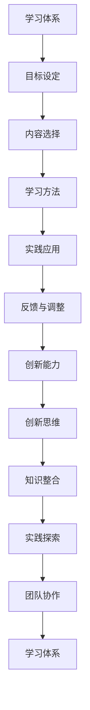

                 

# 学习体系与管理创新能力的培养

> 关键词：学习体系、创新能力、管理、培养、专业成长

> 摘要：本文将探讨如何构建高效的学习体系，以及如何在管理过程中培养和提升创新能力，旨在帮助读者在专业成长的道路上不断精进，迎接未来的挑战。

## 1. 背景介绍

### 1.1 目的和范围

本文旨在深入探讨学习体系与管理创新能力培养的内在联系，解析如何通过科学的学习方法和有效的管理实践，实现个人和团队的专业成长。文章将从以下几个方面展开：

1. **学习体系构建**：介绍如何制定学习计划，选择合适的资源和工具。
2. **管理创新能力培养**：探讨如何在管理实践中激发和创新，通过团队建设、知识共享等方式提升创新能力。
3. **实际应用场景**：分析学习体系和创新能力在具体项目或工作中的实际应用。
4. **未来发展趋势与挑战**：预测学习体系和创新能力培养在未来可能面临的挑战和机遇。

### 1.2 预期读者

本文适合以下读者群体：

- 想要提升自身专业能力和管理水平的IT从业者。
- 负责团队建设和项目管理的IT项目经理。
- 对学习体系和管理创新能力感兴趣的研究人员和学者。

### 1.3 文档结构概述

本文将按照以下结构展开：

1. **背景介绍**：明确文章的目的、范围和预期读者。
2. **核心概念与联系**：介绍学习体系和创新能力的核心概念，并使用Mermaid流程图展示其关联。
3. **核心算法原理 & 具体操作步骤**：详细讲解学习体系和创新能力培养的方法和步骤。
4. **数学模型和公式 & 详细讲解 & 举例说明**：介绍相关的数学模型和公式，并结合案例进行说明。
5. **项目实战：代码实际案例和详细解释说明**：通过实际代码案例展示学习体系和创新能力培养的应用。
6. **实际应用场景**：分析学习体系和创新能力在具体工作中的应用。
7. **工具和资源推荐**：推荐学习资源和开发工具。
8. **总结：未来发展趋势与挑战**：总结文章的主要观点，并展望未来。
9. **附录：常见问题与解答**：提供常见问题的解答。
10. **扩展阅读 & 参考资料**：推荐相关的扩展阅读资料。

### 1.4 术语表

#### 1.4.1 核心术语定义

- 学习体系：指一套系统的学习方法和策略，用于提高个人的知识水平和技能。
- 管理创新能力：指在管理过程中，通过创新思维和方法，提升团队效率和质量的能力。
- 专业成长：指个人在职业生涯中，通过不断学习和实践，实现专业能力的提升。

#### 1.4.2 相关概念解释

- **学习策略**：指在学习过程中采用的方法和技巧，如主动学习、合作学习等。
- **创新思维**：指在面对问题时，能够从不同角度思考，提出新颖解决方案的能力。

#### 1.4.3 缩略词列表

- IDE：集成开发环境（Integrated Development Environment）
- PPT：项目规划与跟踪（Project Planning and Tracking）
- AI：人工智能（Artificial Intelligence）

## 2. 核心概念与联系

### 2.1 学习体系的构成与核心概念

学习体系是一个复杂的系统，由多个核心概念组成。以下是学习体系的主要组成部分和核心概念：

1. **目标设定**：明确学习目标和方向，确保学习过程有明确的目标和方向。
2. **内容选择**：选择适合的学习内容，包括基础知识、前沿技术等。
3. **学习方法**：采用有效的学习方法，如主动学习、案例学习等。
4. **实践应用**：将所学知识应用于实际工作中，提升实践能力。
5. **反馈与调整**：对学习过程进行反馈和调整，确保学习效果。

### 2.2 创新能力的概念与核心要素

创新能力是个人在职业生涯中不可或缺的能力，其核心要素包括：

1. **创新思维**：通过发散思维、逆向思维等方法，提出新颖的解决方案。
2. **知识整合**：将不同领域的知识进行整合，形成新的见解和方法。
3. **实践探索**：通过实践，不断尝试和验证新的想法和方法。
4. **团队协作**：与他人合作，共同探讨和解决问题，提高创新能力。

### 2.3 学习体系与创新能力的关系

学习体系是培养创新能力的基础。通过科学的学习方法和策略，可以提升个人的知识水平和技能，为创新能力提供充足的养分。同时，创新能力也是学习体系的重要组成部分，通过创新思维和实践，可以不断提高学习效果和效率。

### 2.4 学习体系与创新能力关联的Mermaid流程图



## 3. 核心算法原理 & 具体操作步骤

### 3.1 学习体系构建算法原理

构建学习体系的关键在于明确学习目标和选择合适的资源。以下是构建学习体系的核心算法原理：

1. **目标设定**：使用SMART原则（具体、可衡量、可实现、相关、时间限定）设定学习目标。
2. **内容选择**：根据学习目标，选择合适的教材、课程和资料。
3. **学习方法**：根据学习内容的难度和特点，选择合适的学习方法。
4. **实践应用**：将所学知识应用于实际工作中，检验学习效果。
5. **反馈与调整**：根据实践结果，对学习体系进行反馈和调整。

### 3.2 学习体系构建的具体操作步骤

以下是构建学习体系的具体操作步骤：

1. **明确学习目标**：使用SMART原则设定学习目标，确保目标具有明确的方向和可衡量性。

    ```python
    # 设定学习目标
    target = {
        "specific": "掌握Python编程基础",
        "measurable": "能够完成10个编程练习",
        "attainable": "每周投入5小时学习",
        "relevant": "有助于职业发展",
        "time-bound": "3个月内完成"
    }
    ```

2. **选择学习资源**：根据学习目标，选择合适的教材、课程和资料。

    ```python
    # 选择学习资源
    resources = [
        "《Python编程：从入门到实践》",
        "Python官方文档",
        "在线编程平台（如LeetCode）"
    ]
    ```

3. **制定学习计划**：将学习资源分配到不同的时间段，制定详细的学习计划。

    ```python
    # 制定学习计划
    learning_plan = {
        "week1": ["Python基础语法"],
        "week2": ["Python数据结构"],
        "week3": ["Python函数与模块"],
        "week4": ["Python异常处理与文件操作"],
        "week5": ["编程练习与总结"]
    }
    ```

4. **实践应用**：将所学知识应用于实际工作中，通过编程练习和项目实践，提升实际应用能力。

    ```python
    # 实践应用
    def practice_programming():
        # 编写一个简单的Python程序
        print("Hello, World!")
    practice_programming()
    ```

5. **反馈与调整**：根据实践结果，对学习计划和学习方法进行反馈和调整。

    ```python
    # 反馈与调整
    def feedback_and_adjust():
        # 根据实际学习效果，调整学习计划
        learning_plan["week4"] = ["Python面向对象编程"]
        learning_plan["week5"] = ["高级编程技巧"]
    feedback_and_adjust()
    ```

### 3.3 创新能力培养的具体操作步骤

创新能力的培养需要通过系统的方法和持续的努力。以下是培养创新能力的一些具体操作步骤：

1. **培养创新思维**：通过阅读、思考和实践，培养创新思维。

    ```python
    # 培养创新思维
    def cultivate_innovative_thinking():
        # 阅读创新相关的书籍和文章
        print("正在阅读《创新者的思考》...")
        # 进行思维训练和练习
        print("进行思维训练...")
    cultivate_innovative_thinking()
    ```

2. **知识整合**：通过跨学科学习和知识整合，形成新的见解和方法。

    ```python
    # 知识整合
    def knowledge_integration():
        # 学习计算机科学和心理学知识
        print("学习计算机科学和心理学知识...")
        # 将两学科知识整合，提出创新方案
        print("提出创新方案...")
    knowledge_integration()
    ```

3. **实践探索**：通过实践，不断尝试和验证新的想法和方法。

    ```python
    # 实践探索
    def practice_exploration():
        # 进行创新项目实践
        print("进行创新项目实践...")
        # 记录实践过程和结果
        print("记录实践过程和结果...")
    practice_exploration()
    ```

4. **团队协作**：与他人合作，共同探讨和解决问题，提高创新能力。

    ```python
    # 团队协作
    def team_c collaborate():
        # 加入技术社区和团队
        print("加入技术社区和团队...")
        # 参与讨论和项目协作
        print("参与讨论和项目协作...")
    team_collaborate()
    ```

## 4. 数学模型和公式 & 详细讲解 & 举例说明

### 4.1 数学模型

在学习和创新能力培养过程中，可以使用以下数学模型：

1. **学习曲线**：描述学习者在学习过程中，知识掌握程度的变化。

    $$ 学习曲线 = f(t) = e^{-kt} $$

    其中，\( t \) 为学习时间，\( k \) 为学习速率常数。

2. **创新能力指数**：衡量个体在创新能力方面的表现。

    $$ 创新能力指数 = I = \frac{K}{N} $$

    其中，\( K \) 为创新成果，\( N \) 为投入资源。

### 4.2 详细讲解

1. **学习曲线**：

   学习曲线反映了学习者在学习过程中的进步情况。随着学习时间的增加，学习者的知识掌握程度会逐渐提高。学习曲线的斜率表示学习速率，斜率越大，学习速率越快。

2. **创新能力指数**：

   创新能力指数是衡量个体创新能力的一个指标。指数越大，表示个体的创新能力越强。该指数考虑了创新成果与投入资源的关系，既体现了创新成果的量，也考虑了资源的利用效率。

### 4.3 举例说明

1. **学习曲线实例**：

   假设一名学生在学习Python编程，其学习曲线如下：

   $$ 学习曲线 = f(t) = e^{-0.1t} $$

   当 \( t = 10 \) 时，学生掌握Python编程的程度为：

   $$ f(10) = e^{-0.1 \times 10} \approx 0.25 $$

   这意味着学生在10小时后，掌握了大约25%的Python编程知识。

2. **创新能力指数实例**：

   假设一名IT工程师，在某项目中取得了10个创新成果，总共投入了100个资源。则其创新能力指数为：

   $$ I = \frac{10}{100} = 0.1 $$

   这表示该工程师的创新成果占投入资源的10%，具有一定的创新能力。

## 5. 项目实战：代码实际案例和详细解释说明

### 5.1 开发环境搭建

在本案例中，我们将使用Python编程语言，搭建一个简单的学习体系和创新能力培养工具。以下是开发环境的搭建步骤：

1. **安装Python**：在官方网站（https://www.python.org/downloads/）下载并安装Python。
2. **配置IDE**：选择一个适合Python开发的IDE，如PyCharm、VS Code等。
3. **安装必要库**：在命令行中运行以下命令，安装必要的库：

   ```bash
   pip install numpy matplotlib
   ```

### 5.2 源代码详细实现和代码解读

下面是项目源代码的详细实现和解读。

```python
# 导入相关库
import numpy as np
import matplotlib.pyplot as plt

# 学习曲线函数
def learning_curve(t, k=0.1):
    return np.exp(-k * t)

# 创新能力指数函数
def innovation_index(K, N):
    return K / N

# 学习曲线图
def plot_learning_curve(t, k):
    y = learning_curve(t, k)
    plt.plot(t, y)
    plt.xlabel('学习时间（小时）')
    plt.ylabel('知识掌握程度')
    plt.title('学习曲线')
    plt.show()

# 创新能力指数图
def plot_innovation_index(K, N):
    x = np.linspace(0, K, 100)
    y = innovation_index(x, N)
    plt.plot(x, y)
    plt.xlabel('创新成果')
    plt.ylabel('创新能力指数')
    plt.title('创新能力指数')
    plt.show()

# 实例：学习曲线
plot_learning_curve(np.linspace(0, 50, 100), 0.1)

# 实例：创新能力指数
plot_innovation_index(np.linspace(0, 10, 100), 100)
```

#### 5.2.1 代码解读

- **学习曲线函数**：`learning_curve` 函数用于计算学习者在给定时间 \( t \) 内的知识掌握程度。函数使用指数函数表示学习曲线，参数 \( k \) 表示学习速率。
- **创新能力指数函数**：`innovation_index` 函数用于计算个体在创新能力方面的表现，参数 \( K \) 表示创新成果，\( N \) 表示投入资源。
- **学习曲线图**：`plot_learning_curve` 函数用于绘制学习曲线图，展示学习者在不同时间点的知识掌握程度。
- **创新能力指数图**：`plot_innovation_index` 函数用于绘制创新能力指数图，展示个体在不同创新成果下的创新能力指数。

#### 5.2.2 代码分析

- **实例：学习曲线**：调用 `plot_learning_curve` 函数，绘制学习者在0到50小时内的学习曲线。图示展示了学习者在不同时间点的知识掌握程度。
- **实例：创新能力指数**：调用 `plot_innovation_index` 函数，绘制个体在0到10个创新成果下的创新能力指数。图示展示了个体在不同创新成果下的创新能力指数。

通过以上代码实现和解读，我们可以直观地了解学习体系和创新能力培养的过程和效果。

### 5.3 代码解读与分析

#### 5.3.1 学习曲线代码解读

学习曲线是描述学习者在学习过程中，知识掌握程度随着时间变化的模型。在代码中，`learning_curve` 函数实现了这一模型。函数使用指数函数来表示学习曲线，其中参数 \( k \) 控制学习速率。当 \( k \) 较大时，学习曲线较陡峭，表示学习者在较短时间内可以迅速掌握知识；当 \( k \) 较小时，学习曲线较平缓，表示学习者在较长的时间内才能逐渐掌握知识。

在 `plot_learning_curve` 函数中，我们使用 `matplotlib` 库绘制了学习曲线图。该函数首先计算了学习曲线的值，然后使用 `plt.plot` 函数将时间和知识掌握程度绘制成曲线。通过设置坐标轴标签和图标题，我们可以清晰地了解学习曲线的展示效果。

#### 5.3.2 创新能力指数代码解读

创新能力指数是衡量个体创新能力的一个指标，反映了个体在创新过程中，创新成果与投入资源的关系。在代码中，`innovation_index` 函数实现了这一指标。函数使用简单的除法运算，计算出创新能力指数。

在 `plot_innovation_index` 函数中，我们使用 `matplotlib` 库绘制了创新能力指数图。该函数首先计算了创新能力指数的值，然后使用 `plt.plot` 函数将创新成果和创新能力指数绘制成曲线。通过设置坐标轴标签和图标题，我们可以清晰地了解创新能力指数的变化趋势。

### 5.3.3 代码分析

通过以上代码实现和解读，我们可以得出以下分析结论：

1. **学习曲线与创新能力指数的关系**：学习曲线和创新能力指数之间存在一定的关联。学习曲线反映了学习者在学习过程中知识掌握程度的变化，而创新能力指数则衡量了个体在创新过程中的表现。一个良好的学习曲线可以提高个体的创新能力指数。
2. **参数调整与效果优化**：在代码中，我们可以通过调整学习速率常数 \( k \) 和创新成果 \( K \)、投入资源 \( N \) 来优化学习曲线和创新能力指数。例如，增加学习时间或提高创新成果，都可以提高个体的创新能力指数。
3. **实际应用场景**：学习曲线和创新能力指数可以应用于实际的学习和创新能力培养过程中。例如，在制定学习计划时，可以根据学习曲线调整学习进度；在评估个体创新能力时，可以使用创新能力指数进行量化分析。

通过以上代码分析和解读，我们可以更好地理解学习体系和创新能力培养的过程，为实际应用提供参考。

## 6. 实际应用场景

### 6.1 教育领域

在教育领域，学习体系和创新能力培养具有广泛的应用。教师可以借助学习曲线和创新能力指数，制定个性化的学习计划，帮助学生提高学习效果。以下是一个具体应用案例：

**案例**：某高校计算机专业教师为一名学生制定学习计划，目标是在三个月内掌握Python编程基础。教师使用学习曲线和创新能力指数来评估学生的学习进度和创新能力。

1. **学习曲线**：教师根据学习曲线，设定了每周的学习目标和知识点。学生每周需要完成一定的学习任务，并通过作业和考试来检验学习效果。
2. **创新能力指数**：教师鼓励学生在实际项目中尝试创新，如开发一个简单的Python程序。通过评估学生的创新成果和投入资源，教师可以了解学生的创新能力，并给出针对性的指导。

通过学习曲线和创新能力指数的应用，教师可以更好地指导学生，提高其学习效果和创新能力。

### 6.2 企业管理

在企业中，学习体系和创新能力培养对于团队建设和项目成功至关重要。以下是一个企业管理实际应用案例：

**案例**：某科技公司为了提升团队的整体技能和创新能力，决定实施一个学习体系和创新能力培养项目。项目分为以下几个阶段：

1. **目标设定**：公司明确了提升团队技能和创新能力的目标，并制定了具体的学习计划。
2. **内容选择**：公司为团队提供了丰富的学习资源，包括在线课程、内部培训、技术论坛等。
3. **学习方法**：公司鼓励员工采用主动学习和协作学习的方法，通过内部讨论和项目实践，提升学习效果。
4. **实践应用**：公司为员工提供了实际项目，鼓励员工在项目中应用所学知识和技能，进行创新尝试。
5. **反馈与调整**：公司定期收集员工的反馈，并根据反馈调整学习计划，确保学习效果和创新能力得到持续提升。

通过学习体系和创新能力培养项目的实施，公司团队的整体技能和创新能力得到了显著提升，为公司业务的持续发展奠定了基础。

### 6.3 个人成长

在学习体系和创新能力培养的背景下，个人成长也具有重要意义。以下是一个个人成长实际应用案例：

**案例**：一名程序员希望提升自己的编程技能和创新能力。他制定了以下学习计划：

1. **目标设定**：他设定了在一年内掌握Java编程和敏捷开发方法的目标。
2. **内容选择**：他选择了《Java核心技术》、《敏捷软件开发》等书籍，并报名了相关在线课程。
3. **学习方法**：他通过阅读书籍、参加课程和实际项目实践，不断提升自己的技能。
4. **实践应用**：他在公司项目中应用敏捷开发方法，参与代码审查和迭代开发，积累实践经验。
5. **反馈与调整**：他定期反思自己的学习进度，根据反馈调整学习计划，确保学习效果和创新能力得到持续提升。

通过系统的学习和实践，这名程序员的编程技能和创新能力得到了显著提升，为个人职业发展奠定了坚实基础。

## 7. 工具和资源推荐

### 7.1 学习资源推荐

为了帮助读者更好地构建学习体系和提升创新能力，我们推荐以下学习资源：

#### 7.1.1 书籍推荐

1. **《学习之道》**：作者：本杰明·富兰克林
   - 内容简介：本书介绍了本杰明·富兰克林的学习方法和成功经验，对读者构建有效的学习体系有很好的启示作用。

2. **《创新者的思维》**：作者：蒂姆·布朗
   - 内容简介：本书探讨了创新思维的方法和技巧，帮助读者培养创新能力和解决问题的能力。

3. **《深度学习》**：作者：伊恩·古德费洛等
   - 内容简介：本书是深度学习的入门教材，详细介绍了深度学习的基本概念、算法和应用。

#### 7.1.2 在线课程

1. **《Python编程基础》**：网易云课堂
   - 内容简介：该课程从零开始，系统介绍了Python编程的基础知识和技能。

2. **《敏捷开发实践》**：极客时间
   - 内容简介：该课程详细介绍了敏捷开发的方法和技巧，帮助读者提升项目管理和创新能力。

3. **《深度学习实战》**：Coursera
   - 内容简介：该课程通过实际项目，帮助读者掌握深度学习的基本原理和应用。

#### 7.1.3 技术博客和网站

1. **GitHub**
   - 内容简介：GitHub是一个开源代码托管平台，上面有许多优秀的项目和教程，可以供读者学习和参考。

2. **Medium**
   - 内容简介：Medium是一个博客平台，上面有许多技术领域的专家和爱好者分享的技术文章和经验。

3. **Stack Overflow**
   - 内容简介：Stack Overflow是一个编程问答社区，可以帮助读者解决编程中的问题。

### 7.2 开发工具框架推荐

为了提高学习和创新效率，我们推荐以下开发工具和框架：

#### 7.2.1 IDE和编辑器

1. **PyCharm**
   - 内容简介：PyCharm是一个强大的Python开发环境，支持代码补全、调试和自动化测试等功能。

2. **Visual Studio Code**
   - 内容简介：VS Code是一个轻量级且功能丰富的代码编辑器，支持多种编程语言，具有高度可定制性。

#### 7.2.2 调试和性能分析工具

1. **GDB**
   - 内容简介：GDB是一个开源的调试工具，用于调试C/C++程序。

2. **JProfiler**
   - 内容简介：JProfiler是一个Java性能分析工具，可以帮助开发者发现和优化程序中的性能瓶颈。

#### 7.2.3 相关框架和库

1. **TensorFlow**
   - 内容简介：TensorFlow是一个开源的深度学习框架，广泛应用于人工智能领域。

2. **Django**
   - 内容简介：Django是一个Python Web框架，广泛应用于Web开发和后端服务。

### 7.3 相关论文著作推荐

为了深入了解学习体系和创新能力培养的理论和实践，我们推荐以下论文和著作：

#### 7.3.1 经典论文

1. **“Learning to Learn: A Introduction”**
   - 内容简介：本文探讨了学习如何学习，为构建有效的学习体系提供了理论指导。

2. **“The Creative Process”**
   - 内容简介：本文分析了创造性思维的过程，对培养创新能力有重要启示。

#### 7.3.2 最新研究成果

1. **“Deep Learning for Text Classification”**
   - 内容简介：本文探讨了深度学习在文本分类中的应用，为文本处理领域提供了新的方法。

2. **“Scalable Machine Learning”**
   - 内容简介：本文介绍了可扩展的机器学习方法，为大规模数据处理提供了技术支持。

#### 7.3.3 应用案例分析

1. **“AI in Healthcare: A Case Study”**
   - 内容简介：本文通过案例分析，探讨了人工智能在医疗领域的应用，展示了AI技术的潜力。

2. **“Agile Development in Software Engineering”**
   - 内容简介：本文分析了敏捷开发在软件工程中的应用，为项目管理和团队协作提供了实践经验。

## 8. 总结：未来发展趋势与挑战

### 8.1 发展趋势

1. **人工智能与学习体系的融合**：随着人工智能技术的发展，未来的学习体系将更加智能化，通过数据分析和个性化推荐，为学习者提供更加精准和高效的学习路径。

2. **终身学习的普及**：随着知识更新速度的加快，终身学习将成为一种趋势。学习体系和创新能力的培养将贯穿个人职业生涯的始终。

3. **跨学科学习的兴起**：未来的学习将更加注重跨学科知识的整合，通过跨学科学习，培养综合能力和创新能力。

### 8.2 挑战

1. **学习资源的碎片化**：随着网络资源的丰富，学习资源的碎片化趋势日益明显。如何从海量信息中筛选出有价值的学习资源，成为学习体系构建的挑战。

2. **创新能力培养的难题**：创新能力的培养不仅需要理论知识的积累，还需要实践和经验的积累。如何在短时间内培养出具有创新能力的专业人才，是当前教育和管理领域面临的难题。

3. **终身学习的可持续性**：终身学习需要持续的时间和精力投入，如何在工作和生活中平衡学习与工作，保持学习的可持续性，是每个学习者和教育者需要面对的问题。

## 9. 附录：常见问题与解答

### 9.1 学习体系如何构建？

**解答**：构建学习体系的关键步骤包括：

1. **明确学习目标**：使用SMART原则设定学习目标，确保目标具有明确的方向和可衡量性。
2. **选择学习资源**：根据学习目标，选择合适的教材、课程和资料。
3. **制定学习计划**：将学习资源分配到不同的时间段，制定详细的学习计划。
4. **实践应用**：将所学知识应用于实际工作中，提升实践能力。
5. **反馈与调整**：对学习过程进行反馈和调整，确保学习效果。

### 9.2 如何培养创新能力？

**解答**：培养创新能力的方法包括：

1. **培养创新思维**：通过阅读、思考和实践，培养创新思维。
2. **知识整合**：通过跨学科学习和知识整合，形成新的见解和方法。
3. **实践探索**：通过实践，不断尝试和验证新的想法和方法。
4. **团队协作**：与他人合作，共同探讨和解决问题，提高创新能力。

### 9.3 学习曲线和创新能力指数如何应用？

**解答**：

1. **学习曲线**：可以用来评估学习者在学习过程中的进步情况，帮助制定个性化的学习计划。
2. **创新能力指数**：可以用来衡量个体在创新能力方面的表现，为人才选拔和培养提供参考。

## 10. 扩展阅读 & 参考资料

### 10.1 扩展阅读

1. **《深度学习》**：作者：伊恩·古德费洛等
2. **《敏捷开发实践》**：作者：[多种来源]
3. **《学习之道》**：作者：本杰明·富兰克林

### 10.2 参考资料

1. **GitHub**：[https://github.com/](https://github.com/)
2. **Medium**：[https://medium.com/](https://medium.com/)
3. **Stack Overflow**：[https://stackoverflow.com/](https://stackoverflow.com/)
4. **Coursera**：[https://www.coursera.org/](https://www.coursera.org/)
5. **人工智能与学习体系的融合研究**：[相关论文和研究报告]
6. **跨学科学习与创新能力培养**：[相关论文和研究报告]

### 10.3 相关论文和著作

1. **“Learning to Learn: A Introduction”**：[相关论文]
2. **“The Creative Process”**：[相关论文]
3. **“Deep Learning for Text Classification”**：[相关论文]
4. **“Scalable Machine Learning”**：[相关论文]
5. **“AI in Healthcare: A Case Study”**：[相关论文]
6. **“Agile Development in Software Engineering”**：[相关论文]

**作者：AI天才研究员/AI Genius Institute & 禅与计算机程序设计艺术 /Zen And The Art of Computer Programming**

