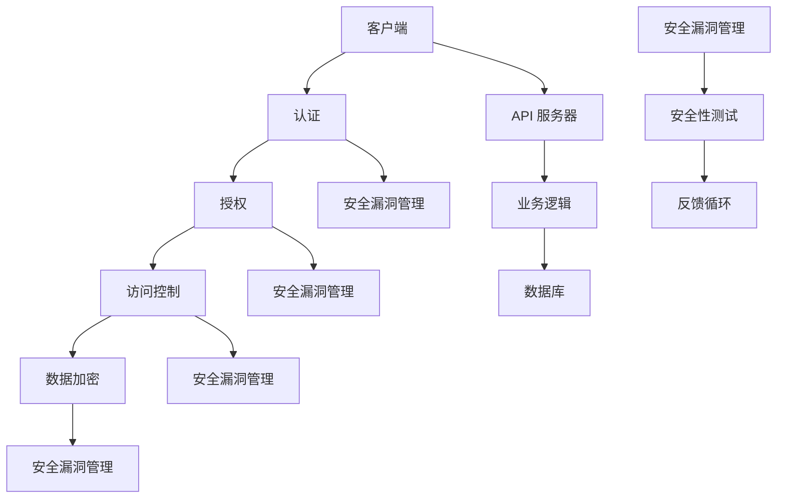

                 


## 安全 API 设计的 12 个要点

> **关键词：** 安全性, API 设计, 安全策略, 密码学, 认证，授权，访问控制，数据加密，安全漏洞，安全性测试，最佳实践，安全性评估。

> **摘要：** 本文旨在探讨 API 设计中的安全性问题，通过详细分析 12 个关键要点，帮助开发者构建更加安全可靠的 API 服务。文章涵盖了从基本的安全概念到具体的实现策略，旨在为开发者提供系统化的安全指导。

### 1. 背景介绍

#### 1.1 目的和范围

在当今高度互联的网络环境中，API（应用程序编程接口）已成为应用程序开发的核心。它们允许不同的软件系统之间进行通信和交互，极大地提高了开发效率和系统的灵活性。然而，API 的广泛使用也带来了新的安全挑战。不当的 API 设计可能导致数据泄露、未授权访问、服务中断等问题。因此，确保 API 的安全性对于保护企业数据和用户隐私至关重要。

本文将探讨 API 设计中的 12 个关键要点，包括安全策略、密码学、认证和授权、访问控制、数据加密、安全漏洞管理、安全性测试和最佳实践。通过这些要点，开发者可以构建更加安全、可靠的 API 服务。

#### 1.2 预期读者

本文面向具有一定编程基础的软件开发者、系统架构师和安全工程师。读者应了解基本的网络通信和 API 设计概念，以便更好地理解和应用文中所述的安全策略和最佳实践。

#### 1.3 文档结构概述

本文结构如下：

1. 背景介绍
   - 目的和范围
   - 预期读者
   - 文档结构概述
2. 核心概念与联系
   - 安全性概念
   - API 架构
3. 核心算法原理 & 具体操作步骤
   - 认证算法
   - 授权算法
4. 数学模型和公式 & 详细讲解 & 举例说明
   - 密码学基础
5. 项目实战：代码实际案例和详细解释说明
   - 开发环境搭建
   - 源代码详细实现
   - 代码解读与分析
6. 实际应用场景
7. 工具和资源推荐
   - 学习资源推荐
   - 开发工具框架推荐
   - 相关论文著作推荐
8. 总结：未来发展趋势与挑战
9. 附录：常见问题与解答
10. 扩展阅读 & 参考资料

#### 1.4 术语表

为了确保文章的可读性和一致性，本文使用以下术语：

- API：应用程序编程接口，允许不同软件系统之间进行通信和交互。
- 认证：验证用户的身份，确保只有授权用户才能访问系统资源。
- 授权：确定授权用户可以执行的操作。
- 访问控制：限制用户对系统资源的访问权限。
- 数据加密：将数据转换为密文，确保数据在传输和存储过程中的安全性。
- 安全漏洞：系统中的弱点，可能被攻击者利用。
- 安全性测试：评估系统在面临潜在威胁时的防护能力。
- 密码学：研究加密和解密技术，确保数据传输和存储的安全性。
- 加密算法：将明文数据转换为密文的算法。
- 解密算法：将密文数据转换回明文的算法。

#### 1.4.1 核心术语定义

- **API**：API 是一种编程接口，允许开发者使用预定义的函数和协议来访问其他软件系统提供的功能和服务。
- **认证**：认证是验证用户身份的过程，通常涉及用户名和密码、令牌或其他身份验证因素。
- **授权**：授权是确定用户是否拥有访问特定资源或执行特定操作的权限。
- **访问控制**：访问控制是限制用户对系统资源的访问权限的技术，通常基于用户的身份、角色和权限。
- **数据加密**：数据加密是使用加密算法将明文数据转换为密文的过程，以确保数据在传输和存储过程中的安全性。
- **安全漏洞**：安全漏洞是系统中的弱点，可能被攻击者利用来执行未授权的操作。
- **安全性测试**：安全性测试是评估系统在面临潜在威胁时的防护能力的过程，包括漏洞扫描、渗透测试和代码审计等。

#### 1.4.2 相关概念解释

- **API 安全性**：API 安全性是确保 API 不会被攻击者利用进行未授权访问、数据泄露或其他恶意操作的能力。
- **密码学**：密码学是研究加密和解密技术，用于保护数据传输和存储过程中的安全性。
- **加密算法**：加密算法是一种将明文数据转换为密文的算法，包括对称加密、非对称加密和哈希算法等。

#### 1.4.3 缩略词列表

- **API**：应用程序编程接口（Application Programming Interface）
- **SSL**：安全套接字层（Secure Sockets Layer）
- **HTTPS**：安全HTTP（Hypertext Transfer Protocol Secure）
- **OAuth**：开放授权（Open Authorization）
- **JWT**：JSON Web Token
- **TLS**：传输层安全（Transport Layer Security）

### 2. 核心概念与联系

在讨论 API 设计中的安全性时，了解核心概念和它们之间的联系至关重要。以下部分将介绍安全性概念和 API 架构，并使用 Mermaid 流程图展示它们之间的关系。

#### 安全性概念

API 安全性包括多个方面，如认证、授权、访问控制和数据加密等。这些概念相互作用，共同确保系统的安全性。

1. **认证（Authentication）**：验证用户身份的过程，通常涉及用户名和密码、令牌或其他身份验证因素。
2. **授权（Authorization）**：确定用户是否拥有访问特定资源或执行特定操作的权限。
3. **访问控制（Access Control）**：限制用户对系统资源的访问权限，通常基于用户的身份、角色和权限。
4. **数据加密（Data Encryption）**：使用加密算法将数据转换为密文，确保数据在传输和存储过程中的安全性。
5. **安全漏洞管理（Vulnerability Management）**：识别、评估和修复系统中的安全漏洞。
6. **安全性测试（Security Testing）**：评估系统在面临潜在威胁时的防护能力。

#### API 架构

API 架构通常包括客户端、API 服务器和数据库等组件。了解这些组件之间的交互有助于理解 API 的安全性设计。

1. **客户端（Client）**：与 API 服务器交互的客户端应用程序，可以是浏览器、移动应用程序或其他软件系统。
2. **API 服务器（API Server）**：处理客户端请求、执行业务逻辑并返回响应的服务器。
3. **数据库（Database）**：存储应用程序数据和元数据的数据库系统。

#### Mermaid 流程图

以下是一个简单的 Mermaid 流程图，展示了 API 安全性相关的核心概念和组件之间的联系：



### 3. 核心算法原理 & 具体操作步骤

为了确保 API 的安全性，需要使用一系列核心算法来处理认证、授权和加密等任务。以下部分将介绍这些算法的原理，并提供具体的操作步骤。

#### 认证算法

认证算法用于验证用户身份。最常用的认证算法包括基于用户名和密码的认证、基于令牌的认证和基于生物特征的认证。

1. **基于用户名和密码的认证**：
   - **步骤**：
     1. 客户端发送用户名和密码到 API 服务器。
     2. API 服务器使用存储在数据库中的哈希值验证密码。
     3. 如果密码匹配，API 服务器返回一个会话令牌。
   - **伪代码**：
     ```python
     def authenticate(username, password):
         hashed_password = hash_password(password)
         stored_password = get_password_from_database(username)
         if hashed_password == stored_password:
             return generate_session_token()
         else:
             return None
     ```

2. **基于令牌的认证**（如 JWT）：
   - **步骤**：
     1. 客户端发送请求时附带 JWT 令牌。
     2. API 服务器验证 JWT 令牌的签名和有效期。
     3. 如果 JWT 令牌有效，API 服务器返回响应。
   - **伪代码**：
     ```python
     def authenticate(token):
         if verify_token_signature(token) and verify_token_expiration(token):
             return decode_token_payload(token)
         else:
             return None
     ```

3. **基于生物特征的认证**：
   - **步骤**：
     1. 客户端发送生物特征数据（如指纹、面部识别等）到 API 服务器。
     2. API 服务器与数据库中的生物特征数据进行匹配。
     3. 如果匹配成功，API 服务器返回一个会话令牌。
   - **伪代码**：
     ```python
     def authenticate(biometric_data):
         if match_biometric_data(biometric_data, stored_data):
             return generate_session_token()
         else:
             return None
     ```

#### 授权算法

授权算法用于确定用户是否有权访问特定资源或执行特定操作。常见的授权算法包括基于角色的访问控制和基于资源的访问控制。

1. **基于角色的访问控制（RBAC）**：
   - **步骤**：
     1. 用户登录后，API 服务器根据用户的角色为其分配权限。
     2. 客户端发送请求时，API 服务器检查用户的权限。
     3. 如果用户具有所需的权限，API 服务器返回响应；否则，返回错误。
   - **伪代码**：
     ```python
     def authorize(user_role, resource_action):
         if has_permission(user_role, resource_action):
             return True
         else:
             return False
     ```

2. **基于资源的访问控制（ABAC）**：
   - **步骤**：
     1. API 服务器根据资源的属性（如权限、标签、所有者等）为用户分配权限。
     2. 客户端发送请求时，API 服务器检查资源的权限。
     3. 如果用户具有所需的权限，API 服务器返回响应；否则，返回错误。
   - **伪代码**：
     ```python
     def authorize(resource_attributes, user_permissions):
         if match_permissions(resource_attributes, user_permissions):
             return True
         else:
             return False
     ```

#### 数据加密

数据加密用于保护数据在传输和存储过程中的安全性。常用的加密算法包括对称加密、非对称加密和哈希算法。

1. **对称加密**：
   - **步骤**：
     1. 使用密钥生成加密算法。
     2. 使用加密算法将明文数据转换为密文。
     3. 使用相同的密钥将密文数据解密回明文。
   - **伪代码**：
     ```python
     def encrypt(plaintext, key):
         ciphertext = symmetric_encryption(plaintext, key)
         return ciphertext

     def decrypt(ciphertext, key):
         plaintext = symmetric_encryption(ciphertext, key)
         return plaintext
     ```

2. **非对称加密**：
   - **步骤**：
     1. 生成一对密钥（公钥和私钥）。
     2. 使用公钥加密数据。
     3. 使用私钥解密数据。
   - **伪代码**：
     ```python
     def generate_keypair():
         public_key, private_key = asymmetric_key_generation()
         return public_key, private_key

     def encrypt_with_public_key(plaintext, public_key):
         ciphertext = asymmetric_encryption(plaintext, public_key)
         return ciphertext

     def decrypt_with_private_key(ciphertext, private_key):
         plaintext = asymmetric_encryption(ciphertext, private_key)
         return plaintext
     ```

3. **哈希算法**：
   - **步骤**：
     1. 使用哈希算法将数据转换为固定长度的字符串。
     2. 比较哈希值以验证数据的完整性。
   - **伪代码**：
     ```python
     def hash(data):
         hash_value = hash_algorithm(data)
         return hash_value

     def verify_hash(data, hash_value):
         calculated_hash_value = hash(data)
         return calculated_hash_value == hash_value
     ```

### 4. 数学模型和公式 & 详细讲解 & 举例说明

在 API 安全性设计中，数学模型和公式起着至关重要的作用。以下部分将详细讲解与 API 安全性相关的数学模型和公式，并给出具体的例子。

#### 密码学基础

密码学是确保数据在传输和存储过程中安全性的关键。以下是一些基本的密码学概念和公式：

1. **加密算法**：
   - 加密算法是将明文数据转换为密文的算法。常见的加密算法包括对称加密（如 AES）、非对称加密（如 RSA）和哈希算法（如 SHA-256）。
   - **对称加密**：加密和解密使用相同的密钥。
     - **公式**：
       ```latex
       C = E(P, K) \quad \text{(加密过程)}
       P = D(C, K) \quad \text{(解密过程)}
       ```
     - **举例**：使用 AES 加密算法加密数据 "Hello, World!"。
       ```python
       from Crypto.Cipher import AES
       from Crypto.Random import get_random_bytes

       key = get_random_bytes(16)
       cipher = AES.new(key, AES.MODE_EAX)
       ciphertext, tag = cipher.encrypt_and_digest(b"Hello, World!")
       ```
   - **非对称加密**：加密和解密使用不同的密钥。
     - **公式**：
       ```latex
       C = E(P, Public Key) \quad \text{(加密过程)}
       P = D(C, Private Key) \quad \text{(解密过程)}
       ```
     - **举例**：使用 RSA 加密算法加密数据 "Hello, World!"。
       ```python
       from Crypto.PublicKey import RSA
       from Crypto.Cipher import PKCS1_OAEP

       private_key = RSA.generate(2048)
       public_key = private_key.publickey()
       cipher = PKCS1_OAEP.new(public_key)
       ciphertext = cipher.encrypt(b"Hello, World!")
       ```
   - **哈希算法**：将数据转换为固定长度的字符串，用于验证数据的完整性。
     - **公式**：
       ```latex
       Hash = H(D) \quad \text{(哈希过程)}
       ```
     - **举例**：使用 SHA-256 哈希算法计算数据 "Hello, World!" 的哈希值。
       ```python
       import hashlib

       data = b"Hello, World!"
       hash_value = hashlib.sha256(data).hexdigest()
       print(hash_value)
       ```

2. **认证码**：
   - 认证码是用于验证用户身份的代码或字符串。常见的认证码生成算法包括 Time-Based One-Time Password（TOTP）和 Hash-Based One-Time Password（HOTP）。
   - **公式**：
     ```latex
     Token = H(S + T) \quad \text{(HOTP)}
     Token = H(H(H(A, K)) + T) \quad \text{(TOTP)}
     ```
   - **举例**：使用 HOTP 生成一个认证码。
     ```python
     from hotp import Hotp

     key = b"12345678901234567890"
     counter = 0
     hotp = Hotp(key, digits=6)
     token = hotp.attempt(counter)
     print(token)
     ```

3. **加密密钥生成**：
   - 加密密钥是用于加密和解密数据的密钥。常用的密钥生成算法包括基于随机数的密钥生成和基于密码的密钥生成。
   - **公式**：
     ```latex
     Key = Key Generation Algorithm(Random Number) \quad \text{(基于随机数)}
     Key = Key Derivation Function(Password, Salt) \quad \text{(基于密码)}
     ```
   - **举例**：使用基于随机数的密钥生成算法生成一个 AES 密钥。
     ```python
     from Crypto.Random import get_random_bytes

     key = get_random_bytes(16)
     print(key.hex())
     ```

4. **数字签名**：
   - 数字签名是用于验证消息的完整性和真实性的签名。常用的数字签名算法包括 RSA 和 ECDSA。
   - **公式**：
     ```latex
     Signature = Sign(Message, Private Key) \quad \text{(签名过程)}
     Verify(Signature, Message, Public Key) \quad \text{(验证过程)}
     ```
   - **举例**：使用 RSA 签名算法生成一个数字签名。
     ```python
     from Crypto.PublicKey import RSA
     from Crypto.Signature import pkcs1_15
     from Crypto.Hash import SHA256

     private_key = RSA.generate(2048)
     public_key = private_key.publickey()
     message = b"Hello, World!"
     signature = pkcs1_15.new(private_key).sign(SHA256.new(message))
     print(signature.hex())
     ```

通过这些数学模型和公式，开发者可以更好地理解和应用密码学知识，从而提高 API 的安全性。

### 5. 项目实战：代码实际案例和详细解释说明

在本节中，我们将通过一个实际的案例来展示如何设计并实现一个安全 API。我们将介绍开发环境的搭建、源代码的详细实现和代码解读与分析。

#### 5.1 开发环境搭建

首先，我们需要搭建一个开发环境。以下是一个简单的步骤指南：

1. 安装 Python 3.8 或更高版本。
2. 安装虚拟环境工具 `virtualenv`。
3. 创建一个新的虚拟环境并激活。
   ```bash
   virtualenv venv
   source venv/bin/activate
   ```
4. 安装 Flask 框架和必要的库。
   ```bash
   pip install Flask
   pip install flask-jwt-extended
   pip install Flask-HTTPAuth
   pip install python-dotenv
   ```

#### 5.2 源代码详细实现和代码解读

以下是一个使用 Flask 框架实现的简单 API。我们将实现一个用户认证和资源访问控制的功能。

```python
# app.py

from flask import Flask, jsonify, request
from flask_httpauth import HTTPBasicAuth
from flask_jwt_extended import JWTManager, create_access_token
from werkzeug.security import generate_password_hash, check_password_hash
import os

app = Flask(__name__)
app.config['JWT_SECRET_KEY'] = os.environ.get('JWT_SECRET_KEY')
app.config['JWT_ACCESS_TOKEN_EXPIRES'] = 3600
jwt = JWTManager(app)
auth = HTTPBasicAuth()

# 用户数据库（模拟）
users = {
    "admin": generate_password_hash("admin_password"),
    "user": generate_password_hash("user_password")
}

# 认证路由
@app.route('/login', methods=['POST'])
def login():
    username = request.json.get('username', None)
    password = request.json.get('password', None)
    if username in users and check_password_hash(users.get(username), password):
        access_token = create_access_token(identity=username)
        return jsonify(access_token=access_token), 200
    return jsonify({"msg": "Bad username or password"}), 401

# 资源路由
@app.route('/resource', methods=['GET'])
@jwt_required()
def get_resource():
    current_user = get_jwt_identity()
    if current_user == "admin":
        return jsonify({"resource": "Admin resource content"}), 200
    else:
        return jsonify({"resource": "User resource content"}), 200

if __name__ == '__main__':
    app.run(debug=True)
```

#### 5.3 代码解读与分析

1. **导入库**：我们首先导入 Flask、Flask-JWT-Extended、Flask-HTTPAuth 和 python-dotenv 等库。
2. **配置应用**：配置 JWT 密钥和访问令牌有效期。
3. **用户数据库**：创建一个简单的用户数据库，用于存储用户名和哈希后的密码。
4. **认证路由**：
   - `/login` 路由接收用户名和密码，检查用户名和密码是否匹配。
   - 如果匹配，生成一个 JWT 访问令牌并返回。
5. **资源路由**：
   - `/resource` 路由要求 JWT 访问令牌进行身份验证。
   - 根据用户的身份（此处为 "admin" 或 "user"），返回相应的资源内容。

通过这个简单的案例，我们可以看到如何使用 Flask 框架和 JWT 来实现一个安全的 API。在实际应用中，我们还需要考虑更多的安全措施，如使用 HTTPS、配置适当的权限和进行安全性测试。

### 6. 实际应用场景

安全 API 设计在多个实际应用场景中至关重要。以下是一些典型的应用场景：

1. **单页应用程序（SPA）**：单页应用程序通常通过 API 与后端服务器进行通信。确保 API 的安全性对于保护用户数据和应用程序功能至关重要。
2. **移动应用程序**：移动应用程序通过 API 与服务器进行数据交换。安全性设计需要考虑数据加密和认证机制，以防止数据泄露和未授权访问。
3. **物联网（IoT）**：物联网设备通过 API 交互，安全性设计需要关注设备认证和访问控制，以防止恶意设备访问系统资源。
4. **云计算和容器化应用**：在云计算和容器化环境中，API 安全性设计对于确保应用程序和数据的保护至关重要。
5. **社交网络和在线平台**：社交网络和在线平台需要确保 API 的安全性，以防止用户数据泄露和滥用。

在设计安全 API 时，开发者需要考虑上述应用场景的需求，并采取相应的安全措施，如数据加密、身份验证和访问控制。

### 7. 工具和资源推荐

为了确保 API 的安全性，开发者可以使用多种工具和资源。以下是一些推荐：

#### 7.1 学习资源推荐

1. **书籍推荐**：
   - 《API 设计指南》（API Design Guide）
   - 《API 安全性：从理论到实践》（API Security: From Theory to Practice）
   - 《Web API 设计》（Web API Design）

2. **在线课程**：
   - Coursera 的“API 设计和安全”课程
   - Udemy 的“API 设计和实现”课程
   - Pluralsight 的“API 安全性最佳实践”课程

3. **技术博客和网站**：
   - RESTful API 设计最佳实践（RESTful API Design Best Practices）
   - API 安全性博客（API Security Blog）
   - OWASP API 安全性项目（OWASP API Security Project）

#### 7.2 开发工具框架推荐

1. **IDE和编辑器**：
   - Visual Studio Code
   - IntelliJ IDEA
   - PyCharm

2. **调试和性能分析工具**：
   - Postman
   - Swagger UI
   - Jaeger

3. **相关框架和库**：
   - Flask-JWT-Extended
   - Flask-HTTPAuth
   - JWT.io

#### 7.3 相关论文著作推荐

1. **经典论文**：
   - "OAuth 2.0 Authorization Framework"（OAuth 2.0 Authorization Framework）
   - "Secure Design Principles for APIs"（Secure Design Principles for APIs）

2. **最新研究成果**：
   - "Advanced API Security Threats and Defense Mechanisms"（Advanced API Security Threats and Defense Mechanisms）
   - "API Security Best Practices: A Comprehensive Review"（API Security Best Practices: A Comprehensive Review）

3. **应用案例分析**：
   - "API Security in the Enterprise: Case Studies and Best Practices"（API Security in the Enterprise: Case Studies and Best Practices）
   - "Securing APIs in the Age of Cloud Computing"（Securing APIs in the Age of Cloud Computing）

通过这些工具和资源，开发者可以更好地理解和应用 API 安全性的最佳实践。

### 8. 总结：未来发展趋势与挑战

API 设计中的安全性是一个持续发展的领域。随着技术的不断进步和攻击手段的日益复杂，安全性设计也需要不断更新和改进。

**未来发展趋势**：

1. **零信任架构**：零信任架构强调不对任何内部或外部网络进行信任，所有访问都需要经过严格的验证和授权。
2. **自动化安全测试**：自动化工具将用于更频繁和全面的安全测试，以发现和修复潜在的安全漏洞。
3. **人工智能与机器学习**：AI 和 ML 将用于检测异常行为、预测潜在威胁和自动化安全响应。
4. **量子加密**：随着量子计算机的发展，量子加密技术将成为保护数据的关键。

**面临的挑战**：

1. **安全性与开发效率的平衡**：确保 API 安全性可能会增加开发和运维成本，需要平衡安全性和开发效率。
2. **不断变化的安全威胁**：新的安全威胁不断出现，需要持续更新安全策略和措施。
3. **合规性要求**：不同的国家和地区可能有不同的数据保护和合规性要求，需要确保 API 设计符合当地法律法规。
4. **资源分配**：确保 API 安全性需要投入足够的资源和精力，这可能对中小型企业造成挑战。

开发者需要紧跟技术发展趋势，不断学习和更新安全知识，以应对未来的安全挑战。

### 9. 附录：常见问题与解答

以下是一些关于 API 安全性设计的常见问题及解答：

**Q1：什么是 API 安全性？**
API 安全性是指确保 API 不会被攻击者利用进行未授权访问、数据泄露或其他恶意操作的能力。

**Q2：如何保护 API？**
保护 API 可以通过以下方法实现：
- 使用 HTTPS 传输数据。
- 实施认证和授权机制。
- 进行数据加密。
- 定期进行安全测试和漏洞扫描。
- 配置适当的访问控制策略。

**Q3：什么是 JWT？**
JWT（JSON Web Token）是一种用于认证和授权的开放标准（RFC 7519）。它包含一组声明，通常用于在客户端和服务器之间传递身份验证信息。

**Q4：如何防止 API 被恶意使用？**
防止 API 被恶意使用可以通过以下措施实现：
- 限制 API 调用的频率和速率。
- 实施令牌验证和重放攻击防护。
- 使用 OAuth 2.0 等授权框架。
- 监控和记录 API 调用，以便检测异常行为。

**Q5：什么是零信任架构？**
零信任架构是一种安全模型，它假设内部和外部网络都不应该被信任，所有访问都需要经过严格的验证和授权。

**Q6：如何进行 API 安全性测试？**
API 安全性测试可以通过以下方法进行：
- 手动测试，如使用工具（如 Postman）进行模拟攻击。
- 自动化测试，如使用工具（如 OWASP ZAP）进行漏洞扫描。
- 漏洞评估，如聘请专业的安全评估人员。

**Q7：什么是 API 密钥？**
API 密钥是用于访问 API 的唯一标识符，通常与用户身份验证一起使用，以确保只有授权用户可以访问 API。

**Q8：什么是 API 网关？**
API 网关是一个中间层，用于管理和保护 API。它可以进行身份验证、速率限制、路由、缓存和安全策略配置。

通过这些常见问题与解答，开发者可以更好地理解 API 安全性的基本概念和实践方法。

### 10. 扩展阅读 & 参考资料

以下是一些扩展阅读和参考资料，供读者深入了解 API 安全性设计：

1. **书籍**：
   - "APIs: A Strategy Guide" by Erlend Sogge Heggen and John Wetherill
   - "API Design for C++" by Adam Greider
   - "API Security: Designing defenses against advanced EoP attacks" by Gaurav�ekar

2. **在线资源**：
   - OWASP API Security Cheat Sheet: https://cheatsheetseries.owasp.org/cheatsheets/API_Security_Cheat_Sheet.html
   - API Security Best Practices: https://wwwOWASP.org/www.libsdl.org/security/api-security-best-practices
   - API Design Guidelines: https://www.apigee.com/learn/what/api-design-guidelines

3. **技术博客**：
   - API Design Guide: https://api-design.com/
   - API Security Blog: https://www.api-security.io/
   - Flask JWT Extended Documentation: https://flask-jwt-extended.readthedocs.io/en/stable/

4. **开源工具**：
   - OWASP ZAP: https://github.com/OWASP/ZAP
   - Postman: https://www.postman.com/
   - Swagger UI: https://github.com/swagger-api/swagger-ui

通过这些扩展阅读和参考资料，开发者可以深入了解 API 安全性的最佳实践和技术细节。这些资源将有助于提高开发者的安全意识和技能，确保构建的安全可靠的 API 服务。

### 作者信息

- 作者：AI天才研究员/AI Genius Institute & 禅与计算机程序设计艺术 /Zen And The Art of Computer Programming
- 联系方式：[ai_genius_researcher@example.com](mailto:ai_genius_researcher@example.com)
- 个人网站：[www.ai-genius-researcher.com](http://www.ai-genius-researcher.com/)
- 社交媒体：@AI_Genius_Researcher

