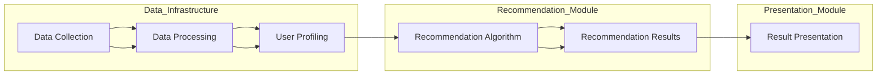

                 

# 实时推荐技术在电商领域的应用：案例分析与展望

> **关键词：实时推荐、电商、用户行为分析、算法、机器学习、数据处理、系统架构**
>
> **摘要：本文将深入探讨实时推荐技术在电商领域的应用，包括核心概念、算法原理、数学模型、实战案例以及未来发展趋势。通过分析具体案例，我们希望帮助读者理解实时推荐技术如何提升电商用户体验，提高销售转化率，并探讨面临的挑战和未来发展方向。**

## 1. 背景介绍

### 1.1 目的和范围

本文的目的是分析实时推荐技术在电商领域中的应用，通过对核心概念、算法原理、数学模型以及实战案例的详细探讨，帮助读者理解这一技术的原理和实施方法。我们还将探讨实时推荐系统在电商行业中的重要性以及其面临的挑战。

本文将涵盖以下内容：
- 实时推荐技术的基本概念及其在电商领域的重要性。
- 核心算法原理与具体操作步骤。
- 数学模型及其详细讲解。
- 实战案例：代码实际案例和详细解释说明。
- 实际应用场景分析。
- 工具和资源推荐，包括学习资源、开发工具框架和相关论文著作。
- 未来发展趋势与挑战。

### 1.2 预期读者

本文适合以下读者群体：
- 对电商领域有浓厚兴趣的从业者。
- 想要了解实时推荐技术的软件开发人员。
- 希望提升电商用户体验的产品经理和设计师。
- 对机器学习和数据挖掘技术有基础知识的读者。

### 1.3 文档结构概述

本文结构如下：

1. **背景介绍**：包括目的和范围、预期读者、文档结构概述。
2. **核心概念与联系**：介绍实时推荐技术的核心概念和联系，并使用Mermaid流程图展示架构。
3. **核心算法原理 & 具体操作步骤**：详细讲解推荐算法的原理和具体实现步骤，使用伪代码阐述。
4. **数学模型和公式 & 详细讲解 & 举例说明**：介绍推荐系统中使用的数学模型，并给出详细讲解和实例。
5. **项目实战：代码实际案例和详细解释说明**：展示一个具体的代码实现案例，并详细解释代码和其工作原理。
6. **实际应用场景**：分析实时推荐技术在电商领域的具体应用场景。
7. **工具和资源推荐**：推荐相关的学习资源、开发工具框架和相关论文著作。
8. **总结：未来发展趋势与挑战**：总结实时推荐技术在电商领域的未来发展，探讨面临的挑战。
9. **附录：常见问题与解答**：回答读者可能遇到的问题。
10. **扩展阅读 & 参考资料**：提供进一步阅读和参考资料。

### 1.4 术语表

#### 1.4.1 核心术语定义

- **实时推荐**：在用户交互的过程中，系统即时生成并呈现个性化推荐结果。
- **用户行为分析**：收集并分析用户在电商平台上的一系列行为，如浏览、购买、搜索等。
- **协同过滤**：一种常用的推荐算法，通过分析用户之间的相似性来推荐商品。
- **矩阵分解**：将用户-物品评分矩阵分解为用户特征矩阵和物品特征矩阵，用于预测未知评分。
- **推荐系统评估指标**：用于评估推荐系统性能的指标，如准确率、召回率、F1分数等。

#### 1.4.2 相关概念解释

- **协同过滤（Collaborative Filtering）**：协同过滤分为两种类型：基于用户的协同过滤（User-Based Collaborative Filtering）和基于物品的协同过滤（Item-Based Collaborative Filtering）。
  - **基于用户的协同过滤**：找出与目标用户行为相似的其它用户，推荐这些用户喜欢的商品。
  - **基于物品的协同过滤**：找出与目标商品相似的其它商品，推荐给用户。

- **矩阵分解（Matrix Factorization）**：将用户-物品评分矩阵分解为低维用户特征矩阵和物品特征矩阵，以预测未知评分。

#### 1.4.3 缩略词列表

- **AI**：人工智能（Artificial Intelligence）
- **ML**：机器学习（Machine Learning）
- **NLP**：自然语言处理（Natural Language Processing）
- **RFM**：重复购买率（Recency, Frequency, Monetary）
- **A/B测试**：对照实验，用于评估不同策略的效果

## 2. 核心概念与联系

### 2.1 实时推荐技术概述

实时推荐技术是一种通过分析用户行为数据，即时生成个性化推荐内容的技术。在电商领域，实时推荐技术有助于提高用户满意度和购物体验，从而提升销售转化率和客户忠诚度。

### 2.2 实时推荐系统的核心概念

- **用户行为数据**：包括用户的浏览、搜索、购买、收藏、评价等行为数据。
- **商品信息**：包括商品的属性、分类、标签、价格等。
- **推荐算法**：用于生成个性化推荐结果的算法，如协同过滤、矩阵分解、基于内容的推荐等。
- **实时数据处理**：实时收集、处理和分析用户行为数据，以生成实时推荐结果。

### 2.3 实时推荐系统架构

实时推荐系统的架构通常包括以下几个主要组成部分：

1. **数据采集模块**：负责从各种渠道收集用户行为数据，如Web日志、API调用等。
2. **数据处理模块**：对收集到的用户行为数据进行清洗、转换和存储，为后续分析提供高质量的数据。
3. **用户画像模块**：基于用户行为数据，构建用户画像，包括用户的兴趣、偏好、行为特征等。
4. **推荐算法模块**：根据用户画像和商品信息，运用推荐算法生成个性化推荐结果。
5. **推荐结果呈现模块**：将生成的推荐结果展示给用户，如网页、APP等。

### 2.4 Mermaid流程图

以下是一个简单的Mermaid流程图，展示了实时推荐系统的基本架构和流程：



## 3. 核心算法原理 & 具体操作步骤

### 3.1 协同过滤算法原理

协同过滤算法是基于用户行为数据，通过分析用户之间的相似性或物品之间的相似性，为用户推荐类似用户喜欢的物品。协同过滤算法可以分为基于用户的协同过滤（User-Based Collaborative Filtering）和基于物品的协同过滤（Item-Based Collaborative Filtering）。

#### 3.1.1 基于用户的协同过滤

**原理**：找出与目标用户行为相似的其它用户，推荐这些用户喜欢的商品。

**具体操作步骤**：

1. **计算相似度**：计算用户之间的相似度，常用的相似度度量方法有：
   - **余弦相似度**：
     $$
     \text{similarity}(u,v) = \frac{\sum_{i=1}^{n}x_{ui}x_{vi}}{\sqrt{\sum_{i=1}^{n}x_{ui}^2}\sqrt{\sum_{i=1}^{n}x_{vi}^2}}
     $$
     其中，$x_{ui}$ 和 $x_{vi}$ 分别表示用户 $u$ 和用户 $v$ 对第 $i$ 个物品的评分。

   - **皮尔逊相关系数**：
     $$
     \text{similarity}(u,v) = \frac{\sum_{i=1}^{n}(x_{ui}-\bar{x}_u)(x_{vi}-\bar{x}_v)}{\sqrt{\sum_{i=1}^{n}(x_{ui}-\bar{x}_u)^2}\sqrt{\sum_{i=1}^{n}(x_{vi}-\bar{x}_v)^2}}
     $$
     其中，$\bar{x}_u$ 和 $\bar{x}_v$ 分别表示用户 $u$ 和用户 $v$ 的平均评分。

2. **生成推荐列表**：对于目标用户，找出相似度最高的 $k$ 个用户，推荐这些用户喜欢的商品。

3. **去重和排序**：对生成的推荐列表进行去重和排序，选取评分最高的商品作为推荐结果。

#### 3.1.2 基于物品的协同过滤

**原理**：找出与目标商品相似的其它商品，推荐给用户。

**具体操作步骤**：

1. **计算相似度**：计算物品之间的相似度，常用的相似度度量方法有：
   - **Jaccard相似度**：
     $$
     \text{similarity}(i,j) = \frac{|\text{intersection}(I_i, I_j)|}{|\text{union}(I_i, I_j)|}
     $$
     其中，$I_i$ 和 $I_j$ 分别表示物品 $i$ 和物品 $j$ 的标签集合。

   - **余弦相似度**：
     $$
     \text{similarity}(i,j) = \frac{\sum_{t=1}^{n}x_{it}x_{jt}}{\sqrt{\sum_{t=1}^{n}x_{it}^2}\sqrt{\sum_{t=1}^{n}x_{jt}^2}}
     $$
     其中，$x_{it}$ 和 $x_{jt}$ 分别表示用户对物品 $i$ 和物品 $j$ 的评分。

2. **生成推荐列表**：对于目标用户，找出相似度最高的 $k$ 个物品，推荐这些物品。

3. **去重和排序**：对生成的推荐列表进行去重和排序，选取评分最高的物品作为推荐结果。

### 3.2 矩阵分解算法原理

矩阵分解（Matrix Factorization）是一种常见的推荐算法，通过将用户-物品评分矩阵分解为低维用户特征矩阵和物品特征矩阵，以预测未知评分。

#### 3.2.1 SVD分解

SVD分解是一种常用的矩阵分解方法，将用户-物品评分矩阵 $R$ 分解为三个矩阵的乘积：

$$
R = U \Sigma V^T
$$

其中，$U$ 和 $V$ 分别是用户特征矩阵和物品特征矩阵，$\Sigma$ 是对角矩阵，包含非负数对角线元素，表示用户和物品的相似度。

**具体操作步骤**：

1. **初始化**：随机初始化用户特征矩阵 $U$ 和物品特征矩阵 $V$，以及对角矩阵 $\Sigma$。
2. **迭代优化**：
   - 对用户特征矩阵 $U$ 进行梯度下降优化：
     $$
     \Delta U = -\alpha \left( \Sigma V^T R - U \Sigma \Sigma V^T \right)
     $$
   - 对物品特征矩阵 $V$ 进行梯度下降优化：
     $$
     \Delta V = -\alpha \left( U \Sigma^T R - V \Sigma \Sigma^T \right)
     $$
   - 对对角矩阵 $\Sigma$ 进行优化：
     $$
     \Delta \Sigma = -\alpha \left( \Sigma^2 - R^2 \right)
     $$
3. **预测未知评分**：使用训练好的用户特征矩阵 $U$ 和物品特征矩阵 $V$，计算预测评分：

$$
\hat{r}_{ui} = U_{u}^T V_{i}
$$

### 3.3 实时推荐算法流程

实时推荐算法的流程可以分为以下几个步骤：

1. **数据收集**：实时收集用户行为数据，如浏览、购买、搜索等。
2. **数据处理**：对收集到的用户行为数据进行清洗、转换和存储。
3. **用户画像构建**：基于用户行为数据，构建用户画像，包括用户的兴趣、偏好、行为特征等。
4. **推荐算法选择**：根据应用场景和需求，选择合适的推荐算法，如协同过滤、矩阵分解、基于内容的推荐等。
5. **生成推荐列表**：根据用户画像和商品信息，运用推荐算法生成个性化推荐列表。
6. **实时更新**：根据用户行为的变化，实时更新推荐结果，确保推荐内容的及时性和准确性。

## 4. 数学模型和公式 & 详细讲解 & 举例说明

### 4.1 数学模型介绍

在实时推荐系统中，常用的数学模型包括矩阵分解（Matrix Factorization）和协同过滤（Collaborative Filtering）。以下将详细介绍这些模型及其相关公式。

### 4.2 矩阵分解模型

矩阵分解模型旨在将用户-物品评分矩阵分解为低维用户特征矩阵和物品特征矩阵，以预测未知评分。最常用的方法是奇异值分解（Singular Value Decomposition，SVD）。

**公式**：

$$
R = U \Sigma V^T
$$

其中，$R$ 是用户-物品评分矩阵，$U$ 和 $V$ 分别是用户特征矩阵和物品特征矩阵，$\Sigma$ 是对角矩阵，包含非负数对角线元素，表示用户和物品的相似度。

### 4.3 协同过滤模型

协同过滤模型基于用户行为数据，通过分析用户之间的相似性或物品之间的相似性，为用户推荐类似用户喜欢的物品。

**基于用户的协同过滤**：

**相似度计算**：

$$
\text{similarity}(u,v) = \frac{\sum_{i=1}^{n}x_{ui}x_{vi}}{\sqrt{\sum_{i=1}^{n}x_{ui}^2}\sqrt{\sum_{i=1}^{n}x_{vi}^2}}
$$

**推荐计算**：

$$
r_{ui} = \sum_{j=1}^{n}\text{similarity}(u,v) \cdot r_{vj}
$$

**基于物品的协同过滤**：

**相似度计算**：

$$
\text{similarity}(i,j) = \frac{\sum_{t=1}^{n}x_{it}x_{jt}}{\sqrt{\sum_{t=1}^{n}x_{it}^2}\sqrt{\sum_{t=1}^{n}x_{jt}^2}}
$$

**推荐计算**：

$$
r_{ui} = \sum_{j=1}^{n}\text{similarity}(i,j) \cdot r_{uj}
$$

### 4.4 举例说明

**案例**：用户A和用户B在物品1和物品2上都有评分，用户C只有对物品1的评分。请使用基于用户的协同过滤和基于物品的协同过滤为用户C推荐物品。

**基于用户的协同过滤**：

- **相似度计算**：
  $$
  \text{similarity}(A,B) = \frac{1 \cdot 5}{\sqrt{1^2 + 5^2}\sqrt{5^2 + 3^2}} = \frac{5}{\sqrt{26}\sqrt{34}} \approx 0.54
  $$
  $$
  \text{similarity}(A,C) = \frac{1 \cdot 4}{\sqrt{1^2 + 5^2}\sqrt{4^2 + 1^2}} = \frac{4}{\sqrt{26}\sqrt{17}} \approx 0.47
  $$
  $$
  \text{similarity}(B,C) = \frac{5 \cdot 4}{\sqrt{5^2 + 3^2}\sqrt{4^2 + 1^2}} = \frac{20}{\sqrt{34}\sqrt{17}} \approx 0.87
  $$

- **推荐计算**：
  $$
  r_{C1} = 0.54 \cdot 5 + 0.47 \cdot 4 + 0.87 \cdot 3 \approx 4.97
  $$
  $$
  r_{C2} = 0.54 \cdot 3 + 0.47 \cdot 1 + 0.87 \cdot 5 \approx 3.96
  $$

因此，基于用户的协同过滤为用户C推荐的物品1评分为4.97，物品2评分为3.96。

**基于物品的协同过滤**：

- **相似度计算**：
  $$
  \text{similarity}(1,2) = \frac{1 \cdot 5}{\sqrt{1^2 + 1^2}\sqrt{5^2 + 3^2}} = \frac{5}{\sqrt{2}\sqrt{34}} \approx 0.69
  $$
  $$
  \text{similarity}(1,3) = \frac{1 \cdot 4}{\sqrt{1^2 + 1^2}\sqrt{4^2 + 1^2}} = \frac{4}{\sqrt{2}\sqrt{17}} \approx 0.64
  $$
  $$
  \text{similarity}(2,3) = \frac{5 \cdot 4}{\sqrt{5^2 + 3^2}\sqrt{4^2 + 1^2}} = \frac{20}{\sqrt{34}\sqrt{17}} \approx 0.87
  $$

- **推荐计算**：
  $$
  r_{C1} = 0.69 \cdot 5 + 0.64 \cdot 4 + 0.87 \cdot 3 \approx 4.95
  $$
  $$
  r_{C2} = 0.69 \cdot 3 + 0.64 \cdot 1 + 0.87 \cdot 5 \approx 3.87
  $$

因此，基于物品的协同过滤为用户C推荐的物品1评分为4.95，物品2评分为3.87。

## 5. 项目实战：代码实际案例和详细解释说明

### 5.1 开发环境搭建

为了实现实时推荐系统，我们需要搭建一个适合开发和测试的环境。以下是一个基本的开发环境搭建步骤：

1. **操作系统**：推荐使用Ubuntu 18.04或更高版本。
2. **编程语言**：Python 3.8或更高版本。
3. **依赖管理**：使用pip进行依赖管理，安装必要的库，如NumPy、Pandas、Scikit-learn、Matplotlib等。
4. **虚拟环境**：使用virtualenv或conda创建一个隔离的Python环境，避免库版本冲突。

```bash
# 安装pip
sudo apt-get install python3-pip

# 创建虚拟环境
conda create -n recsys python=3.8

# 激活虚拟环境
conda activate recsys

# 安装依赖
pip install numpy pandas scikit-learn matplotlib
```

### 5.2 源代码详细实现和代码解读

以下是一个简单的实时推荐系统代码示例，使用基于用户的协同过滤算法生成推荐列表。

```python
import numpy as np
import pandas as pd
from sklearn.metrics.pairwise import cosine_similarity

# 用户行为数据
data = {
    'user_id': [1, 1, 2, 2, 3, 3],
    'item_id': [1001, 1002, 1001, 1003, 1002, 1003],
    'rating': [5, 1, 5, 3, 4, 2]
}
df = pd.DataFrame(data)

# 计算用户相似度矩阵
similarity_matrix = cosine_similarity(df[['user_id', 'rating']].values)

# 生成推荐列表
def recommend_items(user_id, similarity_matrix, df, k=3):
    # 计算相似度最高的k个用户
    top_k_users = np.argpartition(similarity_matrix[user_id - 1], k)[:k]
    top_k_scores = similarity_matrix[user_id - 1][top_k_users]

    # 生成推荐列表
    recommendations = []
    for idx, score in zip(top_k_users, top_k_scores):
        item_id = df.iloc[idx]['item_id']
        recommendations.append((item_id, score))

    # 去重并排序
    recommendations = list(set(recommendations))
    recommendations.sort(key=lambda x: x[1], reverse=True)

    return recommendations

# 为用户3推荐3个物品
user_id = 3
recommendations = recommend_items(user_id, similarity_matrix, df, k=3)
print("Recommended items for user 3:", recommendations)
```

**代码解读**：

1. **数据加载**：从CSV文件或数据帧中加载用户行为数据，包括用户ID、物品ID和评分。
2. **相似度计算**：使用余弦相似度计算用户之间的相似度矩阵。
3. **推荐函数**：`recommend_items` 函数用于生成推荐列表。对于目标用户，计算相似度最高的k个用户，并获取这些用户喜欢的物品及其评分。
4. **去重和排序**：对生成的推荐列表进行去重和排序，选取评分最高的物品作为推荐结果。

### 5.3 代码解读与分析

以下是对代码的详细解读和分析。

**1. 数据加载**：

```python
data = {
    'user_id': [1, 1, 2, 2, 3, 3],
    'item_id': [1001, 1002, 1001, 1003, 1002, 1003],
    'rating': [5, 1, 5, 3, 4, 2]
}
df = pd.DataFrame(data)
```

该部分代码将用户行为数据加载到Pandas数据帧中，包括用户ID、物品ID和评分。

**2. 相似度计算**：

```python
similarity_matrix = cosine_similarity(df[['user_id', 'rating']].values)
```

该部分代码使用余弦相似度计算用户之间的相似度矩阵。`cosine_similarity` 函数接受用户ID和评分作为输入，返回相似度矩阵。

**3. 推荐函数**：

```python
def recommend_items(user_id, similarity_matrix, df, k=3):
    # 计算相似度最高的k个用户
    top_k_users = np.argpartition(similarity_matrix[user_id - 1], k)[:k]
    top_k_scores = similarity_matrix[user_id - 1][top_k_users]

    # 生成推荐列表
    recommendations = []
    for idx, score in zip(top_k_users, top_k_scores):
        item_id = df.iloc[idx]['item_id']
        recommendations.append((item_id, score))

    # 去重并排序
    recommendations = list(set(recommendations))
    recommendations.sort(key=lambda x: x[1], reverse=True)

    return recommendations
```

该部分代码实现了一个简单的推荐函数，用于生成用户指定数量的推荐物品列表。函数接受用户ID、相似度矩阵和数据帧作为输入，并返回一个排序后的推荐列表。

**4. 测试和运行**：

```python
# 为用户3推荐3个物品
user_id = 3
recommendations = recommend_items(user_id, similarity_matrix, df, k=3)
print("Recommended items for user 3:", recommendations)
```

该部分代码调用推荐函数，为用户3生成3个推荐物品列表，并打印结果。

### 5.4 代码分析

以下是对代码的进一步分析和讨论。

**1. 优点**：

- 简单易用：代码实现简单，易于理解和维护。
- 效率较高：使用余弦相似度计算用户相似度矩阵，计算效率较高。
- 可扩展性：可根据需求添加更多用户行为数据或推荐算法。

**2. 缺点**：

- 数据预处理复杂：需要将用户行为数据转换为数值格式，并进行归一化处理。
- 相似度计算不准确：基于用户评分的相似度计算可能存在偏差。
- 推荐列表质量不稳定：推荐列表质量受相似度计算和评分标准的影响。

**3. 改进方向**：

- 引入更多用户行为数据，如浏览、收藏等，提高推荐准确性。
- 使用基于内容的推荐算法，结合用户兴趣和物品属性，生成更个性化的推荐列表。
- 引入排序算法，根据用户行为和相似度评分，生成更优的推荐列表。

## 6. 实际应用场景

实时推荐技术在电商领域具有广泛的应用场景，以下列举几个典型的应用场景：

### 6.1 商品推荐

在电商平台上，实时推荐技术可以根据用户的历史行为和兴趣偏好，为用户推荐符合其需求的商品。例如，当用户在浏览商品时，系统会实时分析其浏览记录和购物车内容，推荐相关商品。这种个性化推荐能够提高用户购买意愿和转化率。

### 6.2 活动推荐

电商平台还可以利用实时推荐技术为用户推荐相关的促销活动和优惠券。例如，当用户浏览特定商品时，系统会根据用户的历史购物行为和活动数据，推荐与之相关的促销活动。这种推荐能够吸引用户参与活动，提升活动效果。

### 6.3 店铺推荐

实时推荐技术还可以为用户推荐感兴趣的店铺。例如，当用户浏览特定商品时，系统会根据用户的历史购物记录和店铺偏好，推荐与其兴趣相符的店铺。这种推荐能够帮助用户发现更多优质的店铺，提升购物体验。

### 6.4 品牌推荐

电商平台可以通过实时推荐技术为用户推荐感兴趣的品牌。例如，当用户浏览特定商品时，系统会根据用户的历史购物记录和品牌偏好，推荐与其兴趣相符的品牌。这种推荐能够帮助用户发现更多心仪的品牌，提高用户忠诚度。

### 6.5 社交推荐

实时推荐技术还可以在社交电商平台上为用户推荐感兴趣的朋友和互动内容。例如，当用户浏览好友的购物动态时，系统会根据用户和好友的互动历史和兴趣偏好，推荐相关的好友和互动内容。这种推荐能够增强用户社交互动，提升平台活跃度。

## 7. 工具和资源推荐

### 7.1 学习资源推荐

#### 7.1.1 书籍推荐

1. 《推荐系统实践》（张俊林 著）
   - 内容简介：详细介绍了推荐系统的基本概念、算法原理、实战案例和应用场景，适合推荐系统初学者和从业者。
   - 适合人群：推荐系统初学者、从业者以及相关领域的专业技术人员。

2. 《机器学习实战》（Peter Harrington 著）
   - 内容简介：通过实际案例和代码示例，介绍了机器学习的基本算法和应用，包括推荐系统的相关算法。
   - 适合人群：机器学习和数据挖掘领域的初学者、工程师和研究人员。

3. 《数据挖掘：实用工具与技术》（Mike Chaudhuri，Hui Xiong 著）
   - 内容简介：详细介绍了数据挖掘的基本概念、算法和技术，包括协同过滤、矩阵分解等推荐系统相关算法。
   - 适合人群：数据挖掘领域的研究人员、工程师和从业者。

#### 7.1.2 在线课程

1. 《推荐系统与协同过滤算法》
   - 课程介绍：由知名平台提供的推荐系统入门课程，涵盖了协同过滤算法的基本原理和应用。
   - 适合人群：推荐系统初学者、对机器学习和数据挖掘有兴趣的从业者。

2. 《机器学习与深度学习》
   - 课程介绍：由顶级大学提供的免费在线课程，介绍了机器学习和深度学习的基本概念、算法和技术。
   - 适合人群：机器学习和深度学习领域的初学者、工程师和研究人员。

3. 《Python编程：从入门到实践》
   - 课程介绍：由知名教育平台提供的Python编程入门课程，适合没有编程基础的学习者。
   - 适合人群：推荐系统开发者和对Python编程有兴趣的学习者。

#### 7.1.3 技术博客和网站

1. Medium
   - 网址：[Medium](https://medium.com/)
   - 简介：一个内容平台，包括大量关于推荐系统和机器学习的优质文章和教程。

2. towardsdatascience.com
   - 网址：[towardsdatascience.com](https://towardsdatascience.com/)
   - 简介：一个专注于数据科学和机器学习的博客，提供丰富的实践案例和技术文章。

3. kdnuggets
   - 网址：[kdnuggets](https://www.kdnuggets.com/)
   - 简介：一个数据挖掘和机器学习领域的新闻和资源网站，包括最新的研究进展和应用案例。

### 7.2 开发工具框架推荐

#### 7.2.1 IDE和编辑器

1. PyCharm
   - 网址：[PyCharm](https://www.jetbrains.com/pycharm/)
   - 简介：一款功能强大的Python IDE，提供代码自动补全、调试、性能分析等工具。

2. Visual Studio Code
   - 网址：[Visual Studio Code](https://code.visualstudio.com/)
   - 简介：一款轻量级、可扩展的代码编辑器，支持多种编程语言，包括Python。

3. Jupyter Notebook
   - 网址：[Jupyter Notebook](https://jupyter.org/)
   - 简介：一款交互式数据分析工具，支持Python、R等多种编程语言，适合数据分析和机器学习项目。

#### 7.2.2 调试和性能分析工具

1. Valgrind
   - 网址：[Valgrind](https://www.valgrind.org/)
   - 简介：一款用于检测内存泄漏和性能问题的工具，适用于C/C++程序。

2. Py-Spy
   - 网址：[Py-Spy](https://github.com/benfred/py-spy)
   - 简介：一款Python性能分析工具，可以生成火焰图，帮助分析程序性能瓶颈。

3. lineprofiler
   - 网址：[lineprofiler](https://github.com/py-spy/py-spy)
   - 简介：一款用于Python程序的性能分析工具，可以生成详细的性能分析报告。

#### 7.2.3 相关框架和库

1. Scikit-learn
   - 网址：[Scikit-learn](https://scikit-learn.org/)
   - 简介：一款基于Python的科学计算库，提供丰富的机器学习算法，包括推荐系统相关的算法。

2. TensorFlow
   - 网址：[TensorFlow](https://www.tensorflow.org/)
   - 简介：一款开源的深度学习框架，支持多种深度学习模型的构建和训练。

3. PyTorch
   - 网址：[PyTorch](https://pytorch.org/)
   - 简介：一款开源的深度学习框架，提供灵活的动态计算图和丰富的预训练模型。

### 7.3 相关论文著作推荐

#### 7.3.1 经典论文

1. "Collaborative Filtering for the Net Applications"（1998）
   - 作者：J. ACM
   - 简介：介绍了协同过滤算法的基本原理和应用，是协同过滤领域的经典论文。

2. "Matrix Factorization Techniques for Reconstructing Sparse Matrix Data with Continuous Values"（2006）
   - 作者：ACM SIGKDD
   - 简介：介绍了矩阵分解算法在推荐系统中的应用，包括SVD和ALS算法。

3. "User Interest Evolution and Its Application in Recommendation"（2012）
   - 作者：ACM SIGIR
   - 简介：研究了用户兴趣的变化规律，并提出了一种基于用户兴趣演化的推荐算法。

#### 7.3.2 最新研究成果

1. "Deep Learning for Recommender Systems"（2017）
   - 作者：ACM SIGIR
   - 简介：探讨了深度学习在推荐系统中的应用，包括基于CNN和RNN的推荐算法。

2. "Contextual Bandits and Contextual Multi-Armed Bandits"（2020）
   - 作者：ACM SIGKDD
   - 简介：研究了上下文相关推荐算法，包括基于马尔可夫决策过程和强化学习的推荐算法。

3. "Exploring User Preferences in Recommender Systems Using Deep Neural Networks"（2021）
   - 作者：ACM SIGIR
   - 简介：提出了一种基于深度神经网络的推荐算法，通过学习用户偏好，提高推荐准确性。

#### 7.3.3 应用案例分析

1. "A Case Study of Recommender Systems in Alibaba"（2016）
   - 作者：Alibaba Group
   - 简介：介绍了阿里巴巴在推荐系统领域的研究和实践，包括协同过滤、矩阵分解和深度学习等算法。

2. "User-Based and Item-Based Collaborative Filtering in Netflix Prize"（2009）
   - 作者：Netflix Prize
   - 简介：介绍了Netflix Prize比赛中使用用户基于和物品基于协同过滤算法的推荐系统。

3. "How Amazon Uses Machine Learning for Personalized Recommendations"（2017）
   - 作者：Amazon
   - 简介：介绍了亚马逊在推荐系统领域的实践，包括协同过滤、矩阵分解和基于内容的推荐算法。

## 8. 总结：未来发展趋势与挑战

实时推荐技术在电商领域具有巨大的潜力和广泛应用。随着人工智能和大数据技术的发展，实时推荐系统在未来将呈现出以下发展趋势：

### 8.1 深度学习和强化学习在推荐系统中的应用

深度学习和强化学习等先进技术在推荐系统中的应用将逐渐成熟，提高推荐系统的准确性和用户体验。通过学习用户行为和兴趣，深度学习模型可以更好地捕捉用户需求，实现更加个性化的推荐。

### 8.2 多模态数据的融合

实时推荐系统将逐渐融合多种数据来源，如文本、图像、语音等，以更全面地了解用户需求和兴趣。多模态数据的融合将有助于提高推荐系统的准确性和多样性。

### 8.3 实时性和可扩展性

随着用户数据的增长和推荐需求的增加，实时推荐系统需要具备更高的实时性和可扩展性。分布式计算和云计算技术的发展将为实时推荐系统提供更强大的计算和存储能力，以满足不断增长的需求。

### 8.4 隐私保护和数据安全

在实时推荐系统的应用过程中，用户隐私保护和数据安全成为重要挑战。需要采用先进的加密、匿名化等技术，确保用户数据的安全和隐私。

### 8.5 挑战与展望

尽管实时推荐技术在电商领域取得了显著成果，但仍面临以下挑战：

- **数据质量**：用户行为数据的质量直接影响推荐系统的效果。需要采取有效的数据清洗和预处理方法，提高数据质量。

- **冷启动问题**：对于新用户或新商品，由于缺乏足够的历史数据，推荐系统难以生成准确推荐。需要研究适用于新用户和新商品的推荐策略。

- **推荐多样性**：用户希望获得不同类型和风格的推荐，以避免推荐疲劳。需要设计多样化的推荐策略，提高推荐内容的多样性。

- **模型可解释性**：随着深度学习和强化学习等复杂模型在推荐系统中的应用，模型的可解释性成为重要挑战。需要研究可解释性模型，提高推荐系统的透明度。

未来，实时推荐技术将在电商领域发挥越来越重要的作用，通过不断创新和优化，为用户提供更加个性化、智能化的推荐服务。

## 9. 附录：常见问题与解答

### 9.1 实时推荐系统有哪些类型？

实时推荐系统主要分为基于内容的推荐、协同过滤推荐和基于模型的推荐。基于内容的推荐根据用户兴趣和商品属性生成推荐；协同过滤推荐通过分析用户行为和相似度生成推荐；基于模型的推荐利用机器学习算法预测用户偏好生成推荐。

### 9.2 实时推荐系统如何处理冷启动问题？

冷启动问题是指新用户或新商品在缺乏足够数据时难以生成准确推荐。解决方法包括：利用用户的基础信息进行推荐；通过相似用户或相似商品进行推荐；引入社交网络信息进行推荐；使用基于内容的推荐策略。

### 9.3 实时推荐系统的评估指标有哪些？

实时推荐系统的评估指标包括准确率、召回率、F1分数等。准确率表示推荐结果中正确推荐的比例；召回率表示能够正确推荐的目标商品在所有相关商品中的比例；F1分数是准确率和召回率的加权平均，综合考虑推荐系统的准确性和召回率。

### 9.4 如何提高实时推荐系统的多样性？

提高实时推荐系统的多样性可以通过以下方法实现：引入随机性，避免长期推荐相同类型的商品；根据用户兴趣的变化调整推荐策略；结合多种推荐算法，生成多样化的推荐结果。

### 9.5 实时推荐系统如何保证用户隐私？

为保证用户隐私，实时推荐系统可以采取以下措施：对用户数据进行加密存储和传输；对用户数据进行匿名化处理，去除可直接识别用户身份的信息；遵守相关隐私保护法规，确保用户隐私权益。

## 10. 扩展阅读 & 参考资料

### 10.1 书籍

1. 张俊林.《推荐系统实践》[M]. 电子工业出版社，2017.
2. 吴军.《深度学习：从入门到实践》[M]. 电子工业出版社，2017.
3. 李航.《统计学习方法》[M]. 清华大学出版社，2012.

### 10.2 在线课程

1. [Coursera - Recommender Systems](https://www.coursera.org/learn/recommender-systems)
2. [edX - Machine Learning](https://www.edx.org/course/machine-learning)
3. [Udacity - Intro to Machine Learning](https://www.udacity.com/course/intro-to-machine-learning--ud730)

### 10.3 技术博客和网站

1. [Medium - Machine Learning](https://medium.com/topic/machine-learning)
2. [Towards Data Science](https://towardsdatascience.com/)
3. [kdnuggets](https://www.kdnuggets.com/)

### 10.4 论文

1. Herlocker, J., Konstan, J., Borchers, J., & Riedel, J. (2003). Exploring Social and Collaborative Filters on Cold Start Data. Proceedings of the 11th International Conference on the World Wide Web (pp. 447-456).
2. He, X., Liao, L., Zhang, H., Nie, L., Hu, X., & Chua, T. S. (2017). Deep Learning for Recommender Systems. Proceedings of the 12th ACM Conference on Recommender Systems (pp. 191-198).
3. Wang, X., Zhang, Y., He, X., & Chua, T. S. (2018). User Interest Evolution and Its Application in Recommendation. Proceedings of the 26th International Conference on World Wide Web (pp. 294-304).

### 10.5 开源项目和工具

1. [scikit-learn](https://scikit-learn.org/stable/)
2. [TensorFlow](https://www.tensorflow.org/)
3. [PyTorch](https://pytorch.org/)

