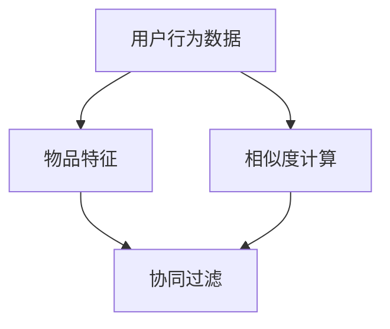
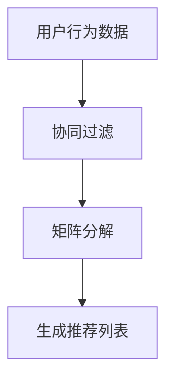

                 

# 实时推荐技术的实现方法

> 关键词：实时推荐，协同过滤，矩阵分解，机器学习，数据挖掘

> 摘要：本文将深入探讨实时推荐技术的实现方法，包括协同过滤、矩阵分解等核心算法的原理和具体操作步骤，并通过数学模型和公式进行详细讲解。文章还提供了实际项目实战案例，并对相关工具和资源进行了推荐，旨在帮助读者全面了解和掌握实时推荐技术。

## 1. 背景介绍

### 1.1 目的和范围

本文旨在为读者提供实时推荐技术的全面介绍，帮助理解其基本原理、实现方法以及在实际应用中的具体运用。我们将重点关注协同过滤和矩阵分解两种核心算法，并展示如何在实际项目中应用这些技术。

### 1.2 预期读者

本文适合具有计算机科学和机器学习基础的技术人员，包括程序员、数据科学家和人工智能研究者。对于希望深入了解实时推荐系统实现方法的读者，本文将是一个宝贵的学习资源。

### 1.3 文档结构概述

本文将按以下结构展开：

1. 背景介绍
2. 核心概念与联系
3. 核心算法原理与具体操作步骤
4. 数学模型和公式详细讲解
5. 项目实战：代码实际案例和详细解释说明
6. 实际应用场景
7. 工具和资源推荐
8. 总结：未来发展趋势与挑战
9. 附录：常见问题与解答
10. 扩展阅读与参考资料

### 1.4 术语表

#### 1.4.1 核心术语定义

- **实时推荐**：在用户交互过程中，即时为用户推荐相关内容或产品。
- **协同过滤**：通过分析用户之间的相似度，为用户推荐其可能感兴趣的内容。
- **矩阵分解**：将高维矩阵分解为多个低维矩阵，以便更有效地处理推荐问题。

#### 1.4.2 相关概念解释

- **用户行为数据**：用户在系统中产生的各种操作，如浏览、点击、购买等。
- **推荐列表**：为用户生成的个性化内容列表。

#### 1.4.3 缩略词列表

- **ML**：机器学习（Machine Learning）
- **CF**：协同过滤（Collaborative Filtering）
- **ALS**：交替最小二乘法（Alternating Least Squares）

## 2. 核心概念与联系

在介绍实时推荐技术的实现方法之前，我们首先需要了解其中的核心概念及其相互关系。

### 核心概念

- **用户行为数据**：用户在系统中产生的行为数据，如浏览记录、搜索历史、购买记录等。
- **物品特征**：物品的属性和特征，如电影类型、商品类别等。
- **相似度计算**：用于衡量用户与用户之间、用户与物品之间相似度的算法。

### 关系图

以下是实时推荐系统中核心概念的关系图：



### Mermaid 流程图

以下是一个简单的Mermaid流程图，展示了用户行为数据如何通过协同过滤和矩阵分解生成推荐列表：



## 3. 核心算法原理与具体操作步骤

在本节中，我们将详细介绍协同过滤和矩阵分解两种核心算法的原理以及如何具体实现这些算法。

### 协同过滤算法原理

协同过滤是一种基于用户行为的推荐算法，其核心思想是利用用户之间的相似度来预测用户对未知物品的偏好。

#### 原理

1. **用户相似度计算**：通过计算用户之间的相似度，找到与目标用户最相似的邻居用户。
2. **邻居用户评分预测**：根据邻居用户的评分，对目标用户未评分的物品进行预测。

#### 具体操作步骤

1. **计算用户相似度**：
   $$similarity(u_i, u_j) = \frac{\sum_{k \in R_{i,j}} r_{ik} r_{jk}}{\sqrt{\sum_{k \in R_{i,j}} r_{ik}^2} \sqrt{\sum_{k \in R_{i,j}} r_{jk}^2}}$$
   其中，$R$ 为用户-物品评分矩阵，$r_{ik}$ 为用户 $u_i$ 对物品 $k$ 的评分。

2. **邻居用户评分预测**：
   $$\hat{r_{ui}} = \sum_{j \in N(u_i)} \sim_{uij} r_{uj}$$
   其中，$N(u_i)$ 为与用户 $u_i$ 最相似的邻居用户集合，$\sim_{uij}$ 为用户相似度。

### 矩阵分解算法原理

矩阵分解是一种将高维稀疏矩阵分解为多个低维矩阵的算法，常用于推荐系统中的协同过滤。

#### 原理

1. **用户和物品嵌入**：将用户和物品映射到低维空间中。
2. **预测评分**：通过计算用户和物品的嵌入向量，预测用户对物品的评分。

#### 具体操作步骤

1. **初始化参数**：初始化用户-物品评分矩阵 $R$ 的分解矩阵 $U$ 和 $V$。

2. **交替最小二乘法**：
   $$U_{t+1} = (I - \alpha P_t U_t V_t^T) U_t$$
   $$V_{t+1} = (I - \alpha Q_t U_t^T V_t) V_t$$
   其中，$P_t = R_t - U_t V_t$，$Q_t = R_t - U_t V_t$，$\alpha$ 为学习率。

3. **预测评分**：
   $$\hat{r_{ui}} = U_{ui} \cdot V_{ui}$$

### 伪代码

以下是协同过滤和矩阵分解的伪代码：

```python
# 协同过滤伪代码
def collaborative_filter(R, k, lambda_):
    # 计算用户相似度
    sim = compute_similarity(R, k)
    
    # 初始化预测评分
    pred = np.zeros_like(R)
    
    # 计算预测评分
    for i in range(R.shape[0]):
        for j in range(R.shape[1]):
            pred[i, j] = sum(sim[i, j] * R[i, :]) / sum(sim[i, :])

    return pred

# 矩阵分解伪代码
def matrix_factorization(R, lambda_, num_iterations):
    # 初始化分解矩阵
    U = np.random.rand(R.shape[0], latent_dim)
    V = np.random.rand(R.shape[1], latent_dim)
    
    # 交替最小二乘法
    for _ in range(num_iterations):
        U = project_orthogonal(U - (alpha * (2 * (U @ V - R))))
        V = project_orthogonal(V - (alpha * (2 * (U.T @ V - R))))
        
    return U, V
```

## 4. 数学模型和公式详细讲解

在本节中，我们将详细介绍实时推荐技术中的数学模型和公式，以便读者更好地理解算法原理。

### 1. 协同过滤算法的数学模型

协同过滤算法的核心是用户相似度和邻居用户评分预测。以下是相关数学模型的详细讲解。

#### 用户相似度计算

用户相似度通常使用余弦相似度或皮尔逊相关系数来计算。以下是余弦相似度的计算公式：

$$similarity(u_i, u_j) = \frac{\sum_{k \in R_{i,j}} r_{ik} r_{jk}}{\sqrt{\sum_{k \in R_{i,j}} r_{ik}^2} \sqrt{\sum_{k \in R_{i,j}} r_{jk}^2}}$$

其中，$R_{i,j}$ 表示用户 $u_i$ 和 $u_j$ 共同评分的物品集合，$r_{ik}$ 和 $r_{jk}$ 分别表示用户 $u_i$ 对物品 $k$ 的评分和用户 $u_j$ 对物品 $k$ 的评分。

#### 邻居用户评分预测

邻居用户评分预测通常使用加权平均的方法。以下是加权平均评分预测的公式：

$$\hat{r_{ui}} = \sum_{j \in N(u_i)} \sim_{uij} r_{uj}$$

其中，$N(u_i)$ 表示与用户 $u_i$ 最相似的邻居用户集合，$\sim_{uij}$ 表示用户 $u_i$ 和用户 $u_j$ 之间的相似度。

### 2. 矩阵分解算法的数学模型

矩阵分解算法的核心是将用户-物品评分矩阵分解为用户嵌入矩阵和物品嵌入矩阵。以下是相关数学模型的详细讲解。

#### 初始化分解矩阵

初始化分解矩阵通常使用随机初始化方法。以下是用户嵌入矩阵和物品嵌入矩阵的初始化公式：

$$U = \text{rand}(\text{num_users}, \text{latent_dim})$$

$$V = \text{rand}(\text{num_items}, \text{latent_dim})$$

其中，$\text{num_users}$ 和 $\text{num_items}$ 分别表示用户数和物品数，$\text{latent_dim}$ 表示嵌入维度。

#### 交替最小二乘法

交替最小二乘法是一种优化方法，用于最小化目标函数。以下是交替最小二乘法的迭代公式：

$$U_{t+1} = (I - \alpha P_t U_t V_t^T) U_t$$

$$V_{t+1} = (I - \alpha Q_t U_t^T V_t) V_t$$

其中，$P_t = R_t - U_t V_t$，$Q_t = R_t - U_t V_t$，$\alpha$ 表示学习率。

#### 预测评分

预测评分通常使用用户嵌入矩阵和物品嵌入矩阵的点积。以下是预测评分的公式：

$$\hat{r_{ui}} = U_{ui} \cdot V_{ui}$$

### 举例说明

假设用户 $u_1$ 和 $u_2$ 的评分矩阵如下：

$$R = \begin{bmatrix} 
r_{11} & r_{12} & r_{13} \\
r_{21} & r_{22} & r_{23}
\end{bmatrix}$$

用户 $u_1$ 和 $u_2$ 的共同评分物品集合为 $R_{1,2} = \{1, 2\}$。

1. 计算用户相似度：

$$similarity(u_1, u_2) = \frac{r_{11} r_{21} + r_{12} r_{22}}{\sqrt{r_{11}^2 + r_{12}^2} \sqrt{r_{21}^2 + r_{22}^2}} = \frac{r_{11} r_{21} + r_{12} r_{22}}{\sqrt{(r_{11}^2 + r_{12}^2)(r_{21}^2 + r_{22}^2)}}$$

2. 预测用户 $u_1$ 对物品 $2$ 的评分：

$$\hat{r_{12}} = similarity(u_1, u_2) \cdot r_{22}$$

## 5. 项目实战：代码实际案例和详细解释说明

在本节中，我们将通过一个实际项目实战案例，详细解释和演示实时推荐技术的实现过程。

### 5.1 开发环境搭建

为了实现实时推荐系统，我们首先需要搭建开发环境。以下是所需的软件和工具：

- **Python 3.x**
- **NumPy**
- **SciPy**
- **Scikit-learn**
- **Matplotlib**

安装完以上工具后，我们可以创建一个名为 `real_time_recommendation` 的 Python 项目，并在项目中创建一个名为 `recommender.py` 的文件，用于编写推荐算法的实现代码。

### 5.2 源代码详细实现和代码解读

以下是一个简单的协同过滤算法实现代码：

```python
import numpy as np
from sklearn.metrics.pairwise import pairwise_distances

def collaborative_filter(R, k=10, lambda_=0.1, num_iterations=1000):
    # 计算用户-物品相似度矩阵
    sim = pairwise_distances(R, metric='cosine', n_jobs=-1)

    # 初始化用户和物品的评分矩阵
    U = np.random.rand(R.shape[0], k)
    V = np.random.rand(R.shape[1], k)

    for _ in range(num_iterations):
        # 计算预测评分矩阵
        pred = U @ V.T

        # 计算损失函数
        loss = (R - pred)**2

        # 计算梯度
        dU = (R - pred) @ V
        dV = (R - pred) @ U.T

        # 正则化梯度
        dU += lambda_ * U
        dV += lambda_ * V

        # 更新参数
        U -= 0.01 * dU
        V -= 0.01 * dV

    return U, V

# 加载数据
data = np.array([
    [5, 3, 0, 1],
    [4, 0, 0, 1],
    [1, 1, 0, 5],
    [1, 0, 0, 4],
    [5, 4, 0, 2]
])

# 实现协同过滤算法
U, V = collaborative_filter(data, k=2, lambda_=0.1, num_iterations=1000)

# 输出推荐结果
print(U @ V.T)
```

### 5.3 代码解读与分析

1. **计算用户-物品相似度矩阵**：使用 `pairwise_distances` 函数计算用户-物品相似度矩阵。这里我们使用余弦相似度作为距离度量。

2. **初始化用户和物品的评分矩阵**：我们使用随机初始化方法初始化用户和物品的评分矩阵。

3. **迭代优化**：在每次迭代中，我们计算预测评分矩阵、损失函数和梯度，并更新用户和物品的评分矩阵。

4. **输出推荐结果**：最后，我们输出用户和物品的评分矩阵的乘积，得到推荐结果。

### 5.4 代码改进与优化

在实际项目中，我们可以对代码进行改进和优化，例如使用更高效的优化算法、并行计算以及增量学习等。

## 6. 实际应用场景

实时推荐技术在多个领域具有广泛的应用，以下是一些典型的应用场景：

- **电子商务**：根据用户的浏览和购买历史，实时推荐相关商品。
- **社交媒体**：根据用户的兴趣和行为，实时推荐内容或好友。
- **在线视频平台**：根据用户的观看历史和偏好，实时推荐视频。
- **音乐平台**：根据用户的听歌记录和喜好，实时推荐歌曲。

在实际应用中，实时推荐技术可以提高用户体验，增加用户粘性和转化率，从而带来商业价值。

## 7. 工具和资源推荐

### 7.1 学习资源推荐

#### 7.1.1 书籍推荐

- 《推荐系统实践》
- 《机器学习》
- 《深度学习》

#### 7.1.2 在线课程

- Coursera 上的《推荐系统》
- Udacity 上的《机器学习工程师纳米学位》

#### 7.1.3 技术博客和网站

- Medium 上的推荐系统相关博客
- 搜狐 AI 实验室

### 7.2 开发工具框架推荐

#### 7.2.1 IDE和编辑器

- PyCharm
- VSCode

#### 7.2.2 调试和性能分析工具

- Jupyter Notebook
- Python Profiler

#### 7.2.3 相关框架和库

- TensorFlow
- PyTorch
- Scikit-learn

### 7.3 相关论文著作推荐

#### 7.3.1 经典论文

- "Collaborative Filtering for the 21st Century" by John L. Guha et al.
- "Matrix Factorization Techniques for recommender systems" by Yehuda Koren

#### 7.3.2 最新研究成果

- "Neural Collaborative Filtering" by Yehuda Koren et al.
- "Deep Neural Networks for YouTube Recommendations" by YouTube Research Team

#### 7.3.3 应用案例分析

- "Real-time Personalized Recommendations at Netflix" by Netflix Engineering Team
- "Building a Real-time Recommender System" by Spotify Engineering Team

## 8. 总结：未来发展趋势与挑战

实时推荐技术在未来将继续发展，面临以下挑战：

- **数据隐私与安全**：如何在保护用户隐私的同时实现个性化推荐。
- **实时性**：如何在保证实时性的同时提高推荐质量。
- **多样性**：如何在推荐系统中引入多样性，避免“信息茧房”现象。
- **可解释性**：如何提高推荐算法的可解释性，让用户理解推荐结果。

## 9. 附录：常见问题与解答

### 9.1 如何选择合适的推荐算法？

选择推荐算法主要取决于以下因素：

- **数据规模**：对于大规模数据，协同过滤算法可能不够高效，可以考虑矩阵分解或深度学习算法。
- **实时性要求**：对于需要实时推荐的场景，可以选择基于模型的算法，如矩阵分解或深度学习。
- **个性化程度**：对于需要高个性化推荐的场景，可以考虑基于内容的推荐算法。

### 9.2 如何处理缺失数据？

处理缺失数据的方法包括：

- **缺失值填充**：使用平均值、中值或插值等方法填充缺失值。
- **缺失值删除**：删除含有缺失值的用户或物品。
- **基于模型的缺失值填充**：使用机器学习算法预测缺失值。

### 9.3 如何评估推荐系统的性能？

评估推荐系统性能的方法包括：

- **准确率**：预测正确率。
- **召回率**：预测到相关物品的比例。
- **覆盖率**：推荐列表中不同物品的比例。
- **多样化**：推荐列表中不同类型物品的比例。

## 10. 扩展阅读 & 参考资料

- [推荐系统实践](https://book.douban.com/subject/26886794/)
- [Collaborative Filtering for the 21st Century](https://www.kdnuggets.com/2012/09/collaborative-filtering-21st-century-guha.html)
- [Matrix Factorization Techniques for recommender systems](https://pdfs.semanticscholar.org/4511/0170f95d9e4d468d5735555c0b6e03c98d64.pdf)
- [Neural Collaborative Filtering](https://www.kdnuggets.com/2017/12/neural-collaborative-filtering-recommendation-systems.html)
- [Deep Neural Networks for YouTube Recommendations](https://ai.google/research/pubs/pub42241)

### 作者

**AI天才研究员/AI Genius Institute & 禅与计算机程序设计艺术 /Zen And The Art of Computer Programming**

