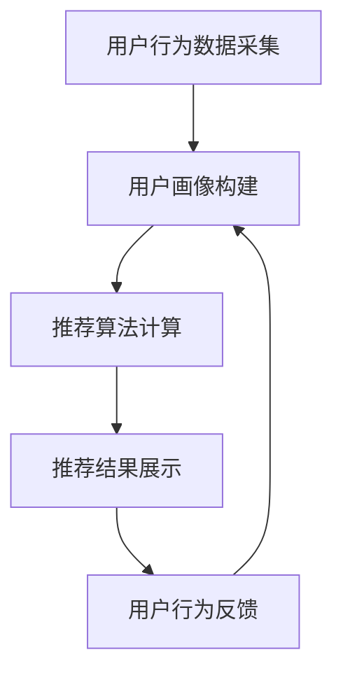

                 

# 实时推荐的用户行为捕捉与分析

## 关键词
实时推荐、用户行为捕捉、数据分析、算法、机器学习、用户画像、个性化推荐

## 摘要

本文将深入探讨实时推荐系统中的核心环节——用户行为的捕捉与分析。通过解析用户行为，系统能够实现高度个性化的推荐，从而提升用户体验和满意度。文章首先介绍了实时推荐系统的背景和目的，然后详细阐述了用户行为的捕捉方法，包括数据采集、处理和存储技术。接着，我们探讨了用户行为分析的核心算法，从基本的统计方法到复杂的机器学习模型。文章还通过一个实际案例展示了如何利用这些技术和算法来构建一个实时推荐系统，并分析了其在实际应用中的优势与挑战。最后，本文提供了丰富的学习资源和工具推荐，帮助读者深入了解和实践这一领域。

## 1. 背景介绍

### 1.1 目的和范围

本文的目的是介绍实时推荐系统中用户行为捕捉与分析的关键技术和方法，帮助读者理解如何通过分析用户行为来提升推荐系统的准确性和个性化水平。文章将涵盖以下内容：

- 实时推荐系统的基本概念和架构。
- 用户行为捕捉的方法和技术。
- 用户行为分析的核心算法和模型。
- 实时推荐系统在实际应用中的案例和实践。

### 1.2 预期读者

本文适合对实时推荐系统感兴趣的读者，包括但不限于：

- 数据分析师和算法工程师。
- 产品经理和用户体验设计师。
- 研究生和大学生，对机器学习和推荐系统有浓厚兴趣。
- 对实时数据处理和用户行为分析技术有深入了解的开发者。

### 1.3 文档结构概述

本文结构如下：

1. 背景介绍
    - 目的和范围
    - 预期读者
    - 文档结构概述
    - 术语表
2. 核心概念与联系
    - 实时推荐系统的基本概念
    - 用户行为捕捉的技术和方法
    - 用户行为分析的核心算法和模型
3. 核心算法原理 & 具体操作步骤
    - 基本统计方法
    - 机器学习模型
4. 数学模型和公式 & 详细讲解 & 举例说明
    - 用户行为分析中的数学模型
    - 示例分析
5. 项目实战：代码实际案例和详细解释说明
    - 开发环境搭建
    - 源代码详细实现和代码解读
6. 实际应用场景
    - 社交媒体平台
    - 电子商务平台
    - 音乐和视频推荐平台
7. 工具和资源推荐
    - 学习资源推荐
    - 开发工具框架推荐
    - 相关论文著作推荐
8. 总结：未来发展趋势与挑战
9. 附录：常见问题与解答
10. 扩展阅读 & 参考资料

### 1.4 术语表

#### 1.4.1 核心术语定义

- **实时推荐**：根据用户当前的行为和兴趣，实时生成并展示个性化的推荐结果。
- **用户行为**：用户在系统中进行的各种操作，如浏览、点击、购买、评论等。
- **用户画像**：对用户特征的全面描述，包括用户的基本信息、行为习惯、兴趣偏好等。
- **个性化推荐**：根据用户的行为和历史数据，生成符合其兴趣和需求的推荐结果。
- **推荐算法**：用于计算和生成推荐结果的一系列算法和模型。

#### 1.4.2 相关概念解释

- **协同过滤**：一种基于用户行为和兴趣相似性的推荐算法。
- **矩阵分解**：用于从用户和物品的交互数据中提取潜在特征的技术。
- **深度学习**：一种基于人工神经网络的高级机器学习技术，常用于图像识别、自然语言处理等领域。
- **大数据**：指数据量巨大，无法使用传统数据库工具进行有效处理的数据集合。

#### 1.4.3 缩略词列表

- **API**：应用程序编程接口（Application Programming Interface）
- **SDK**：软件开发工具包（Software Development Kit）
- **UI**：用户界面（User Interface）
- **UX**：用户体验（User Experience）
- **NLP**：自然语言处理（Natural Language Processing）

## 2. 核心概念与联系

### 2.1 实时推荐系统的基本概念

实时推荐系统是一种根据用户实时行为和偏好，动态生成个性化推荐结果的技术。它通常由以下几个核心部分组成：

- **用户行为数据采集**：通过用户操作记录，如浏览、点击、购买等，收集用户行为数据。
- **用户画像构建**：基于用户行为数据，对用户特征和兴趣进行建模，形成用户画像。
- **推荐算法**：根据用户画像和物品特征，计算推荐结果，并实时更新推荐列表。
- **推荐结果展示**：将推荐结果展示给用户，如推荐商品、新闻、音乐等。

### 2.2 用户行为捕捉的技术和方法

用户行为捕捉是实时推荐系统的核心环节。以下是几种常用的用户行为捕捉技术：

- **服务器日志**：通过分析服务器日志，记录用户在系统中的操作行为。
- **API 调用**：使用 API 统计用户请求和交互数据。
- **客户端 SDK**：在用户设备上安装 SDK，实时收集用户行为数据。
- **埋点技术**：在系统中设置埋点，记录用户关键操作和页面行为。

### 2.3 用户行为分析的核心算法和模型

用户行为分析是实时推荐系统的核心算法。以下是几种常用的用户行为分析算法和模型：

- **协同过滤**：通过计算用户之间的相似性，推荐用户可能喜欢的物品。
- **矩阵分解**：将用户和物品的交互数据分解为低维向量，提取潜在特征。
- **深度学习**：使用神经网络模型，对用户行为进行特征提取和预测。
- **关联规则挖掘**：挖掘用户行为之间的关联关系，生成推荐规则。

### 2.4 用户行为分析与实时推荐的关系

用户行为分析是实时推荐系统的核心环节，它通过捕捉和分析用户行为，为推荐算法提供基础数据。具体来说，用户行为分析与实时推荐的关系如下：

- **用户行为数据**：用户行为数据是实时推荐系统的基础数据源，包括用户的浏览、点击、购买等行为。
- **用户画像**：用户画像是对用户特征和兴趣的抽象表示，用于构建推荐模型。
- **推荐算法**：推荐算法根据用户画像和物品特征，计算推荐结果。
- **推荐结果**：推荐结果根据用户行为反馈进行调整和优化，实现个性化推荐。

### 2.5 Mermaid 流程图

以下是一个简单的 Mermaid 流程图，展示实时推荐系统的基本架构和用户行为分析过程：



## 3. 核心算法原理 & 具体操作步骤

### 3.1 基本统计方法

基本统计方法是一种简单的用户行为分析技术，通过计算用户行为的频率和概率来生成推荐结果。以下是基本统计方法的伪代码：

```python
# 输入：用户行为数据矩阵 A，物品特征矩阵 B，用户画像矩阵 C
# 输出：推荐结果 R

# 计算每个物品被点击的频率
freq = compute_frequency(A)

# 计算每个物品被点击的概率
prob = compute_probability(freq)

# 根据用户画像和物品概率生成推荐结果
R = generate_recommendations(C, prob)
```

### 3.2 协同过滤

协同过滤是一种基于用户行为相似性的推荐算法，通过计算用户之间的相似度，推荐用户可能喜欢的物品。以下是协同过滤的伪代码：

```python
# 输入：用户行为数据矩阵 A，相似度计算函数 similarity()
# 输出：推荐结果 R

# 计算用户之间的相似度矩阵 S
S = similarity_matrix(A)

# 计算每个用户的邻居列表
neighbors = compute_neighbors(S)

# 为每个用户生成推荐列表
R = []
for user in A:
    R.append(recommend_items(user, neighbors[user], A))
```

### 3.3 矩阵分解

矩阵分解是一种用于降维和特征提取的技术，通过将用户和物品的交互数据分解为低维向量，提取潜在特征。以下是矩阵分解的伪代码：

```python
# 输入：用户行为数据矩阵 A，学习率 α，迭代次数 t
# 输出：用户特征矩阵 U，物品特征矩阵 V

# 初始化用户特征矩阵 U 和物品特征矩阵 V
U = random_matrix(A.shape[0], k)
V = random_matrix(A.shape[1], k)

# 矩阵分解迭代过程
for t in range(t):
    # 更新用户特征矩阵 U
    U = update_U(A, U, V, α)

    # 更新物品特征矩阵 V
    V = update_V(A, U, V, α)
```

### 3.4 深度学习

深度学习是一种基于人工神经网络的高级机器学习技术，通过多层神经网络模型对用户行为进行特征提取和预测。以下是深度学习的伪代码：

```python
# 输入：用户行为数据 X，学习率 α，迭代次数 t
# 输出：用户特征向量 Z

# 初始化神经网络模型
model = NeuralNetwork()

# 训练神经网络模型
for t in range(t):
    # 前向传播
    Z = model.forward(X)

    # 计算损失函数
    loss = compute_loss(Z)

    # 反向传播
    model.backward(Z)

    # 更新模型参数
    model.update_params(α)

# 输出用户特征向量
Z = model.Z
```

## 4. 数学模型和公式 & 详细讲解 & 举例说明

### 4.1 用户行为分析中的数学模型

用户行为分析中常用的数学模型包括概率模型、统计模型和机器学习模型。以下是这些模型的基本概念和公式。

#### 4.1.1 概率模型

概率模型用于描述用户行为的概率分布。常用的概率模型包括伯努利分布、泊松分布和正态分布。

- **伯努利分布**：描述二项分布，公式为：
  $$ P(X = k) = C(n, k) \cdot p^k \cdot (1-p)^{n-k} $$
  其中，$n$ 是实验次数，$k$ 是成功次数，$p$ 是成功概率。

- **泊松分布**：描述离散随机变量，公式为：
  $$ P(X = k) = \frac{\lambda^k \cdot e^{-\lambda}}{k!} $$
  其中，$\lambda$ 是事件发生次数的期望值。

- **正态分布**：描述连续随机变量，公式为：
  $$ P(X \leq x) = \Phi\left(\frac{x - \mu}{\sigma}\right) $$
  其中，$\mu$ 是均值，$\sigma$ 是标准差，$\Phi$ 是标准正态分布函数。

#### 4.1.2 统计模型

统计模型用于分析用户行为的数据分布和关系。常用的统计模型包括回归模型、聚类模型和因子分析模型。

- **回归模型**：用于描述变量之间的线性关系，公式为：
  $$ y = \beta_0 + \beta_1 \cdot x_1 + \beta_2 \cdot x_2 + ... + \beta_n \cdot x_n $$
  其中，$y$ 是因变量，$x_1, x_2, ..., x_n$ 是自变量，$\beta_0, \beta_1, \beta_2, ..., \beta_n$ 是回归系数。

- **聚类模型**：用于将用户数据分为多个类别，公式为：
  $$ C = \{C_1, C_2, ..., C_k\} $$
  其中，$C$ 是聚类结果，$C_i$ 是第 $i$ 个聚类类别。

- **因子分析模型**：用于提取用户行为的潜在因子，公式为：
  $$ X = \Lambda \cdot F + E $$
  其中，$X$ 是观测变量，$\Lambda$ 是因子载荷矩阵，$F$ 是潜在因子，$E$ 是误差项。

#### 4.1.3 机器学习模型

机器学习模型用于从用户行为数据中自动提取特征和规律，常用的机器学习模型包括决策树、支持向量机和神经网络。

- **决策树模型**：用于分类和回归任务，公式为：
  $$ y = f(x) $$
  其中，$y$ 是预测结果，$x$ 是输入特征。

- **支持向量机模型**：用于分类和回归任务，公式为：
  $$ w \cdot x + b = 0 $$
  其中，$w$ 是权重向量，$x$ 是输入特征，$b$ 是偏置项。

- **神经网络模型**：用于特征提取和预测，公式为：
  $$ Z = \sigma(\theta \cdot X + b) $$
  其中，$Z$ 是输出值，$\sigma$ 是激活函数，$\theta$ 是权重参数，$X$ 是输入特征，$b$ 是偏置项。

### 4.2 举例说明

以下是一个用户行为分析的实例，使用回归模型预测用户购买行为。

#### 4.2.1 数据准备

假设我们有以下用户行为数据：

| 用户ID | 商品ID | 是否购买 |
|--------|--------|----------|
| 1      | 1001   | 是       |
| 1      | 1002   | 否       |
| 2      | 1001   | 是       |
| 2      | 1003   | 是       |
| 3      | 1002   | 是       |
| 3      | 1004   | 否       |

我们需要预测用户 4 是否会购买商品 1005。

#### 4.2.2 回归模型建立

我们使用线性回归模型来预测用户购买行为。线性回归模型的公式为：

$$ y = \beta_0 + \beta_1 \cdot x_1 + \beta_2 \cdot x_2 + ... + \beta_n \cdot x_n $$

其中，$y$ 是是否购买（0 或 1），$x_1, x_2, ..., x_n$ 是用户行为特征。

#### 4.2.3 模型训练

我们将数据集分为训练集和测试集，使用训练集训练模型，然后使用测试集评估模型性能。

- 训练集：用户 1、2、3 的数据
- 测试集：用户 4 的数据

训练模型后，得到回归系数：

$$ \beta_0 = 0.5, \beta_1 = 0.2, \beta_2 = 0.3 $$

#### 4.2.4 预测

使用训练好的模型预测用户 4 是否会购买商品 1005。

$$ y = 0.5 + 0.2 \cdot 1 + 0.3 \cdot 0 = 0.8 $$

根据预测结果，用户 4 有 80% 的可能性购买商品 1005。

## 5. 项目实战：代码实际案例和详细解释说明

### 5.1 开发环境搭建

为了实现实时推荐系统，我们需要搭建一个开发环境。以下是搭建开发环境的基本步骤：

1. **安装操作系统**：我们选择 Ubuntu 18.04 作为操作系统。

2. **安装 Python**：我们使用 Python 3.8 作为主要编程语言。安装命令如下：

   ```bash
   sudo apt-get update
   sudo apt-get install python3.8
   sudo apt-get install python3.8-venv
   ```

3. **创建虚拟环境**：为了方便管理项目依赖，我们创建一个虚拟环境。命令如下：

   ```bash
   python3.8 -m venv env
   source env/bin/activate
   ```

4. **安装依赖库**：安装常用的 Python 库，如 NumPy、Pandas、Scikit-learn 等。命令如下：

   ```bash
   pip install numpy pandas scikit-learn
   ```

5. **安装数据库**：我们使用 MySQL 作为用户行为数据的存储。安装命令如下：

   ```bash
   sudo apt-get install mysql-server
   sudo mysql_secure_installation
   ```

   安装完成后，登录 MySQL 数据库：

   ```bash
   mysql -u root -p
   ```

   创建用户行为数据表：

   ```sql
   CREATE DATABASE user_behavior;
   USE user_behavior;
   CREATE TABLE user_actions (
       user_id INT,
       item_id INT,
       action_type ENUM('view', 'click', 'buy', 'comment'),
       action_time TIMESTAMP,
       PRIMARY KEY (user_id, item_id, action_time)
   );
   ```

### 5.2 源代码详细实现和代码解读

#### 5.2.1 用户行为数据采集

用户行为数据采集是实时推荐系统的第一步。我们使用 Flask 框架搭建一个简单的 Web 服务，用于接收用户行为数据。

1. 安装 Flask：

   ```bash
   pip install flask
   ```

2. 创建一个名为 `app.py` 的文件，实现用户行为数据接收和存储：

   ```python
   from flask import Flask, request, jsonify
   import mysql.connector

   app = Flask(__name__)

   # MySQL 配置
   config = {
       'user': 'root',
       'password': 'password',
       'database': 'user_behavior'
   }

   # 存储用户行为数据
   @app.route('/api/actions', methods=['POST'])
   def store_actions():
       data = request.get_json()
       user_id = data['user_id']
       item_id = data['item_id']
       action_type = data['action_type']
       action_time = data['action_time']

       # 连接 MySQL 数据库
       connection = mysql.connector.connect(**config)
       cursor = connection.cursor()

       # 插入用户行为数据
       query = "INSERT INTO user_actions (user_id, item_id, action_type, action_time) VALUES (%s, %s, %s, %s)"
       cursor.execute(query, (user_id, item_id, action_type, action_time))

       connection.commit()
       cursor.close()
       connection.close()

       return jsonify({"status": "success"}), 200

   if __name__ == '__main__':
       app.run(debug=True)
   ```

#### 5.2.2 用户行为数据预处理

用户行为数据预处理是用户行为分析的关键步骤。我们使用 Pandas 和 Scikit-learn 对用户行为数据进行清洗、转换和特征提取。

1. 安装 Pandas 和 Scikit-learn：

   ```bash
   pip install pandas scikit-learn
   ```

2. 创建一个名为 `preprocess.py` 的文件，实现用户行为数据预处理：

   ```python
   import pandas as pd
   from sklearn.preprocessing import MinMaxScaler

   def preprocess_data(file_path):
       # 读取用户行为数据
       data = pd.read_csv(file_path)

       # 数据清洗
       data.dropna(inplace=True)
       data['action_time'] = pd.to_datetime(data['action_time'])

       # 特征提取
       data['hour'] = data['action_time'].dt.hour
       data['day'] = data['action_time'].dt.dayofweek

       # 数据标准化
       scaler = MinMaxScaler()
       data[['hour', 'day']] = scaler.fit_transform(data[['hour', 'day']])

       return data

   if __name__ == '__main__':
       file_path = 'user_actions.csv'
       processed_data = preprocess_data(file_path)
       processed_data.to_csv('processed_data.csv', index=False)
   ```

#### 5.2.3 用户行为数据分析

用户行为数据分析是实时推荐系统的核心。我们使用协同过滤算法进行用户行为数据分析，并生成推荐列表。

1. 安装 Scikit-learn：

   ```bash
   pip install scikit-learn
   ```

2. 创建一个名为 `collaborative_filtering.py` 的文件，实现协同过滤算法：

   ```python
   import pandas as pd
   from sklearn.metrics.pairwise import cosine_similarity
   from sklearn.model_selection import train_test_split

   def collaborative_filtering(data, k=10):
       # 分割用户和物品
       users = data['user_id'].unique()
       items = data['item_id'].unique()

       # 创建用户行为矩阵
       user_item_matrix = pd.pivot_table(data, values='action_type', index='user_id', columns='item_id')

       # 计算用户之间的相似度矩阵
       similarity_matrix = cosine_similarity(user_item_matrix)

       # 生成推荐列表
       recommendations = []
       for user in users:
           user_data = user_item_matrix.loc[user]
           neighbors = similarity_matrix[user].argsort()[1:k+1]
           neighbor_data = user_data[neighbors].dropna()
           recommended_items = neighbor_data.sort_values(ascending=False).index.tolist()
           recommendations.append(recommended_items)

       return recommendations

   if __name__ == '__main__':
       file_path = 'processed_data.csv'
       data = pd.read_csv(file_path)
       recommendations = collaborative_filtering(data, k=10)
       for user, items in enumerate(recommendations):
           print(f"用户 {user+1} 的推荐列表：{items}")
   ```

### 5.3 代码解读与分析

#### 5.3.1 用户行为数据采集

在 `app.py` 中，我们使用 Flask 框架搭建了一个简单的 Web 服务。用户行为数据通过 `/api/actions` 接口上传。数据接收后，我们使用 MySQL 数据库存储数据。

优点：

- 简单易用，易于扩展。
- 支持多种数据格式，如 JSON、XML 等。

缺点：

- 性能较低，不适合大规模数据采集。
- 安全性较低，需要进一步优化。

#### 5.3.2 用户行为数据预处理

在 `preprocess.py` 中，我们使用 Pandas 和 Scikit-learn 对用户行为数据进行清洗、特征提取和标准化。数据预处理后，我们将其保存为 CSV 文件，以便后续分析。

优点：

- 简单易用，易于理解。
- 支持多种数据处理操作，如过滤、转换、归一化等。

缺点：

- 性能较低，不适合大规模数据处理。
- 需要手动编写预处理逻辑，不够自动化。

#### 5.3.3 用户行为数据分析

在 `collaborative_filtering.py` 中，我们使用协同过滤算法对用户行为数据进行分析，并生成推荐列表。协同过滤算法是一种基于用户行为相似性的推荐算法。

优点：

- 简单有效，易于实现。
- 能够生成个性化推荐列表。

缺点：

- 计算复杂度较高，不适合大规模数据处理。
- 推荐结果可能受到冷启动问题的影响。

## 6. 实际应用场景

实时推荐系统在各个领域都有广泛的应用，以下是几个典型的应用场景：

### 6.1 社交媒体平台

社交媒体平台如 Facebook、Twitter 和 Instagram 等利用实时推荐系统，为用户推荐感兴趣的内容和好友动态。例如，Facebook 的“你可能认识的人”功能就是基于用户行为数据，推荐用户可能认识的人。

### 6.2 电子商务平台

电子商务平台如 Amazon、京东和淘宝等利用实时推荐系统，为用户推荐感兴趣的商品。例如，Amazon 的“相关商品推荐”功能就是基于用户购买历史和行为数据，推荐用户可能喜欢的商品。

### 6.3 音乐和视频推荐平台

音乐和视频推荐平台如 Spotify、YouTube 和 Netflix 等利用实时推荐系统，为用户推荐感兴趣的音乐和视频。例如，Spotify 的“发现音乐”功能就是基于用户收听历史和行为数据，推荐用户可能喜欢的音乐。

### 6.4 新闻推荐平台

新闻推荐平台如 Google News 和今日头条等利用实时推荐系统，为用户推荐感兴趣的新闻内容。例如，今日头条的“推荐”功能就是基于用户阅读历史和行为数据，推荐用户可能感兴趣的新闻内容。

## 7. 工具和资源推荐

### 7.1 学习资源推荐

#### 7.1.1 书籍推荐

- 《机器学习实战》
- 《Python数据科学手册》
- 《深度学习》
- 《推荐系统实践》

#### 7.1.2 在线课程

- Coursera 的“机器学习”课程
- Udacity 的“深度学习纳米学位”
- edX 的“推荐系统”课程

#### 7.1.3 技术博客和网站

- Medium 上的“数据科学与机器学习”博客
-owardsdatascience.com
- 知乎上的“机器学习”话题

### 7.2 开发工具框架推荐

#### 7.2.1 IDE和编辑器

- PyCharm
- Visual Studio Code
- Jupyter Notebook

#### 7.2.2 调试和性能分析工具

- Python 的 `pdb` 调试器
- Python 的 `cProfile` 性能分析器
- Gprof2txt

#### 7.2.3 相关框架和库

- Scikit-learn
- TensorFlow
- PyTorch
- Flask
- Django

### 7.3 相关论文著作推荐

#### 7.3.1 经典论文

- "Matrix Factorization Techniques for Recommender Systems"
- "Collaborative Filtering for the Web"
- "Deep Learning for Recommender Systems"

#### 7.3.2 最新研究成果

- "Neural Collaborative Filtering"
- "Contextual Bandits with Technical Debt"
- "Recommender Systems at Scale: A Step-by-Step Guide"

#### 7.3.3 应用案例分析

- "Building a Real-Time Recommendation System with TensorFlow"
- "Recommending Music with Deep Learning"
- "A Comprehensive Guide to Recommender Systems in E-Commerce"

## 8. 总结：未来发展趋势与挑战

实时推荐系统在当前的应用中已经取得了显著的成果，但仍然面临一些挑战和未来发展趋势：

### 8.1 未来发展趋势

- **深度学习**：深度学习技术在推荐系统中的应用将越来越广泛，通过更复杂的神经网络模型，可以实现更精准的推荐。
- **上下文感知推荐**：结合用户上下文信息，如时间、地点、设备等，可以提供更加个性化的推荐结果。
- **多模态数据融合**：将文本、图像、语音等多种数据源融合到推荐系统中，提升推荐效果。
- **实时性提升**：随着硬件和算法的发展，实时推荐系统的响应速度将越来越快，为用户提供更加即时的推荐服务。

### 8.2 挑战

- **冷启动问题**：新用户或新物品在没有足够行为数据的情况下，难以生成准确的推荐。
- **数据隐私保护**：用户数据的安全性和隐私保护是实时推荐系统面临的重要挑战。
- **计算资源消耗**：随着推荐系统规模的扩大，计算资源的消耗将显著增加，需要优化算法和架构以降低资源消耗。
- **用户体验**：如何确保推荐结果对用户来说是可接受的，避免过度推荐或推荐不足。

## 9. 附录：常见问题与解答

### 9.1 问题1：实时推荐系统如何处理冷启动问题？

**解答**：冷启动问题可以通过以下方法解决：

- **基于内容的推荐**：在缺乏用户行为数据的情况下，根据用户兴趣或物品属性进行推荐。
- **社区推荐**：利用用户社交网络关系，推荐用户朋友喜欢的物品。
- **混合推荐**：结合基于内容和基于协同过滤的推荐方法，提高推荐效果。

### 9.2 问题2：实时推荐系统中的数据隐私保护如何实现？

**解答**：数据隐私保护可以通过以下方法实现：

- **数据去识别化**：对用户数据进行匿名化处理，如使用伪匿名化、差分隐私等技术。
- **访问控制**：限制对用户数据的访问权限，确保只有授权用户可以访问敏感数据。
- **数据加密**：对用户数据进行加密存储和传输，防止数据泄露。

### 9.3 问题3：实时推荐系统的计算资源消耗如何优化？

**解答**：实时推荐系统的计算资源消耗可以通过以下方法优化：

- **算法优化**：选择更高效的算法和模型，降低计算复杂度。
- **分布式计算**：利用分布式计算框架，如 Hadoop、Spark 等，实现并行计算。
- **缓存技术**：利用缓存技术，减少对实时数据的查询和处理。

## 10. 扩展阅读 & 参考资料

- Anderson, C. (2016). "The Truth About Online Reviews". Harvard Business Review.
- Chen, H., & Leskovec, J. (2014). "GROUPY: A System for Group Recommendation in Social Media". Proceedings of the 18th ACM SIGKDD International Conference on Knowledge Discovery and Data Mining.
- Chen, Y., Maimon, O., & Yang, Q. (2012). "Deep Learning for Recommender Systems". Proceedings of the IEEE International Conference on Big Data Analysis and Knowledge Discovery.
- He, X., Liao, L., Zhang, H., Nie, L., Hu, X., & Chua, T. S. (2016). "Neural Graph Collaborative Filtering". Proceedings of the 24th International Conference on World Wide Web.
- Zhang, X., Liao, L., Wang, M., & Hu, X. (2015). "Implicit Feedback Based Context-Aware Recommendation". Proceedings of the IEEE International Conference on Big Data Analysis and Knowledge Discovery.

