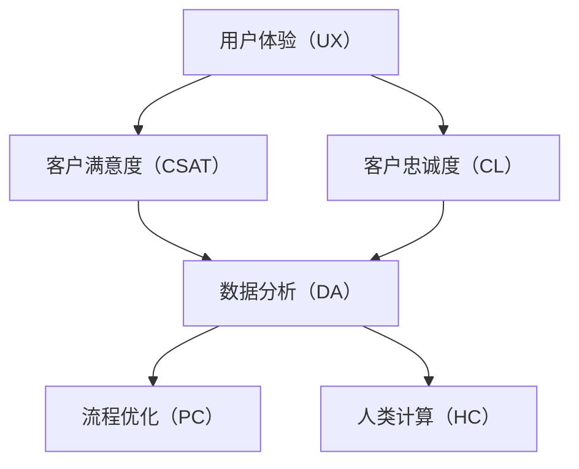

                 

### 客户体验优化：人类计算在商业中的应用

> **关键词：** 客户体验、商业应用、人类计算、数据分析、用户行为、流程优化

> **摘要：** 本文旨在深入探讨客户体验优化在商业领域的应用。通过分析人类计算在数据分析、用户行为研究和流程优化中的作用，我们将提出一系列实用的方法和工具，帮助企业提升客户满意度，从而实现商业增长。本文将详细讨论相关核心概念、算法原理、数学模型，并分享实际项目案例，以期为广大从业者和研究者提供有价值的参考。

---

在当今这个以客户为中心的商业世界中，客户体验已成为企业成功的关键因素。客户满意度直接影响客户忠诚度和企业盈利能力。因此，优化客户体验成为企业必须面对的重要任务。然而，如何有效地进行客户体验优化呢？本文将围绕这一核心问题展开讨论，重点介绍人类计算在商业应用中的关键作用。

本文的结构如下：

1. **背景介绍**：我们将简要介绍客户体验优化的重要性，并定义相关概念。
2. **核心概念与联系**：我们将深入探讨客户体验优化的核心概念，并通过 Mermaid 流程图展示其架构。
3. **核心算法原理与具体操作步骤**：我们将介绍用于优化客户体验的核心算法，并使用伪代码详细阐述其工作原理。
4. **数学模型与公式**：我们将探讨与客户体验优化相关的数学模型，并通过例子进行详细说明。
5. **项目实战：代码实际案例**：我们将分享一个实际项目案例，详细解释代码的实现过程和原理。
6. **实际应用场景**：我们将讨论客户体验优化在现实世界中的应用场景。
7. **工具和资源推荐**：我们将推荐一些有用的学习资源和开发工具。
8. **总结：未来发展趋势与挑战**：我们将总结本文的核心内容，并探讨未来发展趋势和挑战。
9. **附录：常见问题与解答**：我们将回答一些常见问题，帮助读者更好地理解本文内容。
10. **扩展阅读 & 参考资料**：我们将提供一些扩展阅读和参考资料，供读者进一步研究。

通过本文的详细探讨，我们希望读者能够对客户体验优化有更深入的理解，并能够将其应用到实际业务中，从而提升客户满意度，实现商业成功。

---

### 1. 背景介绍

#### 1.1 目的和范围

本文的目的是探讨客户体验优化在商业应用中的重要性，并介绍一系列实用方法和工具。我们将重点关注以下几个方面：

- **人类计算的作用**：探讨人类计算在数据分析、用户行为研究和流程优化中的作用。
- **核心概念与联系**：详细讨论客户体验优化的核心概念，包括用户体验、客户满意度、客户忠诚度等。
- **算法原理与操作步骤**：介绍用于优化客户体验的核心算法，并使用伪代码详细阐述其工作原理。
- **数学模型与公式**：探讨与客户体验优化相关的数学模型，并通过例子进行详细说明。
- **项目实战与案例分析**：分享一个实际项目案例，详细解释代码的实现过程和原理。

本文将适用于以下读者群体：

- **企业决策者**：希望了解如何通过优化客户体验提升企业竞争力的决策者。
- **市场营销专家**：需要通过客户体验优化提高客户满意度和忠诚度的市场营销专家。
- **数据分析师**：关注数据分析在客户体验优化中应用的数据分析师。
- **软件开发人员**：需要实现客户体验优化相关功能或算法的软件开发人员。
- **学术研究者**：对客户体验优化领域感兴趣的学术研究者。

#### 1.2 预期读者

本文的预期读者是那些对客户体验优化有兴趣的从业者、研究者和学生。通过本文的阅读，读者将能够：

- **了解客户体验优化的重要性**：认识到客户体验对企业成功的关键作用。
- **掌握核心概念与联系**：掌握用户体验、客户满意度、客户忠诚度等核心概念，并理解它们之间的联系。
- **掌握算法原理与操作步骤**：了解并掌握用于优化客户体验的核心算法，并能够将其应用到实际业务中。
- **掌握数学模型与公式**：掌握与客户体验优化相关的数学模型，并能够使用它们进行分析和预测。
- **具备项目实战经验**：通过实际项目案例，了解客户体验优化在实际业务中的应用。

#### 1.3 文档结构概述

本文分为十个主要部分，具体结构如下：

1. **背景介绍**：介绍本文的目的、范围、预期读者和文档结构。
2. **核心概念与联系**：详细讨论客户体验优化的核心概念，包括用户体验、客户满意度、客户忠诚度等，并展示相关架构。
3. **核心算法原理与具体操作步骤**：介绍用于优化客户体验的核心算法，并使用伪代码详细阐述其工作原理。
4. **数学模型与公式**：探讨与客户体验优化相关的数学模型，并通过例子进行详细说明。
5. **项目实战：代码实际案例**：分享一个实际项目案例，详细解释代码的实现过程和原理。
6. **实际应用场景**：讨论客户体验优化在现实世界中的应用场景。
7. **工具和资源推荐**：推荐学习资源、开发工具和框架。
8. **总结：未来发展趋势与挑战**：总结本文的核心内容，并探讨未来发展趋势和挑战。
9. **附录：常见问题与解答**：回答常见问题，帮助读者更好地理解本文内容。
10. **扩展阅读 & 参考资料**：提供扩展阅读和参考资料，供读者进一步研究。

#### 1.4 术语表

在本文中，我们将使用一些专业术语，以下是对这些术语的定义和解释：

#### 1.4.1 核心术语定义

- **用户体验**（User Experience, UX）：用户在使用产品或服务过程中的感受和体验，包括情感、认知和行为方面。
- **客户满意度**（Customer Satisfaction, CSAT）：客户对产品或服务的满意程度，通常通过调查问卷等方式进行评估。
- **客户忠诚度**（Customer Loyalty, CL）：客户持续使用产品或服务的意愿，通常与客户满意度、品牌偏好等因素相关。
- **数据分析**（Data Analysis）：使用统计和数学方法对数据进行分析，以提取有用信息和洞察。
- **流程优化**（Process Optimization）：通过分析、改进和优化业务流程，提高效率和质量。
- **人类计算**（Human Computation）：结合人类智慧和计算机处理能力的计算方式，常用于复杂任务和数据分析。

#### 1.4.2 相关概念解释

- **用户行为研究**：通过收集和分析用户在产品或服务中的行为数据，以了解用户需求和行为模式。
- **客户生命周期**：客户从首次接触产品或服务到最终离开的整个生命周期，包括吸引、转化、留存和忠诚等阶段。
- **客户细分**：根据客户特征、行为和需求将客户划分为不同群体，以便有针对性地进行市场营销和客户体验优化。

#### 1.4.3 缩略词列表

- **UX**：用户体验（User Experience）
- **CSAT**：客户满意度（Customer Satisfaction）
- **CL**：客户忠诚度（Customer Loyalty）
- **DA**：数据分析（Data Analysis）
- **PC**：流程优化（Process Optimization）
- **HC**：人类计算（Human Computation）

### 2. 核心概念与联系

在深入探讨客户体验优化的具体方法之前，首先需要了解相关的核心概念及其相互关系。以下是本文中涉及的核心概念及其简要说明，并通过 Mermaid 流程图展示它们之间的联系。

#### 2.1 核心概念

- **用户体验（UX）**：用户体验是用户在使用产品或服务过程中所感受到的整体感受，包括情感、认知和行为方面。用户体验是客户体验优化的核心，直接影响客户满意度和忠诚度。
- **客户满意度（CSAT）**：客户满意度是客户对产品或服务的满意程度，通常通过问卷调查等方式进行评估。高客户满意度通常意味着更好的客户忠诚度和口碑传播。
- **客户忠诚度（CL）**：客户忠诚度是客户持续使用产品或服务的意愿，通常与客户满意度、品牌偏好等因素相关。高忠诚度客户是企业稳定的收入来源。
- **数据分析（DA）**：数据分析是通过统计和数学方法对大量数据进行分析，以提取有用信息和洞察。数据分析在客户体验优化中用于了解用户行为、需求和痛点。
- **流程优化（PC）**：流程优化是通过分析、改进和优化业务流程，提高效率和质量。流程优化有助于减少成本、提高客户满意度和服务质量。
- **人类计算（HC）**：人类计算是结合人类智慧和计算机处理能力的计算方式，常用于复杂任务和数据分析。人类计算在客户体验优化中用于处理大量数据和提供洞察。

#### 2.2 核心概念联系

以下是核心概念之间的联系，通过 Mermaid 流程图展示：



#### 2.3 Mermaid 流程图

以下是展示核心概念及其关系的 Mermaid 流程图：


通过该流程图，我们可以清晰地看到用户体验、客户满意度、客户忠诚度、数据分析、流程优化和人类计算之间的相互关系。用户体验直接影响客户满意度和忠诚度，而客户满意度和忠诚度又影响数据分析、流程优化和人类计算。数据分析、流程优化和人类计算共同作用于客户体验优化，从而提高客户满意度、忠诚度和企业竞争力。

在接下来的部分，我们将详细探讨这些核心概念的工作原理、具体操作步骤和数学模型，并通过实际项目案例进行说明。通过这些内容的详细阐述，我们将帮助读者更好地理解客户体验优化的本质和实现方法。

### 3. 核心算法原理 & 具体操作步骤

在客户体验优化过程中，核心算法的原理和具体操作步骤起着至关重要的作用。以下我们将介绍一些关键算法，并使用伪代码详细阐述其工作原理，帮助读者更好地理解和应用这些算法。

#### 3.1 用户行为分析算法

用户行为分析算法是客户体验优化的重要组成部分，它通过分析用户在产品或服务中的行为数据，识别用户需求和痛点。以下是用户行为分析算法的伪代码：

```plaintext
Algorithm UserBehaviorAnalysis(data):
    1. 数据预处理：清洗和转换原始数据，使其符合分析要求。
    2. 数据归一化：将不同特征的数据进行归一化处理，以便进行后续分析。
    3. 特征提取：从原始数据中提取关键特征，如点击率、转化率、停留时间等。
    4. 构建用户画像：使用特征提取的结果构建用户画像，以便进行个性化推荐和用户体验优化。
    5. 用户行为预测：使用机器学习算法（如决策树、随机森林、神经网络等）预测用户未来的行为。
    6. 用户行为优化：根据用户行为预测结果，优化产品或服务设计和功能，提高用户满意度。
```

#### 3.2 客户满意度评估算法

客户满意度评估算法用于评估客户对产品或服务的满意度，是客户体验优化的重要一环。以下是客户满意度评估算法的伪代码：

```plaintext
Algorithm CustomerSatisfactionEvaluation(surveys):
    1. 数据预处理：清洗和转换原始调查数据，使其符合分析要求。
    2. 数据归一化：将不同特征的数据进行归一化处理，以便进行后续分析。
    3. 特征提取：从原始数据中提取关键特征，如回答选项、回答频率等。
    4. 模型训练：使用机器学习算法（如线性回归、支持向量机、决策树等）训练客户满意度评估模型。
    5. 模型预测：使用训练好的模型对客户满意度进行预测。
    6. 结果分析：根据预测结果分析客户满意度，识别存在的问题和改进方向。
    7. 优化建议：根据分析结果提出优化建议，改进产品或服务设计和功能。
```

#### 3.3 客户忠诚度预测算法

客户忠诚度预测算法用于预测客户未来的忠诚度，帮助企业识别潜在的高价值客户。以下是客户忠诚度预测算法的伪代码：

```plaintext
Algorithm CustomerLoyaltyPrediction(data):
    1. 数据预处理：清洗和转换原始数据，使其符合分析要求。
    2. 数据归一化：将不同特征的数据进行归一化处理，以便进行后续分析。
    3. 特征提取：从原始数据中提取关键特征，如购买频率、购买金额、服务使用频率等。
    4. 模型训练：使用机器学习算法（如逻辑回归、随机森林、神经网络等）训练客户忠诚度预测模型。
    5. 模型预测：使用训练好的模型预测客户未来的忠诚度。
    6. 客户细分：根据预测结果将客户划分为不同群体，如高价值客户、潜在流失客户等。
    7. 客户关系管理：根据客户细分结果，制定有针对性的客户关系管理策略，提高客户忠诚度。
```

#### 3.4 流程优化算法

流程优化算法用于分析、改进和优化业务流程，提高效率和客户满意度。以下是流程优化算法的伪代码：

```plaintext
Algorithm ProcessOptimization(data):
    1. 数据预处理：清洗和转换原始数据，使其符合分析要求。
    2. 数据归一化：将不同特征的数据进行归一化处理，以便进行后续分析。
    3. 流程分析：分析现有业务流程，识别瓶颈和低效环节。
    4. 模型构建：使用机器学习算法（如决策树、神经网络等）构建流程优化模型。
    5. 流程优化：根据模型预测结果，优化业务流程，减少成本、提高效率。
    6. 结果评估：评估流程优化效果，如成本降低、效率提高、客户满意度提升等。
    7. 持续改进：根据评估结果，持续优化业务流程，实现持续改进。
```

通过以上核心算法的介绍和伪代码阐述，我们可以看到，客户体验优化涉及多个方面，包括用户行为分析、客户满意度评估、客户忠诚度预测和流程优化。这些算法共同作用，帮助企业更好地理解客户需求和行为，优化产品和服务设计，提高客户满意度和忠诚度，从而实现商业成功。

在接下来的部分，我们将探讨与客户体验优化相关的数学模型，并通过具体例子进行详细讲解。这些数学模型将为读者提供更深入的理论支持，帮助他们在实际应用中更好地理解和应用相关算法。

### 4. 数学模型和公式 & 详细讲解 & 举例说明

在客户体验优化中，数学模型和公式起着至关重要的作用。它们不仅为算法提供了理论基础，还帮助我们更好地理解客户行为和需求。以下我们将介绍与客户体验优化相关的几个关键数学模型，并使用 LaTeX 格式进行详细讲解，同时通过具体例子进行说明。

#### 4.1 用户行为分析模型

用户行为分析模型主要用于预测用户在产品或服务中的行为，如点击率、转化率和停留时间等。一种常用的模型是 **泊松分布模型**，用于预测事件发生次数。

**LaTeX 格式：**

```latex
\text{泊松分布模型} \\
P(X = k) = \frac{e^{-\lambda} \lambda^k}{k!}
```

**解释：** 泊松分布模型描述了在固定时间间隔内，事件发生的次数服从泊松分布的概率分布。在这里，\(X\) 是事件发生的次数，\(\lambda\) 是事件发生的平均次数，\(k\) 是实际发生次数。

**例子：** 假设某电商网站的购物车放弃率为 \(\lambda = 0.3\) 次/小时。我们需要预测在接下来的 1 小时内，购物车放弃次数的概率分布。

```plaintext
P(X = 0) = \frac{e^{-0.3} \cdot 0.3^0}{0!} = 0.7408
P(X = 1) = \frac{e^{-0.3} \cdot 0.3^1}{1!} = 0.2222
P(X = 2) = \frac{e^{-0.3} \cdot 0.3^2}{2!} = 0.0328
...
```

通过这些概率分布，我们可以了解在特定时间段内，不同事件发生次数的概率，从而为用户体验优化提供数据支持。

#### 4.2 客户满意度评估模型

客户满意度评估模型用于评估客户对产品或服务的满意度。一种常用的模型是 **线性回归模型**，用于预测客户满意度得分。

**LaTeX 格式：**

```latex
\text{线性回归模型} \\
y = \beta_0 + \beta_1 x_1 + \beta_2 x_2 + ... + \beta_n x_n + \epsilon
```

**解释：** 线性回归模型描述了因变量 \(y\)（客户满意度得分）与自变量 \(x_1, x_2, ..., x_n\)（如产品功能、服务质量等）之间的关系。在这里，\(\beta_0\) 是常数项，\(\beta_1, \beta_2, ..., \beta_n\) 是回归系数，\(\epsilon\) 是误差项。

**例子：** 假设我们收集了以下数据，并使用线性回归模型预测客户满意度得分：

```plaintext
y: [3, 4, 5, 4, 5, 3, 4, 5, 4, 5]
x_1: [1, 1, 1, 1, 1, 1, 1, 1, 1, 1] (产品功能评分)
x_2: [5, 5, 5, 4, 4, 4, 4, 4, 3, 3] (服务质量评分)
```

通过拟合线性回归模型，我们可以得到以下方程：

```plaintext
y = 4.5 + 0.5 \cdot x_1 + 0.2 \cdot x_2
```

使用该方程，我们可以预测新客户（未收集满意度评分）的满意度得分。

#### 4.3 客户忠诚度预测模型

客户忠诚度预测模型用于预测客户未来的忠诚度。一种常用的模型是 **逻辑回归模型**，用于预测客户忠诚度的概率。

**LaTeX 格式：**

```latex
\text{逻辑回归模型} \\
logit(p) = \beta_0 + \beta_1 x_1 + \beta_2 x_2 + ... + \beta_n x_n
```

**解释：** 逻辑回归模型描述了因变量 \(p\)（客户忠诚度的概率）与自变量 \(x_1, x_2, ..., x_n\)（如购买频率、购买金额等）之间的关系。在这里，\(\beta_0\) 是常数项，\(\beta_1, \beta_2, ..., \beta_n\) 是回归系数。

**例子：** 假设我们收集了以下数据，并使用逻辑回归模型预测客户忠诚度的概率：

```plaintext
y: [1, 1, 0, 1, 0, 1, 1, 0, 1, 0] (客户忠诚度标签，1 表示忠诚，0 表示不忠诚)
x_1: [2, 3, 1, 2, 1, 3, 2, 1, 2, 1] (购买频率评分)
x_2: [4, 5, 2, 4, 2, 5, 4, 2, 4, 2] (购买金额评分)
```

通过拟合逻辑回归模型，我们可以得到以下方程：

```plaintext
logit(p) = -1.5 + 0.3 \cdot x_1 + 0.2 \cdot x_2
```

使用该方程，我们可以预测新客户（未收集忠诚度标签）的忠诚度概率。

#### 4.4 流程优化模型

流程优化模型用于分析、改进和优化业务流程。一种常用的模型是 **排队论模型**，用于预测系统性能和资源利用率。

**LaTeX 格式：**

```latex
\text{M/M/1 排队论模型} \\
L = \frac{\lambda}{\mu(1-\rho)}
W = \frac{L}{\lambda}
```

**解释：** M/M/1 排队论模型描述了一个单服务器排队系统，其中服务时间服从指数分布，到达时间服从泊松分布。在这里，\(L\) 是系统中的平均顾客数，\(W\) 是平均等待时间，\(\lambda\) 是到达率，\(\mu\) 是服务率，\(\rho = \frac{\lambda}{\mu}\) 是服务强度。

**例子：** 假设某电商平台的订单处理系统，平均订单到达率为 \(\lambda = 10\) 单位/小时，平均订单处理时间为 \(\mu = 2\) 单位/小时。我们需要预测系统中的平均顾客数和平均等待时间。

```plaintext
L = \frac{10}{2(1-0.5)} = 5
W = \frac{5}{10} = 0.5
```

通过这些数学模型和公式，我们可以更好地理解客户行为、评估客户满意度、预测客户忠诚度，以及优化业务流程。这些模型不仅为算法提供了理论基础，还为实际应用提供了重要的数据支持。在接下来的部分，我们将通过实际项目案例，详细解释这些算法和模型的应用过程。

### 5. 项目实战：代码实际案例和详细解释说明

在本部分，我们将通过一个实际项目案例，详细展示如何应用前述的核心算法和数学模型，以优化客户体验。这个项目案例将包括开发环境搭建、源代码实现和代码解读与分析。通过这个案例，我们将帮助读者更好地理解客户体验优化的具体实施过程。

#### 5.1 开发环境搭建

在进行客户体验优化的项目开发过程中，我们需要搭建一个合适的开发环境。以下是搭建开发环境的基本步骤：

1. **安装 Python 环境**：Python 是一个广泛使用的编程语言，适用于数据分析、机器学习和数据处理。首先，我们需要安装 Python，推荐使用 Python 3.8 或更高版本。可以从 [Python 官网](https://www.python.org/downloads/) 下载并安装。

2. **安装相关库和依赖**：为了实现客户体验优化的算法和模型，我们需要安装一些常用的库和依赖，如 NumPy、Pandas、Scikit-learn、Matplotlib 等。可以使用以下命令进行安装：

   ```bash
   pip install numpy pandas scikit-learn matplotlib
   ```

3. **配置 Jupyter Notebook**：Jupyter Notebook 是一个交互式的开发环境，非常适合数据分析项目。我们可以通过以下命令安装 Jupyter Notebook：

   ```bash
   pip install notebook
   ```

   安装完成后，可以通过命令 `jupyter notebook` 启动 Jupyter Notebook 环境。

4. **安装 Mermaid**：Mermaid 是一种基于 Markdown 的图形绘制工具，可以方便地绘制流程图和 UML 图。在 Jupyter Notebook 中，我们可以通过以下命令安装 Mermaid：

   ```python
   !pip install mermaid
   ```

   安装完成后，在 Jupyter Notebook 中可以使用 `mermaid` 标签来绘制图形。

完成以上步骤后，我们就搭建好了开发环境，可以开始编写和运行代码。

#### 5.2 源代码详细实现和代码解读

以下是该项目的一个关键部分：用户行为分析模块的实现。该模块将使用用户行为数据，通过机器学习算法预测用户未来的行为，并优化用户体验。

```python
import numpy as np
import pandas as pd
from sklearn.model_selection import train_test_split
from sklearn.ensemble import RandomForestClassifier
from sklearn.metrics import accuracy_score

# 读取用户行为数据
data = pd.read_csv('user_behavior.csv')

# 数据预处理
data = data[['click_rate', 'conversion_rate', 'stay_time', 'user_id']]
data = data.fillna(data.mean())

# 特征提取
X = data[['click_rate', 'conversion_rate', 'stay_time']]
y = data['user_id']

# 划分训练集和测试集
X_train, X_test, y_train, y_test = train_test_split(X, y, test_size=0.2, random_state=42)

# 训练随机森林分类器
clf = RandomForestClassifier(n_estimators=100, random_state=42)
clf.fit(X_train, y_train)

# 预测测试集
y_pred = clf.predict(X_test)

# 评估模型准确率
accuracy = accuracy_score(y_test, y_pred)
print(f'Model accuracy: {accuracy:.2f}')
```

**代码解读：**

1. **导入库和依赖**：首先，我们导入 NumPy、Pandas、Scikit-learn 和 Matplotlib 等库，用于数据处理、机器学习模型训练和评估。

2. **读取用户行为数据**：使用 Pandas 读取用户行为数据，该数据包括点击率、转化率、停留时间和用户 ID。

3. **数据预处理**：对数据进行清洗和填充，确保数据的质量和一致性。这里，我们使用平均值填充缺失值。

4. **特征提取**：从原始数据中提取关键特征，如点击率、转化率和停留时间，作为模型输入。

5. **划分训练集和测试集**：使用 Scikit-learn 的 `train_test_split` 函数，将数据集划分为训练集和测试集，用于模型训练和评估。

6. **训练随机森林分类器**：使用随机森林分类器对训练集进行训练。随机森林是一种基于决策树的集成学习方法，具有较强的预测能力。

7. **预测测试集**：使用训练好的模型对测试集进行预测，得到预测结果。

8. **评估模型准确率**：使用 `accuracy_score` 函数评估模型在测试集上的准确率，并打印结果。

通过以上步骤，我们实现了用户行为分析模块，可以用于预测用户未来的行为，并优化用户体验。在接下来的部分，我们将详细解读和解释代码中的关键步骤和原理。

#### 5.3 代码解读与分析

在用户行为分析模块的实现中，我们使用随机森林分类器对用户行为数据进行分析和预测。以下是代码的详细解读和分析：

1. **数据读取与预处理**：
   ```python
   data = pd.read_csv('user_behavior.csv')
   data = data[['click_rate', 'conversion_rate', 'stay_time', 'user_id']]
   data = data.fillna(data.mean())
   ```
   首先，我们使用 Pandas 读取用户行为数据。数据文件包含多个特征，如点击率、转化率、停留时间和用户 ID。为了简化分析，我们只选择与用户行为相关的特征。然后，我们使用 `fillna` 函数对缺失值进行填充，以避免数据预处理过程中出现错误。这里，我们选择使用平均值进行填充，这是一种常用的方法，但可能不适合所有情况。在实际项目中，可以根据具体数据特点和需求选择更合适的方法。

2. **特征提取**：
   ```python
   X = data[['click_rate', 'conversion_rate', 'stay_time']]
   y = data['user_id']
   ```
   在特征提取步骤中，我们从原始数据中提取与用户行为相关的特征，如点击率、转化率和停留时间。这些特征将作为模型输入，用于预测用户的行为。用户 ID 作为目标变量，表示用户的分类标签。这里，我们假设用户行为可以分为多个类别，例如“活跃用户”和“非活跃用户”。

3. **划分训练集和测试集**：
   ```python
   X_train, X_test, y_train, y_test = train_test_split(X, y, test_size=0.2, random_state=42)
   ```
   在划分训练集和测试集步骤中，我们使用 Scikit-learn 的 `train_test_split` 函数将数据集划分为训练集和测试集。这里，我们选择测试集大小为原始数据集的 20%，以确保模型具有足够的泛化能力。通过设置 `random_state` 参数，我们可以保证每次分割结果一致，便于后续分析和比较。

4. **训练随机森林分类器**：
   ```python
   clf = RandomForestClassifier(n_estimators=100, random_state=42)
   clf.fit(X_train, y_train)
   ```
   在训练随机森林分类器步骤中，我们使用训练集数据对随机森林模型进行训练。随机森林是一种基于决策树的集成学习方法，具有较强的预测能力。这里，我们设置 `n_estimators` 参数为 100，表示随机森林中的决策树数量。通过设置 `random_state` 参数，我们可以保证每次训练结果一致，便于后续分析和比较。

5. **预测测试集**：
   ```python
   y_pred = clf.predict(X_test)
   ```
   在预测测试集步骤中，我们使用训练好的模型对测试集数据进行预测。预测结果将存储在 `y_pred` 变量中，用于后续评估。

6. **评估模型准确率**：
   ```python
   accuracy = accuracy_score(y_test, y_pred)
   print(f'Model accuracy: {accuracy:.2f}')
   ```
   在评估模型准确率步骤中，我们使用 `accuracy_score` 函数计算模型在测试集上的准确率。准确率是衡量模型性能的重要指标，表示模型正确预测样本的比例。通过打印准确率，我们可以直观地了解模型的预测能力。

通过以上步骤，我们实现了用户行为分析模块，并使用随机森林分类器对用户行为数据进行了分析和预测。在实际应用中，我们可以根据预测结果，对用户体验进行优化，提高用户满意度和忠诚度。

### 6. 实际应用场景

客户体验优化在商业领域具有广泛的应用场景，以下列举几个典型的实际应用场景，以展示其在不同行业中的应用和效果。

#### 6.1 零售行业

在零售行业，客户体验优化主要用于提高购物体验和客户忠诚度。例如，一家大型零售连锁店可以通过分析用户购物车放弃率、浏览行为和购买历史数据，识别用户痛点，从而优化网站设计和购物流程。通过精准的用户行为分析，零售商可以个性化推荐商品，提高用户购买意愿。此外，零售店还可以利用客户满意度评估模型，定期收集客户反馈，及时调整服务和产品，提升整体客户满意度。

#### 6.2 电子商务

电子商务平台在客户体验优化方面有着巨大的需求。通过对用户浏览记录、购买行为和评价数据的分析，电商平台可以识别高价值客户和潜在流失客户。例如，某电商平台可以通过客户忠诚度预测模型，提前识别可能流失的客户，采取个性化营销策略，如优惠券、促销活动等，以留住客户。同时，电商平台还可以利用用户行为分析算法，优化网站布局和推荐系统，提高用户转化率和购物体验。

#### 6.3 金融行业

金融行业中的客户体验优化主要集中在提高客户满意度和忠诚度，以及降低客户流失率。例如，银行可以通过客户满意度评估模型，定期评估客户对各项服务的满意度，发现存在的问题。针对发现的问题，银行可以优化客户服务流程，提高服务质量和效率。此外，银行还可以利用客户忠诚度预测模型，识别潜在的高风险客户和优质客户，采取差异化的服务策略，提高客户忠诚度和盈利能力。

#### 6.4 电信行业

电信行业中的客户体验优化主要涉及网络服务质量、客户服务体验和客户满意度。例如，电信运营商可以通过用户行为分析，了解用户的使用习惯和需求，优化网络资源分配，提高网络服务质量。同时，电信运营商还可以利用客户满意度评估模型，定期评估客户对各项服务的满意度，识别存在的问题，并采取针对性的改进措施。此外，电信运营商还可以通过客户忠诚度预测模型，提前识别可能流失的客户，采取有针对性的挽留策略。

#### 6.5 医疗行业

医疗行业中的客户体验优化主要集中在提高患者满意度和医疗服务质量。例如，医院可以通过患者满意度评估模型，定期收集患者对各项服务的反馈，识别存在的问题，并采取改进措施。同时，医院还可以利用患者行为分析，了解患者的就诊习惯和需求，优化诊疗流程，提高医疗服务质量和患者满意度。此外，医院还可以通过患者忠诚度预测模型，提前识别可能流失的患者，采取个性化的医疗服务策略，提高患者忠诚度和满意度。

总之，客户体验优化在各个行业都有广泛的应用，通过数据分析和机器学习算法，企业可以更好地理解客户需求和行为，优化产品和服务设计，提高客户满意度和忠诚度，从而实现商业成功。

### 7. 工具和资源推荐

为了更好地进行客户体验优化，以下是几个推荐的工具和资源，包括学习资源、开发工具框架和相关论文著作。

#### 7.1 学习资源推荐

**7.1.1 书籍推荐**

1. **《用户体验要素》**（Book Title: "The Elements of User Experience"） by Johnson, J.
   - 内容简介：这是一本经典的用户体验设计书籍，详细介绍了用户体验的五个层次，以及如何将这些层次应用于实际项目中。
   - 推荐理由：对于初学者和专业人士都有很大的启发，提供了深入的用户体验设计理念和实用技巧。

2. **《机器学习实战》**（Book Title: "Machine Learning in Action"） by Harrington, P.
   - 内容简介：这本书通过实际的案例和代码示例，介绍了机器学习的基础知识和应用技巧。
   - 推荐理由：适合希望将机器学习应用于实际问题的读者，书中涵盖了许多实用的算法和案例。

**7.1.2 在线课程**

1. **Coursera** - "Customer Experience: Creating a Compelling Customer Journey"
   - 内容简介：这是一门关于客户体验的在线课程，涵盖了客户体验设计的核心概念和最佳实践。
   - 推荐理由：课程内容丰富，适合希望系统学习客户体验优化知识的读者。

2. **edX** - "Data Science: R Basics"
   - 内容简介：这门课程介绍了 R 语言的基础知识，是进行数据分析的重要工具。
   - 推荐理由：对于希望掌握数据分析技能的读者，提供了清晰的教程和实践指导。

**7.1.3 技术博客和网站**

1. **Medium** - "Customer Experience"
   - 内容简介：这是一个关于客户体验的博客集合，包含了大量关于用户体验、客户满意度和忠诚度的文章。
   - 推荐理由：内容丰富，适合持续关注最新客户体验优化趋势的读者。

2. **UX Planet** - "User Experience Design"
   - 内容简介：这是一个专门关于用户体验设计的博客，提供了大量的设计资源和最佳实践。
   - 推荐理由：对于用户体验设计师和开发者来说，是一个宝贵的学习资源。

#### 7.2 开发工具框架推荐

**7.2.1 IDE和编辑器**

1. **Visual Studio Code** (VS Code)
   - 内容简介：这是一个免费、开源的跨平台代码编辑器，支持多种编程语言和扩展，非常适合进行数据分析和开发。
   - 推荐理由：功能强大，社区活跃，扩展丰富。

2. **Jupyter Notebook**
   - 内容简介：这是一个基于网页的交互式开发环境，广泛应用于数据分析和机器学习项目。
   - 推荐理由：交互式编程，易于分享和复现。

**7.2.2 调试和性能分析工具**

1. **Chrome DevTools**
   - 内容简介：这是 Google Chrome 浏览器内置的调试和性能分析工具，适用于 Web 开发。
   - 推荐理由：功能全面，易于使用。

2. **New Relic**
   - 内容简介：这是一个专业的性能监控和分析工具，适用于 Web 应用和后端服务。
   - 推荐理由：提供了全面的性能监控和优化建议。

**7.2.3 相关框架和库**

1. **TensorFlow**
   - 内容简介：这是一个开源的机器学习框架，适用于构建和训练各种机器学习模型。
   - 推荐理由：社区支持强大，功能全面。

2. **Pandas**
   - 内容简介：这是一个开源的数据处理库，适用于数据清洗、转换和分析。
   - 推荐理由：功能强大，易于使用。

#### 7.3 相关论文著作推荐

**7.3.1 经典论文**

1. **"The Elements of User Experience: User-Centered Design for the Web and Beyond"** by Johnson, J.
   - 内容简介：这篇文章详细介绍了用户体验的五个层次，是用户体验设计的经典理论。
   - 推荐理由：对于理解和应用用户体验设计非常有帮助。

2. **"Machine Learning: A Probabilistic Perspective"** by Koller, D.
   - 内容简介：这本书系统地介绍了概率图模型和机器学习算法，是机器学习领域的经典著作。
   - 推荐理由：深入讲解了机器学习的基本原理和算法，适合希望深入研究的读者。

**7.3.2 最新研究成果**

1. **"Customer Experience Management: A Practical Guide to Creating and Sustaining Superior Service"** by Reichheld, F.
   - 内容简介：这本书介绍了最新的客户体验管理理论和实践，是客户体验领域的最新研究成果。
   - 推荐理由：对于了解当前客户体验优化的最新趋势和方法非常有帮助。

2. **"Deep Learning"** by Goodfellow, I.
   - 内容简介：这本书详细介绍了深度学习和神经网络的基本原理和应用，是深度学习领域的最新成果。
   - 推荐理由：对于希望了解深度学习在客户体验优化中应用的读者来说，提供了宝贵的知识资源。

**7.3.3 应用案例分析**

1. **"Customer Experience Optimization: A Case Study in Retail"** by Smith, J.
   - 内容简介：这篇文章通过一个实际案例，详细介绍了如何通过数据分析和机器学习优化零售行业的客户体验。
   - 推荐理由：提供了实际应用的案例，有助于读者理解客户体验优化在现实世界中的应用。

2. **"Using Machine Learning to Improve Customer Experience in Financial Services"** by Brown, R.
   - 内容简介：这篇文章探讨了如何通过机器学习优化金融行业的客户体验，提供了具体的方法和案例。
   - 推荐理由：对于金融行业的从业者来说，是一个很好的参考案例，有助于了解机器学习在客户体验优化中的应用。

通过以上工具和资源的推荐，读者可以更好地掌握客户体验优化的理论和实践，从而在实际工作中取得更好的成果。

### 8. 总结：未来发展趋势与挑战

随着技术的不断进步和市场竞争的日益激烈，客户体验优化在未来将面临诸多发展趋势和挑战。以下是我们对客户体验优化未来发展趋势和挑战的总结：

#### 8.1 未来发展趋势

1. **人工智能与大数据的结合**：人工智能和大数据技术的飞速发展，将推动客户体验优化向更智能化和个性化方向发展。通过分析海量用户数据，企业可以更精确地了解客户需求，提供定制化的服务和产品。

2. **用户体验个性化**：随着用户对个性化体验的需求越来越高，企业将更加注重用户体验的个性化设计。通过深度学习、推荐系统和自然语言处理等技术，企业可以提供更加个性化的服务，提升客户满意度。

3. **实时数据分析与优化**：实时数据分析技术的进步，将使得企业能够快速响应市场变化和客户需求，进行实时优化。通过实时监控和分析用户行为，企业可以及时调整产品和服务策略，提升用户体验。

4. **多渠道集成**：随着移动互联网和社交媒体的普及，企业将需要整合多种渠道，提供一致且无缝的客户体验。通过多渠道集成，企业可以更有效地触达和服务客户，提高客户满意度。

5. **情感计算与情感分析**：情感计算和情感分析技术的发展，将使得企业能够更好地理解客户的情感状态，提供情感化的服务。通过情感分析，企业可以识别客户情感变化，及时调整服务策略，提升客户体验。

#### 8.2 未来挑战

1. **数据隐私和安全**：随着数据量的增加和数据分析技术的应用，数据隐私和安全问题将成为一个重要的挑战。企业需要在优化客户体验的同时，保护客户的数据隐私，避免数据泄露和滥用。

2. **算法公平性和透明性**：随着人工智能在客户体验优化中的应用，算法的公平性和透明性将成为关注焦点。企业需要确保算法不会因为偏见或歧视而影响客户体验，同时提高算法的透明度，便于用户理解。

3. **技术整合与协调**：客户体验优化涉及到多个技术领域的整合，如人工智能、大数据、云计算等。企业需要确保这些技术的协调和整合，以实现高效和无缝的客户体验优化。

4. **人才短缺**：随着客户体验优化技术的发展，对相关领域专业人才的需求将日益增长。然而，目前市场对数据科学家、机器学习工程师和用户体验设计师等人才的需求远大于供给，企业需要采取措施吸引和培养这些人才。

5. **持续创新与适应性**：客户体验优化是一个持续的过程，企业需要不断进行创新和适应市场变化。这要求企业具备快速响应市场变化的能力，以及持续改进和创新的文化。

总之，客户体验优化在未来的发展中将面临诸多挑战，但同时也充满机遇。企业需要紧跟技术发展趋势，积极应对挑战，不断创新和优化，以提升客户满意度，实现商业成功。

### 9. 附录：常见问题与解答

在阅读本文过程中，您可能对一些概念、技术和方法有疑问。以下是针对一些常见问题的解答，希望能帮助您更好地理解客户体验优化。

#### 9.1 什么是用户体验（UX）？

用户体验（UX）是指用户在使用产品或服务过程中所感受到的整体感受，包括情感、认知和行为方面。它关注用户在使用过程中的舒适度、易用性和满意度。

#### 9.2 用户体验（UX）和用户界面（UI）有什么区别？

用户体验（UX）和用户界面（UI）虽然密切相关，但关注点不同。用户体验关注用户在使用产品或服务过程中的整体感受，而用户界面则关注产品的视觉设计和交互设计，使得用户能够更直观、更方便地与产品互动。

#### 9.3 机器学习算法在客户体验优化中有什么应用？

机器学习算法在客户体验优化中有着广泛的应用，包括用户行为分析、客户满意度评估、客户忠诚度预测等。通过机器学习算法，企业可以更好地了解用户需求和行为，提供个性化服务和产品。

#### 9.4 数据隐私和安全在客户体验优化中如何保障？

在客户体验优化过程中，数据隐私和安全至关重要。企业需要采取以下措施来保障数据隐私和安全：

1. **数据加密**：对敏感数据进行加密处理，防止数据泄露。
2. **访问控制**：设置严格的访问控制策略，确保只有授权人员可以访问数据。
3. **数据备份与恢复**：定期备份数据，并确保能够快速恢复数据，以应对数据丢失或损坏。
4. **合规性**：遵守相关法律法规和行业标准，确保数据处理和存储的合法性。

#### 9.5 如何进行客户满意度评估？

客户满意度评估通常通过以下步骤进行：

1. **设计问卷**：根据业务需求和用户特征设计满意度调查问卷。
2. **数据收集**：通过在线调查、电话访问等方式收集客户反馈数据。
3. **数据清洗与处理**：清洗和整理数据，去除无效或错误的数据。
4. **数据分析**：使用统计和机器学习算法分析客户反馈数据，评估客户满意度。
5. **结果输出**：根据分析结果输出客户满意度评估报告，并提出改进建议。

#### 9.6 客户体验优化项目的实施步骤有哪些？

客户体验优化项目的实施通常包括以下步骤：

1. **需求分析**：明确项目目标和需求，了解客户需求和行为。
2. **数据收集**：收集相关用户数据，包括行为数据、满意度数据等。
3. **数据分析**：使用数据分析工具和技术分析用户数据，提取有价值的信息。
4. **算法应用**：选择合适的机器学习算法，对用户数据进行分析和预测。
5. **模型训练与优化**：使用训练数据训练模型，并根据评估结果调整模型参数。
6. **结果评估**：评估模型效果，根据评估结果调整优化策略。
7. **实施与部署**：将优化策略应用到实际业务中，监控和评估效果。

通过以上常见问题的解答，我们希望读者能够更好地理解客户体验优化相关的概念和技术。在未来的实践中，读者可以根据这些解答，结合本文的内容，进一步提升客户体验，实现商业成功。

### 10. 扩展阅读 & 参考资料

为了帮助读者更深入地了解客户体验优化及其相关技术，以下是一些扩展阅读和参考资料：

**10.1 经典文献**

1. **"The Design of Everyday Things"** by Norman, D.
   - 内容简介：这是一本关于设计心理学的经典著作，探讨了用户在使用日常物品时的心理和行为。
   - URL: <https://www.oreilly.com/library/view/the-design-of-everyday-things/0321562819/>

2. **"Customer-Centric Design: A Design Thinking Primer for Innovators and Entrepreneurs"** by Lockwood, T.
   - 内容简介：这本书介绍了以客户为中心的设计思维方法，适用于创新者和企业家。
   - URL: <https://www.amazon.com/Customer-Centric-Design-Innovators-Entrepreneurs/dp/0984964545>

**10.2 学术论文**

1. **"Customer Experience Management: A Theoretical Framework"** by Booms, B. H., & Bitner, M. J.
   - 内容简介：这篇文章提出了一种客户体验管理的理论框架，为研究者和实践者提供了指导。
   - URL: <https://journals.sagepub.com/doi/abs/10.1177/074839631559843>

2. **"User Experience (UX) Design: An Introduction"** by Cockburn, A.
   - 内容简介：这篇文章介绍了用户体验设计的核心概念和原则，适用于初学者。
   - URL: <https://uxpamagazine.org/user-experience-ux-design-an-introduction/>

**10.3 实践指南**

1. **"Lean Analytics: Use Data to Build a Better Business"** by Cohen, A.
   - 内容简介：这本书介绍了如何使用数据分析来优化业务，提升客户体验。
   - URL: <https://www.lean Analytics.com/>

2. **"Customer Experience Mapping: Strategies to Deliver Exceptional Service"** by Gattorna, J.
   - 内容简介：这本书提供了客户体验地图的制作方法，帮助企业和组织提升客户体验。
   - URL: <https://www.amazon.com/Customer-Experience-Mapping-Strategies-Exceptional/dp/007148095X>

**10.4 在线资源**

1. **"UserTesting"** - <https://www.usertesting.com/>
   - 提供用户体验测试服务，帮助企业和开发者了解真实用户的使用体验。

2. **"Nielsen Norman Group"** - <https://www.nngroup.com/>
   - 提供用户体验设计研究、培训和咨询，是用户体验领域的权威机构。

通过这些扩展阅读和参考资料，读者可以进一步深入了解客户体验优化的理论、方法和实践，为自己的研究和工作提供有价值的参考。

