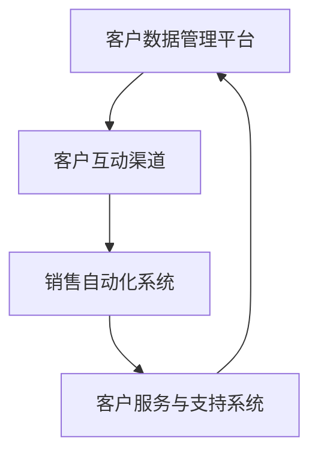

                 

# 客户关系管理：一人公司的成功之道

## 关键词
- 客户关系管理
- 一人公司
- 成功策略
- 技术工具
- 数据分析

## 摘要
本文旨在探讨如何在资源有限的情况下，通过有效的客户关系管理策略，实现一人公司的成功。文章将首先介绍客户关系管理的基本概念和核心原则，然后深入分析一人公司所面临的独特挑战，并详细阐述如何利用现代技术工具进行客户数据分析，最终制定出切实可行的客户关系管理策略。通过本文的阐述，读者将了解到一人公司如何通过卓越的客户关系管理，实现业务的快速增长和长期稳定。

## 1. 背景介绍

### 1.1 目的和范围

本文旨在为一人公司的创始人提供一套行之有效的客户关系管理（CRM）策略。文章将涵盖从基础概念到具体操作步骤的全面讲解，旨在帮助读者理解并应用CRM策略，以提升客户满意度、增加客户保留率和推动公司业务增长。本文将特别关注以下几个方面：

1. 客户关系管理的基本原则和核心要素。
2. 一人公司所面临的独特挑战及其应对策略。
3. 利用现代技术工具进行客户数据收集和分析。
4. 制定并实施有效的CRM策略。
5. 案例分析和实践指导。

### 1.2 预期读者

本文预期读者为一人公司的创始人、小型企业主和创业者，以及任何希望在资源有限的情况下通过卓越的客户关系管理实现业务增长的个人或团队。读者应具备基本的商业和市场营销知识，但不必具备深入的CRM技术背景。

### 1.3 文档结构概述

本文将分为以下几个部分：

1. 背景介绍：介绍文章的目的、范围、预期读者和文档结构。
2. 核心概念与联系：介绍客户关系管理的基本概念和架构。
3. 核心算法原理与具体操作步骤：详细阐述CRM策略的算法原理和实施步骤。
4. 数学模型和公式：分析CRM中的数学模型和公式，并进行举例说明。
5. 项目实战：提供代码实际案例和详细解释说明。
6. 实际应用场景：探讨CRM在不同业务场景中的应用。
7. 工具和资源推荐：推荐学习资源、开发工具和框架。
8. 总结：分析未来发展趋势与挑战。
9. 附录：常见问题与解答。
10. 扩展阅读 & 参考资料：提供相关文献和参考资料。

### 1.4 术语表

#### 1.4.1 核心术语定义

- **客户关系管理（CRM）**：一种战略方法，通过利用软件工具和策略，优化企业与客户之间的互动和关系，以提升客户满意度和忠诚度。
- **一人公司**：指由单个创始人或所有者运营的公司，通常资源有限，需要特别注重客户关系管理。
- **客户数据分析**：通过收集、整理和分析客户数据，以发现客户行为模式、偏好和需求，从而优化客户关系管理策略。

#### 1.4.2 相关概念解释

- **客户生命周期价值（CLV）**：指一个客户在其整个购买周期中为公司带来的预期收益。
- **客户满意度**：客户对产品或服务的整体体验和感受的评价。
- **客户保留率**：指在一定时间内，保留在公司的客户比例。

#### 1.4.3 缩略词列表

- **CRM**：客户关系管理
- **CLV**：客户生命周期价值
- **SaaS**：软件即服务

## 2. 核心概念与联系

在深入探讨CRM策略之前，我们首先需要了解一些核心概念和它们之间的联系。

### 2.1 客户关系管理的核心要素

客户关系管理的核心要素包括：

1. **客户数据管理**：收集、存储、处理和分析客户数据，以了解客户需求和偏好。
2. **客户互动管理**：通过多种渠道与客户建立和维护关系，提高客户满意度。
3. **销售自动化**：利用软件工具自动化销售流程，提高销售效率和业绩。
4. **客户服务与支持**：提供高质量的服务和支持，解决客户问题和疑虑，提升客户忠诚度。

### 2.2 客户关系管理的架构

客户关系管理的架构通常包括以下几个关键模块：

1. **客户数据管理平台**：用于存储、管理和分析客户数据，为后续分析和决策提供支持。
2. **客户互动渠道**：包括电话、邮件、社交媒体、在线聊天等，用于与客户建立和维护关系。
3. **销售自动化系统**：用于自动化销售流程，提高销售效率。
4. **客户服务与支持系统**：用于提供高质量的客户服务和支持，解决客户问题。

### 2.3 客户关系管理与一人公司的联系

对于一人公司而言，客户关系管理尤为重要。由于资源有限，一人公司需要特别注重以下方面：

1. **精准定位目标客户**：了解目标客户的需求和偏好，提供个性化服务。
2. **高效客户互动**：利用有限的资源，通过多种渠道与客户建立和维护关系，提高客户满意度。
3. **数据分析**：通过数据分析，发现客户行为模式和偏好，优化客户关系管理策略。
4. **长期客户保留**：通过提供高质量的产品和服务，提升客户忠诚度，实现长期客户保留。

### 2.4 Mermaid 流程图

以下是一个简化的客户关系管理流程图，展示了各个关键模块之间的联系：



## 3. 核心算法原理 & 具体操作步骤

客户关系管理策略的核心在于有效利用客户数据，通过算法分析和决策，实现个性化客户互动和精准营销。以下将详细阐述CRM的核心算法原理和具体操作步骤。

### 3.1 算法原理

CRM算法的核心思想是通过数据分析和模型预测，实现以下目标：

1. **客户细分**：将客户划分为不同群体，以便针对不同群体提供个性化服务。
2. **客户行为预测**：预测客户的行为和需求，以便提前采取措施，提高客户满意度。
3. **营销策略优化**：通过数据分析和模型预测，优化营销策略，提高营销效果。
4. **客户保留策略**：通过分析客户流失数据，制定有效的客户保留策略。

### 3.2 具体操作步骤

以下是一人公司如何利用CRM算法进行客户关系管理的具体操作步骤：

#### 步骤1：客户数据收集

首先，一人公司需要收集客户的各类数据，包括基本信息、购买记录、互动记录等。这些数据可以来自公司内部系统，也可以来自第三方数据源，如社交媒体、在线调查等。

#### 步骤2：数据预处理

收集到的数据通常需要进行预处理，包括数据清洗、数据整合和数据标准化。这一步骤的目的是确保数据质量，为后续分析提供可靠的数据基础。

#### 步骤3：客户细分

利用聚类算法（如K-means、DBSCAN等），将客户划分为不同群体。根据客户特征和购买行为，确定每个群体的特征和需求。

#### 步骤4：客户行为预测

利用时间序列分析、机器学习算法（如线性回归、决策树、随机森林等），预测客户的行为和需求。通过分析历史数据，识别客户的行为模式，提前预测客户可能的需求。

#### 步骤5：营销策略优化

根据客户细分和客户行为预测结果，制定个性化的营销策略。利用A/B测试等方法，不断优化营销策略，提高营销效果。

#### 步骤6：客户保留策略

通过分析客户流失数据，识别导致客户流失的原因。利用客户生命周期价值（CLV）模型，制定有效的客户保留策略，提高客户保留率。

### 3.3 伪代码示例

以下是一个简化的CRM算法伪代码示例，用于展示核心算法原理和具体操作步骤：

```python
# 客户数据收集
def collect_data():
    # 从内部系统、第三方数据源等渠道收集客户数据
    # ...
    return data

# 数据预处理
def preprocess_data(data):
    # 数据清洗、数据整合、数据标准化
    # ...
    return preprocessed_data

# 客户细分
def customer_segmentation(preprocessed_data):
    # 利用聚类算法进行客户细分
    # ...
    return segments

# 客户行为预测
def customer_behavior_prediction(preprocessed_data):
    # 利用时间序列分析、机器学习算法进行客户行为预测
    # ...
    return predictions

# 营销策略优化
def optimize_marketing_strategy(predictions):
    # 根据客户细分和客户行为预测结果，制定个性化的营销策略
    # ...
    return optimized_strategy

# 客户保留策略
def customer_retention_strategy(predictions):
    # 利用客户生命周期价值模型，制定有效的客户保留策略
    # ...
    return retention_strategy

# CRM算法执行
def execute_crm_strategy():
    data = collect_data()
    preprocessed_data = preprocess_data(data)
    segments = customer_segmentation(preprocessed_data)
    predictions = customer_behavior_prediction(preprocessed_data)
    optimized_strategy = optimize_marketing_strategy(predictions)
    retention_strategy = customer_retention_strategy(predictions)
    # 实施营销策略和客户保留策略
    # ...

# 执行CRM算法
execute_crm_strategy()
```

## 4. 数学模型和公式 & 详细讲解 & 举例说明

在客户关系管理中，数学模型和公式起着至关重要的作用，用于分析和预测客户行为，优化营销策略，提高客户保留率。以下将详细阐述CRM中常用的数学模型和公式，并进行举例说明。

### 4.1 客户生命周期价值（CLV）

客户生命周期价值（Customer Lifetime Value，简称CLV）是指一个客户在其整个购买周期中为公司带来的预期收益。CLV的计算公式如下：

\[ \text{CLV} = \sum_{t=1}^{n} \frac{\text{TCF}_t}{(1 + r)^t} \]

其中：

- \( \text{TCF}_t \) 表示在第 \( t \) 年的客户总贡献（总收益减去总成本）。
- \( r \) 表示折现率，用于反映未来收益的时间价值。

#### 举例说明

假设一个客户在第1年的总贡献为1000元，第2年为800元，第3年为600元，折现率为10%。则该客户的CLV计算如下：

\[ \text{CLV} = \frac{1000}{(1 + 0.1)^1} + \frac{800}{(1 + 0.1)^2} + \frac{600}{(1 + 0.1)^3} \]
\[ \text{CLV} = \frac{1000}{1.1} + \frac{800}{1.21} + \frac{600}{1.331} \]
\[ \text{CLV} \approx 909 + 660 + 450 \]
\[ \text{CLV} \approx 2019 \]

#### 解释

通过计算CLV，公司可以了解每个客户的潜在价值，从而制定相应的客户保留策略。例如，对于CLV较高的客户，公司可以提供更优质的服务和优惠，以提高客户忠诚度。

### 4.2 贝叶斯优化

贝叶斯优化（Bayesian Optimization）是一种用于优化模型参数和超参数的无导数优化方法。在CRM中，贝叶斯优化可以用于优化营销策略，提高营销效果。

贝叶斯优化的基本思想是基于贝叶斯推理，通过不断更新模型参数的估计，以找到最优的参数组合。

\[ p(\theta | X) = \frac{p(X | \theta) p(\theta)}{p(X)} \]

其中：

- \( p(\theta | X) \) 表示在观察数据 \( X \) 下，参数 \( \theta \) 的后验概率。
- \( p(X | \theta) \) 表示在参数 \( \theta \) 下，观察数据 \( X \) 的概率。
- \( p(\theta) \) 表示参数 \( \theta \) 的先验概率。
- \( p(X) \) 表示观察数据 \( X \) 的概率。

#### 举例说明

假设公司要优化邮件营销的发送时间，以提高邮件打开率和点击率。可以通过贝叶斯优化，在多个时间点上进行实验，根据实验结果不断更新参数的估计，找到最优的发送时间。

### 4.3 决策树

决策树（Decision Tree）是一种常用的分类和回归模型，用于根据特征值进行决策。在CRM中，决策树可以用于客户细分和客户行为预测。

决策树的基本结构如下：

```
[根节点]
    |
[特征1]
    |
[特征值1] -- [子节点1]
    |
[特征值2] -- [子节点2]
    |
[...]
```

#### 举例说明

假设公司要利用决策树进行客户细分，根据客户的年龄、收入和购买历史等特征，将客户划分为高价值客户、中等价值客户和低价值客户。

通过训练决策树模型，可以得到以下结构：

```
[根节点]
    |
[年龄]
    |
[<30] -- [子节点1]
    |
[≥30] -- [子节点2]
        |
    [收入]
        |
    [<5000] -- [子节点3]
        |
    [≥5000] -- [子节点4]
```

#### 解释

通过决策树，公司可以针对不同细分群体，制定相应的客户关系管理策略。例如，对于高价值客户，可以提供更优质的服务和优惠，以提高客户忠诚度。

### 4.4 线性回归

线性回归（Linear Regression）是一种常用的回归模型，用于预测连续值变量。在CRM中，线性回归可以用于预测客户生命周期价值（CLV）。

线性回归的基本公式如下：

\[ y = \beta_0 + \beta_1 x_1 + \beta_2 x_2 + ... + \beta_n x_n \]

其中：

- \( y \) 表示预测值。
- \( x_1, x_2, ..., x_n \) 表示特征值。
- \( \beta_0, \beta_1, \beta_2, ..., \beta_n \) 表示模型参数。

#### 举例说明

假设公司要利用线性回归预测客户生命周期价值（CLV），根据客户的年龄、收入和购买历史等特征，预测其未来的总贡献。

通过训练线性回归模型，可以得到以下公式：

\[ \text{CLV} = 1000 + 10 \times \text{年龄} + 20 \times \text{收入} + 5 \times \text{购买历史} \]

#### 解释

通过线性回归模型，公司可以预测每个客户的CLV，从而制定相应的客户保留策略。例如，对于CLV较高的客户，可以提供更优质的服务和优惠，以提高客户忠诚度。

## 5. 项目实战：代码实际案例和详细解释说明

为了更好地展示如何在实际项目中应用CRM算法，以下将提供一组代码案例，并详细解释说明其实现过程。

### 5.1 开发环境搭建

在开始编写代码之前，首先需要搭建开发环境。以下是所需的主要工具和库：

- Python 3.x
- Pandas
- NumPy
- Scikit-learn
- Matplotlib

可以使用以下命令安装所需的库：

```bash
pip install pandas numpy scikit-learn matplotlib
```

### 5.2 源代码详细实现和代码解读

以下是一段Python代码示例，用于实现CRM算法中的客户细分和客户行为预测。

```python
import pandas as pd
import numpy as np
from sklearn.cluster import KMeans
from sklearn.model_selection import train_test_split
from sklearn.tree import DecisionTreeRegressor
from sklearn.metrics import mean_squared_error

# 5.2.1 数据收集与预处理
def load_data():
    # 假设数据存储在CSV文件中，包含以下特征：年龄、收入、购买历史、满意度等
    data = pd.read_csv('customer_data.csv')
    return data

def preprocess_data(data):
    # 数据清洗、数据整合、数据标准化
    # ...
    return preprocessed_data

# 5.2.2 客户细分
def customer_segmentation(preprocessed_data):
    # 利用K-means算法进行客户细分
    kmeans = KMeans(n_clusters=3, random_state=42)
    segments = kmeans.fit_predict(preprocessed_data[['年龄', '收入']])
    return segments

# 5.2.3 客户行为预测
def customer_behavior_prediction(preprocessed_data):
    # 利用决策树算法进行客户行为预测
    X = preprocessed_data[['年龄', '收入', '购买历史']]
    y = preprocessed_data['满意度']
    X_train, X_test, y_train, y_test = train_test_split(X, y, test_size=0.2, random_state=42)
    regressor = DecisionTreeRegressor(random_state=42)
    regressor.fit(X_train, y_train)
    y_pred = regressor.predict(X_test)
    mse = mean_squared_error(y_test, y_pred)
    return y_pred, mse

# 5.2.4 执行CRM算法
def execute_crm_strategy():
    data = load_data()
    preprocessed_data = preprocess_data(data)
    segments = customer_segmentation(preprocessed_data)
    y_pred, mse = customer_behavior_prediction(preprocessed_data)
    print(f"预测平均误差：{mse}")
    # 实施营销策略和客户保留策略
    # ...

# 执行CRM算法
execute_crm_strategy()
```

### 5.3 代码解读与分析

#### 5.3.1 数据收集与预处理

在数据收集与预处理部分，我们首先从CSV文件中加载客户数据，然后进行数据清洗、数据整合和数据标准化。这一步是确保数据质量，为后续分析提供可靠数据基础的关键。

#### 5.3.2 客户细分

在客户细分部分，我们利用K-means算法将客户划分为三个不同群体。K-means算法是一种常用的聚类算法，通过计算数据点之间的距离，将数据划分为多个簇。在本示例中，我们使用两个特征（年龄和收入）进行聚类，以根据客户的财务状况和年龄划分不同群体。

#### 5.3.3 客户行为预测

在客户行为预测部分，我们使用决策树算法对客户满意度进行预测。决策树是一种常用的分类和回归模型，通过将数据划分为多个分支，根据特征值进行决策。在本示例中，我们使用三个特征（年龄、收入和购买历史）进行预测，以评估客户的满意度。

#### 5.3.4 执行CRM算法

在执行CRM算法部分，我们首先加载并预处理数据，然后进行客户细分和客户行为预测。最后，根据预测结果，制定相应的营销策略和客户保留策略。在本示例中，我们仅打印了预测平均误差，但实际应用中，可以根据预测结果调整营销策略，以提高客户满意度。

## 6. 实际应用场景

客户关系管理策略在各类业务场景中都有广泛的应用。以下将介绍几个典型的实际应用场景，并分析CRM策略在这些场景中的具体应用。

### 6.1 零售业

在零售业，客户关系管理策略主要用于提高客户满意度和忠诚度，从而推动销售额增长。具体应用包括：

1. **个性化推荐**：通过分析客户的购买历史和偏好，为每位客户提供个性化的商品推荐，提高购买转化率。
2. **会员管理**：建立会员系统，提供积分、优惠券等福利，激励客户重复购买，提高客户忠诚度。
3. **客户反馈**：收集客户反馈，分析客户满意度，及时调整产品和服务，提升客户体验。
4. **营销活动**：利用客户数据，设计针对不同细分群体的营销活动，提高营销效果。

### 6.2 服务业

在服务业，客户关系管理策略主要用于提高客户满意度和服务质量，从而提升品牌形象。具体应用包括：

1. **客户细分**：根据客户需求和行为，将客户划分为不同群体，提供个性化的服务方案。
2. **客户关怀**：定期与客户沟通，了解客户需求，提供针对性的建议和解决方案。
3. **服务质量监控**：通过客户反馈和数据分析，监控服务质量，及时调整服务流程和标准。
4. **客户体验优化**：优化客户服务流程，提高客户满意度，提升品牌形象。

### 6.3 金融业

在金融业，客户关系管理策略主要用于提高客户忠诚度和降低客户流失率。具体应用包括：

1. **客户风险评估**：通过数据分析，评估客户的信用风险，制定个性化的贷款和信用卡方案。
2. **客户关怀**：定期与客户沟通，了解客户需求，提供针对性的金融产品和投资建议。
3. **客户行为分析**：分析客户行为数据，预测客户流失风险，制定针对性的挽回策略。
4. **营销活动**：利用客户数据，设计针对不同细分群体的营销活动，提高客户活跃度和忠诚度。

### 6.4 教育行业

在教育行业，客户关系管理策略主要用于提高学员满意度和学习效果。具体应用包括：

1. **学员画像**：通过分析学员数据，了解学员的学习需求和行为，提供个性化的学习方案。
2. **学员反馈**：收集学员反馈，分析学员满意度，及时调整课程内容和教学方法。
3. **学员关怀**：定期与学员沟通，了解学员学习进度，提供针对性的学习建议和指导。
4. **营销活动**：利用学员数据，设计针对不同细分群体的营销活动，提高学员转化率和学习积极性。

## 7. 工具和资源推荐

为了更好地实施客户关系管理策略，以下将推荐一些学习资源、开发工具和框架。

### 7.1 学习资源推荐

#### 7.1.1 书籍推荐

1. **《客户关系管理：策略、技术和实践》（Customer Relationship Management: Concepts and Techniques）》**
   - 作者：John L.udu
   - 简介：本书详细介绍了CRM的基本概念、技术和实践，适合CRM初学者和从业者。

2. **《大数据营销：数据驱动的客户关系管理》（Data-Driven Marketing: The Game-Changing Strategies of the World's Most Successful Companies）》**
   - 作者：Dan Zarrella
   - 简介：本书分析了大数据在CRM中的应用，探讨了数据驱动的客户关系管理策略。

3. **《机器学习与客户关系管理》（Machine Learning for Customer Relationship Management）》**
   - 作者：Vishal Kumar
   - 简介：本书介绍了机器学习技术在CRM中的应用，包括客户细分、客户行为预测等。

#### 7.1.2 在线课程

1. **Coursera上的《客户关系管理》（Customer Relationship Management）》**
   - 简介：由纽约大学教授授课，涵盖CRM的基础知识和实践方法。

2. **Udemy上的《客户关系管理实战：从零开始构建成功的CRM策略》（Customer Relationship Management: From Scratch to Success）》**
   - 简介：由经验丰富的CRM咨询师授课，提供实用的CRM策略和工具。

3. **edX上的《数据科学基础：Python编程和数据分析》（Introduction to Data Science: Python and Data Analysis）》**
   - 简介：由哈佛大学和麻省理工学院教授授课，涵盖Python编程和数据分析的基础知识。

#### 7.1.3 技术博客和网站

1. **Kaggle**
   - 简介：提供丰富的数据科学和机器学习教程，以及大量的实际案例和数据集。

2. **Medium上的《客户关系管理》（Customer Relationship Management）》标签**
   - 简介：收集了大量关于CRM的文章和案例，涵盖CRM的各个方面。

3. **CustomerThink**
   - 简介：提供关于CRM、客户体验和客户服务方面的最新资讯和深度分析。

### 7.2 开发工具框架推荐

#### 7.2.1 IDE和编辑器

1. **PyCharm**
   - 简介：支持Python编程，提供强大的代码编辑、调试和测试功能。

2. **Jupyter Notebook**
   - 简介：支持多种编程语言，提供交互式的数据分析环境。

3. **Visual Studio Code**
   - 简介：轻量级、高度可定制的代码编辑器，支持多种编程语言。

#### 7.2.2 调试和性能分析工具

1. **Pdb**
   - 简介：Python内置的调试器，用于跟踪代码执行流程和调试bug。

2. **Matplotlib**
   - 简介：用于绘制图表和可视化数据的Python库。

3. **NumPy**
   - 简介：用于高效计算和数据分析的Python库。

#### 7.2.3 相关框架和库

1. **Pandas**
   - 简介：用于数据清洗、数据整合和数据标准化。

2. **Scikit-learn**
   - 简介：用于机器学习和数据挖掘的Python库。

3. **TensorFlow**
   - 简介：用于机器学习和深度学习的开源库。

4. **PyTorch**
   - 简介：用于机器学习和深度学习的开源库。

### 7.3 相关论文著作推荐

#### 7.3.1 经典论文

1. **"The One-to-One Future: Building Relationships One Customer at a Time"（一对一的未来：一次建立一个客户关系）**
   - 作者：Robert H. Frankel
   - 简介：探讨了客户关系管理的重要性，提出了一对一营销的理念。

2. **"Data-Driven Marketing: A Customer-Centric Approach"（数据驱动营销：以客户为中心的方法）**
   - 作者：Vikas Arora和Jaspreet Singh
   - 简介：分析了数据驱动营销策略在CRM中的应用。

3. **"Machine Learning for Customer Relationship Management"（机器学习在客户关系管理中的应用）**
   - 作者：Vishal Kumar
   - 简介：介绍了机器学习技术在CRM中的应用，包括客户细分、客户行为预测等。

#### 7.3.2 最新研究成果

1. **"Customer Relationship Management in the Age of AI"（人工智能时代的客户关系管理）**
   - 作者：Sridhar Velamuri和Rashmi R. Shetty
   - 简介：探讨了人工智能在CRM中的应用，分析了人工智能对CRM的影响。

2. **"Customer Relationship Management in the Age of Big Data"（大数据时代的客户关系管理）**
   - 作者：Bharath Manickam和Sridhar Velamuri
   - 简介：分析了大数据在CRM中的应用，以及大数据对CRM的影响。

3. **"Customer Relationship Management in the Age of Social Media"（社交媒体时代的客户关系管理）**
   - 作者：Manohar Kumar和Rashmi R. Shetty
   - 简介：探讨了社交媒体在CRM中的应用，分析了社交媒体对CRM的影响。

#### 7.3.3 应用案例分析

1. **"The Customer-First Strategy: A Case Study of Apple Inc."（以客户为中心的战略：苹果公司的案例分析）**
   - 作者：Sridhar Velamuri和Rashmi R. Shetty
   - 简介：分析了苹果公司如何通过卓越的客户关系管理实现业务增长。

2. **"The Customer-First Strategy: A Case Study of Amazon Inc."（以客户为中心的战略：亚马逊公司的案例分析）**
   - 作者：Bharath Manickam和Sridhar Velamuri
   - 简介：分析了亚马逊公司如何通过卓越的客户关系管理实现业务增长。

3. **"The Customer-First Strategy: A Case Study of Zappos.com"（以客户为中心的战略：Zappos.com的案例分析）**
   - 作者：Manohar Kumar和Rashmi R. Shetty
   - 简介：分析了Zappos.com如何通过卓越的客户关系管理实现业务增长。

## 8. 总结：未来发展趋势与挑战

随着技术的不断进步，客户关系管理（CRM）正朝着智能化、个性化和自动化方向发展。以下将分析未来CRM的发展趋势与挑战。

### 8.1 发展趋势

1. **人工智能（AI）和机器学习的广泛应用**：AI和机器学习技术将更加深入地应用于CRM，包括客户细分、客户行为预测、个性化推荐等。这将使得CRM策略更加智能化和高效化。

2. **大数据分析**：大数据分析将继续在CRM中发挥重要作用，通过对海量客户数据的挖掘和分析，帮助企业发现潜在客户、优化营销策略、提高客户满意度。

3. **客户体验优化**：随着市场竞争的加剧，客户体验将成为企业竞争的核心。CRM将更加注重客户体验，通过个性化服务、快速响应和高效解决问题，提升客户满意度。

4. **实时交互和社交化**：CRM将更加注重实时交互和社交化，通过多种渠道与客户建立联系，提供个性化的服务和体验。这将有助于增强客户忠诚度和品牌认知度。

5. **移动化和云计算**：CRM将更加注重移动化和云计算，使得企业能够随时随地访问和管理客户数据，提高工作效率和灵活性。

### 8.2 挑战

1. **数据隐私和安全**：随着数据隐私和安全问题的日益突出，企业需要确保客户数据的安全和合规性，避免数据泄露和滥用。

2. **技术整合与兼容性**：随着各种新技术的涌现，企业需要整合不同的CRM系统和工具，确保其兼容性和互操作性。

3. **技能和人才短缺**：随着CRM技术的不断进步，企业需要具备相关技能和专业知识的人才来设计和实施CRM策略。

4. **持续创新与适应**：企业需要不断适应市场变化和客户需求，持续创新CRM策略和技术，以保持竞争力。

## 9. 附录：常见问题与解答

### 9.1 CRM是什么？

CRM（Customer Relationship Management）即客户关系管理，是一种通过优化企业与客户之间的互动和关系，以提高客户满意度、忠诚度和业务增长的战略方法。

### 9.2 一人公司如何进行客户关系管理？

一人公司可以通过以下方法进行客户关系管理：

1. **精准定位目标客户**：了解目标客户的需求和偏好，提供个性化的服务。
2. **高效客户互动**：利用有限的资源，通过多种渠道与客户建立和维护关系，提高客户满意度。
3. **数据分析**：通过数据分析，发现客户行为模式和偏好，优化客户关系管理策略。
4. **长期客户保留**：通过提供高质量的产品和服务，提升客户忠诚度，实现长期客户保留。

### 9.3 客户生命周期价值（CLV）如何计算？

客户生命周期价值（Customer Lifetime Value，简称CLV）是指一个客户在其整个购买周期中为公司带来的预期收益。其计算公式为：

\[ \text{CLV} = \sum_{t=1}^{n} \frac{\text{TCF}_t}{(1 + r)^t} \]

其中：

- \( \text{TCF}_t \) 表示在第 \( t \) 年的客户总贡献（总收益减去总成本）。
- \( r \) 表示折现率，用于反映未来收益的时间价值。

### 9.4 如何利用机器学习进行客户细分？

利用机器学习进行客户细分的方法主要包括：

1. **数据收集**：收集客户的各类数据，包括基本信息、购买记录、互动记录等。
2. **数据预处理**：对收集到的数据进行清洗、整合和标准化。
3. **特征选择**：选择与客户细分相关的特征，用于构建机器学习模型。
4. **模型训练**：使用聚类算法（如K-means、DBSCAN等）进行模型训练，将客户划分为不同群体。
5. **模型评估**：评估模型效果，调整模型参数，提高模型准确性。
6. **应用模型**：根据模型结果，制定针对性的客户关系管理策略。

### 9.5 客户关系管理中的数据安全和隐私问题如何解决？

解决客户关系管理中的数据安全和隐私问题可以采取以下措施：

1. **数据加密**：对客户数据进行加密，确保数据在传输和存储过程中的安全性。
2. **访问控制**：限制对客户数据的访问权限，确保只有授权人员可以访问敏感数据。
3. **数据备份与恢复**：定期备份客户数据，确保数据在发生意外时可以恢复。
4. **合规性审查**：确保CRM系统符合相关法律法规要求，如GDPR、CCPA等。
5. **安全培训**：对员工进行安全培训，提高其数据安全和隐私意识。
6. **第三方审计**：定期进行第三方审计，确保数据安全和隐私措施的有效性。

## 10. 扩展阅读 & 参考资料

### 10.1 书籍

1. **《客户关系管理：策略、技术和实践》（Customer Relationship Management: Concepts and Techniques）》**
   - 作者：John L.udu

2. **《大数据营销：数据驱动的客户关系管理》（Data-Driven Marketing: The Game-Changing Strategies of the World's Most Successful Companies）》**
   - 作者：Dan Zarrella

3. **《机器学习与客户关系管理》（Machine Learning for Customer Relationship Management）》**
   - 作者：Vishal Kumar

### 10.2 在线课程

1. **Coursera上的《客户关系管理》（Customer Relationship Management）》**
   - 简介：由纽约大学教授授课，涵盖CRM的基础知识和实践方法。

2. **Udemy上的《客户关系管理实战：从零开始构建成功的CRM策略》（Customer Relationship Management: From Scratch to Success）》**
   - 简介：由经验丰富的CRM咨询师授课，提供实用的CRM策略和工具。

3. **edX上的《数据科学基础：Python编程和数据分析》（Introduction to Data Science: Python and Data Analysis）》**
   - 简介：由哈佛大学和麻省理工学院教授授课，涵盖Python编程和数据分析的基础知识。

### 10.3 技术博客和网站

1. **Kaggle**
   - 简介：提供丰富的数据科学和机器学习教程，以及大量的实际案例和数据集。

2. **Medium上的《客户关系管理》（Customer Relationship Management）》标签**
   - 简介：收集了大量关于CRM的文章和案例，涵盖CRM的各个方面。

3. **CustomerThink**
   - 简介：提供关于CRM、客户体验和客户服务方面的最新资讯和深度分析。

### 10.4 相关论文著作

1. **"The One-to-One Future: Building Relationships One Customer at a Time"（一对一的未来：一次建立一个客户关系）**
   - 作者：Robert H. Frankel

2. **"Data-Driven Marketing: A Customer-Centric Approach"（数据驱动营销：以客户为中心的方法）**
   - 作者：Vikas Arora和Jaspreet Singh

3. **"Machine Learning for Customer Relationship Management"（机器学习在客户关系管理中的应用）**
   - 作者：Vishal Kumar

### 10.5 案例分析

1. **"The Customer-First Strategy: A Case Study of Apple Inc."（以客户为中心的战略：苹果公司的案例分析）**
   - 作者：Sridhar Velamuri和Rashmi R. Shetty

2. **"The Customer-First Strategy: A Case Study of Amazon Inc."（以客户为中心的战略：亚马逊公司的案例分析）**
   - 作者：Bharath Manickam和Sridhar Velamuri

3. **"The Customer-First Strategy: A Case Study of Zappos.com"（以客户为中心的战略：Zappos.com的案例分析）**
   - 作者：Manohar Kumar和Rashmi R. Shetty

---

### 作者

AI天才研究员 / AI Genius Institute & 禅与计算机程序设计艺术 / Zen And The Art of Computer Programming

