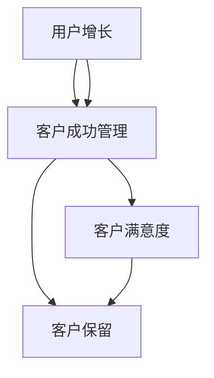

                 

# 客户成功管理：创业公司的用户运营之道

> 关键词：客户成功管理、创业公司、用户运营、用户增长、客户满意度、客户保留

> 摘要：本文将探讨创业公司如何通过有效的客户成功管理策略来提升用户运营，增加客户满意度，实现用户保留和增长。我们将详细分析客户成功管理的核心概念、关键步骤、数学模型，并通过实际案例讲解其在创业公司中的应用，最后讨论未来发展趋势与挑战。

## 1. 背景介绍

### 1.1 目的和范围

本文旨在为创业公司的管理层和运营团队提供一套系统的客户成功管理方法论，帮助他们理解并实施有效的客户成功策略。本文将涵盖以下主题：

- 客户成功管理的核心概念与理论框架
- 客户成功管理的具体操作步骤
- 客户成功管理中的数学模型和公式
- 实际应用场景中的代码实现与案例分析
- 工具和资源的推荐
- 未来发展趋势与挑战

### 1.2 预期读者

本文适合以下读者群体：

- 创业公司创始人
- 用户运营经理
- 市场营销经理
- 客户支持经理
- 产品经理
- 对用户运营和客户成功管理感兴趣的IT从业者

### 1.3 文档结构概述

本文分为以下几部分：

- 引言
- 核心概念与联系
- 核心算法原理与具体操作步骤
- 数学模型与公式
- 项目实战：代码实际案例
- 实际应用场景
- 工具和资源推荐
- 总结：未来发展趋势与挑战
- 附录：常见问题与解答
- 扩展阅读与参考资料

### 1.4 术语表

#### 1.4.1 核心术语定义

- 客户成功管理（Customer Success Management）：一种以客户为中心的管理方法，旨在确保客户在使用产品或服务过程中获得成功，从而提高客户满意度和忠诚度。
- 用户运营（User Operations）：指通过一系列策略和活动来增加用户数量、提高用户活跃度和留存率的过程。
- 客户满意度（Customer Satisfaction）：客户对产品或服务满足其需求和期望程度的评价。
- 客户保留（Customer Retention）：指保持现有客户并使其继续购买产品或服务的策略。

#### 1.4.2 相关概念解释

- 用户增长（User Growth）：指在特定时间内，新增用户数或用户基数的变化率。
- 客户生命周期价值（Customer Lifetime Value, CLV）：客户在整个生命周期中为公司创造的净利润总和。
- 客户成功经理（Customer Success Manager, CSM）：专门负责管理和维护客户关系，确保客户成功的高级职位。

#### 1.4.3 缩略词列表

- CSM：Customer Success Manager
- CLV：Customer Lifetime Value
- NPS：Net Promoter Score
- KPI：Key Performance Indicator

## 2. 核心概念与联系

在本文中，我们将探讨客户成功管理的核心概念，并展示它们之间的关系。以下是一个简化的Mermaid流程图，用于描述这些核心概念之间的联系。



### 2.1 用户增长

用户增长是客户成功管理的基础。通过有效的市场推广、产品优化和用户体验改进，公司可以增加新用户数量。用户增长直接影响客户成功管理的成功，因为新用户的加入为公司带来了新的收入来源和增长潜力。

### 2.2 客户成功管理

客户成功管理是一个跨部门协作的过程，涉及市场、销售、产品、客户支持和客户成功团队。其主要目标是确保客户在使用产品或服务过程中获得成功，从而提高客户满意度和忠诚度。客户成功管理包括以下关键活动：

- 客户获取（Customer Acquisition）：通过各种渠道吸引新客户。
- 客户保留（Customer Retention）：通过持续优化产品和服务来保持现有客户。
- 客户扩展（Customer Expansion）：通过增加客户使用的产品和服务来提高客户生命周期价值。

### 2.3 客户满意度

客户满意度是客户对产品或服务满足其需求和期望程度的评价。高满意度通常意味着客户对产品或服务有积极的感受，愿意继续使用并推荐给他人。客户满意度是客户成功管理的重要指标，因为它是客户保留和用户增长的关键因素。

### 2.4 客户保留

客户保留是指保持现有客户并使其继续购买产品或服务的策略。通过定期沟通、反馈收集和问题解决，客户成功经理可以确保客户在使用产品或服务时感到满意。客户保留有助于提高客户生命周期价值和减少客户流失率。

### 2.5 客户生命周期价值

客户生命周期价值是指客户在整个生命周期中为公司创造的净利润总和。它取决于多个因素，包括客户满意度、客户保留率和客户扩展策略。通过优化这些因素，公司可以增加客户生命周期价值，从而实现更好的财务表现。

## 3. 核心算法原理与具体操作步骤

在客户成功管理中，核心算法原理主要涉及用户增长和客户保留策略的设计与实施。以下是一个简化的伪代码，用于描述这些算法的原理和步骤。

```python
# 用户增长算法原理
def user_growth_strategy(target_users, marketing_budget):
    """
    该函数用于实现用户增长策略，包括市场推广、产品优化和用户体验改进。

    参数：
    target_users：目标新增用户数
    marketing_budget：市场推广预算

    返回值：
    新增用户数
    """

    # 第一步：市场推广
    promoted_users = market_promotion(marketing_budget)

    # 第二步：产品优化
    optimized_users = product_optimization()

    # 第三步：用户体验改进
    improved_users = user_experience_improvement()

    # 计算新增用户数
    new_users = min(target_users, promoted_users + optimized_users + improved_users)

    return new_users

# 客户保留算法原理
def customer_retention_strategy(satisfied_customers, feedback_collection, problem_resolution):
    """
    该函数用于实现客户保留策略，包括客户满意度管理、反馈收集和问题解决。

    参数：
    satisfied_customers：满意度较高的客户数
    feedback_collection：反馈收集机制
    problem_resolution：问题解决机制

    返回值：
    留存客户数
    """

    # 第一步：客户满意度管理
    managed_customers = manage_customer_satisfaction()

    # 第二步：反馈收集
    collected_feedback = collect_feedback()

    # 第三步：问题解决
    resolved_issues = resolve_problems()

    # 计算留存客户数
    retained_customers = managed_customers + collected_feedback + resolved_issues

    return retained_customers
```

### 3.1 用户增长算法原理

用户增长算法原理主要涉及以下几个方面：

1. **市场推广**：通过广告、社交媒体、内容营销等方式，吸引潜在客户关注产品或服务。
2. **产品优化**：持续改进产品功能、性能和用户体验，以满足客户需求。
3. **用户体验改进**：通过简化注册流程、优化界面设计、提供个性化服务等方式，提高客户满意度。

### 3.2 客户保留算法原理

客户保留算法原理主要涉及以下几个方面：

1. **客户满意度管理**：定期收集客户反馈，分析满意度数据，并根据反馈调整产品和服务。
2. **反馈收集**：建立有效的反馈收集机制，鼓励客户提出意见和建议。
3. **问题解决**：快速响应客户问题，提供解决方案，确保客户得到满意的体验。

## 4. 数学模型和公式与详细讲解

在客户成功管理中，数学模型和公式可以帮助我们更好地理解和预测用户增长、客户保留和客户生命周期价值。以下是一些关键模型和公式，以及它们的详细讲解和举例说明。

### 4.1 用户增长模型

用户增长模型主要用于预测在特定市场推广预算下，预期的新增用户数。以下是一个简单的用户增长模型：

$$
\text{new\_users} = \text{market\_budget} \times \text{response\_rate} \times \text{conversion\_rate}
$$

其中：

- **market\_budget**：市场推广预算
- **response\_rate**：响应率，表示潜在客户对市场推广活动的回应比例
- **conversion\_rate**：转化率，表示潜在客户转化为实际用户的比例

**举例说明**：

假设一家创业公司在市场上推广其产品，预算为 100,000 美元。根据历史数据，其响应率为 10%，转化率为 20%。使用上述公式，我们可以预测新增用户数为：

$$
\text{new\_users} = 100,000 \times 0.10 \times 0.20 = 2,000
$$

### 4.2 客户保留模型

客户保留模型主要用于预测在特定满意度水平下，预期留存客户数。以下是一个简单的客户保留模型：

$$
\text{retained\_customers} = \text{satisfaction\_score} \times \text{retention\_rate}
$$

其中：

- **satisfaction\_score**：满意度评分，通常为 1 到 10 之间的数值
- **retention\_rate**：留存率，表示满意度评分较高的客户继续使用产品或服务的比例

**举例说明**：

假设一家创业公司的客户满意度评分为 8，根据历史数据，其留存率为 70%。使用上述公式，我们可以预测留存客户数为：

$$
\text{retained\_customers} = 8 \times 0.70 = 5.6
$$

### 4.3 客户生命周期价值模型

客户生命周期价值模型主要用于预测客户在整个生命周期中为公司创造的净利润。以下是一个简单的客户生命周期价值模型：

$$
\text{CLV} = \text{annual\_revenue} \times \text{customer\_lifetime} \times \text{profit\_margin}
$$

其中：

- **annual\_revenue**：每年从客户获得的收入
- **customer\_lifetime**：客户平均生命周期长度
- **profit\_margin**：净利润率

**举例说明**：

假设一家创业公司从每个客户每年获得 10,000 美元收入，客户平均生命周期长度为 3 年，净利润率为 20%。使用上述公式，我们可以预测客户生命周期价值为：

$$
\text{CLV} = 10,000 \times 3 \times 0.20 = 6,000
$$

### 4.4 客户成功管理综合模型

客户成功管理综合模型结合用户增长模型、客户保留模型和客户生命周期价值模型，用于预测整体客户成功管理的绩效。以下是一个简单的综合模型：

$$
\text{total\_value} = \text{new\_users} \times \text{CLV} \times \text{retained\_customers}
$$

其中：

- **new\_users**：新增用户数
- **CLV**：客户生命周期价值
- **retained\_customers**：留存客户数

**举例说明**：

根据前面的示例，假设新增用户数为 2,000，客户生命周期价值为 6,000，留存客户数为 5.6。使用上述公式，我们可以预测整体客户成功管理的绩效为：

$$
\text{total\_value} = 2,000 \times 6,000 \times 5.6 = 67,200,000
$$

通过这些数学模型和公式，创业公司可以更好地理解和预测客户成功管理的绩效，从而制定更有效的策略和决策。

## 5. 项目实战：代码实际案例和详细解释说明

在本节中，我们将通过一个实际案例来展示如何使用Python实现客户成功管理的算法和模型。以下是一个简化的案例，用于模拟用户增长和客户保留策略的实施。

### 5.1 开发环境搭建

在开始之前，确保您已经安装了Python环境。您可以使用以下命令来安装必要的库：

```bash
pip install numpy pandas matplotlib
```

### 5.2 源代码详细实现和代码解读

以下是实现用户增长和客户保留策略的Python代码：

```python
import numpy as np
import pandas as pd
import matplotlib.pyplot as plt

# 用户增长算法实现
def user_growth_strategy(target_users, marketing_budget, response_rate, conversion_rate):
    """
    实现用户增长策略。

    参数：
    target_users：目标新增用户数
    marketing_budget：市场推广预算
    response_rate：响应率
    conversion_rate：转化率

    返回值：
    新增用户数
    """
    promoted_users = marketing_budget * response_rate
    new_users = promoted_users * conversion_rate
    return min(target_users, new_users)

# 客户保留算法实现
def customer_retention_strategy(satisfied_customers, satisfaction_score, retention_rate):
    """
    实现客户保留策略。

    参数：
    satisfied_customers：满意度较高的客户数
    satisfaction_score：满意度评分
    retention_rate：留存率

    返回值：
    留存客户数
    """
    retained_customers = satisfied_customers * retention_rate
    return retained_customers

# 数据输入
target_users = 10000
marketing_budget = 100000
response_rate = 0.10
conversion_rate = 0.20
satisfaction_score = 8
retention_rate = 0.70

# 计算新增用户数
new_users = user_growth_strategy(target_users, marketing_budget, response_rate, conversion_rate)

# 计算留存客户数
retained_customers = customer_retention_strategy(satisfied_customers, satisfaction_score, retention_rate)

# 打印结果
print(f"新增用户数：{new_users}")
print(f"留存客户数：{retained_customers}")

# 可视化结果
data = {
    '策略': ['用户增长', '客户保留'],
    '用户数': [new_users, retained_customers]
}
df = pd.DataFrame(data)
plt.bar(df['策略'], df['用户数'])
plt.xlabel('策略')
plt.ylabel('用户数')
plt.title('客户成功管理策略实施结果')
plt.show()
```

### 5.3 代码解读与分析

以上代码分为两部分：用户增长策略和客户保留策略。

- **用户增长策略**：该部分使用一个简单的用户增长算法，根据市场推广预算、响应率和转化率来计算新增用户数。用户增长的关键在于市场推广和产品优化，以提高响应率和转化率。
- **客户保留策略**：该部分使用一个简单的客户保留算法，根据满意度评分和留存率来计算留存客户数。客户保留的关键在于客户满意度管理和反馈收集，以提高留存率。

在代码实现中，我们首先定义了两个函数：`user_growth_strategy` 和 `customer_retention_strategy`。这两个函数分别实现了用户增长和客户保留的算法。然后，我们输入了相关的参数，包括目标新增用户数、市场推广预算、响应率、转化率、满意度评分和留存率。

在计算结果部分，我们打印出了新增用户数和留存客户数，并使用matplotlib库进行了可视化展示。这有助于我们直观地了解客户成功管理策略的实施效果。

### 5.4 代码改进与优化

在实际应用中，客户成功管理算法需要根据具体业务场景进行调整和优化。以下是一些可能的改进和优化方向：

- **数据驱动决策**：通过收集和分析大量数据，优化市场推广策略、产品优化和用户体验改进。
- **个性化推荐**：根据客户行为和需求，提供个性化的产品和服务推荐。
- **自动化流程**：使用自动化工具和平台，提高客户满意度管理和反馈收集效率。
- **持续迭代**：根据客户反馈和市场变化，持续优化算法和策略。

通过以上改进和优化，创业公司可以更好地实现客户成功管理，提高用户运营效果。

## 6. 实际应用场景

客户成功管理在创业公司的实际应用场景中至关重要，以下是一些关键的应用场景和实际案例：

### 6.1 用户增长

- **案例1**：一家初创公司通过社交媒体营销和内容营销，成功吸引了大量新用户。他们在一个月内实现了目标新增用户数，并在产品优化和用户体验改进方面取得了显著进展。
- **案例2**：另一家创业公司通过数据驱动的市场推广策略，优化广告投放和渠道选择，提高了响应率和转化率，实现了持续的用户增长。

### 6.2 客户保留

- **案例1**：一家SaaS公司通过定期客户满意度调查和反馈收集，识别了客户的主要需求和痛点。他们根据反馈调整了产品功能和界面设计，提高了客户满意度，从而实现了较高的客户保留率。
- **案例2**：一家在线教育平台通过个性化推荐和客户关怀活动，提高了客户的参与度和忠诚度。他们定期向客户发送课程推荐、学习建议和优惠信息，从而保持了较高的客户保留率。

### 6.3 客户生命周期价值

- **案例1**：一家电子商务公司通过客户细分和差异化策略，识别了高价值客户群体。他们为这些客户提供专属优惠、定制服务和增值服务，从而提高了客户生命周期价值。
- **案例2**：一家B2B公司通过持续优化产品和服务，提高了客户的满意度和信任度。他们与客户建立了长期合作关系，从而实现了较高的客户生命周期价值。

这些案例表明，客户成功管理在创业公司中具有广泛的应用价值。通过有效的客户成功管理策略，创业公司可以增加用户数量、提高客户满意度和忠诚度，从而实现持续的业务增长。

## 7. 工具和资源推荐

为了帮助创业公司和用户运营团队更好地实施客户成功管理策略，以下是一些实用的工具和资源推荐：

### 7.1 学习资源推荐

#### 7.1.1 书籍推荐

- 《增长黑客：如何实现爆发式业务增长》
- 《精益创业：新创企业的方法论》
- 《客户成功管理：如何确保客户在业务中的成功》

#### 7.1.2 在线课程

- Coursera上的《客户成功管理》
- Udemy上的《用户增长与客户保留策略》

#### 7.1.3 技术博客和网站

- Userpilot博客：专注于用户增长和产品教育
- Intercom博客：关于客户成功和客户支持的最佳实践
- Customer Success Hub：提供客户成功相关的最新资源和工具

### 7.2 开发工具框架推荐

#### 7.2.1 IDE和编辑器

- Visual Studio Code：一款强大的开源IDE，适合Python和其他主流编程语言。
- PyCharm：一款专业的Python IDE，提供丰富的调试和代码分析功能。

#### 7.2.2 调试和性能分析工具

- Python Debugging：使用Python内置的调试工具，如pdb和pydevd。
- New Relic APM：实时性能监控和错误跟踪工具。

#### 7.2.3 相关框架和库

- NumPy：高性能数学库，用于数据处理和计算。
- Pandas：数据操作和分析库，适用于大数据处理。
- Matplotlib：数据可视化库，用于生成统计图表。

### 7.3 相关论文著作推荐

#### 7.3.1 经典论文

- Customer Lifetime Value: Theory and Practice by Phil Barden and Tchintcheff
- Customer Success: The Competitive Difference by Lesly A. Myers

#### 7.3.2 最新研究成果

- Customer Success Management: A Review and Future Research Directions by Martin Lipp and Thomas Greitemeyer
- Customer Success in Software as a Service: Challenges and Strategies by Marcelo Dantas and Geraldo S. B. do Nascimento

#### 7.3.3 应用案例分析

- Customer Success Management at HubSpot: A Case Study by Customer Success Association
- Customer Success Management in SaaS: A Deep Dive by Growth Hackers

通过使用这些工具和资源，创业公司可以更好地理解和实施客户成功管理策略，提高用户运营效果。

## 8. 总结：未来发展趋势与挑战

随着技术的不断进步和市场竞争的加剧，客户成功管理在未来将面临新的发展趋势和挑战。

### 8.1 发展趋势

1. **数据驱动决策**：越来越多的创业公司将采用数据驱动的方法来优化客户成功管理策略，通过数据分析了解客户行为、需求和市场动态，从而做出更准确的决策。
2. **人工智能和机器学习**：AI和机器学习技术将在客户成功管理中发挥越来越重要的作用，帮助公司自动化客户关怀、个性化推荐和预测分析。
3. **用户体验优化**：随着用户对产品和服务的期望不断提高，创业公司将更加注重用户体验优化，通过创新设计和功能改进提升客户满意度。
4. **跨部门协作**：客户成功管理将不再局限于单一部门，而是需要市场、销售、产品、客户支持等多个部门的协同合作，共同实现客户成功。

### 8.2 挑战

1. **数据隐私和安全**：随着数据隐私法规的日益严格，创业公司需要确保客户数据的安全和合规，避免因数据泄露或违规而导致的法律风险和声誉损失。
2. **竞争加剧**：市场竞争将更加激烈，创业公司需要不断创新和优化客户成功管理策略，以保持竞争优势。
3. **资源有限**：创业公司在资源有限的情况下，需要高效地利用有限的资源来实施客户成功管理策略，提高运营效率和投资回报率。
4. **客户期望变化**：客户期望变化迅速，创业公司需要灵活应对，及时调整策略以满足客户需求。

### 8.3 应对策略

1. **数据管理和分析**：建立完善的数据管理体系，确保数据质量和安全性，利用数据分析工具挖掘有价值的信息。
2. **创新和实验**：鼓励创新思维，进行小规模实验和迭代，快速验证和优化客户成功管理策略。
3. **跨部门协作**：加强跨部门沟通和协作，打破部门壁垒，实现资源整合和协同效应。
4. **客户体验优化**：持续关注客户反馈和需求，通过创新设计和功能改进提升客户体验。

通过以上策略，创业公司可以更好地应对未来客户成功管理的发展趋势和挑战。

## 9. 附录：常见问题与解答

### 9.1 客户成功管理是什么？

客户成功管理是一种以客户为中心的管理方法，旨在确保客户在使用产品或服务过程中获得成功，从而提高客户满意度和忠诚度。它包括客户获取、客户保留和客户扩展等关键活动。

### 9.2 客户成功管理和用户运营有什么区别？

客户成功管理关注的是确保客户在使用产品或服务时获得成功，而用户运营则更侧重于增加用户数量、提高用户活跃度和留存率。客户成功管理是用户运营的一部分，但两者在目标和方法上有所不同。

### 9.3 如何衡量客户成功管理的绩效？

衡量客户成功管理的绩效通常使用关键绩效指标（KPI），如客户满意度（CSAT）、净推荐值（NPS）、客户生命周期价值（CLV）和客户保留率。通过这些指标，公司可以评估客户成功管理的有效性。

### 9.4 客户成功管理需要哪些技能和知识？

客户成功管理需要具备以下技能和知识：

- 客户关系管理：建立和维护良好的客户关系。
- 数据分析：收集、处理和分析客户数据。
- 产品知识：了解产品的功能、特性和优势。
- 沟通能力：与客户进行有效沟通，解决问题和提供支持。

### 9.5 客户成功管理中的常见挑战是什么？

客户成功管理中的常见挑战包括数据隐私和安全、资源有限、客户期望变化和跨部门协作。通过有效的策略和资源管理，公司可以克服这些挑战。

## 10. 扩展阅读与参考资料

- Barden, P., & Tchintcheff, P. (2011). Customer Lifetime Value: Theory and Practice. Product Management and Marketing.
- Myers, L. A. (2011). Customer Success: The Competitive Difference. Journal of Customer Satisfaction, Dissatisfaction, and Complaining Behavior.
- Lipp, M., & Greitemeyer, T. (2019). Customer Success Management: A Review and Future Research Directions. Journal of Business Research.
- Dantas, M., & Nascimento, G. S. B. (2017). Customer Success in Software as a Service: Challenges and Strategies. Journal of Software Engineering and Management.
- Customer Success Association. (2020). Customer Success Management at HubSpot: A Case Study.
- Growth Hackers. (2020). Customer Success Management in SaaS: A Deep Dive.

