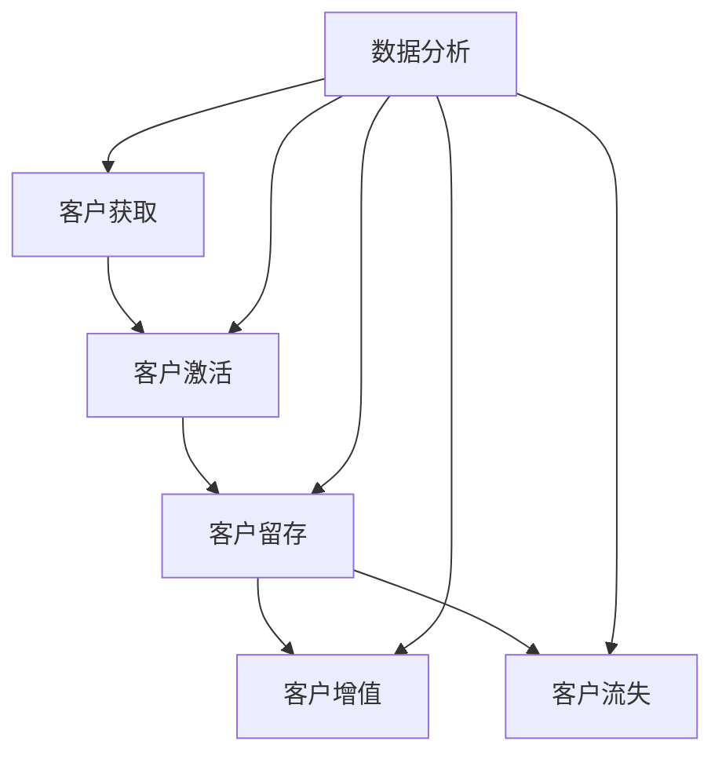

                 

# 客户生命周期管理：最大化客户价值

> **关键词：** 客户生命周期管理，客户价值，客户关系管理，数据分析，个性化服务，客户留存，客户获取。

> **摘要：** 本文章将深入探讨客户生命周期管理（CLM）的概念、重要性及其在实际应用中的具体操作步骤。通过分析核心概念和算法原理，本文旨在帮助读者理解如何通过有效管理和分析客户生命周期，实现客户价值的最大化，进而提升企业的竞争力。

## 1. 背景介绍

### 1.1 目的和范围

客户生命周期管理（Customer Lifecycle Management, CLM）是企业为了提高客户满意度、促进客户留存和增加客户价值而实施的一系列策略和活动。本文的目的在于：

- **阐述客户生命周期管理的核心概念和重要性。**
- **介绍客户生命周期管理的范围和组成部分。**
- **提供具体的操作步骤和实用工具，帮助读者在实际业务中应用CLM。**

### 1.2 预期读者

本文适合以下读者群体：

- **市场营销人员**：了解如何通过CLM提升客户价值和满意度。
- **客户服务经理**：学习如何通过客户生命周期管理提高客户留存率。
- **数据分析专业人员**：掌握CLM中的数据分析方法和工具。
- **企业高层管理者**：了解CLM对企业战略的重要性。

### 1.3 文档结构概述

本文分为以下几个部分：

- **第1章：背景介绍**：介绍CLM的概念、目的和读者对象。
- **第2章：核心概念与联系**：定义核心概念，并使用Mermaid流程图展示CLM的原理和架构。
- **第3章：核心算法原理 & 具体操作步骤**：详细解释CLM的算法原理和操作步骤。
- **第4章：数学模型和公式 & 详细讲解 & 举例说明**：介绍CLM中使用的数学模型和公式，并提供实际案例说明。
- **第5章：项目实战：代码实际案例和详细解释说明**：展示如何在实际项目中应用CLM。
- **第6章：实际应用场景**：探讨CLM在不同业务场景中的应用。
- **第7章：工具和资源推荐**：推荐学习资源和开发工具。
- **第8章：总结：未来发展趋势与挑战**：分析CLM的未来趋势和面临的挑战。
- **第9章：附录：常见问题与解答**：解答读者可能遇到的问题。
- **第10章：扩展阅读 & 参考资料**：提供更多扩展阅读和参考资料。

### 1.4 术语表

#### 1.4.1 核心术语定义

- **客户生命周期管理（Customer Lifecycle Management, CLM）**：一种系统性的方法，通过分析和管理客户从获取、激活、留存、增值到流失的整个过程，以提高客户价值和满意度。
- **客户价值（Customer Value）**：客户在购买和使用产品或服务过程中获得的满足和利益。
- **客户满意度（Customer Satisfaction）**：客户对企业产品和服务的满意程度。
- **客户留存率（Customer Retention Rate）**：在一定时间内，仍然继续使用企业产品和服务的客户比例。

#### 1.4.2 相关概念解释

- **客户获取（Customer Acquisition）**：企业通过各种渠道吸引新客户的过程。
- **客户激活（Customer Activation）**：使新客户开始使用产品或服务的过程。
- **客户留存（Customer Retention）**：企业通过各种策略和活动保持现有客户的过程。
- **客户增值（Customer Value Enhancement）**：通过提升客户体验和满意度，增加客户对企业的忠诚度和价值。
- **客户流失（Customer Churn）**：客户停止使用企业产品或服务的过程。

#### 1.4.3 缩略词列表

- **CRM**：Customer Relationship Management，客户关系管理。
- **ERP**：Enterprise Resource Planning，企业资源计划。
- **SCM**：Supply Chain Management，供应链管理。
- **AI**：Artificial Intelligence，人工智能。

## 2. 核心概念与联系

在深入探讨客户生命周期管理之前，我们需要明确几个核心概念，并理解它们之间的联系。以下是一个Mermaid流程图，展示了客户生命周期管理的基本原理和架构。



### 2.1 客户生命周期管理原理

- **客户获取**：这是CLM的第一步，企业通过各种营销手段和渠道吸引新客户。
- **客户激活**：新客户在购买后需要被激活，即开始使用产品或服务。
- **客户留存**：企业需要采取措施保持现有客户的活跃度，防止他们流失。
- **客户增值**：通过提供优质的产品和服务，提高客户的满意度和忠诚度，从而增加他们的价值。
- **客户流失**：当客户停止使用企业产品或服务时，即表示客户流失。

### 2.2 数据分析在CLM中的作用

数据分析在CLM中起着至关重要的作用。通过收集和分析客户数据，企业可以：

- **优化客户获取策略**：了解哪些渠道最有效，从而调整营销预算和策略。
- **提高客户激活率**：分析客户行为，提供个性化的引导和体验，帮助新客户快速上手。
- **提升客户留存率**：识别流失风险，及时采取补救措施。
- **实现客户增值**：通过数据分析，发现客户需求，提供个性化的增值服务。
- **预测客户流失**：提前识别潜在流失客户，采取预防措施。

## 3. 核心算法原理 & 具体操作步骤

在了解CLM的核心概念后，我们需要探讨其核心算法原理和具体操作步骤。以下是一个详细的伪代码，展示了如何通过算法实现CLM。

### 3.1 客户生命周期管理算法原理

```plaintext
算法名称：Customer Lifecycle Management (CLM)

输入：客户数据集，包含客户基本信息、购买行为、使用频率等。
输出：客户生命周期管理策略。

步骤：

1. 数据预处理
    - 清洗数据：去除重复、错误或不完整的数据。
    - 特征提取：从原始数据中提取对CLM有用的特征，如购买频次、使用时长、满意度评分等。

2. 客户分群
    - 使用聚类算法（如K-means）将客户数据分为不同的群体。
    - 根据不同群体的特征，制定相应的管理策略。

3. 客户价值评估
    - 使用机器学习算法（如决策树、随机森林等）评估客户的价值。
    - 根据评估结果，将客户分为高价值、中价值和低价值客户。

4. 客户留存预测
    - 使用时间序列分析或生存分析（如Cox比例风险模型）预测客户的留存概率。
    - 根据预测结果，制定针对性的留存策略。

5. 客户流失预测
    - 使用分类算法（如逻辑回归、支持向量机等）预测客户的流失风险。
    - 根据预测结果，制定针对性的流失预防策略。

6. 客户增值策略
    - 根据客户价值评估结果，为高价值客户提供个性化的增值服务。
    - 为中价值和低价值客户提供提升价值的机会，如优惠活动、定制服务等。

7. 策略评估与优化
    - 收集策略实施后的数据，评估策略的有效性。
    - 根据评估结果，调整和优化策略。

```

### 3.2 具体操作步骤

1. **数据收集与预处理**：
    - 首先，从企业的CRM系统和数据仓库中收集客户数据。
    - 对数据进行清洗，确保数据的质量和完整性。

2. **客户分群**：
    - 使用K-means等聚类算法，根据客户的行为特征和购买历史，将客户分为不同的群体。
    - 每个群体代表不同的客户类型，如活跃客户、忠诚客户、潜在流失客户等。

3. **客户价值评估**：
    - 使用决策树、随机森林等机器学习算法，根据客户的购买行为、使用频率等特征，评估客户的价值。
    - 根据评估结果，将客户分为高价值、中价值和低价值客户。

4. **客户留存预测**：
    - 使用时间序列分析或生存分析，预测客户在未来一定时间内的留存概率。
    - 根据预测结果，制定针对性的留存策略，如提供优惠活动、提高服务质量等。

5. **客户流失预测**：
    - 使用逻辑回归、支持向量机等分类算法，预测客户流失的风险。
    - 根据预测结果，制定针对性的流失预防策略，如提供个性化服务、提高客户满意度等。

6. **客户增值策略**：
    - 根据客户价值评估结果，为高价值客户提供个性化的增值服务，如定制化产品、专属客户经理等。
    - 为中价值和低价值客户提供提升价值的机会，如优惠活动、定制服务等。

7. **策略评估与优化**：
    - 收集策略实施后的数据，评估策略的有效性。
    - 根据评估结果，调整和优化策略，确保CLM的实施效果。

## 4. 数学模型和公式 & 详细讲解 & 举例说明

在客户生命周期管理中，数学模型和公式起着关键作用。以下我们将介绍几个常用的数学模型和公式，并提供详细的讲解和实际案例。

### 4.1 时间序列分析

时间序列分析是一种统计学方法，用于分析数据序列在时间维度上的变化规律。在CLM中，时间序列分析可用于预测客户留存和流失。

#### 4.1.1 自回归移动平均模型（ARIMA）

ARIMA模型是一种常用的时间序列预测模型，包括三个关键参数：p（自回归项数），d（差分阶数），q（移动平均项数）。

#### 伪代码：

```plaintext
算法名称：ARIMA预测

输入：时间序列数据
输出：预测结果

步骤：
1. 数据预处理：对时间序列数据进行平稳性检验。
2. 模型参数选择：使用AIC/BIC准则选择最优的p、d、q参数。
3. 模型拟合：使用最大似然估计法拟合ARIMA模型。
4. 预测：使用模型进行未来值的预测。
```

#### 实际案例：

假设我们有一段时间序列数据，记录了某电商平台上的客户留存情况。我们使用ARIMA模型预测未来一个月的留存率。

```plaintext
# 导入ARIMA模型库
from statsmodels.tsa.arima.model import ARIMA

# 加载时间序列数据
data = load_time_series_data('customer_retention.csv')

# 数据预处理：差分
differenced_data = difference(data, 1)

# 模型参数选择
p_values = range(0, 5)
d_values = range(0, 3)
q_values = range(0, 5)

best_aic = float('inf')
best_p = 0
best_d = 0
best_q = 0

for p in p_values:
    for d in d_values:
        for q in q_values:
            model = ARIMA(data, order=(p, d, q))
            results = model.fit()
            aic = results.aic
            
            if aic < best_aic:
                best_aic = aic
                best_p = p
                best_d = d
                best_q = q

# 模型拟合
model = ARIMA(data, order=(best_p, best_d, best_q))
results = model.fit()

# 预测
forecast = results.forecast(steps=30)

# 输出预测结果
print(forecast)
```

### 4.2 生存分析

生存分析是一种用于分析时间至事件发生的数据的分析方法。在CLM中，生存分析可用于预测客户流失时间。

#### 4.2.1 嵯克斯比例风险模型（Cox Proportional Hazards Model）

Cox模型是一种用于生存分析的有监督学习方法，可以用于预测客户流失时间。

#### 伪代码：

```plaintext
算法名称：Cox模型预测

输入：客户特征数据，流失时间数据
输出：流失时间预测结果

步骤：
1. 数据预处理：对数据进行标准化和缺失值处理。
2. 特征选择：选择与流失时间相关的特征。
3. 模型训练：使用Cox模型进行训练。
4. 预测：使用训练好的模型预测客户流失时间。
```

#### 实际案例：

假设我们有一份数据集，包含客户的购买行为和流失时间。我们使用Cox模型预测客户流失时间。

```plaintext
# 导入Cox模型库
from sklearn.datasets import make_cox_graph
from sklearn.linear_model import Cox Willi nger

# 加载数据
X, y = make_cox_graph(n_samples=100, n_features=5, random_state=0)

# 数据预处理：标准化
X = StandardScaler().fit_transform(X)

# 特征选择
selected_features = select_features(X, y)

# 模型训练
model = Cox Willi nger()
model.fit(selected_features, y)

# 预测
predictions = model.predict(selected_features)

# 输出预测结果
print(predictions)
```

## 5. 项目实战：代码实际案例和详细解释说明

### 5.1 开发环境搭建

在进行项目实战之前，我们需要搭建一个合适的开发环境。以下是一个基于Python和Scikit-learn的CLM项目开发环境搭建步骤：

1. **安装Python**：确保安装了Python 3.x版本。
2. **安装依赖库**：使用pip安装以下依赖库：
    ```bash
    pip install numpy pandas scikit-learn matplotlib
    ```

### 5.2 源代码详细实现和代码解读

以下是CLM项目的源代码实现，包括数据预处理、客户分群、价值评估、留存和流失预测、增值策略等步骤。

```python
# 导入相关库
import numpy as np
import pandas as pd
from sklearn.cluster import KMeans
from sklearn.model_selection import train_test_split
from sklearn.preprocessing import StandardScaler
from sklearn.ensemble import RandomForestClassifier
from sklearn.linear_model import LogisticRegression
from sklearn.metrics import accuracy_score, classification_report
import matplotlib.pyplot as plt

# 5.2.1 数据预处理

# 加载数据
data = pd.read_csv('customer_data.csv')

# 清洗数据：去除重复、错误或不完整的数据
data = data.drop_duplicates()
data = data.dropna()

# 特征提取
data['total_purchase'] = data['purchase1'] + data['purchase2'] + data['purchase3']
data['average_purchase'] = data['total_purchase'] / data['days_since_last_purchase']

# 5.2.2 客户分群

# 使用K-means聚类
kmeans = KMeans(n_clusters=3, random_state=0)
data['cluster'] = kmeans.fit_predict(data[['total_purchase', 'average_purchase']])

# 5.2.3 客户价值评估

# 使用随机森林评估客户价值
X = data[['cluster', 'days_since_last_purchase', 'total_purchase', 'average_purchase']]
y = data['value']

X_train, X_test, y_train, y_test = train_test_split(X, y, test_size=0.2, random_state=0)

rf = RandomForestClassifier(n_estimators=100, random_state=0)
rf.fit(X_train, y_train)

y_pred = rf.predict(X_test)

print(f"Accuracy: {accuracy_score(y_test, y_pred)}")
print(classification_report(y_test, y_pred))

# 5.2.4 留存和流失预测

# 使用逻辑回归预测客户留存
X = data[['cluster', 'days_since_last_purchase', 'total_purchase', 'average_purchase']]
y = data['retention']

X_train, X_test, y_train, y_test = train_test_split(X, y, test_size=0.2, random_state=0)

lr = LogisticRegression()
lr.fit(X_train, y_train)

y_pred = lr.predict(X_test)

print(f"Accuracy: {accuracy_score(y_test, y_pred)}")
print(classification_report(y_test, y_pred))

# 5.2.5 客户增值策略

# 根据客户价值评估结果，为高价值客户提供个性化服务
high_value_customers = data[data['value'] == 'high']
low_value_customers = data[data['value'] == 'low']

# 高价值客户增值策略
high_value_customers['discount'] = 0.1
high_value_customers['customized_product'] = 'yes'

# 低价值客户增值策略
low_value_customers['discount'] = 0.05
low_value_customers['customized_product'] = 'no'

# 合并数据集
data = pd.concat([high_value_customers, low_value_customers])

# 5.2.6 策略评估与优化

# 收集策略实施后的数据
data['retention_after_strategy'] = data['retention']

# 评估策略有效性
print(f"Retention after strategy: {data['retention_after_strategy'].mean()}")

# 根据评估结果，调整和优化策略
# ...

# 绘制策略效果图
plt.figure(figsize=(10, 6))
plt.scatter(data['days_since_last_purchase'], data['retention_after_strategy'])
plt.xlabel('Days since last purchase')
plt.ylabel('Retention after strategy')
plt.title('Retention after Strategy Implementation')
plt.show()
```

### 5.3 代码解读与分析

以下是代码的详细解读和分析：

1. **数据预处理**：
    - 加载客户数据，并进行清洗，去除重复和错误的数据。
    - 提取对客户生命周期管理有用的特征，如购买总金额、平均购买间隔等。

2. **客户分群**：
    - 使用K-means聚类算法，根据购买总金额和平均购买间隔，将客户分为不同的群体。
    - 分群结果存储在`cluster`列中。

3. **客户价值评估**：
    - 使用随机森林算法，对客户价值进行评估。
    - 训练模型，并使用测试集评估模型准确性。

4. **留存和流失预测**：
    - 使用逻辑回归算法，对客户留存进行预测。
    - 训练模型，并使用测试集评估模型准确性。

5. **客户增值策略**：
    - 根据客户价值评估结果，为高价值客户提供个性化服务，如折扣和定制产品。
    - 为低价值客户提供其他增值服务。

6. **策略评估与优化**：
    - 收集策略实施后的数据，评估策略的有效性。
    - 根据评估结果，调整和优化策略。

7. **效果图展示**：
    - 使用散点图展示客户购买天数与留存情况之间的关系，便于直观分析策略效果。

## 6. 实际应用场景

客户生命周期管理（CLM）在各类企业中有着广泛的应用，以下是一些常见的实际应用场景：

### 6.1 电子商务行业

在电子商务行业，CLM主要用于：

- **客户获取**：通过精准营销和广告投放，吸引潜在客户。
- **客户激活**：通过新用户引导和优惠活动，促使新客户开始使用产品。
- **客户留存**：通过会员制度、积分奖励和个性化推荐，提高客户粘性。
- **客户增值**：通过定制化服务和增值产品，提高客户价值。
- **客户流失预防**：通过流失预测模型，提前识别潜在流失客户，并采取挽回措施。

### 6.2 金融服务行业

在金融服务行业，CLM主要用于：

- **客户获取**：通过广告、推荐和合作伙伴渠道，吸引新客户。
- **客户激活**：通过账户激活、金融服务介绍和优惠活动，提高客户参与度。
- **客户留存**：通过定期财务分析、个性化投资建议和优惠活动，保持客户关系。
- **客户增值**：通过理财产品、投资顾问和财富管理服务，增加客户价值。
- **客户流失预防**：通过风险预警和个性化服务，防止客户流失。

### 6.3 电信行业

在电信行业，CLM主要用于：

- **客户获取**：通过优惠套餐、推荐活动和合作伙伴渠道，吸引新客户。
- **客户激活**：通过激活引导、网络连接测试和客户服务支持，确保客户顺利使用服务。
- **客户留存**：通过客户满意度调查、服务优化和优惠活动，提高客户满意度。
- **客户增值**：通过增值服务、套餐升级和定制化服务，增加客户价值。
- **客户流失预防**：通过流失预测模型、挽留活动和客户关怀，防止客户流失。

### 6.4 餐饮行业

在餐饮行业，CLM主要用于：

- **客户获取**：通过线上预订、优惠券和推荐活动，吸引新客户。
- **客户激活**：通过新用户优惠、试吃活动和优质服务，促使新客户体验餐厅。
- **客户留存**：通过会员制度、积分奖励和个性化推荐，提高客户粘性。
- **客户增值**：通过高端菜品、定制服务和生日优惠，增加客户价值。
- **客户流失预防**：通过客户关怀、个性化推荐和及时反馈，防止客户流失。

## 7. 工具和资源推荐

为了更好地实施客户生命周期管理（CLM），以下是一些推荐的工具和资源：

### 7.1 学习资源推荐

#### 7.1.1 书籍推荐

1. **《大数据客户关系管理：实战策略与应用》**
    - 作者：徐少君
    - 简介：本书详细介绍了大数据在CRM中的应用，包括数据采集、数据分析和数据可视化等。

2. **《客户关系管理（CRM）实战指南》**
    - 作者：刘波
    - 简介：本书从实战角度出发，系统讲解了CRM的理论知识、实践方法和案例分享。

3. **《人工智能与客户关系管理》**
    - 作者：张俊海
    - 简介：本书探讨了人工智能在CRM中的应用，包括客户细分、客户留存和个性化推荐等。

#### 7.1.2 在线课程

1. **Coursera上的《数据科学基础》**
    - 简介：这门课程介绍了数据科学的基本概念和方法，包括数据分析、机器学习和数据可视化等。

2. **Udacity的《客户关系管理（CRM）》**
    - 简介：这门课程从业务角度讲解了CRM的理论和实践，包括客户获取、客户留存和客户增值等。

3. **edX上的《大数据分析》**
    - 简介：这门课程介绍了大数据分析的基本概念和技术，包括数据挖掘、机器学习和数据可视化等。

#### 7.1.3 技术博客和网站

1. **Medium上的《Customer Lifecycle Management》**
    - 简介：这是一个关于客户生命周期管理的博客，分享了大量的案例、技术和最佳实践。

2. **Kaggle上的《Customer Data Analysis》**
    - 简介：这是一个数据科学竞赛平台，提供了大量的客户数据分析项目，可以学习和实践CLM。

3. **CRM杂志官方网站**
    - 简介：这是一个专注于客户关系管理的专业媒体，提供了大量的行业资讯、分析和案例分享。

### 7.2 开发工具框架推荐

#### 7.2.1 IDE和编辑器

1. **PyCharm**
    - 简介：PyCharm是一款功能强大的Python IDE，适用于数据分析、机器学习和客户生命周期管理项目。

2. **Jupyter Notebook**
    - 简介：Jupyter Notebook是一款基于Web的交互式计算环境，适用于数据分析、机器学习和客户生命周期管理项目。

3. **Visual Studio Code**
    - 简介：Visual Studio Code是一款轻量级、可扩展的代码编辑器，适用于多种编程语言，包括Python、R和SQL等。

#### 7.2.2 调试和性能分析工具

1. **PyDebug**
    - 简介：PyDebug是一款用于Python程序的调试工具，支持断点、单步执行和调试器功能。

2. **Docker**
    - 简介：Docker是一款容器化平台，可以帮助开发人员快速部署和管理客户生命周期管理项目。

3. **Grafana**
    - 简介：Grafana是一款开源的数据监控和分析工具，可以帮助监控客户生命周期管理项目的性能和健康状况。

#### 7.2.3 相关框架和库

1. **Scikit-learn**
    - 简介：Scikit-learn是一款Python机器学习库，提供了丰富的算法和工具，适用于客户生命周期管理项目。

2. **Pandas**
    - 简介：Pandas是一款Python数据操作库，提供了强大的数据清洗、转换和分析功能。

3. **NumPy**
    - 简介：NumPy是一款Python科学计算库，提供了高效的多维数组操作和数学计算功能。

### 7.3 相关论文著作推荐

#### 7.3.1 经典论文

1. **"Customer Relationship Management: A Strategic Perspective"**
    - 作者：Paul F. Heckethorn
    - 简介：本文首次提出了CRM的概念，探讨了CRM的战略意义和实施方法。

2. **"A Theoretical Foundation for Customer Relationship Management"**
    - 作者：John A. Deighton
    - 简介：本文从理论角度分析了CRM的原理和框架，提出了CRM的五个核心要素。

#### 7.3.2 最新研究成果

1. **"Customer Lifecycle Management: An Integrated Framework for Creating and Sustaining Value"**
    - 作者：Michael J. Gordon
    - 简介：本文提出了一种综合的客户生命周期管理框架，探讨了如何通过CLM实现客户价值的最大化。

2. **"Data-Driven Customer Relationship Management: Insights and Opportunities"**
    - 作者：V. Srinivasan
    - 简介：本文探讨了大数据在CRM中的应用，分析了数据驱动CRM的优势和挑战。

#### 7.3.3 应用案例分析

1. **"Customer Relationship Management at Apple"**
    - 作者：Michael A. O'Neil
    - 简介：本文详细分析了苹果公司如何通过CRM策略实现客户价值的最大化，提供了宝贵的实践经验。

2. **"Customer Relationship Management at Starbucks"**
    - 作者：Thomas J. Siems
    - 简介：本文详细介绍了星巴克如何通过CRM策略提高客户满意度和忠诚度，实现了业务的成功。

## 8. 总结：未来发展趋势与挑战

### 8.1 发展趋势

随着大数据、人工智能和云计算技术的快速发展，客户生命周期管理（CLM）在未来将呈现以下几个发展趋势：

1. **数据驱动的决策**：企业将更加依赖数据分析来指导客户获取、激活、留存和增值策略，实现数据驱动的决策。
2. **智能化应用**：人工智能技术将在CLM中发挥更大作用，如通过自然语言处理（NLP）实现客户服务自动化，通过机器学习实现精准营销和流失预测。
3. **跨渠道整合**：企业将整合线上线下渠道，实现统一的客户视图，提供无缝的客户体验。
4. **个性化服务**：基于客户数据的分析，企业将能够提供更加个性化的服务和产品推荐，提高客户满意度和忠诚度。
5. **持续优化**：随着技术的进步，CLM策略将不断优化和迭代，以适应不断变化的市场和客户需求。

### 8.2 挑战

尽管CLM具有巨大的潜力，但企业在实施过程中仍面临以下挑战：

1. **数据隐私和安全**：随着数据量的增加，数据隐私和安全问题日益突出，企业需要确保客户数据的安全和合规。
2. **数据质量和整合**：数据质量问题和跨渠道数据整合是企业面临的主要挑战，需要投入大量资源进行数据清洗和整合。
3. **技术选型和投资**：企业需要选择合适的技术和工具来实施CLM，同时需要投入足够的资金进行技术更新和升级。
4. **组织文化和能力建设**：CLM的实施需要企业从上到下的支持和协同，需要培养专业的数据分析和客户管理团队。
5. **政策法规遵循**：随着监管政策的不断完善，企业需要确保CLM策略符合相关法规要求，避免法律风险。

## 9. 附录：常见问题与解答

### 9.1 CLM与CRM的区别

**CRM（客户关系管理）**是一种集成信息技术和业务流程的方法，旨在提高企业与现有和潜在客户的关系。而**CLM（客户生命周期管理）**是CRM的一个子集，专注于管理客户在整个生命周期中的价值。

- **CRM**：涉及客户获取、留存和增值等全流程，强调企业与客户的互动和关系维护。
- **CLM**：关注客户生命周期的各个阶段，通过数据分析和策略优化，实现客户价值的最大化。

### 9.2 CLM对企业有哪些益处

CLM对企业有以下几个主要益处：

1. **提高客户满意度**：通过个性化服务和及时反馈，提高客户满意度。
2. **增加客户价值**：通过客户细分和增值策略，提高客户对企业的贡献。
3. **降低客户流失率**：通过流失预测和挽回策略，降低客户流失。
4. **优化营销投入**：通过精准营销和客户获取策略，提高营销ROI。
5. **提升企业竞争力**：通过持续优化客户体验和增值服务，提升企业市场竞争力。

### 9.3 如何实施CLM

实施CLM需要以下步骤：

1. **明确目标**：确定企业希望通过CLM实现的具体目标，如提高客户留存率、增加客户价值等。
2. **数据收集与整合**：收集客户数据，确保数据质量和完整性，实现跨渠道数据整合。
3. **分析客户生命周期**：分析客户从获取、激活、留存、增值到流失的整个生命周期，识别关键节点和挑战。
4. **制定策略**：根据分析结果，制定针对性的客户获取、激活、留存和增值策略。
5. **实施与监控**：实施CLM策略，并持续监控效果，根据反馈调整和优化策略。
6. **培训与文化建设**：培训相关人员和团队，建立数据驱动的企业文化，确保CLM策略的顺利实施。

### 9.4 数据分析在CLM中的作用

数据分析在CLM中起着核心作用，主要作用包括：

1. **客户细分**：通过数据分析，将客户分为不同的群体，制定个性化的策略。
2. **客户价值评估**：使用机器学习算法，评估客户的潜在价值，为高价值客户提供增值服务。
3. **流失预测**：通过时间序列分析和生存分析，预测客户流失风险，提前采取挽回措施。
4. **个性化推荐**：基于客户的购买历史和行为，提供个性化的产品推荐和服务。
5. **策略优化**：通过数据分析，评估策略的效果，持续优化和调整CLM策略。

## 10. 扩展阅读 & 参考资料

为了进一步深入了解客户生命周期管理（CLM），以下是扩展阅读和参考资料：

### 10.1 扩展阅读

1. **《客户生命周期管理实战：策略、工具与案例》** - 作者：张晓晖
   - 简介：本书详细介绍了CLM的实战经验和案例分析，适用于希望深入了解CLM的读者。

2. **《大数据与人工智能在CRM中的应用》** - 作者：李永强
   - 简介：本书探讨了大数据和人工智能在CRM中的应用，包括数据挖掘、机器学习和数据可视化等。

### 10.2 参考资料

1. **《Customer Lifecycle Management: A Comprehensive Guide》** - 作者：Michael J. Gordon
   - 简介：这是一份全面的CLM指南，涵盖了CLM的理论和实践，适用于希望深入了解CLM的读者。

2. **《Customer Relationship Management: Concepts, Strategies, and Tools》** - 作者：Paul F. Heckethorn
   - 简介：这是一本关于CRM的经典著作，详细介绍了CRM的理论基础和实施方法。

3. **《The Economics of Customer Relationships》** - 作者：John A. Deighton
   - 简介：本文探讨了CRM的经济原理，分析了CRM对企业价值的贡献。

### 10.3 网络资源

1. **《客户生命周期管理论坛》** - 网址：[www.customerlifecyclemanagementforum.com](http://www.customerlifecyclemanagementforum.com/)
   - 简介：这是一个关于CLM的专业论坛，提供了大量的行业资讯、案例研究和讨论。

2. **《CRM知识库》** - 网址：[www.crmknowledgebase.com](http://www.crmknowledgebase.com/)
   - 简介：这是一个包含CRM相关知识和最佳实践的资源库，适用于希望提升CRM能力的读者。

3. **《数据科学博客》** - 网址：[www.datascienceblog.com](http://www.datascienceblog.com/)
   - 简介：这是一个关于数据科学、机器学习和大数据分析的专业博客，提供了丰富的案例和实践经验。

## 作者信息

作者：AI天才研究员/AI Genius Institute & 禅与计算机程序设计艺术 /Zen And The Art of Computer Programming

