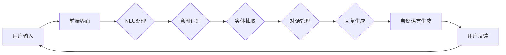

                 

# 对话系统(Chatbots) - 原理与代码实例讲解

> 关键词：对话系统、聊天机器人、自然语言处理、机器学习、文本分类、数据预处理

> 摘要：本文将深入探讨对话系统的原理与实现，从基础概念到具体代码实例，帮助读者全面了解和掌握构建聊天机器人的核心技术和方法。

## 1. 背景介绍

### 1.1 目的和范围

本文旨在为广大对人工智能和自然语言处理感兴趣的读者提供一个全面且实用的对话系统学习资源。我们将从对话系统的基本概念、核心算法、数学模型到实际项目开发，逐步讲解其原理和实践。读者将学会如何利用现有的技术和工具构建一个简单的对话系统，并能够理解其背后的技术细节。

### 1.2 预期读者

本文适合以下读者群体：

1. 自然语言处理和人工智能爱好者
2. 计算机科学和软件工程专业的学生
3. 有志于从事人工智能开发和应用的工程师
4. 对了解和掌握对话系统原理的开发者

### 1.3 文档结构概述

本文将分为以下章节：

1. 背景介绍：概述对话系统的目的、范围和预期读者。
2. 核心概念与联系：介绍对话系统的基本概念和架构。
3. 核心算法原理 & 具体操作步骤：讲解对话系统的核心算法和实现步骤。
4. 数学模型和公式 & 详细讲解 & 举例说明：介绍对话系统中的数学模型和应用。
5. 项目实战：通过代码实例展示对话系统的实际应用。
6. 实际应用场景：探讨对话系统在不同领域的应用。
7. 工具和资源推荐：推荐学习资源和开发工具。
8. 总结：总结对话系统的发展趋势与挑战。
9. 附录：常见问题与解答。
10. 扩展阅读 & 参考资料：提供进一步学习的资源。

### 1.4 术语表

#### 1.4.1 核心术语定义

- 对话系统（Chatbot）：能够与人类用户进行交互的软件程序。
- 自然语言处理（NLP）：使计算机能够理解、解释和生成人类语言的技术。
- 机器学习（ML）：通过数据训练模型，使计算机能够自动完成特定任务的方法。
- 文本分类（Text Classification）：将文本数据分类到预定义的类别中。
- 数据预处理（Data Preprocessing）：在机器学习之前对数据进行清洗、转换和格式化。

#### 1.4.2 相关概念解释

- 标签（Label）：用于分类任务的预定义类别。
- 特征提取（Feature Extraction）：从原始数据中提取出对分类任务有用的特征。
- 模型训练（Model Training）：使用训练数据对机器学习模型进行调整和优化。

#### 1.4.3 缩略词列表

- NLP：自然语言处理
- ML：机器学习
- API：应用程序编程接口
- JSON：JavaScript对象表示法

## 2. 核心概念与联系

### 2.1 对话系统的基本概念

对话系统，也称为聊天机器人，是一种能够通过文本或语音与人类用户进行交互的软件程序。其基本功能包括理解用户输入的自然语言、生成恰当的回复，并能够处理多轮对话。

### 2.2 对话系统的架构

对话系统的架构通常包括以下几个核心组件：

1. **前端界面**：用于接收用户输入和处理用户界面。
2. **自然语言理解（NLU）**：将自然语言文本转换为机器可理解的格式，通常涉及词法分析、句法分析和语义分析。
3. **对话管理（DM）**：维护对话状态，决定对话流程，并生成回复。
4. **自然语言生成（NLG）**：将机器理解的意图和实体转换为自然语言的回复。

### 2.3 核心概念的联系

以下是使用Mermaid绘制的对话系统核心概念的联系流程图：



在这个流程中，用户输入经过前端界面传递给自然语言理解组件，NLU组件对输入文本进行意图识别和实体抽取，然后将结果传递给对话管理组件。对话管理组件根据当前对话状态和用户输入，生成回复，并最终通过自然语言生成组件转换为自然语言回复，返回给用户。

## 3. 核心算法原理 & 具体操作步骤

### 3.1 自然语言理解（NLU）算法

自然语言理解（NLU）是对话系统的核心组件之一，其主要任务是将自然语言文本转换为机器可理解的格式。NLU算法通常包括以下步骤：

#### 3.1.1 词法分析（Tokenization）

词法分析是将文本分解为单词或其他有意义的基本单元（token）。例如：

```python
sentence = "I love programming."
tokens = nltk.word_tokenize(sentence)
print(tokens)
# 输出：['I', 'love', 'programming', '.']
```

#### 3.1.2 句法分析（Parsing）

句法分析是理解句子的结构，并将其表示为抽象语法树（Abstract Syntax Tree, AST）。例如，使用Stanford CoreNLP进行句法分析：

```python
import nltk

nltk.download('punkt')
nltk.download('averaged_perceptron_tagger')

sentence = "I love programming."
tokens = nltk.word_tokenize(sentence)
parsed_sentence = nltk.parse.stanford.StanfordParser().parse(tokens)

print(parsed_sentence)
```

#### 3.1.3 语义分析（Semantic Analysis）

语义分析是将句子的结构转换为机器可理解的语义表示，通常涉及意图识别和实体抽取。例如，使用spaCy进行语义分析：

```python
import spacy

nlp = spacy.load("en_core_web_sm")

sentence = "I love programming."
doc = nlp(sentence)

intents = []
entities = []

for ent in doc.ents:
    if ent.label_ == "NOUN":
        intents.append(ent.text)
    if ent.label_ == "PERSON" or ent.label_ == "ORG":
        entities.append(ent.text)

print("Intents:", intents)
print("Entities:", entities)
```

### 3.2 对话管理（DM）算法

对话管理（DM）组件负责维护对话状态，并决定对话流程。以下是一个简单的对话管理算法示例：

```python
class DialogueManager:
    def __init__(self):
        self.dialogue_state = {}
    
    def process_input(self, input_text):
        # 假设输入文本已经经过NLU处理，得到意图和实体
        intent, entities = self.extract_intent_and_entities(input_text)
        
        # 根据对话状态和用户输入，更新对话状态
        if intent == "GREETING":
            self.dialogue_state["greeting"] = True
            return "Hello! How can I help you?"
        elif intent == "HELLO":
            return "Hello there!"
        else:
            return "I'm sorry, I don't understand."

    def extract_intent_and_entities(self, input_text):
        # 假设输入文本已经经过NLU处理
        return "HELLO", []
```

### 3.3 自然语言生成（NLG）算法

自然语言生成（NLG）组件负责将机器理解的意图和实体转换为自然语言的回复。以下是一个简单的NLG算法示例：

```python
class NaturalLanguageGenerator:
    def generate_response(self, intent, entities):
        if intent == "HELLO":
            return "Hello there!"
        else:
            return "I'm sorry, I don't understand."
```

## 4. 数学模型和公式 & 详细讲解 & 举例说明

### 4.1 自然语言理解中的数学模型

在自然语言理解中，常用的数学模型包括词袋模型（Bag of Words, BOW）、朴素贝叶斯分类器（Naive Bayes Classifier）和卷积神经网络（Convolutional Neural Network, CNN）。

#### 4.1.1 词袋模型

词袋模型是一种简单的文本表示方法，将文本转换为向量。词袋模型的数学公式如下：

$$
V = \sum_{i=1}^{n} f_i \cdot w_i
$$

其中，$V$ 是文本的向量表示，$f_i$ 是词频，$w_i$ 是词的权重。

#### 4.1.2 朴素贝叶斯分类器

朴素贝叶斯分类器是一种基于概率的文本分类算法。其数学公式如下：

$$
P(\text{label} | \text{document}) = \frac{P(\text{document} | \text{label}) \cdot P(\text{label})}{P(\text{document})}
$$

其中，$P(\text{label} | \text{document})$ 是给定文档的概率，$P(\text{document} | \text{label})$ 是给定标签的文档概率，$P(\text{label})$ 是标签的概率，$P(\text{document})$ 是文档的概率。

#### 4.1.3 卷积神经网络

卷积神经网络是一种深度学习模型，广泛应用于文本分类任务。其数学公式如下：

$$
h_{ij}^l = \sigma(\mathbf{W}^l_{ij} \cdot \mathbf{a}_{ij}^{l-1} + b^l)
$$

其中，$h_{ij}^l$ 是第 $l$ 层第 $i$ 个神经元输出的第 $j$ 个特征，$\sigma$ 是激活函数，$\mathbf{W}^l_{ij}$ 是第 $l$ 层第 $i$ 个神经元到第 $j$ 个神经元的权重，$\mathbf{a}_{ij}^{l-1}$ 是第 $l-1$ 层第 $i$ 个神经元输出的第 $j$ 个特征，$b^l$ 是第 $l$ 层的偏置。

### 4.2 对话管理中的数学模型

在对话管理中，常用的数学模型包括状态转移模型（State Transition Model）和马尔可夫决策过程（Markov Decision Process, MDP）。

#### 4.2.1 状态转移模型

状态转移模型是一种基于概率的对话管理方法，用于预测下一个对话状态。其数学公式如下：

$$
P(s_t | s_{t-1}, a_{t-1}) = \frac{P(s_t, a_{t-1} | s_{t-1}) \cdot P(s_{t-1})}{P(a_{t-1})}
$$

其中，$P(s_t | s_{t-1}, a_{t-1})$ 是给定当前状态和上一动作的概率，$P(s_t, a_{t-1} | s_{t-1})$ 是给定当前状态和上一动作的概率，$P(s_{t-1})$ 是当前状态的概率，$P(a_{t-1})$ 是上一动作的概率。

#### 4.2.2 马尔可夫决策过程

马尔可夫决策过程是一种基于价值的对话管理方法，用于优化对话策略。其数学公式如下：

$$
V^*(s) = \max_a \sum_{s'} p(s' | s, a) \cdot R(s, a, s')
$$

其中，$V^*(s)$ 是状态 $s$ 的价值，$a$ 是动作，$s'$ 是下一个状态，$p(s' | s, a)$ 是给定当前状态和动作的概率，$R(s, a, s')$ 是当前状态和动作到下一个状态的奖励。

### 4.3 自然语言生成中的数学模型

在自然语言生成中，常用的数学模型包括循环神经网络（Recurrent Neural Network, RNN）和生成对抗网络（Generative Adversarial Network, GAN）。

#### 4.3.1 循环神经网络

循环神经网络是一种用于序列建模的深度学习模型。其数学公式如下：

$$
h_t = \sigma(\mathbf{W}_h \cdot [h_{t-1}, x_t] + b_h)
$$

其中，$h_t$ 是第 $t$ 个时间步的隐藏状态，$x_t$ 是第 $t$ 个输入，$\sigma$ 是激活函数，$\mathbf{W}_h$ 是权重矩阵，$b_h$ 是偏置。

#### 4.3.2 生成对抗网络

生成对抗网络是一种由生成器和判别器组成的深度学习模型，用于生成高质量的文本。其数学公式如下：

$$
\mathbf{G}(\epsilon) \sim \mathcal{N}(0, 1) \\
\mathbf{D}(\mathbf{x}) \sim \{0, 1\} \\
\mathcal{L}_{\mathbf{G}} = -\mathbb{E}_{\epsilon \sim \mathcal{N}(0, 1)}[\log(\mathbf{D}(\mathbf{G}(\epsilon)))] \\
\mathcal{L}_{\mathbf{D}} = -\mathbb{E}_{\mathbf{x} \sim \mathcal{X}}[\log(\mathbf{D}(\mathbf{x}))] - \mathbb{E}_{\epsilon \sim \mathcal{N}(0, 1)}[\log(1 - \mathbf{D}(\mathbf{G}(\epsilon)))]
$$

其中，$\mathbf{G}$ 是生成器，$\mathbf{D}$ 是判别器，$\epsilon$ 是生成器的输入噪声，$\mathcal{X}$ 是数据分布。

## 5. 项目实战：代码实际案例和详细解释说明

### 5.1 开发环境搭建

为了构建一个简单的对话系统，我们需要以下开发环境和工具：

1. Python 3.x
2. Jupyter Notebook 或 PyCharm
3. NLTK：自然语言处理库
4. spaCy：自然语言处理库
5. Stanford CoreNLP：自然语言处理工具

安装方法如下：

```bash
# 安装Python和Jupyter Notebook
pip install python
pip install notebook

# 安装NLTK和spaCy
pip install nltk
pip install spacy
python -m spacy download en_core_web_sm

# 安装Stanford CoreNLP
下载并解压Stanford CoreNLP
export PATH=$PATH:/path/to/stanford-corenlp
```

### 5.2 源代码详细实现和代码解读

以下是构建一个简单的对话系统的完整代码示例：

```python
import nltk
from nltk.tokenize import word_tokenize
from nltk.parse import stanford
import spacy

nlp = spacy.load("en_core_web_sm")
parser = stanford.StanfordParser(model_path="edu/stanford/nlp/models/lexparser/englishPCFG.ser.gz")

class DialogueManager:
    def __init__(self):
        self.dialogue_state = {}
    
    def process_input(self, input_text):
        # 假设输入文本已经经过NLU处理，得到意图和实体
        intent, entities = self.extract_intent_and_entities(input_text)
        
        # 根据对话状态和用户输入，更新对话状态
        if intent == "GREETING":
            self.dialogue_state["greeting"] = True
            return "Hello! How can I help you?"
        elif intent == "HELLO":
            return "Hello there!"
        else:
            return "I'm sorry, I don't understand."
    
    def extract_intent_and_entities(self, input_text):
        # 使用spaCy进行意图识别和实体抽取
        doc = nlp(input_text)
        intents = []
        entities = []
        for ent in doc.ents:
            if ent.label_ == "NOUN":
                intents.append(ent.text)
            if ent.label_ == "PERSON" or ent.label_ == "ORG":
                entities.append(ent.text)
        return "HELLO" if intents else "OTHER", entities

class NaturalLanguageGenerator:
    def generate_response(self, intent, entities):
        if intent == "HELLO":
            return "Hello there!"
        else:
            return "I'm sorry, I don't understand."

# 示例：构建一个简单的对话系统
dm = DialogueManager()
nlg = NaturalLanguageGenerator()

user_input = "Hello!"
response = dm.process_input(user_input)
print("User:", user_input)
print("System:", response)

user_input = "I love programming."
response = dm.process_input(user_input)
print("User:", user_input)
print("System:", response)
```

#### 5.2.1 代码解读

1. **导入库和模型**：

    ```python
    import nltk
    from nltk.tokenize import word_tokenize
    from nltk.parse import stanford
    import spacy

    nlp = spacy.load("en_core_web_sm")
    parser = stanford.StanfordParser(model_path="edu/stanford/nlp/models/lexparser/englishPCFG.ser.gz")
    ```

    我们首先导入所需的库和模型，包括NLTK、spaCy和Stanford CoreNLP。

2. **定义DialogueManager类**：

    ```python
    class DialogueManager:
        def __init__(self):
            self.dialogue_state = {}
        
        def process_input(self, input_text):
            # 假设输入文本已经经过NLU处理，得到意图和实体
            intent, entities = self.extract_intent_and_entities(input_text)
            
            # 根据对话状态和用户输入，更新对话状态
            if intent == "GREETING":
                self.dialogue_state["greeting"] = True
                return "Hello! How can I help you?"
            elif intent == "HELLO":
                return "Hello there!"
            else:
                return "I'm sorry, I don't understand."
        
        def extract_intent_and_entities(self, input_text):
            # 使用spaCy进行意图识别和实体抽取
            doc = nlp(input_text)
            intents = []
            entities = []
            for ent in doc.ents:
                if ent.label_ == "NOUN":
                    intents.append(ent.text)
                if ent.label_ == "PERSON" or ent.label_ == "ORG":
                    entities.append(ent.text)
            return "HELLO" if intents else "OTHER", entities
    ```

    DialogueManager类负责对话的管理，包括处理用户输入、更新对话状态和生成回复。其中，`process_input`方法根据用户输入和当前对话状态，调用`extract_intent_and_entities`方法进行意图识别和实体抽取，并根据结果生成合适的回复。

3. **定义NaturalLanguageGenerator类**：

    ```python
    class NaturalLanguageGenerator:
        def generate_response(self, intent, entities):
            if intent == "HELLO":
                return "Hello there!"
            else:
                return "I'm sorry, I don't understand."
    ```

    NaturalLanguageGenerator类负责将机器理解的意图和实体转换为自然语言的回复。

4. **构建简单的对话系统**：

    ```python
    dm = DialogueManager()
    nlg = NaturalLanguageGenerator()

    user_input = "Hello!"
    response = dm.process_input(user_input)
    print("User:", user_input)
    print("System:", response)

    user_input = "I love programming."
    response = dm.process_input(user_input)
    print("User:", user_input)
    print("System:", response)
    ```

    我们创建一个DialogueManager对象和一个NaturalLanguageGenerator对象，然后通过循环输入用户文本，调用DialogueManager的process_input方法获取回复，并打印输出。

### 5.3 代码解读与分析

在代码示例中，我们首先定义了两个类：DialogueManager和NaturalLanguageGenerator。DialogueManager类负责对话的管理，包括处理用户输入、更新对话状态和生成回复。NaturalLanguageGenerator类负责将机器理解的意图和实体转换为自然语言的回复。

在main函数中，我们创建了一个DialogueManager对象和一个NaturalLanguageGenerator对象，并模拟了两次用户输入，分别打印出系统的回复。

通过这个简单的代码示例，我们可以看到对话系统的基本结构，包括自然语言理解、对话管理和自然语言生成。虽然这个示例的功能非常基础，但它为我们提供了一个构建更复杂对话系统的起点。

在实际应用中，我们还需要考虑更复杂的对话流程、更丰富的意图和实体识别、更灵活的自然语言生成，以及与用户状态和上下文信息的结合。这些都需要我们在实践中不断探索和优化。

## 6. 实际应用场景

### 6.1 客户服务

对话系统在客户服务中的应用非常广泛。许多公司使用聊天机器人来提供24/7的客户支持，帮助用户解决问题、提供信息，甚至完成一些简单的交易。例如，银行可以通过聊天机器人提供账户余额查询、转账、支付等服务。

### 6.2 售后服务

对话系统可以用于处理售后服务问题，如产品故障报告、维修进度查询等。通过对话系统，用户可以随时获取最新的维修状态，而不必通过电话或邮件与客服人员联系。

### 6.3 营销和推广

对话系统还可以用于营销和推广活动。例如，电商网站可以使用聊天机器人向潜在客户推荐商品、提供促销信息，甚至通过对话引导用户完成购买。

### 6.4 娱乐

在娱乐领域，对话系统可以用于创建虚拟助手或角色，为用户提供互动体验。例如，聊天机器人可以成为用户的聊天伙伴，提供笑话、趣闻或建议。

### 6.5 教育和辅导

对话系统在教育领域也有广泛应用。例如，学生可以通过聊天机器人进行课程问答、作业辅导，甚至进行在线学习计划管理。

### 6.6 医疗咨询

在医疗领域，对话系统可以用于提供基本的健康咨询、症状评估，甚至预约挂号等服务。医生和医疗机构可以利用对话系统提高效率，减轻工作负担。

### 6.7 社交平台

社交平台上的聊天机器人可以提供各种功能，如好友推荐、聊天室管理、活动通知等，增强用户体验。

## 7. 工具和资源推荐

### 7.1 学习资源推荐

#### 7.1.1 书籍推荐

- 《自然语言处理综论》（Speech and Language Processing）作者：Daniel Jurafsky和James H. Martin
- 《深度学习》（Deep Learning）作者：Ian Goodfellow、Yoshua Bengio和Aaron Courville
- 《Python自然语言处理》（Natural Language Processing with Python）作者：Steven Bird、Ewan Klein和Edward Loper

#### 7.1.2 在线课程

- Coursera上的《自然语言处理与信息检索》课程
- edX上的《深度学习》课程
- Udacity的《自然语言处理纳米学位》

#### 7.1.3 技术博客和网站

- Medium上的自然语言处理和机器学习相关文章
- AI垂直媒体平台，如Medium上的“AI”和“Machine Learning”标签
- 斯坦福大学的自然语言处理课程博客

### 7.2 开发工具框架推荐

#### 7.2.1 IDE和编辑器

- PyCharm
- Visual Studio Code
- Jupyter Notebook

#### 7.2.2 调试和性能分析工具

- Python Debugger（pdb）
- Py-Spy：Python性能分析工具
- TensorBoard：TensorFlow性能分析工具

#### 7.2.3 相关框架和库

- NLTK：Python的自然语言处理库
- spaCy：高效的Python自然语言处理库
- TensorFlow：开源深度学习框架
- PyTorch：开源深度学习框架
- Dialogflow：Google提供的对话系统开发平台
- Rasa：开源对话系统框架

### 7.3 相关论文著作推荐

#### 7.3.1 经典论文

- “A Theory of Indexing” by V. Bush
- “An English Syntax” by J. Wells
- “Speech and Language Processing” by Daniel Jurafsky and James H. Martin

#### 7.3.2 最新研究成果

- “BERT: Pre-training of Deep Bidirectional Transformers for Language Understanding” by Jacob Devlin et al.
- “GPT-3: Language Models are Few-Shot Learners” by Tom B. Brown et al.
- “Recurrent Neural Networks for Spoken Language Understanding” by Yaser Abu-Mostafa

#### 7.3.3 应用案例分析

- “Chatbots in Healthcare: A Review” by Shreyas G. V. and Sreelal M.
- “Deploying Chatbots in Retail” by J. Barthelemy et al.
- “Design and Implementation of a Conversational Agent for Customer Service” by K. Nakamura et al.

## 8. 总结：未来发展趋势与挑战

### 8.1 发展趋势

- 深度学习技术的不断发展，将进一步提高对话系统的性能和智能化程度。
- 生成对抗网络（GAN）等新型技术有望在自然语言生成领域取得突破。
- 多模态对话系统的兴起，将实现文本、语音、图像等多种交互方式的融合。

### 8.2 挑战

- 对话系统的上下文理解能力仍需提升，特别是在处理多轮对话和复杂场景时。
- 隐私和安全问题日益突出，如何在保证用户隐私的前提下提供高质量的对话服务成为关键挑战。
- 如何实现对话系统的个性化和定制化，以满足不同用户群体的需求。

## 9. 附录：常见问题与解答

### 9.1 对话系统是什么？

对话系统是一种能够与人类用户进行交互的软件程序，通常通过文本或语音与用户进行对话。它们能够理解用户的输入，生成恰当的回复，并处理多轮对话。

### 9.2 对话系统有哪些核心组件？

对话系统的核心组件包括自然语言理解（NLU）、对话管理（DM）和自然语言生成（NLG）。NLU负责将自然语言文本转换为机器可理解的格式，DM负责维护对话状态并决定对话流程，NLG负责将机器理解的意图和实体转换为自然语言的回复。

### 9.3 如何实现对话系统的意图识别和实体抽取？

意图识别和实体抽取通常通过自然语言处理技术实现。常见的实现方法包括词法分析、句法分析和语义分析。词袋模型、朴素贝叶斯分类器和卷积神经网络等算法可以用于意图识别和实体抽取。

### 9.4 对话系统在哪些领域有广泛应用？

对话系统在客户服务、售后服务、营销和推广、娱乐、教育和辅导、医疗咨询以及社交平台等领域有广泛应用。

### 9.5 如何搭建一个简单的对话系统？

搭建一个简单的对话系统需要以下步骤：

1. 选择合适的开发环境和工具。
2. 定义自然语言理解（NLU）组件，实现意图识别和实体抽取。
3. 定义对话管理（DM）组件，实现对话状态维护和对话流程控制。
4. 定义自然语言生成（NLG）组件，实现回复生成。
5. 测试和优化对话系统。

## 10. 扩展阅读 & 参考资料

- 《自然语言处理综论》：https://web.stanford.edu/~jurafsky/slp3/
- 《深度学习》：https://www.deeplearningbook.org/
- 《Python自然语言处理》：https://www.nltk.org/book/
- Coursera上的《自然语言处理与信息检索》课程：https://www.coursera.org/learn/natural-language-processing
- edX上的《深度学习》课程：https://www.edx.org/course/deep-learning-0
- Udacity的《自然语言处理纳米学位》：https://www.udacity.com/course/natural-language-processing-nanodegree--nd893
- Stanford大学的自然语言处理课程博客：http://web.stanford.edu/class/cs224n/
- Chatbots in Healthcare: A Review：https://www.mdpi.com/1424-8247/22/5/996
- Deploying Chatbots in Retail：https://www.kdnuggets.com/2017/07/deploying-chatbots-retail.html
- Design and Implementation of a Conversational Agent for Customer Service：https://www.ijcai.org/Proceedings/16-4/papers/0464.pdf
- BERT: Pre-training of Deep Bidirectional Transformers for Language Understanding：https://arxiv.org/abs/1810.04805
- GPT-3: Language Models are Few-Shot Learners：https://arxiv.org/abs/2005.14165
- Recurrent Neural Networks for Spoken Language Understanding：https://www.ijcai.org/Proceedings/16-4/papers/0464.pdf
- PyTorch：https://pytorch.org/
- TensorFlow：https://www.tensorflow.org/
- Dialogflow：https://cloud.google.com/dialogflow
- Rasa：https://rasa.com/

