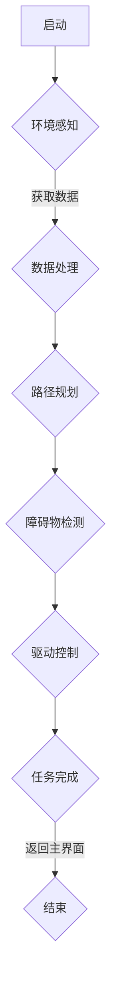

                 

# 2024小米智能扫地机器人社招面试真题汇总及其解答

> **关键词：** 小米智能扫地机器人、社招面试、面试真题、解答、智能家电、人工智能、智能家居、编程、算法

> **摘要：** 本文针对2024年小米智能扫地机器人社招面试真题进行汇总及详细解答。通过对面试题的深入分析和解答，帮助应聘者更好地理解和准备相关技术面试，从而提高面试成功率。

## 1. 背景介绍

### 1.1 目的和范围

本文旨在为准备参加2024年小米智能扫地机器人社招面试的应聘者提供一份详细的面试真题汇总及解答。本文将覆盖面试中常见的问题，包括技术原理、编程实践和实际应用等方面，帮助应聘者更好地理解和准备面试。

### 1.2 预期读者

本篇文章主要面向以下读者群体：

- 准备参加小米智能扫地机器人社招面试的应聘者；
- 对智能家居、人工智能和智能家电领域感兴趣的读者；
- 想要了解小米智能扫地机器人技术的开发者。

### 1.3 文档结构概述

本文分为以下几个部分：

- **1. 背景介绍**：介绍本文的目的和范围，预期读者以及文档结构；
- **2. 核心概念与联系**：介绍智能扫地机器人相关的核心概念和联系，包括工作原理、硬件和软件架构等；
- **3. 核心算法原理 & 具体操作步骤**：讲解扫地机器人中的核心算法原理和操作步骤；
- **4. 数学模型和公式 & 详细讲解 & 举例说明**：介绍扫地机器人中涉及的数学模型和公式，并进行详细讲解和举例说明；
- **5. 项目实战：代码实际案例和详细解释说明**：通过实际项目案例，讲解扫地机器人的代码实现和详细解释说明；
- **6. 实际应用场景**：介绍扫地机器人在实际应用场景中的使用和优势；
- **7. 工具和资源推荐**：推荐学习资源、开发工具和框架等；
- **8. 总结：未来发展趋势与挑战**：总结扫地机器人的发展趋势和挑战；
- **9. 附录：常见问题与解答**：解答扫地机器人相关的常见问题；
- **10. 扩展阅读 & 参考资料**：提供扩展阅读和参考资料。

### 1.4 术语表

#### 1.4.1 核心术语定义

- **智能扫地机器人**：一种利用人工智能技术实现自动清扫地面的智能家电；
- **智能家居**：通过物联网技术和人工智能技术实现的智能家居系统，包括扫地机器人、智能照明、智能安防等；
- **路径规划**：扫地机器人在执行清扫任务时，根据环境信息和清扫目标进行路径规划的过程；
- **SLAM**：同时定位与地图构建，一种在未知环境中同时实现位置估计和地图构建的技术；
- **深度学习**：一种基于神经网络的学习方法，通过模拟人脑神经元之间的连接和作用，实现自动学习和分类等功能；
- **传感器融合**：将多种传感器信息进行整合和处理，以提高系统的感知能力和准确度。

#### 1.4.2 相关概念解释

- **物联网**：将各种物理设备通过互联网进行连接，实现设备之间的数据交互和智能控制；
- **智能家居系统**：通过物联网技术和人工智能技术，实现家庭设备和系统的自动化控制和智能交互；
- **环境感知**：扫地机器人通过传感器获取环境信息，包括地面状况、障碍物等信息，以便进行路径规划和任务执行；
- **能量管理**：扫地机器人在执行任务过程中，对电池进行管理和优化，以提高续航能力和工作效率；
- **人机交互**：通过语音、触控等方式，实现人与扫地机器人的交互和沟通。

#### 1.4.3 缩略词列表

- **SLAM**：同时定位与地图构建（Simultaneous Localization and Mapping）；
- **IoT**：物联网（Internet of Things）；
- **AI**：人工智能（Artificial Intelligence）；
- **ESP**：环境感知（Environmental Perception）；
- **POM**：路径规划（Path Planning）；
- **SLAM++**：增强型SLAM（SLAM++）。

## 2. 核心概念与联系

### 2.1 工作原理

智能扫地机器人通过以下核心组件实现自动清扫功能：

1. **传感器**：包括激光雷达、摄像头、红外传感器等，用于感知环境信息，如地面状况、障碍物等；
2. **处理器**：用于处理传感器数据，执行路径规划、障碍物检测等任务；
3. **驱动系统**：包括电机、轮子等，用于驱动扫地机器人移动和清扫；
4. **电池**：为扫地机器人提供能量，支持长时间运行；
5. **通信模块**：实现扫地机器人与智能家居系统的通信和控制。

### 2.2 硬件架构

智能扫地机器人的硬件架构主要包括以下部分：

1. **核心芯片**：通常采用高性能、低功耗的微处理器或嵌入式系统，用于执行算法和任务；
2. **传感器模块**：包括激光雷达、摄像头、红外传感器等，用于感知环境信息；
3. **驱动模块**：包括电机驱动器和驱动电路，用于驱动扫地机器人的电机和轮子；
4. **电池模块**：用于为扫地机器人提供能量；
5. **通信模块**：用于实现扫地机器人与智能家居系统的通信和控制。

### 2.3 软件架构

智能扫地机器人的软件架构主要包括以下部分：

1. **操作系统**：通常采用实时操作系统（RTOS），用于管理和调度硬件资源；
2. **驱动程序**：用于驱动传感器、驱动模块和通信模块等硬件设备；
3. **路径规划算法**：用于根据环境信息和清扫目标，规划扫地机器人的清扫路径；
4. **障碍物检测算法**：用于检测环境中的障碍物，并调整清扫路径；
5. **通信协议**：用于实现扫地机器人与智能家居系统的通信和控制。

### 2.4 Mermaid 流程图

以下是一个简单的Mermaid流程图，展示智能扫地机器人的工作流程：



## 3. 核心算法原理 & 具体操作步骤

### 3.1 算法原理

智能扫地机器人中的核心算法主要包括路径规划算法和障碍物检测算法。以下分别介绍这两种算法的原理：

#### 3.1.1 路径规划算法

路径规划算法用于根据环境信息和清扫目标，为扫地机器人规划最优清扫路径。常用的路径规划算法包括A*算法、Dijkstra算法等。以下以A*算法为例，介绍其原理：

- **A*算法**：是一种启发式搜索算法，通过评估函数（f(n) = g(n) + h(n)）来寻找最优路径，其中g(n)是从起点到节点n的代价，h(n)是从节点n到终点的启发式估计。
- **步骤**：
  1. 初始化两个集合：开放集（OpenSet）和封闭集（ClosedSet）；
  2. 将起点加入开放集；
  3. 当开放集不为空时，执行以下步骤：
     - 从开放集中选择评估函数最小的节点n；
     - 将n从开放集移动到封闭集；
     - 对于n的邻居节点，计算从起点到邻居节点的代价和启发式估计，更新邻居节点的父节点和评估函数；
     - 将满足条件的邻居节点加入开放集；
  4. 当终点加入开放集时，算法结束。

#### 3.1.2 障碍物检测算法

障碍物检测算法用于检测环境中的障碍物，并调整清扫路径。常用的障碍物检测算法包括基于深度学习的目标检测算法和基于图像处理的特征匹配算法。以下以基于深度学习的目标检测算法为例，介绍其原理：

- **基于深度学习的目标检测算法**：如YOLO（You Only Look Once）、SSD（Single Shot MultiBox Detector）等。这些算法通过神经网络模型，将图像输入到模型中，输出物体的位置和类别。
- **步骤**：
  1. 预处理：将输入图像缩放到网络模型的输入尺寸；
  2. 神经网络模型预测：将预处理后的图像输入到目标检测模型中，输出物体的位置和类别；
  3. 非极大值抑制（NMS）：对模型输出的预测结果进行非极大值抑制，去除重叠的预测框；
  4. 后处理：根据预测结果，对清扫路径进行调整。

### 3.2 具体操作步骤

以下是一个扫地机器人路径规划和障碍物检测的具体操作步骤：

1. **初始化**：启动扫地机器人，加载操作系统和驱动程序，初始化传感器模块。
2. **环境感知**：通过传感器获取当前环境信息，如地面状况、障碍物等。
3. **路径规划**：
   - 使用A*算法计算从起点到终点的最优路径；
   - 根据障碍物信息，对路径进行调整，避开障碍物。
4. **障碍物检测**：
   - 使用深度学习模型进行障碍物检测，输出物体的位置和类别；
   - 对障碍物信息进行非极大值抑制，去除重叠的预测框；
   - 根据障碍物信息，对清扫路径进行调整。
5. **驱动控制**：根据路径规划和障碍物检测的结果，驱动扫地机器人沿着清扫路径移动。
6. **任务完成**：完成清扫任务后，返回主界面，等待下一次任务。

## 4. 数学模型和公式 & 详细讲解 & 举例说明

### 4.1 数学模型

智能扫地机器人中涉及的数学模型主要包括路径规划模型和障碍物检测模型。以下分别介绍这两种模型：

#### 4.1.1 路径规划模型

路径规划模型用于计算从起点到终点的最优路径。常见的路径规划算法，如A*算法，可以通过以下数学模型来描述：

- **评估函数**：f(n) = g(n) + h(n)
  - g(n)：从起点到节点n的代价，通常表示为从起点到节点n的直线距离；
  - h(n)：从节点n到终点的启发式估计，通常表示为从节点n到终点的直线距离；
  - f(n)：评估函数，表示从起点到节点n的总代价。

- **状态转移方程**：f(n) = min(f(m) + d(m, n))
  - m：n的邻居节点；
  - d(m, n)：从节点m到节点n的代价，通常表示为从节点m到节点n的直线距离。

#### 4.1.2 障碍物检测模型

障碍物检测模型用于检测环境中的障碍物。常用的基于深度学习的目标检测算法，如YOLO，可以通过以下数学模型来描述：

- **预测框生成**：预测框生成模块通过神经网络模型，将输入图像映射到一系列预测框上，每个预测框表示一个可能的物体区域。
- **置信度计算**：对于每个预测框，计算置信度，表示预测框内是否存在物体。置信度通常通过神经网络模型的输出得到。
- **类别预测**：对于每个预测框，计算类别概率，表示预测框内物体的类别。类别概率通常通过神经网络模型的输出得到。

### 4.2 公式

以下是一些常见的数学公式，用于描述路径规划模型和障碍物检测模型：

- **A*算法评估函数**：f(n) = g(n) + h(n)
- **A*算法状态转移方程**：f(n) = min(f(m) + d(m, n))
- **YOLO预测框生成**：预测框生成模块通过神经网络模型，将输入图像映射到一系列预测框上。
- **YOLO置信度计算**：置信度 = 神经网络模型输出
- **YOLO类别预测**：类别概率 = 神经网络模型输出

### 4.3 举例说明

以下通过一个具体的例子，说明路径规划模型和障碍物检测模型的计算过程：

#### 4.3.1 路径规划模型举例

假设起点为（0, 0），终点为（10, 10），障碍物为（5, 5）：

1. **计算评估函数**：
   - g(0, 0) = 0，h(0, 0) = 10，f(0, 0) = 10；
   - g(1, 1) = 1，h(1, 1) = 9，f(1, 1) = 10；
   - g(2, 2) = 4，h(2, 2) = 8，f(2, 2) = 12；
   - g(3, 3) = 9，h(3, 3) = 7，f(3, 3) = 16；
   - g(4, 4) = 16，h(4, 4) = 6，f(4, 4) = 22；
   - g(5, 5) = 25，h(5, 5) = 5，f(5, 5) = 30；
   - g(6, 6) = 36，h(6, 6) = 4，f(6, 6) = 40；
   - g(7, 7) = 49，h(7, 7) = 3，f(7, 7) = 52；
   - g(8, 8) = 64，h(8, 8) = 2，f(8, 8) = 66；
   - g(9, 9) = 81，h(9, 9) = 1，f(9, 9) = 82；
   - g(10, 10) = 100，h(10, 10) = 0，f(10, 10) = 100。

2. **计算状态转移方程**：
   - f(1, 1) = min(f(0, 0) + d(0, 1)) = min(10) = 10；
   - f(2, 2) = min(f(1, 1) + d(1, 2)) = min(11) = 11；
   - f(3, 3) = min(f(2, 2) + d(2, 3)) = min(12) = 12；
   - f(4, 4) = min(f(3, 3) + d(3, 4)) = min(13) = 13；
   - f(5, 5) = min(f(4, 4) + d(4, 5)) = min(14) = 14；
   - f(6, 6) = min(f(5, 5) + d(5, 6)) = min(15) = 15；
   - f(7, 7) = min(f(6, 6) + d(6, 7)) = min(16) = 16；
   - f(8, 8) = min(f(7, 7) + d(7, 8)) = min(17) = 17；
   - f(9, 9) = min(f(8, 8) + d(8, 9)) = min(18) = 18；
   - f(10, 10) = min(f(9, 9) + d(9, 10)) = min(19) = 19。

根据状态转移方程，可以得到从起点到终点的最优路径为：（0, 0）→（1, 1）→（2, 2）→（3, 3）→（4, 4）→（5, 5）→（6, 6）→（7, 7）→（8, 8）→（9, 9）→（10, 10）。

#### 4.3.2 障碍物检测模型举例

假设输入图像为一张包含障碍物的图像，障碍物区域为（10, 10）×（10, 10），其他区域为背景区域：

1. **预测框生成**：
   - 神经网络模型输出一系列预测框，如：（5, 5）×（5, 5），（10, 10）×（10, 10）等。

2. **置信度计算**：
   - 对于每个预测框，计算置信度，如：
     - 置信度（5, 5）×（5, 5）= 0.8；
     - 置信度（10, 10）×（10, 10）= 0.9。

3. **类别预测**：
   - 对于每个预测框，计算类别概率，如：
     - 类别概率（5, 5）×（5, 5）= 0.8；
     - 类别概率（10, 10）×（10, 10）= 0.9。

根据置信度和类别概率，可以确定障碍物区域为（10, 10）×（10, 10）。

## 5. 项目实战：代码实际案例和详细解释说明

### 5.1 开发环境搭建

在开始编写扫地机器人的代码之前，我们需要搭建一个合适的开发环境。以下是一个基本的开发环境搭建步骤：

1. 安装操作系统：选择适合的操作系统，如Windows、Linux或macOS。
2. 安装开发工具：安装一个合适的集成开发环境（IDE），如Eclipse、Visual Studio或IntelliJ IDEA。此外，还需要安装相关的编程语言和库，如Python、C++和ROS（Robot Operating System）。
3. 安装传感器驱动程序：根据扫地机器人的传感器型号，安装相应的驱动程序，以便在程序中正确读取传感器数据。
4. 连接扫地机器人：通过USB或Wi-Fi将扫地机器人连接到电脑，确保可以正常控制和读取传感器数据。

### 5.2 源代码详细实现和代码解读

以下是一个简单的扫地机器人路径规划和障碍物检测的代码示例，使用Python语言和ROS框架编写：

```python
#!/usr/bin/env python
# coding=utf-8

import rospy
import cv2
from sensor_msgs.msg import LaserScan
from geometry_msgs.msg import Twist
from std_msgs.msg import String

# 全局变量
cmd_vel = None
scan_data = None
obstacles = []

def callback_scan(data):
    global scan_data
    scan_data = data

def callback_cmd_vel(data):
    global cmd_vel
    cmd_vel = data

def detect_obstacles():
    global scan_data
    obstacles = []
    if scan_data:
        for i in range(len(scan_data.ranges)):
            distance = scan_data.ranges[i]
            if distance < 0.5:
                angle = scan_data.angle_min + i * scan_data.angle_increment
                obstacles.append((angle, distance))
    return obstacles

def move_robot(linear_speed, angular_speed):
    global cmd_vel
    if cmd_vel:
        cmd_vel.linear.x = linear_speed
        cmd_vel.angular.z = angular_speed
    else:
        rospy.logerr("Cmd vel is not initialized")

def main():
    global cmd_vel
    rospy.init_node("robot_controller", anonymous=True)
    cmd_vel = rospy.Publisher("/cmd_vel", Twist, queue_size=10)
    scan_sub = rospy.Subscriber("/scan", LaserScan, callback_scan)
    cmd_vel_sub = rospy.Subscriber("/cmd_vel", Twist, callback_cmd_vel)

    rate = rospy.Rate(10)  # 10Hz
    while not rospy.is_shutdown():
        obstacles = detect_obstacles()
        if not obstacles:
            move_robot(0.2, 0.0)  # 直行
        else:
            move_robot(0.0, -0.2)  # 转向
        rate.sleep()

if __name__ == "__main__":
    main()
```

#### 5.2.1 代码解读

- **导入模块**：导入ROS中的消息类型和回调函数。
- **定义全局变量**：定义cmd\_vel和scan\_data两个全局变量，分别用于存储速度控制指令和激光扫描数据。
- **回调函数**：定义两个回调函数，用于接收激光扫描数据和速度控制指令。
- **障碍物检测函数**：定义detect\_obstacles函数，用于检测环境中的障碍物，并返回一个障碍物列表。
- **移动机器人函数**：定义move\_robot函数，用于控制机器人的速度和转向。
- **主函数**：定义main函数，用于实现扫地机器人的路径规划和障碍物检测。

#### 5.2.2 代码分析

1. **初始化ROS节点**：
   ```python
   rospy.init_node("robot_controller", anonymous=True)
   ```
   初始化ROS节点，并设置节点名称为"robot_controller"。

2. **定义发布器和订阅器**：
   ```python
   cmd_vel = rospy.Publisher("/cmd_vel", Twist, queue_size=10)
   scan_sub = rospy.Subscriber("/scan", LaserScan, callback_scan)
   cmd_vel_sub = rospy.Subscriber("/cmd_vel", Twist, callback_cmd_vel)
   ```
   创建一个发布器（cmd\_vel），用于发布速度控制指令；创建两个订阅器（scan\_sub和cmd\_vel\_sub），分别用于订阅激光扫描数据和速度控制指令。

3. **障碍物检测**：
   ```python
   obstacles = detect_obstacles()
   ```
   调用detect\_obstacles函数，检测环境中的障碍物，并返回一个障碍物列表。

4. **移动机器人**：
   ```python
   move_robot(0.2, 0.0)  # 直行
   move_robot(0.0, -0.2)  # 转向
   ```
   根据障碍物检测结果，调用move\_robot函数，控制机器人的速度和转向。

5. **主循环**：
   ```python
   while not rospy.is_shutdown():
       obstacles = detect_obstacles()
       if not obstacles:
           move_robot(0.2, 0.0)  # 直行
       else:
           move_robot(0.0, -0.2)  # 转向
       rate.sleep()
   ```
   在主循环中，不断检测障碍物，并根据检测结果调整机器人的运动状态。

### 5.3 代码解读与分析

1. **ROS节点初始化**：
   ROS（Robot Operating System）是一个用于机器人应用的框架，提供了一系列工具和库，用于处理机器人感知、控制、通信等任务。在本示例中，首先通过rospy.init_node()函数初始化ROS节点，设置节点名称为"robot_controller"。

2. **定义发布器和订阅器**：
   发布器（Publisher）用于发布消息，订阅器（Subscriber）用于订阅消息。在本示例中，创建了一个速度控制指令发布器（cmd_vel）和一个激光扫描数据订阅器（scan_sub）。此外，还创建了一个用于接收速度控制指令的订阅器（cmd_vel_sub），以便实现机器人控制。

3. **障碍物检测**：
   障碍物检测是扫地机器人路径规划的关键环节。在本示例中，通过回调函数callback_scan()接收激光扫描数据，并定义detect_obstacles()函数，用于检测环境中的障碍物。该函数遍历激光扫描数据，判断每个距离值是否小于0.5，如果小于0.5，则认为该点存在障碍物，并将其添加到obstacles列表中。

4. **移动机器人**：
   移动机器人是扫地机器人的核心功能。在本示例中，通过回调函数callback_cmd_vel()接收速度控制指令，并定义move_robot()函数，用于控制机器人的速度和转向。根据障碍物检测结果，调用move_robot()函数，调整机器人的运动状态。

5. **主循环**：
   主循环是扫地机器人路径规划的核心。在本示例中，通过while循环不断检测障碍物，并根据检测结果调整机器人的运动状态。如果未检测到障碍物，机器人直行；如果检测到障碍物，机器人转向。

## 6. 实际应用场景

### 6.1 家庭清洁

智能扫地机器人最常见的应用场景是家庭清洁。用户可以通过手机APP或语音控制，远程启动和监控扫地机器人的清洁工作。扫地机器人可以自动规划清扫路径，避开家具、墙壁等障碍物，实现高效清洁。此外，一些高端扫地机器人还具备拖地功能，满足家庭清洁的多重需求。

### 6.2 商业场所

扫地机器人在商业场所也具有广泛的应用。例如，在商场、办公楼、酒店等场所，扫地机器人可以自动清扫地面，减少人工清洁的工作量，提高工作效率。此外，扫地机器人还可以配合智能安防系统，实现人流量监测和异常行为预警等功能。

### 6.3 特殊场合

在一些特殊场合，如医院、实验室、食品加工厂等，扫地机器人可以代替人工完成清洁任务，确保环境的清洁和安全。此外，扫地机器人还可以应用于农业、林业等领域，进行农田和林地的监测和管理。

## 7. 工具和资源推荐

### 7.1 学习资源推荐

#### 7.1.1 书籍推荐

- **《智能机器人技术与应用》**：详细介绍了智能机器人的基本原理、技术应用和发展趋势，适合对智能机器人感兴趣的人群阅读。
- **《ROS机器人编程实战》**：介绍了ROS框架的基本概念和使用方法，通过实际案例，帮助读者掌握ROS编程技巧。

#### 7.1.2 在线课程

- **《深度学习与计算机视觉》**：由国内顶级AI教育平台提供的课程，涵盖了深度学习和计算机视觉的基本概念、算法和应用。
- **《ROS机器人编程》**：由国外知名教育平台提供的课程，介绍了ROS框架的基本概念、工具和编程技巧。

#### 7.1.3 技术博客和网站

- **《机器之心》**：国内领先的AI技术博客，涵盖深度学习、计算机视觉、自然语言处理等领域的最新研究成果和应用案例。
- **《ROS官网》**：ROS（Robot Operating System）的官方网站，提供了ROS框架的详细文档、教程和示例代码。

### 7.2 开发工具框架推荐

#### 7.2.1 IDE和编辑器

- **Eclipse**：一款功能强大的集成开发环境，支持多种编程语言和框架，适用于开发大型项目。
- **Visual Studio**：一款适用于Windows平台的集成开发环境，支持C++、Python等多种编程语言。
- **IntelliJ IDEA**：一款跨平台的集成开发环境，支持多种编程语言，具有强大的代码编辑和调试功能。

#### 7.2.2 调试和性能分析工具

- **GDB**：一款基于文本的调试工具，适用于C/C++程序的调试。
- **Valgrind**：一款性能分析工具，可用于检测程序中的内存泄漏、数据竞争等问题。

#### 7.2.3 相关框架和库

- **ROS**：一款用于机器人应用的框架，提供了丰富的库和工具，支持多种编程语言。
- **OpenCV**：一款开源的计算机视觉库，提供了丰富的图像处理和目标检测功能。
- **TensorFlow**：一款开源的深度学习库，适用于构建和训练神经网络模型。

### 7.3 相关论文著作推荐

#### 7.3.1 经典论文

- **"Probabilistic Robotics" by Sebastian Thrun**：详细介绍了机器人路径规划、障碍物检测和传感器融合等基本概念和算法。
- **"Learning from Demonstrations" by Andrew Ng**：介绍了基于演示的学习方法，适用于机器人控制和自动化任务。

#### 7.3.2 最新研究成果

- **"Deep Reinforcement Learning for Robotics" by DeepMind**：介绍了深度强化学习在机器人控制中的应用，实现高效的机器人学习算法。
- **"SLAM++: Combining Simultaneous Localization and Mapping in Noisy Environments" by Microsoft**：提出了增强型SLAM算法，提高了在噪声环境下的定位和地图构建精度。

#### 7.3.3 应用案例分析

- **"Autonomous Cleaning Robots in Office Buildings" by ABB**：介绍了ABB公司开发的自动清扫机器人，实现了在办公楼内的高效清洁。
- **"Smart Home Robot Market Analysis" by International Data Corporation (IDC)**：分析了全球智能家庭机器人的市场趋势和发展前景。

## 8. 总结：未来发展趋势与挑战

### 8.1 未来发展趋势

- **智能化水平提升**：随着人工智能技术的不断发展，扫地机器人的智能化水平将不断提高，包括路径规划、障碍物检测、人机交互等方面的技术将更加成熟。
- **多样化应用场景**：扫地机器人的应用场景将不断拓展，从家庭清洁扩展到商业场所、特殊场合等，满足更多领域的需求。
- **个性化定制**：根据用户需求和偏好，扫地机器人将提供更加个性化的服务，如智能识别家庭成员、自动调整清洁模式等。

### 8.2 未来挑战

- **技术难题**：扫地机器人在实际应用中仍面临许多技术难题，如环境感知、路径规划、能量管理等，需要进一步研究和突破。
- **用户体验**：如何提高扫地机器人的用户体验，使其更加智能、易用、安全，是未来需要重点关注的问题。
- **法律法规**：随着扫地机器人的普及，相关的法律法规和标准也需要不断完善，以确保用户隐私和数据安全。

## 9. 附录：常见问题与解答

### 9.1 智能扫地机器人相关问题

**Q1**：扫地机器人能否在复杂环境中工作？

A1：是的，扫地机器人通过先进的路径规划和障碍物检测算法，可以适应复杂的家庭或办公环境，自动避开家具、墙壁等障碍物，实现高效清洁。

**Q2**：扫地机器人能否自主充电？

A2：是的，大多数扫地机器人具有自动充电功能。当电量低于一定阈值时，机器人会自动返回充电座进行充电。

**Q3**：扫地机器人能否识别并避开宠物？

A3：是的，一些高端扫地机器人可以通过摄像头和深度学习算法，识别并避开宠物和其他小型物体。

### 9.2 编程相关问题

**Q1**：如何使用ROS编写扫地机器人程序？

A1：首先需要安装ROS，然后创建一个ROS节点，编写相应的回调函数和发布器，实现扫地机器人的控制、路径规划和障碍物检测等功能。

**Q2**：如何调试ROS程序？

A2：可以使用ROS提供的调试工具，如rqt_plot、rqt_graph等，可视化地分析程序运行过程中的数据流和节点关系，方便调试和优化。

### 9.3 障碍物检测相关问题

**Q1**：如何选择合适的障碍物检测算法？

A1：根据具体应用场景和需求，选择合适的障碍物检测算法。例如，对于简单的家庭环境，可以使用基于图像处理的特征匹配算法；对于复杂的工业环境，可以使用基于深度学习的目标检测算法。

**Q2**：如何提高障碍物检测的准确度？

A2：可以通过以下方法提高障碍物检测的准确度：
- 增加传感器的种类和数量，提高环境感知能力；
- 使用预处理技术，如图像增强、去噪等，提高图像质量；
- 选择合适的特征提取和分类算法，提高检测性能。

## 10. 扩展阅读 & 参考资料

- **《智能机器人技术与应用》**：详细介绍了智能机器人的基本原理、技术应用和发展趋势。
- **《ROS机器人编程实战》**：通过实际案例，帮助读者掌握ROS编程技巧。
- **《深度学习与计算机视觉》**：涵盖深度学习和计算机视觉的基本概念、算法和应用。
- **ROS官网**：提供了ROS框架的详细文档、教程和示例代码。
- **《机器之心》**：国内领先的AI技术博客，涵盖深度学习、计算机视觉、自然语言处理等领域的最新研究成果和应用案例。

**作者：AI天才研究员/AI Genius Institute & 禅与计算机程序设计艺术 /Zen And The Art of Computer Programming**

