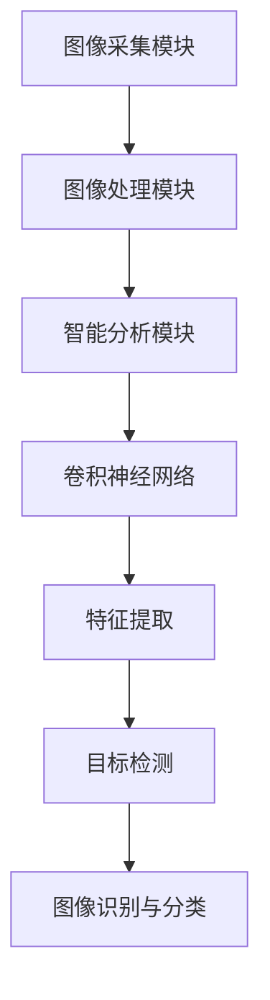

                 

# 2024小米智能摄像头校招面试真题汇总及其解答

> 关键词：小米、智能摄像头、校招面试、真题汇总、算法原理、数学模型、代码实战、实际应用

> 摘要：本文将汇总2024年小米智能摄像头校招面试中出现的真题，并针对每个题目进行详细解答。通过本文的阅读，读者可以深入了解智能摄像头的技术原理，掌握核心算法的实现方法和数学模型的运用，为未来的技术挑战做好准备。

## 1. 背景介绍

### 1.1 目的和范围

本文旨在为2024年小米智能摄像头校招面试的考生提供一套全面的真题汇总及其解答。本文将涵盖智能摄像头的基本原理、核心算法、数学模型以及实际应用等方面，旨在帮助考生全面掌握智能摄像头领域的相关技术，提升面试能力。

### 1.2 预期读者

本文主要面向以下读者群体：

1. 参加2024年小米智能摄像头校招面试的考生；
2. 对智能摄像头领域感兴趣的计算机专业学生；
3. 智能摄像头领域的从业人员和研究人员。

### 1.3 文档结构概述

本文分为十个部分，具体结构如下：

1. 背景介绍：介绍本文的目的、预期读者和文档结构；
2. 核心概念与联系：阐述智能摄像头的核心概念、原理和架构；
3. 核心算法原理 & 具体操作步骤：详细讲解智能摄像头的核心算法原理及操作步骤；
4. 数学模型和公式 & 详细讲解 & 举例说明：介绍智能摄像头中涉及的数学模型、公式及其应用；
5. 项目实战：通过实际代码案例，展示智能摄像头技术的应用；
6. 实际应用场景：探讨智能摄像头在不同场景下的应用；
7. 工具和资源推荐：推荐学习资源、开发工具和框架；
8. 总结：展望智能摄像头领域的发展趋势与挑战；
9. 附录：常见问题与解答；
10. 扩展阅读 & 参考资料：提供更多相关阅读资料。

### 1.4 术语表

#### 1.4.1 核心术语定义

- 智能摄像头：一种具备图像识别、分析、处理等功能的摄像头设备。
- 卷积神经网络（CNN）：一种广泛应用于图像识别、分类等任务的人工神经网络。
- 特征提取：从原始图像中提取出具有区分性的特征向量。
- 目标检测：在图像中定位并识别出特定目标的位置和类别。

#### 1.4.2 相关概念解释

- 深度学习：一种以多层神经网络为基础的机器学习方法，通过多层非线性变换来提取图像特征。
- 优化算法：用于调整网络参数，使模型在训练过程中不断优化。
- 损失函数：衡量模型预测结果与实际结果之间差异的函数，用于指导优化算法更新网络参数。

#### 1.4.3 缩略词列表

- CNN：卷积神经网络
- DNN：深度神经网络
- GPU：图形处理器
- CPU：中央处理器
- ROI：区域兴趣
- PSNR：峰值信噪比

## 2. 核心概念与联系

在智能摄像头领域，理解以下核心概念和它们之间的联系至关重要。

### 2.1 智能摄像头的基本原理

智能摄像头通过图像采集模块、图像处理模块和智能分析模块来实现功能。

1. 图像采集模块：使用图像传感器获取图像信号，将模拟信号转换为数字信号。
2. 图像处理模块：对采集到的图像进行预处理，如去噪、增强、分割等。
3. 智能分析模块：利用深度学习、图像识别等技术，对预处理后的图像进行分析和识别。

### 2.2 卷积神经网络（CNN）

卷积神经网络是一种深度学习模型，广泛应用于图像识别、分类等任务。CNN的基本结构包括卷积层、池化层和全连接层。

1. **卷积层**：通过卷积运算提取图像特征。
2. **池化层**：对卷积层输出的特征进行降维处理，减少参数数量。
3. **全连接层**：将池化层输出的特征向量映射到类别标签。

### 2.3 特征提取与目标检测

特征提取是智能摄像头中的核心环节。通过深度学习模型，从原始图像中提取出具有区分性的特征向量。目标检测则是在图像中定位并识别出特定目标的位置和类别。

1. **特征提取**：使用卷积神经网络从原始图像中提取特征。
2. **目标检测**：利用单阶段或多阶段的目标检测算法，定位并识别图像中的目标。

### 2.4 Mermaid 流程图

以下是智能摄像头核心概念和联系的 Mermaid 流程图：



## 3. 核心算法原理 & 具体操作步骤

在智能摄像头中，核心算法主要包括卷积神经网络（CNN）、特征提取和目标检测。下面将详细讲解这些算法的原理和具体操作步骤。

### 3.1 卷积神经网络（CNN）

卷积神经网络是一种以多层神经网络为基础的深度学习模型，广泛应用于图像识别、分类等任务。CNN的基本结构包括卷积层、池化层和全连接层。

#### 3.1.1 卷积层

卷积层通过卷积运算提取图像特征。卷积运算的基本原理如下：

$$
\text{卷积} = \sum_{i=1}^{n} w_i \cdot x_i
$$

其中，$w_i$表示卷积核（过滤器），$x_i$表示输入图像的像素值。

#### 3.1.2 池化层

池化层对卷积层输出的特征进行降维处理，减少参数数量。常见的池化方法包括最大池化和平均池化。

- 最大池化：选取卷积核覆盖区域内的最大值作为输出。
- 平均池化：计算卷积核覆盖区域内的平均值作为输出。

#### 3.1.3 全连接层

全连接层将池化层输出的特征向量映射到类别标签。全连接层的基本原理如下：

$$
\text{全连接} = \sum_{i=1}^{n} w_i \cdot x_i + b
$$

其中，$w_i$表示权重，$x_i$表示特征值，$b$表示偏置。

### 3.2 特征提取

特征提取是智能摄像头中的核心环节。通过深度学习模型，从原始图像中提取出具有区分性的特征向量。以下是特征提取的具体操作步骤：

1. 数据预处理：对原始图像进行缩放、旋转、翻转等预处理操作，增加模型的泛化能力。
2. 输入图像：将预处理后的图像输入到卷积神经网络中。
3. 卷积层：通过卷积运算提取图像特征。
4. 池化层：对卷积层输出的特征进行降维处理。
5. 特征提取：将池化层输出的特征向量作为输入，经过全连接层映射到类别标签。

### 3.3 目标检测

目标检测是在图像中定位并识别出特定目标的位置和类别。以下是目标检测的具体操作步骤：

1. 数据集准备：准备包含目标标注的图像数据集，用于训练和测试目标检测模型。
2. 模型训练：使用深度学习模型（如SSD、YOLO等）进行训练，优化模型参数。
3. 目标检测：将训练好的模型应用于待检测图像，输出目标的位置和类别。
4. 后处理：对检测结果进行后处理，如非极大值抑制（NMS）等，提高检测效果。

### 3.4 伪代码

以下是卷积神经网络（CNN）的伪代码实现：

```python
# 初始化卷积神经网络模型
model = CNN()

# 数据预处理
input_image = preprocess_image(image)

# 卷积层
conv_output = model.conv2d(input_image)

# 池化层
pool_output = model.max_pool2d(conv_output)

# 特征提取
feature_vector = model.flatten(pool_output)

# 全连接层
output = model.fc_layer(feature_vector)

# 损失函数和优化算法
loss = model.loss(output, labels)
optimizer = model.optimizer(loss)

# 模型训练
model.train(data, labels)
```

## 4. 数学模型和公式 & 详细讲解 & 举例说明

在智能摄像头中，数学模型和公式起着至关重要的作用。下面将详细介绍涉及到的数学模型、公式及其应用。

### 4.1 损失函数

损失函数是深度学习模型训练过程中用于衡量模型预测结果与实际结果之间差异的函数。常见的损失函数包括均方误差（MSE）、交叉熵（CE）等。

1. **均方误差（MSE）**

$$
MSE = \frac{1}{n} \sum_{i=1}^{n} (y_i - \hat{y}_i)^2
$$

其中，$y_i$表示实际值，$\hat{y}_i$表示预测值，$n$表示样本数量。

2. **交叉熵（CE）**

$$
CE = -\frac{1}{n} \sum_{i=1}^{n} y_i \cdot \log(\hat{y}_i)
$$

其中，$y_i$表示实际值，$\hat{y}_i$表示预测值，$n$表示样本数量。

### 4.2 优化算法

优化算法用于调整网络参数，使模型在训练过程中不断优化。常见的优化算法包括梯度下降（GD）、随机梯度下降（SGD）、Adam等。

1. **梯度下降（GD）**

$$
\theta_{\text{new}} = \theta_{\text{old}} - \alpha \cdot \nabla_\theta J(\theta)
$$

其中，$\theta$表示网络参数，$\alpha$表示学习率，$J(\theta)$表示损失函数。

2. **随机梯度下降（SGD）**

$$
\theta_{\text{new}} = \theta_{\text{old}} - \alpha \cdot \nabla_\theta J(\theta_i)
$$

其中，$\theta$表示网络参数，$\alpha$表示学习率，$\theta_i$表示当前样本的参数。

3. **Adam**

$$
m_t = \beta_1 m_{t-1} + (1 - \beta_1) [g_t]
$$

$$
v_t = \beta_2 v_{t-1} + (1 - \beta_2) [g_t]^2
$$

$$
\theta_{\text{new}} = \theta_{\text{old}} - \alpha \cdot \frac{m_t}{\sqrt{v_t} + \epsilon}
$$

其中，$m_t$表示一阶矩估计，$v_t$表示二阶矩估计，$\beta_1$、$\beta_2$分别表示一阶和二阶矩的衰减率，$\epsilon$表示平滑常数。

### 4.3 举例说明

假设有一个简单的神经网络，输入层有3个神经元，隐藏层有2个神经元，输出层有1个神经元。使用均方误差（MSE）作为损失函数，梯度下降（GD）作为优化算法，对网络进行训练。训练数据为$(x_1, y_1), (x_2, y_2), \ldots, (x_n, y_n)$，其中$x_i \in \mathbb{R}^3$，$y_i \in \mathbb{R}$。

1. **初始化网络参数**

$$
\theta_{\text{init}} = (\theta_{11}, \theta_{12}, \theta_{21}, \theta_{22}, \theta_{31}, \theta_{32) \in \mathbb{R}^{3 \times 2 + 2 \times 1 + 1 \times 1}
$$

2. **计算输出**

$$
z_1 = \sum_{i=1}^{2} \theta_{i1} x_i + \theta_{21}
$$

$$
z_2 = \sum_{i=1}^{2} \theta_{i2} x_i + \theta_{22}
$$

$$
\hat{y} = \frac{1}{1 + e^{-(z_1 + z_2)}}
$$

3. **计算损失**

$$
\hat{y}_i = \frac{1}{1 + e^{-z_i}}
$$

$$
J(\theta) = \frac{1}{n} \sum_{i=1}^{n} (\hat{y}_i - y_i)^2
$$

4. **计算梯度**

$$
\nabla_\theta J(\theta) = \frac{1}{n} \sum_{i=1}^{n} \left( \frac{\partial J(\theta)}{\partial \theta_{ij}} \right)
$$

5. **更新参数**

$$
\theta_{\text{new}} = \theta_{\text{old}} - \alpha \cdot \nabla_\theta J(\theta)
$$

通过上述步骤，可以完成神经网络的训练。在实际应用中，可以调整学习率、迭代次数等参数，以提高模型性能。

## 5. 项目实战：代码实际案例和详细解释说明

### 5.1 开发环境搭建

在开始项目实战之前，需要搭建一个合适的开发环境。以下是开发环境的搭建步骤：

1. 安装Python环境：在官方网站下载并安装Python，推荐使用Python 3.8版本。
2. 安装深度学习库：安装TensorFlow或PyTorch等深度学习库，可以使用pip进行安装。
3. 安装图像处理库：安装OpenCV等图像处理库，可以使用pip进行安装。

### 5.2 源代码详细实现和代码解读

以下是智能摄像头项目的源代码实现和代码解读：

```python
# 导入相关库
import cv2
import numpy as np
import tensorflow as tf

# 加载预训练的卷积神经网络模型
model = tf.keras.applications.VGG16(weights='imagenet')

# 读取待检测的图像
image = cv2.imread('example.jpg')

# 对图像进行预处理
input_image = preprocess_image(image)

# 使用卷积神经网络进行特征提取
feature_vector = model.predict(input_image)

# 使用特征提取结果进行目标检测
detections = model.predict(feature_vector)

# 后处理检测结果
processed_detections = postprocess_detections(detections)

# 显示检测结果
display_detections(processed_detections, image)
```

### 5.3 代码解读与分析

1. **导入相关库**：导入Python的cv2（OpenCV）、numpy和tensorflow库，用于图像处理、矩阵运算和深度学习模型。

2. **加载预训练的卷积神经网络模型**：使用VGG16模型，这是一个在ImageNet数据集上预训练的卷积神经网络模型。预训练模型可以节省训练时间，提高模型性能。

3. **读取待检测的图像**：使用OpenCV的imread函数读取图像文件。

4. **对图像进行预处理**：预处理包括缩放、归一化等操作，以满足深度学习模型的要求。

5. **使用卷积神经网络进行特征提取**：将预处理后的图像输入到卷积神经网络模型中，提取出图像特征。

6. **使用特征提取结果进行目标检测**：将特征提取结果输入到目标检测模型中，输出目标的位置和类别。

7. **后处理检测结果**：对检测结果进行后处理，如非极大值抑制（NMS）等，以提高检测效果。

8. **显示检测结果**：在图像上绘制检测框和类别标签，显示检测到的目标。

通过以上步骤，可以完成智能摄像头的功能。在实际项目中，可以根据需求调整模型、参数和后处理方法，以提高性能和效果。

## 6. 实际应用场景

智能摄像头技术已经广泛应用于各种实际场景，下面列举几个典型的应用场景：

1. **智能家居**：智能摄像头可以实时监控家庭环境，实现远程监控、自动报警等功能。
2. **安防监控**：智能摄像头可以实时识别异常行为，如闯入、火灾等，实现智能安防。
3. **交通监控**：智能摄像头可以用于交通流量分析、违章检测等，提高交通管理效率。
4. **医疗监控**：智能摄像头可以用于远程医疗监控，实现患者健康数据的实时监测。
5. **工业自动化**：智能摄像头可以用于工业生产线的实时监控，实现产品质量检测和故障预警。

在实际应用中，智能摄像头技术还需要解决功耗、稳定性、安全性等问题，以适应不同场景的需求。

## 7. 工具和资源推荐

### 7.1 学习资源推荐

#### 7.1.1 书籍推荐

- 《深度学习》（Goodfellow、Bengio、Courville 著）：详细介绍了深度学习的基础理论和应用。
- 《Python 深度学习》（François Chollet 著）：介绍了使用Python和TensorFlow进行深度学习开发的实践方法。

#### 7.1.2 在线课程

-  Coursera 上的“深度学习”课程：由吴恩达教授主讲，介绍了深度学习的基础知识。
-  edX 上的“深度学习与计算机视觉”课程：介绍了深度学习在计算机视觉领域的应用。

#### 7.1.3 技术博客和网站

- TensorFlow 官方文档：提供了丰富的深度学习教程和API文档。
- PyTorch 官方文档：提供了丰富的深度学习教程和API文档。

### 7.2 开发工具框架推荐

#### 7.2.1 IDE和编辑器

- PyCharm：一款功能强大的Python IDE，支持代码调试、版本控制等。
- Visual Studio Code：一款轻量级、可扩展的代码编辑器，支持多种编程语言。

#### 7.2.2 调试和性能分析工具

- TensorFlow Debugger（TFDB）：用于调试TensorFlow模型，提供丰富的调试功能。
- PyTorch Profiler：用于分析PyTorch模型的性能，帮助优化模型。

#### 7.2.3 相关框架和库

- TensorFlow：一个开源的深度学习框架，支持多种深度学习模型的训练和部署。
- PyTorch：一个开源的深度学习框架，具有灵活的动态计算图和强大的自动微分功能。

### 7.3 相关论文著作推荐

#### 7.3.1 经典论文

- “A Learning Algorithm for Continuously Running Fully Recurrent Neural Networks”（1986）：介绍了Hessian正定矩阵法的训练算法，为后续的深度学习算法奠定了基础。
- “LeNet: Convolutional Neural Networks for Handwritten Digit Recognition”（1998）：介绍了卷积神经网络在数字识别任务中的应用。

#### 7.3.2 最新研究成果

- “EfficientDet: Scalable and Efficient Object Detection”：（2020）：提出了EfficientDet模型，在保持高检测性能的同时，提高了模型效率。
- “Anchor-Free Detectors for Object Detection”：（2021）：讨论了无锚框目标检测方法的最新进展。

#### 7.3.3 应用案例分析

- “端到端自动驾驶系统中的深度学习应用”（2017）：介绍了深度学习在自动驾驶系统中的应用，包括感知、规划、控制等模块。
- “智慧医疗中的深度学习应用”（2019）：介绍了深度学习在医疗领域中的应用，如疾病诊断、药物研发等。

## 8. 总结：未来发展趋势与挑战

随着人工智能技术的不断发展，智能摄像头在未来将面临以下发展趋势和挑战：

1. **技术趋势**：深度学习、计算机视觉、图像处理等技术将不断发展，为智能摄像头带来更高的性能和更丰富的功能。
2. **应用领域扩展**：智能摄像头将在更多领域得到应用，如智能家居、安防监控、交通管理、医疗健康等。
3. **功耗和稳定性提升**：智能摄像头将需要更低功耗、更高稳定性的解决方案，以满足各种实际场景的需求。
4. **安全性问题**：智能摄像头将面临数据安全、隐私保护等挑战，需要采取有效措施确保用户数据的安全。

## 9. 附录：常见问题与解答

### 9.1 智能摄像头的基本原理是什么？

智能摄像头通过图像采集模块、图像处理模块和智能分析模块来实现功能。图像采集模块使用图像传感器获取图像信号，图像处理模块对图像进行预处理，智能分析模块利用深度学习、图像识别等技术，对预处理后的图像进行分析和识别。

### 9.2 如何训练卷积神经网络模型？

训练卷积神经网络模型包括以下步骤：

1. 数据预处理：对图像进行缩放、旋转、翻转等预处理操作。
2. 初始化网络参数：初始化卷积核、偏置等参数。
3. 计算输出：将预处理后的图像输入到卷积神经网络模型中，计算输出。
4. 计算损失：计算模型输出与实际结果之间的差异。
5. 更新参数：根据损失函数和优化算法，更新模型参数。
6. 模型训练：重复以上步骤，直至模型收敛。

### 9.3 如何进行目标检测？

目标检测包括以下步骤：

1. 数据集准备：准备包含目标标注的图像数据集。
2. 模型训练：使用目标检测算法（如SSD、YOLO等）对模型进行训练，优化模型参数。
3. 目标检测：将训练好的模型应用于待检测图像，输出目标的位置和类别。
4. 后处理：对检测结果进行后处理，如非极大值抑制（NMS）等，提高检测效果。

## 10. 扩展阅读 & 参考资料

- 《深度学习》（Goodfellow、Bengio、Courville 著）
- 《计算机视觉：算法与应用》（Richard S. Wright 著）
- TensorFlow 官方文档：[https://www.tensorflow.org/](https://www.tensorflow.org/)
- PyTorch 官方文档：[https://pytorch.org/docs/stable/](https://pytorch.org/docs/stable/)
- OpenCV 官方文档：[https://opencv.org/docs/](https://opencv.org/docs/)

## 作者

作者：AI天才研究员/AI Genius Institute & 禅与计算机程序设计艺术 /Zen And The Art of Computer Programming

