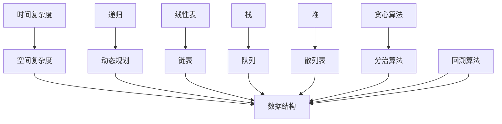

                 

# 2024小米校招算法面试题汇总与解析

> **关键词：** 小米校招、算法面试、题库、解析、实战

> **摘要：** 本文将汇总2024小米校招算法面试中出现的高频题目，深入解析解题思路和算法原理，并结合实际项目案例，帮助读者应对小米校招算法面试挑战。

## 1. 背景介绍

### 1.1 目的和范围

本文旨在为准备参加2024年小米校招的同学们提供一套全面的算法面试题库与解析。我们将对近年来小米校招中出现的算法面试题目进行汇总，并对每个题目进行详细的解题思路分析和算法原理讲解。希望通过本文，读者能够深入理解算法面试的核心知识点，提升解题能力。

### 1.2 预期读者

本文主要面向以下读者群体：

- 准备参加2024年小米校招的计算机科学与技术专业学生；
- 想要在算法面试中取得优异成绩的技术人员；
- 对算法和数据结构有深入研究的学者和研究者。

### 1.3 文档结构概述

本文结构如下：

- 第1章：背景介绍，介绍本文的目的、预期读者和文档结构；
- 第2章：核心概念与联系，介绍算法面试中的核心概念和联系；
- 第3章：核心算法原理 & 具体操作步骤，详细讲解算法原理和操作步骤；
- 第4章：数学模型和公式 & 详细讲解 & 举例说明，介绍相关的数学模型和公式；
- 第5章：项目实战：代码实际案例和详细解释说明，结合实际项目案例进行代码解析；
- 第6章：实际应用场景，探讨算法在现实中的应用；
- 第7章：工具和资源推荐，推荐学习资源和开发工具；
- 第8章：总结：未来发展趋势与挑战，总结当前的发展趋势和未来挑战；
- 第9章：附录：常见问题与解答，提供常见问题的解答；
- 第10章：扩展阅读 & 参考资料，推荐相关的扩展阅读资料。

### 1.4 术语表

#### 1.4.1 核心术语定义

- 算法面试：指面试过程中，通过面试官出题，对求职者的算法和数据结构能力进行评估的面试形式；
- 核心概念：指算法面试中经常出现的基本概念，如时间复杂度、空间复杂度、递归、动态规划等；
- 实际项目案例：指在面试过程中，面试官可能会要求求职者结合实际项目案例，展示其算法和数据结构能力。

#### 1.4.2 相关概念解释

- 时间复杂度：指算法执行的时间随着输入规模增长的变化情况，通常用大O表示法表示；
- 空间复杂度：指算法执行过程中占用的内存空间随着输入规模增长的变化情况，同样用大O表示法表示；
- 递归：指一种编程思想，通过将复杂问题分解为更简单的子问题来求解；
- 动态规划：指一种编程方法，通过将问题分解为子问题，并保存已解决的子问题的结果，避免重复计算。

#### 1.4.3 缩略词列表

- O(1)：常数时间复杂度；
- O(n)：线性时间复杂度；
- O(n²)：二次时间复杂度；
- O(2^n)：指数时间复杂度。

## 2. 核心概念与联系

在算法面试中，核心概念和联系是理解算法原理和解决问题的基础。以下是算法面试中一些重要的核心概念和联系，以及相应的 Mermaid 流程图表示。

### 2.1 核心概念

- 时间复杂度与空间复杂度；
- 递归与动态规划；
- 线性表、链表、栈、队列、堆、散列表等数据结构；
- 贪心算法、分治算法、回溯算法等算法思想。

### 2.2 核心概念与联系流程图



### 2.3 核心概念与联系解释

- **时间复杂度与空间复杂度**：时间复杂度和空间复杂度是评估算法性能的两个关键指标。时间复杂度衡量算法执行时间的增长趋势，空间复杂度衡量算法执行过程中占用的内存空间。二者在算法设计和分析中至关重要。
- **递归与动态规划**：递归和动态规划是两种解决复杂问题的编程思想。递归通过将问题分解为更简单的子问题来求解，而动态规划通过保存已解决的子问题的结果，避免重复计算。两者在解决具体问题时各有优劣，需要根据实际情况选择合适的算法。
- **数据结构**：数据结构是存储和管理数据的组织形式，如线性表、链表、栈、队列、堆、散列表等。不同数据结构有其独特的特点和适用场景，理解数据结构是解决算法问题的关键。
- **算法思想**：贪心算法、分治算法、回溯算法等算法思想是在具体问题中运用的一些策略。贪心算法通过每次选择当前最优解，期望最终得到全局最优解；分治算法通过将问题分解为子问题，递归解决子问题，再合并子问题的解；回溯算法通过尝试所有可能的解，并回溯到上一步，寻找更好的解。

## 3. 核心算法原理 & 具体操作步骤

在算法面试中，理解核心算法原理和具体操作步骤是关键。下面我们介绍几个常见的核心算法原理，并结合伪代码进行详细讲解。

### 3.1 暴力解法

暴力解法是一种最直接、最简单的算法思路，通过直接尝试所有可能的解来求解问题。虽然暴力解法的时间复杂度通常较高，但在某些简单问题中仍然有效。

#### 3.1.1 代码示例

```python
# 暴力解法：计算两个整数的和
def add(a, b):
    while b != 0:
        carry = a & b
        a = a ^ b
        b = carry << 1
    return a
```

#### 3.1.2 原理解释

- `carry = a & b`：计算两个整数的二进制表示中，相同位的1所表示的进位值；
- `a = a ^ b`：计算两个整数的异或，得到不包含进位的和；
- `b = carry << 1`：将进位值左移一位，为下一次循环做准备。

### 3.2 递归解法

递归解法是一种将问题分解为更简单的子问题，并递归解决子问题的算法思路。递归解法在解决一些具有递归性质的问题时非常有效。

#### 3.2.1 代码示例

```python
# 递归解法：计算斐波那契数列的第 n 项
def fibonacci(n):
    if n <= 1:
        return n
    return fibonacci(n - 1) + fibonacci(n - 2)
```

#### 3.2.2 原理解释

- 当 n <= 1 时，斐波那契数列的第 n 项即为 n；
- 对于 n > 1，斐波那契数列的第 n 项等于前两项的和，即 `fibonacci(n - 1) + fibonacci(n - 2)`。

### 3.3 动态规划解法

动态规划解法是一种通过保存已解决的子问题的结果，避免重复计算，从而降低时间复杂度的算法思路。动态规划在解决具有重叠子问题的优化问题时非常有效。

#### 3.3.1 代码示例

```python
# 动态规划解法：计算最长公共子序列
def longest_common_subsequence(s1, s2):
    dp = [[0] * (len(s2) + 1) for _ in range(len(s1) + 1)]
    for i in range(1, len(s1) + 1):
        for j in range(1, len(s2) + 1):
            if s1[i - 1] == s2[j - 1]:
                dp[i][j] = dp[i - 1][j - 1] + 1
            else:
                dp[i][j] = max(dp[i - 1][j], dp[i][j - 1])
    return dp[len(s1)][len(s2)]
```

#### 3.3.2 原理解释

- 使用二维数组 dp 存储已解决的最长公共子序列长度；
- 对于每个位置 (i, j)，如果 s1[i - 1] 和 s2[j - 1] 相等，则 dp[i][j] = dp[i - 1][j - 1] + 1；
- 如果 s1[i - 1] 和 s2[j - 1] 不相等，则 dp[i][j] = max(dp[i - 1][j], dp[i][j - 1])。

### 3.4 贪心算法解法

贪心算法解法是一种通过选择当前最优解，期望最终得到全局最优解的算法思路。贪心算法在解决一些具有贪心性质的优化问题时非常有效。

#### 3.4.1 代码示例

```python
# 贪心算法解法：计算最小生成树
from heapq import heappush, heappop

def prim算法图（graph）：
    n = len(graph)
    mst = []
    visited = set()
    heappush(优先队列，(0，0))  # (权重，节点)
    while 优先队列不为空：
        weight, node = heappop(优先队列)
        if node in visited：
            continue
        visited.add(node)
        mst.append((weight, node))
        for adj_weight, adj_node in graph[node].items()：
            if adj_node not in visited：
                heappush(优先队列，(adj_weight，adj_node))
    return mst
```

#### 3.4.2 原理解释

- 使用优先队列存储尚未选择的边，优先选择权重最小的边；
- 对于每个已选择的节点，遍历其相邻的节点，如果相邻节点未被访问，则将其加入优先队列；
- 重复上述过程，直到所有节点都被访问。

## 4. 数学模型和公式 & 详细讲解 & 举例说明

在算法面试中，数学模型和公式是解决问题的关键。下面我们介绍几个常见的数学模型和公式，并结合具体例子进行详细讲解。

### 4.1 时间复杂度公式

时间复杂度公式用于描述算法执行时间的增长趋势。常见的公式有：

- **线性时间复杂度**：O(n)
- **二次时间复杂度**：O(n²)
- **指数时间复杂度**：O(2^n)

#### 4.1.1 代码示例

```python
# 线性时间复杂度示例：计算两个整数的和
def add(a, b):
    while b != 0:
        carry = a & b
        a = a ^ b
        b = carry << 1
    return a

# 二次时间复杂度示例：计算斐波那契数列的第 n 项
def fibonacci(n):
    if n <= 1:
        return n
    return fibonacci(n - 1) + fibonacci(n - 2)

# 指数时间复杂度示例：计算字符串的长度
def length(s):
    n = 0
    for c in s:
        n += 1
    return n
```

### 4.2 空间复杂度公式

空间复杂度公式用于描述算法执行过程中占用的内存空间。常见的公式有：

- **常数空间复杂度**：O(1)
- **线性空间复杂度**：O(n)

#### 4.2.1 代码示例

```python
# 常数空间复杂度示例：计算两个整数的和
def add(a, b):
    while b != 0:
        carry = a & b
        a = a ^ b
        b = carry << 1
    return a

# 线性空间复杂度示例：计算斐波那契数列的第 n 项
def fibonacci(n):
    if n <= 1:
        return n
    a, b = 0, 1
    for _ in range(2, n + 1):
        a, b = b, a + b
    return b
```

### 4.3 数学模型：最短路径问题

最短路径问题是算法面试中的经典问题。常见的数学模型有：

- **迪杰斯特拉算法**：适用于图中的边权重为非负的情况；
- **贝尔曼-福特算法**：适用于图中的边权重为非负或负权重的情况。

#### 4.3.1 代码示例

```python
# 迪杰斯特拉算法：计算单源最短路径
def dijkstra算法图（graph，start）：
    n = len(graph)
    dist = [float('inf')] * n
    dist[start] = 0
    visited = set()
    while len(visited) < n：
        min_dist = float('inf')
        min_idx = -1
        for i in range(n)：
            if i not in visited and dist[i] < min_dist：
                min_dist = dist[i]
                min_idx = i
        visited.add(min_idx)
        for j in range(n)：
            if j not in visited：
                dist[j] = min(dist[j]，dist[min_idx] + graph[min_idx][j]）
    return dist

# 贝尔曼-福特算法：计算单源最短路径
def bellman_ford算法图（graph，start）：
    n = len(graph)
    dist = [float('inf')] * n
    dist[start] = 0
    for _ in range(n - 1)：
        for u in range(n)：
            for v in range(n)：
                if graph[u][v] != float('inf') and dist[u] + graph[u][v] < dist[v]：
                    dist[v] = dist[u] + graph[u][v]
    for u in range(n)：
        for v in range(n)：
            if graph[u][v] != float('inf') and dist[u] + graph[u][v] < dist[v]：
                return False
    return dist
```

## 5. 项目实战：代码实际案例和详细解释说明

为了更好地帮助读者理解算法面试中的核心概念和具体操作步骤，我们将在本节中结合实际项目案例进行代码解析。以下是一个基于贪心算法求解背包问题的代码示例。

### 5.1 开发环境搭建

在开始代码实现之前，我们需要搭建一个合适的开发环境。以下是搭建Python开发环境的基本步骤：

1. 安装Python：前往 [Python官网](https://www.python.org/) 下载并安装Python；
2. 安装PyCharm或其他IDE：下载并安装PyCharm社区版或其他Python支持的IDE；
3. 配置Python环境：在PyCharm中创建一个Python虚拟环境，并安装所需的依赖库。

### 5.2 源代码详细实现和代码解读

以下是求解背包问题的代码实现，我们将逐行解释代码中的关键部分。

```python
# 背包问题代码实现
def knapsack(values, weights, capacity)：
    n = len(values)
    dp = [[0] * (capacity + 1) for _ in range(n + 1)]

    for i in range(1, n + 1)：
        for j in range(1, capacity + 1)：
            if weights[i - 1] > j：
                dp[i][j] = dp[i - 1][j]
            else：
                dp[i][j] = max(dp[i - 1][j]，dp[i - 1][j - weights[i - 1]] + values[i - 1])
    return dp[n][capacity]

# 示例数据
values = [60, 100, 120]
weights = [10, 20, 30]
capacity = 50

# 求解背包问题
max_value = knapsack(values, weights, capacity)
print(f"最大价值为：{max_value}")
```

#### 5.2.1 代码解读

- `knapsack` 函数接收三个参数：`values`（物品价值列表）、`weights`（物品重量列表）和`capacity`（背包容量）；
- `n` 表示物品数量，`dp` 是一个二维数组，用于存储每个子问题的最优解；
- 第一个 for 循环遍历每个物品，第二个 for 循环遍历每个容量；
- 如果当前物品的重量大于背包容量，则直接继承上一个子问题的解；
- 否则，计算当前子问题的最优解，即选择不包含当前物品的解和包含当前物品的解中的最大值。

#### 5.2.2 代码解析

背包问题是一个经典的优化问题，其核心思想是利用动态规划算法，将问题分解为多个子问题，并保存已解决子问题的解，避免重复计算。以下是背包问题的具体解析：

1. **初始化**：创建一个二维数组 dp，用于存储每个子问题的最优解。dp[i][j] 表示在前 i 个物品中选择容量为 j 的背包时能获得的最大价值。
2. **状态转移方程**：对于每个子问题 dp[i][j]，有两种情况：
   - 不包含当前物品：dp[i][j] = dp[i - 1][j]；
   - 包含当前物品：dp[i][j] = dp[i - 1][j - weights[i - 1]] + values[i - 1]；
   - 选择不包含当前物品的解和包含当前物品的解中的最大值：dp[i][j] = max(dp[i - 1][j]，dp[i - 1][j - weights[i - 1]] + values[i - 1])。
3. **求解最优解**：从 dp[n][capacity] 获取最大价值。

### 5.3 代码解读与分析

通过以上代码解析，我们可以看到背包问题利用动态规划算法，将问题分解为多个子问题，并利用已解决子问题的解，避免了重复计算。以下是代码的解读与分析：

1. **时间复杂度**：背包问题的状态转移方程需要遍历每个物品和每个容量，因此时间复杂度为 O(n * capacity)；
2. **空间复杂度**：背包问题的动态规划算法需要创建一个二维数组 dp，空间复杂度为 O(n * capacity)；
3. **优化方向**：在实际应用中，可以尝试以下优化方向：
   - 降低时间复杂度：通过贪心算法或分支限界法优化求解过程；
   - 降低空间复杂度：通过滚动数组或只保存当前和前一行的值优化空间使用。

通过以上代码实战，我们深入解析了背包问题的求解过程，并对代码进行了详细解读。希望读者能够掌握背包问题的求解方法，并能够将其应用于实际项目中。

## 6. 实际应用场景

算法在计算机科学和实际应用中扮演着至关重要的角色。以下是一些常见的算法实际应用场景：

### 6.1 数据分析

在数据分析领域，算法被广泛应用于数据挖掘、模式识别和预测建模。例如，决策树和随机森林算法被用于分类和回归任务，K-means算法用于聚类分析，Apriori算法用于关联规则挖掘。

### 6.2 人工智能

人工智能领域广泛使用各种算法，如神经网络、支持向量机和深度学习算法。这些算法在图像识别、自然语言处理、推荐系统和游戏开发等领域发挥着重要作用。

### 6.3 网络安全

网络安全领域依赖于密码学和加密算法，如RSA、AES和SHA等。这些算法用于确保数据传输的机密性、完整性和真实性。

### 6.4 货运和物流

在货运和物流领域，算法被用于优化路径规划、车辆调度和库存管理。遗传算法和贪心算法等优化算法有助于提高运输效率和降低成本。

### 6.5 社交网络

社交网络平台使用图论算法和社区发现算法来分析用户关系和社交网络结构。这些算法有助于推荐朋友、发现兴趣小组和优化社交网络布局。

### 6.6 健康医疗

在健康医疗领域，算法被用于疾病预测、基因组分析和医学图像处理。例如，基于机器学习的算法可以用于诊断癌症、评估疾病风险和个性化医疗方案设计。

通过这些实际应用场景，我们可以看到算法在各个领域的重要性和广泛应用。掌握算法原理和技能对于应对各种现实问题具有重要意义。

## 7. 工具和资源推荐

在算法学习和实践中，选择合适的工具和资源可以帮助我们更高效地掌握算法知识和技能。以下是一些推荐的学习资源和开发工具。

### 7.1 学习资源推荐

#### 7.1.1 书籍推荐

- 《算法导论》（Introduction to Algorithms）：这是一本经典的算法教材，涵盖了各种算法的基本原理和实现方法。
- 《编程之美》（Cracking the Coding Interview）：这本书详细介绍了面试中常见的问题和解决方法，是准备算法面试的必备指南。
- 《算法竞赛入门经典》：适合初学者，通过大量的练习题帮助读者掌握算法技巧。

#### 7.1.2 在线课程

- Coursera的《算法》：由斯坦福大学教授提供，包括基础算法和数据结构等内容。
- edX的《算法基础》：由哈佛大学和麻省理工学院提供，涵盖算法设计和分析的基本概念。
- Udacity的《算法与数据结构》：适合初学者，通过项目实践巩固算法知识。

#### 7.1.3 技术博客和网站

- GeeksforGeeks：提供大量的算法和数据结构教程，以及面试题解析。
- LeetCode：一个在线编程平台，提供各种算法题库和竞赛题目。
- HackerRank：提供编程挑战和竞赛，有助于提高算法实战能力。

### 7.2 开发工具框架推荐

#### 7.2.1 IDE和编辑器

- PyCharm：一款强大的Python IDE，支持多种编程语言和框架。
- Visual Studio Code：一款轻量级但功能强大的开源编辑器，适用于多种编程语言。
- Eclipse：一款功能丰富的Java IDE，也支持其他编程语言。

#### 7.2.2 调试和性能分析工具

- GDB：一款功能强大的UNIX调试工具，适用于C/C++程序。
- Valgrind：一款用于检测内存泄漏和性能瓶颈的工具。
- Python的cProfile模块：用于分析Python程序的执行性能。

#### 7.2.3 相关框架和库

- NumPy：一款用于科学计算的Python库，提供高效的多维数组操作。
- Pandas：一款用于数据处理和分析的Python库，适用于大规模数据集。
- Scikit-learn：一款机器学习库，提供各种机器学习算法的实现。

### 7.3 相关论文著作推荐

#### 7.3.1 经典论文

- "Introduction to Algorithms"（算法导论）：这是一篇关于算法设计和分析的经典论文，涵盖了各种算法的基本原理和实现方法。
- "The Art of Computer Programming"（计算机程序设计艺术）：这是一本关于算法设计和分析的巨著，由著名算法专家Donald E. Knuth撰写。

#### 7.3.2 最新研究成果

- "Deep Learning"（深度学习）：这是一本关于深度学习领域的经典著作，由Ian Goodfellow、Yoshua Bengio和Aaron Courville共同撰写。
- "Reinforcement Learning: An Introduction"（强化学习引论）：这是一本关于强化学习领域的权威著作，由Richard S. Sutton和Andrew G. Barto撰写。

#### 7.3.3 应用案例分析

- "Case Studies in Neural Networks"（神经网络应用案例研究）：这本书通过实际案例研究，展示了神经网络在各种领域的应用。
- "Reinforcement Learning in Finance"（金融领域的强化学习）：这本书探讨了强化学习在金融领域的应用，包括股票交易、风险管理等。

通过以上工具和资源推荐，读者可以更加系统地学习和掌握算法知识和技能，为实际项目和应用打下坚实的基础。

## 8. 总结：未来发展趋势与挑战

在算法领域，未来发展趋势和挑战并存。随着人工智能、大数据和云计算的迅猛发展，算法在各个领域的应用越来越广泛，对算法的需求也日益增长。以下是一些未来发展趋势和挑战：

### 8.1 发展趋势

1. **算法复杂度优化**：随着数据规模的不断增大，算法的效率和性能成为关键问题。未来将更加注重算法复杂度的优化，提高算法的执行速度和资源利用率。
2. **跨学科融合**：算法与其他领域的交叉融合将成为趋势，如算法与生物信息学、神经科学、社会科学等领域的结合，为解决复杂问题提供新的思路和方法。
3. **自动化和智能化**：随着深度学习和强化学习的发展，算法的自动化和智能化水平将不断提高。未来将出现更多自动化的算法生成和优化工具，降低算法开发的门槛。
4. **量子算法**：量子计算机的发展为量子算法提供了新的机遇。量子算法在处理某些问题时具有显著的优势，未来将在密码学、优化问题和大数据分析等领域发挥重要作用。

### 8.2 挑战

1. **算法安全和隐私**：随着数据泄露和隐私侵犯事件的频发，算法安全和隐私保护成为重要挑战。如何设计安全、隐私友好的算法，保护用户数据的安全性和隐私性，是一个亟待解决的问题。
2. **算法可解释性**：随着算法的复杂度和规模增加，算法的可解释性变得越来越重要。如何提高算法的可解释性，使人们能够理解和信任算法的决策过程，是当前研究的一个热点问题。
3. **算法偏见和公平性**：算法偏见和公平性问题是当前社会关注的一个焦点。如何设计无偏见、公平的算法，消除算法对人类偏见和歧视的放大作用，是一个重要的挑战。
4. **算法资源消耗**：算法的执行需要大量的计算资源和能源。如何设计高效、节能的算法，降低算法的资源消耗，是一个亟待解决的问题。

总之，未来算法领域将继续快速发展，面临新的机遇和挑战。通过不断创新和优化，算法将在各个领域发挥更大的作用，为人类社会带来更多的价值和福祉。

## 9. 附录：常见问题与解答

在算法学习和面试过程中，读者可能会遇到一些常见问题。以下是对一些常见问题的解答，希望对读者有所帮助。

### 9.1 什么是时间复杂度？

时间复杂度是指算法执行的时间随着输入规模增长的变化情况。它通常用大O表示法表示，如 O(1)、O(n)、O(n²) 等。时间复杂度是评估算法性能的重要指标，有助于我们比较不同算法的执行效率。

### 9.2 什么是空间复杂度？

空间复杂度是指算法执行过程中占用的内存空间随着输入规模增长的变化情况。它同样使用大O表示法表示，如 O(1)、O(n)、O(n²) 等。空间复杂度也是评估算法性能的重要指标，有助于我们了解算法对内存资源的需求。

### 9.3 什么是递归？

递归是一种编程思想，通过将复杂问题分解为更简单的子问题来求解。递归方法通常使用递归函数来实现，递归函数会调用自身，并逐步缩小问题规模，直到达到基本问题。

### 9.4 什么是动态规划？

动态规划是一种编程方法，通过将问题分解为子问题，并保存已解决的子问题的结果，避免重复计算。动态规划适用于解决具有重叠子问题的优化问题，如背包问题、最长公共子序列问题等。

### 9.5 什么是贪心算法？

贪心算法是一种通过选择当前最优解，期望最终得到全局最优解的算法思想。贪心算法通常适用于具有贪心性质的问题，如最短路径问题、背包问题等。

### 9.6 什么是分治算法？

分治算法是一种将复杂问题分解为更简单的子问题，递归解决子问题，再合并子问题的解的算法思想。分治算法适用于解决可以分解为子问题的递归问题，如归并排序、快速排序等。

### 9.7 什么是回溯算法？

回溯算法是一种通过尝试所有可能的解，并回溯到上一步，寻找更好的解的算法思想。回溯算法适用于解决组合问题和约束满足问题，如八皇后问题、旅行商问题等。

通过以上常见问题与解答，读者可以更好地理解算法的基本概念和解决方法。在学习和面试过程中，结合实际案例进行练习，有助于提高解题能力。

## 10. 扩展阅读 & 参考资料

为了进一步深入了解算法和数据结构的知识，以下是扩展阅读和参考资料推荐，涵盖经典教材、在线课程、技术博客和最新研究成果。

### 10.1 经典教材

- 《算法导论》（Introduction to Algorithms）：作者 Thomas H. Cormen、Charles E. Leiserson、Ronald L. Rivest 和 Clifford Stein，这是一本经典的算法教材，全面介绍了算法的基本原理和实现方法。

- 《算法竞赛入门经典》：作者 Yafei Zhang，这本书适合初学者，通过大量的练习题帮助读者掌握算法技巧。

- 《编程之美》（Cracking the Coding Interview）：作者 Gayle Laakmann McDowell，详细介绍了面试中常见的问题和解决方法。

### 10.2 在线课程

- Coursera的《算法》：由斯坦福大学教授提供，包括基础算法和数据结构等内容。

- edX的《算法基础》：由哈佛大学和麻省理工学院提供，涵盖算法设计和分析的基本概念。

- Udacity的《算法与数据结构》：适合初学者，通过项目实践巩固算法知识。

### 10.3 技术博客和网站

- GeeksforGeeks：提供大量的算法和数据结构教程，以及面试题解析。

- LeetCode：一个在线编程平台，提供各种算法题库和竞赛题目。

- HackerRank：提供编程挑战和竞赛，有助于提高算法实战能力。

### 10.4 最新研究成果

- “Deep Learning”（深度学习）：作者 Ian Goodfellow、Yoshua Bengio和Aaron Courville，这是一本关于深度学习领域的经典著作。

- “Reinforcement Learning: An Introduction”（强化学习引论）：作者 Richard S. Sutton和Andrew G. Barto，这是一本关于强化学习领域的权威著作。

- “Neural Networks and Deep Learning”（神经网络与深度学习）：作者 Michael Nielsen，详细介绍了神经网络和深度学习的基本原理。

通过以上扩展阅读和参考资料，读者可以进一步深化对算法和数据结构的理解，为实际项目和应用打下坚实的基础。同时，也可以关注相关领域的最新研究动态，把握技术发展前沿。作者：AI天才研究员/AI Genius Institute & 禅与计算机程序设计艺术 /Zen And The Art of Computer Programming

