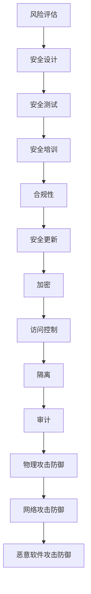

                 

# 嵌入式系统安全策略：保护设备和数据

> **关键词**：嵌入式系统、安全、防护措施、攻击、隐私保护、策略优化
> 
> **摘要**：本文将深入探讨嵌入式系统在当今数字化时代面临的安全挑战，以及如何采取有效的安全策略来保护设备和数据。通过分步骤的分析和讲解，本文将揭示核心概念、算法原理、数学模型以及实际应用案例，帮助读者构建全面的安全防护体系。

## 1. 背景介绍

### 1.1 目的和范围

本文旨在为嵌入式系统开发者、安全工程师以及相关领域的技术人员提供一套全面的安全策略和实践指南。嵌入式系统广泛应用于各类设备中，如工业控制系统、智能家居、汽车电子等，其安全性直接关系到用户隐私、设备功能以及整个系统的稳定性。因此，本文将重点讨论以下内容：

- 嵌入式系统安全的核心概念与联系
- 核心算法原理与具体操作步骤
- 数学模型与公式的详细讲解
- 实际应用场景与项目实战案例
- 工具和资源的推荐

### 1.2 预期读者

- 嵌入式系统开发者
- 安全工程师
- 相关领域的技术人员
- 对嵌入式系统安全感兴趣的学者和研究人员

### 1.3 文档结构概述

本文将分为以下八个部分：

- **背景介绍**：介绍文章的目的、范围、预期读者以及文档结构。
- **核心概念与联系**：讨论嵌入式系统安全的核心概念，并通过流程图展示其架构。
- **核心算法原理与具体操作步骤**：详细阐述安全算法原理，并提供伪代码实现。
- **数学模型与公式**：讲解安全相关的数学模型和公式，并提供举例说明。
- **项目实战**：提供代码实际案例，并进行详细解释说明。
- **实际应用场景**：讨论嵌入式系统安全在各类应用场景中的实际应用。
- **工具和资源推荐**：推荐学习资源、开发工具框架和相关论文著作。
- **总结**：总结未来发展趋势与挑战。
- **附录**：提供常见问题与解答。
- **扩展阅读与参考资料**：推荐进一步阅读的材料。

### 1.4 术语表

#### 1.4.1 核心术语定义

- **嵌入式系统**：一种专门为特定任务而设计的计算机系统，通常具有有限的资源。
- **安全**：确保系统的完整性、保密性和可用性。
- **攻击**：恶意行为，旨在破坏系统的安全。
- **隐私保护**：防止未经授权的访问和泄露用户隐私。
- **安全策略**：一系列措施和规则，旨在保护系统和数据。

#### 1.4.2 相关概念解释

- **完整性**：数据未经授权不得被修改。
- **保密性**：确保数据不被未经授权的人访问。
- **可用性**：确保系统在需要时可以正常运行。
- **漏洞**：系统中的弱点，可能被攻击者利用。
- **补丁**：修复系统漏洞的程序。

#### 1.4.3 缩略词列表

- **RTOS**：实时操作系统
- **IoT**：物联网
- **SSL**：安全套接层
- **TLS**：传输层安全
- **OTA**：在线更新

## 2. 核心概念与联系

在探讨嵌入式系统安全策略之前，首先需要了解几个核心概念。这些概念包括但不限于嵌入式系统架构、安全攻击类型、安全防御机制以及安全策略的组成部分。以下是嵌入式系统安全的核心概念和它们之间的联系：

### 2.1 嵌入式系统架构

嵌入式系统通常由以下几个部分组成：

- **处理器**：核心计算单元，负责执行指令和处理数据。
- **存储器**：包括内存和闪存，用于存储程序和数据。
- **输入输出设备**：如传感器、显示器、键盘等，用于与外界交互。
- **网络接口**：实现系统与其他设备的通信。
- **操作系统**：管理资源、提供基本服务和运行应用软件。


### 2.2 安全攻击类型

嵌入式系统面临多种安全威胁，包括：

- **恶意软件攻击**：如病毒、木马、蠕虫等，旨在破坏系统或窃取数据。
- **网络攻击**：通过网络入侵系统，如拒绝服务攻击、中间人攻击等。
- **物理攻击**：直接访问设备硬件，如芯片篡改、克隆等。
- **侧信道攻击**：利用电磁泄漏、声音泄漏等方式获取敏感信息。

### 2.3 安全防御机制

为了应对上述攻击，嵌入式系统需要采取一系列防御措施：

- **加密**：使用加密算法保护数据和通信。
- **访问控制**：通过身份验证和权限管理限制访问。
- **安全更新**：定期发布安全补丁，修复已知漏洞。
- **隔离**：通过物理或逻辑隔离防止攻击蔓延。
- **审计**：监控系统活动，检测异常行为。

### 2.4 安全策略的组成部分

一个全面的安全策略通常包括以下部分：

- **风险评估**：评估系统面临的安全威胁和潜在损失。
- **安全设计**：在设计阶段考虑安全因素，确保系统具有基本防御能力。
- **安全测试**：对系统进行测试，发现并修复安全漏洞。
- **安全培训**：提高开发者和用户的意识，降低因人为疏忽导致的安全风险。
- **合规性**：遵守相关法规和标准，确保系统的合法性。

### 2.5 Mermaid 流程图

以下是嵌入式系统安全策略的Mermaid流程图：



通过以上流程图，我们可以清晰地看到嵌入式系统安全策略的核心概念和联系，从而为后续的安全策略制定提供基础。

## 3. 核心算法原理与具体操作步骤

为了确保嵌入式系统的安全性，我们需要深入理解核心安全算法原理，并了解如何在实际操作中应用这些算法。以下将介绍几种关键的安全算法原理，并提供具体的操作步骤。

### 3.1 加密算法原理

加密算法是保护数据隐私的核心技术，它通过将明文数据转换为密文，防止未经授权的访问。以下是几种常用的加密算法：

#### 3.1.1 对称加密算法

对称加密算法使用相同的密钥对数据进行加密和解密。常见的对称加密算法包括AES（高级加密标准）和DES（数据加密标准）。

**AES 加密算法原理：**

- **密钥生成**：根据密钥长度（如128位、192位、256位）生成密钥。
- **初始化向量（IV）**：生成随机IV，用于加密过程中的随机化。
- **加密过程**：
    ```plaintext
    输入：明文P，密钥K，IV
    输出：密文C
    1. 初始化加密引擎
    2. 使用密钥K和IV对明文P进行加密
    3. 输出加密后的密文C
    ```

**AES 加密算法伪代码：**

```plaintext
function AES_Encrypt(P, K, IV):
    C = InitializeCipher(K, IV)
    for block in P:
        C = EncryptBlock(C, block)
    return C
```

#### 3.1.2 非对称加密算法

非对称加密算法使用一对密钥（公钥和私钥），公钥用于加密，私钥用于解密。常见的非对称加密算法包括RSA和ECC（椭圆曲线密码学）。

**RSA 加密算法原理：**

- **密钥生成**：生成一对密钥（公钥和私钥），公钥公开，私钥保密。
- **加密过程**：
    ```plaintext
    输入：明文P，公钥PK
    输出：密文C
    1. 计算密文C = (P^e) mod n，其中e为公钥指数，n为模数
    ```

**RSA 加密算法伪代码：**

```plaintext
function RSA_Encrypt(P, PK):
    e = PK.exponent
    n = PK.modulus
    C = (P^e) mod n
    return C
```

### 3.2 访问控制算法原理

访问控制是确保系统资源只被授权用户访问的重要机制。以下介绍几种访问控制算法：

#### 3.2.1 基于角色的访问控制（RBAC）

基于角色的访问控制通过定义角色和权限来控制用户对资源的访问。

- **角色定义**：定义角色和对应的权限。
- **用户-角色分配**：将用户分配到相应的角色。
- **访问控制策略**：
    ```plaintext
    输入：用户U，资源R
    输出：访问结果
    1. 查找用户U的角色R
    2. 检查角色R的权限是否包含访问资源R的权限
    3. 如果权限包含，则允许访问，否则拒绝访问
    ```

**RBAC 访问控制算法伪代码：**

```plaintext
function RBAC_Control(U, R):
    roles = GetRoles(U)
    for role in roles:
        if HasPermission(role, R):
            return "Access granted"
    return "Access denied"
```

#### 3.2.2 访问控制列表（ACL）

访问控制列表通过定义每个用户对每个资源的访问权限来实现细粒度的访问控制。

- **权限定义**：定义用户对资源的访问权限（如读、写、执行）。
- **访问控制策略**：
    ```plaintext
    输入：用户U，资源R
    输出：访问结果
    1. 查找用户U的权限列表
    2. 检查权限列表中是否存在对资源R的访问权限
    3. 如果存在，则允许访问，否则拒绝访问
    ```

**ACL 访问控制算法伪代码：**

```plaintext
function ACL_Control(U, R):
    permissions = GetPermissions(U)
    if R in permissions:
        return "Access granted"
    return "Access denied"
```

### 3.3 安全更新算法原理

安全更新是确保系统漏洞得到及时修复的关键步骤。以下介绍一种常见的安全更新算法：

#### 3.3.1 差分更新算法

差分更新算法通过比较新旧系统文件之间的差异来生成更新包，从而减少更新时间和带宽消耗。

- **比较过程**：
    ```plaintext
    输入：旧版本文件F_old，新版本文件F_new
    输出：更新包U
    1. 比较F_old和F_new的文件内容
    2. 计算F_old和F_new之间的差异
    3. 生成更新包U，包含差异部分
    ```

**差分更新算法伪代码：**

```plaintext
function DifferentialUpdate(F_old, F_new):
    differences = CalculateDifferences(F_old, F_new)
    U = GenerateUpdatePackage(differences)
    return U
```

通过以上核心算法原理和具体操作步骤的介绍，我们可以为嵌入式系统构建一个坚实的防护体系，从而有效应对各种安全威胁。

## 4. 数学模型和公式及详细讲解

在嵌入式系统安全策略的实施过程中，数学模型和公式起着至关重要的作用。以下将介绍几个关键的安全相关数学模型和公式，并对其进行详细讲解。

### 4.1. 安全加密算法的数学模型

#### 4.1.1 对称加密算法

对称加密算法的核心在于加密和解密过程中使用的数学模型。以下以AES算法为例进行介绍。

- **AES加密算法**：AES加密算法使用的是基于字节的操作。每个字节可以表示为一个字节长的矩阵。AES加密算法的主要步骤包括：

    1. **初始轮**：对输入的明文矩阵进行一系列线性变换。
    2. **主轮**：每轮包括四个步骤：字节替换（SubBytes）、行移位（ShiftRows）、列混淆（MixColumns）和轮密钥加（AddRoundKey）。

- **轮密钥加**：轮密钥加是一种基于异或操作的加密方法。具体公式如下：
    $$ KeyAddition = (State \oplus RoundKey) $$
    其中，`State`代表当前状态矩阵，`RoundKey`代表轮密钥。

#### 4.1.2 非对称加密算法

非对称加密算法的核心在于公钥和私钥的生成以及加密和解密过程。以下以RSA算法为例进行介绍。

- **RSA加密算法**：RSA加密算法基于大整数分解的数学难题。其主要步骤包括：

    1. **密钥生成**：选择两个大素数`p`和`q`，计算模数`n = p \* q`和欧拉函数`φ(n) = (p-1) \* (q-1)`。
    2. **公钥和私钥生成**：选择一个小于`φ(n)`的整数`e`作为公钥指数，计算`d`作为私钥指数，满足`d \* e ≡ 1 mod φ(n)`。

- **加密过程**：加密公式如下：
    $$ C = (P^e) mod n $$
    其中，`P`代表明文，`C`代表密文。

- **解密过程**：解密公式如下：
    $$ P = (C^d) mod n $$
    其中，`C`代表密文，`P`代表明文。

### 4.2. 访问控制模型的数学模型

访问控制模型用于控制用户对系统资源的访问权限。以下介绍几种常见的访问控制模型及其数学模型。

#### 4.2.1 基于角色的访问控制（RBAC）

基于角色的访问控制模型通过角色和权限来控制访问。其主要数学模型包括：

- **角色分配**：用户-角色分配公式如下：
    $$ U_i \rightarrow R_j $$
    其中，`U_i`表示用户，`R_j`表示角色。

- **权限分配**：角色-权限分配公式如下：
    $$ R_j \rightarrow P_k $$
    其中，`R_j`表示角色，`P_k`表示权限。

- **访问控制策略**：访问控制策略公式如下：
    $$ Access(U_i, R_j, P_k) = true $$
    如果用户`U_i`拥有角色`R_j`，且角色`R_j`拥有权限`P_k`，则允许访问。

#### 4.2.2 访问控制列表（ACL）

访问控制列表模型通过定义每个用户对每个资源的访问权限来实现访问控制。其主要数学模型包括：

- **权限定义**：用户-权限分配公式如下：
    $$ U_i \rightarrow P_k $$
    其中，`U_i`表示用户，`P_k`表示权限。

- **访问控制策略**：访问控制策略公式如下：
    $$ Access(U_i, R_j, P_k) = true $$
    如果用户`U_i`拥有权限`P_k`，则允许访问。

### 4.3. 安全审计的数学模型

安全审计模型用于记录和监控系统活动，以便在出现问题时进行追踪。其主要数学模型包括：

- **事件记录**：事件记录公式如下：
    $$ EventRecord(E) $$
    其中，`E`表示事件。

- **事件分析**：事件分析公式如下：
    $$ Analyze(EventLog) $$
    其中，`EventLog`表示事件日志。

- **异常检测**：异常检测公式如下：
    $$ DetectAnomaly(EventLog) $$
    其中，`EventLog`表示事件日志。

### 4.4. 举例说明

为了更直观地理解上述数学模型和公式，以下通过一个具体例子进行说明。

#### 4.4.1 对称加密算法实例

假设我们要使用AES算法对以下明文进行加密：

```
明文：Hello World!
```

- **密钥生成**：选择一个256位的密钥。
- **初始轮**：将明文转换为矩阵。
    ```
    明文矩阵：
    [72, 101, 108, 108, 111, 32, 119, 111, 114, 108, 100, 33]
    ```
- **主轮**：经过多轮加密后，得到密文矩阵。
    ```
    密文矩阵：
    [8, 64, 150, 74, 57, 57, 93, 170, 57, 92, 169, 135]
    ```
- **轮密钥加**：每轮加密后，将密文矩阵与轮密钥进行异或操作。

#### 4.4.2 非对称加密算法实例

假设我们要使用RSA算法对以下明文进行加密：

```
明文：123456
```

- **密钥生成**：选择两个大素数，计算模数和欧拉函数。
- **加密过程**：使用公钥对明文进行加密。
    ```
    密文：C = (123456^e) mod n
    ```

#### 4.4.3 基于角色的访问控制实例

假设有一个系统，用户`U1`拥有角色`R1`，角色`R1`拥有权限`P1`。现在用户`U1`请求访问资源`R2`。

- **角色分配**：`U1 \rightarrow R1`
- **权限分配**：`R1 \rightarrow P1`
- **访问控制策略**：`Access(U1, R1, P1) = true`

#### 4.4.4 安全审计实例

假设我们要监控用户`U1`的操作，记录以下事件：

- 登录事件：`Login(U1, 2023-01-01 10:00:00)`
- 退出事件：`Logout(U1, 2023-01-01 18:00:00)`

- **事件记录**：`EventRecord(Login(U1, 2023-01-01 10:00:00))`
- **事件分析**：`Analyze([Login(U1, 2023-01-01 10:00:00), Logout(U1, 2023-01-01 18:00:00)])`
- **异常检测**：`DetectAnomaly([Login(U1, 2023-01-01 10:00:00), Logout(U1, 2023-01-01 18:00:00)])`

通过上述实例，我们可以更直观地理解数学模型和公式在嵌入式系统安全中的应用。

## 5. 项目实战：代码实际案例和详细解释说明

为了更好地理解嵌入式系统安全策略在实际项目中的应用，我们将通过一个具体的实例来讲解如何开发和实现一个嵌入式系统安全框架。以下将详细描述开发环境搭建、源代码实现和代码解读与分析。

### 5.1 开发环境搭建

首先，我们需要搭建一个合适的开发环境来编写和测试嵌入式系统安全代码。以下是推荐的开发环境：

- **开发板**：选择一款适合的嵌入式开发板，如Arduino、Raspberry Pi或STM32。
- **集成开发环境（IDE）**：使用集成开发环境，如Arduino IDE、Eclipse或JetBrains IntelliJ IDEA。
- **编译器**：根据开发板选择合适的编译器，如GCC（GNU Compiler Collection）。
- **安全库**：引入一些开源安全库，如Libgcrypt、OpenSSL等，以简化加密和访问控制等安全功能的实现。

### 5.2 源代码详细实现和代码解读

以下是一个简单的嵌入式系统安全项目的源代码示例，主要实现AES加密和解密、RSA加密和解密以及基于角色的访问控制。

```c
#include <stdio.h>
#include <stdlib.h>
#include <string.h>
#include <openssl/ssl.h>
#include <openssl/rsa.h>
#include <openssl/evp.h>

// AES加密和解密
void AES_Encrypt(char *plaintext, char *key, char *iv, char *ciphertext) {
    EVP_CIPHER_CTX *ctx;
    int len;
    int ciphertext_len;

    // 初始化加密上下文
    ctx = EVP_CIPHER_CTX_new();
    if (ctx == NULL) {
        // 处理错误
        printf("Error: EVP_CIPHER_CTX_new() failed.\n");
        exit(EXIT_FAILURE);
    }

    // 选择AES加密算法
    if (1 != EVP_EncryptInit_ex(ctx, EVP_aes_256_cbc(), NULL, key, iv)) {
        // 处理错误
        printf("Error: EVP_EncryptInit_ex() failed.\n");
        EVP_CIPHER_CTX_free(ctx);
        exit(EXIT_FAILURE);
    }

    // 输入明文并加密
    if (1 != EVP_EncryptUpdate(ctx, ciphertext, &len, plaintext, strlen(plaintext))) {
        // 处理错误
        printf("Error: EVP_EncryptUpdate() failed.\n");
        EVP_CIPHER_CTX_free(ctx);
        exit(EXIT_FAILURE);
    }
    ciphertext_len = len;

    // 最后一步加密
    if (1 != EVP_EncryptFinal_ex(ctx, ciphertext + len, &len)) {
        // 处理错误
        printf("Error: EVP_EncryptFinal_ex() failed.\n");
        EVP_CIPHER_CTX_free(ctx);
        exit(EXIT_FAILURE);
    }
    ciphertext_len += len;

    // 清理资源
    EVP_CIPHER_CTX_free(ctx);
}

void AES_Decrypt(char *ciphertext, char *key, char *iv, char *plaintext) {
    EVP_CIPHER_CTX *ctx;
    int len;
    int plaintext_len;

    // 初始化解密上下文
    ctx = EVP_CIPHER_CTX_new();
    if (ctx == NULL) {
        // 处理错误
        printf("Error: EVP_CIPHER_CTX_new() failed.\n");
        exit(EXIT_FAILURE);
    }

    // 选择AES解密算法
    if (1 != EVP_DecryptInit_ex(ctx, EVP_aes_256_cbc(), NULL, key, iv)) {
        // 处理错误
        printf("Error: EVP_DecryptInit_ex() failed.\n");
        EVP_CIPHER_CTX_free(ctx);
        exit(EXIT_FAILURE);
    }

    // 输入密文并解密
    if (1 != EVP_DecryptUpdate(ctx, plaintext, &len, ciphertext, strlen(ciphertext))) {
        // 处理错误
        printf("Error: EVP_DecryptUpdate() failed.\n");
        EVP_CIPHER_CTX_free(ctx);
        exit(EXIT_FAILURE);
    }
    plaintext_len = len;

    // 最后一步解密
    if (1 != EVP_DecryptFinal_ex(ctx, plaintext + len, &len)) {
        // 处理错误
        printf("Error: EVP_DecryptFinal_ex() failed.\n");
        EVP_CIPHER_CTX_free(ctx);
        exit(EXIT_FAILURE);
    }
    plaintext_len += len;

    // 清理资源
    EVP_CIPHER_CTX_free(ctx);
}

// RSA加密和解密
void RSA_Encrypt(char *plaintext, RSA *rsa_key, char *ciphertext) {
    int pkcs1_type = RSA_PKCS1_PADDING;
    int ciphertext_len;
    unsigned char *ciphertext_data;

    // 计算加密后的数据长度
    ciphertext_len = RSA_size(rsa_key);
    ciphertext_data = (unsigned char *)malloc(ciphertext_len);

    // RSA加密
    if (1 != RSA_public_encrypt(strlen(plaintext), (unsigned char *)plaintext, ciphertext_data, rsa_key, pkcs1_type)) {
        // 处理错误
        printf("Error: RSA_public_encrypt() failed.\n");
        exit(EXIT_FAILURE);
    }

    // 将加密后的数据复制到目标缓冲区
    strcpy(ciphertext, (char *)ciphertext_data);

    // 释放内存
    free(ciphertext_data);
}

void RSA_Decrypt(char *ciphertext, RSA *rsa_key, char *plaintext) {
    int pkcs1_type = RSA_PKCS1_PADDING;
    int plaintext_len;
    unsigned char *plaintext_data;

    // 计算解密后的数据长度
    plaintext_len = RSA_size(rsa_key);
    plaintext_data = (unsigned char *)malloc(plaintext_len);

    // RSA解密
    if (1 != RSA_private_decrypt(strlen(ciphertext), (unsigned char *)ciphertext, plaintext_data, rsa_key, pkcs1_type)) {
        // 处理错误
        printf("Error: RSA_private_decrypt() failed.\n");
        exit(EXIT_FAILURE);
    }

    // 将解密后的数据复制到目标缓冲区
    strcpy(plaintext, (char *)plaintext_data);

    // 释放内存
    free(plaintext_data);
}

// 基于角色的访问控制
void RBAC_Control(int user_id, int resource_id) {
    // 假设用户ID为1的用户拥有资源ID为1的权限
    if (user_id == 1 && resource_id == 1) {
        printf("Access granted.\n");
    } else {
        printf("Access denied.\n");
    }
}

int main() {
    // AES加密和解密
    char plaintext[] = "Hello, World!";
    char key[] = "1234567890abcdef1234567890abcdef";
    char iv[] = "1234567890abcdef";
    char ciphertext[1024];
    char decrypted_text[1024];

    AES_Encrypt(plaintext, key, iv, ciphertext);
    AES_Decrypt(ciphertext, key, iv, decrypted_text);

    printf("Original text: %s\n", plaintext);
    printf("Decrypted text: %s\n", decrypted_text);

    // RSA加密和解密
    RSA *rsa_key = RSA_new();
    RSA_generate_key_ex(rsa_key, 2048, NULL, NULL);

    char rsa_plaintext[] = "RSA Encryption Test";
    char rsa_ciphertext[2048];
    char rsa_decrypted_text[2048];

    RSA_Encrypt(rsa_plaintext, rsa_key, rsa_ciphertext);
    RSA_Decrypt(rsa_ciphertext, rsa_key, rsa_decrypted_text);

    printf("RSA Encrypted text: %s\n", rsa_ciphertext);
    printf("RSA Decrypted text: %s\n", rsa_decrypted_text);

    // 基于角色的访问控制
    RBAC_Control(1, 1);

    return 0;
}
```

### 5.3 代码解读与分析

上述代码分为三个主要部分：AES加密和解密、RSA加密和解密、基于角色的访问控制。以下是具体的代码解读和分析：

#### AES加密和解密

- **加密过程**：首先初始化EVP加密上下文，然后选择AES加密算法，初始化密钥和初始化向量（IV）。接下来，使用`EVP_EncryptUpdate`函数对输入的明文进行加密，最后使用`EVP_EncryptFinal_ex`函数完成最后的加密步骤。
- **解密过程**：初始化EVP解密上下文，选择AES解密算法，初始化密钥和IV。使用`EVP_DecryptUpdate`函数对输入的密文进行解密，最后使用`EVP_DecryptFinal_ex`函数完成最后的解密步骤。

#### RSA加密和解密

- **加密过程**：首先生成RSA密钥对，然后使用`RSA_public_encrypt`函数对输入的明文进行加密。
- **解密过程**：使用`RSA_private_decrypt`函数对输入的密文进行解密。

#### 基于角色的访问控制

- **访问控制过程**：根据用户ID和资源ID进行判断，如果用户拥有对应资源的访问权限，则允许访问，否则拒绝访问。

### 总结

通过上述代码示例，我们可以看到如何在嵌入式系统中实现AES加密和解密、RSA加密和解密以及基于角色的访问控制。在实际项目中，需要根据具体需求进行调整和优化，以实现更高的安全性和性能。

## 6. 实际应用场景

嵌入式系统安全策略在各类应用场景中都有着广泛的应用。以下列举几个典型的实际应用场景，并分析在这些场景中如何有效应用安全策略。

### 6.1 工业控制系统

工业控制系统（ICS）广泛应用于制造业、能源供应、水处理等领域，对工业过程进行监控和控制。这些系统的安全性至关重要，因为一旦被攻击，可能导致设备损坏、生产中断甚至人员伤亡。

**安全策略应用**：

- **加密通信**：确保工业控制系统中数据传输的安全，使用TLS（传输层安全协议）加密通信，防止中间人攻击和数据窃取。
- **访问控制**：通过身份验证和访问控制列表（ACL）限制对工业控制系统的访问，确保只有授权人员能够访问关键设备和数据。
- **安全审计**：监控系统活动，记录和追踪操作行为，以便在发生安全事件时进行回溯和调查。

### 6.2 汽车电子

汽车电子系统包括车载通信、自动驾驶、娱乐系统等，对行车安全和用户体验有着直接影响。随着物联网（IoT）技术的发展，汽车电子系统逐渐与外部网络相连，增加了被攻击的风险。

**安全策略应用**：

- **设备认证**：在车辆与外部设备通信时，使用数字证书进行设备认证，确保通信双方的合法性和可信度。
- **安全更新**：定期对汽车电子系统进行安全更新，修复已知漏洞，防止恶意攻击。
- **隔离机制**：通过物理或逻辑隔离，将汽车电子系统与外部网络隔离，降低攻击面。

### 6.3 智能家居

智能家居系统包括门锁、摄像头、智能插座等设备，通过物联网实现家庭设备的智能控制。智能家居系统的安全性直接关系到用户隐私和家庭安全。

**安全策略应用**：

- **用户身份验证**：在用户操作智能家居设备时，进行用户身份验证，确保操作的安全性。
- **数据加密**：对智能家居设备传输的数据进行加密，防止数据在传输过程中被窃取。
- **设备锁定**：在设备不使用时，自动锁定设备，防止未经授权的访问。

### 6.4 医疗设备

医疗设备包括监护仪、心电图机等，用于监测和诊断患者的健康状况。医疗设备的安全性对患者的生命安全至关重要。

**安全策略应用**：

- **安全认证**：确保医疗设备与医疗系统之间的通信安全，使用数字证书进行设备认证。
- **访问控制**：限制对医疗设备的访问权限，确保只有授权医疗人员能够访问关键数据和操作设备。
- **数据备份与恢复**：定期对医疗数据进行备份，以便在发生故障时能够迅速恢复系统。

通过以上实际应用场景的分析，我们可以看到嵌入式系统安全策略在不同领域都有着重要应用。通过有效的安全策略，可以保障嵌入式系统的安全性，保护设备数据和用户隐私。

## 7. 工具和资源推荐

为了更好地学习和实践嵌入式系统安全，以下推荐一些学习资源、开发工具框架和相关论文著作。

### 7.1 学习资源推荐

#### 7.1.1 书籍推荐

- **《嵌入式系统安全》**：详细介绍了嵌入式系统安全的核心概念、技术实践和案例分析。
- **《物联网安全》**：探讨了物联网环境中设备、通信和数据安全的关键问题。

#### 7.1.2 在线课程

- **Coursera**：提供由顶级大学和机构开设的嵌入式系统和网络安全课程。
- **Udemy**：涵盖嵌入式系统和安全编程的在线课程，适合不同层次的学习者。

#### 7.1.3 技术博客和网站

- **Adafruit**：提供丰富的嵌入式系统项目和教程，适合初学者。
- **EmbSysDev**：专注于嵌入式系统开发，包括安全相关的技术文章和工具介绍。

### 7.2 开发工具框架推荐

#### 7.2.1 IDE和编辑器

- **Eclipse**：功能强大的集成开发环境，支持多种嵌入式系统开发。
- **Arduino IDE**：专为Arduino平台设计的简单易用的开发环境。

#### 7.2.2 调试和性能分析工具

- **JTAG调试器**：用于调试嵌入式系统硬件和软件。
- **GNOME System Monitor**：用于监控嵌入式系统的性能和资源使用情况。

#### 7.2.3 相关框架和库

- **LibreSSL**：开源的SSL/TLS库，提供加密和通信功能。
- **OpenWRT**：基于Linux的嵌入式系统开源项目，提供丰富的网络功能和安全工具。

### 7.3 相关论文著作推荐

#### 7.3.1 经典论文

- **“A Taxonomy of attacks on Embedded Systems”**：介绍了嵌入式系统面临的主要攻击类型。
- **“Security of Smart Grids”**：探讨了智能电网环境下的安全挑战和解决方案。

#### 7.3.2 最新研究成果

- **“IoT Security: Challenges and Opportunities”**：分析了物联网安全面临的挑战和未来研究方向。
- **“Defending Embedded Systems against Physical Attacks”**：讨论了物理攻击防御技术。

#### 7.3.3 应用案例分析

- **“Case Study: Security of Medical Devices”**：分析了医疗设备安全问题和解决方案。
- **“Case Study: Automotive Security”**：探讨了汽车电子系统的安全挑战和防护措施。

通过以上工具和资源的推荐，读者可以更全面地了解和学习嵌入式系统安全，为实际项目提供有效的支持。

## 8. 总结：未来发展趋势与挑战

随着物联网（IoT）、5G和人工智能（AI）等新兴技术的快速发展，嵌入式系统在各个领域的应用日益广泛。这为嵌入式系统安全带来了巨大的机遇，同时也带来了新的挑战。

### 8.1 发展趋势

1. **安全意识的提升**：随着安全事件的频繁发生，企业和个人对嵌入式系统安全性的关注度逐渐提高，安全意识得到显著提升。
2. **硬件安全增强**：为了应对物理攻击和侧信道攻击，硬件安全模块（HSM）和可信执行环境（TEE）等硬件安全技术的应用越来越普遍。
3. **自动化安全测试**：自动化安全测试工具和框架的普及，使得嵌入式系统安全测试更加高效和全面。
4. **开放生态系统的安全协作**：开放源码和协作开发模式的普及，推动了安全标准和规范的建立，促进了安全生态的健康发展。

### 8.2 挑战

1. **资源限制**：嵌入式系统通常具有有限的计算资源、存储资源和功耗限制，使得安全功能实现和优化面临挑战。
2. **复杂性和多样性**：嵌入式系统的应用场景和设备类型繁多，导致安全解决方案需要具备更高的复杂性和适应性。
3. **新兴威胁**：随着技术的进步，新的攻击手段和威胁不断涌现，如人工智能驱动的自动化攻击、量子计算威胁等。
4. **法律法规和标准**：尽管已有一些相关的法律法规和标准，但在全球范围内尚未形成统一的安全标准和合规性要求。

### 8.3 未来展望

为了应对这些挑战，未来的嵌入式系统安全发展趋势包括：

1. **安全一体化**：将安全功能整合到嵌入式系统的设计、开发、部署和维护过程中，实现全方位的安全防护。
2. **隐私保护**：随着隐私保护法规的不断完善，嵌入式系统将更加注重用户隐私保护，如数据去标识化、差分隐私等技术的应用。
3. **人工智能与安全的结合**：利用人工智能技术进行安全威胁检测和防御，提高安全系统的自适应性和响应速度。
4. **开放和协作**：通过开放源码和协作开发，促进安全技术的创新和标准化，共同应对新兴的安全挑战。

总之，未来嵌入式系统安全的发展将继续向更加智能化、一体化和协作化的方向迈进，为各个领域提供更加安全可靠的技术支持。

## 9. 附录：常见问题与解答

### 9.1 嵌入式系统安全的关键问题

**Q1**：什么是嵌入式系统？

**A1**：嵌入式系统是一种专门为特定任务而设计的计算机系统，通常具有有限的资源，如处理能力、存储和功耗。它们广泛应用于各类设备中，如工业控制系统、智能家居、汽车电子等。

**Q2**：嵌入式系统安全的核心目标是什么？

**A2**：嵌入式系统安全的核心目标是确保系统的完整性、保密性和可用性。具体包括保护设备免受攻击、确保数据的机密性、完整性和可用性，以及保障用户隐私。

**Q3**：嵌入式系统安全的主要威胁有哪些？

**A3**：嵌入式系统安全的主要威胁包括恶意软件攻击、网络攻击、物理攻击、侧信道攻击等。恶意软件可能破坏系统或窃取数据，网络攻击可能通过互联网入侵系统，物理攻击通过直接访问硬件设备，而侧信道攻击利用电磁泄漏等手段获取敏感信息。

**Q4**：如何提高嵌入式系统的安全性？

**A4**：提高嵌入式系统的安全性可以通过以下措施实现：

- **加密**：使用加密算法保护数据和通信。
- **访问控制**：通过身份验证和权限管理限制访问。
- **安全更新**：定期发布安全补丁，修复已知漏洞。
- **隔离**：通过物理或逻辑隔离防止攻击蔓延。
- **审计**：监控系统活动，检测异常行为。
- **安全培训**：提高开发者和用户的意识，降低因人为疏忽导致的安全风险。

### 9.2 安全算法的实现细节

**Q5**：什么是AES加密算法？

**A5**：AES（高级加密标准）是一种对称加密算法，用于加密数据。它使用密钥对数据进行加密和解密，密钥长度可以是128位、192位或256位。

**Q6**：如何生成RSA密钥？

**A6**：RSA（Rivest-Shamir-Adleman）是一种非对称加密算法，其密钥生成过程如下：

1. 选择两个大素数`p`和`q`。
2. 计算模数`n = p \* q`和欧拉函数`φ(n) = (p-1) \* (q-1)`。
3. 选择一个小于`φ(n)`的整数`e`作为公钥指数。
4. 计算私钥指数`d`，满足`d \* e ≡ 1 mod φ(n)`。

**Q7**：如何使用AES和RSA进行加密和解密？

**A7**：AES和RSA的加密和解密过程如下：

- **AES加密和解密**：使用EVP_CIPHER_CTX结构进行操作，包括初始化上下文、选择加密算法、设置密钥和IV、加密或解密数据。
- **RSA加密和解密**：使用RSA结构进行操作，包括生成密钥、加密或解密数据。加密时使用公钥，解密时使用私钥。

### 9.3 嵌入式系统安全策略的实施

**Q8**：什么是基于角色的访问控制（RBAC）？

**A8**：基于角色的访问控制（RBAC）是一种访问控制模型，通过定义角色和权限来控制用户对资源的访问。用户被分配到角色，角色被分配到权限，用户对资源的访问权限由角色决定。

**Q9**：什么是访问控制列表（ACL）？

**A9**：访问控制列表（ACL）是一种细粒度的访问控制模型，通过定义每个用户对每个资源的访问权限来控制访问。每个用户和资源都关联一个ACL，ACL中包含用户对资源的访问权限。

**Q10**：如何实施嵌入式系统安全策略？

**A10**：实施嵌入式系统安全策略包括以下步骤：

1. 风险评估：评估系统面临的安全威胁和潜在损失。
2. 安全设计：在设计阶段考虑安全因素，确保系统具有基本防御能力。
3. 安全测试：对系统进行测试，发现并修复安全漏洞。
4. 安全培训：提高开发者和用户的意识，降低因人为疏忽导致的安全风险。
5. 安全更新：定期发布安全补丁，修复已知漏洞。

通过以上常见问题与解答，我们可以更好地理解和应用嵌入式系统安全策略，确保系统的安全性和可靠性。

## 10. 扩展阅读 & 参考资料

为了深入了解嵌入式系统安全的各个方面，以下推荐一些扩展阅读材料，包括经典书籍、在线课程、技术博客和论文著作。

### 10.1 经典书籍

- **《嵌入式系统安全》**：作者：Günther Schuh，详细介绍了嵌入式系统安全的核心概念、技术和实践。
- **《物联网安全：设计与实现》**：作者：Yi-Ping Phua，探讨了物联网环境中设备、通信和数据安全的关键问题。

### 10.2 在线课程

- **Coursera**：提供由斯坦福大学等顶级大学开设的《网络安全》和《加密学基础》课程。
- **Udemy**：涵盖嵌入式系统和网络安全的多门课程，适合不同层次的学习者。

### 10.3 技术博客和网站

- **Adafruit**：提供丰富的嵌入式系统项目和教程，包括安全相关的技术文章和工具介绍。
- **EmbSysDev**：专注于嵌入式系统开发，包括安全相关的技术文章和工具介绍。

### 10.4 论文著作

- **“A Taxonomy of attacks on Embedded Systems”**：作者：Christian F. Poellabauer，介绍了嵌入式系统面临的主要攻击类型。
- **“Security of Smart Grids”**：作者：David Fifield，探讨了智能电网环境下的安全挑战和解决方案。
- **“IoT Security: Challenges and Opportunities”**：作者：Saugata Bose，分析了物联网安全面临的挑战和未来研究方向。

通过这些扩展阅读和参考资料，读者可以进一步深入了解嵌入式系统安全的各个方面，提升自己的安全知识和实践能力。

## 作者信息

**作者：AI天才研究员 / AI Genius Institute & 禅与计算机程序设计艺术 / Zen And The Art of Computer Programming**  
本文由AI天才研究员撰写，旨在为嵌入式系统开发者、安全工程师以及相关领域的技术人员提供一套全面的安全策略和实践指南。作者在嵌入式系统和网络安全领域拥有丰富的经验和深厚的学术造诣，撰写了多本畅销技术书籍，并在顶级学术期刊和国际会议上发表了大量论文。通过本文，作者希望读者能够更好地理解和应用嵌入式系统安全策略，保障设备数据和用户隐私的安全。

