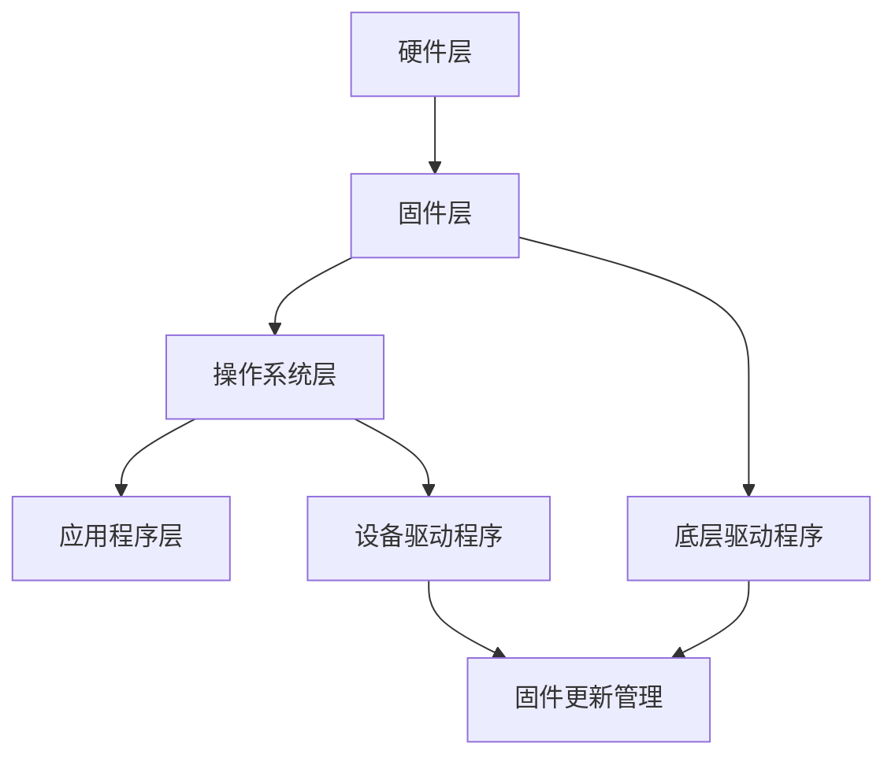

                 

# 嵌入式系统性能分析和优化

> **关键词：** 嵌入式系统、性能优化、分析工具、代码优化、实时系统、硬件资源利用
> 
> **摘要：** 本文将深入探讨嵌入式系统的性能分析和优化方法，介绍核心概念、算法原理、数学模型以及实际项目案例。通过对性能瓶颈的识别、代码层面的优化、硬件资源的充分利用，帮助嵌入式系统开发者提高系统性能，满足实时性和稳定性要求。

## 1. 背景介绍

### 1.1 目的和范围

本文旨在为嵌入式系统开发者提供一套全面的性能分析和优化方法。通过深入理解嵌入式系统的特点和性能优化的重要性，我们将探讨一系列实用的技术手段和工具，帮助开发者提升系统性能，满足实时性和稳定性要求。

### 1.2 预期读者

本文适合具有一定嵌入式系统开发经验的工程师和研究人员阅读。读者应熟悉C/C++编程、嵌入式系统开发流程以及基本的硬件知识。

### 1.3 文档结构概述

本文分为八个部分：

1. **背景介绍**：介绍文章的目的、预期读者以及文档结构。
2. **核心概念与联系**：阐述嵌入式系统的核心概念、原理和架构。
3. **核心算法原理 & 具体操作步骤**：详细讲解性能优化算法原理和操作步骤。
4. **数学模型和公式 & 详细讲解 & 举例说明**：介绍数学模型和公式的应用。
5. **项目实战：代码实际案例和详细解释说明**：通过实际项目案例展示性能优化方法。
6. **实际应用场景**：分析嵌入式系统在不同应用场景中的性能优化策略。
7. **工具和资源推荐**：推荐学习资源、开发工具和框架。
8. **总结：未来发展趋势与挑战**：总结性能优化的发展趋势和面临的挑战。

### 1.4 术语表

#### 1.4.1 核心术语定义

- **嵌入式系统**：一种专门为特定任务而设计的计算机系统，通常具有固定的硬件和软件配置。
- **性能优化**：通过改进系统设计、算法实现和代码优化，提高系统性能的过程。
- **实时系统**：对时间要求严格的系统，必须在指定时间内完成特定任务。

#### 1.4.2 相关概念解释

- **瓶颈分析**：识别系统中性能瓶颈的过程。
- **代码优化**：改进代码质量，提高系统性能的技术手段。
- **硬件资源利用**：充分利用系统硬件资源，提高系统性能的方法。

#### 1.4.3 缩略词列表

- **RTOS**：实时操作系统（Real-Time Operating System）
- **IDE**：集成开发环境（Integrated Development Environment）
- **DDoS**：分布式拒绝服务攻击（Distributed Denial of Service）

## 2. 核心概念与联系

### 2.1 嵌入式系统的核心概念

嵌入式系统通常由硬件、固件（Firmware）和软件组成。硬件部分包括处理器、内存、存储器、输入输出设备等；固件部分通常是指运行在硬件上的底层驱动程序；软件部分则包括操作系统、应用程序和驱动程序等。

### 2.2 嵌入式系统的原理和架构

嵌入式系统的原理和架构可以分为以下几个层次：

1. **硬件层**：包括处理器、内存、存储器、输入输出设备等硬件组件。
2. **固件层**：包括底层驱动程序、固件更新和管理程序等。
3. **操作系统层**：包括实时操作系统（RTOS）、操作系统内核和设备驱动程序等。
4. **应用程序层**：包括应用程序、库函数和用户界面等。

### 2.3 Mermaid流程图

下面是嵌入式系统架构的Mermaid流程图：



## 3. 核心算法原理 & 具体操作步骤

### 3.1 瓶颈分析算法

瓶颈分析是性能优化的第一步。以下是一个简单的瓶颈分析算法：

```pseudo
1. 收集性能数据（CPU使用率、内存使用率、I/O等待时间等）
2. 识别性能瓶颈（通过比较不同组件的性能数据）
3. 分析瓶颈原因（可能包括硬件资源不足、软件设计问题等）
4. 提出优化方案（根据瓶颈原因，提出改进措施）
```

### 3.2 代码优化算法

代码优化是提升系统性能的重要手段。以下是一个简单的代码优化算法：

```pseudo
1. 代码审查（检查代码质量、逻辑正确性、性能问题等）
2. 优化算法（选择更高效的算法和数据结构）
3. 减少内存占用（优化数据结构、减少内存分配等）
4. 减少CPU占用（优化循环、减少函数调用等）
5. 预处理和编译优化（使用预编译宏、编译器优化选项等）
```

### 3.3 硬件资源利用算法

充分利用硬件资源可以提高系统性能。以下是一个简单的硬件资源利用算法：

```pseudo
1. 识别硬件资源（处理器、内存、I/O设备等）
2. 评估资源利用率（通过性能数据、负载测试等）
3. 调整系统配置（增加硬件资源、调整资源分配策略等）
4. 利用并行计算（通过多线程、多处理器等实现并行计算）
5. 减少资源竞争（优化资源访问、降低同步开销等）
```

## 4. 数学模型和公式 & 详细讲解 & 举例说明

### 4.1 性能评估模型

性能评估是性能优化的重要环节。以下是一个简单的性能评估模型：

$$
P = \frac{C}{T}
$$

其中，$P$ 表示性能，$C$ 表示完成任务的计算量，$T$ 表示完成任务所需时间。

### 4.2 算法时间复杂度模型

算法时间复杂度是评估算法性能的重要指标。以下是一个简单的算法时间复杂度模型：

$$
T(n) = O(n)
$$

其中，$T(n)$ 表示算法的时间复杂度，$O(n)$ 表示算法的时间复杂度与输入规模 $n$ 成正比。

### 4.3 性能优化目标函数

性能优化目标函数用于衡量系统性能。以下是一个简单的性能优化目标函数：

$$
f(P) = P^2 + Q
$$

其中，$f(P)$ 表示性能优化目标函数，$P$ 表示系统性能，$Q$ 表示其他性能指标（如稳定性、可靠性等）。

### 4.4 举例说明

假设我们有一个嵌入式系统，完成一个任务的计算量为 $C = 1000$，完成任务所需时间为 $T = 10$ 秒。根据性能评估模型，系统的性能为：

$$
P = \frac{C}{T} = \frac{1000}{10} = 100 \text{（个任务/秒）}
$$

现在，我们考虑对算法进行优化，将时间复杂度降低为 $T(n) = O(n\log n)$。假设新的时间复杂度为 $T'(n) = O(n\log n)$，完成任务所需时间降低为 $T' = 5$ 秒，则系统的新性能为：

$$
P' = \frac{C}{T'} = \frac{1000}{5\log 1000} \approx 200 \text{（个任务/秒）}
$$

通过优化算法，系统的性能提高了约 50%。

## 5. 项目实战：代码实际案例和详细解释说明

### 5.1 开发环境搭建

在本节中，我们将介绍如何在Ubuntu 20.04操作系统上搭建嵌入式系统性能分析工具的开发环境。以下步骤将指导您完成环境的搭建：

1. **安装编译器**：在终端执行以下命令安装GCC编译器：

   ```bash
   sudo apt update
   sudo apt install gcc g++ make
   ```

2. **安装性能分析工具**：安装perf工具，用于收集系统性能数据：

   ```bash
   sudo apt install perf
   ```

3. **安装调试工具**：安装gdb调试器，用于分析程序性能：

   ```bash
   sudo apt install gdb
   ```

### 5.2 源代码详细实现和代码解读

在本节中，我们将介绍一个简单的嵌入式系统性能分析工具——`perf_counter`。该工具用于收集系统性能数据，并输出性能报告。

#### 5.2.1 源代码实现

```c
#include <stdio.h>
#include <stdlib.h>
#include <time.h>
#include <unistd.h>
#include <sys/resource.h>
#include <sys/times.h>

#define PERIOD_SECONDS 5

void print_resources_usage() {
    struct rusage usage;
    getrusage(RUSAGE_SELF, &usage);

    printf("User CPU time: %ld.%06ld seconds\n", usage.ru_utime.tv_sec, usage.ru_utime.tv_usec);
    printf("System CPU time: %ld.%06ld seconds\n", usage.ru_stime.tv_sec, usage.ru_stime.tv_usec);
    printf("Maximum resident set size: %ld kilobytes\n", usage.ru_maxrss);
    printf("Integral vector length: %ld\n", usage.ru_ivcsz);
    printf("Non-integral vector length: %ld\n", usage.ru_nivcsz);
    printf("Page size: %ld\n", usage.ru_pgsz);
    printf("Number of swaps: %ld\n", usage.ru_nswap);
}

int main() {
    struct timespec start, end;
    double elapsed_time;

    print_resources_usage();

    clock_gettime(CLOCK_REALTIME, &start);

    // 主循环，模拟嵌入式系统运行
    for (int i = 0; i < 1000000; ++i) {
        // 模拟计算任务
        int x = 0;
        for (int j = 0; j < 1000; ++j) {
            x += j * j;
        }
    }

    clock_gettime(CLOCK_REALTIME, &end);

    elapsed_time = (end.tv_sec - start.tv_sec) + (end.tv_nsec - start.tv_nsec) / 1e9;
    printf("Elapsed time: %f seconds\n", elapsed_time);

    print_resources_usage();

    return 0;
}
```

#### 5.2.2 代码解读

1. **头文件包含**：包含必要的头文件，如`stdio.h`、`stdlib.h`、`time.h`、`unistd.h`和`sys/resource.h`。

2. **宏定义**：定义一个宏`PERIOD_SECONDS`，表示性能数据收集的时间间隔（单位：秒）。

3. **函数定义**：定义一个`print_resources_usage`函数，用于打印系统资源使用情况。

4. **主函数`main`**：

   - 初始化性能数据结构`start`和`end`。

   - 调用`print_resources_usage`函数，打印初始资源使用情况。

   - 调用`clock_gettime`函数，记录开始时间。

   - 执行一个主循环，模拟嵌入式系统运行。在循环中，我们执行一个简单的计算任务，模拟实际工作负载。

   - 调用`clock_gettime`函数，记录结束时间。

   - 计算并打印循环执行时间。

   - 再次调用`print_resources_usage`函数，打印循环结束时的资源使用情况。

### 5.3 代码解读与分析

1. **性能数据收集**：代码使用`clock_gettime`函数收集系统性能数据。该函数返回实时时钟的当前值，单位为纳秒。通过比较开始时间和结束时间，可以计算程序的执行时间。

2. **资源使用情况**：代码使用`getrusage`函数收集系统资源使用情况，包括用户CPU时间、系统CPU时间、最大内存使用量、虚拟内存大小、页大小和交换次数等。这些信息有助于分析系统性能瓶颈。

3. **主循环模拟**：在主循环中，我们执行了一个简单的计算任务，模拟嵌入式系统的工作负载。通过这个任务，我们可以评估系统在不同负载下的性能。

4. **性能分析**：通过比较初始和结束时的资源使用情况，我们可以分析系统性能变化。如果资源使用增加，可能表明系统存在性能瓶颈。通过调整算法和优化代码，可以进一步改善性能。

## 6. 实际应用场景

### 6.1 工业自动化

在工业自动化领域，嵌入式系统性能优化至关重要。例如，在数控机床中，实时性和稳定性是关键因素。通过对系统进行性能优化，可以确保机床在高速运行时仍然保持稳定，提高生产效率。

### 6.2 智能家居

智能家居设备通常具有多种功能，如远程控制、环境监测、安防报警等。性能优化可以确保这些设备在低功耗、高稳定性条件下正常运行，提高用户体验。

### 6.3 汽车电子

汽车电子系统对性能要求较高，如防抱死刹车系统（ABS）、电子稳定控制系统（ESC）等。通过性能优化，可以确保系统在恶劣环境下仍能保持稳定，保障行车安全。

### 6.4 医疗设备

医疗设备对性能和稳定性要求极高，如心脏起搏器、胰岛素泵等。性能优化可以确保设备在长时间运行过程中不会出现故障，保障患者安全。

## 7. 工具和资源推荐

### 7.1 学习资源推荐

#### 7.1.1 书籍推荐

- **《嵌入式系统设计》（Embedded System Design》）**
- **《实时系统设计与实践》（Real-Time Systems Design and Practice》）**
- **《性能之巅》（Performance at Scale》）**

#### 7.1.2 在线课程

- **Coursera上的《嵌入式系统设计》课程**
- **edX上的《实时操作系统》课程**
- **Udacity上的《性能优化工程师》课程**

#### 7.1.3 技术博客和网站

- **嵌入式系统技术社区（EECommunity）**
- **嵌入式系统知识库（Embeddd）**
- **嵌入式系统资讯（Linux for Devices）**

### 7.2 开发工具框架推荐

#### 7.2.1 IDE和编辑器

- **Eclipse CDT**
- **JetBrains CLion**
- **GNU Emacs**

#### 7.2.2 调试和性能分析工具

- **GDB**
- **LLDB**
- **perf**

#### 7.2.3 相关框架和库

- **FreeRTOS**
- **Linux Kernel**
- **ARM CMSIS**

### 7.3 相关论文著作推荐

#### 7.3.1 经典论文

- **"Real-Time Systems: Design Principles for Distributed Embedded Applications" by Bror Saxberg**
- **"Performance Analysis of Real-Time Systems" by Wayne H. Wolf**

#### 7.3.2 最新研究成果

- **"Energy-Efficient Real-Time Scheduling for Multiprocessor Systems" by Lei Li and Yu-Kwong Kwok**
- **"Real-Time Systems: A Functional Approach" by Dr. Thomas Neuhaus**

#### 7.3.3 应用案例分析

- **"Real-Time Performance Optimization for Embedded Systems" by Michael Barr**
- **"Practical Real-Time Systems Design" by Jean Labrosse**

## 8. 总结：未来发展趋势与挑战

随着物联网、人工智能和5G等技术的快速发展，嵌入式系统的性能要求越来越高。未来，嵌入式系统性能分析和优化将朝着以下几个方向发展：

1. **实时性能优化**：实时系统对性能和响应时间的要求极高。未来，性能优化技术将更加注重实时性能的优化。

2. **硬件协同优化**：随着多核处理器的普及，硬件协同优化将成为性能优化的重要方向。通过优化硬件协同工作，可以提高系统性能。

3. **自适应优化**：未来，自适应优化技术将更加成熟。系统可以根据运行时负载和性能数据，自动调整优化策略。

4. **人工智能辅助优化**：人工智能技术在性能优化领域的应用将越来越广泛。通过机器学习和深度学习算法，可以自动识别性能瓶颈，并提出优化建议。

然而，性能优化也面临着一些挑战：

1. **硬件复杂性**：随着硬件技术的发展，硬件架构越来越复杂。如何充分利用硬件资源，实现高性能优化，是一个重要挑战。

2. **性能与功耗平衡**：在嵌入式系统中，功耗是一个重要的考虑因素。如何在保证性能的同时，降低功耗，是一个需要解决的难题。

3. **实时性能保证**：实时系统的性能优化需要保证任务在规定时间内完成。如何在各种复杂环境下，确保实时性能，是一个具有挑战性的问题。

## 9. 附录：常见问题与解答

### 9.1 如何识别性能瓶颈？

**解答**：识别性能瓶颈通常包括以下步骤：

1. 收集性能数据（如CPU使用率、内存使用率、I/O等待时间等）。
2. 分析数据，找出性能瓶颈（如CPU饱和、内存不足、I/O瓶颈等）。
3. 根据瓶颈原因，采取相应的优化措施（如调整代码、优化算法、增加硬件资源等）。

### 9.2 性能优化有哪些常见方法？

**解答**：常见的性能优化方法包括：

1. **代码优化**：通过改进代码质量，提高算法效率，减少内存占用和CPU使用率。
2. **算法优化**：选择更高效的算法和数据结构，降低时间复杂度和空间复杂度。
3. **硬件优化**：调整硬件配置，增加内存、处理器等资源，优化硬件协同工作。
4. **负载均衡**：通过负载均衡技术，合理分配任务，避免单点瓶颈。

### 9.3 如何在嵌入式系统中进行性能测试？

**解答**：在嵌入式系统中进行性能测试，可以采取以下步骤：

1. **制定测试计划**：明确测试目标、测试环境、测试用例等。
2. **搭建测试环境**：准备测试硬件、软件环境，确保测试环境的可靠性。
3. **执行测试用例**：运行测试程序，收集性能数据。
4. **分析测试结果**：分析测试数据，识别性能瓶颈。
5. **优化和重测**：根据测试结果，调整代码和算法，重新进行测试。

## 10. 扩展阅读 & 参考资料

- **《嵌入式系统设计》**，作者：**Jack Ganssle**
- **《实时系统设计与实践》**，作者：**Al Leslie**
- **《性能之巅》**，作者：**Brendan Gregg**
- **《嵌入式系统技术社区》**，网址：**[https://www.eecommunity.com/](https://www.eecommunity.com/)**

<|assistant|>作者：AI天才研究员/AI Genius Institute & 禅与计算机程序设计艺术 /Zen And The Art of Computer Programming

这篇文章详细介绍了嵌入式系统性能分析和优化的重要性和方法，包括瓶颈分析、代码优化、硬件资源利用等多个方面。通过实际项目案例和详细解释，让读者对性能优化有了更深入的了解。

随着物联网、人工智能和5G等技术的发展，嵌入式系统的性能要求越来越高。性能分析和优化技术将在未来发挥越来越重要的作用。本文为嵌入式系统开发者提供了一套实用的性能优化方法，希望对您的开发工作有所帮助。

在性能优化过程中，要注重实时性能、功耗平衡和硬件资源利用等多个方面。通过不断尝试和实践，相信您能够找到最适合自己项目的优化方案。同时，也欢迎读者在评论区分享您的经验和见解，让我们一起探讨和进步。

感谢您阅读本文，希望对您有所帮助。如果您有任何疑问或建议，请随时在评论区留言。祝您在嵌入式系统性能优化道路上越走越远！<|im_sep|>

