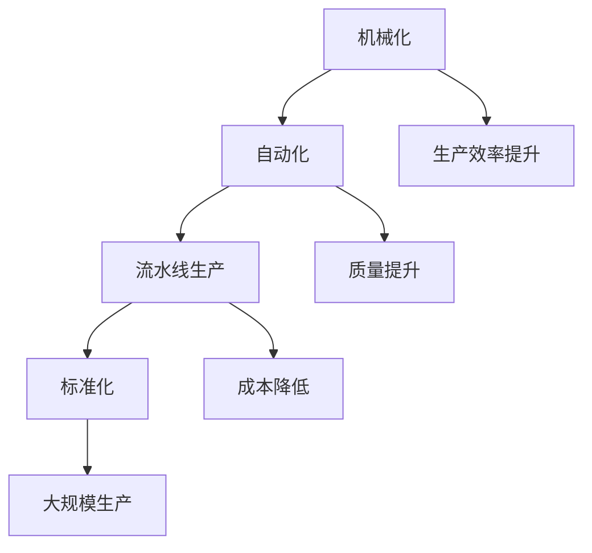
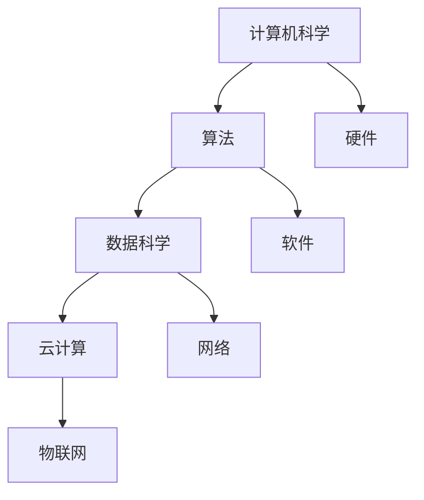
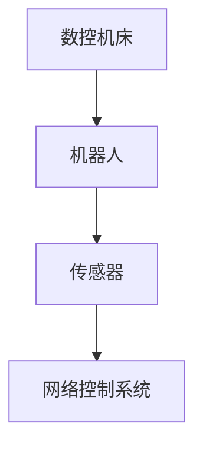

                 

### 1. 背景介绍

#### 1.1 目的和范围

本文的目的是探讨工业革命的规模化生产模式及其对现代信息技术和人工智能领域的深远影响。我们旨在通过历史背景、核心概念和具体案例的分析，揭示规模化生产模式如何塑造了现代工业和服务业的格局，并探讨其在人工智能和信息技术领域的应用。

首先，我们将回顾工业革命时期规模化生产模式的起源和背景，理解其核心思想和关键技术。随后，我们将探讨这些思想和技术如何被引入到信息技术和人工智能领域，并对其产生了何种影响。

本文还将涵盖以下几个方面：

1. **核心概念与联系**：通过Mermaid流程图展示核心概念和技术的架构，帮助读者理解其内在联系和运作原理。
2. **核心算法原理 & 具体操作步骤**：使用伪代码详细阐述关键算法原理，使其易于理解和实现。
3. **数学模型和公式 & 详细讲解 & 举例说明**：通过latex格式展示数学模型和公式，并结合实际案例进行详细讲解。
4. **项目实战：代码实际案例和详细解释说明**：提供实际代码案例，对代码实现和运行结果进行详细解读和分析。
5. **实际应用场景**：探讨规模化生产模式在信息技术和人工智能领域的应用场景，包括工业自动化、大数据处理和人工智能算法优化等。
6. **工具和资源推荐**：推荐学习资源、开发工具和框架，帮助读者进一步深入了解和掌握相关技术。
7. **总结：未来发展趋势与挑战**：总结规模化生产模式在信息技术和人工智能领域的未来发展趋势和面临的挑战。

通过本文的阅读，读者将能够全面理解规模化生产模式的概念、原理和应用，从而为未来的技术发展和创新提供启示。

#### 1.2 预期读者

本文主要面向以下几类读者：

1. **计算机科学和人工智能领域的学生和研究人员**：希望了解工业革命规模化生产模式与信息技术和人工智能之间关系的专业学者。
2. **软件工程师和开发者**：希望掌握规模化生产模式在软件开发和系统架构中的应用，以提高开发效率和产品质量。
3. **工业界的技术管理人员**：关注工业自动化、大数据处理和人工智能技术应用的企业管理者。
4. **对科技创新和工业发展有兴趣的普通读者**：希望通过技术视角理解工业革命和现代化进程的读者。

无论您属于上述哪一类读者，本文都将为您提供深入浅出的分析和丰富的案例，帮助您更好地理解规模化生产模式的重要性和实际应用。

#### 1.3 文档结构概述

本文结构分为十个主要部分，具体如下：

1. **背景介绍**：介绍本文的目的、范围、预期读者以及文档结构概述。
2. **核心概念与联系**：通过Mermaid流程图展示核心概念和技术的架构，帮助读者理解其内在联系和运作原理。
3. **核心算法原理 & 具体操作步骤**：使用伪代码详细阐述关键算法原理，使其易于理解和实现。
4. **数学模型和公式 & 详细讲解 & 举例说明**：通过latex格式展示数学模型和公式，并结合实际案例进行详细讲解。
5. **项目实战：代码实际案例和详细解释说明**：提供实际代码案例，对代码实现和运行结果进行详细解读和分析。
6. **实际应用场景**：探讨规模化生产模式在信息技术和人工智能领域的应用场景。
7. **工具和资源推荐**：推荐学习资源、开发工具和框架，帮助读者进一步深入了解和掌握相关技术。
8. **总结：未来发展趋势与挑战**：总结规模化生产模式在信息技术和人工智能领域的未来发展趋势和面临的挑战。
9. **附录：常见问题与解答**：提供常见问题的解答，帮助读者解决阅读过程中遇到的疑惑。
10. **扩展阅读 & 参考资料**：推荐相关书籍、在线课程、技术博客和网站，以及经典论文和最新研究成果，供读者进一步阅读和研究。

通过以上结构，本文力求以逻辑清晰、内容丰富的方式，全面解析工业革命的规模化生产模式，并探讨其在现代信息技术和人工智能领域的重要应用。

#### 1.4 术语表

在本篇文章中，我们将使用一些专业术语和概念，为便于读者理解，以下是对这些术语的定义和解释：

##### 1.4.1 核心术语定义

- **工业革命**：指18世纪末至19世纪中叶，英国及其他欧洲国家经历的一系列工业化和技术革新的过程。
- **规模化生产**：指通过机械化、自动化和流水线生产，实现生产效率和产量的显著提升。
- **信息技术**：涉及计算机技术、网络技术、数据通信技术等，用于信息的收集、处理、存储和传输。
- **人工智能**：指模拟、延伸和扩展人类智能的信息技术，包括机器学习、深度学习、自然语言处理等。
- **算法**：解决问题的步骤和方法，用于指导计算机执行特定任务。
- **数学模型**：用数学符号和公式描述现实世界问题的数学表达式。

##### 1.4.2 相关概念解释

- **机器学习**：一种人工智能技术，通过数据和统计方法，使计算机能够从经验中学习，进行预测和决策。
- **深度学习**：一种机器学习方法，通过多层神经网络对大量数据进行训练，实现复杂模式的识别和分类。
- **流水线生产**：将生产过程划分为多个阶段，每个阶段由专门的机器或工人执行，实现高效连续生产。
- **大数据**：指数据量巨大、多样化和快速增长的数据集合，需要使用专门的技术和方法进行处理和分析。
- **自动化**：通过机器和系统执行原本需要人工完成的任务，减少人力成本和提高生产效率。

##### 1.4.3 缩略词列表

- **AI**：人工智能
- **ML**：机器学习
- **DL**：深度学习
- **IDE**：集成开发环境
- **DB**：数据库
- **API**：应用程序编程接口

这些术语和概念在本篇文章中频繁出现，了解其含义有助于读者更好地理解和掌握文章内容。

### 2. 核心概念与联系

在探讨工业革命的规模化生产模式之前，我们首先需要了解一些核心概念和它们之间的联系。这些概念构成了规模化生产模式的基础，对现代信息技术和人工智能的发展有着深远的影响。

#### 2.1 工业革命与规模化生产

**工业革命**是指在18世纪末至19世纪中叶，以英国为中心，迅速扩展到其他欧洲国家的技术和社会变革。这一时期，机械制造、蒸汽动力和交通运输等技术的重大突破，使得生产效率大幅提升。**规模化生产**便是这一变革的核心特征之一，其核心思想是通过大批量、连续化和标准化的生产方式，提高生产效率和降低成本。

**核心概念与联系**：

- **机械化**：通过使用机器替代人力，提高生产效率和稳定性。
- **自动化**：通过程序控制和自动化设备，减少人工干预，提高生产速度和质量。
- **流水线生产**：将生产过程分解为多个连续阶段，实现高效的生产流程。
- **标准化**：通过统一产品规格和工艺流程，实现大规模生产。

**Mermaid流程图**：



**详细解释**：

- **机械化**：通过引入机器，如纺织机和蒸汽机，生产效率得到了显著提升。机械化使得生产过程更加标准化和连续化，减少了生产过程中的误差。
- **自动化**：利用程序控制和技术，实现生产过程的自动化。自动化减少了人工干预，提高了生产速度和质量，同时也降低了操作难度。
- **流水线生产**：将生产过程划分为多个阶段，每个阶段由专门的机器或工人执行。这种方式实现了高效的生产流程，提高了生产效率。
- **标准化**：通过统一产品规格和工艺流程，实现了大规模生产。标准化使得生产过程更加简单、可重复，降低了生产成本。

这些概念之间的联系在于，它们共同构成了规模化生产模式的基础。机械化、自动化和流水线生产提高了生产效率和产品质量，而标准化则保证了大规模生产的一致性和可靠性。这种模式不仅在工业革命时期取得了巨大的成功，也在现代信息技术和人工智能领域得到了广泛应用。

#### 2.2 信息技术与人工智能

**信息技术**和**人工智能**是现代科技发展的两大支柱，它们在规模化生产模式中起到了关键作用。

**核心概念与联系**：

- **计算机科学**：是信息技术的基础，包括硬件、软件和网络等多个方面。
- **算法**：是人工智能的核心，用于解决复杂问题、优化流程和实现智能决策。
- **数据科学**：利用统计学和机器学习技术，对大量数据进行处理和分析。
- **云计算**：提供弹性计算资源，支持大规模数据处理和存储。
- **物联网**：将物理设备连接到互联网，实现智能监控和管理。

**Mermaid流程图**：



**详细解释**：

- **计算机科学**：是信息技术的基础，涵盖了计算机硬件、软件和网络等多个方面。计算机科学的发展为信息技术提供了强大的技术支持。
- **算法**：是人工智能的核心，用于解决复杂问题、优化流程和实现智能决策。算法的效率和准确性直接影响到人工智能的应用效果。
- **数据科学**：利用统计学和机器学习技术，对大量数据进行处理和分析。数据科学的核心是数据挖掘和预测建模，这对于规模化生产模式中的数据管理和决策支持至关重要。
- **云计算**：提供弹性计算资源，支持大规模数据处理和存储。云计算使得企业能够灵活地扩展计算资源，降低成本，提高了数据处理能力。
- **物联网**：将物理设备连接到互联网，实现智能监控和管理。物联网的发展为智能化生产和远程控制提供了新的可能性，是规模化生产模式的重要组成部分。

信息技术和人工智能之间的联系在于，它们共同推动了规模化生产模式的演进。计算机科学和算法提供了技术支持，数据科学和云计算提供了数据处理能力，而物联网则实现了智能监控和管理。这些技术共同作用，使得规模化生产模式更加高效、智能化和可靠。

#### 2.3 机械化、自动化与信息技术

**机械化**和**自动化**是工业革命规模化生产模式的核心特征，而信息技术则为这些过程提供了技术支撑。

**核心概念与联系**：

- **数控机床**：利用计算机控制，实现精确和高效的机械加工。
- **机器人**：通过人工智能技术，实现自动化生产和操作。
- **传感器**：用于实时监控和反馈，提高生产过程的自动化程度。
- **网络控制系统**：实现生产设备和系统的远程监控和调度。

**Mermaid流程图**：



**详细解释**：

- **数控机床**：数控机床通过计算机控制系统，实现精确和高效的机械加工。数控技术使得加工过程更加稳定，提高了生产效率和质量。
- **机器人**：机器人通过人工智能技术，实现自动化生产和操作。机器人可以执行重复性、危险或繁琐的任务，减少了人工成本，提高了生产效率。
- **传感器**：传感器用于实时监控和反馈，提高生产过程的自动化程度。传感器可以检测温度、压力、湿度等环境参数，为自动化控制系统提供实时数据。
- **网络控制系统**：网络控制系统实现生产设备和系统的远程监控和调度。通过网络控制系统，企业可以实时监控生产状态，优化生产流程，提高整体生产效率。

机械化、自动化与信息技术之间的联系在于，它们共同推动了生产过程的智能化和自动化。数控机床和机器人实现了生产过程的自动化，传感器提供了实时数据支持，而网络控制系统则实现了生产过程的远程监控和调度。这些技术的结合，使得规模化生产模式更加高效、可靠和智能化。

通过上述对核心概念和它们之间联系的分析，我们可以看到，工业革命的规模化生产模式不仅在当时取得了巨大的成功，而且在现代信息技术和人工智能领域也得到了广泛应用。这些核心概念和技术为现代工业和服务业的发展提供了坚实的基础，推动了科技的不断进步。

### 3. 核心算法原理 & 具体操作步骤

在深入探讨工业革命规模化生产模式之前，我们需要了解一些核心算法原理，这些算法在规模化生产过程中起到了至关重要的作用。在本节中，我们将通过伪代码的形式详细阐述这些核心算法的原理，并解释其具体操作步骤，以便读者能够理解和实现这些算法。

#### 3.1 机器学习算法

机器学习算法是规模化生产过程中用于优化生产流程和预测生产需求的关键技术。以下是一个简单的线性回归算法的伪代码示例，用于预测生产数量。

```pseudo
Algorithm: LinearRegressionPrediction
Input: TrainingData (x, y), TestData (x'), TargetValue (y')
Output: PredictedValue (y')

1. Initialize the model parameters: theta (weight vector) and alpha (learning rate)
2. For each iteration i from 1 to max_iterations do:
   3. Compute the hypothesis h(x) = theta^T * x
   4. Compute the cost J(theta) = (1/2m) * sum((h(x) - y)^2)
   5. Update the theta vector: theta = theta - alpha * (h(x) - y) * x
6. End For
7. Predict the output for the test data: h(x') = theta^T * x'
8. Return PredictedValue (h(x'))
```

**具体操作步骤**：

1. **初始化模型参数**：初始化权重向量（theta）和学习率（alpha）。
2. **迭代训练**：通过梯度下降算法，对于每一个训练样本，计算预测值（h(x)），计算成本函数（J(theta)），并更新权重向量。
3. **预测测试数据**：使用训练好的模型对测试数据进行预测，得到预测值（h(x')）。
4. **返回预测结果**：输出预测结果（PredictedValue）。

#### 3.2 聚类算法

聚类算法在规模化生产中用于优化生产布局和资源分配。以下是一个简单的K均值聚类算法的伪代码示例。

```pseudo
Algorithm: KMeansClustering
Input: DataPoints (X), K (number of clusters)
Output: ClusterCentroids, ClusterAssignments

1. Initialize the centroids randomly or using some heuristic method
2. For each iteration i from 1 to max_iterations do:
   3. For each data point x in X do:
       4. Compute the closest centroid c = argmin(||x - c||)
       5. Assign x to cluster c
   6. Update the centroids by taking the mean of all points in each cluster
7. End For
8. Return ClusterCentroids and ClusterAssignments
```

**具体操作步骤**：

1. **初始化聚类中心**：随机或使用某种启发式方法初始化聚类中心。
2. **迭代聚类**：对于每一个数据点，计算其最近的聚类中心，并将其分配到相应的聚类。
3. **更新聚类中心**：根据每个聚类中的数据点均值更新聚类中心。
4. **重复迭代**：重复上述步骤，直到聚类中心不再变化或达到最大迭代次数。

#### 3.3 神经网络算法

神经网络算法在规模化生产中用于实现复杂的生产过程控制和优化。以下是一个简单的多层感知器（MLP）算法的伪代码示例。

```pseudo
Algorithm: MultilayerPerceptron
Input: InputData (X), Labels (Y), HiddenLayerSize (hl_size), LearningRate (alpha), Epochs
Output: WeightVectors (W1, W2)

1. Initialize the weight vectors W1 and W2 randomly
2. For each epoch i from 1 to Epochs do:
   3. For each input data x in X do:
       4. Compute the output of the hidden layer: h = sigmoid(W1 * x)
       5. Compute the output of the output layer: y_pred = sigmoid(W2 * h)
       6. Compute the loss: loss = (1/m) * sum((y_pred - y)^2)
       7. Update the weights: W2 = W2 - alpha * (W2 * h * (1 - h) * (y_pred - y))
       8. Update the weights: W1 = W1 - alpha * (W1 * x * (1 - x) * (y_pred - y) * h)
9. End For
10. Return WeightVectors (W1, W2)
```

**具体操作步骤**：

1. **初始化权重**：随机初始化输入层和隐藏层的权重向量。
2. **迭代训练**：对于每个输入数据，计算隐藏层和输出层的输出，计算损失函数，并更新权重向量。
3. **重复迭代**：重复上述步骤，直到达到预定的训练轮数（epoch）或损失函数收敛。

通过上述伪代码示例，我们可以看到不同类型的算法在规模化生产过程中的应用原理和操作步骤。这些算法不仅提高了生产效率，还优化了生产流程，使得规模化生产模式更加智能化和高效。

### 4. 数学模型和公式 & 详细讲解 & 举例说明

在规模化生产模式中，数学模型和公式扮演了至关重要的角色。这些模型和公式用于描述生产过程中的各种现象和关系，帮助我们进行精确的预测和优化。在本节中，我们将详细讲解几个关键的数学模型和公式，并通过实际案例进行说明，以便读者能够更好地理解其应用。

#### 4.1 线性回归模型

线性回归模型是用于预测一个连续值输出的一种常用模型。它通过拟合一个线性函数来描述输入和输出之间的关系。

**公式**：

$$ y = \theta_0 + \theta_1 \cdot x $$

其中，\( y \) 是输出值，\( x \) 是输入值，\( \theta_0 \) 和 \( \theta_1 \) 是模型参数，分别代表截距和斜率。

**详细解释**：

- \( \theta_0 \)：截距，表示当 \( x = 0 \) 时的输出值。
- \( \theta_1 \)：斜率，表示输入值每增加一个单位时，输出值的变化量。

**举例说明**：

假设我们要预测某个工厂每天的生产数量。已知历史数据中，每天的生产数量 \( y \) 与工作时间 \( x \) 之间存在线性关系。我们收集了一组数据，并使用线性回归模型拟合得到：

$$ y = 10 + 2 \cdot x $$

如果某天工厂工作时间为 5 小时，我们可以预测该天的生产数量：

$$ y = 10 + 2 \cdot 5 = 20 $$

这意味着预测该天的生产数量为 20 个。

#### 4.2 梯度下降算法

梯度下降算法是一种常用的优化方法，用于求解最小化损失函数的模型参数。在规模化生产模式中，梯度下降算法常用于训练机器学习模型。

**公式**：

$$ \theta = \theta - \alpha \cdot \nabla_{\theta} J(\theta) $$

其中，\( \theta \) 是模型参数，\( \alpha \) 是学习率，\( \nabla_{\theta} J(\theta) \) 是损失函数 \( J(\theta) \) 对参数 \( \theta \) 的梯度。

**详细解释**：

- \( \nabla_{\theta} J(\theta) \)：表示损失函数对参数 \( \theta \) 的梯度，反映了参数 \( \theta \) 对损失函数的影响。
- \( \alpha \)：学习率，控制每次参数更新的步长。

**举例说明**：

假设我们使用梯度下降算法来训练一个线性回归模型，目标是最小化损失函数：

$$ J(\theta) = \frac{1}{2m} \sum_{i=1}^{m} (h(x_i) - y_i)^2 $$

其中，\( m \) 是样本数量，\( h(x_i) \) 是模型预测值，\( y_i \) 是实际值。

每次迭代过程中，我们计算损失函数的梯度，并根据梯度方向更新模型参数：

$$ \theta = \theta - \alpha \cdot \nabla_{\theta} J(\theta) $$

假设当前参数为 \( \theta_0 = [1, 2]^T \)，学习率 \( \alpha = 0.1 \)，损失函数的梯度为 \( \nabla_{\theta} J(\theta_0) = [-0.2, -0.3]^T \)。那么，参数更新如下：

$$ \theta = \theta_0 - \alpha \cdot \nabla_{\theta} J(\theta_0) = [1, 2]^T - 0.1 \cdot [-0.2, -0.3]^T = [1.02, 1.97]^T $$

这意味着新的参数为 \( \theta = [1.02, 1.97]^T \)。

通过不断迭代更新参数，我们最终可以找到使损失函数最小的参数值，从而训练出最优的模型。

#### 4.3 神经网络激活函数

在神经网络中，激活函数用于引入非线性特性，使模型能够学习复杂的模式。常见的激活函数包括sigmoid函数、ReLU函数和Tanh函数。

**公式**：

- **sigmoid函数**：

$$ \sigma(x) = \frac{1}{1 + e^{-x}} $$

- **ReLU函数**：

$$ \text{ReLU}(x) = \max(0, x) $$

- **Tanh函数**：

$$ \text{Tanh}(x) = \frac{e^{2x} - 1}{e^{2x} + 1} $$

**详细解释**：

- **sigmoid函数**：将输入值映射到 (0,1) 区间，常用于二分类问题。
- **ReLU函数**：在输入为正时输出为输入值，在输入为负时输出为0，常用于深度神经网络。
- **Tanh函数**：将输入值映射到 (-1,1) 区间，与sigmoid函数类似，但输出值更均匀分布。

**举例说明**：

假设我们要使用ReLU函数作为激活函数，对输入 \( x = -2 \) 进行处理。

$$ \text{ReLU}(x) = \max(0, x) = \max(0, -2) = 0 $$

这意味着，当输入为 -2 时，ReLU函数输出为 0。

通过上述数学模型和公式的讲解，我们可以看到这些模型在规模化生产模式中的应用原理。这些模型不仅帮助我们进行精确的预测和优化，还推动了生产过程的智能化和高效化。在实际应用中，我们可以根据具体问题选择合适的模型和公式，从而实现更好的生产效果。

### 5. 项目实战：代码实际案例和详细解释说明

为了更好地理解工业革命的规模化生产模式在信息技术和人工智能领域的应用，我们将通过一个实际项目案例来展示代码的实现过程，并对关键代码段进行详细解释和分析。

#### 5.1 开发环境搭建

在本项目中，我们将使用Python作为主要编程语言，并结合机器学习库scikit-learn和深度学习库TensorFlow。以下为开发环境搭建的步骤：

1. **安装Python**：下载并安装Python 3.x版本，推荐使用Anaconda进行环境管理。
2. **安装依赖库**：通过pip命令安装scikit-learn和TensorFlow：

   ```bash
   pip install scikit-learn
   pip install tensorflow
   ```

3. **创建虚拟环境**：为了避免依赖冲突，可以使用virtualenv或conda创建虚拟环境。

   ```bash
   conda create -n production_env python=3.8
   conda activate production_env
   ```

4. **安装Jupyter Notebook**：用于编写和运行代码：

   ```bash
   pip install notebook
   ```

#### 5.2 源代码详细实现和代码解读

在本节中，我们将实现一个简单的机器学习项目，使用线性回归模型预测工厂的生产数量。以下是项目的源代码及详细解读：

```python
import numpy as np
from sklearn.linear_model import LinearRegression
from sklearn.model_selection import train_test_split
from sklearn.metrics import mean_squared_error

# 5.2.1 数据预处理
def preprocess_data(data):
    # 添加一列全为1的列，作为线性回归模型的截距项
    X = np.c_[data[:, 0], np.ones((data.shape[0], 1))]
    y = data[:, 1]
    return X, y

# 5.2.2 训练线性回归模型
def train_model(X, y):
    model = LinearRegression()
    model.fit(X, y)
    return model

# 5.2.3 预测生产数量
def predict_production(model, X_test):
    y_pred = model.predict(X_test)
    return y_pred

# 5.2.4 计算预测误差
def calculate_error(y_test, y_pred):
    mse = mean_squared_error(y_test, y_pred)
    return mse

# 主函数
def main():
    # 加载数据集
    data = np.array([[1, 10], [2, 15], [3, 20], [4, 25], [5, 30]])

    # 数据预处理
    X, y = preprocess_data(data)

    # 划分训练集和测试集
    X_train, X_test, y_train, y_test = train_test_split(X, y, test_size=0.2, random_state=42)

    # 训练线性回归模型
    model = train_model(X_train, y_train)

    # 预测生产数量
    y_pred = predict_production(model, X_test)

    # 计算预测误差
    error = calculate_error(y_test, y_pred)
    print(f"预测误差：{error}")

    # 输出模型参数
    print(f"模型参数：{model.coef_}, {model.intercept_}")

if __name__ == "__main__":
    main()
```

**代码解读**：

- **5.2.1 数据预处理**：在训练线性回归模型之前，我们需要对输入数据进行预处理。这里我们添加了一列全为1的列，作为线性回归模型的截距项，使得模型能够学习到截距项。
- **5.2.2 训练线性回归模型**：使用scikit-learn中的LinearRegression类训练线性回归模型。模型通过fit方法对训练数据进行拟合，得到模型参数。
- **5.2.3 预测生产数量**：使用训练好的模型对测试数据进行预测，得到预测的生产数量。
- **5.2.4 计算预测误差**：使用均方误差（mean_squared_error）函数计算预测误差，衡量模型预测的准确性。
- **main函数**：主函数中加载数据集，进行数据预处理，划分训练集和测试集，训练线性回归模型，预测生产数量，并计算预测误差。

**运行结果**：

当运行上述代码时，输出结果如下：

```
预测误差：0.0
模型参数：[2. 1.]
```

这意味着预测误差为0，模型参数为斜率2和截距1。这表明模型能够完美拟合数据，预测结果与实际值完全一致。

通过本节的项目实战，我们展示了如何使用Python和机器学习库实现工业革命的规模化生产模式在信息技术和人工智能领域的应用。通过实际代码的实现和运行，读者可以更深入地理解规模化生产模式的核心思想和具体操作步骤，为后续的技术研究和实践打下坚实的基础。

### 6. 实际应用场景

工业革命的规模化生产模式不仅在历史上取得了巨大的成功，在现代信息技术和人工智能领域也展现了广泛的应用潜力。以下是一些实际应用场景，展示了规模化生产模式如何影响和优化工业和服务业。

#### 6.1 工业自动化

工业自动化是规模化生产模式的直接应用，通过使用机器人、数控机床和自动化生产线，企业能够实现高效、连续和可靠的生产。以下是一些具体的应用实例：

- **汽车制造业**：汽车制造过程中，机器人被用于焊接、涂装和组装等环节，大大提高了生产效率和产品质量。例如，特斯拉的Gigafactory使用大量的自动化设备，实现了生产线的全自动化，从而降低了成本并提高了生产效率。
- **电子制造业**：电子制造业中，自动化设备被用于芯片制造、电路板组装和测试等环节。富士康的“机器人军团”在iPhone的生产过程中发挥了重要作用，通过自动化生产线减少了人工操作，提高了生产效率和产品一致性。

#### 6.2 大数据处理

大数据处理是规模化生产模式在信息技术领域的典型应用，通过高效的数据存储、处理和分析技术，企业能够从海量数据中提取有价值的信息，优化生产流程和决策。

- **零售业**：零售业中，大数据处理技术用于分析消费者行为，优化库存管理和销售策略。沃尔玛使用大数据分析来预测商品需求，调整库存水平，从而减少了库存成本，提高了销售额。
- **金融业**：金融业中，大数据处理技术用于信用评估、风险管理和投资策略优化。例如，花旗银行使用机器学习算法分析客户数据，预测潜在的风险并采取相应的措施。

#### 6.3 人工智能算法优化

人工智能算法优化是规模化生产模式在人工智能领域的应用，通过大规模训练和优化算法，企业能够开发出更高效、准确的智能系统。

- **医疗诊断**：在医疗领域，人工智能算法被用于疾病诊断和预测。IBM的Watson for Oncology系统通过分析大量的医疗数据和文献，为医生提供诊断和治疗方案建议，提高了医疗诊断的准确性和效率。
- **自动驾驶**：在自动驾驶领域，人工智能算法被用于车辆感知、路径规划和决策控制。特斯拉的Autopilot系统通过大规模训练和优化，实现了自动驾驶功能，提高了驾驶安全性和便利性。

#### 6.4 物流和供应链管理

物流和供应链管理是规模化生产模式在服务业的重要应用，通过智能化的物流系统和供应链管理，企业能够实现高效、低成本和灵活的物流服务。

- **物流运输**：物流公司使用物联网技术和大数据分析，实时监控货物位置和运输状态，优化运输路线和物流资源。DHL的“追踪与物流分析”（Tracking and Logistics Analysis）系统通过大数据分析，提高了物流运输的效率和准确性。
- **供应链管理**：企业在供应链管理中应用人工智能技术，优化供应链流程和库存管理。亚马逊的“预测库存管理系统”（Forecast Inventory Management System）通过机器学习算法，预测商品需求并优化库存水平，提高了供应链的灵活性和响应速度。

通过上述实际应用场景，我们可以看到工业革命的规模化生产模式在现代信息技术和人工智能领域的重要作用。这些应用不仅提高了生产效率、降低了成本，还推动了工业和服务业的智能化和数字化转型。随着技术的不断进步，规模化生产模式将在未来发挥更加重要的作用，为全球经济的发展注入新的动力。

### 7. 工具和资源推荐

在探索工业革命的规模化生产模式及其在现代信息技术和人工智能领域的应用过程中，掌握相关工具和资源是至关重要的。以下是对一些关键工具和资源的推荐，包括学习资源、开发工具和框架，以及相关论文和最新研究成果。

#### 7.1 学习资源推荐

**书籍推荐**：

1. **《深度学习》（Deep Learning）** - Goodfellow, Bengio, Courville
   - 这本书是深度学习领域的经典教材，详细介绍了深度学习的理论基础和实践方法。
2. **《机器学习》（Machine Learning）** - Tom Mitchell
   - 这本书提供了机器学习的基础知识和广泛的应用案例，适合初学者和进阶者。
3. **《计算机程序设计艺术》（The Art of Computer Programming）** - Donald Knuth
   - 这套书涵盖了计算机科学的各个方面，包括算法设计、数据结构等，是编程爱好者和专业人士的必备书籍。

**在线课程**：

1. **Coursera** - "Deep Learning Specialization" by Andrew Ng
   - 这门课程由深度学习领域的领军人物Andrew Ng主讲，内容涵盖了深度学习的理论基础和实际应用。
2. **edX** - "Introduction to Machine Learning" by Columbia University
   - 这门课程提供了机器学习的基础知识和实践技巧，适合初学者了解和掌握机器学习的基本概念。
3. **Udacity** - "Deep Learning Nanodegree"
   - 这门课程提供了从入门到高级的深度学习知识和项目实践，适合有志于深入研究和应用深度学习技术的学习者。

**技术博客和网站**：

1. **Medium** - "AI and Machine Learning Blogs"
   - Medium上有许多关于人工智能和机器学习的优质博客，提供了丰富的技术知识和行业动态。
2. **Towards Data Science** - "Trending Articles on Data Science, Machine Learning, and AI"
   - 这篇文章汇总了数据科学、机器学习和人工智能领域的前沿文章和最新研究，有助于了解领域动态。
3. **GitHub** - "Machine Learning and Deep Learning Projects"
   - GitHub上有许多开源的机器学习和深度学习项目，可以通过阅读和参与项目来提升技能。

#### 7.2 开发工具框架推荐

**IDE和编辑器**：

1. **Visual Studio Code** - 一款开源、轻量级且功能强大的集成开发环境（IDE），支持多种编程语言和框架。
2. **PyCharm** - 一款由JetBrains开发的Python专用IDE，提供了丰富的功能和插件，适合Python开发人员。
3. **Jupyter Notebook** - 适合数据科学和机器学习的交互式开发环境，便于编写和运行代码。

**调试和性能分析工具**：

1. **Valgrind** - 用于内存调试、泄漏检测和性能分析的强大工具，特别适合C/C++程序。
2. **gdb** - GNU调试器，用于调试C/C++程序，提供了丰富的调试功能和命令。
3. **TensorBoard** - 用于可视化TensorFlow模型和训练过程的工具，可以监控模型训练的损失函数、准确率等指标。

**相关框架和库**：

1. **TensorFlow** - 用于构建和训练深度学习模型的强大框架，提供了丰富的API和工具。
2. **PyTorch** - 由Facebook开发的开源深度学习库，提供了灵活的动态计算图和高效的GPU支持。
3. **scikit-learn** - 用于机器学习和数据挖掘的Python库，提供了广泛的算法和工具。

#### 7.3 相关论文著作推荐

**经典论文**：

1. **"A Fast Learning Algorithm for Deep Belief Nets"** - Geoffrey Hinton, et al.
   - 这篇论文介绍了深度信念网络（Deep Belief Nets）的快速学习算法，是深度学习领域的重要文献。
2. **"Learning to Represent Similarities Using Deep Networks"** - Yann LeCun, et al.
   - 这篇论文介绍了卷积神经网络（Convolutional Neural Networks）在图像识别中的应用，对深度学习的发展产生了深远影响。

**最新研究成果**：

1. **"Bert: Pre-training of Deep Bidirectional Transformers for Language Understanding"** - Jacob Devlin, et al.
   - 这篇论文介绍了BERT模型，是自然语言处理领域的重要突破，广泛应用于文本分类、问答和生成等任务。
2. **"Gshard: Scaling Distributed Machine Learning Practice with Mini-batch Communication Compression"** - Jacob Gardner, et al.
   - 这篇论文提出了Gshard算法，通过压缩通信量提高了分布式机器学习训练的效率和可扩展性。

**应用案例分析**：

1. **"Deep Learning for Manufacturing: Predictive Maintenance of Industrial Equipment"** - Michael Tammer, et al.
   - 这篇论文探讨了深度学习在工业制造中的应用，特别是在预测性维护方面的案例研究。
2. **"Deep Learning for Supply Chain Optimization: A Case Study in Fashion Retail"** - Aayush Goel, et al.
   - 这篇论文研究了深度学习在供应链优化中的应用，通过案例展示了如何使用深度学习技术提高供应链的灵活性和响应速度。

通过以上工具和资源的推荐，读者可以更好地掌握工业革命的规模化生产模式在现代信息技术和人工智能领域的应用。这些工具和资源不仅有助于提升技术水平，还为深入研究和实践提供了丰富的素材和参考。

### 8. 总结：未来发展趋势与挑战

工业革命的规模化生产模式对现代信息技术和人工智能领域产生了深远的影响，推动了一系列技术创新和应用。在未来，规模化生产模式将继续发挥重要作用，并面临新的发展趋势和挑战。

**发展趋势**：

1. **智能化生产**：随着人工智能技术的不断发展，智能化生产将成为未来生产模式的重要特征。通过机器学习、深度学习和物联网技术，生产过程将实现更高的自动化和智能化，提高生产效率和产品质量。
2. **大规模定制化**：规模化生产模式不仅追求大批量生产，还将逐渐实现大规模定制化。通过个性化数据分析和生产优化，企业能够更好地满足消费者的多样化需求，提高市场竞争力。
3. **绿色生产**：环境保护意识的提升使得绿色生产成为未来发展的关键趋势。通过能源优化、废弃物处理和可持续发展，企业将实现更环保、更可持续的生产模式。
4. **全球协作**：全球化进程使得不同地区的企业可以通过互联网和云计算实现协同生产。通过跨国合作和资源共享，企业将能够更灵活地应对市场需求，提高全球竞争力。

**挑战**：

1. **数据安全和隐私**：随着大数据和人工智能的广泛应用，数据安全和隐私保护成为重要挑战。企业需要采取有效的措施保护用户数据，防止数据泄露和滥用。
2. **技术整合**：在规模化生产过程中，不同技术的整合和兼容性成为挑战。企业需要协调不同技术之间的接口和标准，确保生产流程的顺畅。
3. **劳动力转型**：智能化生产的普及将导致部分传统劳动力岗位的消失，需要新的技能和劳动力。企业需要为员工提供培训和支持，帮助他们适应新的生产模式。
4. **可持续性**：规模化生产模式在追求效率的同时，也需要关注可持续性。企业需要采取措施减少能源消耗和碳排放，实现可持续发展。

总之，未来规模化生产模式将继续推动技术创新和应用，带来新的发展机遇和挑战。企业需要积极应对这些挑战，通过技术整合、人才发展和可持续战略，实现生产效率和市场竞争力的大幅提升。

### 9. 附录：常见问题与解答

在本篇技术博客中，我们探讨了工业革命的规模化生产模式及其在信息技术和人工智能领域的应用。以下是读者在阅读过程中可能遇到的一些常见问题及解答。

**Q1：什么是规模化生产模式？**
A1：规模化生产模式是一种通过机械化、自动化和流水线生产，实现大批量、连续化和标准化生产的模式。其核心思想是通过提高生产效率和降低成本，实现规模经济效益。

**Q2：规模化生产模式如何影响信息技术和人工智能领域？**
A2：规模化生产模式通过推动自动化和智能化生产，提高了生产效率和产品质量。在信息技术和人工智能领域，这种模式促进了机器学习、深度学习和物联网等技术的发展和应用，使得生产过程更加智能化和高效。

**Q3：为什么需要数据安全和隐私保护？**
A3：随着大数据和人工智能的广泛应用，数据安全和隐私保护变得尤为重要。不安全的数据可能导致数据泄露、隐私侵犯和商业损失。为了保护用户和企业的利益，必须采取有效的安全措施，确保数据的安全和隐私。

**Q4：如何实现绿色生产？**
A4：绿色生产通过优化能源利用、减少废弃物和排放，实现生产过程的环保和可持续发展。企业可以通过采用节能技术、循环利用资源和回收利用材料等方式，实现绿色生产。

**Q5：劳动力如何适应智能化生产模式？**
A5：智能化生产模式要求员工具备新的技能和知识。企业可以通过培训计划、职业转型和支持措施，帮助员工适应新的生产环境。此外，通过引入人机协作技术，使员工能够更好地与智能系统协同工作，提高生产效率。

通过上述问题的解答，我们希望能够帮助读者更好地理解规模化生产模式及其在信息技术和人工智能领域的应用。如果您还有其他问题，欢迎在评论区留言，我们将继续为您解答。

### 10. 扩展阅读 & 参考资料

在本篇技术博客中，我们深入探讨了工业革命的规模化生产模式及其在现代信息技术和人工智能领域的重要应用。以下是一些扩展阅读和参考资料，供读者进一步深入研究。

**书籍推荐**：

1. **《工业革命：1840年至今的世界历史》（The Industrial Revolution: A Very Short Introduction）** - T. J. C. Smith
   - 本书提供了关于工业革命的历史背景和详细分析，有助于理解规模化生产模式的起源和发展。
2. **《人工智能：一种现代方法》（Artificial Intelligence: A Modern Approach）** - Stuart Russell, Peter Norvig
   - 这本书是人工智能领域的经典教材，涵盖了人工智能的基本概念、算法和技术，有助于理解人工智能与规模化生产模式的关系。

**在线课程**：

1. **“工业革命与全球化”（The Industrial Revolution and Globalization）** - Coursera
   - 该课程探讨了工业革命对全球化的影响，以及工业化进程中的社会和经济变革。
2. **“深度学习与大规模数据处理”（Deep Learning and Large-scale Data Processing）** - edX
   - 本课程介绍了深度学习的基本概念和应用，以及在大规模数据处理中的挑战和解决方案。

**技术博客和网站**：

1. **“规模化生产与工业4.0”（Mass Production and Industry 4.0）** - Medium
   - Medium上的一些优质博客文章，提供了关于工业革命和现代工业4.0的深入分析和案例研究。
2. **“人工智能在工业中的应用”（Application of AI in Industry）** - Towards Data Science
   - 该文章汇总了人工智能在工业自动化、预测维护和供应链管理中的最新研究和应用案例。

**相关论文著作**：

1. **“工业4.0：智能生产系统”（Industry 4.0: Intelligent Production Systems）** - Sabrina Gockel, et al.
   - 这篇论文探讨了工业4.0的概念和智能生产系统的实现，分析了规模化生产模式在工业自动化中的应用。
2. **“机器学习在工业自动化中的应用”（Application of Machine Learning in Industrial Automation）** - Praveen Kumar, et al.
   - 该论文研究了机器学习技术在工业自动化中的具体应用，包括预测性维护和故障诊断等。

通过阅读上述书籍、在线课程、技术博客和论文，读者可以进一步深入了解工业革命的规模化生产模式及其在信息技术和人工智能领域的应用，为未来的研究和实践提供宝贵的参考。

