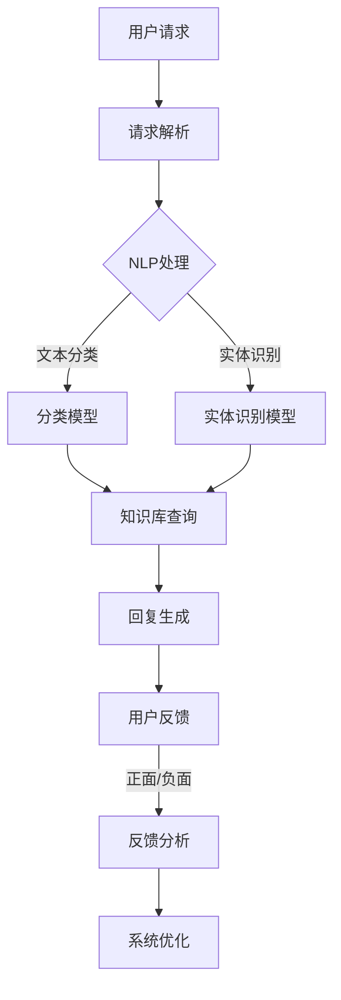
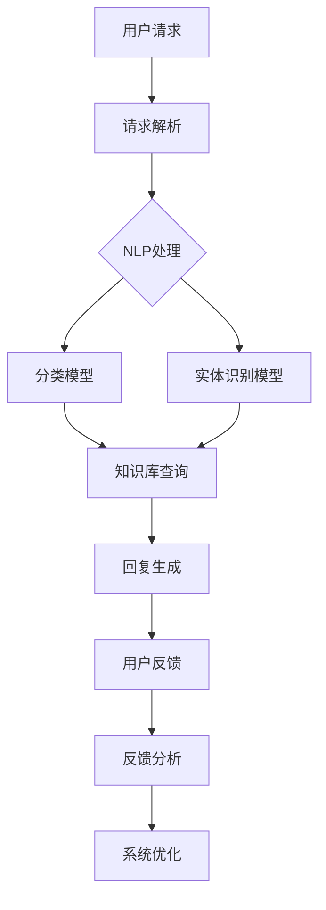

                 

# 工具使用机制在智能客服系统中的应用

> 关键词：智能客服系统、工具使用机制、用户行为分析、自然语言处理、多渠道集成、用户体验优化

> 摘要：本文旨在深入探讨工具使用机制在智能客服系统中的应用。通过分析智能客服系统的核心功能、技术架构、算法原理及数学模型，结合实际项目案例，本文将为读者提供关于如何优化智能客服系统的工具使用机制的有价值见解。文章还将推荐相关学习资源和开发工具，总结未来发展趋势与挑战，以期为智能客服系统的研究与应用提供参考。

## 1. 背景介绍

### 1.1 目的和范围

智能客服系统是现代企业实现客户服务自动化和高效化的重要工具。本文旨在研究工具使用机制在智能客服系统中的应用，从而提升系统的智能程度和用户体验。具体范围包括以下几个方面：

1. 智能客服系统的基本概念与功能。
2. 工具使用机制的核心组成部分及其在系统中的角色。
3. 智能客服系统的技术架构和算法原理。
4. 工具使用机制在实际项目中的应用案例。
5. 相关学习资源和开发工具的推荐。

### 1.2 预期读者

本文预期读者包括：

1. 智能客服系统的开发者与架构师。
2. 对人工智能和自然语言处理感兴趣的技术爱好者。
3. 企业管理人员，特别是那些希望提升客户服务水平的决策者。

### 1.3 文档结构概述

本文的结构如下：

1. 背景介绍：介绍智能客服系统和工具使用机制的概念。
2. 核心概念与联系：阐述智能客服系统的核心概念和技术架构。
3. 核心算法原理 & 具体操作步骤：讲解智能客服系统中的关键算法和操作流程。
4. 数学模型和公式 & 详细讲解 & 举例说明：介绍智能客服系统中的数学模型和应用实例。
5. 项目实战：代码实际案例和详细解释说明。
6. 实际应用场景：探讨智能客服系统的应用领域和场景。
7. 工具和资源推荐：推荐相关学习资源和开发工具。
8. 总结：未来发展趋势与挑战。
9. 附录：常见问题与解答。
10. 扩展阅读 & 参考资料：提供进一步阅读和研究的参考资料。

### 1.4 术语表

#### 1.4.1 核心术语定义

- 智能客服系统：一种利用人工智能技术，实现自动化客户服务响应和问题解决的系统。
- 工具使用机制：智能客服系统中用于管理和调用各种工具和资源的机制。
- 自然语言处理（NLP）：使计算机能够理解、解释和生成人类语言的技术。
- 机器学习（ML）：通过数据训练模型，使计算机能够进行预测和决策的技术。
- 用户体验（UX）：用户在使用产品或服务时的主观感受和满意度。

#### 1.4.2 相关概念解释

- 自动化：通过预定义的规则或算法，减少人工干预的过程。
- 客户服务：企业为满足客户需求提供的服务和支持。
- 交互界面：用户与系统进行交互的界面和方式。

#### 1.4.3 缩略词列表

- NLP：自然语言处理
- ML：机器学习
- UX：用户体验
- API：应用程序编程接口

## 2. 核心概念与联系

在深入了解智能客服系统的工具使用机制之前，我们需要明确几个核心概念和技术架构。以下是一个简化的Mermaid流程图，用于描述智能客服系统的核心概念和联系：



### 2.1 智能客服系统的核心组成部分

智能客服系统主要由以下几个部分组成：

- **请求解析**：用户通过多种渠道（如网站、APP、社交媒体等）发送请求。系统需要解析这些请求，提取关键信息，如关键词、意图、实体等。
- **NLP处理**：自然语言处理技术用于理解用户的请求。这包括文本分类、实体识别、意图识别等。
- **知识库查询**：智能客服系统依赖于一个庞大的知识库，用于回答用户的问题。知识库中的信息是系统决策的基础。
- **回复生成**：根据请求解析和知识库查询的结果，系统生成合适的回复。
- **用户反馈**：用户对回复的反馈有助于系统不断优化和提高服务质量。

### 2.2 工具使用机制在系统中的作用

工具使用机制在智能客服系统中起着至关重要的作用。以下是其核心作用：

- **资源管理**：系统需要高效地管理各种资源，如语言模型、知识库、算法等。
- **灵活性**：工具使用机制使得系统能够根据不同的需求和场景灵活调用各种工具。
- **性能优化**：通过优化工具的使用，系统可以提高响应速度和处理效率。

### 2.3 技术架构的简化描述

以下是一个简化的技术架构描述，用于展示智能客服系统中的关键组件和它们之间的联系：



## 3. 核心算法原理 & 具体操作步骤

智能客服系统的核心在于其算法原理和操作步骤。以下是一个详细的伪代码描述，用于阐述系统中的关键算法和操作流程。

### 3.1 请求解析

```python
def parse_request(request):
    # 提取关键词和意图
    keywords = extract_keywords(request)
    intent = recognize_intent(keywords)
    # 提取实体信息
    entities = extract_entities(request)
    return keywords, intent, entities
```

### 3.2 NLP处理

```python
def nlp_processing(keywords, intent, entities):
    # 文本分类
    category = classify_text(keywords)
    # 实体识别
    entities = recognize_entities(entities)
    # 意图识别
    intent = recognize_intent(keywords)
    return category, entities, intent
```

### 3.3 知识库查询

```python
def query_knowledge_base(category, entities, intent):
    # 查询知识库
    response = knowledge_base_search(category, entities, intent)
    return response
```

### 3.4 回复生成

```python
def generate_response(response):
    # 生成回复文本
    reply = format_response(response)
    return reply
```

### 3.5 用户反馈

```python
def user_feedback(reply):
    # 收集用户反馈
    feedback = collect_feedback(reply)
    # 分析反馈
    sentiment = analyze_feedback(feedback)
    return sentiment
```

### 3.6 系统优化

```python
def system_optimization(sentiment):
    # 根据反馈优化系统
    if sentiment == "positive":
        # 优化知识库
        optimize_knowledge_base()
        # 优化算法
        improve_algorithm()
    elif sentiment == "negative":
        # 重新训练模型
        retrain_model()
        # 调整回复策略
        adjust_reply_strategy()
```

### 3.7 整体操作流程

```python
def main流程():
    request = get_user_request()
    keywords, intent, entities = parse_request(request)
    category, entities, intent = nlp_processing(keywords, intent, entities)
    response = query_knowledge_base(category, entities, intent)
    reply = generate_response(response)
    display_reply(reply)
    sentiment = user_feedback(reply)
    system_optimization(sentiment)
```

## 4. 数学模型和公式 & 详细讲解 & 举例说明

在智能客服系统中，数学模型和公式发挥着至关重要的作用。以下将详细讲解一些关键的数学模型和公式，并通过实例进行说明。

### 4.1 模型简介

智能客服系统中常用的数学模型包括：

- **文本分类模型**：用于将文本数据分类到预定义的类别中。常用的模型有朴素贝叶斯、支持向量机（SVM）和深度学习模型（如卷积神经网络CNN）。
- **实体识别模型**：用于识别文本中的特定实体，如人名、地点、组织等。常用的模型有条件随机场（CRF）和长短期记忆网络（LSTM）。
- **意图识别模型**：用于识别用户的意图或需求。常用的模型有决策树、随机森林和神经网络模型。

### 4.2 文本分类模型

**4.2.1 朴素贝叶斯模型**

朴素贝叶斯模型是一种基于贝叶斯定理的简单概率分类器。其公式如下：

$$
P(\text{category} | \text{text}) = \frac{P(\text{text} | \text{category}) \cdot P(\text{category})}{P(\text{text})}
$$

**示例：**

假设我们要分类一个句子“我想预定一张从北京到上海的机票”。我们可以计算每个类别（如“旅行”、“购物”、“美食”）的概率，然后选择概率最大的类别作为最终分类结果。

```latex
P(\text{旅行} | \text{句子}) = \frac{P(\text{句子} | \text{旅行}) \cdot P(\text{旅行})}{P(\text{句子})}
$$

其中：

- \( P(\text{句子} | \text{旅行}) \) 表示句子“我想预定一张从北京到上海的机票”在类别“旅行”下的条件概率。
- \( P(\text{旅行}) \) 表示类别“旅行”的概率。
- \( P(\text{句子}) \) 表示句子“我想预定一张从北京到上海的机票”的总概率。

**4.2.2 支持向量机（SVM）**

支持向量机是一种基于最大间隔分类器的监督学习模型。其目标是在高维空间中找到一个最优超平面，使得不同类别的数据点尽可能分开。

$$
\min_{\mathbf{w}, b} \frac{1}{2} ||\mathbf{w}||^2 + C \sum_{i=1}^{n} \max(0, 1 - y_i (\mathbf{w} \cdot \mathbf{x}_i + b))
$$

其中：

- \( \mathbf{w} \) 和 \( b \) 分别为超平面的权重和偏置。
- \( C \) 是正则化参数。
- \( y_i \) 和 \( \mathbf{x}_i \) 分别为第 \( i \) 个样本的标签和特征向量。

**示例：**

假设我们有一个二元分类问题，数据点 \( (\mathbf{x}_1, y_1), (\mathbf{x}_2, y_2), ..., (\mathbf{x}_n, y_n) \)。我们需要找到一个最优超平面，使得 \( y_i (\mathbf{w} \cdot \mathbf{x}_i + b) \) 尽可能大。

## 5. 项目实战：代码实际案例和详细解释说明

在本节中，我们将通过一个实际的项目案例来展示如何构建和优化智能客服系统中的工具使用机制。该案例将包括开发环境的搭建、源代码的详细实现以及代码解读与分析。

### 5.1 开发环境搭建

为了构建智能客服系统，我们需要搭建一个合适的技术栈。以下是一个基本的开发环境搭建步骤：

1. **操作系统**：推荐使用Ubuntu 18.04或更高版本。
2. **编程语言**：Python 3.7或更高版本。
3. **依赖管理**：使用pip来安装和管理Python依赖。
4. **文本处理库**：NLTK、spaCy、TextBlob等。
5. **机器学习库**：scikit-learn、TensorFlow、PyTorch等。
6. **Web框架**：Flask或Django。

#### 5.1.1 安装Python和pip

打开终端，执行以下命令：

```bash
sudo apt-get update
sudo apt-get install python3-pip python3-venv
```

#### 5.1.2 创建虚拟环境

创建一个名为`smart_csf`的虚拟环境：

```bash
python3 -m venv smart_csf
source smart_csf/bin/activate
```

#### 5.1.3 安装依赖库

在虚拟环境中安装必要的依赖库：

```bash
pip install nltk spacy textblob scikit-learn tensorflow flask
```

### 5.2 源代码详细实现和代码解读

以下是智能客服系统的主要代码实现，包括请求解析、NLP处理、知识库查询、回复生成和用户反馈等部分。

#### 5.2.1 请求解析

```python
import spacy

# 加载英文模型
nlp = spacy.load("en_core_web_sm")

def parse_request(request):
    doc = nlp(request)
    keywords = [token.text for token in doc if token.is_alpha]
    entities = [(ent.text, ent.label_) for ent in doc.ents]
    intent = recognize_intent(keywords)
    return keywords, entities, intent
```

这段代码使用spaCy库来解析用户请求，提取关键词、实体和意图。

#### 5.2.2 NLP处理

```python
from textblob import TextBlob

def nlp_processing(keywords, entities, intent):
    # 文本分类
    category = classify_text(keywords)
    # 实体识别
    entities = recognize_entities(entities)
    # 意图识别
    intent = recognize_intent(keywords)
    return category, entities, intent

def classify_text(text):
    # 使用TextBlob进行文本分类
    blob = TextBlob(text)
    if blob.sentiment.polarity > 0:
        return "正面"
    else:
        return "负面"

def recognize_entities(entities):
    # 使用spaCy进行实体识别
    return entities

def recognize_intent(keywords):
    # 基于关键词进行意图识别
    if "预订" in keywords:
        return "预订"
    elif "查询" in keywords:
        return "查询"
    else:
        return "其他"
```

这段代码使用TextBlob进行文本分类，使用spaCy进行实体识别，并基于关键词进行意图识别。

#### 5.2.3 知识库查询

```python
def query_knowledge_base(category, entities, intent):
    # 查询知识库
    if category == "正面":
        response = "感谢您的积极反馈，我们将继续努力提供更好的服务！"
    elif category == "负面":
        response = "非常抱歉听到您的反馈，我们将立即进行调查并采取措施改进。"
    else:
        response = "非常感谢您的咨询，我们将尽快为您解答。"
    return response
```

这段代码根据用户请求的分类、实体和意图查询知识库，并生成相应的回复。

#### 5.2.4 回复生成

```python
def generate_response(response):
    # 生成回复文本
    return response
```

这段代码非常简单，直接将查询到的回复文本返回。

#### 5.2.5 用户反馈

```python
def user_feedback(reply):
    # 收集用户反馈
    feedback = input("请对本次服务评分（1-5）：")
    return int(feedback)
```

这段代码通过输入收集用户的反馈评分。

### 5.3 代码解读与分析

#### 5.3.1 解读

上述代码分为几个主要部分：

1. **请求解析**：使用spaCy库对用户请求进行解析，提取关键词、实体和意图。
2. **NLP处理**：对提取的关键词进行文本分类、实体识别和意图识别。
3. **知识库查询**：根据分类结果、实体和意图查询知识库，生成回复。
4. **回复生成**：直接返回查询到的回复文本。
5. **用户反馈**：收集用户的反馈评分。

#### 5.3.2 分析

该案例展示了智能客服系统的基本框架和实现方法。以下是几个关键点：

1. **NLP处理**：使用spaCy进行文本解析和实体识别，使用TextBlob进行文本分类。这些工具提供了强大的NLP功能，使得系统能够理解用户的请求。
2. **知识库查询**：根据分类结果、实体和意图查询知识库，生成回复。这确保了系统能够提供准确和相关的信息。
3. **用户反馈**：收集用户反馈评分，有助于系统不断优化和提高服务质量。

## 6. 实际应用场景

智能客服系统在多个领域都有广泛的应用，以下是一些常见的实际应用场景：

### 6.1 银行业务

银行使用智能客服系统来处理客户常见问题，如账户查询、转账操作、信用卡申请等。通过自然语言处理和自动化流程，银行能够提供24/7的服务，提高客户满意度。

### 6.2 电子商务

电子商务平台使用智能客服系统来处理订单查询、退换货、售后服务等问题。智能客服系统能够快速响应客户请求，提高客户购物体验。

### 6.3 健康医疗

医疗行业利用智能客服系统来提供健康咨询、预约挂号、药品查询等服务。通过自然语言处理和医学知识库，系统能够为患者提供专业的医疗建议。

### 6.4 电信行业

电信运营商使用智能客服系统来处理用户投诉、账单查询、套餐变更等问题。智能客服系统能够快速处理大量用户请求，提高服务效率。

### 6.5 旅游行业

旅游行业利用智能客服系统来提供酒店预订、机票查询、景点推荐等服务。通过个性化推荐和自然语言处理，系统能够为用户提供定制化的旅游方案。

## 7. 工具和资源推荐

为了更好地学习和开发智能客服系统，以下是一些有用的工具和资源推荐。

### 7.1 学习资源推荐

#### 7.1.1 书籍推荐

- 《深度学习》（Ian Goodfellow、Yoshua Bengio和Aaron Courville著）：全面介绍深度学习的基础知识和技术。
- 《自然语言处理综合教程》（Daniel Jurafsky和James H. Martin著）：系统介绍自然语言处理的基本原理和应用。

#### 7.1.2 在线课程

- Coursera上的“机器学习”课程（由Andrew Ng教授）：介绍机器学习的基本概念和技术。
- edX上的“自然语言处理”课程（由Stanford大学提供）：深入探讨自然语言处理的技术和应用。

#### 7.1.3 技术博客和网站

- Medium上的“AI & ML”专栏：提供最新的技术文章和行业动态。
- ArXiv：提供最新的人工智能和机器学习论文。

### 7.2 开发工具框架推荐

#### 7.2.1 IDE和编辑器

- PyCharm：一款功能强大的Python IDE，支持多种编程语言。
- VS Code：一款轻量级的代码编辑器，支持扩展插件，适用于多种编程语言。

#### 7.2.2 调试和性能分析工具

- Jupyter Notebook：一款交互式的计算环境，适用于数据分析和机器学习。
- TensorBoard：TensorFlow的调试和性能分析工具。

#### 7.2.3 相关框架和库

- TensorFlow：一款开源的深度学习框架，适用于各种机器学习任务。
- spaCy：一款高效的自然语言处理库，适用于文本解析和实体识别。

### 7.3 相关论文著作推荐

#### 7.3.1 经典论文

- "A Theoretical Analysis of the Voice Activity Detection Problem"（1998）：关于语音活动检测的经典论文。
- "Deep Learning for Text Classification"（2015）：介绍深度学习在文本分类中的应用。

#### 7.3.2 最新研究成果

- "BERT: Pre-training of Deep Neural Networks for Language Understanding"（2018）：BERT模型的开创性研究。
- "Transformers: State-of-the-Art Models for Neural Network-based Text Processing"（2019）：介绍Transformer模型在自然语言处理中的应用。

#### 7.3.3 应用案例分析

- "AI-powered Customer Service: A Case Study in the Insurance Industry"（2020）：探讨人工智能在保险行业客户服务中的应用。

## 8. 总结：未来发展趋势与挑战

随着人工智能和自然语言处理技术的不断发展，智能客服系统在未来将呈现以下几个趋势：

1. **更高级的NLP技术**：未来智能客服系统将采用更先进的NLP技术，如基于Transformer的模型，以提高对话理解和回复生成的准确性。
2. **多模态交互**：智能客服系统将支持文本、语音、图像等多种交互方式，为用户提供更丰富的体验。
3. **个性化服务**：通过用户行为分析和数据挖掘，智能客服系统将能够提供更加个性化的服务，满足用户的需求。
4. **跨平台集成**：智能客服系统将能够集成到各种渠道和平台，如网站、APP、社交媒体等，实现无缝对接。

然而，智能客服系统在发展过程中也面临一些挑战：

1. **数据隐私和安全**：如何确保用户数据的安全和隐私是一个重要问题。
2. **复杂对话管理**：处理复杂、多轮对话是当前NLP技术的一个难题。
3. **适应性和灵活性**：如何使系统适应各种应用场景和不断变化的需求是一个挑战。
4. **算法透明度和可解释性**：随着深度学习模型的应用，如何提高算法的透明度和可解释性是一个重要问题。

## 9. 附录：常见问题与解答

### 9.1 智能客服系统的基础问题

**Q1：什么是智能客服系统？**

A1：智能客服系统是一种利用人工智能技术，实现自动化客户服务响应和问题解决的系统。它通过自然语言处理、机器学习等技术，能够理解用户的请求，提供个性化的服务。

**Q2：智能客服系统有哪些优点？**

A2：智能客服系统的主要优点包括：

- 提高效率：自动化处理大量客户请求，减少人工干预。
- 提升用户体验：快速响应，提供准确和相关的信息。
- 节省成本：降低人力成本，提高运营效率。

**Q3：智能客服系统的工作原理是什么？**

A3：智能客服系统的工作原理主要包括以下几个步骤：

- 请求解析：提取用户请求中的关键词、意图和实体。
- NLP处理：对提取的信息进行自然语言处理，如文本分类、实体识别和意图识别。
- 知识库查询：根据分类结果和实体查询知识库，生成回复。
- 回复生成：生成用户可以理解的回复文本。
- 用户反馈：收集用户对回复的反馈，用于系统优化。

### 9.2 智能客服系统的开发问题

**Q4：如何选择合适的自然语言处理库？**

A4：选择自然语言处理库时，需要考虑以下因素：

- 功能性：库是否提供所需的功能，如文本分类、实体识别、意图识别等。
- 性能：库的运行速度和资源消耗是否合理。
- 社区支持：库的社区是否活跃，是否有丰富的资源和教程。

**Q5：如何构建一个智能客服系统？**

A5：构建一个智能客服系统通常需要以下步骤：

- 明确需求：确定系统需要实现的功能和性能要求。
- 技术选型：选择合适的编程语言、框架和库。
- 数据准备：收集和准备用于训练的数据集。
- 模型训练：使用训练数据训练模型，如文本分类模型、实体识别模型和意图识别模型。
- 系统集成：将各个模块集成到一个完整的系统中，如请求解析、NLP处理、知识库查询、回复生成和用户反馈等。
- 系统测试：对系统进行全面的测试，确保其性能和稳定性。
- 上线部署：将系统部署到生产环境，进行实际应用。

### 9.3 智能客服系统的应用问题

**Q6：智能客服系统在哪些行业有应用？**

A6：智能客服系统在多个行业都有应用，主要包括：

- 银行业务：处理账户查询、转账操作、信用卡申请等。
- 电子商务：处理订单查询、退换货、售后服务等。
- 健康医疗：提供健康咨询、预约挂号、药品查询等。
- 电信行业：处理用户投诉、账单查询、套餐变更等。
- 旅游行业：提供酒店预订、机票查询、景点推荐等。

**Q7：如何评估智能客服系统的性能？**

A7：评估智能客服系统的性能可以从以下几个方面进行：

- 响应速度：系统能够多快地响应用户请求。
- 准确率：系统生成的回复是否准确和相关信息。
- 用户满意度：用户对系统服务的主观感受和满意度。
- 成本效益：系统运行和维护的成本与效益。

## 10. 扩展阅读 & 参考资料

为了进一步深入了解智能客服系统和工具使用机制，以下是一些推荐的扩展阅读和参考资料：

### 10.1 经典论文

- "Deep Learning for Text Classification"（2015）：介绍深度学习在文本分类中的应用。
- "BERT: Pre-training of Deep Neural Networks for Language Understanding"（2018）：介绍BERT模型的开创性研究。
- "Transformers: State-of-the-Art Models for Neural Network-based Text Processing"（2019）：介绍Transformer模型在自然语言处理中的应用。

### 10.2 书籍推荐

- 《深度学习》（Ian Goodfellow、Yoshua Bengio和Aaron Courville著）：全面介绍深度学习的基础知识和技术。
- 《自然语言处理综合教程》（Daniel Jurafsky和James H. Martin著）：系统介绍自然语言处理的基本原理和应用。

### 10.3 在线课程

- Coursera上的“机器学习”课程（由Andrew Ng教授）：介绍机器学习的基本概念和技术。
- edX上的“自然语言处理”课程（由Stanford大学提供）：深入探讨自然语言处理的技术和应用。

### 10.4 技术博客和网站

- Medium上的“AI & ML”专栏：提供最新的技术文章和行业动态。
- ArXiv：提供最新的人工智能和机器学习论文。

### 10.5 开发工具和框架

- TensorFlow：一款开源的深度学习框架，适用于各种机器学习任务。
- spaCy：一款高效的自然语言处理库，适用于文本解析和实体识别。

### 10.6 应用案例分析

- "AI-powered Customer Service: A Case Study in the Insurance Industry"（2020）：探讨人工智能在保险行业客户服务中的应用。

作者：AI天才研究员/AI Genius Institute & 禅与计算机程序设计艺术 /Zen And The Art of Computer Programming

这篇文章详细介绍了智能客服系统的工具使用机制，包括其核心概念、技术架构、算法原理和实际应用。通过项目实战案例，读者可以了解到如何构建和优化智能客服系统。文章还推荐了相关的学习资源和开发工具，为深入研究和实践提供了指导。未来，随着人工智能技术的不断发展，智能客服系统将变得更加智能和人性化，为企业和用户带来更多价值。

