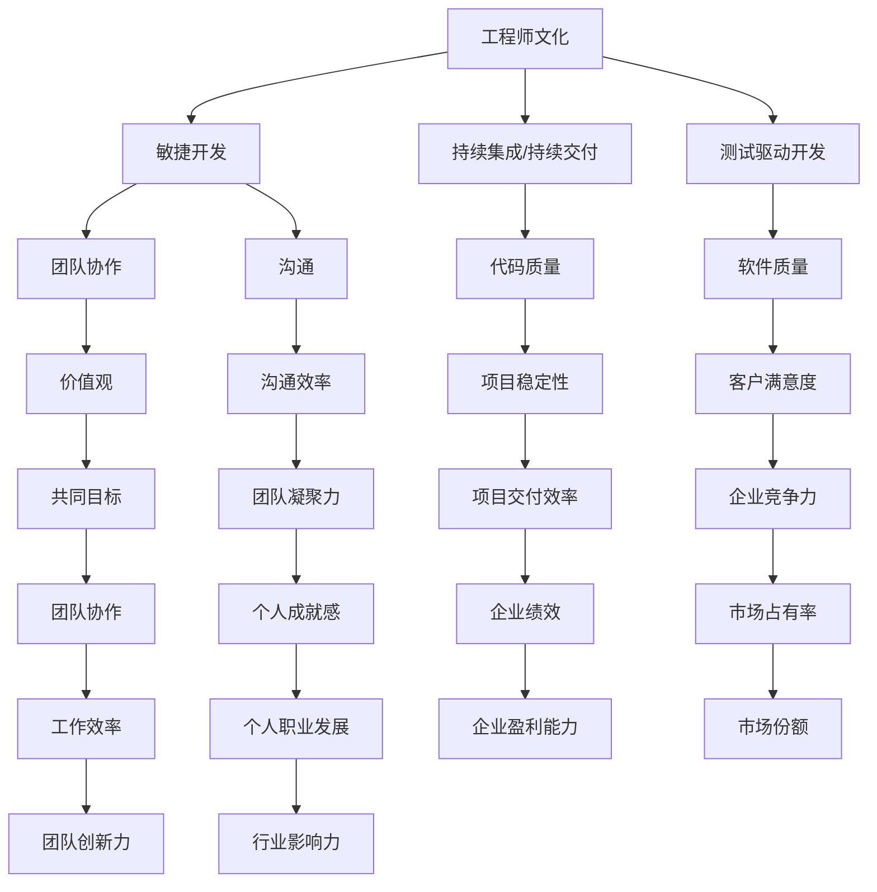

                 

# 工程师文化：如何打造高效创新的技术团队

> 关键词：工程师文化，技术团队，高效创新，团队协作，沟通，价值观，方法论

> 摘要：本文将深入探讨工程师文化在打造高效创新技术团队中的重要性。通过定义工程师文化的核心概念，分析其与团队协作、沟通和价值观的关系，结合实际案例和具体操作步骤，为读者提供一套系统化的方法论。文章旨在帮助技术领导者和管理者更好地理解工程师文化，从而打造出具有高效创新能力的优秀团队。

## 1. 背景介绍

### 1.1 目的和范围

本文的目的是探讨工程师文化对于打造高效创新技术团队的重要性，并提供一套实用的方法论。我们将从以下几个方面进行阐述：

1. **工程师文化的定义与核心概念**：介绍工程师文化的本质，阐述其核心概念，如敏捷开发、持续集成、测试驱动开发等。
2. **工程师文化与团队协作的关系**：分析工程师文化如何促进团队内部的协作与沟通。
3. **工程师文化与价值观的结合**：探讨如何将工程师文化与企业的核心价值观相融合，形成共同的愿景和使命。
4. **工程师文化的具体实施步骤**：提供一套可操作的步骤，帮助读者在实际工作中实践工程师文化。

### 1.2 预期读者

本文的预期读者包括：

1. 技术团队领导者和管理者：希望通过学习工程师文化，提升团队的整体绩效和创新能力。
2. 技术工程师：希望了解工程师文化的核心概念和具体实践，提升自己的专业技能和团队协作能力。
3. 企业管理者：希望通过了解工程师文化，更好地支持技术团队的工作，实现企业的长远发展。

### 1.3 文档结构概述

本文的结构如下：

1. **背景介绍**：介绍文章的目的、预期读者和文档结构。
2. **核心概念与联系**：通过 Mermaid 流程图，展示工程师文化的主要概念和它们之间的联系。
3. **核心算法原理 & 具体操作步骤**：详细讲解工程师文化的核心算法原理和具体操作步骤。
4. **数学模型和公式 & 详细讲解 & 举例说明**：介绍工程师文化中的数学模型和公式，并通过实例进行详细讲解。
5. **项目实战：代码实际案例和详细解释说明**：通过实际项目案例，展示工程师文化的具体应用。
6. **实际应用场景**：分析工程师文化在不同场景下的应用。
7. **工具和资源推荐**：推荐相关的学习资源和开发工具。
8. **总结：未来发展趋势与挑战**：总结文章的主要观点，并探讨未来工程师文化的发展趋势和面临的挑战。
9. **附录：常见问题与解答**：提供常见问题的解答。
10. **扩展阅读 & 参考资料**：推荐相关的扩展阅读和参考资料。

### 1.4 术语表

#### 1.4.1 核心术语定义

- **工程师文化**：指在技术团队中形成的一种价值观、行为准则和工作方式，强调敏捷开发、持续集成、测试驱动开发等。
- **团队协作**：指团队成员之间通过有效的沟通和合作，共同完成项目目标的过程。
- **价值观**：指团队成员共同认可并遵循的基本信念和道德准则。
- **方法论**：指具体实施工程师文化的步骤和方法。

#### 1.4.2 相关概念解释

- **敏捷开发**：一种软件开发的指导思想，强调快速迭代、灵活应对变化和持续交付高质量软件。
- **持续集成**：一种软件开发实践，通过自动化构建和测试，确保代码的持续整合和稳定性。
- **测试驱动开发**：一种软件开发方法，通过编写测试用例来驱动代码的实现，确保软件的质量。

#### 1.4.3 缩略词列表

- **TDD**：测试驱动开发（Test-Driven Development）
- **CI/CD**：持续集成/持续交付（Continuous Integration/Continuous Deployment）

## 2. 核心概念与联系

为了更好地理解工程师文化，我们首先需要了解其中的核心概念和它们之间的联系。以下是一个简化的 Mermaid 流程图，展示了这些概念：



### 2.1. 工程师文化的核心概念

- **敏捷开发**：敏捷开发强调快速迭代、灵活应对变化和持续交付高质量软件。通过短周期的迭代，团队可以更快地响应市场需求，同时提高软件质量。

- **持续集成/持续交付**：持续集成（CI）和持续交付（CD）是现代软件开发中的重要实践。通过自动化构建和测试，确保代码的持续整合和稳定性，从而提高项目的交付效率和稳定性。

- **测试驱动开发**：测试驱动开发（TDD）是一种软件开发方法，通过编写测试用例来驱动代码的实现，确保软件的质量。这种方法有助于提前识别和解决问题，减少后续的修复成本。

### 2.2. 工程师文化与团队协作、沟通和价值观的关系

- **团队协作**：工程师文化强调团队协作，通过有效的沟通和合作，共同完成项目目标。良好的团队协作可以提高工作效率，减少沟通成本，增强团队凝聚力。

- **沟通**：沟通是团队协作的重要环节。工程师文化倡导透明和高效的沟通，通过定期会议、代码评审、文档分享等方式，确保团队成员之间的信息畅通。

- **价值观**：价值观是工程师文化的核心。共同的价值观可以促进团队成员之间的信任和理解，形成共同的愿景和使命，从而提高团队的凝聚力和工作效率。

## 3. 核心算法原理 & 具体操作步骤

### 3.1. 敏捷开发的算法原理

敏捷开发的核心是快速迭代和灵活应对变化。以下是敏捷开发的算法原理：

1. **需求收集**：与客户和利益相关者沟通，收集软件需求。
2. **迭代规划**：将需求划分为若干个迭代，每个迭代包含规划、开发、测试和交付等阶段。
3. **迭代实施**：按照迭代计划，进行开发、测试和交付。
4. **反馈收集**：在每个迭代结束后，收集用户和利益相关者的反馈，用于下一个迭代的改进。

### 3.2. 持续集成/持续交付的操作步骤

持续集成（CI）和持续交付（CD）是现代软件开发中的重要实践。以下是具体操作步骤：

1. **代码提交**：开发人员将代码提交到版本控制系统。
2. **自动化构建**：构建系统自动编译代码，生成可执行的文件。
3. **自动化测试**：运行自动化测试脚本，确保代码的质量和功能。
4. **反馈报告**：测试结果通过邮件或其他方式反馈给开发人员。
5. **部署**：通过自动化部署工具，将通过测试的代码部署到生产环境。

### 3.3. 测试驱动开发的操作步骤

测试驱动开发（TDD）通过编写测试用例来驱动代码的实现。以下是具体操作步骤：

1. **编写测试用例**：根据需求编写测试用例，确保覆盖所有功能和场景。
2. **运行测试**：运行测试用例，确保所有测试通过。
3. **编写代码**：根据测试用例，编写实现代码。
4. **重构代码**：优化代码，确保代码质量。

## 4. 数学模型和公式 & 详细讲解 & 举例说明

### 4.1. 敏捷开发中的数学模型

敏捷开发中的数学模型主要涉及迭代时间和项目复杂度的关系。以下是相关公式：

1. **迭代时间（T）**：T = C / P，其中 C 是项目复杂度，P 是团队成员的工作效率。
2. **项目复杂度（C）**：C = F（n），其中 F 是项目功能点，n 是项目规模。

举例说明：

假设一个项目的功能点为 100，团队成员的工作效率为 2，则迭代时间 T = 100 / 2 = 50。

### 4.2. 持续集成/持续交付中的数学模型

持续集成/持续交付中的数学模型主要涉及自动化测试和部署的时间成本。以下是相关公式：

1. **测试时间（T1）**：T1 = N * T0，其中 N 是测试用例的数量，T0 是单个测试用例的时间成本。
2. **部署时间（T2）**：T2 = M * T0，其中 M 是部署次数，T0 是单个部署的时间成本。

举例说明：

假设一个项目有 10 个测试用例，单个测试用例的时间成本为 1 小时，则测试时间 T1 = 10 * 1 = 10 小时。

### 4.3. 测试驱动开发中的数学模型

测试驱动开发中的数学模型主要涉及测试用例和代码覆盖率。以下是相关公式：

1. **代码覆盖率（C）**：C = （T 通过的测试用例数）/（T 所有测试用例数）* 100%。
2. **测试用例数量（T）**：T = F（n），其中 F 是项目功能点，n 是项目规模。

举例说明：

假设一个项目的功能点为 100，则测试用例数量 T = 100。

## 5. 项目实战：代码实际案例和详细解释说明

### 5.1 开发环境搭建

在本案例中，我们将使用 Python 语言和 Git 版本控制系统来实践敏捷开发、持续集成和测试驱动开发。以下是开发环境搭建的步骤：

1. **安装 Python**：从 [Python 官网](https://www.python.org/) 下载并安装 Python。
2. **安装 Git**：从 [Git 官网](https://git-scm.com/) 下载并安装 Git。
3. **安装相关库**：使用 `pip` 命令安装所需库，例如 `requests`、`unittest` 等。

### 5.2 源代码详细实现和代码解读

以下是实现一个简单的待办事项列表功能的源代码：

```python
# todo.py

import requests
import unittest

class TodoList(unittest.TestCase):
    def test_add_task(self):
        response = requests.post('http://localhost:8000/todo/add', json={'task': 'buy milk'})
        self.assertEqual(response.status_code, 200)
        self.assertEqual(response.json()['task'], 'buy milk')

    def test_remove_task(self):
        response = requests.delete('http://localhost:8000/todo/remove', json={'task': 'buy milk'})
        self.assertEqual(response.status_code, 200)
        self.assertEqual(response.json()['message'], 'Task removed successfully')

if __name__ == '__main__':
    unittest.main()
```

该代码中，我们定义了一个 `TodoList` 测试用例类，包含两个测试方法：`test_add_task` 和 `test_remove_task`。这两个方法分别测试添加任务和删除任务的接口功能。

### 5.3 代码解读与分析

在该代码中，我们使用了 Python 的 `requests` 库和 `unittest` 库。`requests` 库用于发送 HTTP 请求，`unittest` 库用于编写测试用例。

1. **测试用例编写**：我们首先编写了两个测试用例，分别测试添加任务和删除任务的接口功能。在 `test_add_task` 方法中，我们使用 `requests.post` 方法发送 POST 请求，添加一个任务；在 `test_remove_task` 方法中，我们使用 `requests.delete` 方法发送 DELETE 请求，删除一个任务。

2. **测试结果验证**：在每个测试方法中，我们使用 `self.assertEqual` 方法验证测试结果。例如，在 `test_add_task` 方法中，我们验证添加任务的响应状态码和返回数据是否符合预期；在 `test_remove_task` 方法中，我们验证删除任务的响应状态码和返回消息是否符合预期。

3. **代码执行**：在代码的最后，我们使用 `unittest.main()` 方法执行所有测试用例。

通过这个简单的案例，我们可以看到如何使用 Python 实现测试驱动开发。在实际项目中，测试用例会更加复杂，但核心思想是一样的：先编写测试用例，再实现代码。

## 6. 实际应用场景

### 6.1 在初创公司的应用

初创公司通常面临市场竞争激烈、资源有限、时间紧迫等挑战。工程师文化的引入可以帮助初创公司快速迭代产品、提高开发效率、降低开发风险。以下是一些实际应用场景：

- **敏捷开发**：初创公司可以采用敏捷开发方法，快速响应市场需求，持续优化产品。
- **持续集成/持续交付**：通过自动化构建和测试，确保代码质量和项目稳定性，加快产品迭代速度。
- **测试驱动开发**：编写详细的测试用例，提前发现和解决问题，提高产品质量。

### 6.2 在大型企业的应用

大型企业通常拥有庞大的技术团队和复杂的业务体系。工程师文化的引入可以帮助企业提高整体开发效率、提升产品质量、降低项目风险。以下是一些实际应用场景：

- **敏捷开发**：在大型企业中，不同部门和团队之间的协作较为复杂。通过敏捷开发，可以提高团队之间的沟通效率，确保项目进度和质量。
- **持续集成/持续交付**：在大型企业中，项目规模较大，代码复杂度较高。通过持续集成/持续交付，可以确保代码的持续整合和稳定性，降低项目风险。
- **测试驱动开发**：在大型企业中，测试工作往往由专门的测试团队负责。通过测试驱动开发，可以提前发现和解决问题，提高产品质量。

### 6.3 在远程团队的应用

随着远程办公的普及，远程团队的开发效率和质量成为关键问题。工程师文化的引入可以帮助远程团队提高协作效率、降低沟通成本、提升项目质量。以下是一些实际应用场景：

- **敏捷开发**：远程团队可以通过敏捷开发，实现快速迭代和灵活应对变化，提高项目进度和质量。
- **持续集成/持续交付**：远程团队可以通过自动化构建和测试，确保代码质量和项目稳定性，加快产品迭代速度。
- **测试驱动开发**：远程团队可以通过测试驱动开发，提前发现和解决问题，提高产品质量。

## 7. 工具和资源推荐

### 7.1 学习资源推荐

#### 7.1.1 书籍推荐

- 《敏捷开发：实践指南》
- 《持续集成：从理论到实践》
- 《测试驱动开发：实战指南》

#### 7.1.2 在线课程

- 《敏捷开发》
- 《持续集成》
- 《测试驱动开发》

#### 7.1.3 技术博客和网站

- 《敏捷开发实践指南》
- 《持续集成》
- 《测试驱动开发》

### 7.2 开发工具框架推荐

#### 7.2.1 IDE和编辑器

- Visual Studio Code
- IntelliJ IDEA
- PyCharm

#### 7.2.2 调试和性能分析工具

- Eclipse MAT
- VisualVM
- JProfiler

#### 7.2.3 相关框架和库

- Spring Boot
- Flask
- Django

### 7.3 相关论文著作推荐

#### 7.3.1 经典论文

- 《敏捷开发：原则与实践》
- 《持续集成：自动化测试与构建》
- 《测试驱动开发：实践与原理》

#### 7.3.2 最新研究成果

- 《基于敏捷开发的软件项目管理研究》
- 《持续交付：从概念到实践》
- 《测试驱动开发在大型系统中的应用研究》

#### 7.3.3 应用案例分析

- 《某大型企业的敏捷开发实践》
- 《某互联网公司的持续集成实践》
- 《某金融机构的测试驱动开发实践》

## 8. 总结：未来发展趋势与挑战

### 8.1 未来发展趋势

- **人工智能与工程师文化的融合**：随着人工智能技术的不断发展，工程师文化将更加注重数据驱动、自动化和智能化的应用。
- **远程办公与团队协作**：远程办公的普及将推动工程师文化在团队协作、沟通和效率方面的创新。
- **可持续发展和环保意识**：工程师文化将更加注重可持续发展和环保意识，推动绿色技术的研发和应用。

### 8.2 未来挑战

- **技能和知识的更新**：随着技术的快速发展，工程师需要不断更新自己的技能和知识，以应对新的挑战。
- **团队管理和沟通**：在远程办公和跨文化团队中，团队管理和沟通将成为重要的挑战。
- **安全与隐私**：在数字化时代，工程师文化需要更加注重安全与隐私保护，防止数据泄露和网络攻击。

## 9. 附录：常见问题与解答

### 9.1 工程师文化是什么？

工程师文化是一种在技术团队中形成的一种价值观、行为准则和工作方式，强调敏捷开发、持续集成、测试驱动开发等。

### 9.2 如何实施工程师文化？

实施工程师文化需要从以下几个方面入手：

1. **培养团队协作精神**：通过定期团队建设活动、团队沟通和反馈机制，培养团队成员之间的信任和理解。
2. **推广敏捷开发**：采用敏捷开发方法，快速迭代和灵活应对变化，提高项目进度和质量。
3. **实施持续集成/持续交付**：通过自动化构建和测试，确保代码质量和项目稳定性，加快产品迭代速度。
4. **推动测试驱动开发**：编写详细的测试用例，提前发现和解决问题，提高产品质量。

### 9.3 工程师文化与企业文化的关系是什么？

工程师文化与企业文化密切相关。工程师文化是企业价值观在技术团队中的具体体现，需要与企业的核心价值观相融合，形成共同的愿景和使命。

## 10. 扩展阅读 & 参考资料

- 《敏捷开发：实践指南》
- 《持续集成：从理论到实践》
- 《测试驱动开发：实战指南》
- 《软件工程：实践者的研究方法》
- 《敏捷软件工程：实践者的指南》
- 《工程师文化与团队绩效》
- 《团队协作与沟通技巧》
- 《人工智能与工程师文化》

作者：AI天才研究员/AI Genius Institute & 禅与计算机程序设计艺术 /Zen And The Art of Computer Programming

