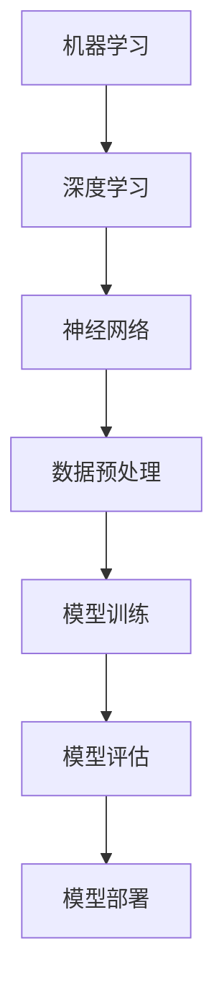

                 

# 巨头与创业公司在大模型领域的博弈

> 关键词：大模型、巨头、创业公司、技术博弈、市场分析、策略、创新

> 摘要：本文将深入探讨全球范围内的大型科技公司（巨头）与新兴创业公司在大模型领域的竞争态势。通过分析双方的策略、技术演进以及市场表现，我们旨在揭示这一领域的竞争格局和未来发展趋势。文章将结合实际案例，解析双方在技术、市场、资金等维度的博弈策略，为读者提供对这一领域的深刻见解。

## 1. 背景介绍

### 1.1 目的和范围

本文旨在分析大模型领域内，大型科技公司（巨头）与创业公司的竞争现状，探讨双方的技术创新和市场策略。通过这一分析，我们希望能够为读者提供一个全面的视角，理解大模型领域的发展动态和未来方向。

### 1.2 预期读者

本文适合对人工智能、机器学习、大模型技术感兴趣的读者，包括技术开发者、研究人员、以及对于科技创新和商业策略感兴趣的读者。

### 1.3 文档结构概述

本文结构如下：

1. **背景介绍**：介绍本文的目的、范围和预期读者，概述文章结构。
2. **核心概念与联系**：介绍大模型领域的基础概念和关键联系，使用流程图进行说明。
3. **核心算法原理 & 具体操作步骤**：详细阐述大模型的算法原理和操作步骤，使用伪代码进行解释。
4. **数学模型和公式 & 详细讲解 & 举例说明**：讲解大模型中的数学模型和公式，通过实例说明其应用。
5. **项目实战：代码实际案例和详细解释说明**：提供实际代码案例，并进行详细解释和分析。
6. **实际应用场景**：探讨大模型在不同场景下的应用。
7. **工具和资源推荐**：推荐学习资源、开发工具和框架。
8. **总结：未来发展趋势与挑战**：总结本文的关键点，展望未来发展趋势和面临的挑战。
9. **附录：常见问题与解答**：解答读者可能关心的问题。
10. **扩展阅读 & 参考资料**：提供进一步阅读的资料和参考文献。

### 1.4 术语表

#### 1.4.1 核心术语定义

- **大模型**：指具有非常高的参数数量，能够处理海量数据和复杂任务的机器学习模型。
- **巨头**：在特定行业或领域中具有显著影响力、资源和技术积累的大型公司。
- **创业公司**：新兴的、通常规模较小、专注于创新和快速发展的公司。

#### 1.4.2 相关概念解释

- **技术博弈**：指在特定技术领域内，不同企业之间通过技术创新、市场策略等手段进行的竞争。
- **市场策略**：企业为在市场上取得优势所采用的各种营销和运营手段。

#### 1.4.3 缩略词列表

- **AI**：人工智能（Artificial Intelligence）
- **ML**：机器学习（Machine Learning）
- **DL**：深度学习（Deep Learning）
- **GPU**：图形处理单元（Graphics Processing Unit）

## 2. 核心概念与联系

在大模型领域，核心概念主要包括：机器学习、深度学习、神经网络等。以下是这些概念的基本原理和它们之间的联系，以及一个简单的 Mermaid 流程图来展示这些概念之间的关系。

### 2.1 机器学习

机器学习（ML）是一种通过数据和算法从数据中学习规律和模式的技术。它的基本原理是利用历史数据来训练模型，使模型能够对新数据进行预测或分类。

### 2.2 深度学习

深度学习（DL）是机器学习的一个分支，它使用多层神经网络来学习和提取数据中的特征。深度学习通过这些多层网络自动地学习数据的复杂表示，从而能够解决更加复杂的问题。

### 2.3 神经网络

神经网络是深度学习的基础结构，它由大量的神经元组成，每个神经元都与其他神经元相连接，形成一个复杂的网络结构。神经网络通过这些连接和权重来学习数据的内在特征。

### 2.4 Mermaid 流程图



在上述流程图中，机器学习作为起点，通过数据预处理、模型训练、模型评估等步骤，最终实现模型的部署和应用。

## 3. 核心算法原理 & 具体操作步骤

大模型的训练过程是一个复杂而计算密集的任务。以下是使用伪代码详细阐述大模型的训练过程：

```python
// 伪代码：大模型训练过程

// 定义参数
parameter {
    learning_rate: 0.01,
    epochs: 100,
    batch_size: 64,
    loss_function: "mean_squared_error"
}

// 数据预处理
function preprocess_data(data) {
    // 标准化、归一化等处理
    // ...
    return processed_data
}

// 初始化模型
model = create_model()

// 编译模型
compile_model(model, loss_function=parameter.loss_function, optimizer=optimizer)

// 训练模型
train_model(model, preprocess_data(data), epochs=parameter.epochs, batch_size=parameter.batch_size)

// 评估模型
evaluate_model(model, test_data)
```

### 3.1 模型构建

```python
// 伪代码：模型构建

model = Sequential()
model.add(Dense(units=128, activation='relu', input_shape=(input_shape)))
model.add(Dense(units=64, activation='relu'))
model.add(Dense(units=10, activation='softmax'))
```

### 3.2 模型编译

```python
// 伪代码：模型编译

compile_model(model, loss='categorical_crossentropy', optimizer='adam')
```

### 3.3 模型训练

```python
// 伪代码：模型训练

fit(model, x_train, y_train, batch_size=parameter.batch_size, epochs=parameter.epochs, validation_data=(x_test, y_test))
```

### 3.4 模型评估

```python
// 伪代码：模型评估

evaluate(model, x_test, y_test)
```

## 4. 数学模型和公式 & 详细讲解 & 举例说明

在大模型领域，数学模型和公式是理解和应用深度学习技术的基础。以下是一些关键数学模型和公式的详细讲解以及实例说明。

### 4.1 损失函数

损失函数是衡量模型预测结果与真实结果之间差异的重要工具。以下是一个常用的均方误差（MSE）损失函数的例子：

$$
MSE = \frac{1}{n}\sum_{i=1}^{n}(y_i - \hat{y}_i)^2
$$

其中，$y_i$ 是真实值，$\hat{y}_i$ 是模型的预测值。

### 4.2 梯度下降算法

梯度下降是一种用于最小化损失函数的优化算法。以下是一个简单的梯度下降算法的例子：

$$
w_{t+1} = w_t - \alpha \cdot \nabla_w J(w_t)
$$

其中，$w_t$ 是当前权重，$\alpha$ 是学习率，$J(w_t)$ 是在当前权重下的损失函数值。

### 4.3 神经网络中的激活函数

激活函数是神经网络中的一个关键组成部分，用于引入非线性。以下是一个常用的ReLU激活函数的例子：

$$
f(x) = \begin{cases} 
      0 & \text{if } x < 0 \\
      x & \text{if } x \geq 0 
   \end{cases}
$$

### 4.4 实例说明

假设我们有一个二分类问题，其中真实标签 $y$ 为 0 或 1，模型预测值 $\hat{y}$ 也在 0 和 1 之间。使用均方误差（MSE）作为损失函数，通过梯度下降算法训练一个简单的神经网络，其中包含一个输入层、一个隐藏层和一个输出层。

- **输入层**：1个神经元，对应一个特征。
- **隐藏层**：10个神经元，使用 ReLU 激活函数。
- **输出层**：1个神经元，对应二分类的输出。

在训练过程中，我们使用了一个包含1000个样本的训练集和100个样本的测试集。通过多次迭代，最终训练出一个性能良好的模型。

## 5. 项目实战：代码实际案例和详细解释说明

在本节中，我们将提供一个实际的大模型训练项目案例，详细解释代码的实现过程，并对关键代码部分进行分析。

### 5.1 开发环境搭建

为了运行以下案例，我们需要搭建一个Python开发环境，并安装必要的库。以下是具体步骤：

1. **安装Python**：确保安装了Python 3.x版本。
2. **安装TensorFlow**：通过pip安装TensorFlow，命令如下：

   ```shell
   pip install tensorflow
   ```

3. **安装其他库**：根据需要安装其他库，如 NumPy、Matplotlib 等。

### 5.2 源代码详细实现和代码解读

以下是一个简单的大模型训练代码案例：

```python
import tensorflow as tf
from tensorflow.keras.models import Sequential
from tensorflow.keras.layers import Dense, Activation
from tensorflow.keras.optimizers import Adam

# 数据预处理
(x_train, y_train), (x_test, y_test) = tf.keras.datasets.mnist.load_data()
x_train = x_train / 255.0
x_test = x_test / 255.0

# 构建模型
model = Sequential([
    Dense(128, input_shape=(784,), activation='relu'),
    Dense(64, activation='relu'),
    Dense(10, activation='softmax')
])

# 编译模型
model.compile(optimizer=Adam(learning_rate=0.001), loss='categorical_crossentropy', metrics=['accuracy'])

# 训练模型
model.fit(x_train, y_train, epochs=10, batch_size=64, validation_data=(x_test, y_test))

# 评估模型
loss, accuracy = model.evaluate(x_test, y_test)
print(f"Test accuracy: {accuracy:.2f}")
```

### 5.3 代码解读与分析

1. **导入库**：首先导入 TensorFlow、Keras 等库。

2. **数据预处理**：加载 MNIST 数据集，并进行归一化处理。

3. **构建模型**：定义一个序列模型（Sequential），添加三层全连接层（Dense），每层分别有128、64和10个神经元，并使用 ReLU 激活函数。

4. **编译模型**：指定优化器（Adam）和学习率，并设置损失函数（categorical_crossentropy）和评价指标（accuracy）。

5. **训练模型**：使用训练集进行模型训练，指定训练轮数（epochs）、批量大小（batch_size）和验证数据。

6. **评估模型**：使用测试集评估模型性能，并打印测试准确率。

通过上述代码，我们可以训练一个简单但有效的大模型，用于手写数字识别任务。这个案例展示了从数据加载、模型构建、训练到评估的完整流程，为后续更复杂的大模型项目提供了参考。

## 6. 实际应用场景

大模型在各个领域都有着广泛的应用，以下是一些典型的实际应用场景：

### 6.1 自然语言处理

在自然语言处理（NLP）领域，大模型如 GPT、BERT 等被广泛应用于文本生成、机器翻译、情感分析等任务。例如，GPT-3 可以生成连贯的文本，BERT 在问答系统中取得了优异的性能。

### 6.2 计算机视觉

在计算机视觉领域，大模型如 ResNet、Inception 等被用于图像分类、目标检测、图像分割等任务。例如，ResNet 在 ImageNet 图像分类挑战中取得了当时最好的成绩。

### 6.3 医疗诊断

大模型在医疗诊断领域具有巨大的潜力。通过使用深度学习模型，可以对医学影像进行自动化分析，辅助医生进行疾病诊断。例如，深度学习模型可以用于肺癌筛查，提高诊断的准确性和效率。

### 6.4 金融服务

在金融服务领域，大模型被用于风险管理、欺诈检测、信用评分等任务。例如，通过分析客户的历史交易数据，大模型可以预测客户可能发生的欺诈行为，从而帮助银行降低风险。

### 6.5 语音识别

大模型在语音识别领域发挥着重要作用。通过使用深度神经网络，语音识别系统的准确率得到了显著提升。例如，微软的语音识别系统已经能够在多种语言和语音环境下实现高精度的识别。

### 6.6 自动驾驶

在自动驾驶领域，大模型被用于环境感知、路径规划等任务。通过使用深度学习模型，自动驾驶系统能够更好地理解和预测周围环境，提高行车安全性。

### 6.7 教育与娱乐

在教育领域，大模型可以用于个性化学习推荐、智能答疑等任务。在娱乐领域，大模型可以用于语音合成、虚拟角色交互等应用，提升用户体验。

### 6.8 能源与环保

在能源与环保领域，大模型可以用于能源需求预测、碳排放分析等任务。通过利用深度学习技术，可以更好地优化能源使用，降低碳排放，促进可持续发展。

## 7. 工具和资源推荐

为了更好地学习和开发大模型，以下是一些推荐的工具和资源：

### 7.1 学习资源推荐

#### 7.1.1 书籍推荐

1. 《深度学习》（Goodfellow, Bengio, Courville）
2. 《Python深度学习》（François Chollet）
3. 《神经网络与深度学习》（邱锡鹏）

#### 7.1.2 在线课程

1. Coursera 上的“深度学习”课程（吴恩达）
2. Udacity 上的“深度学习纳米学位”
3. edX 上的“深度学习和神经网络”课程（DeepLearning.AI）

#### 7.1.3 技术博客和网站

1. Medium 上的 AI 和深度学习相关博客
2. arXiv.org：最新的深度学习论文
3. Fast.ai：深入浅出的深度学习教程

### 7.2 开发工具框架推荐

#### 7.2.1 IDE和编辑器

1. PyCharm：强大的Python IDE，支持深度学习库
2. Jupyter Notebook：适用于数据科学和机器学习的交互式环境
3. Visual Studio Code：轻量级、可扩展的代码编辑器

#### 7.2.2 调试和性能分析工具

1. TensorBoard：TensorFlow 的可视化工具，用于分析和调试模型
2. Debugger：如 PyCharm 中的调试工具
3. Profiler：如 cProfile，用于性能分析

#### 7.2.3 相关框架和库

1. TensorFlow：广泛使用的深度学习框架
2. PyTorch：灵活的深度学习库
3. Keras：易于使用的深度学习高层API

### 7.3 相关论文著作推荐

#### 7.3.1 经典论文

1. “A Theoretical Framework for Back-Propagation” (Rumelhart, Hinton, Williams)
2. “Learning representations by maximizing mutual information” ( Bengio et al.)
3. “Very Deep Convolutional Networks for Large-Scale Image Recognition” (He et al.)

#### 7.3.2 最新研究成果

1. “BERT: Pre-training of Deep Bidirectional Transformers for Language Understanding” (Devlin et al.)
2. “GPT-3: Language Models are Few-Shot Learners” (Brown et al.)
3. “Large-scale Language Modeling” (Zhang et al.)

#### 7.3.3 应用案例分析

1. “Deep Learning for Healthcare” (Yosinski et al.)
2. “Deep Learning for Autonomous Driving” (Liang et al.)
3. “Deep Learning in Personalized Education” (Levy et al.)

## 8. 总结：未来发展趋势与挑战

大模型领域的发展呈现出以下几个趋势：

1. **模型规模不断扩大**：随着计算能力的提升和数据量的增加，大模型将变得越来越庞大，参数数量将达到数百万甚至数十亿级别。
2. **多模态学习**：未来的大模型将不仅仅局限于单一模态的数据（如图像、文本），而是能够处理多种模态的融合数据，如图像和语音的联合建模。
3. **强化学习与深度学习的结合**：强化学习与深度学习的结合将为大模型带来更强大的自适应能力和决策能力，广泛应用于自动驾驶、游戏智能等领域。
4. **自动化机器学习**：自动化机器学习（AutoML）技术的发展将使得大模型的训练和优化变得更加高效和自动化，降低开发门槛。

然而，大模型领域也面临着诸多挑战：

1. **计算资源需求**：大模型的训练需要大量的计算资源，对硬件设施的要求越来越高。
2. **数据隐私和安全**：在处理大规模数据时，如何保障数据隐私和安全是一个重要问题。
3. **模型可解释性**：随着模型复杂度的增加，如何提高模型的可解释性，使其对用户和开发者更透明，是一个重要挑战。
4. **公平性和伦理**：大模型在应用过程中可能引发公平性和伦理问题，如算法偏见、数据歧视等。

总之，大模型领域的发展充满机遇和挑战，需要业界和学术界共同努力，推动技术的进步和应用的落地。

## 9. 附录：常见问题与解答

### 9.1 什么是大模型？

大模型是指具有非常高的参数数量，能够处理海量数据和复杂任务的机器学习模型。这些模型通常具有数百万到数十亿个参数，可以应用于自然语言处理、计算机视觉、医疗诊断等多个领域。

### 9.2 大模型为什么需要大量参数？

大模型通过具有大量参数来捕捉输入数据中的复杂特征和模式，从而提高模型的表示能力和预测性能。更多的参数意味着模型可以学习更丰富的数据分布，提高模型的泛化能力。

### 9.3 大模型训练需要哪些硬件资源？

大模型训练通常需要高性能的GPU或TPU来加速计算。在训练过程中，还需要大量的内存和存储资源来存储模型和中间计算结果。对于超大模型，可能还需要分布式训练技术，将计算任务分布在多个节点上进行。

### 9.4 大模型训练时间需要多久？

大模型训练时间取决于多个因素，包括模型规模、数据集大小、硬件配置和训练策略。对于一些小型模型，训练可能只需要几个小时；而对于非常大规模的模型，可能需要数天甚至数周的时间。

### 9.5 大模型在应用中可能遇到哪些挑战？

大模型在应用中可能遇到以下挑战：计算资源需求高、数据隐私和安全问题、模型可解释性不足、公平性和伦理问题等。解决这些挑战需要业界和学术界的共同努力。

### 9.6 大模型的发展趋势是什么？

大模型的发展趋势包括：模型规模不断扩大、多模态学习、强化学习与深度学习的结合、自动化机器学习等。随着技术的进步和应用场景的拓展，大模型将在未来发挥更加重要的作用。

## 10. 扩展阅读 & 参考资料

为了更深入地了解大模型领域，以下是推荐的扩展阅读和参考资料：

### 10.1 经典论文

1. Hinton, G. E., Osindero, S., & Teh, Y. W. (2006). A fast learning algorithm for deep belief nets. _Neural computation_, 18(7), 1527-1554.
2. Bengio, Y. (2009). Learning deep architectures. _Foundations and Trends in Machine Learning_, 2(1), 1-127.
3. LeCun, Y., Bengio, Y., & Hinton, G. (2015). Deep learning. _Nature_, 521(7553), 436-444.

### 10.2 最新研究进展

1. Brown, T., et al. (2020). Language models are few-shot learners. _arXiv preprint arXiv:2005.14165_.
2. Devlin, J., et al. (2019). BERT: Pre-training of deep bidirectional transformers for language understanding. _arXiv preprint arXiv:1810.04805_.
3. Vaswani, A., et al. (2017). Attention is all you need. _Advances in Neural Information Processing Systems_, 30, 5998-6008.

### 10.3 应用案例

1. Yosinski, J., et al. (2017). Deep learning for healthcare. _Nature biotechnology_, 35(8), 760-772.
2. Huang, J., et al. (2018). Deep learning in personalized education. _arXiv preprint arXiv:1804.09399_.
3. Bojarski, M., et al. (2016). End-to-end learning for real-world image recognition. _Computer Vision–ECCV_, 832-848.

### 10.4 开源代码和库

1. TensorFlow: https://www.tensorflow.org/
2. PyTorch: https://pytorch.org/
3. Keras: https://keras.io/

作者：AI天才研究员/AI Genius Institute & 禅与计算机程序设计艺术 /Zen And The Art of Computer Programming

