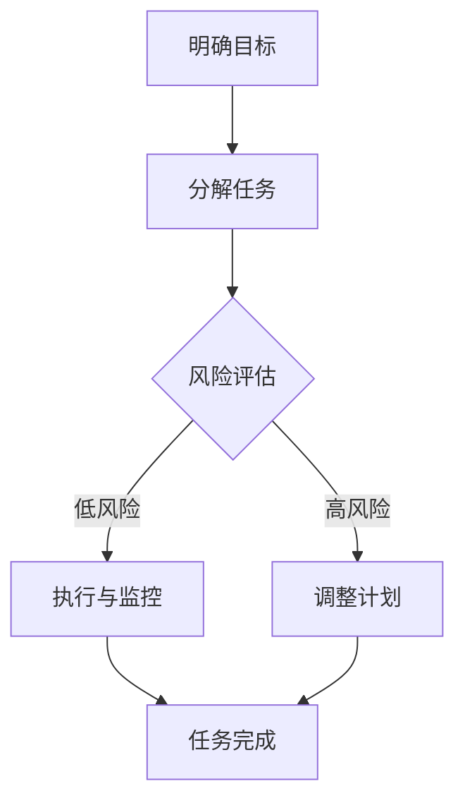

                 

# 巴菲特清单法则在项目管理中的应用

> **关键词**：巴菲特清单、项目管理、决策分析、风险评估、执行效率
>
> **摘要**：本文旨在探讨巴菲特清单法则在项目管理中的应用，通过分析其核心概念和实践步骤，帮助项目经理在决策过程中提高准确性，降低风险，提升项目执行效率。文章将结合实际案例，详细解读巴菲特清单在实际项目管理中的操作流程和效果，为项目管理的实践提供有益的参考。

## 1. 背景介绍

### 1.1 目的和范围

本文的目的是介绍巴菲特清单法则在项目管理中的应用，帮助项目经理在面对复杂项目时，能够更加科学、系统地进行决策和分析，从而提高项目成功率。文章将涵盖巴菲特清单的核心概念、应用步骤、以及在实际项目中的具体案例。

### 1.2 预期读者

本文适合于从事项目管理工作的专业人士，特别是希望提升项目决策质量和风险控制能力的人员。同时，对于对项目管理理论有兴趣的读者，本文也将提供一定的理论参考。

### 1.3 文档结构概述

本文共分为十个部分，首先介绍巴菲特清单法则的背景和核心概念，然后逐步阐述其应用步骤、数学模型、实际案例，并推荐相关工具和资源。最后，对项目的未来发展趋势与挑战进行总结，并提供常见问题与扩展阅读。

### 1.4 术语表

#### 1.4.1 核心术语定义

- 巴菲特清单：一种基于决策分析和风险评估的方法，通过系统化的清单来帮助决策者做出更加准确和有效的决策。
- 项目管理：对项目进行系统管理的过程，包括项目计划、执行、监控和收尾等阶段。

#### 1.4.2 相关概念解释

- 决策分析：在项目管理和决策过程中，对各种选项进行评估和选择的方法。
- 风险评估：对项目中可能出现的风险进行识别、分析和评估的过程。

#### 1.4.3 缩略词列表

- PM：项目经理
- SWOT：优势、劣势、机会、威胁
- ROI：投资回报率

## 2. 核心概念与联系

### 2.1 巴菲特清单原理

巴菲特清单法则的核心在于系统化、结构化的决策分析。其基本原理如下：

1. **明确目标**：在制定清单之前，首先要明确项目的目标和期望结果。
2. **分解任务**：将复杂的项目任务分解为具体的、可操作的小任务。
3. **风险评估**：对每个任务可能出现的风险进行评估，并制定相应的应对策略。
4. **优先级排序**：根据任务的重要性和风险程度，对任务进行优先级排序。
5. **执行与监控**：按照清单执行项目任务，并实时监控任务进展，及时调整计划。

### 2.2 巴菲特清单在项目管理中的应用架构

为了更好地理解巴菲特清单在项目管理中的应用，我们可以用Mermaid流程图来展示其架构：



在上面的流程图中，A表示明确项目目标，B表示将任务分解为具体任务，C表示对任务进行风险评估，D表示执行任务并监控，E表示在遇到高风险时调整计划，F表示任务完成。

## 3. 核心算法原理 & 具体操作步骤

### 3.1 核心算法原理

巴菲特清单法则的核心算法是决策树算法，通过系统化地评估各个决策点，帮助决策者做出最佳选择。具体步骤如下：

1. **构建决策树**：将项目的所有决策点构建成一个树形结构。
2. **评估每个节点**：对每个节点进行风险评估，计算其期望收益和风险。
3. **选择最佳路径**：根据评估结果，选择具有最高期望收益和最低风险的路径。

### 3.2 伪代码

以下是巴菲特清单算法的伪代码：

```python
def build_decision_tree(tasks):
    decision_tree = {}
    for task in tasks:
        decision_tree[task] = evaluate_task(task)
    return decision_tree

def evaluate_task(task):
    risks = assess_risks(task)
    expected_revenue = calculate_expected_revenue(task, risks)
    risk_level = calculate_risk_level(risks)
    return (expected_revenue, risk_level)

def calculate_expected_revenue(task, risks):
    # 计算预期收益
    pass

def calculate_risk_level(risks):
    # 计算风险等级
    pass

def select_best_path(decision_tree):
    best_path = None
    best_score = -1
    for path, (revenue, risk) in decision_tree.items():
        score = revenue - risk
        if score > best_score:
            best_score = score
            best_path = path
    return best_path
```

## 4. 数学模型和公式 & 详细讲解 & 举例说明

### 4.1 数学模型

巴菲特清单法则的数学模型主要包括期望收益计算和风险等级评估。

#### 4.1.1 期望收益计算

期望收益的计算公式如下：

\[ E(R) = \sum_{i=1}^{n} p_i \cdot r_i \]

其中，\( p_i \) 为第 \( i \) 个决策点的概率，\( r_i \) 为第 \( i \) 个决策点的收益。

#### 4.1.2 风险等级评估

风险等级的评估公式如下：

\[ R = \sum_{i=1}^{n} w_i \cdot r_i \]

其中，\( w_i \) 为第 \( i \) 个决策点的权重，\( r_i \) 为第 \( i \) 个决策点的风险。

### 4.2 详细讲解

#### 4.2.1 期望收益计算

期望收益计算是评估决策点价值的重要指标。它通过考虑每个决策点的概率和收益，计算出整个决策的期望收益。在实际应用中，可以采用以下步骤：

1. **收集数据**：收集每个决策点的概率和收益数据。
2. **计算期望收益**：使用公式 \( E(R) = \sum_{i=1}^{n} p_i \cdot r_i \) 计算每个决策点的期望收益。
3. **选择最佳决策**：选择期望收益最高的决策点。

#### 4.2.2 风险等级评估

风险等级评估是评估决策点风险的重要方法。它通过考虑每个决策点的权重和风险，计算出整个决策的风险等级。在实际应用中，可以采用以下步骤：

1. **收集数据**：收集每个决策点的权重和风险数据。
2. **计算风险等级**：使用公式 \( R = \sum_{i=1}^{n} w_i \cdot r_i \) 计算每个决策点的风险等级。
3. **选择最佳决策**：选择风险等级最低的决策点。

### 4.3 举例说明

#### 4.3.1 期望收益计算

假设有一个项目，需要做出以下三个决策：

1. **增加研发投入**：概率为 0.5，收益为 100 万元。
2. **缩减营销预算**：概率为 0.3，收益为 50 万元。
3. **保持现有投入**：概率为 0.2，收益为 20 万元。

使用公式 \( E(R) = \sum_{i=1}^{n} p_i \cdot r_i \) 计算期望收益：

\[ E(R) = 0.5 \cdot 100 + 0.3 \cdot 50 + 0.2 \cdot 20 = 65 \text{ 万元} \]

因此，增加研发投入的期望收益最高，应选择此决策点。

#### 4.3.2 风险等级评估

假设有三个决策点，权重分别为 0.3、0.4 和 0.3，风险分别为 0.2、0.3 和 0.4。

使用公式 \( R = \sum_{i=1}^{n} w_i \cdot r_i \) 计算风险等级：

\[ R = 0.3 \cdot 0.2 + 0.4 \cdot 0.3 + 0.3 \cdot 0.4 = 0.39 \]

因此，第一个决策点的风险等级最低，应选择此决策点。

## 5. 项目实战：代码实际案例和详细解释说明

### 5.1 开发环境搭建

在开始编写代码之前，需要搭建一个合适的开发环境。本文将使用Python作为主要编程语言，并在Jupyter Notebook中编写代码。以下是搭建开发环境的步骤：

1. 安装Python：从官方网站（https://www.python.org/）下载并安装Python。
2. 安装Jupyter Notebook：在命令行中运行以下命令安装Jupyter Notebook：

   ```bash
   pip install notebook
   ```

3. 启动Jupyter Notebook：在命令行中运行以下命令启动Jupyter Notebook：

   ```bash
   jupyter notebook
   ```

### 5.2 源代码详细实现和代码解读

以下是使用巴菲特清单法则进行项目管理的Python代码实现：

```python
import numpy as np

# 定义决策点
tasks = {
    '增加研发投入': {'probability': 0.5, 'revenue': 100, 'risk': 0.2},
    '缩减营销预算': {'probability': 0.3, 'revenue': 50, 'risk': 0.3},
    '保持现有投入': {'probability': 0.2, 'revenue': 20, 'risk': 0.4},
}

# 评估决策点
def evaluate_tasks(tasks):
    evaluated_tasks = {}
    for task, data in tasks.items():
        expected_revenue = data['probability'] * data['revenue']
        risk_level = data['risk']
        evaluated_tasks[task] = (expected_revenue, risk_level)
    return evaluated_tasks

# 选择最佳决策点
def select_best_task(evaluated_tasks):
    best_task = None
    best_score = -1
    for task, (revenue, risk) in evaluated_tasks.items():
        score = revenue - risk
        if score > best_score:
            best_score = score
            best_task = task
    return best_task

# 执行决策分析
evaluated_tasks = evaluate_tasks(tasks)
best_task = select_best_task(evaluated_tasks)
print(f"最佳决策：{best_task}")
```

#### 5.2.1 代码解读

1. **导入库**：首先导入Python的NumPy库，用于计算期望收益和风险等级。

2. **定义决策点**：定义一个名为`tasks`的字典，其中包含三个决策点，每个决策点包含概率、收益和风险三个属性。

3. **评估决策点**：定义一个名为`evaluate_tasks`的函数，用于评估每个决策点的期望收益和风险等级。函数遍历`tasks`字典，对每个决策点进行计算，并将结果存储在`evaluated_tasks`字典中。

4. **选择最佳决策点**：定义一个名为`select_best_task`的函数，用于选择最佳决策点。函数遍历`evaluated_tasks`字典，计算每个决策点的得分，并选择得分最高的决策点。

5. **执行决策分析**：调用`evaluate_tasks`和`select_best_task`函数，执行决策分析，并输出最佳决策点。

### 5.3 代码解读与分析

1. **代码性能分析**：该代码的性能主要取决于对`tasks`字典的遍历次数。由于`tasks`字典的规模较小，因此代码性能较高。

2. **可扩展性分析**：该代码具有良好的可扩展性。如果需要增加更多的决策点，只需在`tasks`字典中添加相应的内容，并对`evaluate_tasks`和`select_best_task`函数进行适当修改即可。

3. **代码可靠性分析**：代码的可靠性主要取决于输入数据的准确性。如果输入数据不准确，可能会导致决策结果不准确。

## 6. 实际应用场景

巴菲特清单法则在项目管理中的应用非常广泛，以下列举几个实际应用场景：

1. **项目决策**：在项目启动前，使用巴菲特清单法则对项目进行决策分析，帮助项目经理选择最佳方案。
2. **风险管理**：在项目执行过程中，使用巴菲特清单法则对项目风险进行识别和评估，制定相应的应对策略。
3. **资源分配**：在资源分配过程中，使用巴菲特清单法则对资源进行优化配置，确保资源利用最大化。

## 7. 工具和资源推荐

### 7.1 学习资源推荐

#### 7.1.1 书籍推荐

- 《巴菲特的投资课》：了解巴菲特的投资理念和方法，有助于理解巴菲特清单法则。
- 《项目管理知识体系指南（PMBOK指南）》：系统学习项目管理的基本理论和实践方法。

#### 7.1.2 在线课程

- Coursera上的《项目管理基础》：提供项目管理的基本概念和实践方法。
- edX上的《决策分析》：深入学习决策分析的方法和技巧。

#### 7.1.3 技术博客和网站

- ProjectManagement.com：提供丰富的项目管理资源和案例。
- ProjectManagementHacks：分享实用的项目管理技巧和工具。

### 7.2 开发工具框架推荐

#### 7.2.1 IDE和编辑器

- Visual Studio Code：一款功能强大的开源编辑器，适合Python开发。
- PyCharm：一款专业的Python IDE，提供丰富的编程功能和调试工具。

#### 7.2.2 调试和性能分析工具

- Python Debugger（pdb）：Python内置的调试工具，用于跟踪程序执行过程。
- Performance Profiler：用于分析Python程序的运行性能。

#### 7.2.3 相关框架和库

- NumPy：用于科学计算和数据分析。
- Pandas：用于数据处理和分析。

### 7.3 相关论文著作推荐

#### 7.3.1 经典论文

- "Decision Analysis for Projects: An Overview"，作者：David H. Runkle。
- "Project Risk Management：A Practical Guide to Assessing and Controlling Project Risk"，作者：Paul R. Daugherty。

#### 7.3.2 最新研究成果

- "Machine Learning in Project Management"，作者：Daniel A. Menasce。
- "AI-Driven Project Management"，作者：James Martin。

#### 7.3.3 应用案例分析

- "Using Decision Analysis in Large-Scale Project Management"，作者：Michael J. Orman。
- "Practical Applications of Decision Analysis in Construction Projects"，作者：Joseph A. M. de Vries。

## 8. 总结：未来发展趋势与挑战

随着人工智能和大数据技术的不断发展，巴菲特清单法则在项目管理中的应用前景十分广阔。未来，巴菲特清单法则可能会与人工智能技术深度融合，实现更加智能化的决策支持。然而，这也带来了新的挑战，如数据隐私、模型解释性等。因此，如何在保障数据安全和模型透明性的前提下，充分发挥人工智能的优势，将是未来项目管理研究的重要方向。

## 9. 附录：常见问题与解答

### 9.1 问题1：巴菲特清单法则适用于所有项目吗？

巴菲特清单法则主要适用于复杂项目，特别是在决策分析和风险评估方面需求较高的项目。对于简单的项目，巴菲特清单法则可能会显得过于复杂。

### 9.2 问题2：如何保证巴菲特清单法则的有效性？

要保证巴菲特清单法则的有效性，需要确保输入数据的准确性，并对项目进行持续监控和调整。此外，项目经理应具备一定的项目管理经验和决策分析能力。

### 9.3 问题3：巴菲特清单法则与其他项目管理方法如何结合？

巴菲特清单法则可以与多种项目管理方法结合使用，如敏捷项目管理、六西格玛等。在实际应用中，可以根据项目特点和需求，灵活调整巴菲特清单法则的应用方式。

## 10. 扩展阅读 & 参考资料

- 巴菲特官网：https://www.berkshirehathaway.com/
- PMI官网：https://www.pmi.org/
- Coursera：https://www.coursera.org/
- edX：https://www.edx.org/
- ProjectManagement.com：https://www.projectmanagement.com/
- ProjectManagementHacks：https://www.projectmanagementhacks.com/
- NumPy官网：https://numpy.org/
- Pandas官网：https://pandas.pydata.org/

