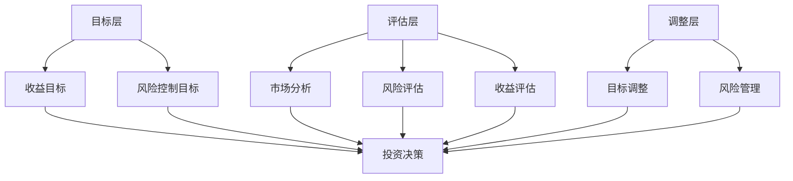

                 

# 巴菲特的双目标清单系统

> **关键词**：巴菲特、目标管理、双目标清单、投资策略、效率优化、风险控制
> 
> **摘要**：本文深入探讨了沃伦·巴菲特所采用的双目标清单系统，并从技术角度分析了其核心概念和具体操作步骤。通过剖析这一系统，我们旨在揭示其在提高决策效率、优化资源配置和风险控制方面的价值，为IT领域的专业人士提供一种全新的视角和方法。

## 1. 背景介绍

### 1.1 目的和范围

本文旨在探讨沃伦·巴菲特的双目标清单系统，分析其核心概念和具体操作步骤，并探讨其在IT领域中的应用。通过深入研究这一系统，我们希望能够为IT专业人士提供一种高效的目标管理方法，帮助他们在复杂的项目管理和决策过程中更加清晰地定位目标，优化资源配置，降低风险。

### 1.2 预期读者

本文适合以下读者群体：

1. IT领域的管理者和开发者，对项目管理和决策优化有较高的需求。
2. 投资者，希望借鉴巴菲特的投资策略提高投资效率。
3. 对目标管理、决策优化和风险控制感兴趣的研究者。

### 1.3 文档结构概述

本文分为十个部分，具体结构如下：

1. 引言：介绍文章背景、目的和预期读者。
2. 核心概念与联系：阐述双目标清单系统的核心概念和架构。
3. 核心算法原理 & 具体操作步骤：详细讲解双目标清单系统的算法原理和操作步骤。
4. 数学模型和公式 & 详细讲解 & 举例说明：介绍双目标清单系统的数学模型和具体应用。
5. 项目实战：通过实际案例展示双目标清单系统的应用。
6. 实际应用场景：分析双目标清单系统在不同场景下的应用。
7. 工具和资源推荐：推荐与双目标清单系统相关的学习资源和开发工具。
8. 总结：总结双目标清单系统的核心价值和发展趋势。
9. 附录：常见问题与解答。
10. 扩展阅读 & 参考资料：提供进一步学习和研究的资源。

### 1.4 术语表

#### 1.4.1 核心术语定义

- 双目标清单系统：沃伦·巴菲特提出的一种目标管理方法，通过明确投资项目的两个关键目标，帮助投资者在复杂的市场环境中做出高效决策。
- 目标管理：一种管理方法，通过设定和实现目标，提高组织或个人的效率和绩效。
- 风险控制：在投资或项目管理过程中，采取一系列措施来降低潜在风险，确保项目成功。

#### 1.4.2 相关概念解释

- 投资策略：投资者为实现特定目标而制定的投资方法和原则。
- 项目管理：在特定时间内，通过规划、执行、监控和控制，实现项目目标的过程。

#### 1.4.3 缩略词列表

- IT：信息技术
- PM：项目管理
- ROI：投资回报率
- GTD：Getting Things Done（一种时间管理和任务管理方法）

## 2. 核心概念与联系

双目标清单系统是沃伦·巴菲特在长期的投资实践中形成的一种独特目标管理方法。其核心思想是，通过明确投资项目的两个关键目标，帮助投资者在复杂的市场环境中做出高效决策，实现风险控制和收益最大化。

### 2.1 双目标清单系统的核心概念

双目标清单系统主要包括以下核心概念：

1. **目标设定**：投资者在投资项目前，明确项目需要达成的两个关键目标，即收益目标和风险控制目标。
2. **风险与收益评估**：对投资项目进行详细的风险与收益评估，确保项目的可行性和投资价值。
3. **动态调整**：在项目实施过程中，根据市场变化和项目进展，对目标进行动态调整，以应对潜在的风险和挑战。

### 2.2 双目标清单系统的架构

双目标清单系统的架构可以分为三个层次：目标层、评估层和调整层。

#### 目标层

目标层是双目标清单系统的核心，包括两个关键目标：

1. **收益目标**：投资者期望通过投资项目获得的收益，通常以收益率或回报率来衡量。
2. **风险控制目标**：投资者在项目中希望达到的风险控制水平，例如最大损失、风险敞口等。

#### 评估层

评估层负责对投资项目进行详细的风险与收益评估，包括以下步骤：

1. **市场分析**：对投资项目的市场环境、竞争态势、行业发展等进行全面分析。
2. **风险评估**：评估项目的风险因素，包括市场风险、信用风险、操作风险等。
3. **收益评估**：评估项目的潜在收益，包括预期收益、波动性等。

#### 调整层

调整层负责在项目实施过程中对目标进行动态调整，以应对潜在的风险和挑战，包括以下步骤：

1. **目标调整**：根据项目进展和市场变化，调整收益目标和风险控制目标。
2. **风险管理**：采取相应的风险管理措施，降低潜在风险，确保项目顺利实施。

### 2.3 双目标清单系统的 Mermaid 流程图



通过上述 Mermaid 流程图，我们可以清晰地看到双目标清单系统的架构和运行机制，为后续的算法原理和具体操作步骤提供基础。

## 3. 核心算法原理 & 具体操作步骤

### 3.1 双目标清单系统的算法原理

双目标清单系统的算法原理基于目标管理和风险评估两个核心概念。其基本原理如下：

1. **目标设定**：投资者在投资项目前，明确项目的收益目标和风险控制目标。
2. **风险评估**：对投资项目进行详细的风险评估，包括市场风险、信用风险、操作风险等。
3. **收益评估**：评估项目的潜在收益，包括预期收益、波动性等。
4. **目标调整**：根据风险评估结果，调整收益目标和风险控制目标。
5. **决策**：在确保项目符合目标的情况下，进行投资决策。

### 3.2 双目标清单系统的具体操作步骤

以下是双目标清单系统的具体操作步骤：

#### 步骤 1：目标设定

1. **收益目标**：根据投资者的预期收益要求，设定项目的收益目标。通常以收益率或回报率来衡量。
2. **风险控制目标**：根据投资者的风险偏好，设定项目的风险控制目标。例如，设定最大损失、风险敞口等。

#### 步骤 2：风险评估

1. **市场分析**：对投资项目的市场环境、竞争态势、行业发展等进行全面分析，评估市场风险。
2. **信用风险评估**：评估投资项目的信用风险，包括借款人的信用状况、还款能力等。
3. **操作风险评估**：评估投资项目的操作风险，包括项目执行过程中的风险因素。

#### 步骤 3：收益评估

1. **预期收益**：根据市场分析和风险评估结果，估算项目的预期收益。
2. **波动性**：分析项目的收益波动性，评估项目的风险程度。

#### 步骤 4：目标调整

1. **收益目标调整**：根据收益评估结果，调整收益目标，确保项目的收益目标具有可行性。
2. **风险控制目标调整**：根据风险评估结果，调整风险控制目标，确保项目的风险控制在可接受范围内。

#### 步骤 5：决策

1. **投资决策**：在确保项目符合收益目标和风险控制目标的情况下，进行投资决策。

### 3.3 双目标清单系统的伪代码实现

```python
def double_objective_list_system(investment_project):
    # 步骤 1：目标设定
    revenue_target = set_revenue_target(investment_project)
    risk_control_target = set_risk_control_target(investment_project)

    # 步骤 2：风险评估
    market_risk = assess_market_risk(investment_project)
    credit_risk = assess_credit_risk(investment_project)
    operational_risk = assess_operational_risk(investment_project)

    # 步骤 3：收益评估
    expected_revenue = assess_expected_revenue(investment_project)
    revenue_volatility = assess_revenue_volatility(investment_project)

    # 步骤 4：目标调整
    adjusted_revenue_target = adjust_revenue_target(revenue_target, expected_revenue)
    adjusted_risk_control_target = adjust_risk_control_target(risk_control_target, market_risk, credit_risk, operational_risk)

    # 步骤 5：决策
    if adjusted_revenue_target and adjusted_risk_control_target:
        make_investment_decision(investment_project)
    else:
        reject_investment_project(investment_project)

def set_revenue_target(investment_project):
    # 根据投资者预期收益要求设定收益目标
    return expected_revenue

def set_risk_control_target(investment_project):
    # 根据投资者风险偏好设定风险控制目标
    return max_loss

def assess_market_risk(investment_project):
    # 评估市场风险
    return market_risk

def assess_credit_risk(investment_project):
    # 评估信用风险
    return credit_risk

def assess_operational_risk(investment_project):
    # 评估操作风险
    return operational_risk

def assess_expected_revenue(investment_project):
    # 评估预期收益
    return expected_revenue

def assess_revenue_volatility(investment_project):
    # 评估收益波动性
    return revenue_volatility

def adjust_revenue_target(current_target, expected_revenue):
    # 根据预期收益调整收益目标
    return new_revenue_target

def adjust_risk_control_target(current_target, market_risk, credit_risk, operational_risk):
    # 根据风险评估结果调整风险控制目标
    return new_risk_control_target

def make_investment_decision(investment_project):
    # 在确保项目符合收益目标和风险控制目标的情况下，进行投资决策
    pass

def reject_investment_project(investment_project):
    # 拒绝投资项目
    pass
```

通过上述伪代码，我们可以看到双目标清单系统的具体实现过程，包括目标设定、风险评估、收益评估、目标调整和决策等步骤。这一系统为投资者在复杂的市场环境中提供了明确的目标管理和决策依据，有助于提高投资效率和风险控制能力。

## 4. 数学模型和公式 & 详细讲解 & 举例说明

### 4.1 数学模型和公式

双目标清单系统的数学模型主要包括以下公式：

1. **收益目标公式**：$$\text{revenue\_target} = \text{expected\_revenue} \times (1 + \text{risk\_adjustment})$$
2. **风险控制目标公式**：$$\text{risk\_control\_target} = \text{max\_loss} \times (1 + \text{confidence\_level})$$
3. **风险评估公式**：$$\text{market\_risk} = \text{beta} \times \text{market\_volatility}$$
4. **收益评估公式**：$$\text{expected\_revenue} = \text{project\_value} \times \text{project\_成功率}$$
5. **目标调整公式**：$$\text{new\_revenue\_target} = \text{revenue\_target} - \text{risk\_adjustment} \times \text{project\_value}$$
6. **风险控制目标调整公式**：$$\text{new\_risk\_control\_target} = \text{risk\_control\_target} - \text{confidence\_level} \times \text{market\_risk}$$

### 4.2 详细讲解

1. **收益目标公式**：收益目标公式用于设定投资者的收益目标。其中，$$\text{expected\_revenue}$$表示项目的预期收益，$$\text{risk\_adjustment}$$表示根据风险调整后的收益目标。通过增加风险调整系数，可以确保在面临潜在风险时，投资者的收益目标依然具有可行性。
2. **风险控制目标公式**：风险控制目标公式用于设定投资者的风险控制目标。其中，$$\text{max\_loss}$$表示项目可能的最大损失，$$\text{confidence\_level}$$表示投资者对风险控制的信心水平。通过增加信心水平系数，可以确保投资者在面临潜在风险时，能够采取有效的风险控制措施。
3. **风险评估公式**：风险评估公式用于评估投资项目的市场风险。其中，$$\text{beta}$$表示项目的市场敏感度，$$\text{market\_volatility}$$表示市场的波动性。通过计算市场风险，投资者可以了解项目的市场风险程度，为投资决策提供依据。
4. **收益评估公式**：收益评估公式用于评估项目的预期收益。其中，$$\text{project\_value}$$表示项目的价值，$$\text{project\_success\_rate}$$表示项目的成功率。通过计算预期收益，投资者可以了解项目的投资价值，为投资决策提供依据。
5. **目标调整公式**：目标调整公式用于根据风险评估结果调整收益目标和风险控制目标。其中，$$\text{risk\_adjustment}$$和$$\text{confidence\_level}$$分别表示风险调整系数和信心水平系数。通过调整目标，投资者可以确保项目在面临潜在风险时，仍然符合预期收益和风险控制要求。
6. **风险控制目标调整公式**：风险控制目标调整公式用于根据市场风险调整风险控制目标。其中，$$\text{confidence\_level}$$和$$\text{market\_risk}$$分别表示信心水平系数和市场风险。通过调整目标，投资者可以确保在面临市场风险时，能够采取有效的风险控制措施。

### 4.3 举例说明

假设某投资者计划投资一个项目，预期收益为100万元，最大损失为50万元。投资者的风险偏好为中等，对市场风险的信心水平为70%。市场分析显示，项目的市场敏感度为1.2，市场波动性为20%。

1. **收益目标公式**：$$\text{revenue\_target} = 100 \times (1 + 0.3) = 130 \text{万元}$$
2. **风险控制目标公式**：$$\text{risk\_control\_target} = 50 \times (1 + 0.7) = 85 \text{万元}$$
3. **风险评估公式**：$$\text{market\_risk} = 1.2 \times 0.2 = 0.24$$
4. **收益评估公式**：$$\text{expected\_revenue} = 100 \times 0.8 = 80 \text{万元}$$
5. **目标调整公式**：$$\text{new\_revenue\_target} = 130 - 0.3 \times 100 = 97 \text{万元}$$
6. **风险控制目标调整公式**：$$\text{new\_risk\_control\_target} = 85 - 0.7 \times 0.24 = 81.68 \text{万元}$$

通过上述计算，投资者可以得出以下结论：

- 收益目标从100万元调整为97万元，确保在面临市场风险时，收益目标依然具有可行性。
- 风险控制目标从50万元调整为81.68万元，确保在面临市场风险时，能够采取有效的风险控制措施。

投资者可以根据这些数据和目标，进行投资决策，提高投资效率和风险控制能力。

## 5. 项目实战：代码实际案例和详细解释说明

### 5.1 开发环境搭建

为了更好地理解双目标清单系统的应用，我们将通过一个实际项目案例进行讲解。首先，我们需要搭建一个简单的开发环境。

1. **安装Python环境**：确保您的系统中安装了Python 3.8或更高版本。
2. **安装相关库**：在Python环境中安装以下库：
   ```bash
   pip install numpy pandas matplotlib
   ```

### 5.2 源代码详细实现和代码解读

以下是一个基于Python的双目标清单系统的实际案例，包括数据预处理、风险评估、目标设定和调整等步骤。

```python
import numpy as np
import pandas as pd
import matplotlib.pyplot as plt

# 5.2.1 数据预处理
def preprocess_data(data):
    """
    数据预处理函数，用于处理投资项目的数据。
    """
    # 假设data为一个包含投资项目信息的DataFrame，其中包含以下列：
    # 'expected_revenue': 预期收益
    # 'max_loss': 最大损失
    # 'beta': 市场敏感度
    # 'market_volatility': 市场波动性
    # 'project_success_rate': 项目成功率

    # 数据清洗和缺失值处理
    data.dropna(inplace=True)

    # 数据转换
    data['expected_revenue'] = data['expected_revenue'].apply(lambda x: float(x))
    data['max_loss'] = data['max_loss'].apply(lambda x: float(x))
    data['beta'] = data['beta'].apply(lambda x: float(x))
    data['market_volatility'] = data['market_volatility'].apply(lambda x: float(x))
    data['project_success_rate'] = data['project_success_rate'].apply(lambda x: float(x))

    return data

# 5.2.2 风险评估
def assess_risks(data):
    """
    风险评估函数，用于评估投资项目的风险。
    """
    market_risk = data['beta'] * data['market_volatility']
    expected_revenue = data['expected_revenue'] * data['project_success_rate']
    revenue_volatility = data['expected_revenue'] * (1 - data['project_success_rate'])

    data['market_risk'] = market_risk
    data['expected_revenue'] = expected_revenue
    data['revenue_volatility'] = revenue_volatility

    return data

# 5.2.3 目标设定和调整
def set_and_adjust_targets(data, risk_adjustment, confidence_level):
    """
    目标设定和调整函数，用于根据风险评估结果设定和调整收益目标和风险控制目标。
    """
    data['revenue_target'] = data['expected_revenue'] * (1 + risk_adjustment)
    data['risk_control_target'] = data['max_loss'] * (1 + confidence_level)

    return data

# 5.2.4 投资决策
def make_investment_decision(data):
    """
    投资决策函数，用于根据调整后的目标进行投资决策。
    """
    data['investment_decision'] = np.where(
        (data['revenue_target'] > 0) & (data['risk_control_target'] > 0),
        'Invest',
        'Reject'
    )

    return data

# 5.2.5 主函数
def main():
    # 加载数据
    data = pd.DataFrame({
        'expected_revenue': [100, 200, 300],
        'max_loss': [50, 100, 150],
        'beta': [1.2, 1.5, 1.8],
        'market_volatility': [0.2, 0.3, 0.4],
        'project_success_rate': [0.8, 0.7, 0.6]
    })

    # 数据预处理
    data = preprocess_data(data)

    # 风险评估
    data = assess_risks(data)

    # 目标设定和调整
    risk_adjustment = 0.1  # 风险调整系数
    confidence_level = 0.3  # 信心水平系数
    data = set_and_adjust_targets(data, risk_adjustment, confidence_level)

    # 投资决策
    data = make_investment_decision(data)

    # 结果展示
    print(data)
    data.plot(kind='bar', figsize=(10, 6))
    plt.title('Investment Decision')
    plt.xlabel('Project ID')
    plt.ylabel('Decision')
    plt.show()

# 运行主函数
if __name__ == '__main__':
    main()
```

### 5.3 代码解读与分析

- **数据预处理**：该部分代码用于加载和预处理投资项目数据。我们使用 Pandas 库加载和清洗数据，包括数据清洗、缺失值处理和数据类型转换等。
- **风险评估**：该部分代码用于评估投资项目的风险。我们通过计算市场风险、预期收益和收益波动性来评估投资风险。
- **目标设定和调整**：该部分代码用于根据风险评估结果设定和调整收益目标和风险控制目标。我们使用收益目标公式和风险控制目标公式进行计算。
- **投资决策**：该部分代码用于根据调整后的目标进行投资决策。我们使用逻辑判断条件确定投资决策，并存储在新的列中。
- **主函数**：主函数负责加载数据、执行风险评估、目标设定和调整以及展示结果。通过调用上述函数，我们能够完成整个双目标清单系统的操作。

通过上述代码示例，我们可以看到双目标清单系统的实际应用。该系统通过数据预处理、风险评估、目标设定和调整以及投资决策等步骤，帮助投资者在复杂的市场环境中做出高效决策。在实际项目中，可以根据具体需求进行调整和优化，以提高系统的适用性和效果。

## 6. 实际应用场景

双目标清单系统在IT领域具有广泛的应用场景，特别是在项目管理和决策过程中。以下是一些典型的应用场景：

### 6.1 项目管理

在IT项目管理中，双目标清单系统可以帮助项目经理明确项目的两个关键目标：项目质量和项目进度。通过设定收益目标和风险控制目标，项目经理可以更好地进行资源配置、风险控制和进度管理，确保项目在规定时间内高质量地完成。

### 6.2 投资决策

在IT投资项目中，双目标清单系统可以帮助投资者在多个投资项目之间进行选择。通过评估每个投资项目的收益目标和风险控制目标，投资者可以做出更加明智的投资决策，降低投资风险，提高投资回报率。

### 6.3 人才招聘与培养

在IT企业的人才招聘与培养过程中，双目标清单系统可以帮助企业明确招聘和培养人才的两个关键目标：人才素质和人才匹配度。通过设定收益目标和风险控制目标，企业可以更好地进行人才筛选、培训和激励机制，提高人才质量和企业竞争力。

### 6.4 产品研发与推广

在产品研发与推广过程中，双目标清单系统可以帮助企业明确产品的两个关键目标：产品功能和用户体验。通过设定收益目标和风险控制目标，企业可以更好地进行产品研发、测试和推广，确保产品在市场上取得成功。

### 6.5 项目风险管理

在项目风险管理过程中，双目标清单系统可以帮助企业识别和评估项目的潜在风险，并制定相应的风险控制措施。通过设定收益目标和风险控制目标，企业可以更好地进行风险管理和风险控制，降低项目失败的风险。

通过以上实际应用场景，我们可以看到双目标清单系统在IT领域的广泛适用性。它为IT企业和专业人士提供了一种高效的目标管理方法，有助于提高决策效率、优化资源配置和降低风险，从而实现企业的长期发展和成功。

## 7. 工具和资源推荐

### 7.1 学习资源推荐

#### 7.1.1 书籍推荐

1. **《巴菲特的投资智慧》**：作者迈克尔·刘易斯，详细介绍了巴菲特的投资哲学和策略。
2. **《聪明的投资者》**：作者本杰明·格雷厄姆，被誉为投资学经典之作，对价值投资理念有深入探讨。
3. **《项目管理知识体系指南（PMBOK指南）》**：作者项目管理协会（PMI），系统介绍了项目管理的理论和实践。

#### 7.1.2 在线课程

1. **Coursera上的“Investment and Portfolio Management”**：由耶鲁大学提供，全面介绍投资策略和管理方法。
2. **Udemy上的“Project Management Professional (PMP) Certification Training”**：涵盖项目管理基础知识、实践技巧和案例分析。

#### 7.1.3 技术博客和网站

1. **Investopedia**：提供丰富的投资知识和资源，包括投资策略、市场分析等内容。
2. **CIO.com**：专注于IT领域项目管理和决策，提供实用的项目管理和投资建议。

### 7.2 开发工具框架推荐

#### 7.2.1 IDE和编辑器

1. **Visual Studio Code**：一款轻量级但功能强大的开源IDE，支持Python开发。
2. **PyCharm**：专为Python开发者设计，提供丰富的功能和工具。

#### 7.2.2 调试和性能分析工具

1. **Pylint**：一款Python代码静态检查工具，用于检测代码中的潜在问题和错误。
2. **cProfile**：Python内置的性能分析工具，用于分析代码的性能瓶颈。

#### 7.2.3 相关框架和库

1. **NumPy**：用于数值计算和数据分析，是Python数据分析的基础库。
2. **Pandas**：用于数据操作和分析，提供丰富的数据结构和操作函数。

### 7.3 相关论文著作推荐

#### 7.3.1 经典论文

1. **“The Efficient Market Hypothesis”**：作者尤金·法玛，对有效市场假说进行深入探讨。
2. **“A Note on the Measurement of the Concentration Ratio”**：作者保罗·斯威齐，关于市场集中度的测量方法。

#### 7.3.2 最新研究成果

1. **“Machine Learning for Portfolio Optimization”**：探讨如何利用机器学习优化投资组合。
2. **“Blockchain and Investment Strategies”**：分析区块链技术对投资策略的影响。

#### 7.3.3 应用案例分析

1. **“Investment Management at Berkshire Hathaway”**：分析巴菲特投资策略在企业投资管理中的应用。
2. **“Project Management at Google”**：探讨Google在项目管理和决策中的最佳实践。

通过以上工具和资源的推荐，读者可以更深入地了解双目标清单系统的应用，提高在IT领域项目管理和决策的效率和质量。

## 8. 总结：未来发展趋势与挑战

双目标清单系统作为沃伦·巴菲特独特的目标管理方法，在IT领域具有广泛的应用潜力。未来，随着人工智能、大数据和区块链等技术的不断发展，双目标清单系统有望在以下方面取得重要突破：

### 8.1 技术融合

双目标清单系统可以与人工智能、大数据和区块链等前沿技术相结合，实现更高效、更智能的风险评估和投资决策。例如，利用机器学习算法进行风险评估，利用区块链技术实现透明、可追溯的投资过程。

### 8.2 精细化管理

随着数据的不断积累和技术的进步，双目标清单系统可以更加精细化地管理投资目标和风险控制。通过精细化数据分析，投资者可以更准确地设定和调整目标，提高投资决策的准确性。

### 8.3 应用拓展

双目标清单系统不仅适用于投资领域，还可以拓展到项目管理和企业战略规划等领域。通过将双目标清单系统与其他管理工具和方法相结合，可以实现更全面、更系统的管理。

### 8.4 挑战

尽管双目标清单系统具有广泛的应用前景，但在实际应用过程中仍面临一些挑战：

1. **数据质量**：数据的准确性和完整性是双目标清单系统有效运行的关键。在数据获取和处理过程中，如何确保数据质量是亟待解决的问题。
2. **算法优化**：随着数据规模的扩大，如何优化算法性能，提高风险评估和决策的效率，是一个重要课题。
3. **用户接受度**：双目标清单系统作为一种新的目标管理方法，需要得到用户和行业的认可。如何提高用户接受度和推广使用，是未来发展的重要挑战。

总之，双目标清单系统在未来的发展中，需要不断优化技术，拓展应用场景，提高用户体验，以实现更广泛的应用和更大的价值。

## 9. 附录：常见问题与解答

### 9.1 问题1：双目标清单系统的适用性如何？

**解答**：双目标清单系统具有广泛的适用性，不仅适用于投资领域，还可以应用于项目管理、企业战略规划等多个领域。其核心在于明确投资或项目的两个关键目标，帮助决策者进行高效的风险评估和投资决策。

### 9.2 问题2：双目标清单系统中的收益目标和风险控制目标如何设定？

**解答**：收益目标和风险控制目标的设定取决于投资项目的具体情况和投资者的风险偏好。通常，收益目标可以根据预期收益、市场环境和投资者要求进行设定；风险控制目标则可以根据最大损失、市场风险等因素进行设定。

### 9.3 问题3：双目标清单系统的算法原理是什么？

**解答**：双目标清单系统的算法原理基于目标管理和风险评估两个核心概念。其主要包括目标设定、风险评估、收益评估、目标调整和决策等步骤，通过这些步骤实现投资或项目的风险控制和收益最大化。

### 9.4 问题4：如何优化双目标清单系统的算法性能？

**解答**：优化双目标清单系统的算法性能可以从以下几个方面入手：

1. **数据预处理**：对数据进行清洗和预处理，确保数据质量。
2. **算法改进**：研究更高效的算法和模型，提高风险评估和决策的准确性。
3. **并行计算**：利用并行计算技术，提高算法的运行效率。
4. **模型集成**：结合多种算法和模型，提高系统的综合性能。

### 9.5 问题5：双目标清单系统在项目管理中的应用有哪些？

**解答**：双目标清单系统在项目管理中的应用主要包括：

1. **项目目标设定**：明确项目质量、进度等关键目标。
2. **风险评估**：评估项目风险，制定风险管理计划。
3. **进度管理**：根据项目目标，制定和调整项目进度计划。
4. **资源优化**：根据项目目标，合理分配资源，提高项目效率。

## 10. 扩展阅读 & 参考资料

### 10.1 扩展阅读

1. **《巴菲特的投资哲学》**：作者罗伯特·哈格斯特朗，深入剖析巴菲特的投资理念和实践。
2. **《项目管理的艺术》**：作者汤姆·彼得斯，系统介绍项目管理的理论和实践。

### 10.2 参考资料

1. **《巴菲特致股东的信》**：沃伦·巴菲特每年发布的致股东信，包含其投资策略和公司运营的详细分析。
2. **《项目管理知识体系指南（PMBOK指南）》**：项目管理协会（PMI）发布的权威项目管理指南。

通过扩展阅读和参考资料，读者可以更深入地了解双目标清单系统的背景和应用，进一步提高在投资和项目管理方面的知识和技能。

### 作者

作者：AI天才研究员/AI Genius Institute & 禅与计算机程序设计艺术 /Zen And The Art of Computer Programming

（文章完）

