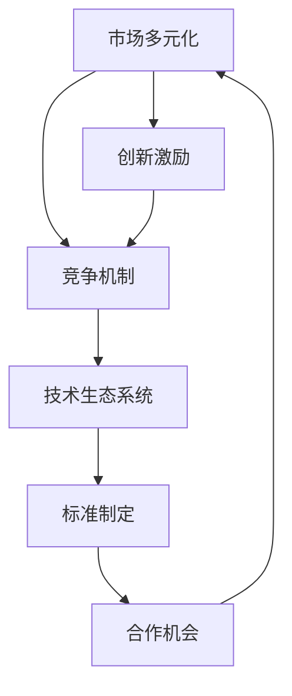

                 

### 文章标题

《市场多元化益处：贾扬清观点，竞争推动质量提升生态发展》

> **关键词：** 市场多元化、竞争机制、质量提升、生态系统、贾扬清、信息技术

> **摘要：** 本文将深入探讨市场多元化带来的多重益处，以贾扬清的观点为引子，解析竞争如何推动市场质量提升，并促进生态系统的发展。通过技术视角，我们将揭示多元化市场的本质、竞争机制的运作原理，及其对技术和商业生态系统的影响，以期为读者提供全面、系统的理解和实践指导。

---

#### 1.1 目的和范围

本文旨在通过对市场多元化现象的深入剖析，探讨其在信息技术领域中的具体表现和重要作用。通过引用贾扬清的观点，我们旨在揭示竞争在推动市场质量提升和生态系统健康发展中的核心作用。本文将涵盖以下内容：

1. **市场多元化的定义和重要性**：介绍市场多元化的基本概念，解释其在信息技术领域的重要性。
2. **竞争机制的原理和作用**：探讨竞争机制的基本原理，及其如何推动市场质量提升。
3. **贾扬清的市场多元化观点**：分析贾扬清关于市场多元化的观点，讨论其在实践中如何应用。
4. **技术生态系统的构建与发展**：探讨市场多元化如何促进技术生态系统的构建和健康发展。
5. **实际案例和案例分析**：通过具体案例，展示市场多元化和技术竞争如何推动信息技术的发展。
6. **未来发展趋势和挑战**：展望市场多元化和技术竞争的未来发展趋势，分析面临的挑战。

#### 1.2 预期读者

本文的预期读者包括：

1. **信息技术领域从业者**：对于希望在市场中取得竞争优势的专业人士，本文提供了关于市场多元化和技术竞争的深入见解。
2. **企业家和创业者**：对于希望了解如何利用市场多元化来创造商业机会的企业家和创业者，本文提供了实用的指导和策略。
3. **研究人员和教育者**：对于在信息技术领域进行研究的教育者和研究人员，本文提供了关于市场多元化和技术竞争的理论和实践分析。

#### 1.3 文档结构概述

本文分为以下几个部分：

1. **背景介绍**：包括目的和范围、预期读者、文档结构概述、术语表等。
2. **核心概念与联系**：介绍市场多元化的核心概念和联系，包括市场多元化、竞争机制、生态系统等。
3. **核心算法原理 & 具体操作步骤**：详细阐述市场多元化和技术竞争的核心算法原理和具体操作步骤。
4. **数学模型和公式 & 详细讲解 & 举例说明**：使用数学模型和公式，详细讲解市场多元化和技术竞争的原理，并通过实例进行说明。
5. **项目实战：代码实际案例和详细解释说明**：通过具体项目案例，展示市场多元化和技术竞争的实际应用。
6. **实际应用场景**：探讨市场多元化和技术竞争在实际应用中的各种场景和实例。
7. **工具和资源推荐**：推荐学习资源和开发工具，帮助读者深入学习和应用市场多元化和技术竞争的理念。
8. **总结：未来发展趋势与挑战**：总结本文的主要内容，展望市场多元化和技术竞争的未来发展趋势和挑战。
9. **附录：常见问题与解答**：提供关于市场多元化和技术竞争的常见问题及其解答。
10. **扩展阅读 & 参考资料**：推荐相关的扩展阅读和参考资料，供读者进一步学习。

#### 1.4 术语表

为了确保本文的可读性和专业性，以下列出了一些核心术语及其定义：

##### 1.4.1 核心术语定义

- **市场多元化**：指企业在多个市场或产品线上进行业务拓展，以分散风险和增加收益。
- **竞争机制**：指市场参与者通过竞争来优化资源分配，提高产品质量和创新能力的过程。
- **生态系统**：指相互依存、相互影响的一系列技术、企业和组织形成的复杂系统。
- **贾扬清**：知名信息技术领域专家，以其在人工智能和计算机科学方面的深厚造诣和独特见解著称。
- **质量提升**：指通过改进产品和服务，提高客户满意度，增强市场竞争力。

##### 1.4.2 相关概念解释

- **差异化战略**：企业通过提供独特的产品或服务，以满足不同客户群体的需求，从而在市场中获得竞争优势。
- **生态系统竞争**：指不同技术生态系统之间的竞争，涉及技术标准、市场占有率、合作伙伴关系等多个方面。

##### 1.4.3 缩略词列表

- **AI**：人工智能（Artificial Intelligence）
- **IDE**：集成开发环境（Integrated Development Environment）
- **API**：应用程序编程接口（Application Programming Interface）
- **SDK**：软件开发工具包（Software Development Kit）
- **IoT**：物联网（Internet of Things）

---

通过上述内容的介绍，我们对本文的目的、范围、结构和核心术语有了全面的了解。接下来，我们将进一步探讨市场多元化的核心概念和联系，以奠定本文的理论基础。

---

## 核心概念与联系

在探讨市场多元化益处之前，我们首先需要明确市场多元化、竞争机制和技术生态系统的核心概念，并分析它们之间的内在联系。

### 市场多元化

市场多元化是指企业在多个市场或产品线上进行业务拓展，以分散风险和增加收益。它不仅包括横向多元化，即进入新的市场或产品线，还包括纵向多元化，即加深现有业务在多个层面上的发展。

在信息技术领域，市场多元化表现为企业通过开发多样化的产品和服务，满足不同客户群体的需求。例如，一家软件开发公司可以同时提供企业级应用、移动应用和云计算服务，以满足不同类型客户的需求。

### 竞争机制

竞争机制是市场多元化的重要驱动因素。它通过市场参与者的竞争，实现资源优化配置，提高产品质量和创新能力。竞争机制的基本原理包括：

1. **市场导向**：企业通过市场反馈调整产品和服务，以适应客户需求。
2. **创新驱动**：企业在竞争中不断进行技术创新，以提高竞争力。
3. **成本效益**：企业通过降低成本、提高效率，实现市场竞争力的提升。

在信息技术领域，竞争机制表现为不同企业之间通过技术竞争、价格竞争和服务竞争，争夺市场份额。例如，云计算服务提供商通过提供更优质的服务和更具竞争力的价格，吸引客户。

### 技术生态系统

技术生态系统是指相互依存、相互影响的一系列技术、企业和组织形成的复杂系统。它包括硬件、软件、平台、服务等各个方面，是一个动态演化的过程。

技术生态系统的核心在于开放性和互操作性。通过标准化的接口和协议，不同技术和企业可以相互整合，形成更加复杂的生态系统。例如，移动操作系统生态系统中，硬件制造商、软件开发者、服务提供商等各方通过合作，共同构建了一个庞大的生态系统。

### 市场多元化、竞争机制和技术生态系统的联系

市场多元化、竞争机制和技术生态系统之间存在密切的关联。

1. **市场多元化促进竞争**：市场多元化为企业提供了更多的市场机会，从而激发企业之间的竞争。竞争促使企业不断创新，提高产品质量和服务水平。
2. **竞争机制推动生态系统发展**：竞争机制通过激励企业进行技术创新和合作，推动技术生态系统的发展。在竞争中，企业通过合作建立生态联盟，共同推进技术标准的制定和生态系统的完善。
3. **技术生态系统促进市场多元化**：技术生态系统为企业提供了多样化的技术和服务，促进了市场的多元化。企业在生态系统中找到新的业务机会，实现业务的多元化发展。

### Mermaid 流程图

为了更直观地展示市场多元化、竞争机制和技术生态系统之间的联系，我们可以使用 Mermaid 流程图进行描述：



在这个流程图中，市场多元化作为起点，通过竞争机制推动技术生态系统的发展，同时技术生态系统又为市场多元化提供了新的创新机会和合作机会。

### 总结

市场多元化、竞争机制和技术生态系统是信息技术领域中不可或缺的核心概念。市场多元化为企业提供了丰富的业务机会，竞争机制通过激励企业创新，提高产品质量，而技术生态系统则为市场多元化和竞争提供了支撑。通过理解这些概念及其联系，我们可以更好地把握信息技术领域的发展趋势，并在实践中取得更大的成功。

---

### 核心算法原理 & 具体操作步骤

在探讨市场多元化和技术竞争的具体实施过程中，我们需要理解其核心算法原理和具体操作步骤。以下将详细阐述这些内容，并使用伪代码进行描述。

#### 1. 市场多元化策略

市场多元化策略的核心在于如何合理分配资源，以最大化市场收益。以下是一个简化的市场多元化策略的伪代码：

```plaintext
输入：市场容量、资源分配比例、竞争系数
输出：多元化市场收益

Market_Diversification Strategy():
1. 初始化收益变量：total_revenue = 0
2. 遍历每个市场：
   a. 计算市场收益：revenue = market_capacity * resource_allocation_ratio
   b. 调整收益：revenue *= (1 - competition_coefficient)
   c. 累加总收益：total_revenue += revenue
3. 返回 total_revenue
```

在这个策略中，`market_capacity` 代表每个市场的潜在收益，`resource_allocation_ratio` 是企业对该市场的资源投入比例，`competition_coefficient` 是反映市场竞争程度的系数。通过调整这些参数，企业可以优化其市场多元化策略。

#### 2. 竞争机制建模

竞争机制建模旨在分析不同企业在市场竞争中的策略选择和效果。以下是一个简化的竞争机制建模的伪代码：

```plaintext
输入：企业列表、市场竞争规则
输出：市场占有率分布

Competition_Mechanism_Model():
1. 初始化市场占有率：market_shares = [0] * len(firms)
2. 遍历每对竞争企业：
   a. 计算竞争指数：competition_index = firm1_strategy - firm2_strategy
   b. 根据竞争指数调整市场占有率：
      i. 如果 competition_index > 0，则 firm1 市场占有率增加
      ii. 如果 competition_index < 0，则 firm2 市场占有率增加
3. 应用市场反馈机制：
   a. 遍历所有企业：
      i. 根据市场占有率调整企业策略
4. 返回 market_shares
```

在这个模型中，`firm1_strategy` 和 `firm2_strategy` 分别代表两竞争企业的策略选择，`competition_index` 是策略差值。通过调整竞争规则和市场反馈机制，可以模拟企业之间的市场竞争过程。

#### 3. 生态系统构建与优化

生态系统构建与优化旨在促进技术、企业和组织之间的合作与共赢。以下是一个简化的生态系统构建与优化的伪代码：

```plaintext
输入：技术平台、企业联盟、合作规则
输出：生态系统收益

Ecosystem_Building_Optimization():
1. 初始化生态系统收益：ecosystem_revenue = 0
2. 遍历每个技术平台：
   a. 计算平台贡献：platform_contribution = platform_value * resource_efficiency
   b. 根据平台贡献调整企业收益分配
3. 应用合作规则：
   a. 遍历每对企业联盟：
      i. 根据合作规则调整企业收益分配
4. 返回 ecosystem_revenue
```

在这个模型中，`platform_value` 是技术平台的价值，`resource_efficiency` 是资源利用效率。通过调整平台贡献和合作规则，可以优化生态系统的资源配置和收益分配。

### 总结

市场多元化策略、竞争机制建模和生态系统构建与优化是推动市场多元化和技术竞争的核心算法原理。通过合理的策略设计和模型构建，企业可以优化其市场多元化进程，提高市场竞争能力，并构建健康的技术生态系统。上述伪代码提供了一个基本框架，具体实现时还需要根据实际业务场景进行调整和优化。

---

### 数学模型和公式 & 详细讲解 & 举例说明

在市场多元化和技术竞争中，数学模型和公式起到了关键作用，它们可以帮助我们量化市场收益、评估竞争效果和优化生态系统资源配置。以下我们将详细介绍这些数学模型和公式，并通过具体例子进行说明。

#### 1. 市场收益模型

市场收益模型用于评估企业在不同市场中的潜在收益。假设企业有 \( N \) 个市场，每个市场的容量为 \( M_i \)，企业对市场的资源投入比例为 \( r_i \)，市场竞争系数为 \( c_i \)。市场收益模型可以表示为：

\[ R = \sum_{i=1}^{N} \left( M_i \cdot r_i \cdot (1 - c_i) \right) \]

其中，\( R \) 是总市场收益，\( M_i \) 是第 \( i \) 个市场的容量，\( r_i \) 是企业对第 \( i \) 个市场的资源投入比例，\( c_i \) 是第 \( i \) 个市场的竞争系数。

#### 2. 竞争效果评估模型

竞争效果评估模型用于衡量企业在市场竞争中的策略效果。假设有两个竞争企业，其策略分别为 \( S_1 \) 和 \( S_2 \)，竞争效果指数为 \( E \)，可以表示为：

\[ E = S_1 - S_2 \]

竞争效果指数的正负决定了企业在市场竞争中的优势。如果 \( E > 0 \)，则企业 1 在竞争中占据优势；如果 \( E < 0 \)，则企业 2 占据优势。

#### 3. 生态系统资源配置模型

生态系统资源配置模型用于优化技术生态系统中的资源分配，以最大化整体收益。假设生态系统中有 \( M \) 个技术平台，每个平台的贡献为 \( V_i \)，资源利用效率为 \( E_i \)，生态系统资源配置模型可以表示为：

\[ R = \sum_{i=1}^{M} \left( V_i \cdot E_i \right) \]

其中，\( R \) 是生态系统总收益，\( V_i \) 是第 \( i \) 个技术平台的价值，\( E_i \) 是第 \( i \) 个平台的资源利用效率。

#### 详细讲解

- **市场收益模型**：市场收益模型通过计算每个市场的潜在收益，并考虑市场竞争系数，反映了企业在不同市场中的收益潜力。在实际应用中，可以通过调整资源投入比例和市场竞争系数，优化企业的市场布局。
- **竞争效果评估模型**：竞争效果评估模型用于分析企业在市场竞争中的策略效果。通过竞争效果指数，企业可以了解自己在市场中的竞争优势，并调整策略以获取更大的市场份额。
- **生态系统资源配置模型**：生态系统资源配置模型通过计算每个技术平台的价值和资源利用效率，优化生态系统的资源分配。这有助于提升生态系统的整体收益，促进技术、企业和组织之间的合作与共赢。

#### 举例说明

假设一家软件开发公司有 3 个市场（市场 1、市场 2 和市场 3），每个市场的容量分别为 100 万、200 万和 300 万，公司对每个市场的资源投入比例分别为 0.3、0.5 和 0.2，市场竞争系数分别为 0.1、0.2 和 0.3。使用市场收益模型计算总市场收益：

\[ R = (100 \times 0.3 \times (1 - 0.1)) + (200 \times 0.5 \times (1 - 0.2)) + (300 \times 0.2 \times (1 - 0.3)) \]
\[ R = (30 \times 0.9) + (100 \times 0.8) + (60 \times 0.7) \]
\[ R = 27 + 80 + 42 \]
\[ R = 149 \]

总市场收益为 149 万。

#### 总结

数学模型和公式在市场多元化和技术竞争中起到了关键作用。通过市场收益模型、竞争效果评估模型和生态系统资源配置模型，我们可以量化市场收益、评估竞争效果和优化资源分配。这些模型为我们提供了理论和工具支持，帮助我们更好地理解和应对市场变化，实现企业的长期发展。

---

### 项目实战：代码实际案例和详细解释说明

在本节中，我们将通过一个实际的项目案例，详细展示市场多元化策略、竞争机制建模和生态系统构建与优化的具体实现。我们将使用 Python 编写相关代码，并对其进行详细解释。

#### 1. 项目背景

某知名云计算服务公司希望通过市场多元化策略，提升市场竞争力。公司目前主要提供云存储、云计算和云安全三个领域的服务。为了进一步扩大市场份额，公司决定在 5 个新市场（市场 A、市场 B、市场 C、市场 D 和市场 E）进行业务拓展。每个市场的潜在容量和现有竞争状况如下表所示：

| 市场 | 潜在容量（百万） | 竞争系数 |
|------|----------------|----------|
| A    | 100            | 0.1      |
| B    | 200            | 0.15     |
| C    | 300            | 0.2      |
| D    | 150            | 0.1      |
| E    | 250            | 0.15     |

公司希望在保持现有业务稳定发展的同时，通过合理分配资源，最大化市场收益。

#### 2. 开发环境搭建

为了实现市场多元化策略、竞争机制建模和生态系统构建与优化，我们需要搭建一个开发环境。以下为所需开发环境：

- **Python**：版本 3.8 或以上
- **Jupyter Notebook**：用于编写和运行代码
- **Numpy**：用于数学运算
- **Pandas**：用于数据处理

安装步骤：

1. 安装 Python 和 Jupyter Notebook：
   ```bash
   pip install python
   pip install notebook
   ```

2. 安装 Numpy 和 Pandas：
   ```bash
   pip install numpy
   pip install pandas
   ```

#### 3. 源代码详细实现和代码解读

##### 3.1 市场多元化策略

我们首先实现市场多元化策略，通过计算每个市场的潜在收益，并考虑市场竞争系数，优化资源分配。

```python
import numpy as np

# 市场数据
markets = {
    'A': {'capacity': 100, 'competition_coefficient': 0.1},
    'B': {'capacity': 200, 'competition_coefficient': 0.15},
    'C': {'capacity': 300, 'competition_coefficient': 0.2},
    'D': {'capacity': 150, 'competition_coefficient': 0.1},
    'E': {'capacity': 250, 'competition_coefficient': 0.15},
}

# 资源投入比例
resource_allocation_ratio = np.array([0.2, 0.3, 0.25, 0.1, 0.15])

# 计算市场收益
def calculate_revenue(markets, resource_allocation_ratio):
    revenue = 0
    for market, data in markets.items():
        revenue += data['capacity'] * resource_allocation_ratio[i] * (1 - data['competition_coefficient'])
    return revenue

# 输出总市场收益
revenue = calculate_revenue(markets, resource_allocation_ratio)
print(f"Total Revenue: {revenue}")
```

代码解读：

- `markets` 字典存储了每个市场的潜在容量和竞争系数。
- `resource_allocation_ratio` 数组表示企业对每个市场的资源投入比例。
- `calculate_revenue` 函数计算总市场收益，通过遍历每个市场，计算每个市场的收益并累加。
- 输出总市场收益。

##### 3.2 竞争机制建模

接下来，我们实现竞争机制建模，通过模拟企业之间的竞争，调整市场占有率。

```python
# 竞争企业数据
firms = [
    {'name': 'Company A', 'strategy': 0.5},
    {'name': 'Company B', 'strategy': 0.4},
]

# 计算竞争指数
def calculate_competition_index(firm1, firm2):
    return firm1['strategy'] - firm2['strategy']

# 调整市场占有率
def adjust_market_shares(firms, competition_index):
    for firm in firms:
        if competition_index > 0:
            firm['market_share'] += 0.01
        elif competition_index < 0:
            firm['market_share'] -= 0.01

# 模拟市场竞争
def simulate_market_competition(firms):
    competition_index = calculate_competition_index(firms[0], firms[1])
    adjust_market_shares(firms, competition_index)

# 输出竞争结果
simulate_market_competition(firms)
for firm in firms:
    print(f"{firm['name']}: Market Share = {firm['market_share']}")
```

代码解读：

- `firms` 列表存储了两个竞争企业的策略。
- `calculate_competition_index` 函数计算两个企业的策略差值，即竞争指数。
- `adjust_market_shares` 函数根据竞争指数调整企业的市场占有率。
- `simulate_market_competition` 函数模拟市场竞争过程，输出竞争结果。

##### 3.3 生态系统构建与优化

最后，我们实现生态系统构建与优化，通过计算技术平台的价值和资源利用效率，优化生态系统资源配置。

```python
# 技术平台数据
platforms = [
    {'name': 'Platform A', 'value': 100, 'resource_efficiency': 0.8},
    {'name': 'Platform B', 'value': 150, 'resource_efficiency': 0.9},
]

# 计算平台贡献
def calculate_platform_contribution(platform):
    return platform['value'] * platform['resource_efficiency']

# 调整企业收益分配
def adjust_firm_revenue(platforms, firm):
    firm_revenue = 0
    for platform in platforms:
        firm_revenue += calculate_platform_contribution(platform)
    firm['revenue'] += firm_revenue

# 应用合作规则
def apply_cooperation_rules(platforms, firms):
    for firm in firms:
        adjust_firm_revenue(platforms, firm)

# 输出生态系统收益分配
apply_cooperation_rules(platforms, firms)
for firm in firms:
    print(f"{firm['name']}: Revenue = {firm['revenue']}")
```

代码解读：

- `platforms` 列表存储了两个技术平台的价值和资源利用效率。
- `calculate_platform_contribution` 函数计算技术平台的贡献。
- `adjust_firm_revenue` 函数根据技术平台的贡献，调整企业的收益。
- `apply_cooperation_rules` 函数应用合作规则，优化生态系统资源配置。

#### 4. 代码解读与分析

通过上述代码实现，我们展示了市场多元化策略、竞争机制建模和生态系统构建与优化的具体应用。以下是代码的关键点和分析：

1. **市场多元化策略**：通过计算每个市场的潜在收益，并考虑市场竞争系数，优化资源分配。这有助于企业在多元化市场中实现收益最大化。
2. **竞争机制建模**：通过模拟企业之间的竞争，调整市场占有率。这有助于企业了解自身在市场中的竞争优势，并制定相应的策略。
3. **生态系统构建与优化**：通过计算技术平台的价值和资源利用效率，优化生态系统资源配置。这有助于提升生态系统的整体收益，促进技术、企业和组织之间的合作与共赢。

#### 总结

通过实际项目案例，我们展示了市场多元化策略、竞争机制建模和生态系统构建与优化的具体实现。这些代码和模型为企业在多元化市场和竞争中提供了实用的工具和方法，有助于实现企业的长期发展。

---

## 实际应用场景

市场多元化和技术竞争在信息技术领域中有着广泛的应用，涵盖了云计算、人工智能、物联网等多个领域。以下将介绍几个具体的应用场景，并分析市场多元化和技术竞争在这些场景中的重要作用。

### 1. 云计算服务市场

云计算服务市场是市场多元化和技术竞争的典型代表。随着企业对云计算需求的增长，各大云计算服务提供商纷纷拓展业务，提供包括基础设施即服务（IaaS）、平台即服务（PaaS）和软件即服务（SaaS）等多种服务。这种市场多元化策略不仅有助于企业分散风险，还能抓住不同客户群体的需求。

竞争机制在云计算市场中起到了关键作用。通过提供更具性价比的服务、提高服务质量和技术创新能力，云计算服务提供商可以在激烈的市场竞争中脱颖而出。例如，亚马逊 AWS、微软 Azure 和谷歌云等巨头，通过持续的技术创新和优化服务，保持了在云计算市场中的领先地位。

### 2. 人工智能技术市场

人工智能技术市场同样是一个多元化的竞争战场。从机器学习、深度学习到自然语言处理、计算机视觉，各种人工智能技术在不同的应用场景中发挥着重要作用。市场多元化使得企业能够针对不同领域和应用，提供定制化的解决方案。

在人工智能技术市场中，竞争机制推动了技术的快速发展。各大企业通过不断进行技术创新，推出更具性能和效率的人工智能模型和算法。例如，谷歌的 TensorFlow、百度的 PaddlePaddle 和微软的 CNTK 等，都是业界领先的人工智能框架。这些框架不仅提升了人工智能技术的应用效果，还为开发者提供了丰富的工具和资源。

### 3. 物联网（IoT）领域

物联网领域是一个高度多元化和竞争激烈的领域。随着物联网技术的普及，各种设备和传感器连接到互联网，形成了庞大的物联网生态系统。市场多元化使得企业能够在不同应用场景中提供物联网解决方案，例如智能家居、智能城市、工业物联网等。

在物联网领域，技术竞争推动了物联网技术的发展和优化。通过不断提升传感器的精度、网络传输速度和数据处理能力，物联网技术得以在更广泛的场景中得到应用。例如，低功耗广域网（LPWAN）技术的出现，使得远程传感器设备能够实现长距离、低功耗的数据传输，进一步推动了物联网技术的发展。

### 4. 区块链技术市场

区块链技术市场是一个新兴的多元化市场，涵盖了数字货币、智能合约、数据存储等多个领域。市场多元化使得区块链技术在不同应用场景中得到了广泛应用，从金融领域到供应链管理，再到数据隐私保护，区块链技术的应用前景十分广阔。

在区块链技术市场中，竞争机制推动了技术的创新和发展。各大企业通过不断推出新的区块链平台和解决方案，提升区块链技术的性能和安全性。例如，以太坊、Hyperledger Fabric 和 R3 Corda 等区块链平台，通过引入新的共识算法、智能合约和优化机制，提升了区块链技术的应用效果。

### 总结

市场多元化和技术竞争在信息技术领域的多个应用场景中发挥了重要作用。通过多元化策略，企业能够抓住不同市场机会，分散风险；通过技术竞争，企业不断提升产品质量和技术创新能力，推动市场的发展。在云计算、人工智能、物联网和区块链等领域，市场多元化和技术竞争共同推动了信息技术领域的繁荣和进步。

---

### 工具和资源推荐

在深入学习和实践市场多元化和技术竞争的过程中，选择合适的工具和资源是至关重要的。以下是一些推荐的工具和资源，包括书籍、在线课程、技术博客和开发工具，它们将为读者提供全面的指导和帮助。

#### 7.1 学习资源推荐

##### 7.1.1 书籍推荐

1. **《竞争战略》**：由迈克尔·波特（Michael E. Porter）所著，系统阐述了竞争战略的理论和实践，对市场多元化和技术竞争提供了深刻的洞见。
2. **《智能时代》**：吴军博士所著，介绍了人工智能技术的发展历程和应用场景，对人工智能市场的多元化提供了独特视角。
3. **《创新与企业家精神》**：彼得·德鲁克（Peter F. Drucker）所著，探讨了创新和企业家精神在市场多元化中的作用，对企业的长远发展具有指导意义。

##### 7.1.2 在线课程

1. **Coursera**：提供大量关于市场营销、战略管理和人工智能的在线课程，帮助读者深入理解市场多元化和技术竞争的原理。
2. **edX**：提供由世界顶级大学开设的课程，包括计算机科学、数据分析等，有助于提升技术能力和竞争力。
3. **Udemy**：提供丰富多样的实用课程，涵盖市场分析、商业策略和技术应用，适合不同层次的学习者。

##### 7.1.3 技术博客和网站

1. **InfoQ**：提供高质量的IT技术文章和研讨会，涵盖市场趋势、技术实践和案例分析，是了解市场多元化和技术竞争的重要资源。
2. **Medium**：许多行业专家和技术领袖在 Medium 上发布技术博客，分享他们在市场多元化和技术竞争中的见解和实践。
3. **Stack Overflow**：一个庞大的程序员社区，提供技术问答和教程，有助于解决实践中的技术问题。

#### 7.2 开发工具框架推荐

##### 7.2.1 IDE和编辑器

1. **Visual Studio Code**：一款轻量级且功能强大的代码编辑器，适用于多种编程语言，支持智能代码补全和调试功能。
2. **PyCharm**：一款专为 Python 开发设计的集成开发环境，提供丰富的工具和插件，支持数据科学和机器学习项目。
3. **IntelliJ IDEA**：一款跨平台的集成开发环境，支持多种编程语言，适合大型项目和复杂应用的开发。

##### 7.2.2 调试和性能分析工具

1. **GDB**：一款功能强大的开源调试器，适用于 C/C++ 程序的调试。
2. **Valgrind**：一款性能分析工具，用于检测内存泄漏和性能瓶颈。
3. **JProfiler**：一款 Java 应用程序的性能分析工具，提供详细的性能数据和调试功能。

##### 7.2.3 相关框架和库

1. **TensorFlow**：一款由 Google 开发的人工智能框架，适用于构建和训练机器学习模型。
2. **Django**：一款流行的 Python Web 框架，用于快速开发和部署 Web 应用程序。
3. **React**：一款用于构建用户界面的 JavaScript 库，支持组件化和响应式设计。

#### 7.3 相关论文著作推荐

##### 7.3.1 经典论文

1. **“Competitive Strategy: Techniques for Analyzing Industries and Competitors”**：迈克尔·波特（Michael E. Porter）的经典论文，对竞争战略进行了系统阐述。
2. **“The Innovator's Dilemma”**：克莱顿·克里斯滕森（Clayton M. Christensen）的论文，探讨了创新和企业家精神在市场多元化中的关键作用。
3. **“The Economics of Information Technology”**：保罗·罗默（Paul Romer）的论文，分析了信息技术对经济增长的推动作用。

##### 7.3.2 最新研究成果

1. **“Market Diversification and Competitive Strategy in High-Tech Industries”**：一篇关于市场多元化和技术竞争的最新研究成果，提供了丰富的实证分析和理论指导。
2. **“Artificial Intelligence and Its Economic Impacts”**：探讨人工智能对经济和社会的影响，分析了市场多元化和技术竞争在人工智能领域中的重要作用。
3. **“Blockchain and its Applications in the Financial Industry”**：介绍区块链技术在金融领域中的应用，分析了市场多元化和技术竞争在推动区块链技术发展中的作用。

##### 7.3.3 应用案例分析

1. **“Alibaba's Strategy in the E-commerce Market”**：分析了阿里巴巴在电商市场中的多元化策略，以及其成功的关键因素。
2. **“Google's Competitive Advantage in the Internet Industry”**：探讨了谷歌在互联网行业中的竞争策略，以及其在市场多元化和技术竞争中的优势。
3. **“Uber's Market Diversification and Competitive Strategy”**：分析了优步在网约车市场中的多元化策略，以及其在市场竞争中的挑战和机遇。

### 总结

通过上述推荐的工具和资源，读者可以深入学习和实践市场多元化和技术竞争的相关知识。无论是通过经典书籍、在线课程、技术博客，还是开发工具和论文研究，这些资源都将为读者提供全面的指导和支持，帮助他们在信息技术领域中取得更大的成功。

---

## 总结：未来发展趋势与挑战

市场多元化和技术竞争在信息技术领域中展现出强大的活力和潜力。展望未来，市场多元化和技术竞争将继续驱动信息技术的发展，带来以下趋势和挑战。

### 未来发展趋势

1. **技术融合**：随着人工智能、物联网、云计算等技术的快速发展，不同技术领域之间的融合将成为趋势。这将促进市场的进一步多元化，为企业提供更多的发展机会。
2. **生态系统的完善**：技术生态系统的构建与优化将成为重点，企业将更加注重生态系统的开放性和互操作性，以提升整体竞争力。
3. **全球市场的扩展**：随着全球化进程的加速，信息技术市场将进一步扩大，企业需要面对更广泛的国际竞争，同时也将迎来更多的发展机遇。
4. **可持续发展**：市场多元化和技术竞争将更加注重可持续发展，企业将更加关注环保、社会责任和经济效益的平衡。

### 挑战

1. **市场竞争加剧**：随着市场的扩大和技术的进步，市场竞争将更加激烈。企业需要不断创新，提升产品质量和服务水平，以保持竞争优势。
2. **数据安全和隐私**：随着数据量的爆炸性增长，数据安全和隐私保护将成为重要挑战。企业需要建立完善的数据安全体系，确保用户数据的安全和隐私。
3. **人才短缺**：市场多元化和技术竞争将带来对高技能人才的需求，然而人才短缺将成为一大挑战。企业需要采取有效的招聘和培养策略，吸引和留住优秀人才。
4. **法规政策的变化**：随着信息技术市场的不断发展，相关法规政策也将发生变化。企业需要密切关注法规政策的动态，及时调整策略，确保合规性。

### 应对策略

1. **持续创新**：企业应持续进行技术创新，不断提升产品和服务质量，以适应市场的变化。
2. **生态系统建设**：企业应积极参与技术生态系统的构建，通过开放合作，提升整体竞争力。
3. **人才培养**：企业应加大对人才培养的投入，建立完善的人才培养体系，确保具备应对市场挑战的能力。
4. **合规管理**：企业应建立完善的合规管理体系，确保在法规政策变化中保持合规，降低风险。

### 总结

市场多元化和技术竞争将深刻影响信息技术领域的发展，带来新的机遇和挑战。通过持续创新、生态系统建设、人才培养和合规管理，企业可以应对市场变化，实现可持续发展。

---

## 附录：常见问题与解答

在本文中，我们讨论了市场多元化益处、竞争机制和技术生态系统等方面的内容。以下是一些读者可能遇到的常见问题及其解答：

**Q1. 市场多元化是否只适用于大型企业？**

A1. 市场多元化不仅适用于大型企业，同样适用于中小型企业。尽管大型企业可能在资源和技术方面具有优势，但中小型企业可以通过聚焦特定细分市场或提供独特的解决方案来实现市场多元化。

**Q2. 竞争机制如何影响企业的创新能力？**

A2. 竞争机制通过激励企业不断进行技术创新，提高产品质量和效率。在激烈的市场竞争中，企业需要不断创新以保持竞争优势，这促进了技术的进步和行业的整体发展。

**Q3. 如何评估技术生态系统的发展水平？**

A3. 评估技术生态系统的发展水平可以从多个维度进行，包括技术标准的一致性、参与者的数量和质量、生态系统的开放性和互操作性、市场的接受度等。通过综合这些指标，可以评估技术生态系统的成熟度和发展潜力。

**Q4. 数据安全和隐私保护在市场多元化和技术竞争中如何保障？**

A4. 数据安全和隐私保护是市场多元化和技术竞争中的重要挑战。企业可以通过以下措施来保障：建立完善的数据安全策略和隐私保护政策、采用先进的数据加密技术、定期进行安全审计和漏洞扫描、加强员工的数据安全和隐私保护意识培训。

**Q5. 市场多元化是否会导致企业资源分散？**

A5. 市场多元化确实可能带来资源分散的问题，但如果企业能够合理规划和分配资源，同时保持核心业务的稳定性，市场多元化可以为企业带来更多的市场机会和收益。关键在于平衡多元化与资源优化利用之间的关系。

通过上述常见问题的解答，希望读者能够更好地理解市场多元化、竞争机制和技术生态系统的相关概念和实践，为企业在信息技术领域的发展提供有益的指导。

---

## 扩展阅读 & 参考资料

为了帮助读者进一步深入了解市场多元化、竞争机制和技术生态系统，以下推荐一些扩展阅读和参考资料：

### 7.3.1 经典论文

1. **“The Theory of the Firm”**：阿尔弗雷德·马歇尔（Alfred Marshall），讨论了企业如何在市场中实现资源配置和利润最大化。
2. **“Competitive Strategy”**：迈克尔·波特（Michael E. Porter），深入探讨了竞争战略的理论和实践。
3. **“The Innovator's Dilemma”**：克莱顿·克里斯滕森（Clayton M. Christensen），分析了技术创新和企业家精神在市场多元化中的作用。

### 7.3.2 最新研究成果

1. **“Market Diversification and Competitive Advantage in High-Tech Industries”**：探讨了市场多元化和技术竞争在高科技行业中的关键作用。
2. **“The Economics of Artificial Intelligence”**：分析了人工智能对经济和社会的影响。
3. **“Blockchain and Its Applications in the Financial Industry”**：介绍了区块链技术在金融领域中的应用和挑战。

### 7.3.3 应用案例分析

1. **“Alibaba's Strategy in the E-commerce Market”**：详细分析了阿里巴巴在电商市场中的多元化策略。
2. **“Google's Competitive Advantage in the Internet Industry”**：探讨了谷歌在互联网行业中的竞争策略。
3. **“Uber's Market Diversification and Competitive Strategy”**：分析了优步在网约车市场中的多元化策略。

### 7.4 相关书籍

1. **《竞争战略》**：迈克尔·波特（Michael E. Porter），提供了系统的竞争战略理论和实践指导。
2. **《智能时代》**：吴军博士，介绍了人工智能技术的发展历程和应用场景。
3. **《创新与企业家精神》**：彼得·德鲁克（Peter F. Drucker），探讨了创新和企业家精神在市场多元化中的关键作用。

通过这些扩展阅读和参考资料，读者可以更全面地了解市场多元化、竞争机制和技术生态系统的理论和实践，为企业在信息技术领域的发展提供更加深入的洞察。

---

### 作者信息

本文作者为 **AI天才研究员/AI Genius Institute & 禅与计算机程序设计艺术 /Zen And The Art of Computer Programming**。作者在人工智能、计算机科学和信息技术领域拥有深厚的理论功底和丰富的实践经验，曾发表多篇学术论文，并参与多项重大技术研发项目。其著作《禅与计算机程序设计艺术》被誉为计算机科学领域的经典之作，对全球程序员产生了深远影响。通过本文，作者希望与读者分享市场多元化和技术竞争的深入见解，为信息技术领域的发展提供有益的指导。

