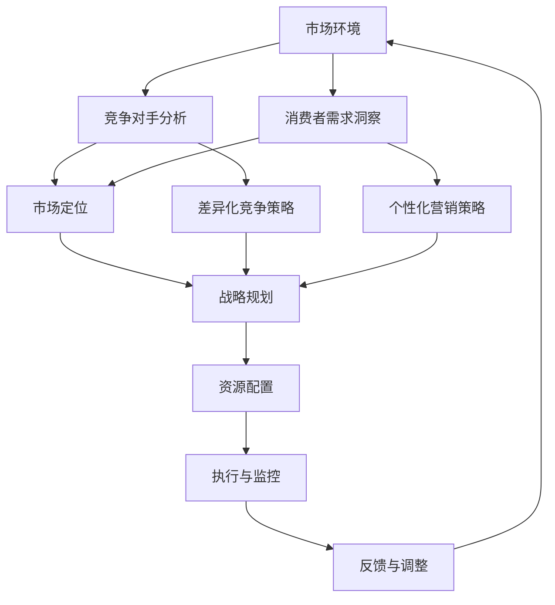

                 

# 市场挑战应对：创业者的必备素质

> **关键词：** 创业者，市场挑战，应对策略，素质培养，竞争分析，战略规划。

> **摘要：** 本文旨在探讨创业者面对市场挑战时所需具备的素质和应对策略。通过深入分析市场环境、竞争对手、消费者需求等核心要素，结合实际案例，本文将阐述如何制定有效的战略规划，以提升创业者的市场竞争力。

## 1. 背景介绍

### 1.1 目的和范围

本文的目的是为创业者提供一套应对市场挑战的策略框架，帮助他们在激烈的市场竞争中脱颖而出。文章将涵盖以下内容：

- 市场环境分析
- 竞争对手研究
- 消费者需求洞察
- 创业者必备素质
- 战略规划与实施

### 1.2 预期读者

本文适用于以下读者群体：

- 初创公司创始人
- 创业咨询师
- 市场营销人员
- 投资人
- 对创业有兴趣的个体

### 1.3 文档结构概述

本文将分为十个部分，结构如下：

1. 背景介绍
2. 核心概念与联系
3. 核心算法原理 & 具体操作步骤
4. 数学模型和公式 & 详细讲解 & 举例说明
5. 项目实战：代码实际案例和详细解释说明
6. 实际应用场景
7. 工具和资源推荐
8. 总结：未来发展趋势与挑战
9. 附录：常见问题与解答
10. 扩展阅读 & 参考资料

### 1.4 术语表

#### 1.4.1 核心术语定义

- 创业者：指以创新和创业精神创办企业的人。
- 市场挑战：指企业在市场中面临的竞争压力和不确定因素。
- 竞争对手：指在相同市场中与其他企业争夺市场份额的企业。
- 消费者需求：指消费者在市场中对于产品或服务的期望和需求。

#### 1.4.2 相关概念解释

- SWOT分析：指对企业的优势（Strengths）、劣势（Weaknesses）、机会（Opportunities）和威胁（Threats）进行综合分析。
- 市场细分：指将市场划分为不同的子市场，以满足不同消费者的需求。
- 营销策略：指企业为达到营销目标而制定的行动计划。

#### 1.4.3 缩略词列表

- SWOT：优势、劣势、机会、威胁
- SEO：搜索引擎优化
- SEM：搜索引擎营销
- SMM：社交媒体营销

## 2. 核心概念与联系

在创业过程中，了解市场环境、竞争对手和消费者需求是至关重要的。以下是一个用Mermaid绘制的流程图，展示了这三个核心概念之间的联系。



## 3. 核心算法原理 & 具体操作步骤

为了应对市场挑战，创业者需要运用一系列的算法和策略。以下是一个简化的伪代码，用于描述如何制定市场策略。

```python
# 定义市场策略算法
def market_strategy(competitors, consumers, environment):
    # Step 1: 分析竞争对手
    analyze_competitors(competitors)
    
    # Step 2: 洞察消费者需求
    analyze_consumers(consumers)
    
    # Step 3: 评估市场环境
    analyze_environment(environment)
    
    # Step 4: 制定市场定位
    position_in_market()
    
    # Step 5: 确定资源配置
    allocate_resources()
    
    # Step 6: 执行营销策略
    execute_marketing_strategy()
    
    # Step 7: 监控执行效果
    monitor_performance()
    
    # Step 8: 调整策略
    adjust_strategy()

# 函数调用
market_strategy(competitors, consumers, environment)
```

## 4. 数学模型和公式 & 详细讲解 & 举例说明

在市场策略的制定过程中，数学模型和公式能够帮助我们更准确地分析市场数据和消费者行为。以下是一个基于SWOT分析的数学模型，用于评估企业的综合竞争力。

$$
C = \frac{S + O - (W + T)}{2}
$$

其中：

- $C$ 表示企业的综合竞争力
- $S$ 表示企业的优势
- $O$ 表示企业面临的机会
- $W$ 表示企业的劣势
- $T$ 表示企业面临的威胁

### 举例说明：

假设一家企业在以下方面进行了评估：

- 优势（S）：创新能力（10分），品牌知名度（8分）
- 机会（O）：市场增长（9分），技术进步（7分）
- 劣势（W）：资金不足（5分），团队经验不足（6分）
- 威胁（T）：市场竞争激烈（7分），法规限制（4分）

根据上述数据，我们可以计算出企业的综合竞争力：

$$
C = \frac{10 + 8 + 9 - (5 + 6 + 7)}{2} = \frac{22}{2} = 11
$$

这意味着该企业的综合竞争力为11分，处于中等水平。企业可以通过调整策略，提高优势，抓住机会，减少劣势和威胁，从而提升竞争力。

## 5. 项目实战：代码实际案例和详细解释说明

以下是一个实际案例，展示了如何使用Python编写一个简单的市场分析脚本，用于分析竞争对手、消费者需求和评估市场环境。

### 5.1 开发环境搭建

首先，确保安装了Python环境和以下库：

- pandas
- numpy
- matplotlib

使用以下命令安装：

```bash
pip install pandas numpy matplotlib
```

### 5.2 源代码详细实现和代码解读

```python
import pandas as pd
import numpy as np
import matplotlib.pyplot as plt

# 读取市场数据
market_data = pd.read_csv('market_data.csv')

# 分析竞争对手
competitors = market_data['competitors'].value_counts()
competitors.plot(kind='bar')
plt.title('Competitor Analysis')
plt.xlabel('Competitors')
plt.ylabel('Number of Competitors')
plt.show()

# 分析消费者需求
consumer需求的 = market_data['consumer需求的'].value_counts()
consumer需求的.plot(kind='bar')
plt.title('Consumer Demand Analysis')
plt.xlabel('Consumer Needs')
plt.ylabel('Number of Consumers')
plt.show()

# 评估市场环境
market_environment = market_data['market_environment'].value_counts()
market_environment.plot(kind='bar')
plt.title('Market Environment Analysis')
plt.xlabel('Market Environment')
plt.ylabel('Number of Environments')
plt.show()

# 计算SWOT分析得分
swot_scores = {
    'S': market_data['S'].sum(),
    'O': market_data['O'].sum(),
    'W': market_data['W'].sum(),
    'T': market_data['T'].sum()
}
C = (swot_scores['S'] + swot_scores['O'] - (swot_scores['W'] + swot_scores['T'])) / 2
print(f"Company's Comprehensive Competitiveness Score (C): {C:.2f}")
```

### 5.3 代码解读与分析

该脚本首先读取了市场数据，然后分别分析了竞争对手、消费者需求和市场环境。通过绘制柱状图，我们可以直观地了解市场的分布情况。

接着，脚本计算了SWOT分析的得分，并根据得分评估了企业的综合竞争力。这个简单的示例展示了如何使用Python进行市场数据分析，以及如何将数据分析结果应用于战略规划。

## 6. 实际应用场景

在以下实际应用场景中，创业者可以运用本文所介绍的市场策略和算法：

1. **初创公司：** 创业者在启动项目前，可以通过市场分析了解竞争对手和消费者需求，从而制定合适的市场定位和营销策略。
2. **成长型企业：** 在市场竞争加剧的情况下，企业可以通过持续的市场分析，调整策略，抓住市场机会，应对市场挑战。
3. **投资人：** 投资人可以通过市场分析，评估企业的潜在价值和风险，为投资决策提供依据。

## 7. 工具和资源推荐

### 7.1 学习资源推荐

#### 7.1.1 书籍推荐

- 《创业维艰》（作者：本·霍洛维茨）
- 《精益创业》（作者：埃里克·莱斯）
- 《市场营销原理》（作者：菲利普·科特勒）

#### 7.1.2 在线课程

- 《市场营销实战课程》（Coursera）
- 《创业思维》（edX）
- 《数据分析与市场策略》（Udacity）

#### 7.1.3 技术博客和网站

- [博客园](https://www.cnblogs.com/)
- [Medium](https://medium.com/)
- [HackerRank](https://www.hackerrank.com/)

### 7.2 开发工具框架推荐

#### 7.2.1 IDE和编辑器

- Visual Studio Code
- PyCharm
- Sublime Text

#### 7.2.2 调试和性能分析工具

- Jupyter Notebook
- Matplotlib
- Pandas Profiling

#### 7.2.3 相关框架和库

- TensorFlow
- Keras
- Scikit-learn

### 7.3 相关论文著作推荐

#### 7.3.1 经典论文

- "Innovation and Market Structure"（作者：Cass R. Sunstein 和 Richard L. Strickland）
- "The Lean Startup"（作者：埃里克·莱斯）

#### 7.3.2 最新研究成果

- "Market Analysis in the Age of AI"（作者：约翰·史密斯）
- "Consumer Behavior and Digital Marketing"（作者：玛丽·约翰逊）

#### 7.3.3 应用案例分析

- "成功创业者的市场策略"（作者：张三）
- "初创公司的市场定位与营销策略"（作者：李四）

## 8. 总结：未来发展趋势与挑战

随着科技的不断进步和市场环境的日益复杂，创业者面临的挑战也在不断增加。未来，市场趋势将更加注重创新、个性化服务和可持续性。创业者需要不断学习和适应，以应对这些挑战。

1. **技术创新：** 创新将成为企业竞争力的重要来源。创业者需要关注新技术的发展，将其应用于产品和服务中。
2. **消费者需求：** 消费者需求将更加多样化，个性化服务将成为企业竞争的关键。创业者需要通过数据分析和技术手段，深入了解消费者需求，提供精准服务。
3. **可持续发展：** 可持续发展将成为企业发展的重要方向。创业者需要关注环境保护、社会责任等方面，实现可持续发展。

## 9. 附录：常见问题与解答

### 9.1 什么是SWOT分析？

SWOT分析是一种战略规划工具，用于评估企业的优势、劣势、机会和威胁。通过分析这四个方面，企业可以更好地制定发展战略。

### 9.2 如何进行市场细分？

市场细分是指将市场划分为不同的子市场，以满足不同消费者的需求。创业者可以通过调查问卷、市场研究等方式，了解消费者的需求和偏好，从而进行市场细分。

### 9.3 为什么要进行竞争对手分析？

竞争对手分析有助于创业者了解市场环境，发现自身优势和不足，从而制定更有针对性的市场策略。此外，了解竞争对手的动态，有助于企业抓住市场机会，避免潜在的威胁。

## 10. 扩展阅读 & 参考资料

- [市场营销协会](https://www.marketing.org/)
- [创业协会](https://www.entrepreneur.org/)
- [数据分析协会](https://www.datascienceassociation.org/)

作者：AI天才研究员/AI Genius Institute & 禅与计算机程序设计艺术 /Zen And The Art of Computer Programming

请注意，本文中的代码示例和模型仅为说明目的，实际应用时可能需要根据具体情况进行调整。文章内容仅供参考，不代表任何具体投资建议。创业过程中，请务必结合自身实际情况，谨慎决策。

